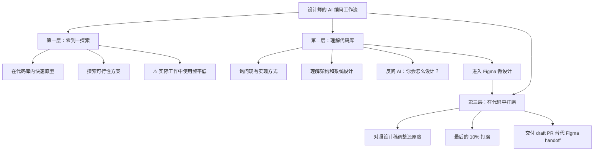

# 设计师的代码新工作流：当 AI 把「实现」的门槛拆掉之后

一句话导读：AI 编码工具不是让设计师「学写代码」，而是让代码成为设计的新媒介——理解这套逻辑的人，会在产品工作中获得结构性优势。

适合谁看：
- 想用 AI 编码工具但不知从何下手的产品设计师
- 需要频繁和工程师对齐还原度的设计从业者
- 好奇「设计师要不要学代码」这个问题在 AI 时代新答案的人
- 带 design-engineer 协作团队的团队管理者
- 任何非技术背景但想直接操作代码库的产品人

读完你会获得什么：
- 理解设计师使用 AI 编码工具的三大核心工作流
- 掌握从 Figma 到代码的完整落地路径
- 搞清楚什么时候该用 Figma、什么时候该用代码
- 学会用 CLAUDE.md 定制 AI 编码助手的行为
- 避开「AI 生成的紫色界面」等常见坑
- 建立一套可立即执行的 AI 辅助设计工作流

---

## 01 背景：为什么这个问题现在值得讨论

设计师和工程师之间有一条长期存在的缝隙：设计师在 Figma 里做出高保真方案，工程师在代码里实现它。中间的每一次传递都会失真——对齐差 2px、字号不对、间距被压缩、交互被简化。设计师发现了问题，但要改就得提 ticket、排优先级、等排期，或者尴尬地请工程师调几个像素。

更根本的问题在于：**设计方案的保真度上限被实现能力锁死了。** 设计师想验证一个方案好不好，最终要看它在真实产品里长什么样。但 Figma 原型再精致，也不是真实产品。代码才是产品的源文件。

过去五年，编码门槛骤降。AI 编码工具（如 Claude Code、Cursor）让非技术背景的人也能直接操作代码库。这改变的不是「设计师要不要学写代码」这个老问题——它改变的是：**代码现在可以成为设计师的工作媒介了。** 你不需要从零学 React，只需要知道怎么用 AI 工具在代码库里做你想做的事。

---

## 02 核心判断：代码不是工程师的领地，是产品的源文件

视频表面在讲「设计师怎么用 Claude Code」，实际在讲一个更深的判断：

**当代码的操作门槛被 AI 拆掉之后，设计师应该把代码当成和 Figma 同等的工作媒介。** 不是「学代码」，而是「用代码做设计」。区别在于：前者是把编程当成一门要掌握的学科，后者是把代码当成一种达成设计目标的工具。

这带来三个连锁变化：

1. **保真度跃迁**：Figma 原型是中等保真，工作代码是最高保真。能直接在代码里打磨，就不用再猜「实现出来会是什么样」。
2. **协作方式变化**：设计师不再只交付 Figma 文件，而是可以交付一个 draft PR——工程师看到的是一个已经跑起来的方向，而不是一堆静态截图。
3. **角色边界流动**：设计师、产品经理、工程师的职责不是消失了，而是变得可渗透。各自的判断权还在，但执行不再被角色锁死。

---

## 03 概念澄清：先把关键名词讲准确

### Claude Code

- 它是 Anthropic 推出的 AI 编码助手，运行在终端（CLI）中，能直接读写本地代码库、执行命令、运行开发服务器
- 它解决的核心问题：让 AI 不只在对话框里聊天，而是直接在你的代码仓库里操作
- 它不是 Claude AI（网页端聊天产品），也不是 Figma 插件
- 区别：Claude AI 是通用对话，Claude Code 是嵌入代码库的编码代理
- 例子：你在终端里打开 Claude Code，说「把首页的 header 改成左对齐」，它会直接找到对应文件并修改代码

### CLAUDE.md

- 它是一个 Markdown 文件，用来给 Claude Code 下达持久化指令——每次开启新对话时自动加载
- 它解决的核心问题：让 AI 的行为可定制、可复现，而不用每次重复说同样的话
- 它不是一次性 prompt，也不是代码注释
- 区别：一次性 prompt 是对话级的，CLAUDE.md 是项目级/用户级的持久配置
- 例子：在 CLAUDE.md 里写「你是为设计师服务的编码助手，请给出更详细的解释」，之后每次对话都会遵循

### MCP Server（Model Context Protocol）

- 它是一种协议，让 Claude Code 能连接外部工具和服务（如 Figma、Playwright）
- 它解决的核心问题：扩展 Claude Code 的能力边界，让它不只操作文件，还能读取设计稿、控制浏览器
- 它不是 API 调用，不是插件市场
- 区别：API 是程序间通信，MCP 是让 AI agent 统一接入各类工具的协议层
- 例子：连接 Figma MCP 后，Claude Code 可以直接读取你的设计稿并对照着改代码

### Auto Accept Edits 模式

- 它是 Claude Code 的一种工作模式，AI 修改代码后自动应用，不需要逐个确认
- 它解决的核心问题：减少反复确认的摩擦，让修改快速落地
- 它不是「盲目信任 AI」，用户仍可在修改完成后统一审查
- 区别：逐条确认模式适合不确定方向时，auto accept 适合方向明确、追求效率时
- 例子：你明确了要改的内容，打开 auto accept，Claude Code 连续改了 5 个文件，你最后统一检查 diff

### Planning Mode

- 它是 Claude Code 的另一种模式，AI 先输出修改计划，等用户确认后再执行
- 它解决的核心问题：让非技术用户理解 AI 要做什么、为什么做，避免方向跑偏
- 它不是对话模式，不是纯问答
- 区别：对话模式是聊天，planning mode 是结构化的执行方案
- 例子：你说「重新设计设置页面」，AI 先输出「步骤 1：修改路由，步骤 2：重构组件 X，步骤 3：更新样式」，你看完觉得 OK 再让它动手

---

## 04 整体框架：设计师的 AI 编码工作流

设计师使用 AI 编码工具的工作流可以分为三个层级，按使用频率和深度递增：

**文字解释：**

这个框架的核心不是「设计师要变成程序员」，而是**设计师的工作范围从「设计稿」向「实现层」扩展**。

- **第一层（零到一探索）**：在代码库里快速跑通一个想法。价值在于「在真实代码环境中验证」，比纯 Figma 原型更接近最终产品。但 Megan 提到，她在实际工作中很少用这层——更多用于个人项目。

- **第二层（理解代码库）**：这是最被低估的环节。在动手设计之前，先问 AI：现在这个功能是怎么实现的？架构是什么？系统 prompt 是什么？理解了实现层，设计方案才不会「空中楼阁」。Megan 说她 90% 的工作时间花在这层和第三层。

- **第三层（在代码中打磨）**：设计方案确认后，回到代码库做最后的还原度打磨。这是 Megan 在 Claude Code 里花时间最多的地方——对照设计稿，调对齐、调间距、调细节。最终交付物从 Figma 文件变成了 draft PR。

**关键洞察：很多人以为 AI 编码工具只在第四步（写代码）有用，但对非技术用户来说，前三步（探索、理解、规划）才是真正的杠杆。**

---

## 05 关键机制：设计师如何和代码库直接对话

### 机制一：Vision 驱动的代码修改

- **输入**：一张设计稿截图（从 Figma 导出 PNG，拖入 Claude Code 对话框）
- **处理**：Claude Code 用视觉能力识别截图中的布局、对齐、间距，与当前代码对比，定位差异
- **输出**：自动修改代码使实际页面逼近设计稿
- **为什么这样设计**：非技术用户不需要理解 CSS class 名或组件结构，只需要「让代码看着像这张图」
- **代价**：视觉比对是近似匹配，不是像素级还原；复杂布局可能需要多轮调整
- **适合场景**：还原度微调、对齐和间距修正
- **不适合场景**：需要精确定义交互逻辑、需要引用设计系统 token 的场景

### 机制二：Planning Mode 作为安全网

- **输入**：一个自然语言需求（如「重新设计设置页」）
- **处理**：Claude Code 先输出步骤分解和修改计划，等用户确认
- **输出**：结构化的执行计划，包含文件路径、修改内容、前后对比
- **为什么这样设计**：非技术用户无法直接看代码判断 AI 的修改是否正确，planning mode 让判断前置
- **代价**：增加了交互步骤，降低了修改速度
- **适合场景**：大型改动、不确定 AI 理解是否正确时、学习代码架构时
- **不适合场景**：简单的小改动（如改一个文案或颜色）

### 机制三：CLAUDE.md 作为行为定制层

- **输入**：在 CLAUDE.md 文件中写入持久化指令
- **处理**：每次新对话启动时，Claude Code 自动读取并遵循这些指令
- **输出**：AI 的回复风格、详细程度、默认行为被持续定制
- **为什么这样设计**：Megan 发现自己每次都要重复交代「我是设计师，请多解释」，于是把这些写进了 CLAUDE.md
- **代价**：指令之间可能冲突；过长的 CLAUDE.md 可能导致 AI 注意力分散
- **适合场景**：反复出现的工作偏好、角色设定、质量检查项
- **不适合场景**：一次性需求、需要动态调整的指令

---

## 06 方法拆解：设计师用 AI 编码工具的落地步骤

### 步骤一：搭建环境

- **目标**：能在本地跑起项目、用 Claude Code 操作代码库
- **具体动作**：
  1. 找一个工程师结对半天，让 ta 帮你配好本地开发环境（安装依赖、跑起开发服务器、配置 preview）
  2. 安装 Claude Code，用 `claude` 命令在项目目录下启动
  3. 用 `Ctrl+R` 让 Claude Code 在后台运行开发服务器，这样你可以一边改代码一边看效果
- **判断标准**：能在浏览器里看到本地跑起的应用，Claude Code 能成功读取和修改代码
- **常见坑**：跳过结对直接自己搞——不同项目的环境配置差异巨大，一个人硬啃可能浪费一整天
- **产出物**：一个可运行的本地开发环境 + 能正常工作的 Claude Code 会话

### 步骤二：建立代码库认知

- **目标**：在设计之前理解现有实现，不让方案脱离技术现实
- **具体动作**：
  1. 打开 Claude Code，提问：「这个功能目前是怎么实现的？」
  2. 追问细节：「它的架构是什么？」「系统 prompt 长什么样？」
  3. 反向提问：「如果让你重新设计，你会怎么做？」
- **判断标准**：你能用自然语言描述出功能的实现逻辑，而不仅仅是交互流程
- **常见坑**：跳过这步直接进 Figma——设计出来的方案可能技术上做不到或成本极高
- **产出物**：对现有架构的理解，一组可以在设计中参考的技术约束

### 步骤三：在 Figma 中完成核心设计

- **目标**：产出设计方案
- **具体动作**：正常使用 Figma 完成设计，和现有流程一致
- **判断标准**：设计方案经过评审、方向确认
- **常见坑**：在 Figma 里过度打磨细节——那些细节最后还是要到代码里再调一遍
- **产出物**：确认的 Figma 设计稿

### 步骤四：在代码中做还原度打磨

- **目标**：让实际产品逼近设计稿
- **具体动作**：
  1. 从 Figma 导出设计稿截图（PNG）
  2. 拖入 Claude Code 对话，说「请更新页面使其看起来更像这张图」
  3. 打开 Planning Mode，先看修改计划再执行
  4. 切换到 Auto Accept Edits 模式，批量应用修改
  5. 在浏览器中对照检查效果
- **判断标准**：实际页面和设计稿的视觉差异在可接受范围内
- **常见坑**：不用 Planning Mode 直接 Auto Accept——AI 可能修改了不该改的文件
- **产出物**：一个 draft PR，包含你的修改和描述

### 步骤五：交付和协作

- **目标**：把工作成果交给工程师推进
- **具体动作**：
  1. 提交 draft PR，在描述中写清楚你的意图和做了什么
  2. 标注哪些是你做到的、哪些需要工程师接手
  3. 请求工程师 code review
- **判断标准**：工程师能理解你的修改意图，并在其基础上继续开发
- **常见坑**：直接合并到主分支——永远让工程师 review，设计师不是代码的最终决策者
- **产出物**：一个有描述的 draft PR

### 步骤六：持续优化 CLAUDE.md

- **目标**：让 AI 越用越顺手
- **具体动作**：
  1. 每次发现重复性指令，用 `/memory` 命令写入 CLAUDE.md
  2. 定期审查和清理过时的指令
  3. 关键指令示例：「实现前先查看现有组件库」「每次修改后自动预览」
- **判断标准**：你的 CLAUDE.md 能让 AI 的默认行为贴近你的工作习惯
- **常见坑**：往 CLAUDE.md 里堆太多指令——指令冲突时 AI 行为不可预测
- **产出物**：一份持续维护的 CLAUDE.md 配置

---

## 07 案例讲解：从设计稿到 draft PR 的完整过程

**场景背景**：Megan 是 Claude Code 的设计师，需要把一个内部 demo 应用（CloudCafe）的界面还原度调到设计稿水平。

**遇到的问题**：开发服务器跑起来后，实际页面的 header 是左对齐的，图片对齐也有偏差——和 Figma 设计稿不一致。过去，她需要提 ticket 请工程师改，或者自己硬着头皮找 CSS 文件手动调。

**按框架如何处理**：

1. **搭环境**：在 Claude Code 中运行开发服务器（`Ctrl+R` 后台运行），在浏览器中预览应用。
2. **发现问题**：对比实际页面和设计稿，发现 header 对齐、图片排列等细节不一致。
3. **准备输入**：从 Figma 导出设计稿 PNG 到桌面。
4. **驱动修改**：把截图拖入 Claude Code，说「请更新 header 和图片对齐，使其看起来更像这张图」。
5. **审查计划**：Claude Code 输出修改计划——哪些文件要改、改什么。Megan 确认后切换到 Auto Accept 模式执行。
6. **检查结果**：在浏览器中刷新页面，对照设计稿检查。CSS 变更在 diff 中清晰可见。

**最终结果**：页面对齐问题修复，Megan 提交了一个 draft PR，工程师可以在她的基础上做最终检查和合并。

**说明了什么**：设计师不需要精通 CSS，也能在代码里做视觉还原度打磨。关键是：**找到差异 → 用视觉输入驱动 AI → 审查计划 → 验证结果。** 整个过程不涉及手写代码，但涉及对代码库的基本操作能力。

---

## 08 常见误区

**误区一：「设计师用 AI 编码工具 = 设计师要学写代码」**
- 错误理解：必须先学会编程才能用 AI 编码工具
- 为什么错：AI 编码工具的操作逻辑是「用自然语言描述意图，AI 执行」，核心能力是判断 AI 做得对不对，不是自己写代码
- 正确理解：你需要理解代码的基本概念（组件、样式、文件结构），但不需要从零学编程
- 应该怎么做：先用 Claude AI 的 Artifacts 功能体验「AI 生成代码」是什么感觉，再过渡到 Claude Code

**误区二：「AI 编码工具只适合写代码」**
- 错误理解：Claude Code 只能用来写功能代码
- 为什么错：对非技术用户来说，更大的价值在于理解代码库、探索方案、规划实现——这些是「编码前」的活动
- 正确理解：Claude Code 的核心场景包括理解现有实现、探索设计方向、规划修改步骤
- 应该怎么做：把 AI 编码工具当成「能读代码库的同事」，先问它问题，再让它动手

**误区三：「Figma 要被淘汰了」**
- 错误理解：有了 AI 编码工具就不需要 Figma 了
- 为什么错：大型改动、架构调整、快速探索视觉方案时，Figma 的效率仍然更高。代码修改有编译成本，Figma 拖拽是即时的
- 正确理解：Figma 和代码是两种保真度不同的工作媒介，各有适用场景
- 应该怎么做：1 分钟能在 Figma 里做完的视觉探索，别花 30 分钟在代码里做。但最终确认方案时，代码的保真度更高

**误区四：「Auto Accept = 盲目信任 AI」**
- 错误理解：开了 Auto Accept 就不用管了
- 为什么错：AI 可能修改了不该改的文件、引入了 bug、或偏离了你的意图
- 正确理解：Auto Accept 是减少摩擦的工具，不是替代审查。用它之前先在 Planning Mode 里确认方向，改完后再统一检查 diff
- 应该怎么做：先 Planning Mode 确认方向 → Auto Accept 执行 → 完成后检查 diff 和运行结果

**误区五：「AI 生成的设计就够用了」**
- 错误理解：让 AI 直接生成界面，不需要设计稿
- 为什么错：AI 生成的界面风格高度趋同（紫色渐变、圆角卡片、通用布局），缺乏品牌识别度和设计系统一致性
- 正确理解：AI 适合基于现有设计系统做实现，不适合凭空生成视觉方案
- 应该怎么做：给 AI 提供参考图——现有页面的截图、你喜欢的网站截图——让它基于参考做实现，而不是从零生成

**误区六：「设计师可以直接合并代码到生产环境」**
- 错误理解：我能改代码了，所以我可以直接推到生产
- 为什么错：代码修改需要工程师 review，这是质量保障的底线。Megan 自己也因为推代码到生产导致过 incident
- 正确理解：设计师可以做修改、提 PR，但最终审查和合并的决策权在工程师
- 应该怎么做：永远提 draft PR，永远请求 code review，把自己当成「能写代码的贡献者」而非「代码的决策者」

**误区七：「CLAUDE.md 写一次就不用管了」**
- 错误理解：配置好 CLAUDE.md 就一劳永逸
- 为什么错：工作流在变、AI 在升级、指令之间可能冲突。Megan 自己也反复调整——比如曾经让 AI 每次修改后自动预览，后来觉得太重就删了
- 正确理解：CLAUDE.md 是活文档，需要根据实际体验持续迭代
- 应该怎么做：每周检查一次 CLAUDE.md 的效果，删掉不再有用的指令，补充新发现的偏好

---

## 09 实战清单

### 立即能做

1. **打开 Claude AI，用 Artifacts 功能生成一个简单的页面组件**——感受「自然语言→代码」的工作方式
2. **找到你团队的一个工程师，约 30 分钟聊天**——问 ta 你们项目的本地开发环境怎么搭、代码怎么推、review 流程是什么
3. **在你的项目代码库中打开 Claude Code，问它：「这个功能目前是怎么实现的？」**——不写任何代码，只做理解

### 一周内能做

4. **搭好本地开发环境，跑起项目**——请工程师结对完成，不要自己硬啃
5. **创建你的个人 CLAUDE.md 文件**——写入角色设定（「我是设计师」）和第一条工作偏好（如「修改前先看现有组件库」）
6. **做一个还原度微调实验**：从 Figma 导出一张截图，拖入 Claude Code，让它帮你调对齐。对比修改前后的 diff
7. **学习三个关键快捷键**：Shift+Tab（切换 Planning/Auto Accept 模式）、Escape（中断 AI 操作）、双击 Escape（回看并修改上一条指令）

### 长期要沉淀

8. **建立「Figma vs 代码」的决策框架**：记录每次选择 Figma 或代码的原因，一个月后回顾，形成自己的判断标准
9. **迭代你的 CLAUDE.md**：每两周检查一次，删除过时指令，补充新的工作偏好，确保指令之间不冲突
10. **培养代码审查能力**：每次 AI 修改代码后，花 5 分钟读 diff，逐渐理解修改了什么、为什么这样改。这是长期最有价值的投资
11. **把 draft PR 纳入交付流程**：和工程师团队达成共识——设计师的交付物从「Figma 文件」扩展到「Figma 文件 + draft PR」

---

## 10 总结

AI 编码工具给设计师带来的变化，不是「你终于可以写代码了」，而是「代码终于可以成为你的工作媒介了」。这个区别很重要。前者把编码当成一门要苦学的学科，后者把代码当成一种可以即取即用的工具。

Megan 的工作流揭示了一个清晰的结构：先用 AI 理解代码库（设计前的技术约束），再用 Figma 做方案（设计本身），最后回到代码做还原度打磨（设计后的实现校准）。三个环节里，AI 的角色分别是技术顾问、设计工具之外的选择、和执行助手。最被忽视的往往是第一个环节——在设计之前理解实现，这是让方案「落得了地」的前提。

角色边界在流动，但判断权没变。设计师可以提交代码，工程师仍然是 code review 的决策者。产品经理可以写原型，设计师仍然是体验的把关人。AI 拆掉的是执行的墙，不是责任的墙。

**一个判断：在 AI 编码工具普及之后，「能操作代码」会从工程师的专属技能变成产品团队的基础能力。就像十年前「能做原型」从交互设计师的专属技能变成了产品经理的基础能力一样。** 早一步建立这套工作流的人，会在协作效率和设计影响力上获得结构性优势——不是因为你会写代码，而是因为你能在代码的保真度上做设计判断。
