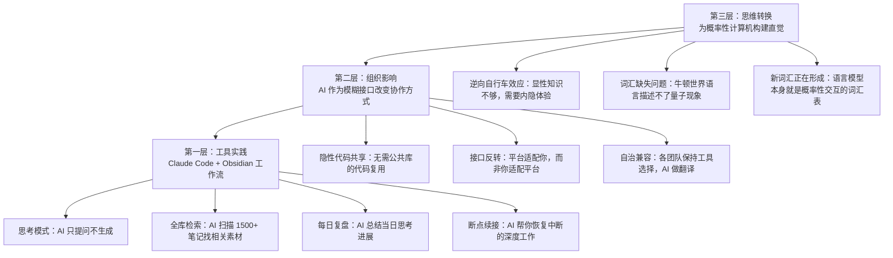

# 把 AI 当思考伙伴，而非生成器：Noah Brier 的 Claude Code 第二大脑实践

# 一句话导读

多数人把 AI 当打字机用——你下指令，它出活；但真正的高手把它当对话者——你不急着要结果，它帮你把想法磨得更锋利。

# 适合谁看

- 已经在日常使用 AI 写代码或写文章，但觉得产出"有量无质"的人
- 用 Obsidian 或类似笔记工具做知识管理，想接入 AI 但不知如何组织工作流的人
- 在大公司负责 AI 落地，被"统一平台 vs 各团队自治"的矛盾困扰的管理者
- 关注 AI 对教育和思维方式影响，想跳出"AI 抢饭碗 vs AI 无用论"二元对立的思考者
- 想在手机上做深度工作（不只是回消息），但苦于没有合适方案的人

# 读完你会获得什么

- 区分"思考模式"和"写作模式"，知道什么时候该让 AI 闭嘴、只负责提问
- 理解一套完整的 Obsidian + Claude Code 工作流：从项目文件夹结构到每日复盘
- 掌握在手机上运行 Claude Code 的技术方案（家庭服务器 + Tailscale VPN + 终端 App）
- 理解 AI 作为"模糊接口"为什么能绕过传统企业软件的整合困境
- 获得一套关于"如何为概率性计算机构建直觉"的思维框架
- 一份可直接照做的行动清单

---

## 01 背景：为什么这个问题现在值得讨论

AI 工具已经渗透到大多数知识工作者的日常。但一个普遍的挫败感是：你让 AI 写东西，它写出来的总差点意思；你让它帮你想，它却急着给你一个成品。

这个挫败感的根源不是模型能力不够，而是使用方式错了。我们把 AI 当成了"更快的打字机"，而不是"更聪明的对话者"。

Noah Brier 的实践指向一个被严重低估的事实：**AI 最强的能力不是生成，是阅读。** 我们每天"想事情"的频率远高于"出成品"的频率。如果你只会用 AI 来出成品，你只用了它 10% 的价值。

与此同时，另一个变化正在发生：AI 作为一种"模糊接口"，正在改变软件系统整合的基本逻辑——从"你必须适配我的接口规范"变成"我适配你的任何格式"。这对企业软件、团队协作、甚至组织架构都有深远影响，而大多数人的直觉还停留在确定性计算的时代。

---

## 02 核心判断：AI 的价值不在"替你写"，而在"陪你想"

这个视频表面在讲 Claude Code + Obsidian 的工具链，实际在讲一个更根本的问题：**和 AI 协作的正确姿态是什么？**

Noah 反复强调一个区分——"思考模式"和"写作模式"。在思考模式下，你要做的第一件事是告诉 AI：**不要帮我写任何东西。** 只提问，只整理，只帮我看见我自己没看见的东西。

这不是一个技巧，而是一个元原则。它背后有两个洞察：

1. **AI 的阅读能力被严重低估。** 它可以读完你 1500 篇笔记，找出和你当前项目相关的所有素材。这件事人做不了，但 AI 做得到，而且做得好。
2. **AI 的生成倾向被过度放纵。** 所有模型都有"助手人格"——你一开口，它就想给你一个成品。这种倾向对思考是破坏性的。你必须主动压制它，才能把 AI 变成真正的思考伙伴。

---

## 03 概念澄清：先把关键名词讲准确

### 思考模式（Thinking Mode）

- **它是什么**：一种和 AI 协作的状态，你明确要求 AI 不生成任何成品，只通过提问、梳理、归纳来帮你推进思考
- **它解决什么问题**：防止 AI 在你还没想清楚时就替你做决定，输出看似完整实则空洞的内容
- **它不是什么**：不是让 AI "慢慢来"，不是降低期望，不是拖延——是改变协作的输入输出契约
- **和相关概念的区别**：写作模式（Writing Mode）是让 AI 基于你的指令产出文章、代码等成品；思考模式是让 AI 基于你的素材产出更好的问题
- **简单例子**：你在准备一场演讲。思考模式下，你把已有素材丢给 AI，说"找出我没想到的盲点"；写作模式下，你说"帮我写一段关于 X 的结论"

### 模糊接口（Fuzzy Interface）

- **它是什么**：AI 可以接受非标准化的输入，理解不同格式的数据，并在不同系统之间做翻译——不需要预先定义严格的接口规范
- **它解决什么问题**：传统软件整合要求双方遵守同一接口契约，这导致大量适配成本和组织摩擦；AI 可以"适配任何一端"
- **它不是什么**：不是没有接口，不是随意通信——是有接口，但接口是模糊的、可协商的
- **和相关概念的区别**：API 是严格契约（你按我的格式来）；模糊接口是 AI 充当翻译层（你们按各自的格式来，我来理解）
- **简单例子**：ChatGPT 插件规范——你只需在项目根目录放一个 manifest.json，描述你希望怎么接收数据、怎么返回数据，AI 平台来适配你，而不是你适配平台

### 隐性代码共享（Tacit Code Sharing）

- **它是什么**：不同团队不通过抽象公共库来共享代码，而是让 AI 阅读一个团队的实现，在另一个团队的技术栈中重新实现相似逻辑
- **它解决什么问题**：传统代码复用要求先抽象模块、建公共库、统一技术栈——这些工作成本高、成功率低；AI 让"看懂别人怎么做"和"在自己的环境里做类似的事"之间的距离大幅缩短
- **它不是什么**：不是代码复制粘贴，不是 fork 修改——是理解意图后的重新实现
- **和相关概念的区别**：传统代码复用 = 写库 → 引入库；隐性代码共享 = AI 读源码 → AI 在目标环境重写
- **简单例子**：Noah 的团队做文件搜索功能，先在产品 A（Sparkle）实现了，后来产品 B（Para）也需要。传统做法是抽象成公共库；实际做法是让 B 的开发者加入 A 的 repo，让 Claude Code 看懂实现，在 B 的技术栈里做自己的版本

### 概率性直觉（Probabilistic Intuition）

- **它是什么**：对非确定性系统的运作方式建立直觉——理解同一个问题可能得到不同答案、模糊输入可以产生有效输出
- **它解决什么问题**：我们几十年积累的软件工程直觉全部建立在确定性计算之上，面对 AI 时这些直觉会系统性地误导我们
- **它不是什么**：不是"AI 不可控所以随便用"——恰恰相反，是需要一套新的可控性理解
- **和相关概念的区别**：确定性直觉 = 相同输入必然相同输出；概率性直觉 = 相同输入可能不同输出，但统计上可控
- **简单例子**：Veritasium 的反向转向自行车——把车把左转锁死右转、右转锁死左转。你"知道"怎么骑自行车，但这个知识是内隐的，不是显性的。面对 AI 也是如此：你必须亲自用，才能建立直觉

---

## 04 整体框架：这套内容应该如何理解

Noah 的实践可以拆成三层，从工具层到思维层：

**文字解释**：

最底层是**工具实践**——具体的 Obsidian + Claude Code 工作流，包括四个核心操作：思考模式对话、全库检索、每日复盘、断点续接。

中间层是**组织影响**——AI 作为模糊接口，改变了软件整合和团队协作的基本假设。不再需要统一平台、统一技术栈，AI 可以在不改变各方工作方式的前提下充当翻译层。

最上层是**思维转换**——从确定性计算的直觉体系，转向概率性计算的直觉体系。这不是"换工具"，而是"换世界观"。这个过程没有捷径，只有亲自实践才能完成。

三层的关系：工具实践是入口，组织影响是放大器，思维转换是终点。你从"怎么用"开始，逐渐理解"这改变了什么组织逻辑"，最终发现"这要求我重新理解计算本身"。

---

## 05 关键机制：它到底是怎么运行的

### 机制一：Obsidian + Claude Code 的"全库思考伙伴"

**输入**：Obsidian 整个 vault 目录（1500+ 篇 markdown 笔记），加上你的当前项目文件夹（含研究素材、聊天记录、PDF、每日笔记等）

**中间处理**：
1. Claude Code 在 Obsidian vault 的根目录启动（不是在子文件夹），拥有对全部笔记的访问权
2. 你在项目 frontmatter 中声明"思考模式"——明确告诉 AI 不要生成成品
3. AI 扫描全库，找出与当前项目相关的已有笔记，自动归入研究文件夹
4. 你和 AI 对话，AI 提问、追问、标注盲点，并把对话中的关键洞察写入每日进展笔记
5. 每天结束时，AI 汇总当日所有新增笔记，写一份"当日进展摘要"

**输出**：不是一篇文章或一段代码，而是一份逐步深化的思考档案——包括 AI 提出的问题、你发现的关联、尚未成型的假设、以及每日进展摘要

**为什么这样设计**：把 AI 放在 vault 根目录而非项目子目录，是因为好的思考需要跨项目联想。你在准备演讲时想到的关联，可能来自三个月前读的一篇笔记。如果 AI 只能看到当前项目，这种联想就断了。

**代价**：全库访问意味着 AI 可能拉入"看起来相关但实际不相关"的内容。Noah 坦承这一点，但认为在自己这个场景下问题不大——因为他让 AI 找的是已标注的素材（比如"简单破坏手册"相关笔记），而非做抽象概念匹配。

**适合**：有长期笔记积累、项目之间有交叉关联的知识工作者

**不适合**：笔记很少（全库检索没有意义）、或项目间完全独立（跨项目联想无价值）的场景

### 机制二：手机端 Claude Code——家庭服务器方案

**输入**：一台家庭 Mini PC + Tailscale VPN + Termius 终端 App + Git 同步的 Obsidian vault

**中间处理**：
1. Mini PC 上运行 Tailscale，创建个人 VPN 网络
2. 手机通过 Termius 连入 VPN，SSH 到 Mini PC
3. Mini PC 上有 Git 同步下来的 Obsidian vault
4. 在终端中启动 Claude Code，直接操作 vault 中的笔记和代码

**输出**：在手机上获得完整的 Claude Code 体验——包括对话、文件读写、代码修改、Agent 调用，和电脑端完全一致

**为什么这样设计**：手机是多数人随身携带的设备，但手机上做深度工作（写作、编程、研究）几乎不可能。Noah 的方案绕过了这个限制——手机只是终端显示器，真正的计算发生在家里服务器上。

**代价**：需要一定的技术配置能力（Linux 管理、VPN 设置、Git 同步）；依赖网络连接；手机键盘输入仍然不便（语音模式是补充方案）

**适合**：经常外出但需要处理深度工作、不想等回到电脑前才能开始的技术从业者

**不适合**：对服务器运维没有基础、或主要工作场景在固定办公桌前的人

### 机制三：AI 作为"模糊接口"的企业整合逻辑

**输入**：多个团队使用不同工具、不同技术栈、不同工作流——但产出的是"数据"（文档、代码、配置、日志），数据格式各异但语义可理解

**中间处理**：AI 不要求各方统一格式，而是理解每种格式的语义，充当翻译层

**输出**：各团队保持原有工作方式，但通过 AI 实现跨团队的代码复用、知识流通和流程协同

**为什么这样设计**：传统企业软件整合的核心难题不是技术，是"采纳和变更管理"——强制统一平台总让 2/3 的人不满意。AI 的模糊接口能力让"不统一也能协同"成为可能。

**代价**：AI 翻译不是 100% 可靠的；隐性代码共享不如公共库那样有明确版本管理和测试保障；目前还处于早期阶段，缺乏成熟的最佳实践

**适合**：中小规模团队（几十人）、技术栈多样、愿意接受"足够好"而非"完美"的整合

**不适合**：对正确性有极严要求的核心系统（金融交易、医疗设备等）

---

## 06 方法拆解：如果自己要做，应该怎么落地

### 步骤一：搭基础设施

**目标**：让 Claude Code 能访问你的完整笔记库

**具体动作**：
1. 确保你的笔记在 Obsidian vault 中，全部是 markdown 格式
2. 将 vault 初始化为 Git 仓库，推送到 GitHub 私有仓库
3. 在 vault 根目录创建 `package.json`，添加自定义 Claude Code 命令（可选但推荐）
4. 在 vault 根目录启动 Claude Code

**判断标准**：Claude Code 启动后，能执行 `ls` 看到你的 vault 全部文件夹结构

**常见坑**：在项目子目录而非根目录启动 Claude Code——这会限制 AI 的全库检索能力

**产出物**：一个 Claude Code 可以完整访问的 Obsidian vault

### 步骤二：为项目建立"思考模式"工作流

**目标**：让 AI 成为你当前项目的思考伙伴，而不是代笔

**具体动作**：
1. 在 vault 中创建项目文件夹，包含以下子目录：
   - `research/` — 相关素材（PDF、文章、聊天记录转存）
   - `chats/` — 你在其他 AI 工具中的对话全文（用 Obsidian Web Clipper 抓取）
   - `daily-progress/` — 每日思考进展摘要
   - `conclusions/`（或其他项目特定的产出文件）
2. 在项目入口文件的 frontmatter 中写入：`"Do not write anything. Only gather, organize, and ask questions."`
3. 启动 Claude Code，指令：扫描全库，找出和本项目相关的已有笔记，归入 `research/`
4. 切换到"思考伙伴"Agent（Noah 使用 Claude Code 的 subagent 功能），开始对话

**判断标准**：AI 的第一次回复是提问，而不是成品。如果 AI 直接输出文章大纲或段落，说明你的指令不够强——重新强调"思考模式"

**常见坑**：AI 在对话中途偷偷切换到生成模式——你会感觉到它开始"写东西"而不是"问东西"。一旦发现，立即打断，重新声明约束

**产出物**：一份逐步积累的研究档案 + AI 提出的问题清单 + 你的回应记录

### 步骤三：建立每日复盘习惯

**目标**：不让任何一天的思考白费

**具体动作**：
1. 每天结束工作时，让 AI 汇总当日所有新增笔记
2. 指令："回看今天的研究进展，写出三条最重要的发现、两个仍需解答的问题、一个可能的关联"
3. 将 AI 的摘要写入 `daily-progress/` 对应日期的文件

**判断标准**：第二天你回来时，问 AI"过去三天的进展是什么"，它能在 30 秒内给你一份有信息量的摘要

**常见坑**：把每日复盘写成流水账——要聚焦"发现"和"问题"，不是"我做了什么"

**产出物**：一份可以随时回溯的思考日志

### 步骤四：设置断点续接

**目标**：中断后能快速恢复深度工作状态

**具体动作**：
1. 你中断工作时不需要做任何特别的事——AI 已经在每日进展笔记中记录了你的思考轨迹
2. 恢复工作时，指令："帮我回顾过去 X 天关于这个项目的研究，我上次卡在什么地方？"
3. AI 会读取相关文件，告诉你上次思考到哪里、哪些问题还没回答、哪些线索还没追

**判断标准**：恢复工作后，5 分钟内进入"我上次想到哪里了"的状态，而不是 30 分钟在翻旧笔记

**常见坑**：以为 AI 的上下文窗口能记住所有历史——实际上它会遗忘。断点续接依赖的是文件系统中的记录，不是对话历史

**产出物**：一个无缝的"中断-恢复"循环

### 步骤五：（可选）搭建手机端访问

**目标**：在任何地方通过手机使用完整的 Claude Code

**具体动作**：
1. 购置一台 Mini PC（任何能跑 Linux 的低功耗设备即可）
2. 安装 Tailscale，创建个人 VPN
3. 将 Obsidian vault 通过 Git 同步到 Mini PC
4. 手机安装 Termius（或其他 SSH 终端 App）
5. 通过 VPN 连接到 Mini PC，启动 Claude Code

**判断标准**：在手机上打开 Termius，能在 30 秒内进入 Claude Code 对话界面，并能访问你的完整 vault

**常见坑**：忘记配置 Tailscale 的访问控制——VPN 应该只有你自己能连入；Mini PC 上的 Git 仓库忘了 pull 最新代码

**产出物**：一个可以从手机随时访问的 Claude Code 实例

---

## 07 案例讲解：用 Noah 的演讲准备过程串起来

**场景背景**：Noah 要在两周后的一场营销+AI 会议上做演讲。他已有几个零散的想法，但还没有完整的演讲结构。

**遇到的问题**：
- 他有一个核心案例（二战时期的《简单破坏现场手册》），和 AI 时代官僚主义的关联
- 他有一个未成型的概念（"Transformers are reading the world"——大模型正在替代专用系统）
- 他刚读了 Wild Bill Donovan（OSS 创始人）的传记，感觉和主题有关但说不清怎么关联
- 他在不同工具（ChatGPT、Claude、Grok）中和 AI 聊过这些话题，对话散落各处
- 他有全职工作，每天只能花碎片时间思考

**按框架如何处理**：

**第一步：收集素材**。在 Obsidian 中创建项目文件夹。用 Web Clipper 把散落在各处的 AI 对话记录抓进 `chats/` 文件夹。把相关文章和 PDF 放进 `research/`。启动 Claude Code 扫描全库——AI 在 1500 篇笔记中找到了和他主题相关的旧笔记，自动归入研究文件夹。

**第二步：进入思考模式**。在 frontmatter 中明确声明：不要写任何东西。切换到"思考伙伴"Agent。AI 开始提问："你提到 Transformers 正在替代专用系统——你最想强调的是效率提升，还是组织变革？" Noah 回应，AI 追问，对话持续深入。

**第三步：跨线索关联**。Noah 把 Wild Bill Donovan 的研究带进来。AI 帮他看到一个可能的连接：Donovan 打造的 OSS 强调"边缘自主"——前线特工有独立行动能力，只需要在大的指挥框架内运作。这和 Transformer 从"顺序处理"到"并行注意"的架构转变有结构上的相似性。Noah 把这个半成品想法记下来，标注"工作进行中"。

**第四步：每日复盘**。当天结束时，AI 汇总了所有新增笔记，写了一份摘要：最大的突破是"官僚主义作为位置编码"（Bureaucracy as Positional Encoding）这个类比——官僚主义像 Transformer 中的位置编码一样，给系统提供结构，但这个结构在 AI 时代可能不再必需。第二天 Noah 回来，问 AI"昨天的进展"，5 分钟内恢复上下文。

**第五步：手机端继续**。Noah 送完孩子上学后，在早餐桌旁打开手机上的 Termius，通过家庭服务器上的 Claude Code 继续研究。他在车上用 Grok 语音模式深入讨论 Walter Benjamin 的《机械复制时代的艺术作品》——这个素材也被转录后加入研究文件夹。

**最终结果**：两周后，Noah 有了一份完整的研究档案，包含跨线索的关联、AI 提出的关键问题、每日思考进展、以及几个正在成型的核心论点。他还没有写出演讲稿，但"思考"已经完成——写作只是把已经想清楚的东西落下来。

**说明了什么**：这个案例展示了"思考模式"的核心价值。如果 Noah 一开始就让 AI "帮我写一篇关于 AI 和官僚主义的演讲稿"，他会得到一篇看起来完整但空洞的文章。通过刻意压制 AI 的生成冲动、让它只负责提问和整理，他获得的不是一篇稿子，而是一套比自己一个人想得更深、更广的思维地图。

---

## 08 常见误区：很多人会在哪里理解错

**误区一：AI 的核心能力是生成内容**

- **错误理解**：AI 最大的价值是帮写文章、写代码、写邮件
- **为什么错**：Noah 的经验说明，AI 的阅读能力在日常使用中比生成能力更有价值。你每天"想事情"的频率远高于"出成品"的频率
- **正确理解**：AI 最被低估的能力是阅读——快速消化大量文本、找出关联、提出问题
- **应该怎么做**：先问"AI 能帮我读什么"，再问"AI 能帮我写什么"

**误区二：让 AI 辅助思考就是让它写大纲**

- **错误理解**：思考模式 = 让 AI 先写个大纲，我再改
- **为什么错**：大纲是成品，不是思考。AI 写大纲的时候，它已经替你做了最重要的判断——"什么是重要的、什么不是"。这个判断恰恰是你不该外包的
- **正确理解**：思考模式 = AI 提问，你回答；AI 整理，你判断；AI 指出盲点，你决定方向
- **应该怎么做**：如果你发现 AI 在生成内容而不是提问，打断它，重新声明约束

**误区三：全库检索意味着 AI 能理解"什么是相关的"**

- **错误理解**：让 AI 在 1500 篇笔记中"找相关内容"，它就能精准判断什么对我有价值
- **为什么错**：AI 做语义匹配的能力有限，尤其在概念层面。它可能拉入"提到了同一个词"但"和你的论点无关"的内容
- **正确理解**：全库检索在素材层面很可靠（找提到"简单破坏手册"的所有笔记），在概念层面需要你把关
- **应该怎么做**：让 AI 做具体的、可验证的检索（搜索关键词、过滤时间范围），而不是抽象的"找出一切相关的"

**误区四：AI 会自动适配你的工作方式**

- **错误理解**：AI 很聪明，你随便用就行，它会理解你的意图
- **为什么错**：所有主流模型都有强烈的"助手机器人"人格——它们默认你想让它做事。如果你不显式声明"不要做"，它就会做
- **正确理解**：AI 的默认行为是生成。你必须主动、反复、明确地告诉它你的约束
- **应该怎么做**：在 frontmatter 中写约束，在对话中重申约束，发现 AI 偏离时立即纠正

**误区五：AI 时代的代码复用仍然是"抽象公共库"**

- **错误理解**：要复用代码，就必须建公共库、做抽象、统一技术栈
- **为什么错**：这假设了代码复用的唯一路径是"人读人写"。AI 可以直接读源码理解意图，在另一个技术栈里重写——不需要中间的抽象层
- **正确理解**：AI 时代存在"隐性代码共享"——不用建库，也能复用
- **应该怎么做**：让 AI 阅读已有实现，理解意图后在目标环境重新实现。不是复制粘贴，是翻译重写

**误区六：已经有软件工程经验的人更容易用好 AI**

- **错误理解**：有多年编程经验的人天然更擅长使用 AI
- **为什么错**：Noah 用了一个精准的类比：Veritasium 的反向转向自行车。"知道怎么骑自行车"和"会骑反向转向的自行车"是两套完全不同的直觉。同样，确定性计算的直觉在概率性计算中会系统性地误导你
- **正确理解**：经验越深，可能越需要主动"卸载"旧直觉。ChatGPT 插件规范让 Noah 意识到，他的整个职业生涯积累的软件整合直觉被"180度翻转"了
- **应该怎么做**：不要相信你对 AI 的推理——去用，去体验，从实践中重建直觉

**误区七：Vibe coding 热潮是泡沫**

- **错误理解**：vibe coding 公司估值过高，所以这件事是泡沫
- **为什么错**：Noah 的判断是：如果一个工具能让一个 10 岁的孩子独立开发一个可用的 App（他的女儿用 v0 做了 75 轮迭代），那这件事的基础价值是真实的，和任何公司的估值无关
- **正确理解**：估值可能是泡沫，但能力不是。区分"资本市场定价"和"技术实际价值"
- **应该怎么做**：关注"谁在使用"和"他们能做什么以前做不到的事"，而不是关注估值和融资新闻

---

## 09 实战清单：读完后可以马上照着做

### 立即能做

1. **在下次和 AI 对话时，先写一句约束**："我现在在思考模式，不要生成任何成品，只提问和整理。" 看看对话质量的变化
2. **找一个你正在思考但还没动笔的项目**，把相关素材（文章、笔记、聊天记录）集中到一个文件夹，让 AI 扫描后提问
3. **今天结束时，让 AI 回看你今天的对话，写三条"当日发现"**——启动你的每日复盘习惯
4. **检查你目前用 AI 最多的三个场景**，统计一下：其中几个是"让它读"，几个是"让它写"？如果写远多于读，调整比例

### 一周内能做

5. **在 Obsidian vault 根目录启动 Claude Code**（或其他支持文件操作的 AI 工具），让 AI 做一次全库检索，找出你遗忘的、可能和当前项目相关的旧笔记
6. **抓取 2-3 段你在其他 AI 工具中的对话**（用 Web Clipper 或手动复制），集中到一个 `chats/` 文件夹——让跨工具的思考轨迹不再散落
7. **设计一个简单的项目文件夹结构**：research / chats / daily-progress / + 一个入口文件（含思考模式约束声明），用于你的下一个深度项目
8. **试一次 Grok 语音模式**（如果你有 X Premium），在一次开车或散步时用它研究一个你一直想深入的问题——体验"为你定制的播客"

### 长期要沉淀

9. **搭建手机端 Claude Code 访问**：Mini PC + Tailscale + Termius，实现在任何地方做深度工作的能力
10. **为你的 Obsidian vault 创建 `package.json`**，定义常用 Claude Code 命令——逐步将你的重复操作自动化
11. **建立"断点续接"工作流**：每天结束前让 AI 写进展摘要，第二天恢复时让 AI 回顾——让碎片化时间不再等于碎片化思考
12. **识别你所在组织中的"模糊接口"机会**：哪些地方不同团队因为工具不统一而无法协同？AI 是否可以在不改变各方工具选择的前提下充当翻译层？

---

## 10 总结：把全文收束成一个判断

Noah Brier 的实践指向一个正在被验证的方向：AI 最重要的角色不是"替你做事的人"，而是"让你想得更清楚的人"。这个区分看似微妙，实际决定性地影响你从 AI 中获得的价值量级。

从工具层面，这意味着你需要一个让 AI 能访问你全部知识库的架构——全库检索、每日复盘、断点续接，每一环都服务于同一个目标：让思考不被遗忘、不被中断、不被 AI 的生成冲动带偏。

从组织层面，AI 作为"模糊接口"正在瓦解一个长期存在的假设——协作需要统一工具。传统企业软件的采纳困境，根源不是技术，是人不愿意改变工作方式。AI 提供了一条绕路：不改变任何人，在中间做翻译。

从思维层面，我们面对的是一个更深层的问题：几十年确定性计算训练出的直觉，在概率性计算面前系统性地失效。Veritasium 的反向自行车、量子物理的词汇缺失、ChatGPT 插件规范的接口反转——这些都在说同一件事：知道不等于会做，理解不等于直觉。唯一的路是亲自用，反复用，在用中重建判断力。

**核心判断：AI 时代的竞争力不取决于你能让 AI 生成多好的东西，而取决于你能不能让 AI 把你自己想得不够清楚的事情变得更清楚。前者会越来越廉价，后者会越来越值钱。**
