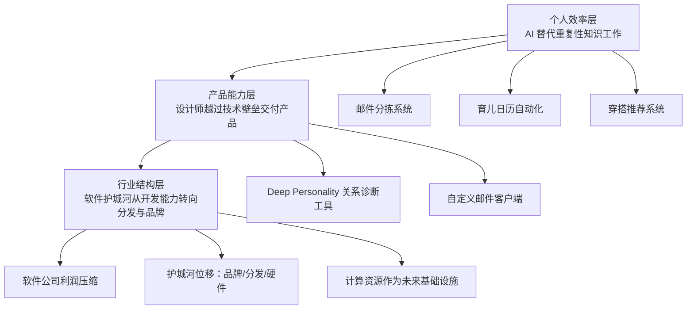

# 当"不会写代码"不再是借口：一个设计师用 Claude Code 重建工作流的真实记录

**一句话导读：** 一个从未写过代码的设计师，用 Claude Code 在两周内构建了关系诊断工具、邮件客户端、穿搭推荐系统和育儿日历——这不是工具教程，而是一份关于"创意人如何越过技术壁垒直接交付产品"的实战报告。

**适合谁看：**
- 有产品想法但卡在"不会写代码"上的设计师、产品经理、内容创作者
- 正在评估 AI 编程工具是否真的能替代传统开发流程的创业者
- 想理解"设计师+AI"到底能产出什么的团队负责人
- 对软件行业护城河变化感兴趣的投资者和从业者
- 已经开始用 AI 编程但还在"hello world"阶段、想看到真实复杂度案例的人

**读完你会获得什么：**
- 理解 Claude Code 相比早期 vibe coding 工具（如 Replit）的本质进步在哪里
- 掌握设计师从"只能出图"到"端到端交付"的具体路径和关键节点
- 能区分"AI 能自动完成的开发任务"和"仍然需要人工审查的环节"
- 理解软件行业护城河正在从"开发能力"转向"品牌/分发/硬件"的底层逻辑
- 获得 5 个可直接模仿的 AI 自动化工作流案例（邮件、穿搭、育儿、关系诊断、会议分析）
- 识别 AI 辅助决策的核心风险——确认偏误、上下文缺失、过度解读

---

## 01 背景：为什么这个问题现在值得讨论

两年前，Replit 等 vibe coding 工具已经让人看到了"用自然语言写软件"的可能性。但实际体验像"用 Palm Treo 看到了智能手机的未来"——概念对，产品不对。代码经常进入 bug 循环，意图理解偏差大，复杂任务无法持续执行。

Claude Code + Opus 4.5 改变了这个局面。它的核心进步不是"更聪明"，而是三个具体的工程能力突破：能长时间持续执行任务而不跑偏；能理解系统级操作（文件系统、环境配置、MCP 协议）；同时在编程能力和人类意图理解之间找到了平衡——其他模型在编程变强的同时往往在"人味"上退步。

这直接解锁了一个新人群：设计师和创意人。他们一直有完整的审美判断、用户体验知识和产品思维，但缺少"最后一公里"的执行能力。现在这最后一公里被 AI 填补了。

---

## 02 核心判断：视频真正想讲的不是"Claude Code 好用"

视频表面上在展示各种 AI 自动化案例，但底层真正在讲的是：

**软件行业的价值链正在重组。开发能力从"稀缺资源"变成"基础设施"，导致护城河的位置发生了位移。**

过去软件公司的护城河是：开发难 → 开发者贵 → 竞争对手少 → 利润高。现在开发容易 → 开发者便宜 → 竞争对手暴增 → 利润被压缩。护城河必须转移到品牌、分发渠道、硬件锁定或独特数据上。

这个判断的推论是：对个人而言，"会写代码"这个技能的溢价正在快速衰减；而"知道该做什么"（产品判断、用户洞察、审美品味）的溢价正在上升。设计师从"只能出图"到"端到端交付"的转变，正是这个趋势的缩影。

---

## 03 概念澄清：先把关键名词讲准确

### Vibe Coding

- **它是什么**：用自然语言描述需求，让 AI 生成代码的编程方式
- **它解决什么问题**：让不会写代码的人能构建软件
- **它不是什么**：不是"不需要思考的编程"——你仍然需要精确的产品判断和架构思维
- **和相关概念的区别**：传统编程是你写代码告诉计算机怎么做；vibe coding 是你描述想要什么，AI 决定怎么做。区别在于"执行层"被自动化了，但"决策层"没有
- **例子**：说"帮我做一个邮件分类界面，按优先级排序，支持快捷回复"就能得到一个可用的 web 应用

### Claude Code

- **它是什么**：Anthropic 推出的命令行 AI 编程工具，能访问文件系统、运行命令、配置 MCP 服务
- **它解决什么问题**：传统 AI 编程助手只能生成代码片段，Claude Code 能执行完整的开发工作流——从环境搭建到部署
- **它不是什么**：不是 IDE 插件，不是代码补全工具，而是一个能操作你整个系统的编程 agent
- **和相关概念的区别**：Cursor/Copilot 是"辅助你写代码"，Claude Code 是"替你执行开发任务"
- **例子**：给 Claude Code 你的 Gmail 凭证，描述你的邮件处理逻辑，它能从零构建一个自定义邮件客户端

### MCP (Model Context Protocol)

- **它是什么**：让 AI 模型连接外部工具和数据源的标准协议
- **它解决什么问题**：AI 的能力边界从"只能处理文本"扩展到"能操作你的所有软件"
- **它不是什么**：不是 API，不是插件系统，而是一种让 AI 理解外部工具语义的中间层
- **和相关概念的区别**：API 是给程序员用的接口，MCP 是给 AI 用的接口——AI 不需要写代码调用，只需要理解"这个工具能做什么"
- **例子**：通过 MCP，Claude Code 能直接操作你的 Supabase 数据库、读取你的 Google Calendar、发送 Twilio 短信

### Agent Native Architecture

- **它是什么**：一种软件架构，每个功能都是一个 AI agent 调用，用户按按钮时触发 agent 在后台执行
- **它解决什么问题**：让软件功能变得可定制——用户可以修改 prompt 来定制功能，开发者可以把用户自定义的 prompt 收编为正式功能
- **它不是什么**：不是"所有功能都由 AI 实时生成"——成熟的 agent native 应用仍然有确定性代码，只是可变部分用 agent 实现
- **和相关概念的区别**：传统架构是"功能写死在代码里"，agent native 架构是"功能定义在 prompt 里，代码只是执行层"
- **例子**：邮件应用中，"按优先级排序"这个功能不是硬编码的排序算法，而是一个 agent 根据用户定义的优先级标准动态排序

---

## 04 整体框架：这套内容应该如何理解

视频中的内容可以重构为一个三层演进框架：

**框架解释：**

这三层是递进关系。第一层是起点——AI 先替代你不想做的重复劳动（邮件、日程、穿搭）。第二层是跃迁——当 AI 能力足够强，你可以从"只能做一部分"跳到"端到端交付完整产品"。第三层是推论——当很多人都能做到第二层，软件行业的竞争格局就变了。

理解这个框架的关键是：**这三层正在同时发生，而不是依次发生。** 个人效率提升和行业结构变化是同步的，这意味着你既要抓住机会，也要面对竞争。

---

## 05 关键机制：AI 编程到底是怎么运行的

### 机制一：意图理解 → 代码生成 → 持续执行

**输入**：自然语言描述的需求（可以是模糊的，如"帮我做一个邮件分类工具"）

**中间处理**：Claude Code 将需求拆解为子任务，每个子任务生成代码，执行后检查结果，发现错误自动修复，循环直到完成。关键能力是"长程执行"——能连续工作数小时而不丢失上下文

**输出**：可运行的软件产品，包括前端界面、后端逻辑、数据库、部署配置

**为什么要这样设计**：早期 AI 编程工具只能生成代码片段，用户需要自己组装和调试。Claude Code 的 agent 模式让 AI 自己完成组装和调试，把人的角色从"写代码"变成"审查代码"

**带来的代价**：生成的代码量大，人工审查成本高。你能在一天内生成以前一周的代码量，但可能需要同等时间来验证质量。这是当前最大的瓶颈

**适合场景**：从零构建新应用、快速原型验证、个人工具开发。不适合需要严格安全审计的生产系统

### 机制二：AI 辅助决策的"确认偏误"机制

**输入**：你的主观感受 + 有限的事实信息（如会议录音转写稿）

**中间处理**：AI 基于你的 prompt 分析信息，输出判断。如果你在 prompt 中注入了倾向性（如"帮我查查这家公司有没有欺诈"），AI 会放大确认信号，将正常行为解读为异常

**输出**：看似客观但实际被 prompt 偏见影响的判断

**为什么要这样设计**：这不是"设计"的，而是 LLM 的固有特性——它会倾向于顺应用户的暗示

**带来的代价**：你以为是 AI 在客观分析，实际上是 AI 在帮你合理化已有的偏见

**适合场景**：作为辅助参考，特别是当你需要跳出自身视角时。不适合作为唯一决策依据

**视频中的关键例子**：Andrew 让 AI 审计一家公司的财务，prompt 里暗示了"可疑交易"，AI 就把员工买星巴克咖啡报销标记为"欺诈"。换一个中性的 prompt，结果完全不同

---

## 06 方法拆解：设计师如何从零开始用 AI 交付产品

### 第一步：从你自己的痛点出发，不要从技术出发

**目标**：找到一个你反复遇到、现有工具无法很好解决的问题

**具体动作**：列出你日常工作中最耗时的 3 件重复性任务，评估哪些是现有工具解决不了的。Andrew 的起点是"邮件分类"——他每天 200-300 封邮件，Superhuman 不够用，Lindy 自动化有边界情况处理不了

**判断标准**：如果市面上的工具能解决 80% 但剩下 20% 让你很痛苦，这就是好起点

**常见坑**：一开始就做"下一个 Facebook"这种大项目。Andrew 明确说了：早期 vibe coding 太野心勃勃会变成灾难

**产出物**：一个明确的痛点描述，一句话能说清楚

### 第二步：用自然语言描述你的工作流，不是描述技术方案

**目标**：把你脑中隐含的知识和判断标准显性化

**具体动作**：假装你在教一个新助手做这件事，写下每一个判断节点。Andrew 的邮件系统不是"写一个排序算法"，而是"收到邮件后，根据类型归档；如果是销售类直接归档；如果需要回复，给我一个选择题，我选 123 就自动发回复"

**判断标准**：如果你写的描述能让一个完全不懂技术的人按步骤执行，说明足够清晰

**常见坑**：用技术术语描述需求（"用 React 做一个 SPA"），而不是用业务语言描述（"做一个网页，我能在上面选 1/2/3 然后自动发邮件"）

**产出物**：一份工作流描述文档，每个步骤有明确的输入、判断和输出

### 第三步：让 AI 生成第一个版本，然后自己用

**目标**：快速得到一个能用但粗糙的 MVP

**具体动作**：把工作流描述给 Claude Code，让它构建。不要追求完美，先让它跑起来。Andrew 的 Deep Personality 最初只是一个命令行问答程序，输出 JSON 文件

**判断标准**：如果 10 分钟内你能看到可运行的界面，说明方向对；如果 AI 反复进入 bug 循环，说明需求描述不够清晰，回到第二步

**常见坑**：花太多时间微调 prompt 而不是先用起来。先用，再改

**产出物**：一个能运行的 MVP

### 第四步：用你的专业判断修正 AI 的输出

**目标**：把 AI 的"通用正确"变成"你的独特正确"

**具体动作**：用你自己的领域知识审查 AI 的产出。Andrew 在 Deep Personality 的文案上用了 Jason Fried 和《Made to Stick》的写作原则来指导 AI 重写首页——这不是 AI 能自动做到的，这是他的审美判断

**判断标准**：AI 生成的内容如果换成任何竞品都适用，说明还没有你的判断在里面

**常见坑**：直接接受 AI 的输出，不加修改。这会让产品变成"又一个 AI 生成的通用东西"

**产出物**：带有你个人判断和品味的迭代版本

### 第五步：建立审查闭环

**目标**：确保 AI 生成的大量代码在合并前经过验证

**具体动作**：每次 AI 完成一个功能，手动测试关键路径。Andrew 现在的瓶颈不是 AI 写代码的速度，而是验证代码正确性的速度。他在早餐时用手机并行发起 15 个 Claude Code 任务，吃完后逐个验证

**判断标准**：如果你能放心地让朋友使用这个产品，说明审查够了

**常见坑**：只测 happy path，不测边界情况。AI 生成的代码特别容易在边界情况出问题

**产出物**：经过验证的可发布版本

---

## 07 案例讲解：从"邮件地狱"到自定义邮件客户端

**场景背景**：Andrew 每天收到 200-300 封邮件。之前用 Superhuman，但无法满足他的特定工作流。试过 Lindy 自动化，也试过让助手处理，都有边界情况处理不了。

**遇到的问题**：现成邮件客户端的设计假设是"一个通用的邮件处理流程"，但 Andrew 的流程是高度个性化的——某些类型自动归档、某些需要多选题回复、某些需要 Q&A 模式深度处理。通用工具做不到这种定制化。

**按框架如何处理**：

1. **痛点识别**：邮件处理占用了他每天大量时间，Superhuman 五年才打磨到基本可用，说明邮件客户端本身是极难做好的品类。但 Andrew 不需要"通用邮件客户端"，他只需要"自己的邮件客户端"

2. **工作流显性化**：他先在 Lindy 里把规则跑通——什么类型归档、什么类型需要回复、回复的格式是什么。这个阶段验证了逻辑可行性

3. **MVP 构建**：把 Gmail 凭证和完整的工作流描述给 Claude Code，让它构建一个 web 应用

4. **专业判断介入**：Andrew 不需要通用的邮件 UI，他需要的是"优先级排序 + 多选题回复 + Q&A 模式"这三个核心功能的组合

5. **审查闭环**：一周内迭代到每天可用的程度

**最终结果**：一个简单的 web 应用，每天处理他的邮件，按优先级排序，支持多选题和 Q&A 两种回复模式。不完美，但比 Superhuman 更适合他的工作流。

**说明了什么**：当开发成本趋近于零，"为一个人定制软件"从经济上变得可行。这是传统软件行业无法想象的模式——传统模式是花五年做通用产品服务百万人，新模式是一天做定制产品服务一个人。

---

## 08 常见误区

**误区一：AI 编程 = 不需要思考**

- 错误理解：AI 能写代码了，所以我不需要思考产品逻辑
- 为什么错：AI 执行的是你的意图，意图模糊则产出模糊。Andrew 的邮件系统能工作，是因为他先在 Lindy 里把工作流想清楚了
- 正确理解：AI 替代的是执行层，不是决策层。你的产品判断力比以前更重要
- 应该怎么做：在动手之前，先把你的工作流和判断标准写清楚

**误区二：AI 生成的东西可以直接上线**

- 错误理解：AI 写的代码和人工写的一样可靠
- 为什么错：AI 生成代码的速度远超人工审查的速度。Andrew 的实际瓶颈不是"写代码"而是"验证代码"
- 正确理解：当前阶段，AI 生成代码后必须经过人工验证。这个验证成本是新的约束
- 应该怎么做：建立测试流程，先在个人工具上积累信心，再考虑对外发布

**误区三：AI 决策分析是客观的**

- 错误理解：AI 分析会议录音、人际关系，给出的是客观判断
- 为什么错：AI 会受 prompt 偏见影响。你暗示怀疑，它就找到"可疑"；你暗示信任，它就忽略风险
- 正确理解：AI 分析是"带视角的分析"，视角来自你的 prompt
- 应该怎么做：用中性 prompt；对 AI 的判断保持怀疑；把 AI 分析当作"第二意见"而非"最终裁决"

**误区四：所有软件公司都会消失**

- 错误理解：AI 能写代码了，软件公司没有价值了
- 为什么错：开发成本降低意味着更多人能做软件，但"能做"和"能做好"之间仍然隔着一层——产品判断、用户体验、品牌信任、分发渠道
- 正确理解：纯技术壁垒的软件公司利润会被压缩，但有品牌/分发/硬件护城河的软件公司反而会更强
- 应该怎么做：如果你在做软件，现在就把精力从"功能实现"转向"品牌建设和分发渠道"

**误区五：设计师只需要学会写 prompt 就够了**

- 错误理解：设计师的转型就是学会和 AI 对话
- 为什么错：Prompt 只是表达媒介。核心能力仍然是你的审美判断、用户洞察和产品思维。Andrew 的 Deep Personality 之所以好，不是因为 prompt 写得好，而是因为他知道《Made to Stick》的核心原则，知道 Jason Fried 的写作风格，知道什么文案能抓住人
- 正确理解：AI 是你现有专业能力的放大器，不是替代品
- 应该怎么做：先巩固你的专业判断力，再用 AI 去放大它

**误区六：现在不学 AI 编程就来不及了**

- 错误理解：必须在最短时间内掌握所有 AI 工具
- 为什么错：工具迭代极快，今天学的明天可能过时。Andrew 自己也说，Replit 两年前学的技能现在没什么用了
- 正确理解：值得沉淀的是"如何用 AI 解决问题"的方法论，不是具体工具的操作步骤
- 应该怎么做：从一个真实痛点开始，用当前最好的工具解决它。工具会换，但你积累的"问题定义→工作流设计→验证迭代"的能力不会

**误区七：AI 编程只适合做小工具**

- 错误理解：vibe coding 只能做 expense tracker 这种简单应用
- 为什么错：Andrew 用 Claude Code 构建了完整的邮件客户端、关系诊断平台、穿搭推荐系统。这些都不是"小工具"
- 正确理解：复杂度上限取决于你的需求描述能力和验证能力，不是 AI 的能力上限
- 应该怎么做：从简单项目开始建立信心和方法论，然后逐步挑战更复杂的项目

---

## 09 实战清单：读完后可以马上照着做

**立即能做：**

1. 写下你日常最耗时的 3 个重复性任务，评估哪些是现有工具解决不了的
2. 安装 Claude Code，用一个你熟悉的痛点做第一个项目（推荐：个人用的工具，不是给别人用的产品）
3. 把你正在做的某个工作流用自然语言写下来，假装你在教一个新助手——这份文档就是你的第一个 prompt
4. 下次遇到 AI 给出判断时，检查你的 prompt 是否暗示了某个倾向——如果有，用中性语言重写一次

**一周内能做：**

5. 用 Claude Code 构建一个你每天都会用的小工具（邮件分拣、任务追踪、内容整理，任选一个）
6. 找一个你信任的人，让他用你 AI 生成的产品 10 分钟，观察他在哪里卡住——这些卡点就是你需要用专业判断修正的地方
7. 尝试把你在某个领域的隐性知识（审美标准、判断原则、写作风格）写成一份"技能文档"，让 AI 在后续任务中自动遵循
8. 在你的 AI 工作流中加入一个"审查步骤"：每次 AI 完成任务后，花 5 分钟测试关键路径

**长期要沉淀：**

9. 建立你的"个人 prompt 库"——记录哪些 prompt 生成了好的结果，哪些导致了偏差，持续迭代
10. 把你的产品判断力从隐性知识变成显性文档——你遵循什么设计原则？你用什么标准判断文案好坏？这些文档是 AI 时代你真正的个人资产
11. 关注 AI 编程工具的"审查瓶颈"何时被突破——当 AI 能自动验证自己代码的正确性时，开发效率会再上一个台阶
12. 思考你当前工作中的"护城河"到底是什么——如果是技术能力，现在就要开始建立品牌或分发渠道

---

## 10 总结

Andrew 的案例不是"一个设计师学会了编程"的故事。这是一个更根本的变化的切面：当开发的边际成本趋近于零，软件的供给会爆炸式增长，而需求端的变化要慢得多。结果就是——软件的利润率会像披萨行业一样被压缩到接近零。消费者会受益，但纯粹靠技术壁垒存活的软件公司会很难过。

对个人来说，这个变化的含义是：你的竞争力不再来自"你能做什么"（因为 AI 也能做），而来自"你知道该做什么"。Andrew 之所以能在两周内做出 Deep Personality，不是因为他学会了写代码，而是因为他读过《Made to Stick》，理解 Jason Fried 的写作哲学，知道如何写一个能抓住人的首页标题。这些判断力不是 AI 能替代的——至少目前不能。

但这里有一个必须诚实面对的风险：AI 的决策辅助能力是一把双刃剑。它能在你被 gaslight 时帮你识别操纵，也能在你带有偏见时帮你确认偏见。Andrew 自己的教训是——他让 AI 用"可疑"的视角审计公司财务，AI 就把员工买咖啡报销标记为欺诈。这个问题的解法不是"不用 AI"，而是"永远把 AI 的判断当作输入，不当作结论"。

**最终的判断：** 软件开发的门槛已经降到了"有想法就能做"的程度。但门槛降低不是护城河消失——它只是把护城河的位置从"能不能做"移到了"做出来之后凭什么不被替代"。对设计师来说，这是史上最好的消息；对纯技术驱动的软件公司来说，这是最该警惕的信号。
