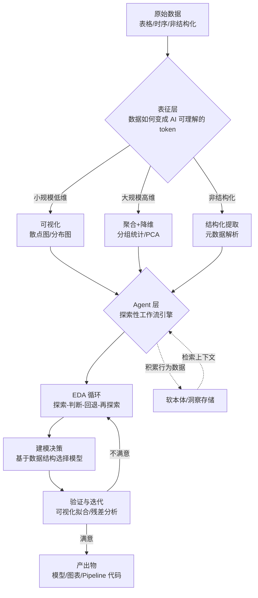

# 数据科学为什么需要一种完全不同的 AI Copilot

# 一句话导读

现有的 AI 编程工具为软件工程师而生，但数据科学的工作逻辑完全不同——它需要的是一个会反驳你的「思考搭档」，而不是一个听话的「代码生成器」。

# 适合谁看

- 每天在 Jupyter Notebook 里写代码、做探索性分析的数据科学家和量化研究员
- 正在评估 AI 工具能否提升数据团队效率的技术管理者
- 做 AI 产品设计、需要理解不同工作流对 AI Agent 架构影响的产品经理
- 用 Cursor/Copilot 写代码很爽、但一回到数据清洗就卡壳的全栈工程师
- 想理解「数据科学 + AI」真正瓶颈在哪的创业者

# 读完你会获得什么

- 理解为什么 LLM 天然擅长代码生成，却天然不擅长处理表格数据——以及解法是什么
- 分清「软件工程 Copilot」和「数据科学 Copilot」在架构上的根本差异
- 理解为什么一个不反驳你的 AI 助手，在数据科学场景里反而比没有更糟
- 掌握数据科学 Copilot 的完整工作流：从数据发现到因果推断
- 识别当前 AI 数据工具的常见误区和虚假承诺
- 有一套可立即执行的评估框架，判断一个 AI 数据工具是否真的适合你的工作

---

## 01 背景：为什么这个问题现在值得讨论

过去两年，AI 编程工具爆发。Cursor、GitHub Copilot、Claude Code——这些工具让软件工程师的生产力直线上升。但如果你是一个数据科学家，你的体验大概率是这样的：用 Cursor 写脚本框架很快，但一旦要探索数据、理解分布、判断一个模型该不该用，你还是会切回 Jupyter，靠自己的经验和直觉。

这不是你的问题，是工具的问题。

Sphinx 的创始团队背景是 AI 研究和量化金融。他们在一线工作中发现了一个反直觉的事实：**AI 本身就是数据喂养出来的，但 AI 工具几乎不回馈数据工作者。** 软件工程师有 Cursor，内容团队有 ChatGPT，但数据科学家——那些最接近数据的人——拿到的 AI 工具几乎是零。

原因不是市场遗忘，而是技术上有两道硬墙。

---

## 02 核心判断：数据科学和软件工程是两种完全不同的认知活动

视频表面的内容是在介绍一个产品。但真正有价值的判断是：**数据科学和软件工程对 AI 工具的需求存在根本性的结构差异，这种差异不是「功能多少」的问题，而是「交互范式」的问题。**

软件工程的典型工作流是：需求明确 → 写代码 → 测试 → 交付。这个过程是**线性的、可规格化的**。你可以给 AI 一个清晰的 spec，让它执行。

数据科学的典型工作流是：拿到数据 → 不确定数据长什么样 → 做探索 → 发现问题 → 回退 → 换方向 → 再探索 → 也许建模。这个过程是**非线性的、探索性的、需要反复推翻自己的**。

如果你用软件工程的 AI 范式去服务数据科学，你会得到一个只会执行指令的助手。但数据科学家需要的，恰恰是一个会在你做蠢事时告诉你「这是个蠢主意」的搭档。

---

## 03 概念澄清：先把关键名词讲准确

### 表征问题（Representation Problem）

- **它是什么**：LLM 处理自然语言和代码很擅长，但处理表格数据、时序数据等结构化数据时表现极差。把一堆数字直接丢进 LLM，得到的通常是垃圾。
- **它解决什么问题**：解释了为什么现有的语言模型无法直接「理解」数据——数据不是它的母语。
- **它不是什么**：不是模型不够聪明的问题。即使更强大的模型，如果不经过中间转换，依然无法直接理解原始数据。
- **它和相关概念的区别**：与「提示工程」不同——提示工程优化的是输入指令，表征问题优化的是数据如何被呈现给模型。
- **一个简单例子**：给你一百万行的 CSV，你无法直接读懂数据的模式。你需要先画个散点图。AI 也一样——它需要先把数据变成自己能理解的「图」或「聚合统计」。

### 强化问题（Reinforcement Problem）

- **它是什么**：数据科学工作流是探索性的、非线性的，AI Agent 需要能够回退、重新探索、甚至在没有明确目标的情况下做 EDA，但传统的 RLHF 训练偏好线性执行。
- **它解决什么问题**：解释了为什么 AI Agent 在数据科学场景里容易陷入「一条路走到黑」——它被训练成高效完成指令，而不是探索和质疑。
- **它不是什么**：不是模型推理能力不足。即使推理能力很强，如果 Agent 被设计成「服从指令优先」，它依然不适合数据科学。
- **它和相关概念的区别**：与「幻觉」不同——幻觉是生成了错误信息，强化问题是系统性地倾向于跳过探索直接给答案。
- **一个简单例子**：你让 AI「给这份数据建个模型」，它可能直接训练一个神经网络。但真正的数据科学家会先看数据长什么样——也许数据是双峰分布，应该先聚类再建模。

### 探索性数据分析（EDA）

- **它是什么**：对数据的初步「体检」——看分布、看异常、看结构，在建任何模型之前先理解数据的基本面貌。
- **它解决什么问题**：防止你在对数据一无所知的情况下盲目建模，导致过拟合或错失关键模式。
- **它不是什么**：不是可有可无的步骤，也不是只有新手才需要做的功课。高级量化研究员每天也在做 EDA。
- **它和相关概念的区别**：与「数据清洗」相关但不同——清洗是修数据的问题，EDA 是理解数据的结构。
- **一个简单例子**：拿到一份交易数据，先画出散点图，发现 Y 和 X 的关系是双峰分布。这个发现直接决定了你该用聚类+线性回归，而不是直接套多项式回归。

### 软本体（Soft Ontology）

- **它是什么**：一种非正式的、通过使用过程不断积累的「数据知识图谱」。不是预先定义好的严格 schema，而是从用户的探索行为中逐步提取的隐含知识。
- **它解决什么问题**：企业数据知识通常存在于资深数据科学家的脑子里，而不是任何文档里。软本体试图把这些知识外化、系统化，让 AI 也能调用。
- **它不是什么**：不是传统意义上的数据字典或正式本体。它不需要预先维护，也不要求完美结构。
- **它和相关概念的区别**：正式本体（如 Palantir 的方案）需要数月实施和专职工程师维护；软本体通过用户行为自动积累，门槛极低但精度逐步提升。
- **一个简单例子**：某个数据科学家每次都用一种奇怪的方式 join 两张表，因为其中一张表的某个字段有已知的 null 值问题。这种知识不会出现在文档里，但如果 AI 能观察到这个行为模式，下次就能自动处理。

---

## 04 整体框架：数据科学 Copilot 的架构逻辑

数据科学 Copilot 需要解决两个层次的问题，对应两层架构：

**文字解释**：

这个框架的核心逻辑是：**表征层解决「AI 能不能看懂数据」，Agent 层解决「AI 能不能像数据科学家一样工作」**。

表征层没有万能解法。数据不同，表征策略完全不同——二维数据画散点图，高维数据做降维，大规模数据做聚合。这就像人类发明了 Excel、Matplotlib、Seaborn、Tableau 等一整套工具来「看数据」，AI 也需要一套等价的工具链。

Agent 层的关键不是「执行能力」，而是**探索和判断能力**。它需要能够回退（发现此路不通时换方向）、质疑（用户提出不合理要求时反驳）、迭代（从简单模型开始，根据拟合结果决定是否升级复杂度）。

软本体是连接两个层的隐性基础设施——它把人类数据科学家的经验外化，让 Agent 的判断越来越接近资深从业者的水平。

---

## 05 关键机制：它到底是怎么运行的

### 机制一：数据→Token 的自适应表征

- **输入**：任意格式的原始数据（CSV、数据库表、非结构化文本等）
- **中间处理**：Agent 先评估数据的规模和维度，然后选择表征策略。二维数据→散点图；高维数据→降维+聚合；大表→分组统计。不是把原始数字直接塞进 LLM 的上下文窗口
- **输出**：AI 可以有效理解的中间表征（图表描述、统计摘要、聚类结构等）
- **为什么这样设计**：LLM 的原生语言是自然语言和代码，不是数字表格。直接输入数字，信息损失极大。通过可视化或统计摘要，数据的关键结构（分布、异常值、聚类）才能被模型捕捉
- **代价**：表征过程本身有信息损失。选择散点图就丢失了高维结构；选择聚合就丢失了细粒度信息。需要 Agent 具备判断「哪种表征最适应当前问题」的能力
- **适合场景**：任何需要 AI 理解数据结构的场景。不适合数据量极小且结构极其简单的情况——那时候直接描述就够了

### 机制二：探索式 Agent 循环

- **输入**：用户的模糊需求（「帮我对这份数据建个模型」「我想理解这份数据」）
- **中间处理**：Agent 进入 EDA 循环——先探索数据结构 → 做初步建模 → 评估拟合 → 如果不满意则回退 → 换方向 → 重新探索。每一步都基于上一步的发现做决策
- **输出**：经过多轮迭代后的分析结论和模型
- **为什么这样设计**：数据科学的本质就是探索。你不知道数据里有什么，直到你看了。线性执行（给一个指令→得到一个结果）会跳过这个最关键的步骤
- **代价**：计算开销更大、时间更长、过程更不可预测。和软件工程 Agent 相比，探索式 Agent 更像是一个「和你在白板前讨论的同事」，而不是一个「你吩咐什么就做什么的执行者」
- **适合场景**：数据探索、模型选择、特征工程。不适合需求已经完全明确、只需要写代码执行的场景

### 机制三：人机协作的判断闭环

- **输入**：用户指令 + Agent 的当前分析结果
- **中间处理**：Agent 不仅要执行，还要**评估用户指令的合理性**。如果用户要求对明显非线性数据拟合线性模型，Agent 应该指出问题并建议替代方案，而不是盲目执行
- **输出**：带有 Agent 独立判断的分析结果（可能和用户原始指令方向不同）
- **为什么这样设计**：视频中最有洞察的一个判断——数据科学家对 AI 工具的评价标准，不是「它能不能执行我的指令」，而是「它会不会在我做蠢事时提醒我」。一个只会服从的数据科学 Copilot，在用户眼里等于「和一个傻瓜工作」
- **代价**：实现难度极高。Agent 需要同时具备数据分析能力和「判断什么建议值得提出」的审慎。太主动会烦人，太被动会被嫌弃。这个度的拿捏是产品成败的关键
- **适合场景**：建模决策、特征选择、数据清洗策略。不适合纯执行类任务（比如「把这个脚本改成函数」）

### 机制四：软本体积累与检索

- **输入**：用户在交互过程中的所有行为——手动修改了什么代码、在哪个节点接手了方向盘、绕开了什么异常
- **中间处理**：所有偏离预期路径的行为被收集、嵌入向量空间，形成该用户/该组织的隐性知识库
- **输出**：未来遇到类似场景时，Agent 能检索到「上次这个人处理这类问题时的做法」，从而做出更符合该组织惯例的决策
- **为什么这样设计**：企业数据知识的最大瓶颈不是技术，是人的脑袋。资深数据科学家知道「这个字段有坑」「那个 join 必须加过滤条件」，但这些知识从来不写进文档。软本体试图从行为中提取这些知识
- **代价**：冷启动问题——新用户或新数据没有历史行为可检索。精度取决于使用时长和频率。不同用户之间的知识隔离增加了系统复杂度
- **适合场景**：长期使用同一数据源的企业团队。不适合临时性、一次性的分析任务

---

## 06 方法拆解：如果自己要设计一个数据科学 AI 工具，应该怎么落地

### 第一步：定义目标用户的问题类型，而不是用户画像

**目标**：明确你的工具到底解决什么问题。

**具体动作**：
- 不要按职位划分（数据科学家、数据工程师、分析师），按问题类型划分
- 核心问题类型包括：数据发现、数据清洗、探索性分析、建模、可视化与仪表盘
- 判断你的工具覆盖哪些问题类型，不覆盖哪些

**判断标准**：你能用一句话说清楚「我的工具帮人解决 X 问题，而不是 Y 问题」。

**常见坑**：把「AI 数据平台」当成定位——太宽泛，等于没有定位。

**产出物**：一张问题类型覆盖矩阵，标注优先级。

### 第二步：设计数据表征策略

**目标**：让 AI 能「看懂」不同类型的数据。

**具体动作**：
- 为不同规模/维度的数据设计不同的表征方式
- 低维数据：可视化（散点图、分布图、箱线图）
- 高维数据：降维（PCA、t-SNE）+ 聚合统计
- 大规模数据：分组统计 + 采样
- 每种表征方式需要能被 LLM 上下文窗口容纳

**判断标准**：表征结果输入 LLM 后，模型能做出和人类看同一张图时相似的判断。

**常见坑**：试图用一种表征方式处理所有数据——不存在万能解法。

**产出物**：数据表征决策树（根据数据特征自动选择表征策略的规则）。

### 第三步：设计 Agent 的探索循环

**目标**：Agent 能做 EDA，而不是跳过 EDA 直接给答案。

**具体动作**：
- 定义 Agent 的探索步骤：加载数据 → 基本统计 → 可视化 → 识别模式 → 提出假设 → 初步验证 → 根据结果迭代
- 设计回退机制：当某个方向明显无效时，Agent 必须能放弃并换方向
- 设计中断点：在哪些关键决策点必须暂停，等待人类输入

**判断标准**：Agent 面对一份新数据时，不会跳过探索直接训练模型。

**常见坑**：给 Agent 太大自由度，导致它在一个错误方向上浪费太多 token。

**产出物**：Agent 行为流程图，标注每一步的判断条件和回退条件。

### 第四步：实现「会反驳」的交互逻辑

**目标**：Agent 在用户提出不合理要求时，能够识别并反馈。

**具体动作**：
- 定义「不合理」的判断规则：数据分布与模型假设不匹配、特征选择明显有偏差、清洗策略可能导致信息泄露等
- 设计反馈方式：不是简单拒绝，而是解释为什么不合理 + 给出替代建议
- 允许用户覆盖 Agent 的建议（最终决策权在人手里）

**判断标准**：给 Agent 一个明显糟糕的指令（比如对双峰数据拟合线性回归），它是否能指出问题。

**常见坑**：Agent 太爱反驳，导致用户觉得在和人吵架而不是在用工具。频率和语气很重要。

**产出物**：Agent 反驳逻辑的触发条件和反馈模板。

### 第五步：积累组织级数据知识

**目标**：把资深数据科学家的隐性知识外化为系统可用的上下文。

**具体动作**：
- 记录用户在交互中的每次「方向盘接管」——什么时候手动改了代码、改了什么、为什么改
- 用 embedding 对这些行为做向量化存储
- 在后续交互中，根据当前数据/任务检索相关历史行为，作为额外上下文注入 Agent

**判断标准**：使用工具 3 个月后，Agent 对同一组织的数据处理方式是否明显更「懂行」。

**常见坑**：试图预先构建完整本体——这需要大量前期投入且难以维护。软本体应该是用出来的，不是设计出来的。

**产出物**：用户行为采集方案 + 检索增强的上下文注入机制。

---

## 07 案例讲解：从一份 CSV 到一个靠谱模型

### 场景背景

你拿到了一份来自 Kaggle 比赛的 CSV 数据。目标：根据特征 X 预测 Y。

### 遇到的问题

如果你把这个数据直接丢给一个普通的代码 Copilot，说「帮我训练一个模型预测 Y」，它大概率会：
1. 直接加载数据
2. 选择一个「鲁棒」的复杂模型（随机森林、XGBoost、甚至神经网络）
3. 跑交叉验证，给你一个看起来还行的分数
4. 完事

**问题在哪？** 它跳过了最重要的一步：看数据。

### 按框架如何处理

**第一步：表征——让 AI 看见数据**

数据科学 Copilot 加载数据后，不会直接建模。它先做 EDA，把数据变成 AI 能理解的形式。

在这个案例中，数据是二维的，所以它画散点图。

**第二步：发现——散点图揭示关键结构**

散点图显示数据明显分成**两个簇**——Y 和 X 的关系不是单一的线性或多项式关系，而是两个不同分布的叠加。

这个发现直接决定了后续建模策略。

**第三步：初步建模——从最简单的开始**

Copilot 先拟合线性回归。这当然拟合不好——数据是双峰的，线性模型会穿过两个簇的中间，两边都不靠。

**第四步：升级——但不是盲目升级**

Copilot 尝试多项式回归。拟合看起来好多了。但如果你有经验，你会知道这很可能是过拟合——多项式回归在双峰数据上经常给出视觉上好看但泛化能力差的曲线。

**第五步：人类介入——关键的判断**

你告诉 Copilot：「我觉得应该先聚类，再在每个簇内建模。」

Copilot 执行 K-Means 聚类，给每个样本分配簇标签，然后在每个簇内分别建模。结果：一个**基于聚类标签的混合模型**，比多项式回归更简单、更可解释、更不容易过拟合。

**第六步：整合——从 Notebook 到 Pipeline**

探索完成后，Copilot 可以把整个分析过程转化为生产代码——Streamlit 应用、Airflow DAG、或任何你现有的调度系统能跑的格式。因为它记录了每一步「为什么这么做」，所以转化过程不需要人类重新解释逻辑。

### 最终结果

一个双阶段模型（K-Means + 簇内线性回归），比直接拟合的复杂模型更简单、更准、更好解释。

### 说明了什么

**数据科学的核心价值不在「选对模型」，而在「看懂数据」。** 一个跳过 EDA 直接建模的 AI 工具，再强大也只是在加速犯错。真正有用的 AI Copilot，必须先看数据，再决定怎么建模——这个顺序不能反。

---

## 08 常见误区

### 误区一：认为 LLM 应该能直接理解表格数据

- **错误理解**：既然 GPT 这么强，给它一百万行的 CSV 它应该能分析。
- **为什么错**：LLM 的原生表示空间是 token，不是数字表格。大量数字变成 token 后信息密度极低，模型看到的是一堆没有结构的数字，和人类看到一百万行原始数字的效果一样——什么都看不出来。
- **正确理解**：LLM 需要中间表征层——可视化、统计摘要、降维——才能「看懂」数据。
- **应该怎么做**：在把数据交给 LLM 之前，先做表征转换。用什么表征取决于数据的规模和维度。

### 误区二：认为数据科学 Copilot 应该像 Cursor 一样服从指令

- **错误理解**：Copilot 就该执行我的指令，我让它做什么它就做什么。
- **为什么错**：在软件工程里，需求通常已经想清楚了，执行是主要瓶颈。在数据科学里，需求通常是模糊的，**判断**才是主要瓶颈。一个只会执行的 Copilot 会帮你在错误的方向上加速。
- **正确理解**：数据科学 Copilot 的核心价值是「在你做蠢事时提醒你」，而不是「在你做蠢事时更快地帮你做」。
- **应该怎么做**：评估一个数据科学 AI 工具时，测试它是否会在你给出不合理指令时提出异议——而不是测试它能否更快地执行。

### 误区三：认为全自主（Autonomous）模式比 Copilot 模式更先进

- **错误理解**：Copilot 是过渡态，最终应该走向全自主——你提个问题，AI 自动出答案。
- **为什么错**：全自主模式在数据科学中有两个致命问题：一是**歧义无法自动解决**（比如「哪个国家的欺诈最多」可以理解为数量最多，也可以理解为比例最高——全自主 Agent 会猜一个答案，可能猜错）；二是**没有回溯信用**（如果 Agent 在第一步就发现了歧义并正确处理了，用户根本看不到这个过程——全自主只能展示最终结果）。
- **正确理解**：数据科学中的歧义解决和关键判断，应该由人类来做。AI 的价值是帮你更快地走到需要做判断的节点，而不是替你做判断。
- **应该怎么做**：选择 Copilot 模式而非全自主模式。让 AI 做探索和执行，让人类做判断和决策。

### 误区四：认为建模是数据科学 AI 工具最重要的功能

- **错误理解**：AI 数据工具的核心卖点应该是自动建模、AutoML。
- **为什么错**：建模在实际数据科学工作中只占很小比例。数据清洗、EDA、特征工程、可视化才是大头。而且，建模是最容易自动化的部分——真正难的是前面的探索和判断。
- **正确理解**：建模是冰山一角。水面下的数据发现、清洗、理解，才是数据科学工作真正的瓶颈。
- **应该怎么做**：评估 AI 数据工具时，关注它做 EDA 和数据清洗的能力，而不是它训练模型的精度。

### 误区五：认为基准测试（Benchmark）能客观衡量数据科学 AI 的能力

- **错误理解**：有了 DABStep 这样的基准测试，我们就能客观比较不同工具的水平。
- **为什么错**：基准测试有两个根本局限：一是数据科学的核心挑战是**歧义处理**和**大规模数据的复杂性**，而现有基准测试往往测试的是「能不能给出正确答案」，而不是「能不能在模糊需求下做出正确判断」；二是数据科学缺乏公开的训练和评估数据——不像代码可以爬 GitHub，数据科学的探索过程几乎不留下可复用的公开痕迹。
- **正确理解**：基准测试有参考价值，但不能作为唯一判断标准。真实企业场景的复杂度（千张表、脏数据、组织隐性知识）远超基准测试。
- **应该怎么做**：用基准测试做初步筛选，但最终评估要在自己的真实数据和工作流上进行。

### 误区六：认为所有行业的数据问题都能用同一个工具解决

- **错误理解**：一个通用的 AI 数据平台可以服务所有行业。
- **为什么错**：不同行业对数据安全、合规、部署方式的要求差异巨大。金融行业要求零数据留存和本地计算；医疗行业有额外的隐私要求；不同行业的数据结构（时序、图、文本、表格）也完全不同。
- **正确理解**：通用性在表层功能上成立，在底层架构上需要针对行业特性做适配。
- **应该怎么做**：选择工具时优先考虑数据安全合规能力，然后才看功能性。

### 误区七：认为现有的 BI 工具 + AI 就够了

- **错误理解**：Snowflake 的 Data Genie 或者 Tableau 的 AI 功能已经解决了 AI + 数据的问题。
- **为什么错**：BI 工具 + AI 解决的是「问一个问题，得到一个答案」的场景。但真正的数据科学问题——因果推断、特征工程、模型选择——需要的是**深度探索**，不是一问一答。BI AI 告诉你「上个月收入下降了 15%」，但不能告诉你「如果我们降价 5%，用户反馈会不会改善」。
- **正确理解**：BI AI 和数据科学 Copilot 是两个不同层次的产品，解决不同层次的问题。
- **应该怎么做**：如果你的需求是查询和报表，用 BI AI；如果你的需求是分析和建模，用数据科学 Copilot。

---

## 09 实战清单：读完后可以马上照着做

### 立即能做

1. **测试你现有 AI 工具的「反驳能力」**：给它一份明显需要先做 EDA 再建模的数据，直接让它「训练一个模型」。如果它不质疑你就直接开始训练——说明它不适合做数据科学搭档。
2. **重新审视你的数据工作流**：画一张你最近一次数据分析的流程图，标注哪些步骤是探索性的（方向不确定、需要回退）、哪些是执行性的。探索性步骤的比例，就是你需要数据科学 Copilot 的程度。
3. **检查你的数据知识管理现状**：问自己——团队里最资深的数据科学家如果离职，有多少数据相关的隐性知识会跟着消失？如果答案是「很多」，你就有构建软本体的需求。

### 一周内能做

4. **设计一个数据表征策略**：拿你最常见的三类数据，为每类设计一种 AI 友好的中间表征方式（可视化、聚合统计、降维等）。
5. **建立 EDA 清单**：在开始任何建模之前，强制执行一份最简 EDA 清单——数据规模、缺失值、分布、异常值、变量间关系。这不是流程，是底线。
6. **对比测试**：用同一个分析任务，分别用 Cursor 和一个数据科学专用工具（如 Sphinx）完成。关注差异不在代码质量，在于探索深度和判断能力。

### 长期要沉淀

7. **建设组织级的数据知识库**：不只是数据字典，而是记录「为什么这样处理数据」「这个字段有什么坑」「为什么不用那个模型」的隐性知识。从记录每次「偏离标准流程」的操作开始。
8. **建立 AI 工具的评估框架**：不看 demo 效果，看真实工作流中的表现。核心指标：是否减少了「看数据→理解数据→做判断」的循环时间，而不是「写代码→出结果」的时间。
9. **跟踪数据科学 AI 的基准测试演进**：当前基准测试还不够好，但这个领域正在快速演进。关注新的基准设计方向——特别是针对歧义处理和大规模数据复杂性的测试。

---

## 10 总结

数据科学和软件工程共享很多工具，但本质上是两种不同的认知活动。软件工程的核心瓶颈是执行——需求已经想清楚，代码能不能写对、写快。数据科学的核心瓶颈是判断——数据长什么样、该用什么方法、模型合不合理，这些问题没有标准答案，需要探索、试错、推翻重来。

现有的 AI 编程工具为软件工程设计，天然偏好线性执行。把它用在数据科学上，就像给一个需要不断讨论和推翻的头脑风暴会议配了一个只会说「好的，收到」的助手——它不会犯错，但它也不会帮你做对。

Sphinx 的做法指出了一个方向：数据科学需要一种不同的 AI 架构——表征层让 AI 能看懂数据，Agent 层让 AI 能像数据科学家一样探索和判断，软本体让 AI 能积累组织级的隐性知识。这三层缺一不可。

但更重要的是一个产品哲学层面的判断：**一个好的数据科学 AI 工具，最重要的品质不是服从，而是判断力。** 它应该像一个有经验、敢说真话的同事，而不是一个只会点头称是的实习生。如果你在评估这类工具，这是唯一值得认真测试的维度。
