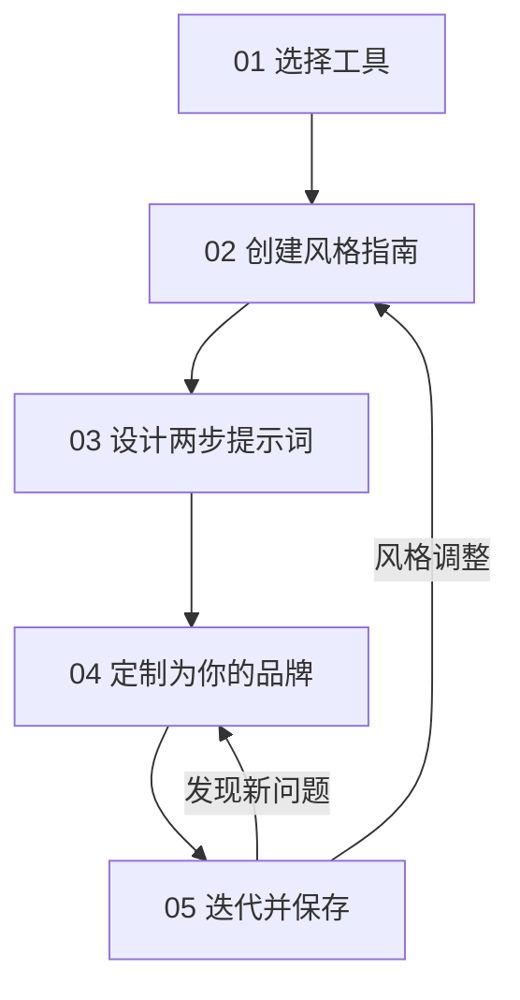

# 用 AI 生成品牌级信息图：从「随机垃圾」到「一致产出」的五步方法

## 一句话导读

AI 能生成信息图，但默认产出是颜色混乱的通用图——真正的问题不是模型不够强，而是你有没有给它一份品牌风格指南。

## 适合谁看

- 需要频繁把文字内容转成社交媒体信息图的内容运营
- 想用 AI 替代设计师出图、但受够了「AI 味」的独立创作者
- 管理品牌视觉规范、需要让团队低成本产出一致素材的品牌经理
- 正在搭建 AI 工作流、希望减少重复劳动的产品经理
- 任何用 Gemini/GPT 生成过信息图、结果一看就想删的人

## 读完你会获得什么

- 理解为什么直接让 AI 生成信息图一定翻车，以及翻车的根本原因
- 掌握一份可执行的品牌风格指南模板（6 个必填维度）
- 学会「两步提示法」——解决 AI 在信息图中乱加文字的核心技巧
- 知道如何用参考图反向推导风格描述词，不用从零写提示词
- 建立一套「迭代 → 更新提示词 → 保存为可复用项目」的持续改进循环
- 能在 10 分钟内为自己的品牌搭建一个一键出图的信息图生成器

---

## 01 背景：为什么这个问题现在值得讨论

多模态大模型（Gemini、GPT-4o 等）已经能直接生成信息图了。这意味着过去需要设计师花几小时完成的工作，现在一句话就能出图。

但现实是：你真的试一次就知道了。

直接把一段文字丢给 Gemini，让它「生成信息图」，你会得到一张颜色随机、字体混乱、塞满无关文字的图。它不是不能用，但它和你品牌的视觉规范毫无关系。如果你把这样的图发出去，受众只会觉得你不专业。

这不是模型能力的问题，是输入方式的问题。你给了 AI 一句话的指令，它就按自己的默认审美来。默认审美 = 没有审美 = 不属于任何品牌。

这个问题的解法不是换一个更强的模型，而是给 AI 一份详细的风格约束。视频的核心贡献在于：它把「如何约束 AI 的视觉输出」拆成了一套可复制的五步流程，并且展示了从杂乱到一致的完整对比。

---

## 02 核心判断：问题不在 AI，在于你有没有风格规范

视频表面在讲「怎么用 Gemini 生成信息图」，实际在讲一件事：**AI 图像生成的质量上限取决于你提供的风格约束的精确度。**

默认提示词 = 零约束 = AI 自由发挥 = 输出不可预测。而一份详细的风格指南 = 精确约束 = AI 在限定空间内发挥 = 输出可预期、可复现。

这背后的逻辑是：多模态模型不是创意工具，是执行工具。你不能指望它替你做审美决策，但如果你把审美决策提前写清楚，它的执行能力远超人工。

---

## 03 概念澄清：先把关键名词讲准确

### 风格指南（Style Guide）

- 它是什么：一份描述视觉输出规范的文档，包含颜色、字体、排版、插图风格等维度
- 它解决什么问题：让 AI 的视觉输出从「随机」变成「可控」
- 它不是什么：不是品牌手册的完整版，不需要涵盖 logo 使用规范、名片设计等——它只服务于 AI 图像生成这个场景
- 和品牌手册的区别：品牌手册是给人看的，覆盖所有触点；风格指南是给 AI 看的，只管图像生成这一件事
- 例子：你的风格指南里写「主色调 #E63946，背景纯白，标题用无衬线粗体」——这就是 AI 能执行的约束

### 两步提示法（Two-Step Prompting）

- 它是什么：先让 AI 从原文中提取关键文字（标题、章节头），再用提取的文字配合风格指南生成图像
- 它解决什么问题：AI 生成信息图时倾向于乱加文字，两步法把「提取文字」和「生成图像」分开，减少文字混乱
- 它不是什么：不是 Chain-of-Thought，不是多轮对话——它是单次提示词内部的两个顺序步骤
- 和一次性提示的区别：一次性提示让 AI 同时理解内容 + 设计风格，容易顾此失彼；两步法强制分阶段，先确定内容再确定形式
- 例子：第一步指令「提取这段文字的标题和所有章节标题，只输出这些文字」；第二步指令「用提取的文字生成信息图，应用以下风格指南」

### Gem（Gemini 定制项目）

- 它是什么：Gemini 中可以保存系统提示词的定制项目，类似 GPT 的 Custom GPT
- 它解决什么问题：避免每次生成都要复制粘贴长提示词
- 它不是什么：不是独立模型，不是微调——它就是保存了一份提示词模板
- 例子：你创建一个叫「信息图生成器」的 Gem，把完整的风格指南 + 两步指令写进去，以后只需要粘贴正文就能出图

---

## 04 整体框架：五步流程

这套方法的核心是一个**流程结构**——从零约束到完全可复用的渐进过程。

**文字解释：**

1. **选工具**：确定用哪个 Gemini 入口，核心权衡是免费 vs 无水印 vs 可迭代
2. **写风格指南**：把你的品牌视觉规范翻译成 AI 能执行的 6 个维度
3. **结构化提示词**：用两步法组织提示词，解决文字混乱问题
4. **定制品牌**：用参考图 + AI 协作，把风格指南从通用改为专属
5. **迭代保存**：每次迭代后更新提示词，最终保存为 Gem 实现一键出图

这个流程的精髓在于**第 5 步的闭环**：它不是一个一次性流程，而是一个持续改进循环。你每用一次，提示词就精进一步，产出就越稳定。

---

## 05 关键机制：风格约束如何控制 AI 输出

### 输入

一段文字内容 + 一份风格指南（6 个维度）

### 中间处理

风格指南的 6 个维度各自约束 AI 的不同输出层：

| 维度 | 约束什么 | 不约束会怎样 |
|------|---------|------------|
| 画幅比例 | 图像的整体形状 | 可能生成不适合社交媒体的横版图 |
| 分辨率 | 图像清晰度 | 低分辨率图在放大后模糊 |
| 颜色体系 | 整体色调和品牌一致性 | 颜色随机，无法识别品牌 |
| 字体排版 | 文字的视觉层级 | 标题正文不分，字号混乱 |
| 布局结构 | 元素的排列方式 | 内容拥挤或空洞 |
| 插图风格 | 视觉语言的一致性 | 每次生成的插图风格不同，无法形成品牌识别 |

### 输出

一张在颜色、字体、布局、插图风格上都符合品牌规范的信息图。

### 为什么要这样设计

因为多模态模型在视觉生成时，对每一个未被约束的维度都会自由发挥。6 个维度全部约束 = 6 个维度全部可控。少约束一个，那个维度就回到随机。

### 代价

写一份完整的风格指南需要时间（约 30-60 分钟），而且需要你对自己的品牌视觉有清晰认知。如果你没有品牌视觉规范，这个流程会逼你先建立一套。

### 适合/不适合的场景

- **适合**：需要反复生成同品牌风格的信息图、社交媒体图、营销素材
- **不适合**：一次性的创意探索、需要 AI 自由发挥的头脑风暴

---

## 06 方法拆解：五步落地

### 第一步：选择工具

**目标**：确定用哪个 Gemini 入口生成信息图。

**具体动作**：在三个选项中选择——

| 工具 | 费用 | 水印 | 可迭代 | 推荐度 |
|------|------|------|--------|--------|
| Gemini 网页版 | 免费 | 有 | 可以对话修改 | 推荐起步 |
| NotebookLM | 免费 | 无 | 不可迭代 | 不推荐 |
| Google AI Studio | 约 $0.10-0.20/张 | 无 | 可控性最强 | 进阶使用 |

**判断标准**：如果你是第一次尝试，用 Gemini 网页版。水印可以用其他 AI 工具去除，不影响核心流程。

**常见坑**：NotebookLM 看起来方便（免费 + 无水印），但它生成后无法通过对话修改，每次调整都要从头来——这对信息图这种需要精细调整的场景是致命的。

**产出物**：确定的工具入口。

---

### 第二步：创建风格指南

**目标**：把品牌视觉规范翻译成 AI 可执行的 6 个维度。

**具体动作**：按以下模板填写——

1. **画幅比例**：9:16（竖版，社交媒体首选）或 16:9（横版）或 1:1（方形）
2. **分辨率**：至少 1K，推荐 2K
3. **颜色**：1 个主色 + 2-3 个辅色 + 1 个背景色（附色值）
4. **字体排版**：标题字体/字号/风格 + 正文字体/字号/风格
5. **布局**：例如「网格布局，元素间留白充裕」
6. **插图风格**：这是最重要的维度。描述要具体到技法层面，例如「 editorial 水墨风格，线稿带可见笔触，水彩渲染阴影」

**判断标准**：你把风格指南交给一个不了解你品牌的人，他能据此画出和你品牌一致的图——那就够了。

**常见坑**：插图风格只写「简约」「现代」这种模糊词。AI 不理解「简约」到底意味着什么——线多粗？色块多大？有没有阴影？你写「简洁线条、最小化阴影、卡通比例、可见笔触」，AI 才能执行。

**如果你没有现成的风格描述**：上传 3-5 张你品牌已有的设计图（或你喜欢的风格参考图）给 ChatGPT / Gemini / Claude，让它帮你反向提取风格描述。你不需要从零写，让 AI 帮你起草，你再修改。

**产出物**：一份 6 维度的风格指南文本。

---

### 第三步：设计两步提示词

**目标**：构建一个结构化提示词，先提取文字、再生成图像，解决 AI 乱加文字的问题。

**具体动作**：把提示词分成两个明确步骤——

**步骤 1：提取文字**
> 解析以下文本，仅提取标题和所有章节标题。使用原文的准确措辞，不要编造文字，不要添加任何额外文字。

**步骤 2：生成图像**
> 基于步骤 1 提取的文字，生成一张信息图。应用以下风格指南：[粘贴风格指南]

**判断标准**：生成的信息图中出现的文字，应该只有原文的标题和章节标题，没有 AI 自行添加的内容。

**常见坑**：在提示词里写「不要添加多余文字」——这句话对 AI 几乎无效。AI 会理解「多余」的标准和你不同。两步法的思路不是告诉 AI「别加」，而是让 AI 先把「该加什么」明确下来，再基于明确清单生成。

**产出物**：一个包含两步指令的完整提示词模板。

---

### 第四步：定制为你的品牌

**目标**：把通用风格指南替换为你自己的品牌风格。

**具体动作**：

1. 收集 3-5 张你喜欢的或你品牌已有的信息图/设计图
2. 把这些图上传给 AI（Gemini / ChatGPT / Claude 均可）
3. 让 AI 根据这些参考图更新你提示词中的「插图风格」部分
4. 人工审核 AI 的修改，调整不准确的地方
5. 替换提示词中的风格描述

**判断标准**：用新提示词生成的信息图，在视觉风格上应该和你提供的参考图一致。

**常见坑**：完全照搬别人的风格。视频里演示了用 Liza Donnelly 风格的手绘插图——这没问题作为灵感来源，但如果你直接使用，要注意版权。最安全的做法是用你自己的品牌设计作为参考图。

**产出物**：一份完全属于你品牌的提示词。

---

### 第五步：迭代并保存

**目标**：建立「生成 → 迭代 → 更新提示词 → 保存」的改进循环。

**具体动作**：

1. 用提示词生成信息图
2. 对结果不满意时，**不要重新生成**，而是通过对话提出修改：例如「红色圆圈只框标题中最重要的那个词」「改为两栏布局」
3. 满意后，说：**「根据我们刚才的所有修改，更新原始提示词，保持总长度相近」**
4. 审核更新后的提示词
5. 把最终版提示词保存为 Gemini Gem（定制项目），命名为「信息图生成器」
6. 以后只需粘贴正文，即可一键生成品牌信息图

**判断标准**：保存后的 Gem 是否能做到——只粘贴正文，不需要额外指令，就能产出符合品牌规范的信息图。

**常见坑**：迭代了但没有更新提示词。每次都用对话修改，但下次又从头来——这就是在浪费迭代的价值。**「迭代完必须让 AI 更新提示词」**是这个流程中最容易被忽略的步骤。

**产出物**：一个可在 Gemini 中一键使用的 Gem 项目。

---

## 07 案例讲解：从博客文章到品牌信息图

**场景背景**：你写了一篇关于「AI 时代的产品经理会怎样」的长文，想为它制作一张社交媒体信息图。

**遇到的问题**：直接把文章全文丢给 Gemini 说「生成信息图」，输出颜色混乱、塞满不相关文字、和你品牌毫无关系。

**按框架如何处理**：

1. **你已有的品牌风格**：你的品牌视觉是「红色作为强调色，关键标题词用红色圆圈标注，插图风格为 editorial 水墨线条，整体简洁」

2. **提取文字**：从文章中识别出——标题：「AI 时代的产品经理」；章节标题：「AI 正在取代什么」「什么不会被取代」「行动建议」。只保留这些。

3. **生成图像**：把提取的文字 + 品牌风格指南交给 Gemini，生成第一版。

4. **对话迭代**：
   - 「红色圆圈只圈标题中最重要的词，不要圈整个标题」
   - 「改为两栏布局」
   - 「更新'AI 课程'那个插图，换成'构建而非学习'的意象」

5. **更新提示词**：把所有修改写回提示词，让下次生成一步到位。

6. **保存为 Gem**：以后写完任何文章，只需粘贴全文，Gem 自动完成提取 → 生成 → 输出品牌信息图。

**最终结果**：一张品牌色准确、文字干净、插图风格一致的信息图，且下次不需要重复劳动。

**说明了什么**：信息图的质量不取决于 AI 有多聪明，取决于你给的约束有多精确。一次投入时间构建风格指南和提示词，之后每次生成都受益。

---

## 08 常见误区

**1. 「AI 生成的信息图已经够好了，直接用就行」**

错误。默认输出没有品牌识别度，和竞品的信息图放在一起，分不出谁是谁。正确做法：任何对外发布的 AI 生成素材，都必须经过风格约束。

**2. 「风格指南就是选几个颜色」**

错误。颜色只是 6 个维度之一。忽略字体、布局、特别是插图风格，会导致每次产出风格不统一。正确做法：6 个维度全部定义。

**3. 「提示词越长越好」**

错误。长度不是关键，精确度才是。一段 200 字但每个维度都模糊的提示词，不如一段 150 字但每个维度都具体的提示词。正确做法：每个维度都写到 AI 能直接执行的程度——给色值而不是「暖色」，给字号而不是「大一点」。

**4. 「在提示词里写'不要加多余文字'就够了」**

错误。AI 对「多余」的理解和你不同。正确做法：用两步法，先让 AI 明确列出要放哪些文字，再基于这个清单生成图。

**5. 「生成不满意就重新来」**

错误。Gemini 支持对话式修改，重新来会丢失上下文。正确做法：先通过对话逐步调整，满意后再把修改固化到提示词里。

**6. 「迭代完了就完事了」**

错误。迭代但不更新提示词，下次又要重复同样的修改。正确做法：每次迭代后，让 AI 把修改写回提示词，实现持续积累。

**7. 「有了提示词模板就不用再改了」**

错误。品牌视觉会演进，AI 模型会更新，提示词也需要跟着迭代。正确做法：把提示词当作活文档，定期审视和更新。

**8. 「直接复制别人的风格描述」**

有风险。风格可以借鉴，但直接使用特定插画师风格可能涉及版权问题。正确做法：以自己的品牌设计为参考图，让别人风格仅作灵感参考。

---

## 09 实战清单

### 立即能做

- [ ] 打开 Gemini 网页版，粘贴一段你写过的文章，直接让它生成信息图——保存结果，作为「零约束基线」
- [ ] 列出你品牌的 6 个风格维度：画幅、分辨率、主色/辅色/背景色、字体、布局、插图风格——哪怕只是粗略的
- [ ] 把这 6 个维度写成一段提示词，再生成一次同样的信息图——对比和基线的差异

### 一周内能做

- [ ] 上传 3-5 张你品牌已有的设计图（或你喜欢的风格参考图）给 AI，让它反向提取风格描述，更新你的风格指南
- [ ] 把提示词改为两步结构：先提取标题和章节头，再生成图像——测试文字混乱是否减少
- [ ] 迭代 3-5 次后，让 AI 更新原始提示词，确认改进被固化

### 长期要沉淀

- [ ] 创建一个 Gemini Gem，把最终版提示词存进去，实现「粘贴正文 → 一键出图」
- [ ] 每月用新素材测试一次 Gem，记录哪里不符合预期，迭代更新提示词
- [ ] 如果你管理团队，把风格指南和 Gem 分享给团队成员，统一全队的素材产出标准

---

## 10 总结

AI 生成信息图的能力已经可用，但默认输出不可用。问题不在模型，在于零约束的输入方式。

这套五步方法的核心逻辑是：**把审美决策从 AI 手中拿回来，提前写成规则，让 AI 在规则内执行。** 风格指南定义规则，两步提示法控制文字，迭代循环持续优化规则，Gem 实现规则的一键复用。

这不是一个一次性的操作，而是一个沉淀过程。你每用一次，提示词就更精确一点，产出就更稳定一点。第一次可能花 30 分钟调试，第十次只需要 30 秒粘贴。

**最终判断：AI 图像生成的真正门槛不是技术，是你对自己品牌视觉的认知清晰度。如果你说不清自己要什么，AI 也帮不了你；如果你说得清，AI 会比你想象中执行得好。**
