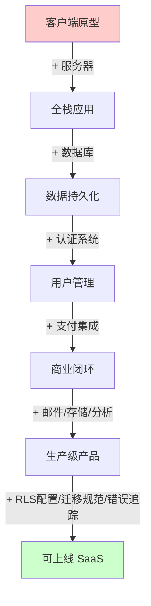

# 从 Vibe Coding 到真实 SaaS：原型和生产之间到底差什么

**一句话导读：** 这篇文章回答一个被刻意回避的问题——AI 能帮你跑通一个原型，但从原型到能收钱的 SaaS，中间缺的不是更多的 prompt，而是一整套你从未学过的工程基础设施。

**适合谁看：**
- 用 Cursor / Claude Code / Lovable 做出过原型，但不知道怎么上线的开发者
- 想用 AI 工具做副业产品、却卡在「登录、支付、部署」环节的独立开发者
- 用低代码平台搭了应用、但隐约觉得不对劲的产品经理
- 需要评估 AI 辅助开发安全风险的技术负责人

**读完你会获得什么：**
- 能清晰区分「客户端原型」和「全栈 SaaS」在架构上的本质差异
- 能列出构建真实产品必须具备的 7 项基础设施
- 能理解 Supabase RLS 的安全陷阱，以及为什么大多数 Lovable/Bolt 应用默认不安全
- 能掌握「模板先行 + AI 增量开发」的方法论，避免从零开始踩坑
- 能照着步骤把一个本地原型改造成可部署、可收钱的 SaaS 应用

---

## 01 背景：为什么这个问题现在值得讨论

AI 编程工具爆发后，一个人花几小时就能做出一个「能跑」的原型。但原型能跑和产品能上线之间，隔着一整座冰山。

过去，开发者从学编程到做产品，中间要经历完整的技术训练——写后端、配数据库、接支付、搞部署——这个过程中自然就理解了全栈是什么。现在，AI 跳过了这个训练过程。你可以在完全不理解服务器是什么的情况下，做出一个看起来很像产品的界面。

问题在于：**AI 给了你结果，但没给你理解。** 当原型需要变成真实产品时——加用户登录、接 Stripe 收款、存文件、追踪错误——这些 AI 帮不了你（或者帮得很差）的部分，恰恰决定了产品能不能上线。

这不是一个「再加几个功能」的问题，而是一个认知鸿沟：大多数人不知道自己不知道什么。

---

## 02 核心判断：视频真正想讲的不是工具选择，而是工程意识

视频表面在讲「如何用模板把原型变成 SaaS」，但真正传递的判断是：

**从原型到产品的核心障碍不是编码能力，而是工程基础设施意识和安全意识。**

具体来说：
- 你不知道全栈应用需要哪些组件，AI 也不会主动提醒你
- 你不知道默认配置可能是不安全的，工具也不会在醒目位置告诉你
- 你不知道数据库变更需要迁移而不是直接改，直到改坏了无法回退

视频中的嘉宾 Colin 反复强调一个观点：**用 AI 写代码本身不难，难的是知道 AI 写出来的代码里有哪些是错的、哪些是不安全的、哪些在生产环境下会出问题。**

---

## 03 概念澄清：先把关键名词讲准确

### 客户端原型（Client-side Prototype）

- **它是什么：** 只在浏览器端运行的应用，所有逻辑、数据、API 调用都在前端完成
- **它解决什么问题：** 快速验证想法，展示交互效果
- **它不是什么：** 不是完整产品。它没有用户系统、没有数据持久化、没有权限控制
- **和相关概念的区别：** 和「全栈应用」的区别在于是否有独立的服务器端逻辑和数据库
- **例子：** 用 v0 或 Lovable 做的一个图片生成器，前端直接调 Gemini API，结果只显示在页面上，刷新就没了

### 全栈 SaaS（Full-stack SaaS）

- **它是什么：** 客户端 + 服务器 + 数据库 + 第三方服务的完整组合
- **它解决什么问题：** 支持用户注册登录、数据持久存储、支付收费、邮件通知、错误追踪等生产级需求
- **它不是什么：** 不是「客户端 + 数据库」。有数据库不代表有服务器，Supabase 的 auto-generated API 不等于你有可控的服务器
- **和相关概念的区别：** 和原型的本质区别不在于代码量，而在于是否有服务器端的应用逻辑层
- **例子：** 同样的图片生成器，但用户需要登录才能用，生成记录保存在数据库，免费用户每月限 3 次，付费用户无限次

### RLS（Row Level Security）

- **它是什么：** Supabase/PostgreSQL 的行级安全策略，控制哪些用户可以访问哪些数据行
- **它解决什么问题：** 在没有独立服务器的情况下，用声明式规则代替服务器端的权限检查
- **它不是什么：** 它不是自动启用的安全功能。**默认情况下，Supabase 项目的 RLS 规则是完全开放的——任何用户可以访问任何数据**
- **和相关概念的区别：** 传统全栈应用在服务器代码中做权限检查；Supabase 用 RLS 替代了这层逻辑，但需要开发者手动配置
- **例子：** 你用 Lovable 做了一个应用，里面有用户表存储邮箱信息。如果没配 RLS，任何访问你数据库 API 的人都能读出所有用户的邮箱

### 数据库迁移（Database Migration）

- **它是什么：** 用代码文件描述数据库结构的变更，而不是直接修改数据库
- **它解决什么问题：** 让数据库结构的变更可追踪、可回滚、可同步，避免直接操作数据库导致的不可逆错误
- **它不是什么：** 不是直接在数据库里跑 SQL 改表结构
- **和相关概念的区别：** 代码改了可以 git revert，数据库直接改了没有撤销按钮
- **例子：** 新增一个 headshots 表，正确做法是生成一个 migration 文件描述变更，审核后再 apply；而不是让 AI 直接写 SQL 执行

### SaaS 模板（SaaS Template/Starter Kit）

- **它是什么：** 预先集成了登录、支付、数据库、邮件、分析等基础设施的代码库
- **它解决什么问题：** 避免从零搭建通用基础设施，把精力集中在业务逻辑上
- **它不是什么：** 不是成品应用。它提供了骨架，你需要用自己的业务逻辑替换模板内容
- **和相关概念的区别：** 和「从零开始」的区别是，模板里已有的基础设施不用重复造；和「低代码平台」的区别是，模板是完整的代码，你拥有完全控制权
- **例子：** Colin 的 SaaS 模板包含了 Stripe 支付集成、Google 登录、PostHog 分析、文件存储等，你只需要把 to-do list 替换成自己的产品逻辑

---

## 04 整体框架：从原型到 SaaS的三层跃迁

视频内容可以重构为三层递进结构：

```
原型层 ──→ 基础设施层 ──→ 安全与工程层
(能跑)      (能用)          (能上线)
```



**第一层：从原型到全栈**——补上服务器和数据库。原型只有客户端，全栈需要客户端 + 服务器 + 数据库。这不是加代码的问题，而是架构范式的切换。

**第二层：从全栈到产品**——补上通用基础设施。认证（不能用 localhost）、支付（Stripe）、邮件、文件存储、产品分析、错误追踪。这些和你的业务逻辑无关，但和产品能不能上线强相关。

**第三层：从产品到安全产品**——补上工程意识和安全配置。RLS 规则不是默认安全的；数据库不能直接改要迁移；API 调用用了错误的模型不是 bug 而是 AI 训练截止日的问题。这一层是区分「玩票」和「认真做」的分界线。

---

## 05 关键机制：三个容易被忽视的运作方式

### 机制一：Supabase 的「自动服务器」陷阱

- **输入：** 你在 Lovable/Bolt 中创建应用，选择集成后端
- **中间处理：** Supabase 为数据库中的每张表自动生成 API 端点，你不需要写服务器代码
- **输出：** 前端直接通过 API 读写数据库，看起来像有了后端
- **为什么要这样设计：** 降低门槛，让不会写后端的用户也能做全栈应用
- **带来了什么代价：** 你失去了对服务器逻辑的控制权。权限检查不是在代码里做的，而是依赖 RLS 规则。**而 RLS 规则默认是完全开放的**
- **适合什么场景：** 内部工具、数据不敏感的个人项目
- **不适合什么场景：** 任何有用户隐私数据、需要付费功能的商业产品

**核心问题：** Lovable/Bolt 的用户中，绝大多数不知道 RLS 的存在，更不知道默认是开放的。Lovable 在发布时会弹一个警告提示，但这个警告很容易被忽略，而且配置 RLS 依然需要你理解安全模型——这恰恰是这些平台的目标用户不具备的能力。

### 机制二：AI 编程的知识截止日问题

- **输入：** 你让 AI 生成调用第三方 API 的代码
- **中间处理：** AI 基于训练数据中见过的方式生成代码，可能使用过时的模型名、废弃的参数、错误的 API 路径
- **输出：** 代码能运行但调用了错误的模型/端点，或者直接报错
- **为什么要这样设计：** 这是 LLM 的固有局限，训练数据有时间截止点
- **带来了什么代价：** 你必须会阅读错误信息、查找最新文档、手动修正
- **适合什么场景：** 任何需要调用快速迭代的第三方 API 的项目（几乎所有 SaaS 都属于这个场景）
- **不适合什么场景：** 不存在——这是你必须面对的问题

**视频中实际发生的案例：** AI 生成的代码使用了 `gemini-2.0-flash-exp` 模型进行图片生成，但该模型不支持图片编辑操作。解决方式：手动查阅 Gemini API 文档，找到正确的模型和参数，把文档内容粘贴给 AI，让它重新生成。

**这个机制揭示了一个关键认知：** AI 编程的调试循环不是「prompt → 代码 → 完工」，而是「prompt → 代码 → 报错 → 读错误 → 查文档 → 修正 prompt → 再生成」。你需要能读懂错误信息，这是 AI 替代不了的能力。

### 机制三：模板驱动的增量开发

- **输入：** 一个已集成基础设施的 SaaS 模板 + 你的原型代码
- **中间处理：** 把原型的 UI 组件迁移到模板中，用模板已有的基础设施（认证、支付、数据库访问模式）做支撑，AI 基于模板中已有的代码模式生成新代码
- **输出：** 一个继承了模板所有基础设施的新应用，代码风格和架构与模板一致
- **为什么要这样设计：** AI 在已有代码模式上生成代码的准确度远高于从零生成。模板提供了「正确答案的参考样式」
- **带来了什么代价：** 你需要理解模板的结构才能正确使用，模板选择影响长期架构
- **适合什么场景：** 构建 SaaS 产品、需要快速上线且不想从零搭基础设施
- **不适合什么场景：** 你的架构需求和模板差异很大时，改模板可能比从头写更难

**为什么模板比从零开始更高效：** AI 看到你的代码库里已有 Stripe 集成的实现方式，它会按照同样的模式来写新的支付逻辑。它看到数据库访问的标准写法，就会遵循同样的模式。这比让 AI 凭空想象一个架构要可靠得多。

---

## 06 方法拆解：把原型变成 SaaS 的完整步骤

### 步骤 1：审查原型代码，识别可用和不可用部分

**目标：** 区分原型中哪些可以直接复用，哪些需要重写

**具体动作：**
- 把原型代码分成「前端组件」和「后端逻辑」
- 前端组件（UI 样式、交互逻辑）通常可以保留
- 后端逻辑（API 调用、本地 localhost 引用、硬编码的测试数据）需要重写

**判断标准：** 如果代码包含 `localhost` 引用、base64 编码的假图片、硬编码的 API key，这些都需要改

**常见坑：** AI 生成的代码中经常混入「看起来正常但实际上是 AI 臆造」的决策，比如用 base64 文本代替文件引用。这种问题不报错，但在生产环境会出问题

**产出物：** 一份「保留/重写」清单

### 步骤 2：选择 SaaS 模板并理解其结构

**目标：** 找到合适的模板，理解它的代码组织方式

**具体动作：**
- 选择一个集成了你需要的基础设施的模板（认证、支付、数据库、邮件、分析）
- 阅读模板的目录结构：`client/`（前端）、`server/`（后端）、`components/`（组件）
- 理解模板的数据库 schema：它有哪些表，存什么数据
- 确认模板中的第三方服务集成方式：Stripe、Google Auth、文件存储等

**判断标准：** 你能回答「用户登录时代码走哪条路径」「支付成功后数据库里多了什么记录」这两个问题

**常见坑：** 不理解模板结构就直接开始改，导致新代码和模板的架构模式冲突

**产出物：** 对模板架构的基本理解

### 步骤 3：迁移原型组件到模板

**目标：** 把原型的前端组件整合到模板的组件体系中

**具体动作：**
- 在模板的 `components/` 目录下创建你的业务组件文件夹
- 把原型的 UI 组件文件拖入（可以保留原型的视觉样式）
- 在模板的页面入口文件中引入你的组件，替换模板的示例内容

**判断标准：** 迁移后组件能正确渲染，样式和原型一致

**常见坑：** 组件依赖了原型中特有的状态管理或 API 调用方式，迁移后需要适配模板的数据流

**产出物：** 模板中集成了你的业务 UI

### 步骤 4：生成需求规格文档

**目标：** 用 AI 把原型代码转成结构化的需求描述，作为后续开发的输入

**具体动作：**
- 把原型代码喂给 AI，让它生成 `.md` 格式的需求文档
- 人工审核和精简：删除冗余描述，修正组件路径，去掉模板已有的功能描述
- 提取原型中的 prompt（比如调 Gemini 的 prompt）单独保留

**判断标准：** 文档只包含「新增的业务需求」，不包含模板已实现的基础设施需求

**常见坑：** AI 会生成 800 行的冗长文档，你需要手动砍到核心内容

**产出物：** 一份精简的需求规格文档

### 步骤 5：用 AI 实现业务逻辑（Plan 模式优先）

**目标：** 让 AI 在模板基础上实现你的业务逻辑

**具体动作：**
- **先开 Plan 模式**，让 AI 生成执行计划而不是直接改代码
- 审核计划：数据库变更是否合理、后端端点是否需要认证、是否有多余的实现
- 确认计划后再让 AI 执行
- AI 生成数据库迁移文件后，**手动审核再 apply**，不要让 AI 直接改数据库

**判断标准：** 每个后端端点都有认证检查；数据库变更有对应的 migration 文件；没有引入 localhost 等硬编码

**常见坑：** 跳过 Plan 模式直接执行，AI 可能一次做太多改动，出问题时难以定位

**产出物：** 可运行的全栈应用

### 步骤 6：调试和修正 AI 生成的错误

**目标：** 修复 AI 因为知识截止日或其他原因产生的代码错误

**具体动作：**
- 运行应用，遇到报错时**先读错误信息**
- 定位问题来源：是模型名错误、API 参数过时、还是逻辑错误
- 查阅最新的官方文档，把相关文档内容喂给 AI
- 让 AI 基于正确的文档信息重新生成

**判断标准：** 功能在真实环境下正常工作（不是 localhost）

**常见坑：** 看到报错直接让 AI 修，而不自己先读错误信息。AI 修一个错可能引入两个新错，你需要有能力判断它的修复是否合理

**产出物：** 功能正确、无硬编码的生产级代码

### 步骤 7：配置安全规则和部署

**目标：** 确保应用安全，部署到线上

**具体动作：**
- 如果使用 Supabase，检查并配置 RLS 规则
- 确认所有 API 端点都有认证保护
- 配置环境变量：Stripe key、Google OAuth client ID、API keys 等
- 选择部署平台（Render、Vercel、Railway 等），关联 GitHub 仓库，设置自动部署

**判断标准：** 未登录用户无法访问受保护的数据；支付流程走的是你的 Stripe 账号；数据库中不存在默认开放的访问规则

**常见坑：** 忘记配环境变量就部署，线上环境直接报错

**产出物：** 可访问、可收钱的线上 SaaS 产品

---

## 07 案例讲解：一个 AI 头像生成器从原型到 SaaS 的全过程

**场景背景：** Pete 用 AI 工具（v0 + Gemini）做了一个「专业头像生成器」——用户上传照片，应用调用 Gemini 的图片编辑能力生成更专业的头像。

**遇到的问题：** 这个原型只能在本地跑。代码里硬编码了 `localhost:3001` 作为后端地址，没有用户系统，没有支付，没有历史记录，生成的图片刷新就没了。

**按框架处理：**

1. **审查代码：** 前端有可复用的 UI 组件（上传器、预览区、下载按钮），后端只有一个调 Gemini 的 API 封装。后端代码可以重写——核心价值在于 prompt，不在代码。

2. **选模板：** 使用 Colin 的 SaaS 模板，已有 Stripe 支付、Google 登录、PostHog 分析、Drizzle 数据库访问层。

3. **迁移组件：** 在模板的 `components/` 下新建 `peter-components/` 文件夹，把原型的 UI 组件拖入。在页面入口引入这些组件，替换模板的 to-do list 示例。

4. **生成需求文档：** 让 Claude Code 读取原型代码，生成 `.md` 格式的需求文档。手动精简：去掉模板已有的功能描述，修正组件路径，提取 Gemini prompt。

5. **AI 实现（Plan 模式）：** AI 生成的计划包括——新增 headshots 表存储生成记录、新增 credits 表追踪用量（手动去掉了不需要的 credits 追踪）、新建后端端点带认证、前端集成支付。审核通过后执行。AI 遵循模板已有的数据库访问模式和认证模式，代码风格一致。

6. **调试：** 运行时发现报错——AI 使用了 `gemini-2.0-flash-exp` 模型，该模型不支持图片编辑。手动查阅 Gemini API 文档，把正确的文档内容喂给 AI，重新生成。修复后功能正常。

7. **上线：** 配置环境变量，部署到 Render。现在用户可以登录、生成头像、查看历史记录、升级付费套餐。

**最终结果：** 一个有用户系统、有支付、有数据持久化、有错误追踪的 SaaS 应用，从原型到产品的核心改造在 1-2 小时内完成。

**说明了什么：** 模板 + AI 的组合之所以高效，不是因为 AI 多聪明，而是因为模板提供了正确的架构模式，让 AI 的输出有了可参考的「正确答案格式」。从零开始让 AI 搭建全栈应用，和在有模板基础上让 AI 增量开发，是两个完全不同量级的任务。

---

## 08 常见误区

### 误区 1：「我的应用能跑，说明它已经可以上线了」

- **错误理解：** 本地跑得通 = 可以部署
- **为什么错：** 本地环境有 localhost、有你的开发凭据、没有真实用户压力。代码中硬编码的 `localhost:3001` 部署后无法访问
- **正确理解：** 能跑只是第一步。你需要确认：所有 API 地址都是相对路径或环境变量、认证在生产环境生效、数据库连接正常、第三方服务 key 配置正确
- **应该怎么做：** 部署前做一次「localhost 扫描」——搜索代码中所有的 localhost 引用，全部替换为环境变量

### 误区 2：「Lovable/Bolt 有了后端，就不用自己搭服务器了」

- **错误理解：** Supabase 自动生成的 API 端点 = 我有自己的服务器
- **为什么错：** 你没有服务器代码的控制权。Supabase 的 auto-generated API 只是数据库的 CRUD 包装，不包含业务逻辑。你无法在这个「服务器」上运行自定义逻辑
- **正确理解：** Supabase 的自动 API 是「数据库的 HTTP 接口」，不是「应用服务器」。如果你的业务逻辑需要在服务器端执行（比如调第三方 API、做数据聚合），你仍然需要自己的服务器
- **应该怎么做：** 评估你的业务逻辑是否需要服务器端执行。如果需要，选择有独立服务器层的架构

### 误区 3：「我的应用没有敏感数据，不需要担心安全」

- **错误理解：** 不涉及支付/隐私 = 不需要安全配置
- **为什么错：** Supabase 默认 RLS 完全开放，意味着任何人可以通过 API 读取你数据库中的所有表，包括用户表。即使用户表只有 email 和 id，这也属于隐私泄露
- **正确理解：** 只要有用户注册登录功能，就有用户数据需要保护
- **应该怎么做：** 使用 Supabase 时，第一件事就是检查 RLS 配置，确保每张表的访问规则符合你的预期

### 误区 4：「AI 写的代码直接用就行，不需要审查」

- **错误理解：** AI 生成的代码能运行 = 代码没问题
- **为什么错：** AI 的训练数据有时间截止点，它可能使用过时的模型名、废弃的 API、不存在的参数。更隐蔽的问题是，AI 可能做出「看起来合理但实际荒谬」的决策，比如用 base64 编码的文本代替文件引用
- **正确理解：** AI 生成的代码是「初稿」，需要人工审查。重点检查：API 调用是否符合最新文档、是否有硬编码、是否有安全隐患
- **应该怎么做：** 每次让 AI 生成代码时，先用 Plan 模式看计划，再执行，最后审查输出

### 误区 5：「数据库直接改和代码直接改一样，都能撤销」

- **错误理解：** 数据库变更可以像代码一样 undo
- **为什么错：** 代码有 git 版本控制，数据库没有。直接在数据库上执行 SQL 修改表结构，一旦出错，数据可能丢失且无法恢复
- **正确理解：** 数据库变更必须通过 migration 文件来管理——先用代码描述变更，审核后再 apply
- **应该怎么做：** 永远不要让 AI 直接对数据库执行 SQL。让它生成 migration 文件，你审核后再 apply

### 误区 6：「低代码平台比传统开发更简单」

- **错误理解：** 不用写代码 = 更简单
- **为什么错：** 低代码平台把复杂性隐藏了，但没有消除。当你的应用需要自定义逻辑、调试 bug、处理安全问题的时候，你面对的是一个你不理解的黑盒系统
- **正确理解：** 低代码降低了「开始」的门槛，但可能提高了「深入」的门槛。调试你不懂的代码比调试你自己写的代码更难
- **应该怎么做：** 如果你打算长期维护一个产品，选择你能完全控制的架构。用模板 + AI 编码的方式，比低代码平台给了你更多控制权

### 误区 7：「AI 编程的调试和传统调试一样」

- **错误理解：** 遇到 bug 就让 AI 修
- **为什么错：** AI 修 bug 可能引入新 bug，因为 AI 不理解全局上下文。如果你自己读不懂错误信息，你无法判断 AI 的修复是否正确
- **正确理解：** AI 编程的调试循环是「读错误 → 查文档 → 修正 prompt → 再生成」。你需要能读错误信息、定位问题、找到正确文档
- **应该怎么做：** 遇到报错时，先自己读错误信息，至少理解错误类型，再决定是否需要人工查文档补充信息

---

## 09 实战清单

**立即能做：**

1. 检查你现有原型代码中的 `localhost` 引用，全部替换为环境变量
2. 如果你用了 Supabase，登录控制台检查每张表的 RLS 规则是否正确配置
3. 列出你的应用需要但还没有的基础设施（认证/支付/邮件/存储/分析/错误追踪），标记优先级
4. 为你的下一个项目找一个 SaaS 模板，通读它的目录结构和代码模式

**一周内能做：**

1. 选一个模板，把你的原型组件迁移进去，跑通基本流程
2. 配置 Plan 模式为 AI 编程的默认工作方式——先看计划，再执行
3. 为你的应用配置至少一项安全措施：认证保护所有后端端点，或配置 RLS 规则
4. 设置数据库 migration 工作流，禁止直接对数据库执行 DDL

**长期要沉淀：**

1. 建立自己的 SaaS 模板——把你每次重复搭建的基础设施固化下来
2. 培养「读错误信息」的习惯——每次遇到报错先自己分析 30 秒，再交给 AI
3. 对 AI 生成的代码建立审查清单：API 调用是否符合最新文档、是否有硬编码、是否有安全隐患、数据库变更是否通过 migration
4. 持续关注你使用的第三方 API 的更新日志，维护一份「AI 可能过时的 API 信息」清单

---

## 10 总结

AI 编程工具让原型的诞生成本趋近于零，但这也制造了一种幻觉：好像产品离你只有一步之遥。实际上，原型和产品之间的距离，恰恰是 AI 最帮不上忙的那些部分——服务器架构、认证逻辑、安全配置、数据库迁移、部署运维。

视频中的核心方法论很简单：**不要从零开始，用模板。** 模板的价值不在于它有多少功能，而在于它为 AI 提供了正确的行为模式参考。AI 在已有正确模式的代码库上增量开发，远比从零生成整个全栈应用更可靠。

但模板不是万能的。它降低了「开始」的难度，却不降低「理解」的要求。你需要知道 RLS 默认是开放的，你需要知道数据库不能用 SQL 直接改，你需要知道 AI 可能使用过时的 API。这些知识不会因为你用了模板就自动获得。

**真正的判断是：AI 让编码的门槛降低了，但让工程意识的门槛凸显了。** 过去，你通过写代码的过程自然学到这些意识；现在，你跳过了写代码的过程，就得主动补上这份理解。模板和工具可以帮你走快，但不能替你认路。
