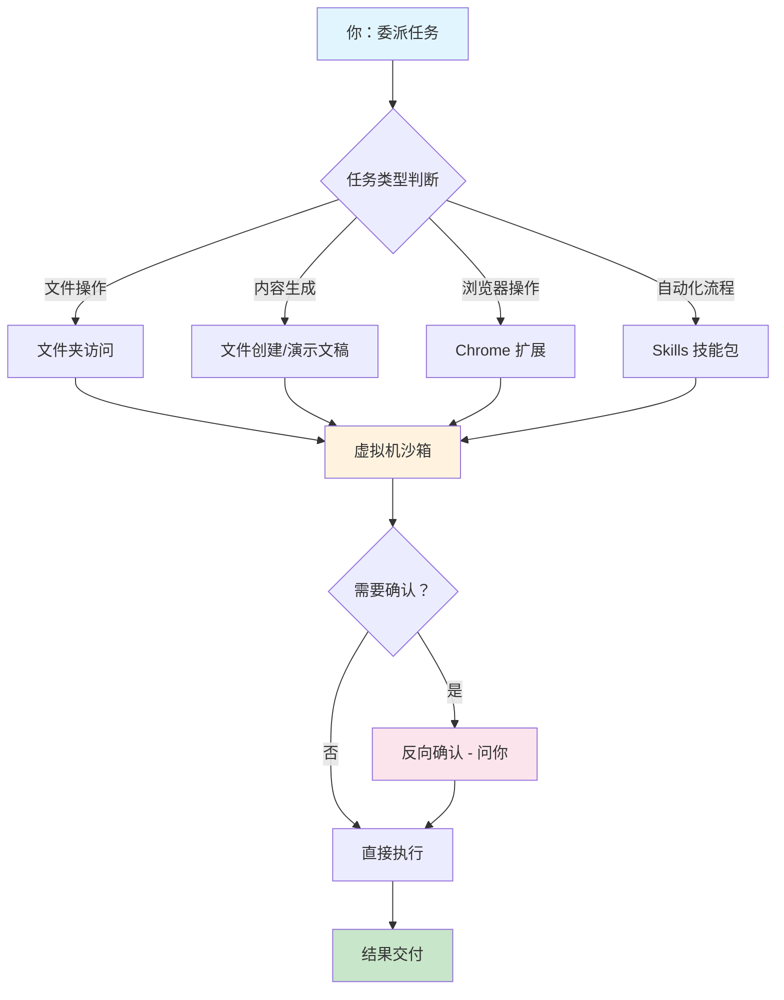

# Claude Co 上手指南：从「跟 AI 聊天」到「让 AI 干活」的工作方式转变

**一句话导读：** Claude Co 把 AI Agent 的能力从终端搬到了桌面——理解它的工作逻辑和使用方式，决定了你能否真正把 AI 从聊天工具变成执行伙伴。

---

**适合谁看：**

- 听说过 Claude Code 但被终端劝退的非技术从业者
- 已经在用 Claude Code 但只会单线程操作的开发者
- 想把团队重复性工作（填报、邮件、数据搬运）自动化的管理者
- 关注 AI Agent 落地场景，想判断真实价值的创业者
- 需要向团队解释"Agent 到底能干什么"的产品经理

**读完你会获得什么：**

- 能分清"AI 聊天"和"AI Agent"的本质区别
- 能理解 Co 的安全机制设计逻辑，知道哪些操作放心交、哪些要谨慎
- 能照着步骤完成 Co 的首次任务配置和执行
- 能掌握并行委派的工作流，而不是逐个等待 AI 完成
- 能理解 Claude Code 高手的 5 条核心配置原则，迁移到自己的工作环境
- 能避开"我自己做更快"的思维陷阱

---

## 01 背景：为什么这个问题现在值得讨论

过去一年，Claude Code 在工程师群体里完成了从"尝鲜工具"到"日常生产力"的跃迁。但它有一个硬门槛：终端。对大多数非工程师来说，命令行是一个宁可不用也不想碰的东西。

这造成了一个矛盾：Claude Code 背后的 Agent 能力（文件操作、浏览器控制、工具调用）对非技术用户同样有价值——甚至价值更大，因为他们被重复性工作困住的程度更高。但界面的门槛把这些用户挡在了外面。

Claude Co 就是来解决这个矛盾的。它把 Claude Code 的 Agent 能力包装进一个桌面应用，让非技术用户也能直接操作。这不是"又一个 AI 聊天工具"，而是一次从"对话"到"执行"的界面跃迁。

问题在于：多数人拿到 Co 之后，会习惯性地把它当聊天机器人用。这种用法浪费了它最核心的能力。

---

## 02 核心判断：Co 的本质不是聊天工具，是你的执行代理

视频表面上在演示 Co 的功能——重命名文件、建表格、发邮件。但 Boris 反复点到的东西才是核心：

**Co 是一个可以操作你电脑的 Agent，不是一个可以跟你聊天的 AI。**

这两者的区别不是功能多少的问题，是根本交互模式的转变：

- 聊天模式：你问，它答。你每一步都要等它回复，再问下一个。
- Agent 模式：你委派，它执行。你可以同时委派多个任务，它独立完成，偶尔向你确认。

Boris 用一个比喻说明了这个转变：就像 iPhone 刚出来时，没人预测到会有 Uber 这样的应用。不是功能预设的，是能力释放后，使用方式自然涌现的。Co 释放的能力是"Agent 可以操作你的电脑"——这意味着使用方式会远超产品作者的想象。

---

## 03 概念澄清：先把关键名词讲准确

### Agent（智能代理）

- **它是什么：** 能感知环境、使用工具、采取行动的 AI 系统。不只是生成文本，而是可以在你的电脑上执行操作。
- **它解决什么问题：** 把 AI 从"只能输出文字"升级为"能替你做事"。
- **它不是什么：** 不是加了搜索功能的聊天机器人。搜索仍然只是信息获取，Agent 是操作执行。
- **和相关概念的区别：** Chat（聊天）= 你问我答；Agent = 你委托，我执行并反馈结果。
- **简单例子：** "帮我把收据文件按日期重命名"——聊天 AI 会告诉你怎么做，Agent 会直接做。

### Reverse Solicitation（反向确认）

- **它是什么：** 当 Agent 对某步操作不确定时，主动向用户请求确认，而不是自行假设。
- **它解决什么问题：** 防止 Agent 在模糊情境下做出错误操作。
- **它不是什么：** 不是每一步都问你。只在它判断有歧义时才确认。
- **简单例子：** 四张收据中有一张没日期，Agent 不猜，而是问你"这张没日期，要跳过吗？"

### Skills（技能）

- **它是什么：** 针对特定工具或文件格式的操作知识包，让 Agent 知道如何正确使用某个软件。
- **它解决什么问题：** Agent 默认擅长常见操作（浏览器、表格），但面对 AutoCAD、Salesforce 等专业工具时需要额外指导。
- **它不是什么：** 不是插件或 API 集成。它本质是文档——告诉 Agent 该怎么操作某个工具。
- **简单例子：** 你用 AutoCAD，就写一个 Skill 告诉 Claude 如何操作 AutoCAD 的界面，之后它就能帮你处理 CAD 文件。

### CLAUDE.md（团队知识库）

- **它是什么：** 一个纯文本文件，记录团队对 Claude Code 的使用规范、常见错误和修正规则。
- **它解决什么问题：** 避免重复犯同样的错。"指出一次，永远记住。"
- **它不是什么：** 不是配置文件，没有格式要求，就是普通文本。
- **简单例子：** Claude 把分号写成了冒号，你在 CLAUDE.md 里加一条"本项目使用分号"，下次就不会再犯。

---

## 04 整体框架：Co 的能力边界与使用逻辑

**框架解读：**

Co 的工作流是一个**委派-沙箱执行-确认-交付**的闭环。你给出任务，Co 在虚拟机沙箱内执行，遇到不确定的操作会反向确认，最终交付结果。

核心设计原则有三层：

1. **能力递进**：文件操作 → 内容生成 → 浏览器控制 → 技能扩展，从简单到复杂。
2. **安全内嵌**：虚拟机隔离、删除保护、提示注入防护，安全不是附加功能，是架构设计。
3. **并行设计**：Co 天然支持多任务并行，这不是优化，是核心交互模式。

---

## 05 关键机制：Co 到底是怎么运行的

### 机制一：沙箱隔离

- **输入：** 你授权的文件夹、浏览器访问权限
- **处理：** Co 在一个独立虚拟机中运行所有操作，与你主系统隔离
- **输出：** 操作结果只影响授权范围内的文件
- **为什么这样设计：** 防止 Agent 误操作影响系统核心文件。比如它要删除文件时，会先弹确认。
- **代价：** 额外的资源开销；某些跨系统操作可能受限
- **适合场景：** 任何涉及文件修改的操作；不适合需要深度系统集成的场景

### 机制二：浏览器控制

- **输入：** Chrome 扩展授权 + 你打开的网页
- **处理：** Co 读取屏幕内容，模拟点击和键盘输入，像人一样操作浏览器
- **输出：** 网页上的操作结果（发送邮件、填写表格、在线搜索）
- **为什么这样设计：** 大量工作发生在浏览器中（Gmail、Google Sheets、Slack Web），不控制浏览器就做不了这些事
- **代价：** 速度比人慢；复杂的 UI 布局可能导致操作失败；需要网络连接
- **适合场景：** 结构化的浏览器操作（发邮件、填表、查信息）；不适合需要实时响应的交互

### 机制三：Skills 技能包

- **输入：** 你编写的 Skill 文档（描述如何使用某个工具）
- **处理：** Co 加载 Skill，理解特定工具的操作方式
- **输出：** 按照 Skill 指导执行专业工具的操作
- **为什么这样设计：** 通用 Agent 不可能预知所有软件的操作方式，Skill 是用户侧的知识扩展
- **代价：** 需要你前期投入时间编写和维护 Skill
- **适合场景：** 你经常使用某个专业软件，且 Co 默认操作效果不好时

### 机制四：反向确认

- **输入：** Agent 在执行中遇到模糊点
- **处理：** 暂停执行，向你展示选项并请求指示
- **输出：** 你的选择被采纳，Agent 继续执行
- **为什么这样设计：** 避免错误假设导致的错误操作。宁可多问一次，不宁可错做一步
- **适合场景：** 任何有歧义的操作（缺少信息、多种可能、潜在风险）

---

## 06 方法拆解：Co 上手的四个阶段

### 阶段一：首次启动（5 分钟内完成）

**目标：** 让 Co 能看到你的文件并完成一个简单任务

**具体动作：**
1. 下载 Claude 桌面应用（目前仅 macOS，Windows 即将支持）
2. 安装 Chrome 扩展（Co 控制浏览器的前提）
3. 选择一个文件夹授权给 Co（建议选一个不重要的文件夹练手）
4. 给出一个简单任务，例如："把这个文件夹里的文件按修改日期重命名"

**判断标准：** Co 能正确识别文件并完成操作

**常见坑：**
- 授权整个主目录 → 操作范围太大，风险高
- 第一个任务就提复杂需求 → 先验证基本功能可用

**产出物：** Co 能正常运行并完成文件操作

### 阶段二：单一任务执行（当天完成）

**目标：** 用 Co 完成一个你日常会做的真实任务

**具体动作：**
1. 识别一个你经常做的文件整理或数据处理任务
2. 清晰描述任务目标和约束条件
3. 观察 Co 的执行过程，注意它何时请求确认
4. 检查输出结果，确认质量

**判断标准：** 输出结果不需要你大量手动修正

**常见坑：**
- 描述太模糊 → "处理一下这些文件"不如"把这些收据的日期提取出来，按日期排序重命名"
- 不检查结果就信任 → 当前版本仍可能出错，尤其浏览器操作

**产出物：** 一个被 Co 正确完成的真实任务

### 阶段三：并行任务管理（一周内掌握）

**目标：** 同时运行 2-3 个任务，学会在任务间切换和管理

**具体动作：**
1. 同时启动 2-3 个独立任务（例如：一个整理文件、一个做研究、一个发邮件）
2. 在任务间切换，回答 Co 的确认请求
3. 对完成的任务检查结果，对卡住的任务补充指令

**判断标准：** 你不再等待单个任务完成，而是在多个任务间高效切换

**常见坑：**
- 开太多并行任务 → 管理成本上升，建议不超过 5 个
- 忘记检查某个任务 → 它可能卡在确认请求上等你

**产出物：** 并行工作流跑通，总耗时显著低于串行执行

### 阶段四：Skill 和自动化沉淀（持续进行）

**目标：** 为你常用的专业工具创建 Skill，形成个人知识库

**具体动作：**
1. 发现 Co 在某个工具上操作效果不好
2. 写一个 Skill 描述该工具的关键操作方式
3. 测试 Co 加载 Skill 后的执行效果
4. 持续迭代 Skill 内容

**判断标准：** Co 在加载 Skill 后对该工具的操作准确率明显提升

**常见坑：**
- 一开始就写 Skill → Boris 明确说，先用默认能力，发现不足再补
- Skill 写得太复杂 → 保持简洁，只写 Co 不知道的关键信息

**产出物：** 针对你工作场景的个性化 Skill 集合

---

## 07 案例讲解：从收据到邮件，一个完整工作流

**场景背景：** 月底财务报销，你有一文件夹的收据扫描件，文件名是随机的扫描编号，你需要整理它们并提交给财务团队。

**遇到的问题：**
- 文件名无意义，无法快速找到对应收据
- 需要把收据信息录入表格
- 需要把表格发给财务团队的 Amy

**按框架如何处理：**

**第一步：文件整理。** 授权收据文件夹给 Co，指令："把文件重命名为收据上的日期"。Co 读取文件，识别日期，重命名。遇到一个没日期的收据，它停下来问你要跳过还是手动指定。你选择跳过，它继续完成其余文件。

**第二步：数据结构化。** 指令："把所有收据信息整理成表格"。Co 读取每个文件，提取日期、金额、商户等信息，生成表格文件。

**第三步：格式优化。** 你发现 Co 生成的表格格式不够规范，让它调整列宽和对齐方式。它自动修正。

**第四步：发送邮件。** 指令："打开 Gmail，把表格发给 Amy"。Co 打开浏览器，进入 Gmail，搜索联系人，撰写邮件，附上表格，保存草稿。你确认后发送。

**最终结果：** 一个原本需要 30 分钟的手动流程，在约 10 分钟内完成（含你的确认时间）。你只需要在关键确认点做决策，其余时间可以做别的事。

**说明了什么：** Co 的价值不在于单步速度——人手动操作可能更快。价值在于：你可以并行处理多个这类任务，而 Co 在后台独立执行。时间节省来自并行，不来自单步加速。

---

## 08 常见误区

**误区一："我自己做更快"**

- 错误理解：Co 每步操作都比人慢，所以没价值。
- 为什么错：这个判断基于单任务串行思维。Co 的价值在于并行——你同时委派 3 个任务，总耗时取决于最长的那个，不是三个之和。
- 正确理解：Co 是并行执行引擎，不是单任务加速器。
- 应该怎么做：同时启动多个独立任务，在任务间切换管理，而不是等一个做完再开下一个。

**误区二："Co 就是 Claude 的桌面版聊天"**

- 错误理解：Co 只是换了个界面，跟网页版 Claude 一样。
- 为什么错：Co 底层是 Claude Agent SDK，不是 Claude Chat。它可以操作文件、控制浏览器、调用工具——这些是聊天界面做不到的。
- 正确理解：Co 是 Agent 的桌面界面，不是 Chat 的桌面界面。
- 应该怎么做：给 Co 涉及操作的任务，而不是纯对话任务。

**误区三："Co 可以随意访问我电脑上所有文件"**

- 错误理解：Co 一安装就能看到全部文件，很危险。
- 为什么错：Co 默认看不到任何文件，你必须手动授权特定文件夹。它运行在沙箱虚拟机中，操作受限。
- 正确理解：Co 的权限是 opt-in 的，不是 opt-out 的。
- 应该怎么做：只授权必要的工作文件夹，不要授权整个主目录。

**误区四："Agent 就是会搜索的 AI"**

- 错误理解：Agent = 聊天 + 搜索，本质还是信息问答。
- 为什么错：Agent 的关键能力是"行动"——使用工具、操作界面、修改文件。搜索只是其中一个工具。
- 正确理解：Chat 输出文本，Agent 输出动作。
- 应该怎么做：思考"我想让 AI 替我做什么事"，而不是"我想问 AI 什么问题"。

**误区五："先配好所有 Skill 和设置再开始用"**

- 错误理解：需要先把 Co 完美配置，才能高效使用。
- 为什么错：Boris 明确建议"先简单用，发现不足再定制"。过度配置是延迟使用的借口。
- 正确理解：Co 的默认能力已经够用，定制是使用过程中的优化，不是使用的前提。
- 应该怎么做：装好应用和 Chrome 扩展就开始用，Skill 等遇到具体问题再写。

**误区六："用小模型更省钱"**

- 错误理解：Sonnet 更便宜，所以优先选 Sonnet。
- 为什么错：Opus 虽然单价更高，但需要更少的引导和纠错。Boris 原话：因为模型更聪明，最终消耗的 token 更少，总成本反而更低。
- 正确理解：用最聪明的模型，整体效率和成本都更优。
- 应该怎么做：默认使用 Opus + Thinking 模式，除非你有明确理由选其他模型。

**误区七："Co 现在已经很成熟了"**

- 错误理解：Co 功能完整，可以直接依赖它处理重要工作。
- 为什么错：Boris 自己说 Co 目前的状态像一年前的 Claude Code——能用，但不稳定。浏览器操作仍然较慢，格式化偶尔出错。
- 正确理解：Co 处于早期阶段，适合用，不适合依赖。
- 应该怎么做：用它处理你能够检查和修正的工作，不要让它做你无法验证的操作。

---

## 09 实战清单

**立即能做：**

- [ ] 下载 Claude 桌面应用并安装 Chrome 扩展
- [ ] 选一个含 5-10 个文件的文件夹，授权给 Co，让它按某种规则重命名
- [ ] 观察一次完整的反向确认流程——看 Co 在哪一步会停下来问你
- [ ] 尝试让 Co 打开浏览器完成一个简单操作（搜索、打开页面）

**一周内能做：**

- [ ] 用 Co 完成一个你日常会做的真实重复性任务（整理文件、填写表格、发送通知）
- [ ] 练习同时运行 2-3 个并行任务，体会在任务间切换的感觉
- [ ] 记录 Co 做得不好的地方——这些就是你后续写 Skill 的候选项
- [ ] 如果你是 Claude Code 用户，检查你的 CLAUDE.md 是否已经包含了团队最常见的纠错规则

**长期要沉淀：**

- [ ] 为你工作中最常用的 2-3 个专业工具编写 Skill
- [ ] 审视你和团队每周的重复性工作，列出可以用 Co 自动化的清单
- [ ] 建立团队 CLAUDE.md 并约定更新流程——"任何人指出一次问题，就更新一次"
- [ ] 定期评估 Co 新版本的能力边界变化，更新你的使用策略

---

## 10 总结

Claude Co 把 AI Agent 从终端搬到了桌面，但这个产品真正要改变的不是界面，是工作方式。从"跟 AI 对话"到"让 AI 执行"，从"单线程等待"到"并行委派管理"，这是 Co 背后的核心范式转移。

Boris 在视频中反复提到一个判断：当前没有人——包括产品创造者自己——完全知道 Agent 最终会被怎么用。就像 iPhone 释放了 GPS 能力后出现了 Uber，Agent 释放了"操作电脑"的能力后，使用方式会自然涌现。现在能做的，是尽早开始使用，在实际工作中发现价值。

但也要清醒：Co 目前仍处于早期。浏览器操作慢、格式化偶尔出错、专业工具需要手写 Skill——这些是当下的真实局限。Boris 没有回避这些问题，他给出的建议是：**先用起来，从简单任务开始，遇到不足再定制。** 这个建议对 Co 适用，对整个 Agent 领域也适用。

一个判断：未来一年，"会不会用 Agent"将像十年前"会不会用搜索引擎"一样成为基础工作能力。差别在于，搜索引擎帮你找到信息，Agent 帮你执行任务。前者降低的是信息获取成本，后者降低的是行动成本。而行动成本的降低，才是生产力真正的跃迁点。
