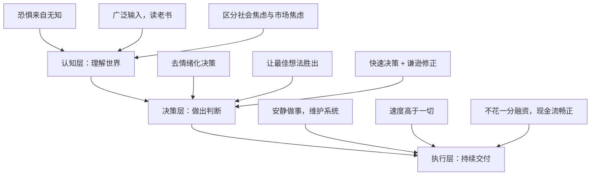

# Physical AI 时代：一个 150 亿美元公司 CEO 的清醒判断

**一句话导读：** 当硅谷在讨论 AI 写代码和聊天机器人时，真正改变十亿人生活的 AI 正在进入农场、矿井和公路——而你焦虑的根源，恰恰是对技术本身的无知。

**适合谁看：**
- 对 AI 发展方向感到困惑或焦虑的人
- 想理解 Physical AI 为什么比软件 AI 影响更大的产品经理和技术人
- 正在创业、想知道什么时候该坚持什么时候该重来的创始人
- 需要在团队中建立决策文化的管理者
- 想理解中美科技竞争本质差异的人

**读完你会获得什么：**
- 能区分"社会焦虑"和"资本市场焦虑"是两件完全不同的事
- 能理解 Physical AI 的落地路径：为什么先改造现有设备，而非造人形机器人
- 能掌握一种去情绪化的决策方法，并用它改善团队讨论质量
- 能判断自己的创业项目是否应该"重置"而非继续硬扛
- 能建立一套"读老书、广泛输入、清洁维护"的个人成长框架
- 能看穿中国科技公司的真实性质，不再用美国公司逻辑去类比

---

## 01 背景：为什么这个问题现在值得讨论

2025-2026 年，AI 叙事撕裂成两个极端：一端是"AI 将取代一切工作"的恐慌，另一端是"vibe coding 三天颠覆十亿美元公司"的狂热。两者都在制造噪音，却都缺少一个基本动作——**认真理解技术本身**。

这并非第一次人类面对技术变革时的集体焦虑。工业革命期间，卢德分子砸毁织布机；汽车出现时，铁路工人工会激烈抵抗。但事后看，工业革命让平均寿命翻倍、让供暖和电力成为基本福利、让跨国沟通从不可能变成几乎免费。

Qasar Younis 正站在这个撕裂的中央。他是 Applied Intuition 的联合创始人兼 CEO——一家估值 150 亿美元、服务全球前八大车企和顶级矿业公司的 Physical AI 公司。他同时也是 Y Combinator 前首席运营官，看过数千家创业公司的起落。他的判断是：**AI 最大的近期影响不在硅谷的软件世界，而在农场、矿井、建筑工地和公路上。** 而大多数人对 AI 的恐惧，来自一个简单的原因：不懂。

---

## 02 核心判断：你焦虑的不是 AI，是你不了解的东西

视频表面在聊 AI 趋势、创业方法论、中美竞争。但它真正在讲的是一件事：

**恐惧的本质是无知，而无知的解药不是安慰，是理解。**

这个判断贯穿了所有话题——

- 对 AI 取代工作的恐惧：源于没亲手用过 AI，不知道它的真实边界
- 对人形机器人的恐惧：源于没分清"编程执行"和"自主意识"
- 对中国科技威胁的恐惧：源于用美国公司逻辑去理解中国国家机器
- 对创业失败的恐惧：源于把自我身份绑定在单一项目上

每一个恐惧背后，都有一个可以拆解的认知盲区。拆解它，恐惧就退潮。

---

## 03 概念澄清：先把关键名词讲准确

### Physical AI（物理世界 AI）

- **它是什么**：将智能嵌入物理设备（汽车、拖拉机、矿机、潜艇），让机器在真实环境中自主或半自主执行任务
- **它解决什么问题**：危险、枯燥、人力短缺的物理世界工作——开车、采矿、种地、施工
- **它不是什么**：不是 ChatGPT，不是写代码的 Copilot，不是生成图片的 Midjourney
- **和相关概念的区别**：与"机器人"的区别在于，Physical AI 强调的是给已有设备加智能，而非从零造人形机器人；与"自动驾驶"的区别在于，自动驾驶只是 Physical AI 的一个子集
- **简单例子**：一辆现有的矿用卡车，加装传感器和智能控制系统，就能在无人矿区自主运矿——不需要先造一个人形机器人再去学开卡车

### L2+ vs L4 自动驾驶

- **L2+**：少量传感器、无高精地图、低成本计算，辅助驾驶（如 Tesla FSD）。便宜，可大规模部署，但在复杂场景下需要人接管
- **L4**：多传感器、高精地图、大算力，限定区域内完全自主（如 Waymo）。贵，但限定区域内表现远超人类
- **关键区别**：L2+ 像 iPhone 出现前的手机导航——几千美元选装；L4 像专用导航仪——在特定区域极其好用，但扩展慢。五年后两者都会大幅普及，只是路径不同

### Radical Pragmatism（激进实用主义）

- **它是什么**：Applied Intuition 的元价值观——一切以实际效果为判断标准，不追求叙事、形象或情绪满足
- **它不是什么**：不是冷酷无情，不是不做品牌，不是不沟通——而是每次做这些事之前先问：这对客户和产品有帮助吗？
- **简单例子**：CEO 做播客不是因为"创始人应该有个人品牌"，而是因为"这些想法值得被更多人听到"

### 情绪过滤器

- **它是什么**：决策时，将个人情感、身份认同、面子需求视为一种"滤镜"，它会扭曲你对信息的原始判断
- **它不是什么**：不是消灭激情，不是变成机器——而是在做产品决策的那一刻，把情绪和判断分开
- **简单例子**：你提了一个方案，团队否了。如果你的反应是"他们不尊重我"——这就是滤镜；如果你的反应是"我的方案哪里有问题"——这就是去滤镜

---

## 04 整体框架：这套内容应该如何理解

Qasar 的思维体系可以分成三层：**认知层 → 决策层 → 执行层**。

**认知层**解决"你怎么看世界"的问题。核心动作是广泛输入——尤其是读那些经过时间过滤的老书，去理解人类反复面对技术变革时的真实经历。

**决策层**解决"你怎么做判断"的问题。核心动作是剥离情绪——假装没有人的感受会受伤害，你会怎么选？选完之后，再去处理人的感受。

**执行层**解决"你怎么持续把事做成"的问题。核心动作是维护——清洁你的办公桌、维护你的代码、维护你的团队文化，就像维护一台精密机器。

三层之间有内在逻辑：认知清晰才能决策准确，决策准确才能执行有力，执行有力又反过来验证认知——或者推翻认知，迫使你修正。

---

## 05 关键机制：AI 焦虑到底是怎么产生的，又该如何消解

### 机制一：恐惧的生产线

**输入**：一个你无法理解的新技术（人形机器人挥舞双节棍、AI 写出看起来能运行的代码）

**中间处理**：你的大脑（经过几十万年进化的"洞穴大脑"）自动填充认知空白——听到灌木丛沙沙声，默认是蛇，不是风。你不懂这个机器人是怎么被编程的，大脑就默认它有自主意志。

**输出**：恐惧。具体表现为"AI 要取代我的工作""机器人要失控""中国用 AI 超越我们"。

**为什么这样设计**：进化让人类对未知保持警惕，这在草原上救命，在技术变革中误判。

**代价**：恐惧让人拒绝理解，而拒绝理解让人更恐惧——恶性循环。

**解法**：亲手用。去看 Gemini 理解不了一个倒扣的杯子。去看那个双节棍视频花了 1500 万美元编程。去汽车工厂看看，焊接机器人比人形机器人精准 100 倍，但你不怕它——因为你理解它。

### 机制二：两种焦虑的混淆

**输入**：社会层面的 AI 焦虑 + 资本市场的 AI 定价

**中间处理**：公众把两件事混为一谈——"市场在抛售科技股"= "AI 真的会摧毁这些公司"

**输出**：恐慌加剧

**真实机制**：
- **社会焦虑**：来自对技术的不理解。解法是教育和亲身体验。
- **市场焦虑**：来自对冲基金经理让咨询公司一周搭一个"看起来像 Figma"的 demo，然后说"这东西一个月就能做出来，你 500 个工程师做了两年"。基金经理不懂 demo 和产品之间的鸿沟。他们根据这个浅层判断卖出股票。

**关键洞察**：对冲基金经理不是在做深度技术分析。他们是聪明人，工作努力，但他们的信息优势不在技术理解上——这也是为什么散户投资者近年能在市场中占据更大份额。两种焦虑的源头完全不同，解法也完全不同。

---

## 06 方法拆解：创业者的"重置判断"框架

Qasar 给出了一个关键的创业者决策框架：**什么时候该继续，什么时候该重置。**

### 第一步：评估信号质量

**目标**：判断市场给你的反馈是否在帮你缩小问题空间

**具体动作**：问自己——过去三个月，我从客户/市场获得的信息，是让我更清楚该做什么了，还是同样模糊？

**判断标准**：如果信息越来越具体（"用户需要这个功能而不是那个"），继续；如果信息始终模糊（"可能有人会买"），考虑重置

**常见坑**：把"有人夸我的产品"当作信号。夸不是信号，付钱或花时间才是

**产出物**：一个明确的判断——"信号在收敛"或"信号在发散"

### 第二步：诊断根因

**目标**：找到为什么信号发散

**具体动作**：检查三个维度——
1. **团队基础**：联合创始人之间的能力互补、信任度、对问题的热情
2. **市场选择**：这个市场本身是否有足够大的痛点和支付意愿
3. **个人阶段**：你是否有足够的精力和决心在这件事上投入未来五年

**判断标准**：如果问题出在团队基础，很难修补；如果问题出在市场，可以换；如果问题出在个人阶段，需要诚实面对

**常见坑**：总认为是"执行不够好"，不愿意承认基础可能有问题

**产出物**：一个根因假设——"问题在哪一层"

### 第三步：执行重置或继续

**目标**：做出决定并行动

**具体动作**：
- 如果决定继续：设定 3 个月的明确里程碑，到期再评估
- 如果决定重置：先清零预期——"第一次创业的前三年就是零"。不要把重置当失败，把它当学习

**判断标准**：重置的标志是你能对新方向感到兴奋，而不是疲惫地换一个方向

**常见坑**：已经融了资、招了人，觉得自己不能变。但 Qasar 说：**最容易转型的时候是融钱之前、招人之前。没人关心你的时候，自由度最大。**

**产出物**：一个清晰的下一步计划，以及对自己心理状态的诚实评估

---

## 07 案例讲解：Google 为什么打不过 Facebook

这是一个被 Qasar 亲眼见证的经典案例，完美说明了"最佳想法胜出"有多难。

**场景背景**：2009-2012 年的 Google。Google 是硅谷的顶级掠食者——最好的工程师、每月 10 亿美元现金流、所有人梦寐以求的雇主。

**遇到的问题**：Facebook 从外围崛起，Google 发起全面反击——Google+、社交搜索、各种尝试。

**按框架如何处理**：

1. **信号层**：Google 有最好的数据，不可能看不到社交网络的崛起。信号是清晰的。
2. **决策层**：但 Google 的决策被"惯性"主导——15 万员工的技能、文化、激励体系全围绕搜索和广告构建。社交不是 Google 的 DNA。
3. **执行层**：无论投入多少工程师和现金，Google 无法变成一家社交公司。

**每步怎么做（如果当时有人能应用 Qasar 的框架）**：

- 去情绪化：Google 高管承认"我们不是社交公司"——但面子不允许
- 听反对意见：内部一定有人说"Google+ 方向不对"——但惯性淹没了这个声音
- 快速决策：花了数年才承认失败——如果更早承认，资源可以投向 YouTube 和 Android（这两个后来反而成了 Google 最成功的消费级产品）

**最终结果**：Google+ 关闭。Google 在社交领域彻底失败。但 Google 并没有因此衰落——因为它在其他方向（云、Android、YouTube）保持了足够的敏捷性。

**说明了什么**：**一家公司的最大威胁不是竞争对手，是自身的惯性。** 惯性让所有新信号被旧方向的噪音淹没。只有持续让最佳想法胜出，才能避免这种命运。

---

## 08 常见误区

**误区 1：人形机器人是 AI 的未来形态**

- 错误理解：通用机器人即将到来，它们能像人一样做各种事
- 为什么错：挥舞双节棍的视频是预编程的，成本 1500 万美元。汽车工厂的焊接机器人比人形机器人精准得多，但你不怕它——因为你理解它
- 正确理解：AI 的近期最大影响是给已有设备加智能（车、拖拉机、矿机），而非从零造人形机器人
- 应该怎么做：关注"智能嵌入现有设备"的进展，而非"人形机器人什么时候能做家务"

**误区 2：AI 会取代整个行业**

- 错误理解：无人驾驶出现后，所有卡车司机立刻失业
- 为什么错：用一整个行业的新设备替换旧设备，工程复杂度极高。更现实的路径是"填补人力缺口"——美国农民平均年龄 58 岁，十年后大量退休，没人接替
- 正确理解：AI 在物理世界的角色是"填坑"，不是"替换"。填补那些没人愿意做、又危险又枯燥的工作
- 应该怎么做：关注哪些行业正面临严重的人力短缺，那里才是 Physical AI 最先落地的领域

**误区 3：中国 AI 公司和美国 AI 公司是同类竞争**

- 错误理解：DeepSeek 对标 OpenAI，华为对标苹果，中国 EV 对标 Rivian
- 为什么错：华为 20 万员工中约四分之一是中共党员，公司目标不是利润最大化而是国家扩张——"华为"字面意思是"中华之志"。中国 EV 公司和 Rivian 一样亏损，但 Rivian 因为亏损被市场惩罚，中国 EV 公司因为不是真正意义上的市场化公司而继续运转
- 正确理解：美国公司是在和"中国国家"竞争，不是在和"中国公司"竞争。规则完全不同
- 应该怎么做：分析中国竞争对手时，把"盈利可持续性"作为核心指标，而非产品参数

**误区 4：创始人应该高调建立个人品牌**

- 错误理解：不发声就会被遗忘，必须持续在社交媒体上输出
- 为什么错：每一分钟做播客、发推特、写公开文章，都是一分钟没有花在客户和产品上。对于已有网络的创始人，沉默是更高效的选择
- 正确理解：品牌是工具，不是目的。没有网络时，品牌可以帮你招募人才、吸引投资；有网络时，安静做事的 ROI 更高
- 应该怎么做：根据自己所处的阶段决定——早期没资源，品牌可以是杠杆；有资源后，聚焦产品

**误区 5：创业失败说明我不适合创业**

- 错误理解：第一次创业没成功，说明我能力不行
- 为什么错：Qasar 的第三次公司才是最成功的——"做创始人本身就是一块肌肉，第一次做桌子的木匠做出来是歪的，你会告诉他去 Crate & Barrel 买，还是让他继续练？"
- 正确理解：前三年就是零，预期本身就是学习而非成功
- 应该怎么做：降低对首次创业的成果预期，把重心放在"学到了什么"上，同时保持足够投入

**误区 6：好的团队文化就是一团和气**

- 错误理解：团队和谐意味着大家都同意、没人争论
- 为什么错：Google 打不过 Facebook，不是因为不够和谐，而是因为惯性让反对声音被淹没
- 正确理解：好的团队文化是让最 junior 的人也敢在关键辩论中说出自己的想法——哪怕这个想法和所有人相反
- 应该怎么做：建立"最佳想法胜出"的机制，而非"谁级别高谁对"的机制

**误区 7：情绪和决策应该结合**

- 错误理解：好的领导者应该有激情、有信念、坚持自己的判断
- 为什么错：情绪是一种"滤镜"，它让你给信息加了权重——你的想法、你的面子、你的恐惧，都在扭曲原始数据
- 正确理解：决策时先去情绪——"如果没有任何人的感受会受伤害，我会怎么选？"选完之后，再去处理人的感受
- 应该怎么做：在团队讨论中引入这个思维实验："如果没人知道这个想法是谁提的，我们还会选它吗？"

**误区 8：读商业书才能做好生意**

- 错误理解：创业者应该读《从零到一》《高产出管理》等商业书
- 为什么错：你的阅读量一辈子可能就 50-100 本，不要浪费在低信噪比的内容上
- 正确理解：读经过时间过滤的老书——《马尔科姆·X 自传》能让你成为更好的创始人，《枪炮、病菌与钢铁》能帮你理解文明如何因技术变革而兴衰
- 应该怎么做：找你完全不了解的领域中最经典的那个书，去填充认知盲区，而不是在自己熟悉的领域反复强化

---

## 09 实战清单：读完后可以马上照着做

**立即能做**

1. **亲手用你最害怕的 AI 工具**：花 30 分钟用 ChatGPT 或 Claude 做一件你日常工作中的事。你会发现它的能力边界远比你想象的窄
2. **做一次"去情绪决策"练习**：找一个你正在纠结的决定，问自己："如果没有任何人的感受会受伤害，我会怎么选？"写下答案，再处理人的感受
3. **检查你的信号质量**：问自己——过去三个月，市场给你的反馈是更具体了，还是同样模糊？如果是后者，认真考虑重置

**一周内能做**

4. **买一本你完全不了解领域的经典书**：不要选商业书。选一个你几乎无知但重要的领域（罗马史、癌症科学、日本工业史），找该领域最经典的那一本
5. **在团队会议中引入"反对意见环节"**：下一个重要决策讨论时，正式留 10 分钟给"谁来反对当前方向？"——最 junior 的人先说
6. **列出你公司的 3-5 个核心价值**：不要想"应该有什么价值"，而是想"我们为什么成功？成功的原因是什么？"——那些原因才是你的真实价值观

**长期要沉淀**

7. **建立"旧设备 + 新智能"的思维习惯**：每当看到一个物理行业的痛点，不要想"能不能造个机器人"，而是想"现有设备加一点智能能不能解决"
8. **区分两种焦虑**：每次对 AI 或技术变化感到焦虑时，问自己——这是"我不理解它"的焦虑，还是"它真的会伤害我"的焦虑？前者靠学习消解，后者靠行动应对
9. **维护你的系统**：从清理办公桌开始。不是比喻——真的清理。Qasar 的公司所有人每周自己打扫工位。这个动作本身训练的是一种态度：我对自己周围的环境负责，我不把自己放在"这事有人做"的位置上

---

## 10 总结

Qasar Younis 的整个思想体系可以压缩成一句话：**理解它，然后去做正确的事。**

对 AI 的恐惧源于无知——不是愚蠢，而是没有花时间去亲手触摸技术的边界。一旦你看到了 Gemini 分不清杯子的上下、看到了双节棍视频背后 1500 万美元的编程成本、看到了汽车工厂里比人形机器人精准百倍的焊接手臂已经运转了 25 年——恐惧就开始退潮，取而代之的是一种更冷静的判断。

Physical AI 的真正落地路径不是造人形机器人，而是给已有的车、拖拉机、矿机加上一点智能。这条路径之所以可行，是因为它不需要重新发明机器——只需要在几十年工程积累的基础上，嵌入一个能感知和判断的"大脑"。农场、矿井、建筑工地、公路——这些地方正面临严重的人力短缺，那里的工作危险、枯燥、没人愿意做。AI 不是来抢这些工作的，是来填这些没人填的坑的。

创业和管理的核心也是同一件事：去掉滤镜，看到现实。情绪是滤镜，身份是滤镜，惯性是滤镜。你作为领导者的工作，是建立一个让最真实的信号穿透进来的系统——然后快速决策，谦逊修正。Google 打不过 Facebook 不是因为缺资源，是因为惯性让新信号被旧方向的噪音淹没。

最后一点：广泛的输入造就更好的判断。读老书，读你一无所知领域的经典，读那些经过时间过滤、信噪比极高的东西。《马尔科姆·X 自传》让你成为更好的创始人，《枪炮、病菌与钢铁》让你理解技术变革如何重塑文明。这种"看似无关实则底层相通"的输入，和 LLM 的原理一样——数据越多样，模型越鲁棒。

**恐惧是无知的影子。理解是唯一的光源。**
