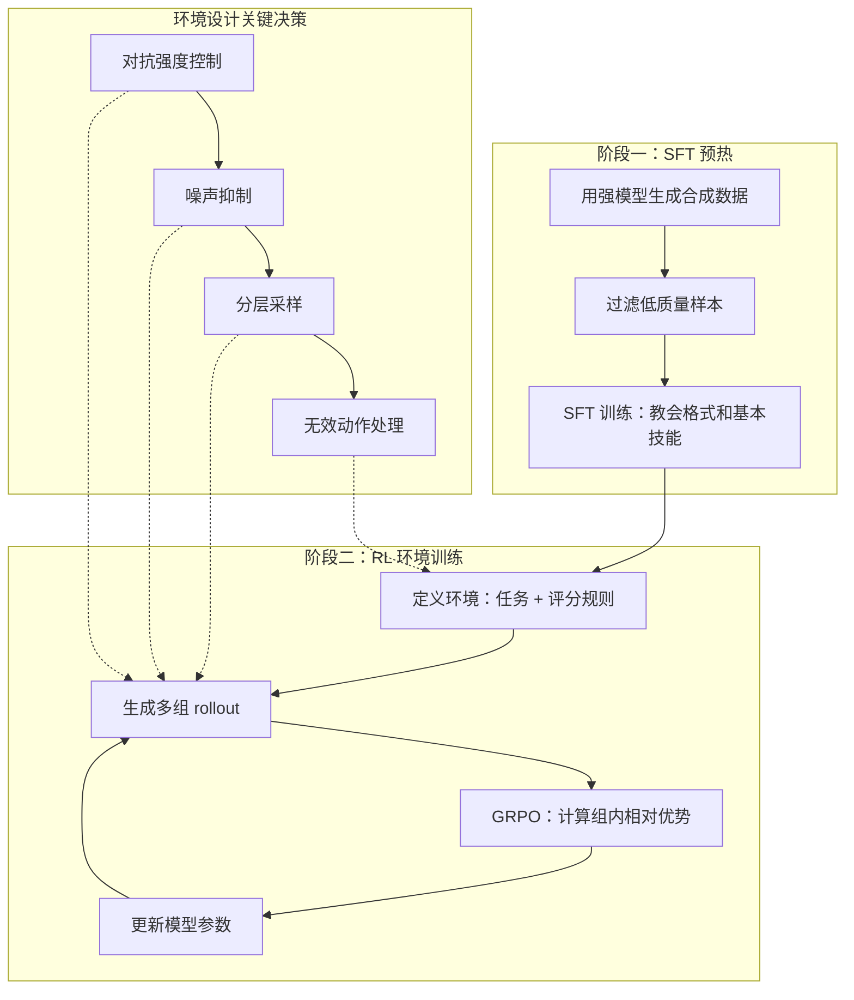

# 给语言模型一个训练场：强化学习环境的设计方法与实战

# 一句话导读

语言模型不再只能靠模仿人类示例来学习——给它一个可以交互的强化学习环境和可验证的奖励信号，它就能通过试错发现超越人类示例的策略。

# 适合谁看

- 正在探索 SFT 之外训练手段的 AI 工程师，想知道小模型如何在特定任务上匹敌大模型
- 对 DeepSeek-R1、OpenAI o1 的 RL 训练原理好奇，但没时间啃技术报告的技术人
- 需要为 LLM agent 设计评估或训练环境的产品与工程团队
- 想了解 Verifiers 开源库如何搭建 RL 环境的开发者
- 已经在做 SFT，但发现模型表现被训练数据质量卡住的实践者

# 读完你会获得什么

- 分清 SFT 和 RL with Verifiable Rewards 的本质区别——前者是模仿，后者是探索
- 掌握经典 RL 概念到 LLM 领域的完整映射，能准确使用 agent、environment、reward 等术语
- 理解 GRPO 算法的核心机制，知道它为什么比 PPO 设置更简单
- 能用 Verifiers 库搭建单轮、多轮、工具调用三类 RL 环境
- 掌握从 SFT 预热到 RL 训练的完整流程，包括对抗强度控制、噪声抑制、分层采样等关键技巧
- 避开环境偏差、批量大小选择、模型选择等至少 7 个实战坑

---

## 01 背景：为什么 RL 环境现在值得重视

### 预训练撞墙

大语言模型的标准训练流程分三步：预训练（从海量互联网文本学习语言能力）→ 监督微调 SFT（从人工标注的对话示例学习遵循指令）→ 强化学习对齐（用 PPO 等方法让模型符合人类偏好）。

这个范式正在触碰天花板。Ilya Sutskever 在 NeurIPS 2024 上指出，预训练的扩展收益在递减——单纯堆更多数据，模型质量的提升幅度越来越小。我们需要新的扩展维度。

### o1 和 DeepSeek-R1 打开了新方向

OpenAI 发布 o1 系列模型时透露了一个关键信息：**模型的推理能力随着 RL 训练计算量和测试时思考时间的增加而持续提升**。o1 背后的核心训练手段，就是强化学习配合可验证的奖励（Reinforcement Learning with Verifiable Rewards）。

DeepSeek-R1 和 Minimax 的技术报告进一步揭示了具体做法：用可验证奖励做 RL 训练，而非依赖昂贵的人工标注推理数据做 SFT。同时采用了 GRPO（Group Relative Policy Optimization）——一种比 PPO 设置更简单的 RL 算法。

### 核心变化

过去教模型的方式是"给你看答案，你照着学"（SFT）。现在，一种新的训练范式正在成熟："给你一个训练场，你自己探索答案"（RL 环境 + 可验证奖励）。这个转变让模型不再受限于人类示例的质量，能够通过试错发现更优策略。

---

## 02 核心判断：从"模仿"到"交互"的范式迁移

这段内容表面讲的是"如何用强化学习环境训练语言模型"，但真正要传递的判断是：

**SFT 是模仿学习——模型的上限被训练数据的质量锁死。RL 环境是交互学习——模型的上限取决于环境能否提供准确的奖励信号，而非人类能展示多少好例子。**

这个判断的含义：

- 如果你的任务有明确的对错判定（代码能否运行、游戏能否获胜、答案是否正确），RL 环境可以让模型通过自我博弈突破人类示例的天花板
- 如果你的任务没有客观评判标准（创意写作、开放式对话），SFT 仍是主要手段
- 两者不是替代关系，而是互补：SFT 教模型"怎么说话"，RL 环境教模型"怎么做事"

---

## 03 概念澄清：先把关键名词讲准确

### 强化学习（Reinforcement Learning）

- **它是什么**：一种学习框架，agent 通过与环境交互、试错来最大化累积奖励
- **它解决什么问题**：当最优策略无法从示例中学习时（因为示例本身不够好，或根本不存在示例），通过奖励信号引导 agent 自己发现好策略
- **它不是什么**：不是无监督学习（没有标签不等于没有信号），也不是盲目的试错（有奖励引导方向）
- **和 SFT 的区别**：SFT 从人类示例中模仿，RL 从环境反馈中探索。SFT 的上限是训练数据质量，RL 的上限是奖励信号的质量和覆盖度
- **例子**：教模型下棋——SFT 的做法是给它看人类高手的棋谱让它模仿；RL 的做法是让它自己下棋，赢了给正奖励，输了给零或负奖励

### Agent（智能体）

- **它是什么**：在 RL 框架中做出决策的一方，观察状态、选择动作、接收奖励
- **在 LLM 语境下**：语言模型本身就是 agent，它的动作是"生成文本"（包括思考过程和最终回答）
- **它不是什么**：agent 不只是"能调用工具的模型"——即便不调用工具，单轮问答中的模型也是 agent
- **扩展**：现代 LLM agent 可以配备工具（API、终端、搜索引擎），这使环境设计更复杂也更强大

### Environment（环境）

- **它是什么**：agent 交互的对象，包含任务定义、状态管理、评分规则——一切用于评估和训练模型的逻辑
- **它解决什么问题**：提供一个动态系统，让模型可以交互、试错、获得反馈，而非只能看静态数据集
- **它不是什么**：不是数据集。数据集是静态的问答对，环境是动态的交互系统
- **和 SFT 数据集的区别**：SFT 数据集提供"问题-答案"对，环境提供"问题-交互-奖励"循环
- **例子**：训练模型玩井字棋——环境就是游戏引擎：提示模型出招、跟踪棋盘状态、生成对手动作、判断胜负

### Reward（奖励）

- **它是什么**：环境给 agent 的信号，表示当前动作的好坏
- **在 LLM 语境下**：可以是 +1（赢）、0（输）、-0.1（格式错误），或 0 到 1 之间的连续值（如最长公共子序列比率）
- **可验证奖励（Verifiable Reward）**：能被程序自动判定正确性的奖励，如答案是否正确、游戏是否获胜、代码是否通过测试。这是和 RLHF 中人类偏好模型的核心区别——可验证奖励不需要训练一个"评判模型"

### Trajectory / Rollout（轨迹/回合）

- **它是什么**：agent 从初始状态到终止状态的一次完整交互序列，包含所有状态、动作和奖励
- **它解决什么问题**：记录了一次完整的"经验"，用于训练时评估和比较不同策略的效果
- **例子**：一盘完整的井字棋对局，从空棋盘到分出胜负，就是一条 trajectory

### GRPO（Group Relative Policy Optimization）

- **它是什么**：一种 RL 算法，从同一个起点生成一组 rollout，计算组内平均奖励，奖励高于平均的 rollout 被强化，低于平均的被抑制
- **它解决什么问题**：相比 PPO，GRPO 不需要训练一个单独的价值模型（critic），设置更简单
- **核心机制**：用组内相对优势（advantage）替代绝对价值估计，同组 rollout 互为基线

---

## 04 整体框架：从 SFT 到 RL 环境的完整训练路径

**框架解释**：

训练分为两个阶段。**阶段一**是 SFT 预热，用合成数据教会模型基本的格式和技能——这解决的是"能不能上场"的问题。**阶段二**是 RL 环境训练，核心循环是：生成 rollout → 评估奖励 → 计算优势 → 更新参数。这个循环让模型从"能上场"进化到"能赢"。

环境设计不是一次到位的，它是一组关键决策：对手多强、如何减少环境随机性导致的噪声、如何保证每个训练批次的对手多样性、如何处理模型犯规。这些决策直接影响训练稳定性和最终效果。

---

## 05 关键机制：RL with Verifiable Rewards 如何运行

### 机制一：可验证奖励 vs 偏好模型

**输入**：模型对一个问题生成推理过程和最终答案

**处理**：
- RLHF/偏好模型方式：另一个模型（reward model）对回答打分，分数来自人类偏好数据的训练
- 可验证奖励方式：程序直接检查答案是否正确（数学题对答案、代码跑测试、游戏判胜负）

**输出**：奖励信号

**为什么这样设计**：可验证奖励避免了偏好模型的训练成本和偏差。只要任务有客观评判标准，就不需要训练一个"评判模型"来替代规则。

**代价**：只适用于有客观对错的任务。开放式任务（如写作、开放式对话）没有通用的可验证奖励。

**适用/不适用场景**：适用于数学推理、代码生成、游戏对弈、工具调用、事实问答；不适用于创意写作、风格评估、主观判断。

### 机制二：GRPO 训练循环

**输入**：同一个初始状态（如同一道题、同一个棋盘）

**处理**：
1. 模型通过采样生成一组 rollout（如 4-8 条不同的推理路径）
2. 环境评估每条 rollout 的奖励
3. 计算组内平均奖励作为基线
4. 每条 rollout 的优势 = 自身奖励 - 组平均奖励
5. 正优势的 rollout 被强化，负优势的被抑制
6. 更新模型参数

**输出**：更新后的模型

**为什么这样设计**：用组内相对比较替代绝对价值估计，不需要训练额外的 critic 模型，大幅简化设置。

**代价**：组大小太小会导致优势估计不稳定，太大则计算开销高。

**适用场景**：任何可以用同一初始状态生成多条不同路径的任务。

### 机制三：环境动态交互循环

**输入**：模型生成的文本响应

**处理**：
1. 环境解析模型响应，提取动作（如棋步、工具调用）
2. 验证动作合法性
3. 执行动作，更新环境状态
4. 检查终止条件（游戏结束、任务完成、达到轮次上限）
5. 如未终止，生成新的 prompt 返回给模型
6. 如已终止，计算最终奖励

**输出**：下一轮 prompt 或最终奖励

**为什么这样设计**：agent 和环境的交互是交替进行的——模型生成一步，环境回应一步，直到任务完成。这比单轮问答更接近真实使用场景。

**代价**：实现复杂度更高，需要管理状态、处理异常、控制轮次。

**适用场景**：多轮对话、游戏、工具调用、代码调试等需要连续交互的任务。

---

## 06 方法拆解：用 Verifiers 构建 RL 环境

### 步骤一：定义数据集

**目标**：为环境提供输入数据

**具体动作**：在 `load_environment` 中加载数据集，将原始数据映射为 `question`（模型看到的提示）和 `answer`（用于奖励计算的参考答案）。可以用内置默认数据集，也可以加载自定义数据。

**判断标准**：每个数据集条目至少包含 `question` 字段，`answer` 字段视任务而定。

**常见坑**：数据集太小导致 rollout 缺乏多样性；数据集太大导致训练不收敛。

**产出物**：一个 HuggingFace Dataset 对象，包含 `question` 和可选的 `answer` 列。

### 步骤二：定义解析器

**目标**：从模型输出中提取结构化信息

**具体动作**：初始化 `XMLParser`（或其他解析器），在系统提示中指定输出格式（如 `<move>3</move>`），解析器从模型生成的文本中提取标签内的内容。

**判断标准**：解析器能正确提取 95% 以上的合规输出。

**常见坑**：格式定义过于严格导致模型难以遵循；过于宽松导致解析失败。

**产出物**：一个 Parser 对象，能够从文本中提取结构化字段。

### 步骤三：定义奖励函数

**目标**：量化模型输出的好坏

**具体动作**：编写奖励函数，接收模型输出和参考答案，返回 0-1 之间的数值。单一任务可以用单一奖励；复杂任务可以组合多个加权奖励。将奖励函数打包为 `Rubric`（奖励集合）。

**判断标准**：奖励信号能有效区分好输出和坏输出，且信号清晰（不要所有 rollout 都得到接近的分数）。

**常见坑**：奖励过于稀疏（只有在最终结果正确时才给奖励，中间步骤没有信号）；奖励过于密集（每一步都给奖励，信号噪声大）。

**产出物**：一个 Rubric 对象，包含一个或多个加权奖励函数。

### 步骤四：选择环境类型并实现核心逻辑

**目标**：搭建 agent 和环境交互的框架

**具体动作**：

**单轮环境**（如文本反转、数学问答）：
- 继承 `SingleTurnEnv`
- 实现 `load_environment`：数据加载 + 解析器 + 奖励 + Rubric

**多轮环境**（如"你确定吗"式验证、井字棋）：
- 继承 `MultiTurnEnv`
- 实现 `setup_state`：初始化状态字典（棋盘、当前玩家等）
- 实现 `response`：环境对模型输出的响应逻辑（可包含动态生成）
- 实现 `is_completed`：终止条件（游戏结束、轮次上限）

**工具环境**：
- 继承 `ToolEnv`
- 定义 Python 函数作为工具
- 模型可以在 rollout 中调用工具、获取结果、继续推理

**判断标准**：环境能正确处理正常输入和异常输入，不会崩溃或卡死。

**常见坑**：忘记处理无效动作（如棋盘上已占用的位置），导致训练崩溃。

**产出物**：一个可运行的 Verifiers 环境。

### 步骤五：评估 → 训练 → 迭代

**目标**：验证环境可用，然后开始训练

**具体动作**：
1. **先做评估**：用现有模型跑环境，看奖励分布是否合理
2. **如果模型太弱**：用强模型生成合成数据，做 SFT 预热
3. **启动 RL 训练**：使用 Verifiers 自带 trainer 或集成 PrimeRL、TRL 等框架
4. **监控训练曲线**：观察奖励函数的变化趋势，识别早期异常
5. **评估训练后模型**：不仅看指标，还要抽样检查实际输出

**判断标准**：训练后模型在环境中的表现明显优于训练前。

**常见坑**：跳过评估直接训练；训练参数不合适导致不稳定或模型崩溃。

**产出物**：训练后的模型 checkpoint。

---

## 07 案例讲解：把一个几乎不会下棋的小模型训练成井字棋大师

### 场景背景

井字棋看似简单，但对语言模型来说并非易事：它需要多轮交互、跟踪棋盘状态、理解对手意图、规划获胜路径。用 SFT 的方式，你很难收集足够多样的高质量对局数据来教会模型下棋——井字棋的状态空间虽有限，但用数据集捕捉所有棋局动态仍然困难。

### 遇到的问题

选择 LFM2（Liquid AI 的小型开源模型）作为起点。评估发现：
- 格式遵循能力差：经常无法按 `<move>N</move>` 格式输出
- 无效动作多：选择已被占用的位置
- 棋力极弱：偶尔能赢随机对手，完全无法应对最优对手

### 第一步：SFT 预热

用 GPT-4o mini（格式遵循完美的模型）生成 200 局合成对局数据，过滤掉输掉的棋局，保留赢棋和和棋。用这些数据做 SFT 训练，教会模型输出格式和基本走法。

**结果**：格式遵循率接近完美，无效动作显著减少，但棋力仍然有限——SFT 只教会了它"怎么说话"，没教会它"怎么赢"。

### 第二步：搭建 RL 环境

用 Verifiers 实现井字棋环境：
- 模型输出 `<move>N</move>` 格式的走法
- 环境解析走法、验证合法性、更新棋盘、生成对手走法、判断胜负
- 奖励函数组合：赢棋权重 1.0 + 格式正确权重 0.2 + 无效动作惩罚 -0.1

### 第三步：环境优化——对抗强度控制

一开始对手是随机玩家，太弱，模型容易学到侥幸策略。后来对手是最优玩家（minimax 算法），太强，模型永远赢不了，学不到东西。

**解决方案**：引入随机走子概率参数，让对手在最优走法和随机走法之间混合。训练时，随机走子概率从 20% 到 70% 分布——既不太难也不太易。同一数据集条目的不同 rollout 面对相同难度的对手，确保公平比较。

### 第四步：环境优化——噪声抑制

GRPO 比较同一起点的多条 rollout，如果对手的行为是随机的，奖励差异会来自对手而非模型自身策略，这会引入噪声。

**解决方案**：
- 为每个数据集条目设定固定种子，决定谁先手
- 为每一步推导特定种子，保证相同棋盘位置对手走法相同
- 分层采样：每个训练批次包含均匀分布的不同难度对手，防止某个批次全是对强手或全是对弱手

### 第五步：第一轮 RL 训练

使用 GRPO 算法训练。关键参数：批量大小低于 256 会导致训练不稳定甚至模型崩溃——批量大小太小意味着模型从极少量对局和对手类型中学习，容易陷入局部策略。

**结果**：模型成为相当强的井字棋选手，对随机对手胜率极高，对最优对手无效动作接近零。但仍有缺陷：有时会落入"四路陷阱"——自己没下错，但已让对手同时有两条获胜路径。

### 第六步：推向完美

尝试直接对最优对手训练，失败——模型过度防御，面对随机对手反而变差。

**关键调整**：提高探索温度（temperature），让模型尝试新策略。代价是初期奖励显著下降——模型在乱试，但经过探索阶段后，奖励恢复并超过之前水平。这是一段必要的"探索阵痛期"。

**最终结果**：模型成为井字棋大师。对抗随机对手的表现和 GPT-4o mini 相当，但对抗最优对手时**优于** GPT-4o mini——一个用 GPT-4o mini 合成数据训练出来的小模型，在特定任务上超越了它的老师。

### 这个案例说明了什么

SFT 教会模型"怎么说话"（格式、基本走法），RL 环境教会模型"怎么赢"（策略、对抗）。两者缺一不可，但真正的能力跃迁来自 RL 训练。模型能发现超越人类示例（甚至超越强模型示例）的策略——这正是 RL 环境的核心价值。

---

## 08 常见误区

### 误区一：认为 RL 环境可以完全替代 SFT

- **错误理解**：有了 RL 环境，就不需要 SFT 了
- **为什么错**：如果模型连基本格式都遵循不了，RL 训练无从开始。小模型直接上 RL，大量 rollout 浪费在无效输出上，奖励信号太稀疏
- **正确理解**：SFT 是"学前班"，教会基本技能；RL 是"实战训练"，提升策略水平。先 SFT 打底，再 RL 突破
- **应该怎么做**：用强模型生成合成数据做 SFT 预热，再启动 RL 训练

### 误区二：对手越强，训练效果越好

- **错误理解**：让模型直接和最强对手对练，进步最快
- **为什么错**：对手太强，模型永远得不到正奖励，无法形成有效的学习信号。就像让新手直接和围棋九段下棋，除了输什么都学不到
- **正确理解**：对手强度需要从易到难渐进控制，确保模型在每个阶段都能获得足够的正奖励
- **应该怎么做**：设置对手强度的可调参数（如随机走子概率），训练过程中逐步提高难度

### 误区三：批量大小越大越好（或越小越好）

- **错误理解**：大批量 = 更稳定 = 更好；或小批量 = 更快迭代 = 更好
- **为什么错**：大批量训练慢但稳定；小批量训练快但不稳定，尤其在环境本身有多难度等级时，小批量会导致每个 batch 的对手分布不均，平均奖励剧烈波动
- **正确理解**：批量大小是稳定性-效率权衡的关键旋钮，需要根据环境多样性调整
- **应该怎么做**：从 256 开始实验。如果环境有多难度等级的对手，配合分层采样保证每个 batch 的对手分布均匀

### 误区四：环境实现的小偏差不影响训练

- **错误理解**：对手算法的一个小实现差异不会影响结果
- **为什么错**：讲者亲身经历的教训——minimax 算法在多个最优走法等价时总是选第一个，导致模型实际上在和一个"特定风格的最优玩家"对练。模型记住了这个特定对手的模式，而非理解通用的最优策略
- **正确理解**：环境偏差会被放大。模型会利用环境中的任何规律性，包括你无意中引入的偏差
- **应该怎么做**：仔细审查环境实现，尤其是对手算法；测试对手行为是否确实如你预期

### 误区五：选择最大的预训练模型作为 RL 起点

- **错误理解**：起点模型越大，RL 后越强
- **为什么错**：大模型推理成本高，训练资源有限时大量计算花在处理超长推理链上；推理模型（已经会输出长思考链的模型）在资源受限时尤其危险——你可能只是在截断它的输出，反而损害能力
- **正确理解**：选择"有潜力但未特化"的模型，而非"已经很强但资源上训练不动"的模型
- **应该怎么做**：在环境中评估多个候选模型，选那个格式遵循尚可、基本行为合理、但还有明显提升空间的模型

### 误区六：只看训练曲线判断训练质量

- **错误理解**：训练曲线持续上升 = 训练成功
- **为什么错**：训练曲线可能因为环境偏差、奖励漏洞等原因虚高。模型可能在利用某个你没想到的捷径
- **正确理解**：训练曲线是必要检查项，但不是充分判断标准
- **应该怎么做**：训练后做独立评估，不仅看数值指标，还要抽样检查模型实际输出；在真实任务中测试，不只看自动化评分

### 误区七：训练一开始就要持续盯着

- **错误理解**：RL 训练必须持续监控，一有波动就调参
- **为什么错**：RL 训练有天然波动，尤其在探索阶段。提高温度后的初期奖励下降是正常的探索行为，不是训练失败。过早干预会打断模型正在进行的策略探索
- **正确理解**：启动时确认模型能正常运行、无报错；之后留给训练足够的时间
- **应该怎么做**：开始训练后，先确认运行正常，然后去做别的事。定期而非持续地检查进度

---

## 09 实战清单

### 立即能做

1. **找一个有明确对错判定的任务**，写下它的可验证奖励定义（如：代码任务 = 是否通过测试，数学任务 = 答案是否正确，游戏任务 = 是否获胜）
2. **安装 Verifiers 库**（`pip install verifiers`），浏览内置环境示例，选择一个最接近你任务的作为起点
3. **用现有模型在你定义的任务上做一次基线评估**，记录表现——不要跳过这一步

### 一周内能做

4. **实现你的第一个环境**：从 `SingleTurnEnv` 开始，定义数据集、解析器和奖励函数，跑通评估流程
5. **如果基线模型太弱，用强模型生成 100-200 条合成数据做 SFT 预热**
6. **为你的环境设计对手强度控制**（如果适用），确保训练初期模型能获得足够的正奖励信号

### 长期要沉淀

7. **建立环境测试习惯**：每次修改环境后，先用固定种子跑几次评估，确认行为符合预期
8. **积累训练参数笔记**：批量大小、学习率、对手强度、温度——记录每个任务的参数组合和结果，建立自己的经验库
9. **关注环境偏差**：定期审查环境中的隐含假设（如对手算法的确定性偏好），防止模型学到你无意中教的东西

---

## 10 总结

语言模型的训练正在经历一次重要的范式扩展。SFT 仍然不可或缺——它教会模型基本的语言能力和指令遵循。但在需要策略、推理和多步决策的任务上，SFT 的天花板是训练数据的质量。你能给模型看多少好例子，它最多就学到那个水平。

强化学习环境提供了另一条路径：不需要人类展示最优策略，只需要定义好任务和奖励信号，让模型自己探索。DeepSeek-R1 和 OpenAI o1 已经证明了这条路径的潜力。

但 RL 环境不是魔法。它的效果取决于环境设计的质量——对手强度是否合理、奖励信号是否清晰、随机噪声是否被抑制、训练参数是否稳定。这些决策没有通用公式，需要在具体任务中反复实验。

井字棋案例给出了一个清晰的证明：一个几乎不会下棋的小模型，经过 SFT 预热和 RL 环境训练，能在特定任务上超越生成其训练数据的强模型。这不是因为小模型更聪明，而是因为 RL 环境给了它 SFT 无法提供的东西——**一个可以试错和从结果中学习的空间**。

**如果你能定义一个清晰的可验证奖励信号，你就能构建一个 RL 环境，训练出一个在特定任务上匹敌甚至超越大模型的小模型——成本是大模型训练的零头。这是当前 AI 工程中最被低估的能力。**
