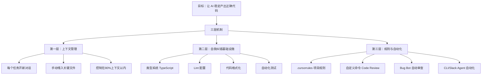

# Cursor 高效使用法：从 Vibe Coding 到生产级 AI 协作

> 不会用 Cursor 的人，把 AI 当搜索引擎；会用 Cursor 的人，把 AI 当成一个需要管理上下文、需要约束边界、需要自我校验的协作者。区别全在"上下文管理"和"系统设计"上。

---

## 适合谁看

- 已经在用 Cursor，但感觉 AI 输出质量越来越差、越聊越废的开发者
- 从 Vibe Coding 毕业、想用 AI 写生产代码但不知道怎么保证质量的人
- 带团队的技术负责人，想把 AI 代码审查和 Bug 修复流程化
- 独立开发者或创业者，想让 AI 帮你处理项目里的琐碎改动
- 对 AI 编程工具有兴趣但还没找到正确用法的产品经理或技术初学者

---

## 读完你会获得什么

- 理解为什么你的 Cursor 对话越聊越差——以及怎么解决
- 掌握让 AI Agent 自我纠错的四个基础设施：类型系统、Lint、格式化、测试
- 学会设计自己的 .cursorrules 和自定义命令，让 AI 按你的规范输出
- 知道什么时候该开新对话、什么时候该把文件手动加入上下文
- 理解 Bug Bot、CLI Agent、Slack Agent 的适用场景和用法
- 获得一份可直接照做的行动清单

---

## 01 背景：为什么这个问题现在值得讨论

Cursor 之类的 AI 编程工具降低了写代码的门槛。很多人第一次用就惊艳了——几句话就能生成一个完整功能。但用了一段时间后，常见的问题出现了：

- AI 生成的代码跑不通，改了东墙塌西墙
- 对话越来越长，AI 开始"忘记"之前说的话，输出质量断崖式下降
- 生成的东西风格不统一，每次都不一样
- 你觉得 AI 变笨了，但又说不清是哪里出了问题

这不是模型变差了。是使用方式没有从"聊天模式"切换到"工程模式"。

Cursor 团队的 Lee 在日常开发中一天会启动 20+ 个 Agent 对话，每个对话只做一件事。他不是一个写超长 Prompt 的人——他的做法是：**短 Prompt + 精准上下文 + 自动校验机制**。这套方法才是真正让 AI 在生产环境中可靠运行的关键。

---

## 02 核心判断：视频真正想讲的不是 Cursor 技巧

表面上，这个视频在教 Cursor 的使用技巧。实际上，它讲的是一个更根本的问题：

**AI 编程的核心瓶颈不是模型能力，而是你给模型的工作环境。**

大多数人把 AI 当成一个聪明但没有纪律的助手——给它一个模糊指令，希望它自己想清楚一切。这在小实验里能跑通，在生产代码里必然翻车。

Lee 的做法体现了一个不同思路：**你不需要更聪明的 AI，你需要一个让中等 AI 也能稳定产出正确结果的系统。** 这个系统包括：约束上下文、提供自动校验、预设规则、分任务执行。这套思路和传统软件工程里"靠流程而非靠个人"的理念完全一致。

---

## 03 概念澄清：先把关键名词讲准确

### Context Window（上下文窗口）

- **它是什么**：AI 模型在一次对话中能"记住"的最大信息量。可以理解为模型的工作记忆。
- **它解决什么问题**：没有上下文窗口，模型每次回复都是无状态的，无法参考之前的对话内容。
- **它不是什么**：它不是无限记忆。它有硬上限，超出部分会被丢弃或压缩。
- **和相关概念的区别**：上下文窗口是"一次对话的容量"，不是"跨对话的记忆"。开新对话，上下文清零。
- **一个简单例子**：Lee 的某个对话消耗了约 17% 的上下文窗口。如果对话堆积到 80-90%，模型就开始迷失关键信息，输出质量下降。

### Agent（AI 代理）

- **它是什么**：Cursor 中能自主读取文件、执行命令、修改代码、读取校验结果并自我修正的 AI 对话单元。
- **它解决什么问题**：把"你告诉 AI 改什么"升级为"你告诉 AI 目标，它自己找文件、改代码、跑校验、修复问题"。
- **它不是什么**：它不是全知全能的。它受上下文窗口限制，也不能理解项目里没喂给它的信息。
- **和相关概念的区别**：Agent 比 Chat 模式更自主——Chat 是你问它答，Agent 是你给目标它自己执行。
- **一个简单例子**：Lee 说"给这个按钮加事件追踪"，Agent 自己找到相关文件、添加代码、跑 Lint、发现没有错误后完成任务。

### Self-Correction（自我纠错）

- **它是什么**：Agent 修改代码后，自动读取 Lint 错误、测试结果、类型检查输出，发现并修复自己的错误。
- **它解决什么问题**：AI 生成的代码不需要人工逐行检查。它自己跑校验，自己改，直到通过。
- **它不是什么**：它不能代替代码审查。它只能捕获形式化工具（Lint、类型检查、测试）能发现的问题，逻辑错误仍然需要人判断。
- **和相关概念的区别**：自我纠错是"机器校验机器"，代码审查是"人校验机器"。
- **一个简单例子**：Agent 写了一段 TypeScript 代码，跑 Lint 发现类型错误，自动修复后再次校验通过。Lee 不需要介入。

### .cursorrules（项目规则文件）

- **它是什么**：项目根目录下的配置文件，定义 AI 在该项目中应遵守的规则和偏好。
- **它解决什么问题**：不用每次对话重复说明同样的规范——AI 每次开新对话都会自动读取这些规则。
- **它不是什么**：它不是法律。AI 可能不严格遵守，但有了规则比没有好得多。
- **和相关概念的区别**：.cursorrules 是项目级的持久化配置，自定义命令是一次性的手动触发。
- **一个简单例子**：Lee 在 .cursorrules 中维护了一份"禁用词列表"，避免 AI 生成营销腔文案。

### Bug Bot

- **它是什么**：Cursor 内置的自动化代码审查工具，集成在 GitHub PR 中，自动审查提交的代码变更。
- **它解决什么问题**：不用自己写代码审查脚本，开箱即用的 AI Code Review。
- **它不是什么**：它不是安全扫描工具，也不是测试运行器。它审查的是逻辑遗漏和代码质量。
- **一个简单例子**：Lee 提交了一个 PR 添加英文文档，Bug Bot 发现他漏掉了其他语言的国际化文档。

---

## 04 整体框架：从 Vibe Coding 到工程化 AI 协作

**文字解释**：这套框架的核心逻辑是——**你不可能靠 Prompt 写得好来保证 AI 输出质量，你必须靠系统来兜底。**

- **第一层解决的是"AI 能不能记住关键信息"**：上下文窗口是有限的。如果你把 30 分钟的对话全塞进一个窗口，AI 一定丢信息。所以每个独立任务开新对话，只给必要的上下文。
- **第二层解决的是"AI 犯了错能不能自己发现"**：人写代码靠 IDE 和测试兜底，AI 写代码也一样。TypeScript 的类型检查、ESLint 的规则、Prettier 的格式化、测试框架的断言——这些是 Agent 自我纠错的感官系统。没有这些，AI 就是盲人摸象。
- **第三层解决的是"AI 的输出符不符合你的规范"**：规则文件让 AI 知道你的偏好，自定义命令让你一键触发常用流程，Bug Bot 和 CLI Agent 让审查和修复自动化。这一层是"系统替你管 AI"。

三层缺一不可。只有上下文管理没有自我纠错，AI 会自信地写出错误代码；只有自我纠错没有上下文管理，AI 连改什么都搞不清楚；只有规则没有自动化，规则就只是文档，不会变成行动。

---

## 05 关键机制：它到底是怎么运行的

### 机制一：上下文窗口管理

- **输入**：你的对话历史 + 手动指定的文件 + 项目规则
- **中间处理**：模型在有限窗口内权衡哪些信息对当前任务重要
- **输出**：基于"它认为"最相关的上下文生成代码
- **为什么要这样设计**：上下文窗口是模型架构的硬限制，无法绕过
- **带来了什么代价**：窗口越大不一定越好。研究表明，超长上下文反而导致质量下降——模型被无关信息干扰
- **适合场景**：每个离散任务用独立对话，上下文保持在 20-50% 之间
- **不适合场景**：把一天所有的工作塞进一个对话，指望 AI 记住所有细节

Lee 的实践数据：他一天 20 个对话，大部分对话只改 3-75 行代码，上下文消耗在 17% 左右。这个数字本身就是最佳实践——小任务、小上下文、高精度。

### 机制二：Agent 自我纠错循环

- **输入**：你的任务描述 + 项目代码 + Lint/TypeCheck/Test 配置
- **中间处理**：Agent 生成代码 → 运行校验 → 读取错误 → 修改代码 → 再次校验 → 通过
- **输出**：通过所有校验的代码
- **为什么要这样设计**：AI 的首次输出几乎必定有形式化错误（类型不匹配、格式不规范、测试不通过）。与其让人改，不如让机器改。
- **带来了什么代价**：增加 Token 消耗（每次纠错都是一次额外调用）；延长完成时间；逻辑错误无法被形式化工具捕获
- **适合场景**：有完善 Lint/类型检查/测试的项目
- **不适合场景**：没有类型系统的 Python 脚本、没有测试的项目——Agent 失去自我纠错的感官

### 机制三：规则驱动的输出约束

- **输入**：.cursorrules 文件 + 自定义命令 + Prompt
- **中间处理**：AI 读取规则，在生成内容时尝试遵守
- **输出**：符合项目规范的代码或文档
- **为什么要这样设计**：AI 默认输出是"统计上最常见的"，不是"符合你项目风格的"。规则文件让你把偏好持久化，不用每次重复说。
- **带来了什么代价**：规则太多太杂会让 AI 无所适从；规则之间可能矛盾；AI 不一定严格遵守每条规则
- **适合场景**：写作风格、代码规范、禁用词列表、审查清单
- **不适合场景**：试图用规则文件解决所有问题——它只是引导，不是法律

---

## 06 方法拆解：如果自己要做，应该怎么落地

### 步骤一：建立自我纠错基础设施

**目标**：让 Agent 有能力自己发现和修复形式化错误。

**具体动作**：
1. 使用 TypeScript（或至少加 JSDoc 类型标注）
2. 配置 ESLint，开启严格规则
3. 配置 Prettier 或等效格式化工具
4. 至少为核心逻辑写测试

**判断标准**：Agent 生成代码后，能通过 `lint` + `typecheck` + `test` 三道关卡。

**常见坑**：只配了 Lint 没配类型检查——类型错误是最难肉眼发现的，也是 AI 最常犯的。

**产出物**：一个 Agent 能在其中自我纠错的项目环境。

### 步骤二：每个任务开新对话

**目标**：保持上下文窗口的清洁和聚焦。

**具体动作**：
1. 识别什么是"一个任务"——一个功能点、一个 Bug 修复、一个重构，都算一个任务
2. 完成当前任务后，关掉对话，开新的
3. 上下文消耗超过 60% 时，即使任务没完成也考虑开新对话重新开始

**判断标准**：对话结束时上下文消耗不超过 50-60%。AI 的输出始终和你的需求高度相关，不出现"跑偏"或"遗忘"。

**常见坑**：觉得"开新对话要重新解释背景很麻烦"——这正是 .cursorrules 存在的意义。规则文件会自动注入，你不用重复。

**产出物**：一系列短小精悍的 Agent 对话，每个对话完成一个明确任务。

### 步骤三：手动喂入关键文件

**目标**：确保 Agent 看到的是正确的、充分的上下文，而不是自己去猜。

**具体动作**：
1. 在 Prompt 中用 `@filename` 语法引用关键文件
2. 不是把整个项目丢进去，而是只给与当前任务相关的文件
3. 如果任务涉及某个组件，把这个组件文件 + 它的类型定义文件 + 相关测试文件一起喂进去

**判断标准**：Agent 不需要反复问"你说的是哪个文件？"，第一次就能定位到正确位置。

**常见坑**：什么都不指定，让 Agent 自己搜——它能搜到，但会消耗宝贵的上下文窗口，而且可能找到错误的文件。

**产出物**：精准的上下文输入，让 Agent 高效完成任务。

### 步骤四：编写项目规则文件

**目标**：把你的偏好和规范持久化，让每次对话都自动遵守。

**具体动作**：
1. 在项目根目录创建 `.cursorrules` 文件
2. 写入代码规范（命名约定、文件组织等）
3. 写入写作规范（如果你的项目涉及文档）
4. 维护一份"禁用词/禁用模式"列表（避免 AI 输出套话）
5. 定期更新，把 AI 反复犯的错误写进规则

**判断标准**：新对话中 AI 的输出风格明显更符合你的偏好，不再出现规则中列出的禁用模式。

**常见坑**：写了一堆规则但从不更新——规则文件应该是活的文档，随着项目演进。

**产出物**：一个持续维护的 `.cursorrules` 文件。

### 步骤五：创建自定义命令

**目标**：把重复性审查流程一键化。

**具体动作**：
1. 识别你经常做的审查动作（代码审查、安全检查、性能检查）
2. 为每个审查类型写一个 Markdown 文件，列出要检查的点
3. 在 Cursor 中配置自定义命令，绑定到对应的 Markdown 文件
4. 审查清单要具体：不要写"检查安全性"，而要写"检查是否有未处理的认证变更"

**判断标准**：一个命令触发后，Agent 能系统地检查你列出的每个关注点并给出反馈。

**常见坑**：清单太笼统，AI 无法执行具体检查——"注意代码质量"是废话，"检查是否有未处理的加载状态"是有效指令。

**产出物**：一组可复用的自定义审查命令。

### 步骤六：引入 Bug Bot 和自动化

**目标**：让代码审查和修复脱离手动操作。

**具体动作**：
1. 在 GitHub 仓库中启用 Cursor Bug Bot
2. 配置 CI 脚本，用 Cursor CLI 在 CI 流水线中跑 Agent
3. 尝试从 Slack 或 Web 界面触发 Agent 处理小任务
4. 设置自动化规则：PR 提交时自动审查、CI 失败时自动尝试修复

**判断标准**：常见的代码遗漏和小 Bug 被 Bot 自动捕获，你只需要审查 Bot 的建议而非逐行检查。

**常见坑**：期望 Bot 解决复杂架构问题——它擅长的是遗漏检查和小 Bug 修复，不是架构决策。

**产出物**：一个有 AI 审查和自动化修复能力的 CI/CD 流程。

---

## 07 案例讲解：用一个具体场景串起来

**场景背景**：你在开发一个课程平台，有一个侧边栏显示课程目录，每个条目可点击跳转。用户反馈说点击条目后，搜索框没有清空，大纲也没有重置，体验混乱。

**遇到的问题**：这是一个小 Bug，但涉及多个组件的联动——侧边栏、搜索框、大纲视图。手动改要翻好几个文件。

**按框架如何处理**：

**第一步：开新对话**。这是一个独立的 Bug 修复任务，不和之前的对话混在一起。

**第二步：喂入关键文件**。在 Prompt 中引用侧边栏组件、搜索框组件、大纲组件。

**第三步：写简洁的 Prompt**。不需要写长篇描述，直接说："当用户点击侧边栏新条目时，重置搜索框输入和侧边栏大纲到初始状态。"——这正是 Lee 的做法，Prompt 不长，但目标清晰。

**第四步：让 Agent 自我纠错**。Agent 修改代码后自动跑 Lint 和类型检查。如果有错误，它自己改。你不用介入。

**第五步：审查结果**。Agent 报告修改通过所有校验。你快速浏览变更，确认逻辑正确。

**最终结果**：3-5 分钟完成了一个跨组件的 Bug 修复，没有手动翻文件，没有跑测试，没有改了 A 坏了 B。

**说明了什么**：AI 的高效不来自它有多聪明，而来自你给它的工作环境有多好——类型系统防止它写错类型，Lint 防止它违反规范，你喂入正确的文件防止它改错地方，开新对话防止它被旧上下文干扰。

---

## 08 常见误区

### 误区一：在一个对话里完成所有工作

- **错误理解**：对话越长，AI 对项目越了解，输出越好。
- **为什么错**：上下文窗口有上限。对话超过 80% 容量后，AI 开始丢失早期关键信息，被无关内容干扰，输出质量反而下降。研究表明超长上下文任务的质量显著劣于短上下文。
- **正确理解**：每个独立任务开新对话。上下文干净，输出精准。
- **应该怎么做**：一天的工作拆成 10-20 个短对话，每个对话只做一件事。

### 误区二：Prompt 越长越详细越好

- **错误理解**：给 AI 写大段详细指令，它就能完美执行。
- **为什么错**：Lee 的实践证明，3-5 行的清晰指令 + 正确的文件引用 + 自动校验机制，远胜于 50 行的"完美 Prompt"。Prompt 的作用是告诉 AI 目标，不是替它思考。
- **正确理解**：Prompt 要清晰和具体，但不需要冗长。关键是喂对文件、设对校验。
- **应该怎么做**：写短 Prompt，把精力放在项目基础设施（类型、Lint、测试）和规则文件上。

### 误区三：AI 输出可以直接用，不需要校验

- **错误理解**：AI 生成的代码既然通过了，就不用看了。
- **为什么错**：自动校验只能捕获形式化错误（类型不匹配、格式不规范、测试失败）。逻辑错误、业务逻辑漏洞、安全风险，形式化工具检测不出来。
- **正确理解**：自动校验是第一道防线，人工审查是第二道防线。两道都要有。
- **应该怎么做**：让 Agent 跑完校验后，快速浏览关键变更。重点关注业务逻辑和安全。

### 误区四：Vibe Coding 够用了，不需要工程化

- **错误理解**：能跑就行，Vibe Coding 就够了。
- **为什么错**：Vibe Coding 在原型阶段确实够用。但当代码量增长、多人协作、需要长期维护时，没有类型系统、没有测试、没有规范的项目会让 AI 也束手无策——它和你一样，在一个混乱的代码库里也会迷失。
- **正确理解**：Vibe Coding 是起点，不是终点。从原型到生产，你必须补上工程基础设施。
- **应该怎么做**：即使是个人项目，也至少加上类型系统和 Lint。这是 AI 自我纠错的前提。

### 误区五：Bug Bot 能替代人工代码审查

- **错误理解**：有了 Bug Bot，不需要人工审查了。
- **为什么错**：Bug Bot 擅长检查遗漏（漏了国际化、漏了边界条件），但不擅长判断架构合理性和业务逻辑正确性。它找到的是"你没注意到的东西"，不是"你判断错了的东西"。
- **正确理解**：Bug Bot 是审查的补充，不是替代。它处理机械性检查，你处理判断性检查。
- **应该怎么做**：Bug Bot 做第一轮自动审查，你做第二轮关键逻辑审查。

### 误区六：规则文件写了就不用管了

- **错误理解**：.cursorrules 写一次就够了。
- **为什么错**：项目在演进，AI 的常见错误模式也在变化。过时的规则不仅无效，还可能误导 AI。
- **正确理解**：规则文件是活文档，需要持续维护。
- **应该怎么做**：每周或每次发现 AI 反复犯同类错误时，更新规则文件。也删掉不再适用的旧规则。

### 误区七：非开发者不适合用 Cursor

- **错误理解**：不会写代码就不应该碰 Cursor。
- **为什么错**：Lee 明确说，你不需要是专家。即使是初学者，开始理解代码怎么运作后，会获得一个巨大的优势。完全不看代码的工具会存在，但能看懂代码的人永远有更多控制力。
- **正确理解**：Cursor 对非开发者有学习曲线，但这条曲线值得爬。你不需要成为专家，理解基本结构就够了。
- **应该怎么做**：从用 Cursor 做小改动开始，逐步理解代码结构。不要等"准备好了"才开始。

### 误区八：CLI Agent 比 GUI 更高级

- **错误理解**：真正的高手用终端，GUI 是给新手用的。
- **为什么错**：Lee 自己说他日常用 GUI 编辑器，不用 CLI。工具选择是偏好问题，不是能力问题。GUI 更方便审查代码、点击跳转文件；CLI 更方便自动化和脚本集成。
- **正确理解**：选你用着顺手的。两种模式的 Agent 能力完全相同。
- **应该怎么做**：日常开发用你觉得最舒服的界面。自动化场景用 CLI 或 Slack 触发。

---

## 09 实战清单：读完后可以马上照着做

### 立即能做

1. **检查当前对话的上下文消耗**——如果超过 60%，关掉，开新的
2. **在 Prompt 中手动引用关键文件**——下次让 Agent 改代码时，先 `@` 进相关文件，而不是让它自己找
3. **给当前项目加 .cursorrules**——哪怕只写 3 条最基本的规则（代码风格、命名约定、禁用词），也比没有强
4. **清理你正在进行的超长对话**——把大对话拆成几个小任务，每个开新对话重新开始

### 一周内能做

5. **为你的项目配置完整的自我纠错链**——TypeScript + ESLint + Prettier + 至少一个测试，确保 Agent 生成代码后能自动校验
6. **创建第一个自定义命令**——写一个代码审查清单 Markdown 文件，配置成自定义命令，下次提交 PR 前跑一遍
7. **在 GitHub 上启用 Bug Bot**——让你的下一个 PR 自动收到 AI 审查意见
8. **维护一份"AI 常见错误"清单**——观察这周 AI 反复犯的错误，写进 .cursorrules

### 长期要沉淀

9. **把 AI Agent 接入 CI 流水线**——用 Cursor CLI 在 CI 中自动跑安全审查或文档更新
10. **建立团队的 AI 协作规范**——统一规则文件、审查流程、对话管理方式，让团队所有人的 AI 使用质量一致
11. **定期做知识库 Lint**——检查规则文件是否过时、自定义命令是否还有效、团队是否在遵循规范
12. **探索自动化触发场景**——从 Slack 触发 Bug 修复、从 Web 界面启动文档更新，找到你团队最频繁的"小任务"并自动化

---

## 10 总结

AI 编程工具的真正价值不在于"让不会写代码的人会写代码"，而在于"让会写代码的人写得更少、更准、更快"。但要兑现这个价值，你不能只是打开工具、输入需求、祈祷结果。

Lee 的实践揭示了一个被广泛忽视的事实：**AI Agent 的输出质量，主要取决于你给它的工作环境，而不是你写的 Prompt。** 类型系统、Lint、测试、格式化——这些"老派"的工程实践，恰恰是 AI 自我纠错的基础设施。没有它们，Agent 就是闭着眼睛改代码。有了它们，Agent 才能自己发现错误、自己修复、自己校验通过。

上下文管理是另一个关键变量。大多数人把对话做得越来越长，以为 AI 在积累理解。实际上，超过 80% 的上下文容量后，模型的质量是下降的。每个任务开新对话不是麻烦，是精度保障。

规则文件和自定义命令把你的偏好从"每次重复说"变成"系统自动遵守"。Bug Bot 和 CLI Agent 把审查和修复从手动操作变成自动流程。这些都不是锦上添花，是让 AI 从"偶尔好用"变成"始终可靠"的必要条件。

**一句话判断：用 Cursor 的分水岭不在你会不会写 Prompt，而在你会不会给 AI 搭一个能让它自我纠错的工作环境。能搭这个环境的人，AI 是协作者；不能搭的人，AI 是赌注。**
