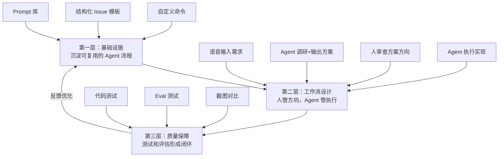

# 复利工程：两个工程师如何用 AI Agent 干出十五人的活

一句话导读：当 AI Agent 能跑完整条工程链路时，问题从"怎么写代码"变成了"怎么设计让 Agent 持续增值的工作系统"。

适合谁看：
- 每天用 Cursor/Windsurf 但觉得只省了打字时间的人
- 带 2-5 人小团队、想用 AI 放大产出的技术管理者
- 正在评估各种 AI Coding Agent 该选哪个的人
- 想从"用 AI 写代码"升级到"用 AI 做工程"的人
- 对 AI Agent 工作流感兴趣的非技术产品人

读完你会获得什么：
- 理解"复利工程"的核心逻辑——为什么每次工作都应该让下一次更容易
- 掌握用 Claude Code 构建自定义命令的完整方法
- 学会在 AI 工作流中设置"早期纠偏"的关键检查点
- 拿到一份 AI Coding Agent 的实战评级参考
- 明白哪些工程工作该交给 Agent、哪些必须人来把关
- 能把当前工作流改造为"人管 Agent、Agent 干活"的模式

---

## 01 背景：为什么这个问题现在值得讨论

2024 年底到 2025 年初，AI 编程工具经历了一次质变。Cursor 和 Windsurf 让开发者体验到了"AI 辅助写代码"的便利——自动补全、行内编辑、上下文感知。但本质上，这些工具仍然把 AI 当作一个更聪明的代码补全器。你还是在编辑器里，一行一行地写，只是快了一些。

真正改变游戏规则的是 Claude Code 这类终端 Agent 的成熟。它们不只是写代码——它们读你的代码库、搜索最佳实践、操作 GitHub、创建 PR、运行测试、甚至截图对比 UI。当 Agent 能跑完"理解需求→调研方案→写代码→跑测试→提 PR"的完整链路时，工程工作的重心就从"写代码"转移到了"设计工作流"。

Every 公司的 Cora 团队就是在这个转折点上找到了一套方法。两个人——产品负责人 Natasha 和工程师 Heren——用 AI Agent 跑出了十五人的产出。他们的核心发现不是"AI 能写代码"，而是**当 AI 能做工程链路上的每件事时，你应该重新设计整条链路让每次工作都为下次积累价值**。他们管这个叫"复利工程"（Compounding Engineering）。

---

## 02 核心判断：复利工程的本质不是提速，是重新定义工程师的角色

视频表面上在讲"怎么用 Claude Code 等 AI Agent 写代码"，实际在讲一件事：**当 Agent 能执行工程链路上的大部分任务时，工程师的核心能力从"执行"变成了"纠偏"**。

这个判断有两个层面：

第一，工程工作中真正需要人做的是判断方向，而不是动手实现。Heren 直说，一个 bug 修复——查找表单没发出的原因、定位代码变更、修复并创建 PR——以前需要 30 分钟到几小时的专注工作，现在他只是用语音描述问题，Agent 就跑完了。但他强调，Agent 给出方案后必须有人的直觉审查，因为 Agent 的方向可能一开始就是错的。

第二，"复利"的关键是每次工作产出不只是完成了当前任务，还为未来的任务沉淀了工具和流程。Heren 和 Natasha 最有价值的实践不是某个具体的 Agent 调用，而是他们花时间建了一个"生成 GitHub Issue 的自定义命令"——一个能自动调研代码库和最佳实践、输出结构化技术文档的 prompt。这个 prompt 每用一次就省掉一次从零写需求文档的时间，而且每次使用的数据（Issue 本身）又成为下一步 Agent 实现的输入。

**核心公式：复利工程 = 沉淀可复用的 Agent 流程 × 在最早阶段纠偏 × 人负责判断方向、Agent 负责执行**

---

## 03 概念澄清：先把关键名词讲准确

### Claude Code

- 它是什么：Anthropic 出品的终端 AI 编程 Agent，运行在命令行中，底层使用 Claude 模型
- 它解决什么问题：让 AI 不只能写代码，还能操作文件系统、搜索代码库、调用 GitHub、运行测试、搜索网页——完成工程工作的完整链路
- 它不是什么：不是 IDE 插件，不是代码编辑器，不提供语法高亮和文件树
- 它和 Cursor/Windsurf 的区别：Cursor 和 Windsurf 是"编辑器里加 AI"，Claude Code 是"终端里的全能 Agent"。前者你还是在写代码，只是 AI 帮你写得更快；后者你是在下指令，AI 去执行。Claude Code 界面极简——只有一个文本框——但因为它能调用更多工具，反而更强大
- 一个简单例子：在终端输入 `claude`，然后说"过去一周我们发布了什么"，它会自己查 git log，整理出功能列表和修复记录，输出产品化的更新说明

### 复利工程（Compounding Engineering）

- 它是什么：一种工程实践方式，每次工作的产出不只是完成当前任务，还让下一次同类任务更容易完成
- 它解决什么问题：避免每次都从零开始——如果每次需求分析都要手写文档，每次调研都要重新搜索，效率不会随时间增长
- 它不是什么：不是简单的"积累代码库"或"写可复用组件"，而是积累**可复用的 Agent 流程和结构化中间产物**
- 它和传统工程效率的区别：传统效率优化是"把每件事做得更快"，复利工程是"让每件事的产出成为下一件事的加速器"
- 一个简单例子：Heren 创建了一个 Claude Code 自定义命令（slash command），输入一句话需求描述，它就自动调研代码库、搜索最佳实践、输出结构化的 GitHub Issue 文档。这个命令每用一次，就不需要重新写一遍需求分析流程

### 自定义命令（Slash Command / Custom Prompt）

- 它是什么：Claude Code 中预设的可复用 prompt 模板，用快捷键触发
- 它解决什么问题：避免每次都手写长 prompt。把"调研→分析→输出文档"的完整流程固化成一个命令
- 它不是什么：不是快捷键宏或代码片段——它包含完整的推理链和步骤指引
- 一个简单例子：Heren 设置了一个命令，按 `shift+s` 触发，输入一句话，Agent 就按"调研代码库→搜索最佳实践→输出方案→等确认→创建 GitHub Issue"的流程自动执行

### Evals（评估）

- 它是什么：对 AI 系统输出质量的系统性测试，类似软件测试但针对 prompt 和模型行为
- 它解决什么问题：验证 prompt 或 Agent 工作流是否稳定可靠，而不是"有时候好用"
- 它不是什么：不是简单的"试几次看看效果"——evals 是结构化的、可重复的测试
- 一个简单例子：Heren 让 Claude Code 跑一个 eval，发现 10 次中有 4 次失败，于是让 Agent 自己分析失败原因（调用了错误的工具），修改 prompt 后重新测试直到全部通过

---

## 04 整体框架：复利工程的三层结构

**框架解释：**

复利工程不是一个工具或一个技巧，而是一个三层系统：

**第一层是基础设施**——你要先投入时间，把重复性的工程流程固化为 Agent 可以直接执行的自定义命令和结构化模板。这部分投入在短期内是"额外成本"，但长期是所有复利的来源。Heren 和 Natasha 花了一整个下午，把"写需求文档"这件事变成了一个可复用的命令，此后每次新功能都不需要从零开始。

**第二层是工作流设计**——在日常工作中，人负责方向判断，Agent 负责执行。关键是"在最早阶段纠偏"：Agent 出一个方案，人先审查方向对不对，再让 Agent 去实现。这比"Agent 写完代码你再 code review"效率高得多，因为方向错了，后面全是浪费。

**第三层是质量保障**——测试和评估不只是检查产出质量，更是优化 Agent 流程的反馈信号。当你发现 eval 通过率低，就去改进 prompt；当你发现测试挂了，就让 Agent 自己修。质量保障的数据反过来驱动基础设施的优化，形成闭环。

---

## 05 关键机制：每个环节怎么运行

### 机制一：自定义命令——"一个 prompt 生成所有需求文档"

**输入**：一句话需求描述（甚至语音输入）

**中间处理**：
1. Agent 将需求描述插入预设模板的"问题描述"字段
2. 自动调研当前代码库，了解已有实现和相关模块
3. 搜索网页，查找开源中的最佳实践和常见模式
4. 基于调研结果，输出结构化文档：问题陈述、方案愿景、需求列表、技术要求、实现步骤
5. 等待人确认方案方向
6. 确认后自动创建 GitHub Issue，放入正确的看板泳道

**输出**：一份完整的、可直接用于开发的 GitHub Issue

**为什么要这样设计**：需求分析是工程中最耗认知资源、也最容易被跳过的环节。手动做时，人往往直接跳到写代码；用 Agent 做时，如果每次都要写长 prompt 描述"请先调研再输出方案"，重复成本极高。把这个流程固化为命令，就把"每次 30 分钟的认知劳动"变成了"一句话 + 5 分钟审查"。

**代价**：前期投入——你需要花时间设计这个命令的结构和步骤。Heren 用了 Anthropic 的 Prompt Improver 来优化初始 prompt，这本身就花了半天时间。

**适合场景**：需要频繁创建新功能或新需求的团队。不适合一次性、探索性的工作。

### 机制二：早期纠偏——"在规划阶段审查方向，而不是在代码阶段返工"

**输入**：Agent 生成的方案或计划

**中间处理**：
1. 人阅读方案文档（或让 Agent 用更易读的方式呈现——问题列表、用户故事、选项对比）
2. 检查方向是否正确、是否有遗漏、是否与产品意图一致
3. 发现问题则修改方案，确认无误后让 Agent 执行

**输出**：一个方向正确的执行指令

**为什么要这样设计**：Heren 引用了《High Output Management》中的原则——"在任何生产过程中，应该在价值最低的阶段修正问题"。AI Agent 是一个放大器，方向对了，它能高速产出正确结果；方向错了，它能高速产出错误结果，而且你还要花时间回头改。在规划阶段纠偏，成本最低；在实现阶段返工，成本最高。

**代价**：你需要花时间读文档。Heren 坦承这"有点无聊"，但他找到了方法：让 Agent 用问题列表和用户故事的形式呈现方案，比干巴巴的技术文档更容易读。

**适合场景**：所有使用 Agent 工作的场景。特别是当你发现 Agent 实现了某个功能，但方向完全不对时——你应该反思是否跳过了规划阶段的审查。

### 机制三：Eval 驱动优化——"让 Agent 自己修自己的问题"

**输入**：一个 Agent 工作流（prompt + 工具调用链）

**中间处理**：
1. 编写 eval——定义什么是"正确输出"
2. 多次运行 eval，统计通过率
3. 如果通过率不够，让 Agent 分析失败案例（为什么调用了错误工具？哪里指令不够具体？）
4. Agent 修改 prompt
5. 重新运行 eval，直到通过率达标

**输出**：一个经过验证的、稳定可靠的 Agent 工作流

**为什么要这样设计**：代码需要测试，prompt 同样需要测试。一个 prompt "有时候好用"是不够的——你需要它"稳定好用"。Eval 就是 prompt 的测试套件。更妙的是，当你让 Agent 自己跑 eval、分析失败、修改 prompt、再测试时，你只需要在旁边等着。

**代价**：编写 eval 本身需要时间，而且需要你明确知道"正确输出"长什么样。对于模糊的创意性任务，eval 很难定义。

**适合场景**：可重复执行的 Agent 工作流——特别是 prompt 调用工具链的场景。不适合一次性探索任务。

---

## 06 方法拆解：如果自己要做，应该怎么落地

### 第一步：选择你的主力 Agent

**目标**：确定一个日常工程工作的核心 Agent 工具

**具体动作**：
- 如果你已经在用 Cursor 或 Windsurf，先不要换。在现有工具中尝试把 AI 用于编码之外的任务（搜索代码库、写文档、查 git 历史）
- 如果你想尝试 Claude Code，在终端安装它，用一整天的时间只做一件事：遇到任何工程任务，先问"能不能让 Agent 做"

**判断标准**：你能在 5 分钟内把一个任务描述清楚并交给 Agent 吗？如果能，说明你选的工具足够灵活

**常见坑**：不要因为听说 Claude Code 好就立刻完全切换。Heren 和 Natasha 也是在 Cursor 和 Windsurf 上积累了足够经验后，才发现终端 Agent 更适合他们的工作方式

**产出物**：一个你每天打开电脑就会用的 Agent 工具

### 第二步：识别你的重复工程流程

**目标**：找出你工作中每周至少做两次的、有固定步骤的任务

**具体动作**：
- 列出你过去一周做的所有工程任务
- 标记出其中有固定步骤的（需求分析、bug 调查、发布说明、code review、测试编写……）
- 选出最痛的一个——耗时最长、认知负担最重、最容易被跳过的

**判断标准**：这个任务是否有明确的输入（一句话描述、一个 bug 报告）和明确的输出（一份文档、一个 PR、一段代码）？如果有，就是候选

**常见坑**：不要选太复杂的任务作为第一个。从"写发布说明"或"创建 Issue"这种中等复杂度、高重复性的任务开始

**产出物**：一个待固化的重复流程列表，标注优先级

### 第三步：构建你的第一个自定义命令

**目标**：把选定的重复流程转化为一个可复用的 Agent 命令

**具体动作**：
1. 手动做一次这个任务，记录你每个步骤的思考过程
2. 把这些步骤写成 prompt，包含：要调研什么、输出什么格式、什么情况下需要停下来等人确认
3. 用 Prompt Improver 或手动迭代优化这个 prompt
4. 在 Claude Code 中注册为自定义命令（或在你用的工具中保存为可复用 prompt）

**判断标准**：另一个人（或你自己三天后）能只看输入和命令名就跑出和手动做质量相当的输出吗？

**常见坑**：prompt 太短，Agent 会跳步骤；prompt 太长，Agent 会迷失。Heren 的经验是给出明确步骤列表，每步说明目的和输出

**产出物**：一个可复用的自定义命令 + 首次使用的输出样本

### 第四步：建立早期纠偏习惯

**目标**：在让 Agent 执行之前，先审查方向

**具体动作**：
- 当 Agent 输出方案或计划时，强制自己读完再让它继续
- 如果文档太长读不下去，让 Agent 用"问题列表"或"用户故事"的形式重新呈现
- 发现方向问题时，修改方案再让 Agent 执行；不要"先让它写完再改"

**判断标准**：你是否在 Agent 开始编码前确认了方向？如果你发现自己经常在 code review 时才发现方向不对，说明你在规划阶段跳过了审查

**常见坑**：急躁——觉得"先让它写吧，反正能改"。这是最大的浪费来源

**产出物**：一个包含"人审方案"环节的工作流

### 第五步：为关键流程添加测试

**目标**：用 eval 和代码测试保障 Agent 产出的稳定性和正确性

**具体动作**：
- 对 Agent 生成的代码，要求它同时编写最基本的 smoke test
- 对 Agent 使用的 prompt，编写 eval——定义什么是正确输出，跑 10 次看通过率
- 如果通过率低于 80%，让 Agent 自己分析失败原因并修改 prompt

**判断标准**：eval 通过率是否稳定在 80% 以上？代码测试是否覆盖了核心路径？

**常见坑**：追求 100% 覆盖率——不值得。smoke test 就够了。eval 也只需要覆盖核心场景

**产出物**：核心流程的测试套件 + eval 套件

---

## 07 案例讲解：一个表单 Bug 的完整修复流程

**场景背景**：Cora 团队有一个用户反馈表单，每周会议中用来跟踪产品健康度。Natasha 发现最近没人填这个表。

**遇到的问题**：表单静默失效了——用户没有被触发填写，但没有任何报错信息。传统做法是：打开代码库，回忆表单触发的逻辑在哪，搜索最近的代码变更，定位到具体 commit，找到被删除的触发代码，修复并部署。这个流程在理想情况下也需要 30 分钟到 1 小时的专注时间。

**按框架如何处理**：

1. **描述问题**：Heren 在 Claude Code 中输入"为什么没人填反馈表了？14 天前可能有什么代码变更，查一下"
2. **Agent 调研**：Claude Code 自动创建检查清单——获取最近的 git 变更、搜索控制器代码、定位相关提交。它找到了：14 天前的一个 commit 中，一段触发用户填写表单的代码被误删
3. **方案审查**：Agent 给出修复方案——恢复被删除的代码。Heren 审查方向正确
4. **执行实现**：Heren 说"帮我创建 PR"。Agent 不只恢复了代码，还额外创建了一个迁移脚本，给之前漏掉的用户补发表单
5. **质量保障**：Agent 自动运行相关测试

**最终结果**：从发现问题到 PR 创建完成，Heren 没有离开终端，没有打开编辑器，没有手动搜索代码。他说"这没有消耗我任何精力，就像写一条消息一样简单"。

**说明了什么**：这个案例的核心不是"AI 能修 Bug"——任何有经验的工程师 30 分钟也能修完。核心是**认知成本**。传统方式需要你切换上下文、回忆代码结构、专注排查——这之后你需要时间重新进入原来的工作状态。而 Agent 处理时，你的大脑可以继续思考更重要的事情。这就是复利：省下来的认知空间，用在了更有价值的判断上。

---

## 08 常见误区

**误区一：AI 编程就是让 AI 写代码**

- 错误理解：用 AI 编程 = 用 AI 替代打字
- 为什么错：工程工作中写代码可能只占 20%，剩下 80% 是需求分析、调研、代码审查、测试、部署、文档。如果 AI 只帮你写代码，你只优化了 20% 的工作
- 正确理解：AI 编程 = 让 AI 参与工程链路上的每个环节
- 应该怎么做：每次遇到工程任务，先问"这个任务能不能让 Agent 来做？"——不管是写代码还是查 git log 还是写发布说明

**误区二：用最强的模型就够了，不用设计工作流**

- 错误理解：模型够强，随便写个 prompt 就能出好结果
- 为什么错：模型越强，它执行错误方向的速度越快。没有结构化工作流，你会反复得到"看起来不错但方向不对"的输出
- 正确理解：强模型 + 好工作流 = 高产出；强模型 + 差工作流 = 高速产出垃圾
- 应该怎么做：花时间设计自定义命令、定义审查检查点、编写测试和 eval

**误区三：跳过规划直接让 Agent 实现**

- 错误理解：先让 Agent 写代码，不对再改
- 为什么错：返工成本远高于纠偏成本。Agent 花一小时实现了一个方向错误的功能，你需要花另一小时理解它做了什么、删掉重来。而在规划阶段花 5 分钟审查方案，就能避免这一切
- 正确理解：在价值最低的阶段修正问题（规划 > 方案 > 实现 > 测试）
- 应该怎么做：Agent 出方案→人审查方向→确认→Agent 执行。把这个变成固定环节，不要跳过

**误区四：只用一个 Agent 解决所有问题**

- 错误理解：找到一个最好的 Agent，所有事都用它
- 为什么错：不同 Agent 有不同的强项。Claude Code 擅长调研和通用工程任务，Friday 擅长 UI 实现，Charlie 擅长 code review。强行用一个工具做所有事，就像用一个程序员做前端、后端、设计、运维
- 正确理解：不同任务用不同 Agent，像组建团队一样组合 Agent 的能力
- 应该怎么做：列出你日常的工程任务类型，为每种类型评估并选择最合适的 Agent

**误区五：测试和评估不重要，AI 能自我纠错**

- 错误理解：AI Agent 会自己发现错误并修正，不需要写测试
- 为什么错：Agent 的"自我纠错"只在你给它明确判断标准时才有效。没有测试，Agent 不知道什么叫"做对了"。Heren 让 Agent 跑 eval 才发现通过率只有 60%——不跑 eval 你永远不知道
- 正确理解：测试是代码的验证手段，eval 是 prompt 的验证手段。两者都不可或缺
- 应该怎么做：对关键 Agent 流程，编写 eval 并定期运行；对 Agent 生成的代码，要求同步编写 smoke test

**误区六：必须学编程才能用 AI Agent**

- 错误理解：Claude Code 是终端工具，只有程序员能用
- 为什么错：Heren 说他已经把非技术朋友也转化成了 Claude Code 用户。终端看起来吓人，但 Claude Code 的界面就是一个文本框——你说话，它干活。比 Cursor 和 Windsurf 的各种快捷键和面板其实更简单
- 正确理解：终端 Agent 的门槛不在技术，在于你能不能把任务描述清楚
- 应该怎么做：如果你会用 ChatGPT 对话，你就能用 Claude Code。区别只是它能访问你的文件和工具

**误区七：现在学 AI 工具太早了，等技术成熟再说**

- 错误理解：等技术稳定了再学，效率更高
- 为什么错：Heren 和 Natasha 的经验是"整个编码领域每三个月就完全变一次"。等稳定的时候，你已经错过了积累复利的时间窗口。更重要的是，复利工程的核心——沉淀可复用的流程——在任何技术阶段都有价值
- 正确理解：越早开始沉淀，复利积累越多。工具会变，但"设计工作流"的能力不会贬值
- 应该怎么做：选一个工具立刻开始用，遇到问题再换。不要等"完美工具"

---

## 09 实战清单：读完后可以马上照着做

**立即能做：**

1. 打开你当前使用的编码工具，对它做一个"能力审计"：列出它能做的所有事情（不只是写代码），标注你从未用过的能力
2. 选一个你今天要做的小任务，先尝试用 AI Agent 完成——哪怕只是让它帮你写一段 git commit message
3. 打开你最近做的 3 个 PR 或功能，回溯每一步，标记哪些步骤可以交给 Agent、哪些必须人来判断
4. 用一句话写下你当前工程工作中"最痛的重复流程"——这会是你第一个要固化的候选

**一周内能做：**

5. 把你最痛的那个重复流程写成 prompt——手动做一次，记录步骤，转化为 Agent 指令
6. 跑 5 次，看输出质量是否稳定。如果不稳定，分析哪一步出了问题
7. 在工作流中加入"方案审查"环节：Agent 出方案后，强制自己花 3 分钟读一遍再让它执行
8. 为一个 Agent 流程编写最基本的 eval——定义"正确输出"长什么样，跑 10 次看通过率

**长期要沉淀：**

9. 建立你的自定义命令库——每固化一个重复流程就记录下来，定期回看哪些还能优化
10. 为不同类型的工程任务选配不同的 Agent，形成你的"Agent 工具箱"
11. 每月做一次"复利审计"：过去一个月的工作中，哪些产出成为了后续工作的加速器？哪些是一次性的、没有积累的？
12. 跟踪 AI Agent 工具的更新迭代——Heren 的经验是三个月一个周期，不要停留在三个月前的认知上

---

## 10 总结

复利工程回答的问题不是"怎么用 AI 写代码更快"，而是"当 AI 能做工程链路上的每件事时，怎么设计工作系统让每次产出都成为下次的加速器"。

这套方法的三个支柱：第一，把重复性的工程流程固化为 Agent 可直接执行的自定义命令——这是复利的本金；第二，在规划阶段而非实现阶段纠偏——这是控制复利方向不跑偏的关键；第三，用测试和 eval 保障产出质量——这是让复利可持续的护城河。

Heren 和 Natasha 的实践揭示了一个更深的趋势：工程师的角色正在从"执行者"转变为"编排者"。你的核心竞争力不再是写代码的速度，而是判断方向的能力和设计工作流的能力。能写好 prompt 的人很多，能把 prompt 组合成复利系统的人很少。

最后一句判断：**未来六个月，不会用 AI Agent 做工程的人不会失业——但会做复利工程的人会拉开十倍差距。差距不在工具，在于你是否把每次工作都设计成了下一次的加速器。**
