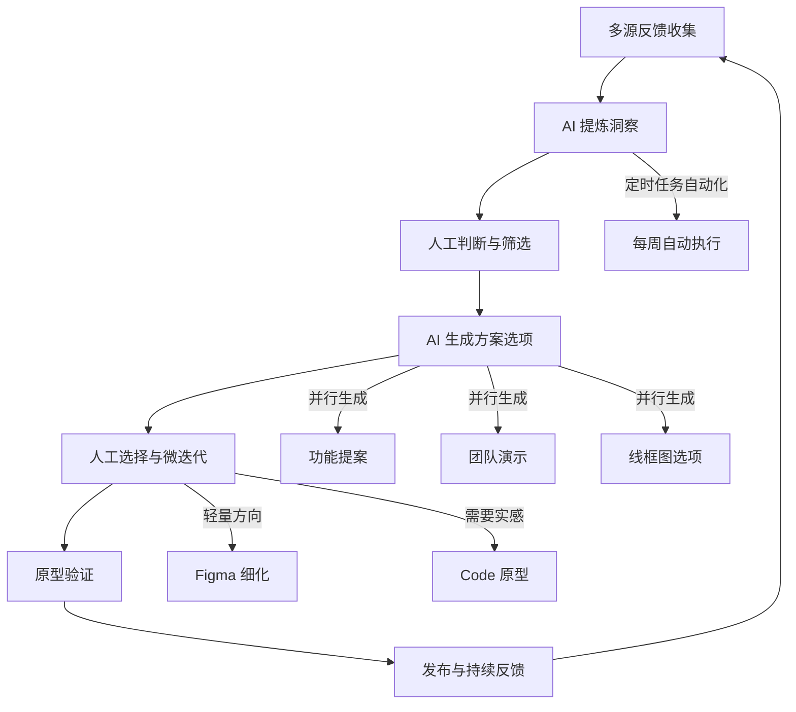

# AI 时代的产品设计工作流：从 Anthropic 设计师的实战中拆解「反馈→迭代」的压缩循环

一句话导读：当 AI 把「收集反馈→提炼洞察→生成方案→验证迭代」的周期从数周压到数小时，设计师的核心价值从「产出」转向「判断」。

适合谁看：
- 正在用或准备用 AI 工具做产品设计的设计师
- 想了解 AI 原生团队如何组织产品工作的产品经理
- 需要在团队中推动 AI 工作流落地的管理者
- 对 Claude Co / Claude Code 实际用法好奇的技术从业者
- 正在思考「AI 会不会取代我」的创意工作者

读完你会获得什么：
- 理解 Anthropic 内部设计团队的实际工作方式——不是想象中的未来，是正在发生的事实
- 掌握一套「反馈→洞察→方案→原型」的 AI 辅助完整工作流
- 分清 Claude Chat、Claude Co、Claude Code 三者的定位差异和使用场景
- 理解 Co 产品从过度结构化 UI 到极简聊天界面的设计演进逻辑
- 重新定位 AI 时代设计师的核心价值——不是产出更多，而是判断更快
- 获得一份可立即照做的 AI 产品设计工作流行动清单

---

## 01 背景：为什么这个问题现在值得讨论

一个事实正在发生：Anthropic 的工程师正在数天内完成过去需要数周的功能开发。而设计师的工作方式也发生了同样剧烈的变化——只是很少有人把它讲清楚。

变化的具体表现：

**产品规划的文档在变薄。** 一年前，spec 是详尽的表格和精美的 Figma 文件；现在，优先级文档通常只有几个要点，够法务和安全团队理解即可。不是规划不重要了，而是规划的形式从「预判一切细节」变成了「快速对齐方向」。

**设计工作的重心在转移。** 设计师不再长时间独占一个项目，而是同时咨询和参与五六个项目。更多时间花在与工程师的即时协作上——看原型、提意见、讨论行为——而不是在 Figma 里独自打磨。

**迭代周期在压缩。** 过去从用户反馈到可验证的原型可能需要数周；现在，借助 AI 工具，这个周期可以压到一天甚至更短。

这三个变化不是孤立的。它们指向同一个结构性的转变：**当 AI 能快速完成「从信息到产出」的转化，人的价值就不再是「做」，而是「判断做什么、做到什么程度、以及为什么」。**

---

## 02 核心判断：视频真正想讲的不是「AI 工具教程」

Jenny 在对话中展示了 Claude Co 的具体用法——读取用户访谈、搜索社交媒体反馈、生成洞察报告、创建产品提案、制作团队演示文稿、甚至设定每周定时任务。这些操作本身不难理解。

但如果只看到「AI 可以帮你做这些事」，就错过了关键信息。

**视频真正要传递的判断是：AI 时代产品设计的核心竞争力，不是熟练使用 AI 工具，而是建立一条「高频反馈→快速判断→即时验证」的闭环，并在这个过程中持续积累对产品的直觉和品味。**

这个判断有三层含义：

1. **AI 是压缩器，不是替代品。** 它压缩的是「从输入到初稿」的时间，但「初稿是否对」的判断仍然需要人。Jenny 反复强调：她让 AI 先出一版，然后自己去审视、选择、迭代方向。AI 省掉的不是思考，而是面对空白页的启动时间和重复性的格式化劳动。

2. **判断力的来源不是天赋，是反馈密度。** Jenny 明确说，她产品判断力的来源是——持续暴露在高密度的反馈流中。内部用户的尖刻意见、外部用户的真实使用场景、社交媒体上的褒贬——这些信息才是判断的燃料。AI 的作用是帮你更快地从海量反馈中提炼信号，但信号本身得先存在。

3. **工作方式的改变是结构性的，不是工具性的。** 这不是「换个更快的画笔」的问题。当迭代周期从周压缩到天，产品规划的节奏、团队协作的方式、设计决策的流程都在变化。规划从年度变成月度，spec 从详尽变成概要，设计师从项目 owner 变成多项目顾问——这些都是结构性调整。

---

## 03 概念澄清：先把关键名词讲准确

### Claude Chat（claude.ai 对话界面）

- **是什么**：Anthropic 面向大众的对话产品，最基础的产品形态
- **解决什么问题**：通用对话、问答、内容生成
- **不是什么**：不是带文件系统和任务管理的协作工具
- **与 Co 的区别**：Chat 是单轮或短对话，没有持久化的项目上下文、文件夹和定时任务

### Claude Co（Claude Coworker）

- **是什么**：Anthropic 的 AI 协作工具，支持文件夹上下文、并行任务、定时调度、MCP 集成
- **解决什么问题**：把 AI 从「问一次答一次」变成「持续协作的搭档」——它能记住你的文件、按计划执行任务、与你的工作流集成
- **不是什么**：不是 Claude Code 的 GUI 版本，不是 IDE，不是编程专用工具
- **与 Chat 的区别**：Co 有持久化的文件夹上下文、可以同时运行多个并行任务、可以设定定时任务、可以生成文档和演示文稿并存储到本地
- **与 Code 的区别**：Code 是命令行工具，面向技术用户，核心场景是代码开发；Co 有图形界面，面向更广泛的职业人群，核心场景是一切知识工作
- **一个简单例子**：Jenny 在 Co 中设置了一个每周一早 10 点的定时任务，自动汇总用户反馈、提炼洞察、生成产品提案和团队演示——她每周一到工位时，已经有三个产品方向可以用来启动一周工作

### Claude Code

- **是什么**：命令行 AI 编程工具，面向开发者
- **解决什么问题**：在终端中让 AI 直接读写代码、执行命令、管理项目
- **不是什么**：不是图形界面工具，不是为非技术用户设计的
- **与 Co 的区别**：Code 的交互方式是命令行，适合写代码；Co 的交互方式是聊天界面加任务管理，适合知识工作。Jenny 说，那些曾经用 Code 做非编程任务的「先锋用户」（比如用 Code 解析播客转录稿、做复杂分析），现在基本都迁移到了 Co

### 内部 Dogfooding

- **是什么**：公司内部员工使用自己产品的实践
- **解决什么问题**：获得高频、诚实、深度的产品反馈，尤其是交互层面的细节问题
- **不是什么**：不是「公司员工随便用用」，而是有意识地将内部使用作为核心反馈渠道
- **与外部反馈的区别**：内部用户更愿意直言问题，更擅长发现交互细节的缺陷；外部用户更多反馈「功能是否满足我的使用场景」，反馈的粒度和诚实度不同

### Skill（技能）

- **是什么**：在 Co 或 Code 中预设的指令模板，让 AI 按特定风格或规则执行任务
- **解决什么问题**：品牌一致性、输出格式控制、避免 AI 默认表达风格
- **一个简单例子**：Anthropic 内部有文档和幻灯片的 Skill，确保输出符合公司品牌风格；Jenny 还提到一个写作 Skill，告诉 AI 不要使用典型的 AI 味词汇

### MCP（Model Context Protocol）

- **是什么**：让 AI 工具与外部系统（如 Slack、文件系统）集成的协议
- **解决什么问题**：让 Co 的输出能自动推送到 Slack 频道等团队协作工具
- **一个简单例子**：Jenny 可以通过 MCP 配置，让 Co 每周自动将生成的洞察报告发到团队 Slack 频道

---

## 04 整体框架：AI 时代产品设计的工作流重构

**框架解释：**

这个工作流的核心不是某个 AI 工具，而是一个**持续运转的反馈循环**。AI 的介入点在于压缩循环中每个环节的时间成本，尤其是「从原始信息到结构化输出」的转化环节。

关键特征：

1. **多源输入**：不只是 UXR 访谈，还包括社交媒体、用户评价、内部 Slack 频道、外部社区——Jenny 强调「贴近地面」是 Co 团队成功的关键
2. **AI 做初稿，人做判断**：每个环节的产出都是 AI 先生成，人再审视和选择。这不是偷懒，是效率结构的变化
3. **并行化**：Co 的一个核心能力是同时运行多个并行任务——一边生成功能提案，一边制作团队演示，互不阻塞
4. **自动化闭环**：通过定时任务和 MCP 集成，整个循环可以部分自动化——每周一自动执行、自动推送到团队频道
5. **人工介入的节点后移**：人不再从空白页开始，而是从 AI 产出的选项开始做判断。判断的颗粒度可以更细、速度可以更快

---

## 05 关键机制：Co 的「文件夹上下文 + 并行任务 + 定时调度」是如何运行的

### 机制一：文件夹上下文——让 AI 有了「关于你的记忆」

- **输入**：用户在 Co 中关联一个本地文件夹（如个人笔记、用户访谈转录稿、项目文档）
- **处理**：Co 在执行任务时会读取文件夹中的内容作为上下文，理解用户的背景、偏好和历史记录
- **输出**：AI 的回应不再是通用的，而是基于你的知识库个性化生成
- **为什么这样设计**：降低每次对话的启动成本——你不需要每次重新解释「我是谁、我在做什么、我关心什么」
- **代价**：文件夹内容越多，AI 可能越倾向于沿用既有方向，减少跳出框架的可能性
- **适用场景**：需要持续积累上下文的知识工作——研究笔记、项目文档、个人思考记录

Jenny 的做法：她把所有个人笔记（1on1 记录、随机想法、项目思考）放在一个文件夹里，Co 已经对这个文件夹建立了足够的「理解」，以至于她觉得对显式的 memory 功能和 Skill 的依赖降低了。这不是最佳实践，但说明了一个事实——**持续的上下文积累本身就在替代显式的指令工程**。

### 机制二：并行任务——从串行等待到并行推进

- **输入**：用户在一个线程中发出多个相关但不依赖彼此的任务指令
- **处理**：Co 会为不同任务生成子代理（subagent），并行执行，各自独立完成后再汇总
- **输出**：多个独立的产出物（功能提案文档 + 团队演示文稿 + 线框图选项）
- **为什么这样设计**：避免串行等待造成的效率损失——过去你需要先完成洞察报告，再基于报告写提案，再基于提案做演示；现在三者可以并行推进
- **代价**：并行任务之间缺乏信息同步，可能出现逻辑不一致；需要人工做最终的对齐
- **适用场景**：信息源相同但产出形态不同的任务——同一批用户洞察，既需要内部文档，又需要团队演示，还需要设计方向

### 机制三：定时调度——让循环自动运转

- **输入**：用户设定一个定时任务（如每周一早 10 点），指定要执行的工作流
- **处理**：Co 在指定时间自动执行整个工作流——搜索反馈、提炼洞察、生成提案和演示
- **输出**：每次执行后，新的产出物自动保存到指定文件夹，或通过 MCP 推送到 Slack 频道
- **为什么这样设计**：把「记得做」变成「自动做」，消除人为遗忘和启动成本
- **代价**：如果反馈数据源没有显著变化，每周的输出可能趋于重复；需要定期审视任务的持续价值
- **适用场景**：周期性的信息汇总和分析工作——周度用户洞察、竞品监控、项目进度汇报

---

## 06 方法拆解：用 AI 做产品设计的完整工作流

### 步骤一：建立多源反馈收集体系

**目标**：确保产品决策基于真实信号，而不是假设。

**具体动作**：
1. 建立用户访谈流程（UXR），定期产出访谈转录稿
2. 监控社交媒体和用户评论，收集外部反馈
3. 在内部建立专用的反馈 Slack 频道，鼓励全员使用产品并直言问题
4. 识别内部的高频使用者（bleeding edge users），重点跟踪他们的反馈

**判断标准**：你的反馈来源是否同时覆盖「内部深度反馈」和「外部真实场景反馈」？只有一种，信号就不完整。

**常见坑**：只听外部用户的——他们更多告诉你「功能是否满足需求」，但很难发现交互细节的问题。内部用户的反馈粒度更细、更诚实。

**产出物**：一个持续更新的反馈库（访谈转录稿文件夹 + 社交媒体摘录 + Slack 频道归档）。

### 步骤二：用 AI 提炼洞察

**目标**：从海量反馈中提取可操作的产品信号。

**具体动作**：
1. 在 Co 中关联反馈文件夹
2. 指令示例：「阅读这个文件夹中的 UXR 访谈，同时搜索社交媒体和用户评论中关于 Co 的内容，告诉我主要的洞察是什么」
3. AI 会自动搜索网络、阅读本地文件、分拆子代理并行处理
4. 审视 AI 产出的洞察主题，判断哪些是信号、哪些是噪音

**判断标准**：洞察是否指向具体的可行动方向？如果只是「用户喜欢/不喜欢」，还不够具体；需要是「用户在 X 场景下因为 Y 原因无法完成 Z 任务」。

**常见坑**：完全信任 AI 的归纳。AI 擅长从大量信息中提取模式，但可能遗漏反直觉的异常值——而这些异常值往往是产品突破的起点。

**产出物**：一份结构化的洞察报告文档（Co 可直接生成 .docx 并保存到本地文件夹）。

### 步骤三：从洞察到产品方向

**目标**：将洞察转化为具体的产品功能提案。

**具体动作**：
1. 基于洞察报告，在 Co 中要求 AI 生成产品功能建议
2. 指令示例：「基于这些洞察，我应该构建哪些产品功能？给出优先级排序」
3. AI 会输出 P0/P1 级别的功能提案
4. 人工审视：这些方向是否符合产品战略？是否与团队当前能力匹配？

**判断标准**：每个提案是否都能追溯到具体的用户反馈？无法追溯到真实反馈的提案，再合理也只是假设。

**常见坑**：让 AI 直接生成完整 spec。AI 可以给你方向和选项，但「做不做、先做哪个、做到什么程度」的决策仍然需要人。

**产出物**：一份优先级排序的功能提案列表。

### 步骤四：生成设计选项

**目标**：快速产出多个设计方向，降低早期决策的成本。

**具体动作**：
1. 选定一个功能方向后，让 AI 生成线框图选项
2. 指令示例：「针对『步骤式任务进度 UI』这个功能，给我几个不同的交互方案」
3. AI 会产出多个低保真线框图
4. 从中选出最有潜力的 1-2 个方向

**判断标准**：是否看到了足够多的选项？Jenny 的原则是——看到具体的选项（即使保真度不高）比在脑海中想象更能帮助决策。

**常见坑**：试图让 AI 直接产出高保真设计。AI 的线框图价值在于「快速看到多个方向」，不是「直接可以用」。后续仍需在 Figma 中细化，或在 Code 中用真实组件搭建。

**产出物**：1-2 个选定方向的概念线框图。

### 步骤五：原型验证与迭代

**目标**：让选定方向从概念变为可感知的原型。

**具体动作**：
1. 轻量方向：将 AI 线框图导入 Figma，人工细化和打磨
2. 需要实感的方向：在 Claude Code 中用真实设计系统和组件搭建可交互原型
3. 与工程师一起看原型，讨论行为和交互细节
4. 内部 dogfooding，收集反馈

**判断标准**：原型是否足以验证核心假设？不需要完美，需要能回答「这个方向对不对」。

**常见坑**：在 Figma 里过度打磨。Jenny 说，仍然有需要精雕细琢的部分，但这部分的比例在减少——更多的设计决策发生在与工程师看原型的过程中，而不是在静态设计稿里。

**产出物**：一个可验证的原型，以及基于反馈的下一步迭代方向。

### 步骤六：自动化循环

**目标**：让整个工作流持续运转，而不是每次都从零开始。

**具体动作**：
1. 在 Co 中设定定时任务（如每周一早 10 点自动执行步骤二到三）
2. 通过 MCP 配置，将产出自动推送到团队 Slack 频道
3. 每周审视自动化产出的价值，调整指令和参数

**判断标准**：自动化是否真正节省了时间？如果每周你花在审视和修正 AI 产出上的时间超过了从头做的时间，说明任务还不够适合自动化。

**常见坑**：设置后不再审视。数据源在变、产品在变、用户在变——自动化任务需要定期更新。

**产出物**：一个持续运转的自动化工作流。

---

## 07 案例讲解：Jenny 的「周一启动」工作流

**场景背景**：Jenny 是 Anthropic Co 团队的设计师，需要持续跟踪用户反馈，将反馈转化为产品方向，并让团队对齐。

**遇到的问题**：反馈来源多且分散（UXR 访谈、社交媒体、内部 Slack、外部社区），手动整理耗时，从反馈到可讨论的产品方案周期长。

**按框架如何处理**：

1. **建立反馈库**：所有 UXR 访谈转录稿保存在一个本地文件夹，社交媒体和用户评论由 AI 实时搜索获取，内部反馈通过 Slack 频道持续收集。

2. **AI 提炼洞察**：在 Co 中关联访谈文件夹，同时让 AI 搜索社交媒体评价。AI 自动分拆子代理并行处理，几分钟后输出一份包含七个主题的洞察报告，保存为 .docx 到本地文件夹。

3. **并行生成方案和演示**：在一个线程中同时发起两个并行任务——「基于洞察，应该构建哪些产品功能」和「将洞察转化为本周团队启动会的演示文稿」。两个任务互不阻塞，各自产出。

4. **人工判断**：审视功能提案的优先级排序，选择最有价值的一个方向（比如「步骤式任务进度 UI」）。让 AI 生成多个交互方案选项，从中选定一个。

5. **进入迭代**：选定方向后，可以带到 Figma 细化，也可以带到 Code 中用真实组件搭建原型，然后与工程师一起看原型、讨论、迭代。

6. **自动化闭环**：设定每周一早 10 点的定时任务，Co 自动执行从步骤 2 到步骤 3 的整个流程。到工位时，已经有三个产品方向和一份团队演示等着她。通过 MCP，还可以让产出自动推送到 Slack 频道，团队成员同步可见。

**最终结果**：过去可能需要一周才能完成的「反馈收集→洞察提炼→方案生成→团队对齐」全流程，现在被压缩到 AI 自动执行的数十分钟 + 人工审视的数小时。

**说明了什么**：AI 不是在设计，而是在压缩信息转化的时间成本。设计决策——做什么、不做什么、先做什么——仍然是人做的。但人做决策的前提条件变了：从「信息不足、时间不够、只能凭直觉」变成了「信息充分、选项可见、可以基于比较做判断」。

---

## 08 常见误区

**误区一：「Co 是 Claude Code 的图形界面版」**
- 错误理解：Co 就是 Code 加了个 UI 壳
- 为什么错：Code 是命令行编程工具，核心场景是代码开发；Co 是知识工作协作工具，核心场景是一切需要 AI 辅助的信息处理——从用户研究到方案生成到团队汇报
- 正确理解：Co 和 Code 是两个不同定位的产品，服务不同人群。Co 面向更广泛的职业人群，Code 面向开发者
- 应该怎么做：按场景选择——写代码用 Code，做研究、写文档、管项目用 Co

**误区二：「AI 做设计，设计师就被取代了」**
- 错误理解：AI 能生成线框图和方案，设计师就没用了
- 为什么错：AI 产出的是选项，不是决策。选择哪个方向、做到什么程度、为什么这么做——这些判断仍然需要人。Jenny 反复强调，AI 帮她省掉的是启动和格式化劳动，不是判断本身
- 正确理解：AI 压缩了「从输入到初稿」的时间，但「初稿是否对」的判断仍需人来做
- 应该怎么做：把精力从「产出更多初稿」转向「做出更快的判断」——多看选项、快速筛选、聚焦迭代

**误区三：「Co 是 10 天做出来的」**
- 错误理解：Anthropic 用 10 天从零做出了 Co
- 为什么错：「10 天」指的是从「决定发布」到「正式上线」的时间。在此之前的整整一年里，团队已经在做大量原型、技术实验和用户验证——只是很多实验没有最终落地
- 正确理解：10 天是冲刺上线的时间，不是产品从零到一的时间。Co 的诞生是一年探索加上一个关键时机的结合
- 应该怎么做：不要被「10 天做产品」的故事误导。快速发布的前提是长时间的探索和积累

**误区四：「AI 工具应该尽量结构化，引导用户按流程操作」**
- 错误理解：给用户一个表单，让他们填输入、选输出，AI 按流程执行
- 为什么错：Co 团队早期就做过这种设计——结构化的工作流界面，用户需要填写输入源、选择输出类型、调整参数。结果是：感觉像在填表，不像在和 AI 协作；AI 也不总是能严格遵循预设流程
- 正确理解：在 AI 能力足够强的情况下，聊天界面 + 最小化 UI 比结构化工作流更灵活、更自然
- 应该怎么做：让 AI 的能力来适应人的表达方式，而不是让人去适应 AI 的操作流程。命令和 Skill 作为可选的高级功能存在，不应是主要交互方式

**误区五：「内部 dogfooding 不客观，应该只看外部反馈」**
- 错误理解：内部用户是自己的员工，反馈不够客观
- 为什么错：内部用户更愿意直言问题、更擅长发现交互细节缺陷、更容易跟踪和追问。外部用户的反馈往往停留在「功能是否满足需求」的层面，颗粒度不同
- 正确理解：内部和外部反馈是不同层次的信号，两者都需要。内部反馈更适合发现细节问题和交互缺陷；外部反馈更适合验证功能价值和真实场景适用性
- 应该怎么做：同时建立内部和外部反馈渠道，根据决策类型选择参考哪个层次的信号

**误区六：「有了 AI 就不需要做年度规划了」**
- 错误理解：AI 时代一切快速迭代，长期规划没有意义
- 为什么错：Anthropic 的做法不是取消规划，而是缩短规划的周期和降低规划的确定性。Co 团队做月度规划，清单最多 12 项，每项一个负责人，每周检查进度。季度和半年度的方向性规划仍然存在，但不做「必须按此执行」的刚性承诺
- 正确理解：AI 时代需要的是短周期、低确定性的方向指引，而不是取消规划本身。愿景仍然有价值，但有效期从两年缩短到三到六个月
- 应该怎么做：做月度规划而非年度规划；方向可以明确，细节保持灵活；让团队围绕共同目标自主探索，而不是按指令执行

**误区七：「AI 让我们更轻松了」**
- 错误理解：AI 替我们做了很多事，我们可以少工作了
- 为什么错：Jenny 坦言：「你不会得到更多空闲时间。你会工作得更狠。」因为当迭代速度提升后，你会想要做更多——不是被迫，而是因为突然发现「原来我可以在同样时间里做到这么多」
- 正确理解：AI 消除的是低价值的重复劳动，释放的是高价值的创造性工作的空间。你会做更多有意义的事，而不是更少无意义的事
- 应该怎么做：不要期待 AI 给你省时间；期待 AI 帮你把时间花在更重要的事情上

---

## 09 实战清单：读完后可以马上照着做

### 立即能做

1. **整理一个「反馈文件夹」**。把你的用户访谈记录、客户反馈截图、社群讨论摘录放进去。无论是否用 AI，先让反馈有地方可查。
2. **尝试让 AI 做一次「洞察提炼」**。把反馈文件夹关联到 Co（或类似工具），让 AI 提炼主要洞察。审视结果——哪些洞察是你没想到的？哪些是 AI 幻觉？
3. **记录你本周做的一个设计决策**。写下：你基于什么信息做了这个判断？这些信息从哪来？如果信息更充分，你会做不同决定吗？这是在建立你对自身判断力的元认知。
4. **找一个人做 5 分钟的 dogfooding 对话**。让他用你的产品，你在旁边观察。记录他卡住的地方和你没想到的使用方式。

### 一周内能做

1. **建立一个周期性的反馈收集流程**。不一定需要 AI——可以是每周花 30 分钟浏览社交媒体评论、整理内部反馈频道、与一个核心用户聊天。关键是「定期」和「多源」。
2. **试一次「AI 先出第一版，我来改」的工作模式**。挑一个本周需要写的文档（方案、报告、邮件），让 AI 生成初稿，你在此基础上修改。记录：省了多少时间？改了多少内容？
3. **梳理你当前工作中哪些环节是「从信息到结构化输出」的转化**。列出清单。这些是最适合 AI 辅助的环节——不是创意决策，而是信息处理和格式化。
4. **与一个工程师做一次「看原型」的对话**。不需要完美的设计稿，哪怕是一个粗略的截图或草图。观察：面对面讨论带来的信息量是否大于单向交付设计稿？

### 长期要沉淀

1. **构建你的个人知识文件夹**。把你的 1on1 记录、项目思考、随机想法持续写入一个固定位置。长期积累后，AI 对你的理解会越来越深，启动成本越来越低。
2. **培养产品判断力的「反馈暴露」习惯**。定期、高频地接触真实用户反馈——不是看数据看板，而是读原话、看行为。判断力的来源不是天分，是信号密度。
3. **建立团队级的反馈→迭代闭环**。不只是个人用 AI 提效，而是让团队有一个持续运转的「收集反馈→提炼信号→生成方案→验证迭代」机制。可以从一个简单的定时任务开始。
4. **定期审视你使用 AI 的模式**。哪些地方 AI 真正节省了时间？哪些地方你花了更多时间在修正 AI 的输出？这个审视本身就是在优化你的工作流。
5. **把设计文档变薄**。试着把下一个项目的 spec 从详尽文档压缩为几个要点。观察：团队是否仍然能对齐方向？如果能，说明之前文档的厚度是习惯而非必要。

---

## 10 总结

Jenny 展示的不是「AI 工具使用技巧」，而是一种正在发生的工作方式重构。这种重构的核心不是某个工具的功能，而是一个结构性变化：**当「从信息到产出」的转化成本趋近于零，人的价值就集中在判断和选择上。**

Co 本身的诞生过程印证了这个逻辑。它不是一次天才式的 10 天创造，而是一年探索积累后的时机捕捉。团队做了很多原型——结构化工作流、过度引导的 UI、复杂的参数面板——最终发现，在 AI 能力足够强的前提下，最有效的界面恰恰是最简单的：一个聊天框加一个任务列表。这不是设计上的偷懒，是对技术能力和用户需求之间平衡点的精准判断。

对设计师而言，最大的变化不是工具变了，而是**工作流的起点从空白页变成了 AI 的第一版输出**。这意味着设计工作的重心从「如何从零开始产出」转向「如何从多个选项中快速判断并迭代」。这种转变要求设计师有更强的判断力，而判断力的来源是持续暴露在高密度的真实反馈中。

最后的判断：**AI 不会取代设计师，但会淘汰那些只会执行而不会判断的设计师。** 在信息转化成本趋零的时代，你的价值不在于你能产出什么，而在于你基于什么信号、做出什么选择、以及为什么这个选择是对的。
