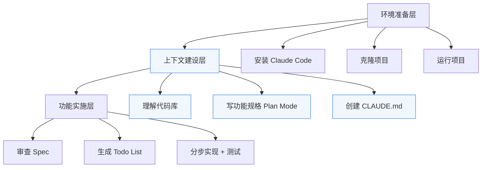

# Claude Code 实战指南：15 分钟从安装到交付一个完整功能

# 一句话导读

Claude Code 能一次写对功能的秘密不在 AI 本身，而在你写代码之前做了多少规划。

# 适合谁看

- 听说过 Claude Code 但没动手装过的开发者或产品经理
- 用过 AI 编程工具但总得到跑不通的结果，不知道哪里出了问题
- 想在 Cursor 里用 Claude Code 替代内置 Agent 的人
- 需要接手别人的代码库、想快速理解项目结构的团队成员
- 对"AI 写代码"的期望不切实际、以为一句话就能出成品的人

# 读完你会获得什么

- 能完成 Claude Code 的安装（终端和 Cursor 两种方式）
- 能用 Claude Code 快速理解一个陌生代码库的结构和运行逻辑
- 能用 Plan Mode 让 AI 帮你写功能规格，而不是自己从零起草
- 能创建 CLAUDE.md 文件，给 AI 注入项目上下文和编码规范
- 能理解"先规划、再执行"的工作流为什么比直接让 AI 写代码有效得多
- 能避免"AI 过度设计"和"跳过审查直接实施"这两个最常见的问题

---

## 01 背景：为什么这个问题现在值得讨论

AI 编程工具已经从"补全代码"进化到"代理执行"——你描述需求，它直接写代码、跑测试、改文件。Claude Code 是目前这类工具中能力最强的之一。

但一个尴尬的现实是：同样一个工具，有人用一次就把功能做出来了，有人反复修改十轮还是跑不通。差异不在工具本身，在于使用方式。

大多数人的用法是：打开 AI → 输入一句话需求 → 看结果 → 改 → 再改 → 放弃。这个过程的问题不是 AI 不够聪明，而是你没有给它足够的上下文和约束。就像你不会对一个刚入职的工程师说"加个功能"就走开——你会先让他看文档、了解架构、对齐方案，然后才动手。对 AI 也是如此。

这篇文章要讲的，就是这套"写代码之前先做什么"的工作流。

---

## 02 核心判断：视频真正想讲的不是表层问题

视频表面上是 Claude Code 的安装和使用教程，但真正要传达的判断是：

**AI 编程工具的效果，80% 取决于你在实施前投入的规划和上下文建设，20% 才是 AI 本身的生成能力。**

视频里展示的完整流程拆开来看，真正让"一次写对"成为可能的，是三件前置工作：让 AI 理解代码库、写好功能规格、建立编码规范。跳过这三步直接让 AI 写代码，结果大概率要返工。

这个判断对任何 AI 编程工具都成立，不只是 Claude Code。

---

## 03 概念澄清：先把关键名词讲准确

### Claude Code

- 它是什么：Anthropic 推出的 AI 编程代理，运行在终端中，能读写文件、执行命令、调用 API，直接在代码库中工作
- 它解决什么问题：让 AI 不只是回答问题，而是直接操作代码——写文件、跑测试、装依赖、修 bug
- 它不是什么：不是 IDE 插件，不是代码补全工具，不是 ChatGPT 的编程版
- 和 Cursor Agent 的区别：Cursor Agent 是 IDE 内置的 AI 功能，Claude Code 是独立的 CLI 工具，可以在任何终端运行，也可以在 Cursor 的终端里运行
- 例子：你在终端输入 `claude`，然后说"安装依赖并启动开发服务器"，它会自己跑 `npm install` 和 `npm run dev`

### Plan Mode

- 它是什么：Claude Code 的一种模式，按 `Shift+Tab` 进入，AI 只做研究和规划，不修改代码
- 它解决什么问题：防止 AI 还没对齐方案就开始改文件，让你先审查计划再执行
- 它不是什么：不是让 AI 给你一个口头建议——它会实际写一份结构化的规格文档
- 和普通模式的区别：普通模式下 AI 直接改代码，Plan Mode 下 AI 只输出文档和方案
- 例子：你说"设计一个 Watchlist 功能"，Plan Mode 会输出技术方案、实现阶段、组件设计，但不会动一行代码

### CLAUDE.md

- 它是什么：项目根目录下的一个 Markdown 文件，每次 Claude Code 启动时自动加载到提示词中
- 它解决什么问题：给 AI 注入项目上下文和编码规范，相当于一份"给新人的入职文档"
- 它不是什么：不是配置文件，不是 README，不影响代码运行
- 和 `.cursorrules` 的区别：功能类似，但 CLAUDE.md 是 Claude Code 专用的上下文文件
- 例子：你在 CLAUDE.md 里写"每次改代码都要写对应的测试"，Claude Code 之后每次改功能都会自动写测试

### Spec（功能规格文档）

- 它是什么：在 Plan Mode 中由 AI 生成的设计文档，包含功能描述、技术方案、实现阶段
- 它解决什么问题：把模糊的需求变成可审查、可分步执行的计划
- 它不是什么：不是 PRD，不是用户故事——它更偏技术实现方案
- 例子：Watchlist 的 Spec 包含数据持久化方案（localStorage）、UI 组件设计、分阶段实现计划

---

## 04 整体框架：这套内容应该如何理解

Claude Code 的高效使用流程可以理解为三层递进：

**环境准备层**是必须但平庸的——装工具、拉代码、跑起来，没什么技巧。

**上下文建设层**是整条流程的核心——理解代码库、写规格、建规范。这三件事决定了 AI 能否一次写对。跳过这一层，你会在实施层反复返工。

**功能实施层**反而最简单——如果前两层做好了，实施就是按 Todo List 逐步执行、逐步验证。

多数人的问题出在：跳过中间层，直接从环境准备跳到功能实施。

---

## 05 关键机制：它到底是怎么运行的

### 机制一：上下文注入

- **输入**：CLAUDE.md 文件 + 你在对话中提供的背景信息
- **处理**：Claude Code 每次启动时自动读取 CLAUDE.md，将内容注入系统提示词；你在对话中补充的上下文（如"我是个产品经理，不是工程师"）也会影响 AI 的输出风格和深度
- **输出**：AI 的回答和代码生成更贴合项目实际情况
- **为什么这样设计**：AI 没有记忆，每次会话都是全新的。CLAUDE.md 是唯一能在会话间持久存在的上下文载体
- **代价**：CLAUDE.md 太长会占用提示词空间，太短又不够用。需要在完整性和简洁性之间取舍
- **适合场景**：多人协作的项目、有编码规范的团队、复杂度较高的代码库

### 机制二：Plan Mode 的"只读研究"

- **输入**：你给的一个模糊需求描述
- **处理**：AI 在只读模式下探索代码库，理解现有架构，然后输出一份结构化的技术方案
- **输出**：Spec 文档——包含功能设计、技术选型、实现阶段、代码结构
- **为什么这样设计**：防止 AI 在没有全局理解的情况下局部修改代码，导致架构冲突或重复造轮子
- **代价**：多花几分钟在规划上。但对于任何超过 50 行代码的功能，这几分钟的投入能省下数小时的调试
- **适合场景**：新功能开发、架构调整、不确定技术方案时的探索

### 机制三：Todo List 作为执行检查点

- **输入**：Spec 文档
- **处理**：AI 将 Spec 拆解为有序的 Todo 项，逐项执行
- **输出**：每完成一项就标记完成，你可以随时用 `/todos` 查看进度
- **为什么这样设计**：让执行过程透明化，你可以在每个节点检查和干预，而不是等 AI 做完一整块才发现方向错了
- **代价**：你需要花时间审查 Todo List 的合理性
- **适合场景**：任何需要多步骤实现的功能，尤其是你可能中途需要干预的场景

---

## 06 方法拆解：如果自己要做，应该怎么落地

### 步骤一：安装 Claude Code

**目标**：在终端或 Cursor 中能启动 Claude Code

**具体动作**：
1. 打开终端，粘贴官方安装命令（从 Claude 文档复制）
2. 安装完成后输入 `claude` 启动
3. 如果用 Cursor，在 Cursor 内打开终端，同样输入 `claude`

**判断标准**：终端出现 Claude Code 交互界面即为成功

**常见坑**：网络问题导致安装失败——需要确认能访问 npm 或对应的包管理源

**产出物**：可运行的 Claude Code 环境

---

### 步骤二：准备项目并让 AI 理解代码库

**目标**：AI 能准确描述项目的架构和运行逻辑

**具体动作**：
1. 克隆项目到本地
2. 在 Claude Code 中输入类似："告诉我这个 app 怎么工作的。我是个产品经理，不是工程师，用我能理解的方式解释"
3. 阅读输出，重点关注：技术栈、数据来源、核心组件、配置需求（如 API Key）

**判断标准**：AI 的描述和你对项目的理解一致，且提到了你没想到的细节

**常见坑**：跳过这步直接让 AI 改代码——没有全局理解的局部修改是 bug 的温床

**产出物**：对代码库的结构性理解，以及潜在问题清单（如缺少 API Key）

---

### 步骤三：用 Plan Mode 写功能规格

**目标**：得到一份可审查、可分步执行的技术方案

**具体动作**：
1. 按 `Shift+Tab` 进入 Plan Mode
2. 输入需求描述，**务必包含以下约束**：
   - "保持简单"——防止 AI 过度设计
   - "分阶段实现，每阶段可独立测试"——防止一次性改动太大导致不可控
3. AI 生成 Spec 后，**仔细审查**，特别是：
   - 实现阶段划分是否合理
   - 是否包含了你不需要的功能（AI 倾向于多做）
   - 删掉不需要的阶段和功能
4. 审查完毕后再让 AI 开始实施

**判断标准**：Spec 里的每一个功能点都是你想要的，没有多余项；阶段划分让你能逐步验证

**常见坑**：
- 不审查 Spec 就让 AI 开始写代码——这是最致命的错误
- 需求描述太模糊——AI 会按自己的理解填充细节，大概率和你想的不一样
- 不写"保持简单"——AI 会加上通知、批量操作等你不想要的功能

**产出物**：一份经过你审查和裁剪的 Spec 文档

---

### 步骤四：创建 CLAUDE.md

**目标**：给 AI 注入项目上下文和编码规范

**具体动作**：
1. 让 Claude Code 自己创建 CLAUDE.md："初始化一个 CLAUDE.md 文件，包含代码库的关键信息"
2. AI 会基于对代码库的理解自动生成内容：环境配置、组件模式、项目结构等
3. **手动补充你的编码规范**，例如：
   - "每个新脚本都要写测试"
   - "提交时遵循现有的 commit 规范"
   - "优先使用项目中已有的组件模式"
4. 随着项目演进，持续更新这个文件

**判断标准**：一个新成员读完 CLAUDE.md 后，能理解项目的核心约定和架构决策

**常见坑**：CLAUDE.md 写一次就不管了——它应该随项目持续更新

**产出物**：一份活的、持续更新的项目上下文文件

---

### 步骤五：分步实现功能

**目标**：按 Spec 逐步实现，每步可验证

**具体动作**：
1. 让 AI 先生成 Todo List，审查清单的合理性
2. 让 AI 按 Todo List 逐项执行
3. 每完成一个阶段，在本地验证功能是否正常
4. 随时用 `/todos` 查看进度

**判断标准**：每个阶段完成后，应用能正常运行，没有回归问题

**常见坑**：
- 不看 Todo List 就让 AI 开始做——你可能发现它在实现你不需要的东西
- 不做阶段性验证——等全部做完才发现问题，定位成本极高

**产出物**：可工作的功能 + 对应的测试

---

## 07 案例讲解：用一个具体场景串起来

**场景**：你是一个非工程背景的产品经理，想在一个开源的影视发现 App 上加一个"Watchlist"功能——用户可以收藏想看的电影和剧集。

**遇到的问题**：你不会写代码，但你有 Claude Code。如果直接说"加一个 Watchlist 功能"，大概率得到一个过度复杂、跑不通的结果。

**按框架如何处理**：

1. **理解代码库**：你告诉 Claude Code "我是个产品经理，解释一下这个 app 怎么工作的"。AI 告诉你：前端用 TypeScript + Tailwind CSS，数据来自 TMDB API，需要一个 API Key 才能运行。你第一次知道了还有 API Key 这回事。

2. **跑通项目**：你让 AI 安装依赖并启动项目。AI 自动创建了 `.env` 文件，提醒你需要 TMDB API Key。你去 TMDB 注册账号拿到 Key，让 AI 配置进去。App 跑起来了。

3. **写 Spec**：进入 Plan Mode，输入："加一个 Watchlist 功能，保存我想看的影视，用 localStorage 持久化。保持简单，分阶段实现。"AI 输出了技术方案。你审查后发现它加了"通知"和"批量操作"——你不需要这些，删掉了。

4. **建 CLAUDE.md**：让 AI 创建这个文件，你补充了"每个新功能都要写测试"。

5. **分步实现**：让 AI 生成 Todo List，你过了一遍觉得合理，然后让它开始做。它一步步实现了：localStorage 工具函数 → Watchlist 按钮 → 列表页 → 详情页集成 → 测试。每一步你都能在浏览器里验证。

**最终结果**：一个可工作的 Watchlist 功能——能在列表页和详情页添加/移除，数据持久化在 localStorage，有对应的测试覆盖。

**说明了什么**：AI 写代码不难，难的是让 AI 在正确的上下文下、按正确的方案、分正确的步骤写代码。这个案例里，真正写代码只花了最后几分钟，前面所有的规划才是决定成败的部分。

---

## 08 常见误区：很多人会在哪里理解错

**误区一：直接让 AI 写代码，跳过规划**

- 错误理解：AI 这么强，描述需求就行，不用做准备
- 为什么错：AI 没有项目上下文，不知道你的架构、规范、约束，会按默认假设做事——这些假设大概率和你项目不匹配
- 正确理解：规划是给 AI 提供上下文的过程，上下文质量决定输出质量
- 应该怎么做：永远先理解代码库 → 写 Spec → 建 CLAUDE.md → 再写代码

**误区二：不审查 AI 生成的 Spec**

- 错误理解：AI 生成的方案是专业的，直接采纳就好
- 为什么错：AI 倾向于过度设计——它会加上"看起来合理但你不想要"的功能，比如通知系统、批量操作、高级搜索
- 正确理解：Spec 是给你审查的草稿，不是最终方案
- 应该怎么做：逐条审查，删掉不需要的功能，简化过于复杂的方案

**误区三：觉得 CLAUDE.md 是可选的**

- 错误理解：CLAUDE.md 只是锦上添花，不写也能用
- 为什么错：没有 CLAUDE.md，每次对话 AI 都是从零开始理解你的项目。你在对话中说的上下文，下次会话就没了
- 正确理解：CLAUDE.md 是 AI 对你项目的"持久记忆"，是最重要的配置之一
- 应该怎么做：让 AI 帮你创建初始版本，然后根据实际需要持续补充

**误区四：Plan Mode 只是多此一举**

- 错误理解：Plan Mode 让 AI 只说不做，浪费时间
- 为什么错：Plan Mode 的价值不在于"说"，在于"只读探索"——AI 在不动代码的前提下理解全局，输出的方案质量远高于直接动手
- 正确理解：Plan Mode 是"先想清楚再动手"的工程实践，不是效率损失
- 应该怎么做：任何超过简单修改的需求，都先走 Plan Mode

**误区五：一次把所有需求都给 AI**

- 错误理解：把大需求一次性描述完，让 AI 一次做完
- 为什么错：改动越大，出错概率越高，调试成本指数级增长
- 正确理解：分阶段实现、分阶段验证，每一步都是可控的
- 应怎么做：在需求里明确写"分阶段实现，每阶段可独立测试"

**误区六：权限弹窗一律同意**

- 错误理解：AI 请求权限时直接全部同意，加快速度
- 为什么错：权限请求是 AI 告诉你它要做什么的关键窗口，盲目同意可能导致意外操作
- 正确理解：每次权限弹窗都是一次审查机会
- 应该怎么做：至少快速扫一眼 AI 要执行什么命令，确认合理再同意

---

## 09 实战清单：读完后可以马上照着做

### 立即能做

1. 安装 Claude Code，在终端和 Cursor 中各启动一次，确认环境可用
2. 找一个你熟悉的开源项目，让 Claude Code 解释它的架构——验证 AI 的理解是否准确
3. 在 Plan Mode 下让 AI 为一个小功能写 Spec，体验"只规划不改码"的工作方式

### 一周内能做

4. 为你正在做的项目创建 CLAUDE.md，至少包含：技术栈、项目结构、编码规范
5. 选一个真实需求，走完"理解代码库 → Plan Mode 写 Spec → 审查 Spec → 建 CLAUDE.md → 分步实现"的完整流程
6. 对比两种方式的结果：同一个需求，一次跳过规划直接做，一次走完整流程，记录差异

### 长期要沉淀

7. 把 CLAUDE.md 纳入项目的版本管理，每次架构变更后更新
8. 建立团队的 Spec 审查习惯——AI 生成的方案必须经过人审才能实施
9. 积累"AI 容易过度设计的场景"清单，在需求描述中加入对应的约束语句

---

## 10 总结

Claude Code 是目前能力最强的 AI 编程代理之一，安装和使用本身并不复杂——一个命令装好，输入 `claude` 就能用。但工具的门槛从来不在安装，在于用法。

视频里展示的完整流程揭示了一个反直觉的事实：让 AI 一次写对功能的关键步骤，都不是在写代码。理解代码库、用 Plan Mode 写 Spec、创建 CLAUDE.md、审查方案、裁剪过度设计——这些"写代码之前的事"才是决定成败的部分。视频里真正让 Watchlist 功能一次交付的，不是 AI 的生成能力，而是五分钟的前置规划。

这个判断对所有 AI 编程工具都成立。AI 能写多好的代码，取决于你给了它多好的上下文。

**规划不是效率的敌人，是结果的保障。跳过规划省下的十分钟，会在调试中还回来——带着利息。**
