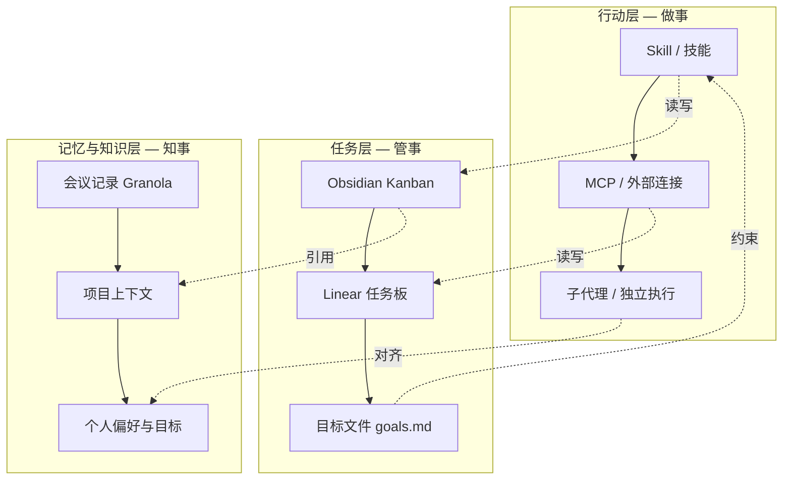

# 用 AI 搭建个人操作系统：三位产品人的真实工作流

**一句话导读：** AI 不会替你思考，但如果你把上下文交给它、把流程编码成文本，它会成为你最稳定的思考伙伴——这篇文章拆解了三位产品人从写策略文档到原型开发到日常管理的完整落地方法。

---

## 适合谁看

- 日常要写策略文档、PRD 但总从空白页开始的产品经理
- 想用 AI 辅助思考但不想沦为"提示词搬运工"的人
- 用 Obsidian/Notion 做笔记但停留在"收藏"阶段、没形成工作流的人
- 独立开发者或创业者，需要一个人扛产品+技术+运营多个角色
- 对 MCP、Claude Skill、Cursor Agent 等概念感兴趣但不知道怎么串起来的技术从业者

---

## 读完你会获得什么

- 理解"个人操作系统"的核心架构：任务、知识、记忆三层如何协同
- 掌握用 AI 写策略文档的完整流程——从模板到研究到迭代
- 理解"原型优先开发"的思路，以及为什么 AI 原型比 Figma 原型更快
- 学会用 Obsidian + Cursor/Claude 搭建以 Markdown 为基础的 AI 辅助工作流
- 分清 MCP、Skill、子代理这些概念的区别和各自适用场景
- 获得一份可以直接照做的行动清单

---

## 01 背景：为什么这个问题现在值得讨论

一年前，产品经理用 AI 的方式还停留在"让它帮我写个文案"或"总结一下这段话"。但现在情况变了——Claude Code、Cursor、MCP 协议、Skill 机制这些工具的成熟，让 AI 从一个"问答工具"变成了一个可以接入你本地文件、读取你的项目上下文、执行具体操作的**工作伙伴**。

这意味着一个根本性的变化：过去你用 AI 是"问它一个问题"，现在你可以让 AI **持续参与你的工作流程**——它知道你在做什么项目、你的季度目标是什么、你昨天开了什么会、你的代码仓库里有什么文件。

但大多数人的问题不是"AI 能力不够"，而是**不知道怎么把自己的上下文喂给它**。AI 很聪明，但它不知道你是谁、你在做什么、你为什么在意这件事。这个鸿沟不解决，AI 永远只能给你泛泛的回答。

三位在 AI 教育领域有深厚积累的产品人，在这场直播中各自展示了自己的 AI 工作流。表面上看，他们用的是不同的工具、不同的界面。但底层逻辑高度一致——**用文本文件管理上下文，用 AI 处理逻辑，让自己专注于判断和决策**。

---

## 02 核心判断：视频真正想讲的不是工具教程

表面上看，这是一场 AI 工具演示——Claude 写策略、AI Studio 做原型、Obsidian 管任务、Cursor 当思考伙伴。

但三位演示者最终收束到同一个判断：**每个人都在无意中打造自己的个人 AI 产品，而你自己就是它的第一个用户和产品经理。**

这个判断的力度在于：它把"用 AI"这件事从一个消费行为变成了一个建造行为。你不是在"使用 ChatGPT"，你是在**搭建一个理解你、代表你、帮助你完成日常工作的系统**。这个系统不需要很多代码——它的核心是 Markdown 文件、模板、目标声明和流程描述。

另一个被反复印证但很少被说透的判断是：**文本文件是个人操作系统的通用接口。** 无论是 Obsidian 的笔记、Cursor 打开的目录、Claude 项目的附件、Linear 的任务——底层都是结构化文本。当你意识到这一点，你就能用同一套上下文在多个工具间流转，而不被困在某个平台里。

---

## 03 概念澄清：先把关键名词讲准确

### 个人操作系统（Personal OS）

- 它是什么：一套围绕你的工作目标和个人偏好搭建的 AI 辅助工作流，以 Markdown 文件为基础，以编码代理为执行者
- 它解决什么问题：让 AI 不只是回答问题，而是持续理解你的上下文、对齐你的目标、参与你的日常决策
- 它不是什么：不是某个具体的 App 或 SaaS 产品，不是"买个工具就能用"的东西
- 和"个人知识管理"的区别：知识管理侧重存储和检索，个人操作系统侧重**执行和迭代**——它不只是帮你记东西，而是帮你做事
- 例子：Tahl 用 Obsidian 的 Kanban 插件管理产品计划，每个卡片是一个 Markdown 文件，同一个目录用 Cursor 打开就能让 AI 读取和修改这些计划

### 上下文（Context）

- 它是什么：AI 在和你协作时能访问的所有背景信息，包括你的目标、偏好、项目状态、会议记录、代码仓库等
- 它解决什么问题：AI 的回答质量直接取决于它拥有多少上下文——上下文越充分，回答越精准、越个性化
- 它不是什么：不是"提示词工程"——提示词是你对 AI 的一次性指令，上下文是 AI 能持续访问的知识库
- 和"提示词"的区别：提示词告诉 AI "做什么"，上下文告诉 AI "你是谁、你在什么环境里做事"
- 例子：在 Claude 项目中上传策略文档模板和调研笔记，AI 就能按照你的格式和你的调研结果来写文档，而不是给你一个泛泛的通用版本

### MCP（Model Context Protocol）

- 它是什么：一种让 AI 代理连接外部工具和数据源的协议标准，类似给 AI 装"插件"
- 它解决什么问题：AI 默认只能读取文本和生成文本，MCP 让它能操作你的日历、任务系统、数据库等外部系统
- 它不是什么：不是 API 本身，而是访问 API 的标准化接口；也不是万能的——当前的 MCP 体验还比较粗糙
- 和"Skill"的区别：MCP 是连接外部系统的管道，Skill 是封装好的工作流程——Skill 可以调用 MCP，但 Skill 的本质是一组 Markdown 指令
- 例子：通过 Linear MCP，AI 可以直接读取你的任务列表和项目状态，而不需要你手动复制粘贴

### Skill（技能）

- 它是什么：一组用 Markdown 编写的流程指令，告诉 AI 在特定场景下应该执行哪些步骤
- 它解决什么问题：把重复性的工作流编码成可复用的"程序"，让 AI 每次遇到同类请求时自动走同一套流程
- 它不是什么：不是代码脚本，不是传统意义上的"自动化"——它更像是给 AI 写的 SOP
- 和"子代理"的区别：子代理是独立的 AI 执行单元，Skill 是主代理遵循的指令集
- 例子："晨间规划"Skill 的流程：检查 Granola 新会议 → 展示给用户确认 → 读取任务列表 → 读取目标文件 → 生成今日重点建议

### 原型优先开发（Prototype-First Development）

- 它是什么：先用 AI 快速生成可交互原型，与用户和团队验证方向，再进入正式设计和开发
- 它解决什么问题：传统流程中，PM 写文档 → 设计师做 Figma → 工程师开发，周期长、反馈晚、修改成本高
- 它不是什么：不是跳过设计直接写代码，不是用 AI 替代设计师——原型验证通过后，设计师仍然要产出正式设计稿
- 和"Vibe Coding"的区别：Vibe Coding 强调随意编码看效果，原型优先强调**有目的地验证假设**
- 例子：Peter 用 AI Studio 复制 Google AI Studio 的 UI 作为基础模板，然后让 AI 在上面添加新功能原型，整个过程中设计师还在做 Figma 文件，但原型已经可以拿去和用户测试了

---

## 04 整体框架：这套内容应该如何理解

三位演示者的工作流可以用一个三层架构来理解：

**文字解释：**

- **行动层**是 AI 实际执行操作的能力——Skill 定义流程，MCP 连接外部系统，子代理独立完成子任务
- **任务层**是你对"要做的事"的结构化管理——Obsidian 管产品规划和优先级，Linear 管开发任务，goals.md 管长期方向
- **记忆与知识层**是 AI 理解"你是谁、你在做什么"的基础——会议记录提供事实，项目上下文提供环境，个人偏好和目标提供方向

三层之间的核心关系是：**行动层读写任务层，任务层引用知识层，知识层约束行动层。** 这不是单向的信息流，而是一个闭环——你在执行中产生的信息会被写回知识层，成为下次执行的上下文。

---

## 05 关键机制：它到底是怎么运行的

### 机制一：上下文驱动的文档写作

**输入：** 策略文档模板（Markdown）+ 调研笔记 + 团队会议记录

**中间处理：** AI 基于模板结构和所有上下文生成初稿 → 人工审阅并提出修改方向 → AI 迭代 → 人工继续补充自己的判断和调研 → 再迭代

**输出：** 一份经过多轮人机协作的策略文档

**为什么要这样设计：** 从空白页开始写文档是最大的阻力。AI 可以帮你从"0 到 1"生成一个有结构的初稿，但这个初稿一定是泛泛的——它真正的价值在于给你一个**可以批判和修改的对象**，而不是一个可以直接用的成品。

**带来的代价：** 你可能被 AI 初稿的"看起来很完整"所迷惑，跳过了自己应该做的独立思考。Peter 在演示中明确承认：AI 给出的第一版策略文档"太泛了、太高层了"，他自己的判断（聚焦原型赛道、利用 Gemini 模型优势）是 AI 不会主动给出的。

**适合/不适合：** 适合有明确领域知识但写作启动困难的人；不适合缺乏独立判断力、容易接受 AI 泛泛回答的人。

### 机制二：Markdown 作为通用数据层

**输入：** 纯文本文件（.md），存储在本地目录中

**中间处理：** Obsidian 读取并可视化（Kanban、链接图谱、标签）→ Cursor/Claude Code 读取并理解（作为上下文）→ AI 代理写入修改（作为执行结果）

**输出：** 同一组文件在不同工具中以不同形式呈现，但数据源唯一

**为什么要这样设计：** 如果你用 Notion 管任务、用 Google Docs 写文档、用 Jira 管开发、用 Slack 管沟通，你的信息分散在四个封闭系统里，AI 无法同时访问。Markdown 文件放在本地目录里，任何工具都能读写——这是最开放的格式。

**带来的代价：** 你失去了 Notion/Jira 等平台的 UI 体验和协作功能。Tahl 用的 Kanban 只是 Obsidian 社区插件对 Markdown 文件的渲染，功能远不如真正的项目管理工具。这是一个有意识的取舍。

**适合/不适合：** 适合个人工作流或小团队深度协作；不适合需要和非技术成员大规模协作的场景。

### 机制三：Skill 驱动的晨间规划

**输入：** 用户的"今天该做什么"请求 + goals.md + 任务列表 + Granola 会议缓存

**中间处理：** Skill 按预设流程执行——① 检查新会议记录 → ② 展示给用户确认是否纳入知识库 → ③ 读取任务和目标 → ④ 对齐目标与任务 → ⑤ 生成今日重点建议 → ⑥ 识别偏离目标的工作并提醒

**输出：** 一份结构化的今日规划，包含重点任务、快速完成项、偏离提醒

**为什么要这样设计：** 产品经理的日常被上下文切换撕碎——每 30 分钟可能切换一个项目。AI 的价值不在于帮你做某一件具体的事，而在于帮你**持续对齐方向**，在你分散注意力时把你拉回来。

**带来的代价：** 这个系统的质量完全取决于你的 goals.md 写得有多好。如果你没有清晰的长期目标，AI 给你的"对齐"就没有锚点。

**适合/不适合：** 适合知道自己长期目标但短期容易分散的人；不适合连方向都没想清楚的人——后者需要的是思考，不是规划流程。

### 机制四：原型优先的产品验证

**输入：** 现有产品的 UI 截图 + 新功能描述

**中间处理：** AI 复制现有 UI 作为基础模板 → 在此基础上添加新功能 → 生成可交互原型 → 团队成员可直接访问和修改

**输出：** 可与用户和团队分享的交互原型

**为什么要这样设计：** 传统流程中 Figma 原型需要设计师数天制作，而 AI 原型可以在几分钟内生成。更关键的是——原型不再是某个角色的专属产出物，**任何人都可以在同一个原型上迭代**，PM、设计师、甚至 VP 都可以直接修改。

**带来的代价：** AI 生成的原型在视觉细节和交互精度上不如专业设计。但 Peter 的判断是：在验证方向的阶段，精度不重要，**速度和可分享性更重要**。原型不是最终产品，它是沟通工具。

**适合/不适合：** 适合产品方向探索期；不适合需要高保真交付的阶段——后者仍然需要设计师的正式产出。

---

## 06 方法拆解：如果自己要做，应该怎么落地

### 第一步：建立上下文基础

**目标：** 让 AI 知道你是谁、你在做什么、你为什么在意

**具体动作：**
1. 创建一个 `goals.md` 文件，写下你未来 3-12 个月的目标，越具体越好
2. 写明你的角色、职责、关注的关键指标
3. 写下你的工作风格偏好——你喜欢简短的沟通还是详细的分析？你做决策靠数据还是直觉？
4. 把这个文件放在你的 AI 工作目录中（Claude 项目附件 / Cursor 打开的目录 / Obsidian 库）

**判断标准：** 如果一个陌生人读完这个文件，能否理解你在做什么、为什么做、怎么判断做得好不好？

**常见坑：** 写得太抽象。"提升产品体验"不是目标，"在 Q2 结束前将 AI Studio 的原型到生产转化率提升 30%"才是。

**产出物：** 一个让 AI 能对齐你方向的锚点文件

### 第二步：创建文档模板

**目标：** 消除写作启动阻力，让 AI 生成符合你风格的初稿

**具体动作：**
1. 梳理你日常最常写的文档类型（策略文档、PRD、周报、邮件）
2. 为每种类型创建一个 Markdown 模板，包含固定的章节结构
3. 在模板中写明每个章节"应该写什么、不应该写什么"
4. 将模板上传到 Claude 项目或放入工作目录

**判断标准：** AI 生成的初稿是否需要大幅调整结构？如果每次都在调结构，说明模板不够具体。

**常见坑：** 模板太长太复杂。Peter 的建议是：**策略文档控制在一页以内**——如果超过一页，别人会用 AI 把它压缩成一页，那不如你自己先写短。

**产出物：** 一套你自己定义的文档结构模板

### 第三步：搭建任务管理系统

**目标：** 让 AI 能读取和操作你的任务列表

**具体动作：**
1. 选择一个 AI 可访问的任务管理方式：Obsidian 目录（最简单）或 Linear + MCP（功能最强）
2. 如果你选 Obsidian：创建一个 Kanban 布局，每个卡片是一个 Markdown 文件，用 `[[wikilink]]` 关联相关文件
3. 如果你选 Linear：安装 Linear MCP，让 Cursor/Claude 可以直接读写你的任务
4. 初始阶段不需要完美——先有 10-20 个任务就够启动了

**判断标准：** 你能否在 Cursor 中用自然语言让 AI 查看你的任务列表并给出建议？

**常见坑：** 把产品规划和开发任务混在一起。Tahl 的经验是：Obsidian 管产品计划（优先级、方向、里程碑），Linear 管开发任务（bug、技术债务、具体实现），两者分开更清晰。

**产出物：** 一个 AI 可读写的任务系统

### 第四步：构建第一个 Skill

**目标：** 把一个重复性工作流编码成 AI 可自动执行的流程

**具体动作：**
1. 识别你每天/每周最常做的重复性工作（如：晨间规划、周报生成、会议纪要整理）
2. 用 Markdown 写下这个流程的步骤，每一步写清楚输入、动作、输出
3. 加入判断条件——比如"如果有新会议记录，先展示给用户确认"
4. 将文件保存到 `.claude/skills/` 目录（Claude Code）或在 Cursor 中作为上下文文件引用

**判断标准：** AI 执行这个 Skill 时，是否跳过了你希望它问你的问题？如果是，说明流程描述不够详细。

**常见坑：** 试图一次性构建完美的 Skill。正确做法是先写一个粗糙版本，用几次后根据实际问题迭代。演示者们的 Skill 都是"Vibe Coded"——快速写出来，用的时候再改。

**产出物：** 一个可执行的 Markdown 格式工作流

### 第五步：迭代——把使用中产生的上下文写回去

**目标：** 让系统越用越懂你

**具体动作：**
1. 每次和 AI 协作后，把有价值的判断、偏好、教训追加到上下文文件中
2. 定期让 AI 审查你的任务列表和目标文件，指出偏离和矛盾
3. 当 AI 给出不好的建议时，明确告诉它为什么不好——这些反馈就是"记忆"
4. 把会议记录自动纳入知识库（如通过 Granola MCP）

**判断标准：** AI 本周的建议是否比上周更贴合你的实际情况？如果不是，说明你的上下文没有在增长。

**常见坑：** 只加不减。上下文文件会膨胀，定期清理过时的信息——目标达成了就标记完成，项目结束了就归档。

**产出物：** 一个持续进化的个人知识库

---

## 07 案例讲解：用一个具体场景串起来

**场景背景：** Peter 是 Google AI Studio 团队的 PM，需要为 2026 年写一份产品策略文档。

**遇到的问题：** 从空白页开始写策略文档很痛苦；团队成员各有想法但缺乏结构化讨论；AI 给的初稿太泛，缺少自己的判断。

**按框架如何处理：**

**第一步——准备上下文：** Peter 在 Claude 项目中上传了两份文件：策略文档模板（定义了问题、愿景、核心原则、解决方案、不做的事五个章节）和 Google AI Studio 的竞品调研笔记。

**第二步——生成初稿，然后批判：** AI 生成了第一版策略，建议 Google AI Studio 应该做 SSO、企业治理等企业功能。Peter 判断这太泛了——他自己的分析是：Google 的优势在于 Gemini 模型的多模态能力和 Google 生态的捆绑能力，核心机会在**原型赛道**而非企业赛道。

**第三步——与团队在 AI 辅助下讨论：** 三人围绕初稿展开讨论。Tahl 补充了关键洞察——模型进化速度太快，围绕模型做产品很难预测，所以"贴近模型"本身就是一种战略优势。这个洞察被纳入了修订版策略。

**第四步——用原型验证策略假设：** Peter 用 AI Studio 复制了当前产品的 UI 作为基础模板，然后让 AI 在上面添加"预置模板"功能。这个原型可以直接分享给团队成员，让大家在可交互的界面上讨论功能细节，而不是对着文字文档空想。

**第五步——反馈修正：** 团队讨论发现，原型虽然粗糙，但比文档更能传达产品意图。Peter 的判断是：应该"原型优先开发"——先用 AI 快速做原型验证方向，设计师再在验证后的方向上做正式设计，而不是反过来等设计师做完 Figma 再开始验证。

**最终结果：** 一份经过人机协作迭代的策略文档 + 一个可交互的产品原型。策略的核心主张从 AI 初稿的"做企业功能"修正为"在原型赛道建立优势，用 Gemini 模型能力和 Google 生态作为护城河"。

**说明了什么：** AI 的价值不是替你写策略，而是帮你更快地从"没有东西可以批判"到"有东西可以改进"。真正有价值的判断（聚焦原型赛道、利用模型优势）是人做出的，AI 只是加速了从 0 到 1 的过程。

---

## 08 常见误区

### 误区一：以为 AI 能直接产出高质量策略文档

- **错误理解：** 把调研材料丢给 AI，等它输出一份可以直接用的策略
- **为什么错：** AI 的第一版永远是泛泛的——它缺少你的领域经验、你的价值判断、你对团队能力的理解
- **正确理解：** AI 产出的初稿是**讨论的起点**，不是终点。你需要在此基础上注入自己的判断，然后迭代
- **应该怎么做：** 每次看 AI 输出时，先问自己"这里有什么是 AI 不会想到的？"

### 误区二：认为原型优先就是跳过设计

- **错误理解：** 有了 AI 原型就不需要设计师了
- **为什么错：** AI 原型在视觉精度、交互细节、设计系统一致性上都达不到交付标准
- **正确理解：** 原型优先是改变流程顺序——先验证方向再做设计，而不是省掉设计步骤
- **应该怎么做：** 把 AI 原型当作"可交互的需求文档"，设计师在此基础上产出正式设计

### 误区三：觉得需要先精通所有工具再开始

- **错误理解：** 必须先学会 Claude Code、Cursor、MCP、Skill 然后再搭建工作流
- **为什么错：** 三位演示者使用的工具不同，但底层逻辑完全一样——关键不是选哪个工具，而是建立自己的上下文
- **正确理解：** 工具间的差异远没有你想象的大。正如演示者所说："如果你因为没有尝试 Claude Code 而觉得自己落后了，其实没那么要紧——重要的是从 firsthand 使用中形成自己的判断"
- **应该怎么做：** 选你手边已有的工具，从写一个 goals.md 开始

### 误区四：把任务管理和知识管理混为一谈

- **错误理解：** 所有信息都放在同一个系统里
- **为什么错：** 任务需要行动状态（待办/进行中/完成），知识需要长期保存和交叉引用。混在一起会让两边都变得混乱
- **正确理解：** Tahl 的做法是——Obsidian 管产品规划（方向性判断），Linear 管开发任务（执行性跟踪）
- **应该怎么做：** 至少区分"我要做什么"（任务）和"我知道什么"（知识）两个系统

### 误区五：让 AI 自动修改文件而不审查

- **错误理解：** 让 AI 直接修改 Markdown 文件、重新排列任务优先级，自己不检查
- **为什么错：** Tahl 的亲身经历——让 AI 重排 Kanban 列后，结果是"一塌糊涂"，不得不全部撤销
- **正确理解：** 在 Cursor 中，AI 修改后会显示 diff，你应该逐条审查再接受。对于纯文本内容（Markdown、配置文件），人类完全能看懂改动，没有理由不审查
- **应该怎么做：** 优先在 Ask 模式下和 AI 对话，自己手动修改；只在代码修改时才让 AI 自动执行并审查 diff

### 误区六：认为 MCP 已经很成熟好用

- **错误理解：** 装了 MCP 就能像调用函数一样顺畅地操作外部系统
- **为什么错：** 当前 MCP 的使用体验仍然"笨重"——设置复杂、调用链路长、中间状态不透明。Tahl 用 Linear MCP 查询项目状态时，AI 需要多次 API 调用才能获取到完整上下文
- **正确理解：** MCP 是未来的方向，但今天的体验还比较早期。把它当作"能跑但还不好开的原型车"
- **应该怎么做：** 从简单的 MCP 开始（如本地文件读取），确认流程跑通后再接入更复杂的系统

### 误区七：把个人操作系统当作一个"项目"来做

- **错误理解：** 先搭建好完整的系统再开始使用
- **为什么错：** 个人操作系统是**用出来的**，不是设计出来的。三位演示者的系统都是在日常使用中逐步添加上下文、修正流程、增加 Skill 的结果
- **正确理解：** 它更像一个不断迭代的个人笔记系统，而不是一个需要"完成"的工程项目
- **应该怎么做：** 从最小可用版本开始——一个 goals.md + 一个模板 + 一个任务列表，然后在每天的使用中逐步扩展

---

## 09 实战清单：读完后可以马上照着做

### 立即能做

1. **写一个 goals.md**：花 20 分钟写下你未来 3 个月最重要的 3-5 个目标，包括关键指标和时间节点
2. **创建一个文档模板**：选你写得最多的文档类型，用 Markdown 写一个包含 4-6 个章节的模板，每个章节写明"这一节应该写什么"
3. **把 goals.md 和模板加入你的 AI 工具**：上传到 Claude 项目附件，或放入 Cursor 打开的目录，或放入 Obsidian 库
4. **用 AI 写一份初稿然后批判它**：选一个你一直拖着没写的文档，用模板和上下文让 AI 生成初稿，然后标注出"哪些是 AI 不会想到的"

### 一周内能做

5. **用 Obsidian 搭建一个最简任务板**：安装 Obsidian 和 Kanban 插件，创建 10-20 个任务卡片（每个卡片是一个 Markdown 文件），分成"待办/进行中/完成"三列
6. **让 AI 审查你的任务优先级**：在 Cursor 中打开 Obsidian 目录，把 goals.md 作为上下文，让 AI 评估你的任务排列是否符合你的目标
7. **写一个简单的 Skill**：选你每天都要做的一件事（如晨间规划、会议纪要整理），用 Markdown 写下步骤，保存到 `.claude/skills/` 目录
8. **试着用 AI 做一个原型**：截一个你常用产品的界面，让 AI 复制它，然后在这个基础上添加一个你一直想验证的新功能

### 长期要沉淀

9. **建立会议记录到知识库的自动通道**：如果你用 Granola 等工具记录会议，探索如何让 AI 自动检查新会议并纳入知识库
10. **持续丰富上下文文件**：每次和 AI 协作后，把"AI 不知道但应该知道的东西"写回 goals.md 或专门的上下文文件
11. **定期让 AI 检查偏离**：每周让 AI 对照你的 goals.md 审查你实际在做的事，指出目标和行动之间的差距
12. **从 Ask 模式逐步过渡到 Agent 模式**：先用 AI 当思考伙伴（只对话不执行），建立信任后再让它直接修改文件，但始终保持审查 diff 的习惯

---

## 10 总结

三位产品人展示了三种不同的 AI 工作流界面——Peter 用 Claude 项目写策略和做原型，Tahl 用 Obsidian + Cursor 管理计划和思考，第三位用 Claude Code 的 Skill 系统构建晨间规划。工具不同，但底层的架构逻辑高度统一：**用文本文件管理上下文，用 AI 处理逻辑，让自己专注于判断。**

"上下文"是这套系统的核心变量。AI 的回答质量不取决于你用了什么工具，而取决于你给了它多少关于你自己的信息——你的目标、你的偏好、你的项目状态、你的会议记录。这些信息用 Markdown 文件存储，用 Obsidian 可视化，用 Cursor/Claude 读取，用 Skill 编码成流程。

"原型优先"是对传统产品开发流程的务实修正。它不是说设计不重要，而是说在方向未定时，用 AI 快速生成可交互原型比写文档更能验证假设。等方向确认了，设计师再接手做正式产出。

"个人操作系统"不是某个需要搭建完毕才能使用的产品。它是一个**你在使用中逐步构建的东西**——从一个 goals.md 开始，到一套模板，到一个任务板，到一个 Skill，到一个完整的晨间规划流程。每一步都解决你当天的实际问题。

如果要把三位演示者几小时的讨论压缩成一个判断，那就是：**文本文件，一路到底。** 所有这些看似复杂的工具和概念——MCP、Skill、子代理、上下文管理——底层都是文本文件的读写。当你理解了这一点，你就理解了个人操作系统的本质：**它不是一个软件，它是你用 Markdown 写给自己的操作手册，AI 只是帮你执行这本手册的代理。**
