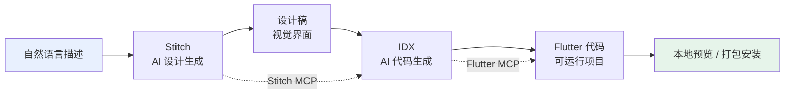

# 零代码造 App：Google 三件套（Stitch + IDX + Flutter）实操指南

# 一句话导读

Google 把 AI 设计、AI 编码、移动端框架串联成一条流水线，普通人也能从一句话描述走到手机上装 App。

# 适合谁看

- 想快速验证移动端产品想法，但团队没有原生开发资源的创业者或产品经理
- 有技术基础但没写过 Flutter，想用 AI 辅助降低学习成本的开发者
- 需要为线下活动、内部工具快速搭建移动端界面的运营或市场人员
- 对 AI 辅助开发流程感兴趣，想理解"设计-编码-部署"全链路如何被 AI 重构的人

# 读完你会获得什么

- 理解 Stitch、IDX、Flutter 三者各自的角色和协作关系
- 能区分"AI 生成设计稿"和"AI 生成可运行代码"的边界
- 掌握从文本描述到手机安装 App 的完整操作流程
- 理解 MCP Server 在 AI 工具链中的作用机制
- 能判断哪些场景适合用这套流程，哪些场景仍需人工介入
- 避开实操中常见的配置坑和理解误区

---

## 01 背景：为什么这个问题现在值得讨论

移动端 App 的开发门槛一直很高。一个像样的 App，至少需要设计、前端、后端三个角色协作，周期以周计。即便用 Flutter 这类跨平台框架降低了双端适配成本，你仍然要会写 Dart 代码、理解 Widget 树、处理状态管理。

这个门槛在过去是合理的——复杂产品确实需要专业团队。但现实中大量需求并不复杂：一场线下活动需要一个日程 App，一个内部流程需要一个表单工具，一个 MVP 需要一个可点击的原型。这些场景不需要复杂架构，需要的是速度。

Google 在 2025-2026 年陆续释放了三个工具：**Stitch**（AI 设计）、**IDX**（AI 编码）、**Flutter**（移动端框架），并通过 **MCP Server** 把它们串联起来。这不是三个独立工具的简单组合，而是一条从"一句话描述"到"手机上跑 App"的完整流水线。

过去你用 Figma 画设计稿，再交给开发者用代码还原——中间有巨大的沟通损耗和实现偏差。现在 Stitch 直接出设计，IDX 直接读设计生成 Flutter 代码，Flutter 直接跑出跨平台 App。链路缩短了，损耗减少了，门槛确实在降低。

但"降低"不等于"消除"。这套流程能做什么、不能做什么、在哪些环节容易翻车——这是本文要讲清楚的事。

---

## 02 核心判断：视频真正想讲的不是"AI 能做 App"

视频表面上在演示"零代码造 App"的操作流程，但它真正展示的是：**AI 工具之间如何通过 MCP 协议形成协作链路，从而把原本需要三个专业角色串联的工作压缩成一个人用自然语言驱动的流程。**

关键不在某个工具多强，而在于工具之间的连接。Stitch 本身只能出设计图，IDX 本身只能写代码，Flutter 本身只是 UI 框架。三者单独使用，各自都有替代品。但当 MCP Server 把它们连起来之后，流程变成了：描述需求 → Stitch 生成设计 → IDX 读取设计 → IDX 生成 Flutter 代码 → 本地运行预览 → 打包安装到手机。

这条链路的价值不在于每个环节的输出有多完美，而在于**人只需要在自然语言层面做决策，不需要切换工具、不需要理解中间格式、不需要手动对接**。

---

## 03 概念澄清：先把关键名词讲准确

### Google Stitch

- **它是什么**：Google 的 AI 设计工具，输入文字描述或参考网站 URL，输出完整的 App 界面设计稿
- **它解决什么问题**：把"我想要一个什么样的界面"这个意图，快速转化为可视化的设计产出，跳过手动画图的环节
- **它不是什么**：它不是代码生成工具，输出的不是可运行的代码，而是视觉设计稿；也不是 Figma 的替代品，目前不具备精细化的手动设计能力
- **它和相关概念的区别**：和 v0（Vercel 的 AI UI 生成器）不同，Stitch 专注视觉设计层面，不直接输出代码；和 Figma AI 不同，Stitch 从零生成而非辅助已有设计
- **简单例子**：你说"给我做一个 Google Cloud Next 大会的深色模式日程 App，首页有 logo、日期、可滚动的议程列表"，Stitch 直接生成对应的界面设计

### Project IDX

- **它是什么**：Google 的 AI 代码平台，通过自然语言描述驱动代码生成和项目管理
- **它解决什么问题**：让不会写代码的人也能通过描述需求来生成应用代码，让会写代码的人用自然语言加速开发
- **它不是什么**：它不是传统的 IDE，不是低代码平台（不需要拖拽模块），不是 ChatGPT 式的对话工具（它有完整的项目结构和依赖管理）
- **它和相关概念的区别**：和 Cursor 不同，IDX 是云端-first 的开发环境，内置 AI Agent 而非插件式 AI；和 Bolt/Replit 不同，IDX 与 Google 生态（Firebase、Flutter）深度集成
- **简单例子**：你把 Stitch 导出的设计文件传给 IDX，说"按这个设计用 Flutter 实现"，IDX 会自动安装依赖、生成代码、启动预览

### Flutter

- **它是什么**：Google 的跨平台 UI 框架，用一套 Dart 代码同时生成 iOS 和 Android 应用
- **它解决什么问题**：一次开发，双端部署，避免维护两套原生代码
- **它不是什么**：它不是 React Native（技术栈不同），不是小程序框架（产出是原生 App），不是 WebView 套壳（渲染引擎自绘）
- **它和相关概念的区别**：Flutter 用自绘引擎（Skia/Impeller）渲染，不依赖平台原生组件，所以 UI 一致性更好，但包体积更大
- **简单例子**：Google Pay、eBay、阿里巴巴、纽约时报等大厂都用 Flutter 构建移动端

### MCP Server

- **它是什么**：Model Context Protocol 服务器，让 AI Agent 能调用外部工具和数据的标准接口
- **它解决什么问题**：AI 工具之间的"语言不通"问题——让 IDX 能直接读取 Stitch 的项目，让 IDX 知道 Flutter 的构建规范
- **它不是什么**：它不是 API 网关，不是插件系统，不是简单的 HTTP 调用
- **它和相关概念的区别**：MCP 是 Anthropic 提出的开放协议标准，类比于 AI 工具的 USB 接口——只要双方都支持 MCP，就能互联互通
- **简单例子**：Stitch MCP Server 让 IDX 可以直接列出你的 Stitch 项目、读取设计文件，而不需要你手动导出再上传

---

## 04 整体框架：这套内容应该如何理解

整个流程是一个从意图到产物的三阶段流水线：

**三层分工**：

1. **设计层（Stitch）**：接收自然语言描述 + 可选的参考网站 URL，输出 App 界面的视觉设计。人在这一层做的是"描述我要什么"和"审核设计是否对"。

2. **编码层（IDX）**：接收设计稿（通过 MCP 直接读取或手动导入），输出 Flutter 项目代码。人在这一层做的是"告诉 AI 按什么技术栈实现"和"修复 AI 无法处理的细节"。

3. **运行层（Flutter）**：接收代码，构建跨平台应用。人在这一层做的是"预览效果"和"打包部署"。

**MCP 的角色**：两个 MCP Server 分别打通了"设计→编码"和"编码→运行"的链路。Stitch MCP 让 IDX 直接访问设计资源，Flutter MCP 让 IDX 掌握 Flutter 的构建规范和最佳实践。没有 MCP，每个环节都需要人工手动搬运文件和配置。

---

## 05 关键机制：它到底是怎么运行的

### 机制一：Stitch 的设计生成

- **输入**：文字描述（prompt）+ 可选的参考网站 URL
- **处理**：AI 解析描述中的布局要求、风格偏好、品牌元素，同时抓取参考网站的视觉特征（配色、字体、间距、组件风格），综合生成设计稿
- **输出**：多屏 App 界面设计图，可直接预览、标注修改、导出
- **为什么这样设计**：纯文字描述太模糊，参考网站提供了视觉锚点，两者结合让 AI 的设计输出更可控
- **代价**：对参考网站的依赖性强，如果参考网站本身设计一般，输出也会一般；风格上容易和参考网站趋同
- **适合场景**：有明确视觉参考的需求（如"照着这个网站的风格做"）、品牌设计有现成规范的项目
- **不适合场景**：需要完全原创视觉风格、交互非常复杂的界面

### 机制二：Stitch 的迭代修改

- **输入**：对已有设计稿的标注（annotation）
- **处理**：选中设计稿的某个区域，添加文字注释说明要怎么改，AI 重新生成该区域
- **输出**：局部更新的设计稿
- **为什么这样设计**：避免每次修改都重生成整个页面，减少等待时间和风格漂移
- **代价**：局部修改可能和整体风格产生不一致；复杂修改仍需多次迭代

### 机制三：IDX 读取设计生成代码

- **输入**：Stitch 导出的设计文件（通过 MCP 自动获取或手动上传）
- **处理**：IDX 识别设计稿的布局结构、组件层级、配色方案，映射到 Flutter Widget 树，生成 Dart 代码，同时安装所需依赖（SDK、包管理）
- **输出**：可运行的 Flutter 项目，可在浏览器中预览
- **为什么这样设计**：设计到代码的转换是传统开发中损耗最大的环节，AI 自动化这一步的价值最高
- **代价**：AI 生成的代码结构不一定最优；对于复杂交互逻辑（如状态管理、网络请求），AI 的实现可能需要人工修正
- **适合场景**：以展示型界面为主的 App（活动日程、产品展示、信息查询）
- **不适合场景**：需要复杂业务逻辑的 App（交易系统、实时通讯、复杂表单验证）

### 机制四：MCP 连接工具链

- **输入**：MCP Server 配置（API Key、服务端点）
- **处理**：在 IDX 中安装 MCP Server 后，IDX 的 AI Agent 获得了调用外部工具的能力——可以查询 Stitch 项目列表、读取设计资源、执行 Flutter 构建命令
- **输出**：工具间的自动化数据流通，无需人工搬运
- **为什么这样设计**：AI Agent 的能力边界由它能调用的工具决定。MCP 标准化了工具接入方式，让 Agent 的能力可扩展
- **代价**：配置 MCP 需要一定技术理解；MCP Server 的稳定性和文档完善度直接影响体验

---

## 06 方法拆解：如果自己要做，应该怎么落地

### 步骤一：用 Stitch 生成 App 设计

**目标**：得到符合预期的多屏 App 设计稿

**具体动作**：
1. 打开 Google Stitch（stitch.withgoogle.com）
2. 输入文字描述，格式建议：`[App 类型] + [屏幕数量] + [每屏内容] + [风格要求] + [参考网站 URL]`
3. 描述示例："Build me a 2-screen mobile app for [活动名]. Screen 1: homepage with logo, event name, dates, scrollable agenda list with tabs for different days. Screen 2: [内容]. Dark mode, minimal design, use [品牌名] branding. Reference: [URL]"
4. 提交生成，等待输出

**判断标准**：设计稿是否包含了你描述的所有关键元素；布局是否合理；配色和风格是否与参考一致

**常见坑**：
- 描述太模糊会导致生成结果不可控。尽量具体说明每个屏幕包含什么
- 不提供参考网站时，AI 会自行决定风格，可能偏离预期
- 免费版有生成次数限制，先把描述想清楚再提交

**产出物**：多屏 App 设计稿

### 步骤二：在 Stitch 中迭代设计

**目标**：让设计稿达到可用状态

**具体动作**：
1. 使用预览功能查看移动端效果（滚动、交互）
2. 选中需要修改的区域，添加 annotation 注释
3. 注释要具体："将这个按钮的文字改为 X""把这里的配色从蓝色改为品牌色 #XXXX"
4. 提交修改，等待重新生成

**判断标准**：修改后设计是否准确反映了你的意图；整体风格是否依然一致

**常见坑**：
- 一次改动太多区域可能导致整体风格漂移
- 注释不够具体会导致 AI 理解偏差

**产出物**：迭代后的最终设计稿

### 步骤三：配置 IDX 的 MCP Server

**目标**：让 IDX 能访问 Stitch 项目和 Flutter 构建能力

**具体动作**：
1. 在 Stitch 中获取 API Key（Settings → API Key）
2. 打开 IDX，发送消息："Set up the Stitch MCP server for me, here's my API key: [你的 key]"
3. IDX 会自动配置 MCP，确认后在 MCP Servers 面板查看 Stitch MCP 是否显示
4. 安装 Flutter MCP Server：告诉 IDX 安装 Flutter MCP，或手动添加
5. 如果 Flutter 环境有问题，让 IDX 排查 Flutter 安装状态
6. 重启 IDX，确认两个 MCP Server 都在运行

**判断标准**：在 IDX 中问"List my Stitch projects"，如果它能返回你的项目列表，说明 Stitch MCP 配置成功；如果 IDX 能识别 Flutter 项目结构并构建，说明 Flutter MCP 配置成功

**常见坑**：
- API Key 复制错误或过期
- Flutter 未正确安装导致 Flutter MCP 报错——需要先确保本地 Flutter SDK 可用
- MCP 配置后需要重启 IDX 才能生效

**产出物**：配置好 MCP 的 IDX 工作环境

### 步骤四：让 IDX 读取设计并生成代码

**目标**：从设计稿生成可运行的 Flutter 项目

**具体动作**：
1. 在 IDX 中发送描述："Build a mobile app for [项目名] using my Stitch design. Use Flutter. Make sure to use the design from Stitch as reference. Include [具体功能要求]. Use [品牌] branding, dark mode. Reference website: [URL]"
2. IDX 会通过 MCP 读取 Stitch 设计，生成 Flutter 代码
3. IDX 自动安装依赖（Flutter SDK、Dart 包等）
4. 启动本地预览，在浏览器中查看效果

**判断标准**：生成的 App 是否在设计上匹配 Stitch 原稿；基本导航和布局是否正确；能否在浏览器中正常预览

**常见坑**：
- AI 生成的占位内容（如假数据、占位图片）需要手动替换
- 复杂交互（如搜索、筛选）可能需要额外指导
- 一次生成可能不完美，需要多轮迭代

**产出物**：可本地预览的 Flutter 项目

### 步骤五：替换占位内容并打磨细节

**目标**：让 App 内容真实可用

**具体动作**：
1. 识别占位内容（假图片、假文字、假数据）
2. 获取真实素材：从参考网站找真实图片 URL，或上传自己的素材
3. 告诉 IDX 具体替换："Update the speaker photos section with these images: [URL 列表]"
4. 如果 IDX 无法自动获取，手动下载图片放入项目的 assets 目录，再让 IDX 引用

**判断标准**：关键内容是否真实；图片是否正确加载；文字是否准确

**常见坑**：
- 图片 URL 可能有时效性或有防盗链，需要下载到本地
- AI 可能无法自动识别需要替换的占位内容，需要明确指出

**产出物**：内容真实的 Flutter 项目

### 步骤六：打包安装到手机

**目标**：在真机上运行 App

**具体动作**：
1. 在 IDX 中请求："Build an APK file for this app"
2. IDX 会执行 Flutter 构建命令，生成 APK 文件
3. 下载 APK 到手机，安装运行
4. 如需 iOS：流程更复杂，需要 Apple Developer 账号和 macOS 环境，IDX 可以生成指导步骤

**判断标准**：App 能在手机上正常启动和运行；界面布局正确；基本功能可用

**常见坑**：
- Android 安装需要开启"允许未知来源"选项
- iOS 的构建和安装流程远比 Android 复杂，需要额外的签名和配置
- 构建过程可能因为依赖版本不匹配而失败，需要 IDX 排查

**产出物**：安装到手机上的可运行 App

---

## 07 案例讲解：用一个具体场景串起来

**场景背景**：Google Cloud Next 2026 大会即将举办，主办方需要一个移动端 App，让参会者查看议程、演讲者信息和场地导航。

**遇到的问题**：距离大会只有两周，没有专职移动端开发，设计资源和开发资源都很紧张。

**按框架如何处理**：

**第一步：描述需求给 Stitch**。输入："Build a 2-screen mobile app for Google Cloud Next 2026. Screen 1: homepage with Google Cloud logo, event name, dates, scrollable agenda with day tabs. Screen 2: speaker details. Dark mode, minimal design, Google Cloud branding." 附上 Google Cloud Next 官网 URL 作为视觉参考。

**第二步：审核和迭代设计**。Stitch 生成了首页和详情页。预览滚动效果，发现议程列表的布局可以更紧凑。用 annotation 标注修改，Stitch 局部重新生成。

**第三步：配置 MCP 并导入 IDX**。在 IDX 中配置 Stitch MCP 和 Flutter MCP，然后告诉 IDX："用我的 Stitch 设计构建 Flutter App。"

**第四步：IDX 生成代码并预览**。IDX 读取设计文件，生成 Flutter 项目，自动安装依赖，启动浏览器预览。首页布局、配色、字体都和设计稿基本一致。但演讲者照片是占位图。

**第五步：替换占位内容**。从 Google Cloud Next 官网找到演讲者的照片 URL，告诉 IDX 替换。IDX 下载图片，放入 assets 目录，更新代码引用。重新预览，照片显示正确。

**第六步：打包到手机**。让 IDX 构建 APK，下载到 Android 手机安装。App 正常运行，可以查看议程和演讲者信息。

**最终结果**：从零到手机上跑起来的 App，全程没有手写一行代码。整个流程大约 1-2 小时（含迭代和调试）。

**说明了什么**：对于展示型、内容型的移动端需求，这套流程确实可行。但 App 的深度交互（如实时签到、消息推送、支付）仍然超出了 AI 当前能自动生成的范围——这些需要人工开发或更专业的工具链。

---

## 08 常见误区：很多人会在哪里理解错

**误区一：以为"零代码"等于"零思考"**

- 错误理解：AI 能自动搞定一切，我只需要随便说几句话
- 为什么错：AI 的输出质量直接取决于输入的精确度。模糊的描述产出模糊的设计，缺少上下文的指令产出偏离预期的代码
- 正确理解：你不需要写代码，但你需要精确地思考和表达需求。描述越具体，结果越可控
- 应该怎么做：花时间写好 prompt，像写产品需求文档一样组织你的描述

**误区二：以为三个工具必须同时使用**

- 错误理解：必须用 Stitch 出设计 → IDX 写代码 → Flutter 运行，缺一不可
- 为什么错：三个工具各自独立可用。你可以只用 Stitch 出设计，手动交给开发者实现；也可以只用 IDX 写代码，不用 Stitch
- 正确理解：三个工具组合的完整链路效率最高，但你可以根据需要只用其中一两个
- 应该怎么做：根据你的团队配置和需求复杂度，选择合适的环节使用 AI

**误区三：以为生成的代码可以直接上生产**

- 错误理解：AI 生成的 Flutter 代码质量够高，可以直接发布到 App Store
- 为什么错：AI 生成的代码在结构优化、错误处理、安全性、性能方面存在盲区。占位数据、硬编码值、缺失的边界处理都是常见问题
- 正确理解：AI 生成的是高质量原型，不是生产代码。上生产之前需要人工审查和补充
- 应该怎么做：把 AI 产出当作快速原型，在确认方向正确后，由开发者做代码审查和优化

**误区四：以为 MCP 配置一次就永久有效**

- 错误理解：MCP Server 配好之后再也不用管
- 为什么错：MCP Server 依赖 API Key（可能过期）、工具版本（可能更新）、IDX 项目环境（可能重置）
- 正确理解：MCP 是需要维护的连接层，类似于你装了一个软件，偶尔需要更新
- 应该怎么做：每次开始新项目时检查 MCP 状态；API Key 定期更新；关注工具版本更新

**误区五：以为所有类型的应用都适合这套流程**

- 错误理解：既然能做活动 App，那做电商 App、社交 App 也可以
- 为什么错：这套流程擅长的信息展示型应用，对于复杂业务逻辑（交易、实时通讯、个性化推荐）支持有限
- 正确理解：AI 辅助开发目前最适合"展示型 + 轻交互型"应用，复杂业务逻辑仍需传统开发
- 应该怎么做：评估你的 App 类型——如果核心是"展示信息"，适合；如果核心是"处理业务"，谨慎

**误区六：以为参考网站 URL 只是可选的装饰**

- 错误理解：URL 参考只是锦上添花，文字描述就够了
- 为什么错：文字描述在视觉风格上的表达能力有限。没有视觉锚点，AI 会自由发挥，结果可能和你想的完全不同
- 正确理解：参考 URL 是控制输出风格的最有效手段，重要程度甚至超过文字描述
- 应该怎么做：总是找一个你认可其视觉风格的参考网站，即使你不会完全照搬

**误区七：以为 Stitch 的 annotation 可以替代重新生成**

- 错误理解：任何修改都用 annotation 做局部调整就行
- 为什么错：多次局部修改会累积风格不一致的问题；当修改涉及整体布局时，局部调整不如整体重新生成
- 正确理解：小修改用 annotation，大改动重新生成整页
- 应该怎么做：如果单页修改超过 3 处，考虑重新生成整个屏幕

---

## 09 实战清单：读完后可以马上照着做

**立即能做**

- [ ] 打开 Google Stitch，用一段具体的文字描述生成你的第一个 App 设计稿
- [ ] 在 Stitch 中预览移动端效果，体验滚动和交互模拟
- [ ] 找一个你喜欢的网站 URL，用它做参考重新生成一次设计，对比有/无参考的差异

**一周内能做**

- [ ] 注册并打开 IDX，配置 Stitch MCP Server（获取 API Key → 在 IDX 中设置 → 确认连接成功）
- [ ] 让 IDX 读取你的 Stitch 项目，生成 Flutter 代码，在浏览器中预览运行效果
- [ ] 配置 Flutter MCP Server，让 IDX 获得 Flutter 构建能力
- [ ] 完成"设计 → 代码 → 预览"的完整链路至少走通一次

**长期要沉淀**

- [ ] 建立你的 prompt 模板库：针对不同 App 类型（活动、展示、工具），积累有效的描述模板
- [ ] 记录 AI 生成代码的常见问题和修复方案，形成自己的质量检查清单
- [ ] 关注 MCP 生态的扩展：哪些新的 MCP Server 出现了，能连接哪些新工具
- [ ] 评估你日常工作中哪些需求适合用这套流程替代，形成"AI 优先 vs 传统优先"的判断标准

---

## 10 总结

Google 的 Stitch + IDX + Flutter 组合，本质上是把移动端开发从"三个专业角色协作"变成"一个人用自然语言驱动 AI 完成"。Stitch 解决了设计环节的从零到一，IDX 解决了设计到代码的自动转换，Flutter 解决了跨平台部署的问题，MCP 解决了工具间的数据流通。

这套流程的价值是真实的，但边界也是清晰的。它最擅长的是展示型、内容型的移动端应用——活动 App、产品目录、信息门户。对于需要复杂业务逻辑的应用，AI 目前能做的是加速原型验证，而不是替代开发。

核心判断：**这不是"AI 取代开发者"的故事，而是"AI 把开发门槛从'会写代码'降到'会表达需求'"的故事。** 门槛降低了，但对需求思考和表达的要求并没有降低——甚至提高了。因为当你不再受限于技术能力时，唯一限制你的就是你对问题的理解深度。
