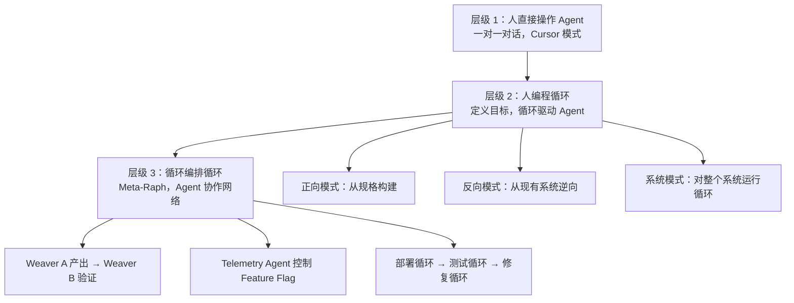

# 用循环编程：为什么 AI 时代的软件开发需要一个全新的基础设施

# 一句话导读

当 AI 能自主写代码时，人机协作的瓶颈不再是"写"，而是"编排"——这篇文章拆解一种以"循环"为核心原语的工程方法，以及支撑它运行的基础设施设计。

# 适合谁看

- 正在用 Cursor/Copilot 写代码，但觉得"一对一对话"效率见顶的工程师
- 想理解 AI Agent 编排逻辑，但被各种框架术语淹没的技术管理者
- 考虑自建 AI 开发基础设施，想知道"从 GitHub 起步够不够"的团队负责人
- 对"模型优先公司"概念好奇，想看真实落地细节的创业者

# 读完你会获得什么

- 理解"Raph 循环"这一原语的正向、反向、系统级三种运行模式
- 区分"一对一使用 AI 工具"和"编程循环"在抽象层级上的根本差异
- 掌握 Agent-first 基础设施的关键设计决策：审计、身份、网络、密钥
- 能判断自己的团队当前处在"使用 AI"的哪个阶段，下一步该往哪走
- 理解"推 main 不做 code review"背后的工程逻辑，而不是简单模仿

---

## 01 背景：为什么这个问题现在值得讨论

过去两年，AI 编程工具的爆发让一个事实变得清晰：我们现有的开发工具链——GitHub、IDE、CI/CD——全部是为"人直接操作"设计的。人写代码，人提 PR，人做 Review，人点部署。

问题在于，当 AI Agent 具备了自主编码能力后，这些工具变成了摩擦源。一个 Agent 想修改代码，它需要模拟人的操作流程：fork 仓库、创建分支、提 PR、等 Review。每一步都是为人设计的交互仪式，对 Agent 而言全是浪费。

更深层的问题是抽象层级。Steve Yegge 在 2024 年提出过一个框架：当前大多数人在"AI 编码 Agent"这一层工作——人直接管理一个 Agent，一对一。但这一层的效率很快见顶。真正能释放 Agent 能力的方式，是往上走一层：人不直接管理 Agent，而是编程循环（loops），让循环去管理 Agent。

这个判断不是理论推演。已经有人在用这种方式工作了超过一年。这篇文章要拆解的，就是这套方法具体长什么样，以及支撑它运行需要什么样的基础设施。

---

## 02 核心判断：真正的分水岭不是"用不用 AI"，而是"在哪个抽象层级使用 AI"

视频表面在展示一个叫 Loom 的产品，实际上在论证一个判断：

**软件开发的下一个台阶，不是更好的 AI 编码助手，而是"编程循环"——把单次的人机对话封装成可重复、可组合、可审计的自动化循环。**

这个判断有两个支撑：

1. **一对一协作的效率天花板很低。** 不管 Cursor 多好用，你的瓶颈是人本身——人能同时关注的上下文有限，能驱动的 Agent 数量有限。一个人同时和三个 Cursor 窗口对话就已经手忙脚乱。
2. **循环是可以编程的。** 给定一个目标、一份规格说明、一个验证标准，你可以把"让 Agent 完成任务"这件事本身变成一个参数化的程序。一个循环跑不通，再跑一个；一个循环的输出是另一个循环的输入。

这意味着：从"人操作 AI"到"人编程循环"的跃迁，不是一个渐进改良，而是一次抽象层级的切换。类比：从手写汇编到用编译器，从手动管理内存到垃圾回收。你操作的对象变了，整个工具链都需要重新设计。

---

## 03 概念澄清：先把关键名词讲准确

### Raph 循环（Ralph Wigram Loop）

- **它是什么**：一种以"单一目标 + 规格说明 + 自动化验证"为核心的 Agent 编排模式。你设定一个循环，给它一个目标（比如"修复登录 Bug"），让它自动规划、执行、验证，直到目标达成或需要人工介入。
- **它解决什么问题**：把"人和 Agent 一对一对话"的交互模式，升级为"人定义目标，循环驱动 Agent"的自动化模式。
- **它不是什么**：它不是简单的 prompt 模板，不是 AutoGPT 式的无限递归，不是无监督的"让 AI 自己跑"。它是有边界、有审计、有人工兜底的工程循环。
- **它和普通 AI 编码的区别**：普通 AI 编码是"人问一句，AI 答一句"；Raph 循环是"人设一个目标，AI 自主完成多轮工具调用直到达成"。前者是对话，后者是程序。
- **一个简单例子**：你给 Agent 一个目标"验证所有 API 端点正常工作"，Agent 会自动：读取规格 → 按端点逐个调用 → 遇到错误查日志 → 尝试定位问题 → 生成测试报告。全程不需要人逐步指令。

名称来源：Ralph Wigram 是二战期间向丘吉尔泄露德国重整军备情报的英国公务员。借用这个名字，暗示的是"从系统内部获取关键信息"的含义——Agent 在循环中自主探索代码库，找到问题所在。

### Weaver（织工）

- **它是什么**：Loom 中对"远程执行 Agent"的称呼。一个 Weaver 就是一个运行在远程基础设施上的编码 Agent 实例，拥有自己的沙箱环境。
- **它解决什么问题**：让 Agent 在隔离环境中执行，不污染本地开发环境，支持并行运行多个 Agent。
- **它不是什么**：它不只是远程服务器。Weaver 同时也是一个 CLI 工具，可以在本地运行，还可以作为 WireGuard 客户端实现网络穿透。
- **它和相关概念的区别**：类似 e2b 的远程沙箱，但 Weaver 是自托管的，网络连通性由内置 WireGuard 解决，不依赖第三方服务。

### Thread（线程）

- **它是什么**：一个 Weaver 执行过程中产生的完整审计记录——每一轮工具调用、每一个决策、每一次文件修改，全部留存。
- **它解决什么问题**：可追溯性。当 Agent 做错了什么，你可以回溯 Thread 找到出错的环节。另一个 Agent 也可以读取 Thread，在其基础上继续工作。
- **它不是什么**：它不是日志流。Thread 是结构化的、可查询的、可被其他 Agent 消费的上下文载体。

### 模型优先公司（Model-First Company）

- **它是什么**：一种公司运作方式：产品规格由人写，但代码实现、基础设施搭建、测试执行全部由 Agent 通过循环完成。人定义"做什么"，Agent 负责"怎么做"。
- **它解决什么问题**：将人的角色从"执行者"转变为"规格定义者"和"循环编排者"，极大扩展一个人的产出边界。
- **它不是什么**：它不是"AI 替代人"。人仍然在系统中——写规格、编排循环、审查结果、处理异常。人的判断力不可被跳过。

---

## 04 整体框架：从"人操作 Agent"到"人编程循环"

这套内容的理解框架是一个三层演进结构：

**层级 1** 是当前大多数人的状态：打开 Cursor，对话写代码。效率比手写高，但天花板取决于人能同时管理几个对话。

**层级 2** 是 Raph 循环的核心：你不再逐条指令，而是定义一个"循环程序"——目标是什么、规格在哪里、验证标准是什么、异常怎么处理。循环自动运行，你只需要审查结果。

**层级 3** 是循环之间的编排：一个 Weaver 的输出是另一个 Weaver 的输入。部署循环完成后触发测试循环，测试发现问题触发修复循环，修复完成后再跑验证循环。这就是"Meta-Raph"。

从层级 1 到层级 2 的关键动作是：**把你的工作从"执行任务"变成"定义任务"**。从层级 2 到层级 3 的关键动作是：**把独立的循环连接成流水线**。

---

## 05 关键机制：Raph 循环到底是怎么运行的

### 正向模式（Forward Mode）

**输入**：一份产品规格文档（spec）

**中间过程**：Agent 读取规格 → 分解为子任务 → 逐个实现 → 每一步对照规格验证 → 遇到歧义回溯重新理解规格

**输出**：符合规格的代码实现

**为什么这样设计**：人写规格的速度远快于写代码。一份 200 行的规格可能对应 2000 行代码。把"理解规格并实现"这件事交给循环，人只需关注规格质量。

**代价**：规格必须足够精确。模糊的规格导致 Agent 反复尝试，浪费推理资源。

**适合场景**：新功能开发、从零搭建项目、有明确需求文档的任务

### 反向模式（Reverse Mode）

**输入**：一个已有系统的代码库

**中间过程**：Agent 分析代码结构 → 识别模式 → 提取架构决策 → 生成等价实现

**输出**：对现有系统的理解文档或等价重建

**为什么这样设计**：很多时候你不是从零开始，而是在理解和改造已有系统。反向模式让 Agent 先"读懂"再"动手"。

**代价**：对大型代码库，上下文窗口可能不够。需要分区扫描再综合。

**适合场景**：克隆已有产品、理解遗留代码、逆向工程

### 系统模式（System-Level Raph）

**输入**：系统运行时的状态（日志、API 响应、审计记录）

**中间过程**：Agent 读取系统状态 → 识别异常 → 定位问题 → 制定修复计划 → 生成新循环执行修复

**输出**：系统恢复到正常状态 + 问题根因分析

**为什么这样设计**：传统 CI 在 Pipeline 失败时只告诉你"红了"，不告诉你怎么修。系统级 Raph 是活的：它不仅检测问题，还能诊断和修复。

**代价**：需要 Agent 对生产系统有操作权限。安全边界必须严格。

**适合场景**：集成测试、系统巡检、自动化运维

### 关键设计原则：单目标聚焦

Raph 循环最核心的设计约束是：**一个循环只有一个目标。**

这不是随便说的。当一个循环有多个目标时，Agent 会在目标之间跳转，上下文被稀释，每个目标都做不深。单目标强制 Agent 聚焦，提高成功率。

如果你有多个目标，就开多个循环。循环之间通过 Thread（审计记录）传递上下文。

---

## 06 方法拆解：如果自己要做，应该怎么落地

### 第一步：建立规格索引（Spec Index）

**目标**：让 Agent 能高效查找相关规格，而不是在代码库中漫无目的地搜索

**具体动作**：
1. 为每个功能模块写一份规格文档，放在统一目录（如 `specs/`）
2. 创建 `index.md` 作为规格的查找索引，按照功能模块组织
3. 在启动循环时，先让 Agent 读取索引，再定向到具体规格

**判断标准**：Agent 能在 1-2 轮工具调用内找到目标规格，而不是 5-10 轮试错

**常见坑**：规格太长塞不进上下文；规格之间互相引用导致循环依赖；索引过期没更新

**产出物**：一份结构化的规格索引 + 每个模块的独立规格文档

### 第二步：钉住上下文窗口（Pin the Context）

**目标**：在循环开始前，把 Agent 需要的关键信息固定在上下文中

**具体动作**：
1. 读取核心规格文档，确认 Agent 已理解
2. 读取相关的源码文件结构，确认 Agent 知道代码在哪
3. 明确声明当前循环的单一目标
4. 确认 Agent 复述了目标和约束

**判断标准**：Agent 在后续步骤中不会问"我要做什么"或"相关代码在哪"

**常见坑**：上下文塞太多无关信息导致核心目标被稀释；没有显式确认 Agent 理解了目标

**产出物**：一个"就绪"的上下文窗口——Agent 已加载规格、代码结构、目标

### 第三步：运行并监控循环

**目标**：让循环自主运行，同时保持可观测性

**具体动作**：
1. 启动循环，设定目标（如"验证所有 API 端点"）
2. 观察 Agent 的工具调用链，关注是否偏离目标
3. 如果 Agent 陷入重复失败的"爬山"行为，手动干预或调优 prompt
4. 循环结束后，审查 Thread（审计记录）

**判断标准**：Agent 在合理的步骤数内（通常 10-30 轮工具调用）达成目标，或者清晰地报告无法达成

**常见坑**：Agent 反复尝试同一个失败路径（需要增加"失败后换策略"的指令）；Agent 偏离目标去优化无关代码（需要更强的目标约束）

**产出物**：目标达成的结果 + 完整的 Thread 审计记录

### 第四步：工程化回压（Engineer Back-Pressure）

**目标**：从循环的失败模式中提炼出防护机制，防止同类问题再次发生

**具体动作**：
1. 分类失败的类型：是规格不清晰？是 Agent 理解偏差？是基础设施问题？
2. 针对每类失败，设计防护：更精确的规格、更强的 prompt 约束、前置检查步骤
3. 将防护机制编码到循环的 prompt 中，下次运行自动生效

**判断标准**：同类失败在后续循环中不再出现

**常见坑**：过度约束导致 Agent 丧失灵活性；只修表面症状不修根本原因

**产出物**：一个越来越健壮的循环 prompt——每次失败都让它变得更好

---

## 07 案例讲解：用 Raph 循环对整个系统做集成测试

**场景背景**：Loom 平台有几十个 API 端点，包括用户认证、仓库管理、Weaver 创建/销毁、Thread 查询等。手动逐个测试不现实，写固定测试脚本又太僵硬。

**遇到的问题**：传统做法是写集成测试脚本，但脚本是静态的——它只能检查你预想到的情况。而且维护脚本本身也是负担。

**按框架如何处理**：

1. **钉上下文**：读取 specs 索引，让 Agent 知道所有 API 端点的定义
2. **设定单一目标**："用 Weaver CLI 和 curl 验证所有 API 端点是否按规格工作"
3. **关键约束**：
   - 不要去读已有的测试代码，不要写新测试脚本——直接用 CLI 和 curl 驱动
   - 遇到 4xx/5xx 错误时，查服务端日志（journalctl）做诊断
   - 有权限自动部署服务器来排查问题
   - 修复问题不是本轮循环的目标——本轮只做发现和诊断
4. **运行循环**：Agent 开始逐个端点验证，从健康检查开始，到 Thread 创建/删除，到 Weaver 远程部署
5. **处理异常**：Agent 遇到错误时自动查日志，判断是 API 实现问题还是客户端问题，记录到测试计划中
6. **输出结果**：一份标注了每个端点状态（通过/失败/需调查）的测试计划文档

**最终结果**：大部分端点通过，发现了一个 Thread 删除的 Bug。更重要的是，这个循环本身可以随时重跑——不是静态测试脚本，而是一个活的系统验证循环。

**说明了什么**：Raph 循环做集成测试和传统测试脚本的区别，类似于"人做探索性测试"和"写死自动化用例"的区别。循环能处理预想之外的情况，因为它有推理能力。但这种能力需要你给它足够的自由度和正确的约束——"不要写测试代码，直接用 CLI"就是一个关键约束，否则 Agent 会滑入它最熟悉的模式（写测试），而这恰恰不是你想要的。

---

## 08 常见误区

### 误区 1："Raph 循环就是让 AI 自己跑，不用管了"

**错误理解**：设定目标后完全放手，等结果就行

**为什么错**：无人监管的循环会产生级联失败。Agent 可能反复执行同一个无效操作，或者在错误方向上越走越远。视频中的做法是"感受失败领域"——先让自己经历失败，理解失败的模式，再工程化地消除它

**正确理解**：Raph 循环是"半自主"的——自主执行，但人工设计回压机制。你的角色从"执行者"变成了"防护工程师"

**应该怎么做**：先小规模手动驱动循环，观察失败模式；再逐步把防护编码进循环 prompt；最后才放手让它自动运行

### 误区 2："不用 Code Review 就是不要质量保障"

**错误理解**：推 main 不做 Review = 放弃质量控制

**为什么错**：Code Review 只是质量保障的一种手段，不是唯一手段。当你有自动化的系统级测试循环、Feature Flag 灰度机制、实时监控回滚能力时，Code Review 的边际收益急剧下降

**正确理解**：不 Review 的前提是你有替代保障机制。视频中明确说：他能这样做是因为有一年的经验积累，理解了失败领域，并工程化地处理了它们

**应该怎么做**：先有自动化验证，再考虑减少人工 Review；不要在没有任何替代保障的情况下跳过 Review

### 误区 3："Raph 循环只适用于写代码"

**错误理解**：这个方法只能用来开发软件

**为什么错**：循环的三个模式——正向构建、反向理解、系统验证——覆盖了软件开发的全生命周期。测试、运维、安全审计、产品特性实验，都可以用循环驱动

**正确理解**：Raph 循环是一个通用原语，只要满足"有目标 + 有规格 + 可验证"的条件就能用

**应该怎么做**：先在编码场景跑通，再迁移到测试、运维、产品实验等场景

### 误区 4："Agent-first 意味着不需要为人设计"

**错误理解**：既然是为 Agent 设计的，人机界面不重要

**为什么错**：人仍然在系统中——审查 Thread、编排循环、处理异常。Agent-first 是优先级调整，不是排除人类。当前阶段，人仍然需要能登录 Weaver、查看日志、SSH 进远程环境做排查

**正确理解**：Agent-first 是说"基础设施的首要用户是 Agent"，但人的可观测性和可介入性同样需要设计

**应该怎么做**：为 Agent 设计 API 和 CLI，为人设计审计界面和紧急介入通道

### 误区 5："水平扩展是唯一正道"

**错误理解**：要跑大量 Agent，必须用云原生水平扩展架构

**为什么错**：视频中的实际选择是：一台 192 核、TB 级内存的裸金属服务器，月租 1500 美元。这在传统 Web 架构视角下不可思议，但 Agent 负载的特征不同——它不需要全球分布，不需要高可用多活，它需要的是大内存和密集计算

**正确理解**：水平扩展是 Web 规模时代的遗产，适合请求量大、无状态的服务。Agent 执行是有状态的、计算密集的，垂直扩展往往更简单、更便宜、更快

**应该怎么做**：先垂直扩展到单机极限，再考虑分布式；不要在第一天就设计微服务架构

### 误区 6："SOPS + SSH 密钥 = 安全万无一失"

**错误理解**：用 SOPS 加密密钥、用 SSH 主机密钥解密，就足够安全了

**为什么错**：视频中作者自己也承认"如果有人破解了 SOPS 加密，我有更大的问题"。这说明单点依赖主机 SSH 密钥是风险集中点。虽然后续会迁移到 HSM，但当前阶段存在安全隐患

**正确理解**：SOPS + NixOS 声明式密钥管理是一个好的起步方案，但需要向硬件安全模块（HSM）演进，并做好密钥轮换的自动化

**应该怎么做**：起步用 SOPS，但把 HSM 和自动轮换列入路线图；不要把密钥安全停留在"我相信没人能拿到我的 SSH 密钥"

---

## 09 实战清单：读完后可以马上照着做

**立即能做**

1. **梳理你的 AI 使用层级**：画一张图，标出你当前在"一对一 Agent 协作"层级中的具体操作，列出哪些可以封装成循环
2. **为一个小任务写一份规格文档**：选一个你明天要做的功能，用 50-200 行写清楚"做什么"和"验收标准"，而不是直接开始写代码
3. **试验单目标循环**：用你现有的 AI 编码工具，设定一个单一目标，写明规格文件路径，观察 Agent 在"你不断给指令"和"你只给目标"两种模式下的效率差异

**一周内能做**

4. **建立规格索引**：为你的项目创建一个 `specs/index.md`，把已有文档组织成 Agent 可查找的结构
5. **记录一个完整的失败循环**：下次 Agent 执行失败时，不要只修 Bug——记录完整的工具调用链、失败模式、根因分类。这是你设计回压机制的原材料
6. **评估你的基础设施是否 Agent-ready**：你的 Agent 能否自动获取身份凭证？能否自动连接远程环境？能否读取审计日志？这些是 Agent-first 基础设施的基本要求

**长期要沉淀**

7. **构建你的循环 prompt 库**：每次成功的循环，把 prompt 模板沉淀下来。不同类型的任务（开发、测试、运维）会有不同的最佳 prompt 结构
8. **设计循环间的编排协议**：当一个循环的输出要喂给另一个循环时，格式是什么？Thread 如何被消费？这是从"单个循环"到"循环网络"的关键一步
9. **建立失败领域知识库**：按类型记录 Agent 失败的模式和对应的防护措施，让你的循环随时间自动进化

---

## 10 总结

软件开发工具链的底层假设——为人直接操作而设计——正在被 AI Agent 的出现动摇。这不是"加一个 AI 插件"就能解决的渐进问题，而是一次抽象层级的切换。

Raph 循环的核心洞察是：当 Agent 具备自主执行能力时，人的最高价值不再是驱动单次执行，而是定义目标、编排循环、工程化地消除失败。一个循环只做一件事，做到极致；多个循环通过审计记录连接，形成协作网络。

支撑这套方法的基础设施需要重新设计：身份由 SPIFFE 自动供给，网络由 WireGuard 自动打通，密钥由 SOPS/NixOS 声明式管理，审计由 eBPF 全量记录。这些不是可选项——当 Agent 拥有操作权限时，可追溯性和可控制性是生存前提。

但这套方法有明确的边界。它要求你先理解失败领域，再放手自动化。它要求规格足够精确，而不是含糊地"让 AI 自己想"。它要求你持续投入工程化回压，而不是假装 Agent 永远不会出错。

**判断**：编程循环不是锦上添花的工作流优化，而是 AI 时代软件工程的基元操作——就像函数是结构化编程的基元、对象是面向对象的基元一样。掌握它的团队，和没掌握的团队之间，将出现数量级的效率差距。
