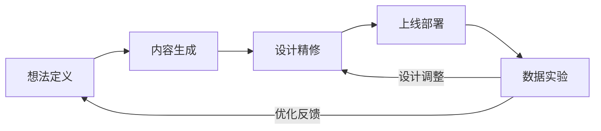

# 从想法到转化数据：AI 时代的着陆页构建系统

**一句话导读：** 一套从想法验证、设计精修到转化实验的完整着陆页工作流——解决的不是"怎么建页面"，而是"怎么让页面真正带来客户"。

---

**适合谁看：**

- 正在为 SaaS 产品获取早期客户而挣扎的独立开发者或小团队创始人
- 想用 AI 写代码但产出的页面总是"紫得发光、丑得统一"的人
- 知道该做着陆页和 A/B 测试，但一直停在"知道"层面从未跑过一轮实验的增长负责人
- 想把营销落地能力从"外包给设计公司"变成"自己能闭环"的一人公司运营者
- 对 AI 编程工具感兴趣、但不确定怎么用它做商业级产出而非 demo 的技术人

---

**读完你会获得什么：**

- 理解"想法 → 着陆页 → 转化数据"这条链路为什么必须打通，以及每一步的卡点在哪
- 掌握用参考图 + 设计系统约束 AI 输出质量的"可控设计"方法，告别 vibe coding 的随机丑
- 理解 Paper 这类设计中间层工具在 AI 编程工作流中的定位——不是替代 Figma，而是补上"代码和设计之间的迭代闭环"
- 能照着步骤搭出一套带埋点、带 A/B 实验的着陆页，并看到真实用户行为数据
- 理解"Agent 作为 CMS"这个判断背后的逻辑和实际操作方式
- 识别当前工具栈中的套利机会——大多数人还不知道这套工作流存在

---

## 01 背景：为什么这个问题现在值得讨论

三个变化同时发生了。

**第一，AI 编程让"建页面"的门槛接近零。** 任何人都能用 Claude Code 或 Cursor 几分钟生成一个着陆页。但门槛低不等于质量高。大量产出的页面长着同样的毛病：配色随意、布局松散、动画过度、像 demo 不像产品。这就是所谓"vibe coding"——凭感觉让 AI 生成，缺少设计约束和迭代闭环。

**第二，传统设计工具和代码之间仍然断裂。** 过去的流程是：设计师在 Figma 做静态稿 → 开发照着实现。现在很多人跳过设计直接在代码里改，但很快失控——改了不知道改了什么，想回退不知道回退到哪，设计一致性完全靠运气。

**第三，着陆页的真正价值不是"好看"，而是"能转化"。** 大部分人建完页面就停了。没有埋点，没有实验，不知道用户在哪流失，不知道换个标题会不会多几倍注册。建页面是手段，拿到转化数据并持续优化才是目的。

但大多数教程只教你前半段——怎么把页面搭出来。后半段——怎么让它真的带来客户——几乎没人讲。这篇文章补上这个缺口。

---

## 02 核心判断：视频真正想讲的不是工具操作，而是一套闭环系统

视频表面在演示几个工具的用法，实际在传递一个核心判断：

**"从想法到转化数据"必须是一条连续链路，而不是几个孤立的步骤。**

很多人的现状是：用 AI 工具生成了一个着陆页，觉得不好看就换个工具再生一个，然后发到社交媒体等人来——来了几个也不知道，走了多少更不知道。每一步都在做，但每一步之间是断开的。

视频展示的工作流试图让整件事变成闭环：

- 想法不是拍脑袋，而是有结构化的定义（目标客户、转化承诺、价值主张）
- 设计不是随机生成，而是有参考约束和迭代环节
- 页面不是建完就结束，而是接着装埋点、跑实验、拿数据
- 数据不是看看就走，而是反馈到下一轮优化

**单个环节做不好，整条链路的产出就会断崖式下跌。** 想法定义不清，设计再好也吸引不了对的人；设计粗糙，流量来了也转化不了；没有数据，你甚至不知道该优化哪个环节。

---

## 03 概念澄清：先把关键名词讲准确

### Idea Browser

- **它是什么：** 一个帮助创始人结构化定义商业想法的工具，近期支持通过 MCP 直接连接 Claude Code
- **它解决什么问题：** 从"我觉得这个想法不错"到"我知道目标客户是谁、转化承诺是什么、该用什么话术"的结构化推导
- **它不是什么：** 不是头脑风暴工具，不是灵感生成器。它的价值在于把模糊想法变成可执行的 offer 定义
- **关键区分：** 和 Notion/文档的区别——Idea Browser 的输出是结构化的、可被下游工具直接消费的文件，不是一堆自由文本

### Paper

- **它是什么：** 一个连接 Claude Code 的设计中间层工具，可以在设计稿和代码之间双向同步
- **它解决什么问题：** 弥补"直接在代码里改设计"的缺陷——你可以在可视界面中做设计迭代，选择方向后再同步到代码，而不是每次都在终端里盲改
- **它不是什么：** 不是 Figma 的替代品，不是给专业设计师用的设计工具。它是给"用 AI 写代码但需要设计控制力"的人用的
- **关键区分：** Figma 的双向 API 也在做类似的事，但 Paper 的交互体验和与 Claude Code 的集成度目前更顺滑

### Tailar

- **它是什么：** 一个提供预制 UI 组件和插图的库，可以直接截图丢给 Claude Code 作为设计参考
- **它解决什么问题：** 给 AI 提供具体的视觉参考，避免"凭空设计"导致的风格不统一
- **它不是什么：** 不是 Tailwind CSS，不是组件安装工具（虽然有些组件确实可以安装）。核心用法是作为视觉参考源
- **一个简单例子：** 你看到一个卡片布局很好看，截图丢给 Claude Code 说"用这个风格做内容区"，比说"做一个现代感的卡片"效果好十倍

### Vibe Coding

- **它是什么：** 指用 AI 工具凭感觉生成代码，缺少设计约束和系统思考的编码方式
- **它解决什么问题：** 它不解决问题，它本身就是问题
- **它不是什么：** 不是 AI 编程的必然结果。用 AI 写代码不等于 vibe coding——区别在于有没有约束
- **典型表现：** 产出"紫色着陆页"——配色随机、布局随意、动画夸张、看起来像 demo 不像产品

### Agent-as-CMS

- **它是什么：** 把 AI Agent 作为网站内容管理系统，通过 Agent 直接更新网站内容、运行测试、管理发布
- **它解决什么问题：** 传统 CMS（Webflow、Framer）对 Agent 和 MCP 的开放度不够，无法让 AI 自动化地执行"改标题→发实验→看数据"这类闭环操作
- **它不是什么：** 不是说人类不参与，而是人类设定方向和约束，Agent 执行重复性操作
- **实际意义：** 把网站从"静态文档"变成"可编程的增长实验平台"

---

## 04 整体框架：从想法到转化数据的五阶段闭环

**五阶段的逻辑：**

1. **想法定义**（Idea Browser）——把模糊灵感变成结构化的 offer：谁、解决什么、为什么选你
2. **内容生成**（Claude Code + Skill）——基于 offer 定义，生成着陆页的文案和初始结构
3. **设计精修**（Paper + 参考图 + Tailar）——在可视界面中迭代设计方向，约束 AI 的视觉输出
4. **上线部署**（Claude Code 推送）——把精修后的设计同步到代码并部署
5. **数据实验**（PostHog + A/B Test）——装埋点、跑实验、看数据，反馈到下一轮

**关键理解：这不是线性流程，是闭环。** 第五步的数据会告诉你"标题不够吸引"或"用户在第二步流失"，然后回到第一阶段重新定义或回到第三阶段调整设计。

大多数人只做了前三步就停了。没有第五步，前三步的产出只是一个"看起来还行"的页面，不是一个"被数据验证过"的转化工具。

---

## 05 关键机制：每个环节到底怎么运行

### 机制一：结构化想法定义

- **输入：** 模糊的商业想法（如"AI 帮销售团队练习谈判"）
- **处理：** Idea Browser 通过提问和技能（如 Lead Magnet Legend Skill）引导你定义：目标客户、转化承诺、价值主张、话术
- **输出：** 一个结构化的 offer 定义文件，包含 who/what/why/what-to-say
- **为什么这样设计：** 没有结构化定义，着陆页的文案就是"我觉得应该这么写"——写出来可能连目标客户都不对
- **代价：** 前期多花 30-60 分钟做定义，但省下后面反复改文案的时间
- **适合：** 早期验证阶段，尤其是你还不确定该对谁说什么的时候

### 机制二：参考图驱动的可控设计

- **输入：** 你喜欢的现有网站截图、Tailar 的组件截图、已有的设计风格指南
- **处理：** 把参考图丢给 Claude Code，让它提取设计要素（配色、字体、间距、动画风格），生成可复用的设计系统；后续每次新增组件都引用这个系统
- **输出：** 风格一致的页面组件和整体设计
- **为什么这样设计：** AI 不擅长"从零设计"，但擅长"基于约束做变体"。给参考图就是给约束
- **代价：** 需要你有基本的审美判断——知道什么好看、什么不好看。AI 不能替你选品味
- **核心技巧：** 用"subtle"（微妙）这个词约束 AI 的设计行为。"改进设计"太宽泛，AI 会乱来；"做微妙的设计调整，保持布局和主题一致"效果好得多

### 机制三：Paper 作为设计迭代中间层

- **输入：** Claude Code 生成的初始页面
- **处理：** 在 Paper 中可视地查看、对比不同设计方案，手动微调后同步回代码
- **输出：** 经过人工判断和选择的设计方向
- **为什么这样设计：** 在终端里改设计的问题是"看不见全局、记不住改了什么"。Paper 补上了"看见→选择→同步"这个环节
- **代价：** 多一个工具要熟悉，但省下在代码里反复盲改的时间
- **适合：** 已经用 Claude Code 建站、但觉得设计不可控的人

### 机制四：无代码 A/B 实验闭环

- **输入：** 已上线的着陆页 + 埋点数据 + 一个假设（如"换标题能提高注册率"）
- **处理：** 通过 PostHog 创建实验 → 设定对照组和变体 → 实验脚本动态替换页面内容（不需要重新部署代码）→ 收集数据 → 生成报告
- **输出：** 有统计显著性的实验结果 + 转化率数据
- **为什么这样设计：** 过去做 A/B 测试要找开发改代码、发版、等上线。现在实验脚本直接在前端动态替换内容，从提出假设到看到数据可以当天完成
- **代价：** 需要 PostHog 等工具的基础配置，需要足够流量才能得出统计显著结论
- **适合：** 已经有流量但从未系统优化转化率的站点

---

## 06 方法拆解：如果自己要做，应该怎么落地

### 第一步：定义你的 offer

**目标：** 把"我想做 X"变成"我为 Y 人群提供 Z 转化，因为 W"。

**具体动作：**
1. 写下你的目标客户是谁（越具体越好，"SaaS 公司的销售总监"而不是"企业"）
2. 写下你提供的转化承诺（"5 个毁掉软件交易的异议及应对方法"而不是"销售技巧"）
3. 写下你的价值主张（为什么选你不选竞品）
4. 如果用 Idea Browser，选择 Lead Magnet Legend Skill 自动推导

**判断标准：** 一个完全不了解你产品的人，读完 offer 定义后能准确说出"这是给谁用的、能帮到什么"。

**常见坑：** offer 定义太宽泛。"帮企业做 AI"不是 offer，"帮 SaaS 销售团队通过 AI 模拟训练将成交率提升 30%"才是。

**产出物：** 一个 offer 定义文件（包含目标客户、转化承诺、价值主张、话术要点）。

---

### 第二步：生成着陆页初始版本

**目标：** 基于 offer 定义，生成一个可工作的着陆页骨架。

**具体动作：**
1. 在 Claude Code 中连接 Idea Browser MCP，拉取项目上下文
2. 使用着陆页相关 Skill（如 Landing Page Architect）生成初始页面
3. 确保页面包含：标题、副标题、价值主张、CTA（行动号召）、社会证明

**判断标准：** 页面结构完整、文案和 offer 定义一致、能在浏览器中正常显示。

**常见坑：** 不要在这一步追求设计完美。这一步要的是结构对、文案对，视觉粗糙没关系——下一步会修。

**产出物：** 一个功能完整但设计粗糙的着陆页。

---

### 第三步：用参考图约束设计方向

**目标：** 把"看起来像 demo"的页面变成"看起来像产品"的页面。

**具体动作：**
1. 收集 3-5 个你觉得设计好的网站截图（不用同一行业，但要风格一致）
2. 在 Claude Code 中输入：提取这些页面的设计要素，生成风格指南
3. 后续每次生成新组件时，在 prompt 中加入"参考设计风格指南"
4. 如果需要更具体的组件参考，去 Tailar 找到类似的组件，截图丢给 Claude Code

**判断标准：** 新增的组件和已有页面在配色、间距、字体、动画风格上保持一致，看不出"拼接感"。

**常见坑：** 最大的坑是 prompt 太宽泛。"改进设计"会让 AI 到处乱改；"做微妙调整，保持一致性"才能得到可控结果。关键词：**subtle**。

**产出物：** 一套可复用的设计风格指南 + 风格一致的着陆页。

---

### 第四步：通过 Paper 做设计迭代

**目标：** 在可视界面中选择和精修设计方向，而不是在终端里盲改。

**具体动作：**
1. 在 Paper 中打开 Claude Code 生成的页面
2. 查看各区域的设计效果，标记不满意的部分
3. 在 Paper 中尝试不同布局和内容安排
4. 确定方向后，同步回代码

**判断标准：** 你能清晰说出"为什么选这个布局而不是另一个"，而不是"感觉这个好一点"。

**常见坑：** 不要在 Paper 中追求像素级完美——它的价值是帮你快速对比方向，精修还是在代码里做。

**产出物：** 经过人工筛选的设计方向 + 同步后的代码。

---

### 第五步：安装埋点和分析工具

**目标：** 知道谁来了、点了什么、在哪流失了。

**具体动作：**
1. 在 PostHog 创建项目，获取 API Key
2. 在 Claude Code 中添加 PostHog 追踪脚本
3. 确保追踪关键事件：页面访问、CTA 点击、表单提交
4. 配置热力图和滚动深度追踪

**判断标准：** 在 PostHog 后台能看到实时访问数据和事件流。

**常见坑：** 只看 PV 不看行为路径。"有多少人来了"不如"来了之后做了什么"重要。

**产出物：** 带完整埋点的着陆页 + PostHog 后台中的实时数据。

---

### 第六步：运行第一个 A/B 实验

**目标：** 用数据验证"改标题能提高转化"这个假设。

**具体动作：**
1. 在 PostHog 中创建 A/B 实验
2. 对照组：当前标题；变体：新标题
3. 设定实验目标和流量分配比例
4. 实验脚本会动态替换页面内容，无需重新部署代码
5. 等待足够流量后查看结果

**判断标准：** 实验在 PostHog 后台中状态为"运行中"，能在页面上通过刷新切换看到不同版本。

**常见坑：** 流量不够就下结论。低流量站点的 A/B 实验可能需要跑几周才有统计显著性。不要第二天就下判断。

**产出物：** 一个正在运行的 A/B 实验 + 后续的转化率数据。

---

## 07 案例讲解：一个 AI 销售训练产品的着陆页是怎么从想法到实验的

**场景背景：** 有人想做一个 AI 销售训练伙伴——帮 SaaS 销售代表通过实时模拟练习来提高成交率。

**遇到的问题：** 想法有了，但不知道该怎么表达、怎么吸引目标客户、怎么验证有人愿意用。

**按框架处理：**

**第一步：定义 offer。** 不是"AI 帮销售"，而是"5 个毁掉软件交易的异议——以及你的销售代表为什么没准备好应对"。这是一个具体的、有痛感的 lead magnet（引流内容），目标客户是 SaaS 销售总监，转化承诺是"下载这份 PDF 指南"。

**第二步：生成初始页面。** 用 Claude Code + Landing Page Architect Skill，基于 offer 定义生成着陆页骨架。页面包含标题、异议列表、下载表单。此时页面功能完整但视觉粗糙。

**第三步：约束设计。** 收集几个设计感好的 SaaS 着陆页截图，让 Claude Code 提取设计要素生成风格指南。去 Tailar 找到合适的卡片组件和插图风格，截图作为参考。每次 prompt 中加入"参考设计风格指南"和"subtle animation"。

**第四步：Paper 迭代。** 在 Paper 中查看页面效果，发现内容区布局不够清晰。尝试分栏布局，确定方向后同步回代码。又发现动画太重，在 prompt 中强调"subtle"重新生成。

**第五步：装埋点。** 添加 PostHog 追踪，配置表单提交事件和滚动深度追踪。现在能看到：用户平均滚动到 40% 位置，25% 跳出率。

**第六步：跑实验。** 原标题是"AI 销售训练伙伴"——这太抽象。创建 A/B 实验，变体标题改为"每一笔丢单，都始于一个你的代表没准备好的异议"。实验脚本动态替换标题，无需重新部署。几周后看数据，变体标题的注册转化率更高——因为直击痛点，而非描述功能。

**最终结果：** 从一个模糊想法，到上线一个设计精良的着陆页，再到运行转化率实验并获得数据，整个过程在一天内完成。

**说明了什么：** 传统流程（写 PRD → 找设计 → 找开发 → 上线 → 找分析师看数据）需要几周。新流程的核心优势不是"更快"，而是"让验证想法的成本低到你可以同时验证十个想法"。

---

## 08 常见误区

**误区一：AI 写代码 = 不需要设计能力**

- **错误理解：** 有了 AI，我不用懂设计也能做出好看的页面
- **为什么错：** AI 是执行者，不是决策者。它能根据指令生成设计，但选什么风格、什么布局、什么动画力度——这些判断必须由人来做。没有品味的指令产生没有品味的页面
- **正确理解：** AI 降低了设计执行门槛，但提高了设计判断的重要性。你不需要会画，但必须会选
- **应该怎么做：** 建立自己的参考图库，训练自己的审美判断，在 prompt 中用具体的、有约束力的词（如"subtle"、"consistent"、"参考这张截图"）

**误区二：Vibe coding 是 AI 编程的必然结果**

- **错误理解：** 用 AI 生成的代码天然就是 vibe coding，质量本来就那样
- **为什么错：** Vibe coding 是方法问题，不是工具问题。缺少约束、缺少迭代、缺少参考——这才是 vibe coding 的成因。同样的工具，加上设计系统约束和迭代闭环，产出可以完全不同
- **正确理解：** AI 编程的质量上限取决于你给的约束质量。"随便做一个着陆页"和"参考这个设计风格指南，做一个风格一致的着陆页"，产出天差地别
- **应该怎么做：** 每次用 AI 生成设计相关内容时，至少提供一个参考图或明确的风格约束

**误区三：着陆页建完就完事了**

- **错误理解：** 页面上线了，任务完成了
- **为什么错：** 页面上线只是开始。没有埋点，你不知道谁来了；没有实验，你不知道怎么提高转化。一个没有数据的着陆页和一张印了却没发出去的名片没有区别
- **正确理解：** 着陆页是增长实验的基础设施，不是最终产物。它的价值在于让你能跑实验、拿数据、做优化
- **应该怎么做：** 页面上线后立即装埋点，一周内跑第一个 A/B 实验

**误区四：A/B 测试只有大公司才需要**

- **错误理解：** 我流量太小，A/B 测试没意义
- **为什么错：** 流量小只是意味着实验要跑更久，不意味着不该做。更重要的是，A/B 测试的核心价值不只是"得出统计显著结论"，还在于强迫你明确假设、设计变体、观察用户行为——这个思考过程本身就有价值
- **正确理解：** 低流量站点的 A/B 测试是长期投资，不是即时回报。同时，热力图和事件追踪在低流量时就已经有用
- **应该怎么做：** 先装埋点和热力图，积累一周数据后再启动 A/B 实验

**误区五：工具越多越好**

- **错误理解：** 这篇文章提了 Idea Browser、Paper、Claude Code、PostHog、Tailar——我都得上
- **为什么错：** 工具是手段，闭环才是目的。如果你只理解工具不理解流程，每个工具都会变成新的学习成本而不会产生组合效应
- **正确理解：** 最小可行工具栈是：一个能写代码的 AI（Claude Code / Cursor）+ 一个分析工具（PostHog / Plausible）。其他工具按需加入，不是上来就全装
- **应该怎么做：** 先用最少的工具跑通一次完整闭环，再根据实际痛点决定是否引入新工具

**误区六：一个人做不了这些**

- **错误理解：** 这套流程听起来需要设计、开发、增长三个角色的能力
- **为什么错：** 这正是 AI 工具改变的地方。设计用参考图 + AI 执行，开发用 Claude Code，增长用 PostHog 自动化。一个人可以补齐之前需要团队的能力差——前提是每个环节你都有判断力
- **正确理解：** 一个人做不代表每个环节都做到专家级。关键是：在每个环节都能做出"及格线以上"的判断，然后用 AI 把判断变成产出
- **应该怎么做：** 承认自己的短板，用参考图补设计判断，用结构化 prompt 补代码细节，用数据分析工具补增长经验

**误区七：这套流程只适用于 SaaS 着陆页**

- **错误理解：** 我是做内容/电商/咨询的，这套东西和我没关系
- **为什么错：** 核心逻辑是通用的：定义受众和 offer → 生成内容 → 约束设计 → 验证转化。无论你卖的是软件、课程、咨询服务还是实物商品，这个闭环都成立
- **正确理解：** 工具可以换，流程不能省。电商可能用 Shopify 替代 Claude Code 建站，但"定义 offer → 约束设计 → 跑实验"这三步不能少
- **应该怎么做：** 理解框架后，替换具体工具适配你的场景

---

## 09 实战清单

### 立即能做

- [ ] 整理 3-5 个你觉得设计好的网站，截图保存到参考图库
- [ ] 用一句话写下你当前产品的 offer：谁、解决什么、为什么选你。如果写不出来，说明定义不清
- [ ] 检查你的着陆页是否安装了事件追踪。如果没有，今天装上 PostHog 或同类工具
- [ ] 把你着陆页上最关键的一个 CTA 文案改一版，记下原版和新版，准备跑实验

### 一周内能做

- [ ] 用 AI 工具基于你的 offer 定义重新生成着陆页文案，和现有版本对比
- [ ] 建立一个简易设计风格指南：主色、辅色、字体、间距、动画风格。写成一个 markdown 文件，每次生成新组件时引用
- [ ] 在分析工具中配置一个核心转化漏斗：访问 → 滚动到 CTA → 点击 CTA → 提交表单
- [ ] 启动第一个 A/B 实验，哪怕只测试一个标题变体

### 长期要沉淀

- [ ] 建立可复用的组件库：每次做出好的组件，保存参考截图和生成 prompt，下次直接复用
- [ ] 形成"offer 定义 → 页面生成 → 实验验证 → 数据反馈"的周循环习惯——每周至少跑一个实验
- [ ] 记录每次实验的假设、变体、结果和学到的判断。三个月后你会拥有一份远比任何课程有价值的手册
- [ ] 探索 Agent 自动化：把"拉数据 → 生成报告 → 建议优化方向"变成定时任务，让 Agent 做重复劳动

---

## 10 总结

这篇文章拆解的不是几个工具的操作方法，而是一套从想法到转化数据的完整工作流。核心判断是：**建页面不是终点，拿到转化数据并持续优化才是。** 大多数人停在"页面上线"这一步，但真正的价值在后面——你需要知道谁来了、点了什么、在哪流失，然后用数据驱动下一轮改进。

这套工作流之所以现在可行，是因为 AI 编程工具降低了执行门槛，设计中间层工具（Paper）补上了迭代闭环，分析工具（PostHog）让实验部署变得无需开发介入。三者的组合让一个人能完成过去需要设计、开发、增长三个角色协作的闭环。

但工具降低的只是执行门槛，不是判断门槛。你仍然需要知道什么样的设计是好的（审美判断），什么样的文案能转化（offer 定义），什么样的实验值得跑（假设质量）。**AI 放大的是你的判断力，不是替代它。**

最后一个判断：当前知道这套工作流的人极少。就像 2010 年代初的 Facebook 广告——流量便宜、竞争稀疏、套利空间巨大。这个窗口不会永远敞开。越早跑通闭环、越早积累数据，你的先发优势就越明显。不是因为工具会变贵，而是因为知道怎么做的人会越来越多。
