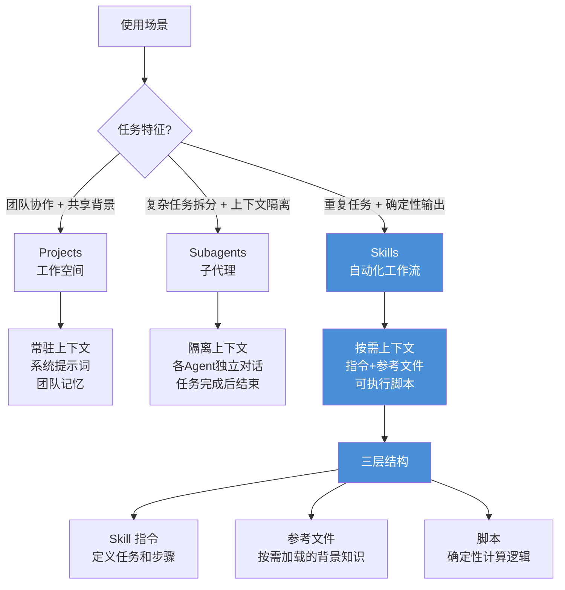
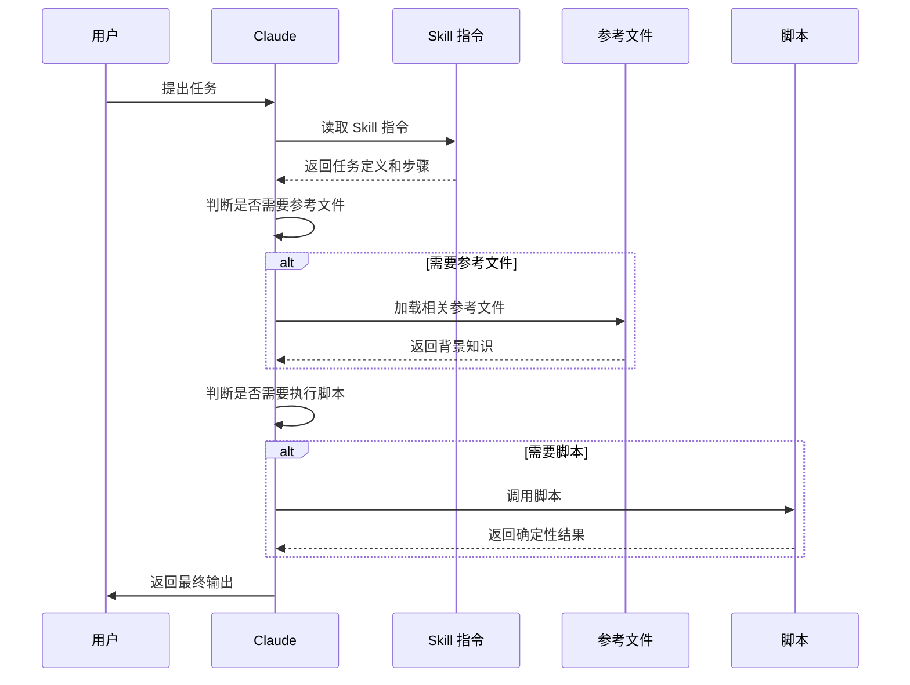

# Claude Skills 实操指南：从「AI 不听话」到「AI 照你规矩办事」

**一句话导读：** Claude Skills 用结构化指令 + 按需加载的参考文档 + 可执行脚本，解决了 LLM 输出不确定这个老问题——它不是更高级的提示词，而是一套让 AI 按你设定的流程跑代码的机制。

---

## 适合谁看

- 用 Claude 处理营销数据，但总觉得「输出不是我想要的」的人
- 带 AI 工作流的团队负责人，想搞清楚 Projects / Subagents / Skills 到底有什么区别
- 每周重复做报表、分析、文档生成，想用 AI 自动化但不知道怎么搭的人
- 已经在用 Claude Projects，但发现上下文越塞越多、效果反而越差的人
- 想判断 Skills 是否值得投入学习成本的产品或技术决策者

---

## 读完你会获得什么

- 能清楚区分 Claude Projects、Subagents、Skills 三者的定位和适用场景
- 能理解为什么「给 AI 更多上下文」不等于「AI 输出更好」
- 能掌握 Skills 的三层结构（指令 + 参考文件 + 脚本）以及每一层的作用
- 能照着步骤创建自己的第一个 Skill
- 能判断哪些工作任务适合用 Skills 解决，哪些不适合
- 能避开「靠提示词硬调」的误区，转而用脚本实现确定性输出

---

## 01 背景：为什么这个问题现在值得讨论

一个普遍现象：企业买了 AI 工具，团队也在用，但用着用着就放弃了。

Ramp 的一份报告追踪了企业 AI 工具的订阅数据，发现一个趋势——AI 工具的采用率在下降。成本在降，能力在涨，但用户留存出了问题。原因不是 AI 不行，而是**人不知道怎么让 AI 行**。

具体表现：你把一份营销数据扔进 Claude，让它分析，它每次给你的东西都不一样。今天说这个渠道好，明天说那个渠道好。你调了提示词，加了上下文，连了 MCP 工具——输出还是飘。

这不是个别现象。视频主讲人 Ameer 做了大量客户咨询，他反复听到同一个反馈：**「AI 输出不是我想要的。」**

问题出在哪？两层：

1. 提示词写得不够精确
2. 更关键的一层——你让 LLM 自己决定怎么分析数据，它本身就是非确定性的。同样的输入，它可能走不同的推理路径

Skills 就是针对第二层问题设计的。它不只是让你写更好的提示词，而是让你**把分析逻辑写成代码，让 AI 跑你的代码**。

---

## 02 核心判断：Skills 的本质不是「更高级的提示词」，而是「给 AI 装上你写的程序」

视频表面在讲 Claude Skills 的功能和使用方法。但真正想讲的是一件事：

**AI 输出不确定，根源不在提示词，而在执行方式。** 当你让 LLM 自由发挥来处理数据，结果天然不稳定。Skills 的解决方案是：你写脚本，AI 跑脚本。脚本的行为是确定的——乘法就是乘法，除法就是除法，不会因为「模型心情不同」而算出不同的结果。

这个判断有力度，但也要看到边界：Skills 不是万能的。它适合有明确输入输出、有固定分析逻辑的任务。对于需要创造性推理的任务，脚本化的意义有限。

---

## 03 概念澄清：先把关键名词讲准确

### Claude Projects

- **是什么：** Claude 内的工作空间，包含一个系统提示词、上下文文件、记忆和工具连接
- **解决什么问题：** 团队协作时的可复用配置——不用每次重新交代背景
- **不是什么：** 不是自动化流程，不是脚本执行器
- **和相关概念的区别：** Projects 的上下文是**常驻加载**的——不管你问什么问题，所有上下文文件都会被塞进对话窗口。Skills 只在相关时才加载
- **例子：** 营销团队建一个 Project，上传品牌指南和术语表，每次开聊时这些文件都在。但问题是：数据变了，你要手动更新文件；上下文太多，模型反而容易混乱

### Subagents（子代理）

- **是什么：** Claude Code 中的多代理机制，可以在一个对话中启动多个专门化 Agent，各自处理子任务
- **解决什么问题：** 复杂多步骤任务的拆分——前端归前端 Agent，后端归后端 Agent
- **不是什么：** 不是可共享的工作流模板，不是跨项目复用的
- **和相关概念的区别：** Subagents 的上下文隔离在各自对话窗口内，不共享。Skills 是全局可用的，可以跨项目、跨个人使用
- **例子：** 你在 Claude Code 里说「创建一个前端 Agent 用这套规则，再创建一个后端 Agent」，两个 Agent 各干各的，互不干扰

### Claude Skills

- **是什么：** 可复用的自动化工作流，由三部分组成：结构化指令（Markdown 文件）、参考文件（按需加载）、可执行脚本（Python 等）
- **解决什么问题：** 把重复性任务变成确定性流程——你定义规则和计算逻辑，AI 按规则执行
- **不是什么：** 不是更长的提示词，不是 Project 的加强版，不是万能自动化
- **和相关概念的区别：** 关键差异在**脚本执行**。Project 里你让 LLM 自己决定怎么分析数据；Skill 里你写好了脚本，LLM 调用脚本来分析。前者不确定，后者确定
- **例子：** 你要算 CPC（每次点击成本），在 Project 里靠提示词让 LLM 自己算，它可能每次算法不同；在 Skill 里你写了 `cpc = spend / clicks` 的脚本，每次结果一样

### Context Window（上下文窗口）

- **是什么：** LLM 在一次对话中能「看到」的所有信息，包括系统提示词、历史消息、上传文件、工具返回的数据
- **为什么重要：** 上下文太少，模型缺乏信息，容易编造；上下文太多，模型被淹没，也容易编造。需要的是**适量的、相关的**上下文
- **视频引用的论文：** 关于 Context ROI 的研究，探讨了系统提示词从极详细到极简对性能的影响

---

## 04 整体框架：Claude 三层能力如何分工



**文字解释：**

选择哪种能力，取决于你的任务特征：

- **Projects** 适合团队协作场景——大家共享同一套背景知识，每次对话都在这个上下文里进行。缺点是上下文常驻，文件变了要手动更新
- **Subagents** 适合复杂工程任务的拆分——每个 Agent 只管自己那块，上下文隔离避免干扰。但它是临时性的，对话结束就没了
- **Skills** 适合重复性、需要确定性输出的任务——它按需加载上下文（不浪费 token），而且能跑脚本（输出确定）。这是三者中唯一实现了「你写逻辑，AI 执行逻辑」的机制

三者不是互相替代的关系。你可以在一个 Project 里使用 Skills，也可以让 Subagents 调用 Skills。Skills 是叠加在 Project 之上的增强层。

---

## 05 关键机制：Skills 到底是怎么运行的

### Skill 的三层结构

**第一层：Skill 指令（Markdown 文件）**

- **输入：** 你用自然语言描述这个 Skill 做什么、遵循什么步骤、输出什么格式
- **处理：** Claude 读取指令，理解任务目标和约束
- **输出：** 按指令执行的对话行为
- **为什么这样设计：** 让非技术人员也能定义工作流，不需要写代码
- **代价：** 如果只靠自然语言指令，输出仍然有不确定性
- **适合场景：** 文档生成、内容改写、格式化输出等对精确度要求不极端的任务

**第二层：参考文件（Reference Files）**

- **输入：** 你上传的补充文档——品牌指南、术语表、历史范文等
- **处理：** Claude 判断当前任务是否需要参考这些文件，需要时才加载
- **输出：** 基于参考内容执行任务，例如按照品牌指南的语气写作
- **为什么这样设计：** 与 Projects 的常驻上下文不同，参考文件按需加载。减少无关上下文对模型的干扰
- **代价：** 模型可能判断失误，该加载时没加载。需要你在 Skill 指令里明确说明何时引用
- **适合场景：** 有明确规范文档的任务——品牌写作、合规检查、术语校对

**第三层：可执行脚本（Scripts）**

- **输入：** 你编写的 Python 脚本，定义了数据处理的具体计算逻辑
- **处理：** Claude 调用脚本，脚本在沙箱中执行，返回结果
- **输出：** 确定性的计算结果——同样的输入永远得到同样的输出
- **为什么这样设计：** 这是 Skills 和 Projects 的核心差异。在 Project 里你说「分析这份数据」，LLM 自己决定怎么分析；在 Skill 里你写好了脚本，LLM 调用脚本执行。前者是非确定性的，后者是确定性的
- **代价：** 你需要写代码。脚本本身的质量决定了输出质量。脚本报错时需要调试
- **适合场景：** 数据分析、指标计算、报表生成——任何需要精确计算的任务

### 按需加载机制



关键点：**上下文不是一开始就全部塞进去的，而是根据任务判断动态加载。** 这和 Project 的「全量加载」模式形成对比。

---

## 06 方法拆解：创建自己的 Skill，应该怎么落地

### 步骤一：判断任务是否适合做 Skill

**目标：** 避免把不该自动化的任务硬塞进 Skills

**具体动作：** 回答三个问题——
1. 这个任务是否重复执行？（每周/每月都要做？）
2. 这个任务是否有明确的输入和期望输出？
3. 这个任务的执行逻辑是否可以用规则或代码描述？

**判断标准：** 三个问题都答「是」，适合做 Skill。如果任务需要大量创造性判断，或者每次执行逻辑都不同，不适合。

**常见坑：** 把「写一篇创意文案」做成 Skill——这类任务的输出质量取决于上下文丰富度和模型的创造性推理，脚本化帮助有限。

**产出物：** 一个明确的「做/不做」决定

### 步骤二：用 Skill Creator 创建 Skill 骨架

**目标：** 生成 Skill 的 Markdown 指令文件

**具体动作：**
1. 在 Claude 中打开 Settings → Capabilities → 启用 Skill Creator
2. 在对话中描述你想要的 Skill：「创建一个 Skill，[具体任务描述]，输入是 [X]，输出是 [Y]，遵循以下步骤：[步骤列表]」
3. Claude 会生成 Skill 的 Markdown 文件，包含任务定义、步骤、输出格式

**判断标准：** 生成的 Markdown 文件是否清晰定义了——任务目标、输入格式、执行步骤、输出格式

**常见坑：** 描述太模糊。例如「分析营销数据」——分析什么数据？算什么指标？输出什么格式？要像给新人写工作手册一样具体。

**产出物：** 一个可用的 Skill Markdown 文件

### 步骤三：添加参考文件

**目标：** 给 Skill 提供按需加载的背景知识

**具体动作：**
1. 整理你的业务规范文档——术语定义、品牌指南、历史范文等
2. 在 Skill 设置中上传这些文件作为 References
3. 在 Skill 指令中说明何时应该引用这些文件

**判断标准：** 参考文件是否解决了「AI 不知道我们公司的特定规范」这个问题

**常见坑：** 把所有文件都当参考文件上传，没有筛选。参考文件应该只包含**规范性和定义性**的内容，不要塞原始数据。

**产出物：** Skill + 参考文件的组合

### 步骤四：编写执行脚本

**目标：** 把关键计算逻辑从 LLM 推理中拿出来，变成确定性代码

**具体动作：**
1. 列出 Skill 中需要精确计算的部分——哪些指标、什么公式、什么数据源
2. 用 Python 写脚本，定义输入格式、计算逻辑、输出格式
3. 在 Skill 指令中指定何时调用这个脚本
4. 测试：用真实数据跑一次，验证输出是否正确

**判断标准：** 脚本是否能独立运行？同样的输入是否产生相同的输出？输出是否符合预期？

**常见坑：** 试图把所有逻辑都写进脚本。脚本只处理**需要确定性**的部分（计算、格式化、数据处理），创意性输出仍由 LLM 完成。

**产出物：** 完整的 Skill（指令 + 参考文件 + 脚本）

### 步骤五：在实际工作中验证和迭代

**目标：** 确认 Skill 在真实场景下可用

**具体动作：**
1. 用真实数据运行 Skill
2. 对比输出和人工处理的结果
3. 根据差异调整指令、参考文件或脚本
4. 重复直到输出稳定且符合预期

**判断标准：** 连续三次运行，输出一致且可用

**常见坑：** 一次成功就以为完成了。LLM 的非脚本部分仍然可能波动，需要多次验证。

**产出物：** 一个经过验证、可投入日常使用的 Skill

---

## 07 案例讲解：从营销数据中提取确定性洞察

### 场景背景

一个 SaaS 公司的营销团队，每周需要分析广告投放数据。数据来源包括 Meta Ads 和 Google Ads，指标包括花费、收入、CPC、转化率、各渠道对比。

### 遇到的问题

过去他们用 Claude Project：上传 CSV 文件，在系统提示词里写「分析这份数据，给出营销洞察」。

结果：每次输出不一样。有时算对了 CPC，有时算错了。有时说 Meta 表现好，有时说 Google 好。营销团队对 AI 的信任度持续下降。

### 按框架如何处理

**诊断问题：** 核心问题不是提示词写得不好，而是让 LLM 自由决定如何分析数据。LLM 每次可能选择不同的分析方法——这次用加权平均，下次用简单平均。这不是提示词能解决的。

**选择方案：** 用 Skill 替代 Project 处理数据分析任务。

### 每步怎么做

**第一步：创建 Skill 指令**

定义 Skill 做什么：读取营销数据 CSV，按指定维度分析，输出结构化报告。明确步骤：1）读取文件，2）按渠道分组，3）调用脚本计算指标，4）生成洞察摘要。

**第二步：添加参考文件**

上传 `metrics.md`——包含所有指标的精确定义和典型范围。例如：
- CPC = 总花费 / 点击次数，典型范围 $0.50-$5.00
- 转化率 = 转化次数 / 访问次数，典型范围 1%-5%

这样 LLM 在生成洞察时能参考「什么是正常范围」，而不是凭感觉判断。

**第三步：编写脚本**

写 Python 脚本，精确计算每个指标。例如：

```python
cpc = total_spend / total_clicks
conversion_rate = conversions / sessions * 100
roi = (revenue - spend) / spend * 100
```

按渠道分组计算，输出结构化数据。脚本返回的是确定性的数字，不是 LLM 的推测。

**第四步：运行和验证**

上传同一份 CSV，连续运行三次。输出完全一致：总花费 $400K，收入 $854K，利润率 113%，各渠道对比数据稳定。

### 最终结果

- 每周分析时间从 2 小时降到 10 分钟
- 输出一致性从「每次不同」到「完全一致」
- 营销团队重新开始信任 AI 输出

### 说明了什么

**当你需要确定性输出时，脚本 > 提示词。** 这不是「提示词写得不够好」的问题，而是 LLM 本身的非确定性决定了——你无法通过更好的自然语言描述来获得确定性的计算结果。你必须写代码。

---

## 08 常见误区

### 误区一：「给 AI 更多上下文，输出就更好」

- **错误理解：** 把所有文件都塞进 Project，上下文越多模型越聪明
- **为什么错：** 上下文过多会导致模型被无关信息干扰，反而增加幻觉风险。研究表明，**适量的、相关的**上下文才最优——不是越多越好
- **正确理解：** 上下文的质量比数量重要。Skills 的按需加载机制就是为了解决这个问题
- **应该怎么做：** 只在参考文件中放规范性和定义性内容，原始数据让脚本处理

### 误区二：「Skills 就是更长的提示词」

- **错误理解：** Skills 就是把提示词写得更详细、更结构化
- **为什么错：** 提示词无论写多长，LLM 的推理仍然是非确定性的。Skills 的核心差异是**脚本执行**——你写代码，AI 跑代码，结果是确定的
- **正确理解：** Skills = 结构化指令 + 按需参考 + 可执行脚本。三层合一，缺了脚本层就退回了「高级提示词」
- **应该怎么做：** 任何涉及计算的任务，必须写脚本，不要指望靠提示词实现确定性

### 误区三：「Skills 能替代所有 AI 工作流」

- **错误理解：** 有了 Skills，不需要 Projects 和 Subagents 了
- **为什么错：** 三者解决不同问题。Projects 适合团队共享背景知识，Subagents 适合复杂任务拆分，Skills 适合重复性确定性任务。它们是叠加关系，不是替代关系
- **正确理解：** 你可以在 Project 里使用 Skill，也可以让 Subagent 调用 Skill
- **应该怎么做：** 先明确任务特征，再选工具，而不是一刀切

### 误区四：「AI 输出不对，一定是提示词的问题」

- **错误理解：** 输出不满意，继续调提示词就能解决
- **为什么错：** 视频中 Ameer 反复强调，很多客户调了提示词、设了规则、连了工具，输出还是不对。问题不在提示词，而在执行方式——你让 LLM 自由发挥，它就是不稳定
- **正确理解：** 输出不对有两层原因——提示词不够精确（可调），或者执行方式本身不稳定（需要脚本化）
- **应该怎么做：** 先判断问题在哪一层。如果是计算类问题，直接写脚本；如果是推理类问题，优化提示词和参考文件

### 误区五：「Skills 设置好就不用管了」

- **错误理解：** 一次创建，永久使用
- **为什么错：** 参考文件需要随业务变化更新（术语变了、品牌指南改了、指标定义调了）。脚本需要随数据结构变化调整（新的数据源、新的字段）
- **正确理解：** Skills 的维护成本低于手动操作，但不是零成本
- **应该怎么做：** 把 Skill 维护纳入工作流——数据结构变化时更新脚本，业务规范变化时更新参考文件

### 误区六：「把 AI 当作同事，就意味着给它所有信息」

- **错误理解：** 给 AI 的信息越多，它理解得越好，就像给新同事做全面的入职培训
- **为什么错：** 人可以渐进消化信息，LLM 每次对话都是一次性处理所有上下文。信息过多反而降低输出质量
- **正确理解：** 像带新人一样给 AI 分步骤、按需提供信息——它需要什么就给什么，不要一股脑全塞
- **应该怎么做：** 用 Skills 的按需加载机制实现「渐进式信息提供」

---

## 09 实战清单：读完后可以马上照着做

### 立即能做

1. **打开 Claude → Settings → Capabilities**，查看当前可用的内置 Skills（Artifact Builder、MCP Builder、Skill Creator），熟悉界面
2. **列出你每周重复做的 3 个任务**，判断哪些有明确的输入输出和可描述的执行逻辑——这些就是 Skill 候选
3. **用 Skill Creator 创建你的第一个 Skill**：从最简单的开始，例如「把一段文字按指定格式整理」
4. **找一个你现有的 Claude Project**，对比它和 Skill 的区别——上下文加载方式、是否有脚本支持、输出是否稳定

### 一周内能做

5. **为你的核心业务整理一份术语/指标定义文档**（类似视频中的 `metrics.md`），作为未来 Skill 的参考文件
6. **挑一个数据分析任务**，写一个 Python 脚本来替代 LLM 自由计算。对比脚本输出和之前 LLM 自由输出的准确性差异
7. **创建一个包含脚本的数据分析 Skill**，用真实数据验证三次，确认输出一致性
8. **把你最常用的 Claude Project 中的重复性任务**迁移到 Skill 中，保留 Project 用于非重复性的探索性对话

### 长期要沉淀

9. **建立团队的 Skill 库**——把经过验证的 Skills 按职能分类（营销、产品、运营），让团队成员可以复用
10. **定期审查参考文件的时效性**——设定每月检查点，确认术语定义、品牌指南等没有过时
11. **关注 Skills 生态发展**——Claude 已推出 Plugins（Skills + MCP + 上下文的组合包），未来可能出现 Skill 市场。提前积累 Skill 构建经验，为复用和分享做准备
12. **建立「任务→工具选择」的决策习惯**：每次接到新任务，先判断用 Project、Subagent 还是 Skill，而不是默认用 Chat

---

## 10 总结

Claude 的三层能力——Projects、Subagents、Skills——对应三种不同的工作需求：共享背景、任务拆分、确定性自动化。其中 Skills 是当前最值得投入学习的，因为它解决了一个长期痛点：**LLM 输出的非确定性。**

Skills 之所以能做到这一点，靠的不是更好的提示词，而是**把计算逻辑从 LLM 的推理中抽出来，放进脚本里**。提示词定义「做什么」，参考文件提供「用什么标准」，脚本确保「怎么做是对的」。三层配合，才构成一个完整的确定性工作流。

视频最后提到一个值得重视的趋势：企业 AI 采用率下降，不是 AI 不行，是人不会用。而「不会用」的核心表现，就是不知道如何给 AI 设定边界。Skills 提供了一种具体的、可操作的设定边界的方式——不是空谈「提示词工程」，而是写脚本、定参考、跑验证。

一个判断：**未来能用 AI 做好工作的人，和用不好的人，差距不在提示词技巧，而在于是否能把重复性任务结构化、脚本化。** Skills 是目前最直接的工具。
