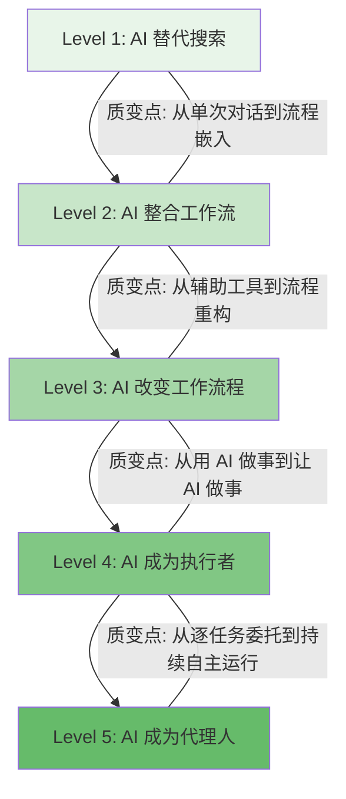

# AI Native 进阶路线：从搜索替代到个人代理的五层跃迁

## 一句话导读

大多数人用 AI 还停留在"高级搜索引擎"阶段，而真正的 AI Native 是一层层改变你和工作的关系——从提问、到整合、到原型、到构建、到委托。

## 适合谁看

- 已经在用 ChatGPT/Gemini 但觉得"也就那样"的知识工作者
- 想用 AI 提升日常效率但不知道从哪下手的产品经理
- 对 vibe coding 感兴趣但还没动过手的技术门外汉
- 带团队的管理者，想让团队整体 AI 使用水平上一个台阶
- 已经在用 AI 写代码但想理解"全貌"和下一步方向的人

## 读完你会获得什么

- 理解"AI Native"不是一个标签，而是一个可量化的五层进阶模型
- 能判断自己目前在哪一层、下一层要做什么
- 掌握从 Level 2 到 Level 4 的具体落地方法和工具选择
- 理解"原型先行"为什么比"文档先行"更适合 AI 时代的产品开发
- 能避开 vibe coding 中最常见的三个坑：没有计划、忽视安全、过早追求高级工具
- 理解个人 AI 代理的核心不是工具多，而是持续"入职培训"

---

## 01 背景：为什么这个问题现在值得讨论

"AI Native"这个词被用滥了。公司写在招聘 JD 里，投资人写在 BP 里，博主写在标题里。但如果你问一个人"你 AI Native 了吗"，他大概率只能回答"我天天用 ChatGPT"。

天天用 ChatGPT 不等于 AI Native。就像天天用浏览器不等于互联网 Native。

过去一年，AI 工具的能力发生了质变：语音转写准确到可以替代打字、AI 会议纪要已经比人工记录更完整、原型可以用自然语言从零生成、一个人用 vibe coding 能在两小时内做出一个完整游戏。这些变化不是"AI 又变强了一点"，而是每一层都在改变工作的基本流程。

但问题是：大多数人卡在第一层。他们用 AI 替代了 Google 搜索，然后停下了。不是因为他们不想前进，而是因为没有人告诉他们从"问问题"到"让 AI 替你做事"之间，到底要经过哪些步骤、每个步骤要做什么、做到什么程度算过关。

这篇文章要解决的就是这个问题。

---

## 02 核心判断：视频真正想讲的不是"五层工具"，而是"五层关系"

视频表面在讲五个层级的 AI 使用方式，但这不是五个工具的叠加，而是**你和 AI 之间关系的五次质变**：

| 层级 | 表面描述 | 实质关系变化 |
|------|---------|-------------|
| Level 1 | AI 回答日常问题 | AI 是**搜索引擎的替代品** |
| Level 2 | AI 整合进日常工作流 | AI 是**工作流的一部分** |
| Level 3 | AI 用于快速原型 | AI 改变了**工作流程本身** |
| Level 4 | AI 用于构建应用 | AI 是**你的执行者**，你是管理者 |
| Level 5 | AI 作为个人代理 | AI 是**半自主的代理人** |

关键洞察：每一层的跃迁，不是"多会用一个功能"，而是你和 AI 的协作模式发生了根本改变。Level 1 你对 AI 的指令是"告诉我答案"，Level 4 你对 AI 的指令是"按这个计划把这个东西做出来"，Level 5 你对 AI 的指令是"这件事你来处理"。

视频里反复说的"就像打游戏一样"，不是在说 AI 好玩，而是在说：**AI Native 的学习曲线和游戏一样——你不需要读完说明书再开始，你边玩边升级就行。**

但视频有一个倾向需要修正：它过度强调了工具的趣味性，轻描淡写了每层跃迁的实际门槛。Level 4 的"一周可达"对大多数人来说过于乐观——不是因为技术难，而是因为大多数人还没建立"用自然语言管理一个执行者"的思维习惯。

---

## 03 概念澄清：先把关键名词讲准确

### AI Native

- **它是什么**：一种和 AI 协作的工作状态。不是"会用 AI"，而是"离开 AI 会觉得工作方式倒退了"。
- **它解决什么问题**：让 AI 从偶尔使用的工具，变成日常工作的默认路径。
- **它不是什么**：不是"每天打开 ChatGPT 聊天"，不是"会用 10 个 AI 工具"，不是"了解最新的模型参数"。
- **和"AI 用户"的区别**：AI 用户把 AI 当工具用，AI Native 把 AI 当协作者用。区别在于：AI Native 的工作流如果拿掉 AI，不只是变慢，而是整个流程设计都要推倒重来。

### Vibe Coding

- **它是什么**：用自然语言描述需求，让 AI 生成代码，你只负责方向和验收，不负责写代码。
- **它解决什么问题**：让不会写代码的人也能构建应用；让会写代码的人从"写代码"转向"设计和管理代码"。
- **它不是什么**：不是"不用动脑子随便说句话 AI 就能做出好东西"。Vibe coding 的核心工作量在规划，不在编码。
- **和传统编程的区别**：传统编程你写代码，AI 辅助；vibe coding 你写需求文档，AI 写代码。角色从执行者变成了管理者。

### AI 项目（Projects）

- **它是什么**：在 ChatGPT 等 AI 工具中创建的持久化对话空间，可以预设上下文、指令和知识库。
- **它解决什么问题**：避免每次对话都从零开始解释背景。AI 项目记住了你是谁、你在做什么、你偏好什么。
- **它不是什么**：不是简单的聊天记录保存。项目是"带人设的对话"——你给 AI 的上下文让它能给出更精准的回答。
- **例子**：你创建一个"周末计划"项目，提前写入家庭成员信息、居住区域、偏好活动类型。之后每次问"这周末干嘛"，AI 不需要你再重复任何背景。

### 个人 AI 代理（Personal Agent）

- **它是什么**：一个持续运行、具有访问你的工具和数据权限、能半自主完成任务的 AI 系统。
- **它解决什么问题**：把重复性的"动手"工作委托出去，你只负责决策和监督。
- **它不是什么**：不是 ChatGPT 的对话窗口。代理的关键特征是**主动性**和**工具权限**——它能读你的邮件、改你的日历、操作你的文件系统，而不仅是回答问题。
- **和 AI 助手的区别**：AI 助手等你提问，AI 代理主动执行。助手是"你问我答"，代理是"你交代我办"。

---

## 04 整体框架：五层进阶模型

这五层不是工具的堆叠，而是**协作深度的递进**。每层的核心变化：

- **Level 1 → 2**：从"偶尔问 AI"到"AI 嵌入日常工作流"。质变点是：你不再需要刻意想起用 AI，AI 已经成为你工作流的一个环节。
- **Level 2 → 3**：从"用 AI 做现有工作"到"用 AI 重塑工作方式"。质变点是：你不再只是用 AI 加速旧流程，而是因为 AI 的存在重新设计了流程。
- **Level 3 → 4**：从"用 AI 辅助专业工作"到"用 AI 执行构建任务"。质变点是：你从动手者变成了管理者，AI 从顾问变成了执行者。
- **Level 4 → 5**：从"逐个任务委托 AI"到"AI 持续自主运行"。质变点是：AI 不再需要你每次下达指令，它有工具、有权限、有记忆，能自主完成一系列关联任务。

**一个关键提醒**：视频作者说 80% 的价值仍然来自 Level 2。这个判断比"赶紧到 Level 5"重要得多。大多数人的时间投入应该集中在 Level 2 和 Level 3，因为这两层的投入产出比最高。

---

## 05 关键机制：每层到底怎么运行

### Level 1 的机制：AI 替代搜索

- **输入**：你的问题（文字）
- **处理**：AI 基于训练数据生成回答
- **输出**：一段文字回答
- **为什么这样设计**：降低了信息获取的门槛——你不需要自己去搜索、筛选、综合，AI 直接给你答案
- **代价**：你无法验证 AI 的回答是否准确；你失去了信息搜索过程中"意外发现"的可能
- **适合场景**：有明确答案的事实性问题（"马桶漏水怎么修"）
- **不适合场景**：需要原创分析、需要最新数据、需要多源交叉验证的问题

### Level 2 的机制：AI 嵌入工作流

这一层有三个独立机制，每个都可以单独启动：

**语音转写机制**
- **输入**：你的语音（通过快捷键触发）
- **处理**：AI 实时转写 + 格式化（自动整理成列表、修正语法）
- **输出**：结构化文字
- **为什么重要**：说话速度是打字的 3-5 倍，且 AI 能理解"意识流"式的表达并自动整理
- **代价**：需要适应"对着空气说话"的工作方式；在开放办公环境中不太实用

**AI 会议纪要机制**
- **输入**：会议的实时音频
- **处理**：AI 实时转写 + 提取关键信息 + 支持中途提问
- **输出**：结构化会议纪要 + 可追问的会议摘要
- **为什么重要**：会议中你可以专注参与而不是忙于记录；会后可以快速回溯"谁说了什么"
- **代价**：需要信任 AI 工具访问你的会议音频；自动生成的纪要可能有遗漏或误读

**AI 项目机制**
- **输入**：预设的上下文（你的身份、偏好、约束）+ 每次的具体问题
- **处理**：AI 基于预设上下文 + 实时搜索生成回答
- **输出**：高度个性化的建议
- **为什么重要**：避免了每次对话的"冷启动"——AI 已经知道你是谁，不需要你重复解释
- **代价**：初始设置需要投入时间；上下文过长可能导致 AI 注意力分散

### Level 3 的机制：原型先行

- **输入**：一个截图 + 一段自然语言描述
- **处理**：AI 基于现有 UI 克隆 + 按描述修改，生成交互式原型
- **输出**：可点击、可体验的原型
- **为什么这样设计**：传统瀑布流程是 spec → 设计 → 开发，每一步都是"文档交接"，信息在传递中失真。原型先行把"先写文档再让所有人理解文档"变成"先做出来让大家直接体验"。
- **代价**：原型可能和最终实现有差距；需要团队接受"先看原型再补文档"的工作方式
- **适合场景**：功能探索、方向验证、跨团队对齐
- **不适合场景**：需要精确工程约束的基础设施项目、合规要求严格的系统

### Level 4 的机制：人机管理者-执行者模型

- **输入**：你的需求文档（用自然语言写的计划）+ 截图反馈
- **处理**：AI 按计划写代码，你审核、反馈、调整方向
- **输出**：可运行的应用
- **为什么这样设计**：AI 写代码的速度远快于人，但 AI 的判断力还不够——它不知道什么该做、什么不该做、做到什么程度算好。所以最优分工是：你负责判断和方向，AI 负责执行。
- **代价**：你需要学会"管理"而不是"执行"——这对习惯亲自动手的人是思维转换；AI 生成的代码可能有安全漏洞
- **适合场景**：个人工具、内部应用、原型验证、创意项目
- **不适合场景**：对安全性和性能有严格要求的生产系统（除非你有能力审查 AI 的每一行代码）

### Level 5 的机制：持续入职的代理系统

- **输入**：你的授权（API 密钥、文件访问、账户权限）+ 初始指令 + 持续反馈
- **处理**：AI 自主调用工具链完成任务链
- **输出**：已完成的任务（邮件已处理、日历已安排、文档已生成、甚至产品已上线）
- **为什么这样设计**：Level 4 是你逐个任务交代，Level 5 是你把一组能力授权给 AI，它自主决定如何组合这些能力完成任务。就像给新员工做完入职培训后，他可以独立处理一类工作。
- **代价**：前期"入职培训"投入巨大（比你自己做还慢）；存在权限失控和数据泄露的风险；代理的行为不可完全预测
- **适合场景**：重复性高的信息处理工作（邮件筛选、日程管理、内容生成）
- **不适合场景**：需要高度判断力的决策、涉及敏感信息的操作、对准确性要求极高的任务

---

## 06 方法拆解：每一层应该怎么落地

### Level 1：从 Google 切换到 AI 搜索

**目标**：把日常信息获取的默认入口从搜索引擎切换到 AI。

| 维度 | 内容 |
|------|------|
| 具体动作 | 遇到任何问题，先问 AI 而不是先搜 Google。坚持一周。 |
| 判断标准 | 你一周内打开 Google 搜索的次数减少了 50% 以上。 |
| 常见坑 | 把 AI 当百科全书用——只问事实性问题。应该多问"怎么办"类问题，这是 AI 相对搜索的优势。 |
| 产出物 | 养成"先问 AI"的习惯。 |

**注意**：Level 1 是起点，不是终点。如果你用 AI 一个月还停留在"问问题"，你需要主动推进到 Level 2。

### Level 2：三个子系统各自上线

**目标**：让 AI 成为日常工作流的一部分，而不是一个偶尔打开的窗口。

**步骤 1：安装语音转写工具**

| 维度 | 内容 |
|------|------|
| 具体动作 | 安装 Whisper Flow / Super Whisper / Monolo，设置快捷键，在任何文本输入框中用语音替代打字。 |
| 判断标准 | 你每天至少 30% 的文字输入通过语音完成。 |
| 常见坑 | 追求完美转写——不需要。AI 会自动整理，你只需要正常说话。 |
| 产出物 | 语音转写成为你的默认输入方式。 |

**步骤 2：部署 AI 会议纪要**

| 维度 | 内容 |
|------|------|
| 具体动作 | 安装 Granola 或类似工具，让它接入你的日历和会议。下一次会议时不手动记笔记，全程依赖 AI。会后检查纪要质量。 |
| 判断标准 | 你在会议中不再需要手动记录，会后 5 分钟内能获得结构化纪要。 |
| 常见坑 | 不检查 AI 纪要的准确性——AI 可能遗漏关键决策或误解发言者意图。前两周要人工校对。 |
| 产出物 | 每次会议都有自动生成的结构化纪要。 |

**步骤 3：创建 AI 项目**

| 维度 | 内容 |
|------|------|
| 具体动作 | 在 ChatGPT 中创建 3-5 个项目，每个项目写入详细的上下文：你的角色、你的目标、你的约束、你的偏好。 |
| 判断标准 | 你在这些项目中的对话不需要重复解释背景。 |
| 常见坑 | 上下文写得太短——AI 项目的效果和上下文质量直接相关。花 30 分钟写好上下文，比花 3 小时在普通对话中反复解释强得多。 |
| 产出物 | 3-5 个带有完整上下文的 AI 项目，覆盖你最高频的工作场景。 |

### Level 3：开始原型先行

**目标**：在产品开发中，把"原型"作为第一步，而不是"文档"或"设计"。

**步骤 1：用 AI 克隆现有 UI**

| 维度 | 内容 |
|------|------|
| 具体动作 | 截取你现有产品的界面截图，粘贴到 Replit 或 Google AI Studio，让 AI 复刻。 |
| 判断标准 | AI 生成的原型在视觉和交互上和原版有 80% 以上相似度。 |
| 常见坑 | 追求像素级还原——不需要。原型的目的是验证方向，不是替代设计稿。 |

**步骤 2：在原型上叠加新功能**

| 维度 | 内容 |
|------|------|
| 具体动作 | 用自然语言描述你想添加的功能，让 AI 在克隆的原型上实现。 |
| 判断标准 | 新功能可交互、可体验，不需要写代码。 |
| 常见坑 | 一次加太多功能——原型应该一次验证一个假设。 |

**步骤 3：用原型收集反馈，再补文档**

| 维度 | 内容 |
|------|------|
| 具体动作 | 把原型链接分享给团队/客户，收集反馈。确认方向后，再写 spec 和设计稿处理边界情况。 |
| 判断标准 | 反馈是针对"体验"的，不是针对"文档描述"的。 |
| 常见坑 | 跳过 spec 和设计直接开发——原型确认方向后，仍然需要设计稿和 spec 来处理边界情况和工程约束。原型替代的是"方向探索"，不是"工程交付"。 |
| 产出物 | 一个经过验证的交互原型 + 基于原型的 spec 和设计稿。 |

### Level 4：从零开始 vibe coding

**目标**：用自然语言指导 AI 构建一个可运行的应用。

**步骤 1：选择你想解决的问题**

| 维度 | 内容 |
|------|------|
| 具体动作 | 告诉 AI 你的问题，让它建议 3-5 个简单的应用方案。或者直接选一个你一直想做的小工具。 |
| 判断标准 | 问题描述足够具体，AI 能给出可执行的建议。 |
| 常见坑 | 第一个项目就做"大而全"的产品——从最简单的开始，一个功能、一个页面、一个目的。 |

**步骤 2：让 AI 制定开发计划**

| 维度 | 内容 |
|------|------|
| 具体动作 | 要求 AI 输出一个包含 3 个里程碑的开发计划。每个里程碑有明确的交付物和验收标准。 |
| 判断标准 | 你能看懂这个计划，并且每个里程碑的目标是可验证的。 |
| 常见坑 | 直接让 AI 开始写代码——**这是 vibe coding 最大的坑**。没有计划的 vibe coding = 无限调试循环。你的时间 70% 应该花在规划上，30% 花在编码和调试上。 |

**步骤 3：像管理者一样推进**

| 维度 | 内容 |
|------|------|
| 具体动作 | 按里程碑逐个推进。每完成一个里程碑，验收、反馈、调整。遇到 bug 时，截图发给 AI 并描述问题，而不是自己改代码。 |
| 判断标准 | AI 完成每个里程碑后，你能运行并体验。 |
| 常见坑 | 看到 bug 就自己动手改——把 bug 的截图和描述发给 AI，让它来修。你在 vibe coding 中的角色是管理者，不是执行者。 |
| 产出物 | 一个可运行的应用。 |

**工具选择指南**（根据视频内容整理，按推荐程度排序）：

| 阶段 | 推荐工具 | 理由 |
|------|---------|------|
| 刚入门 | Replit | 全栈平台，自带数据库、认证、日志，安全防护更完善。不需要配置部署环境。 |
| 想要更多控制 | Cursor | 最流行的 AI IDE，功能强大。但需要自己配置 GitHub + Vercel 等部署工具。 |
| 追求最大能力 | Claude Code（终端）/ Codex | 终端级 AI 编码工具，灵活性最高。学习曲线也最陡。 |

**一个重要提醒**：不要在工具选择上花太多时间。选一个，开始做。工具之间的差距远小于"做"和"不做"的差距。

### Level 5：构建个人 AI 代理

**目标**：让 AI 持续自主地为你处理一类工作。

**步骤 1：选择一个代理平台**

| 维度 | 内容 |
|------|------|
| 具体动作 | 最简单的路径：使用 OpenAI 的 GPT 自定义 bot，或 Claude 的项目 + 工具集成。更高级的路径：用 Claude Code + 自定义命令行脚本。 |
| 判断标准 | 你的代理能访问至少一个外部工具（邮件、日历、文件系统）。 |

**步骤 2：给代理做"入职培训"**

| 维度 | 内容 |
|------|------|
| 具体动作 | 像培训新员工一样：写清楚它的职责范围、工作流程、输出格式、禁忌事项。逐步授权（先只读，再读写）。 |
| 判断标准 | 代理在不需要你追加指令的情况下，能独立完成 80% 的常规任务。 |
| 常见坑 | 一次性给所有权限——应该像给新员工一样，先给最基础的权限，验证能力后再逐步开放。 |

**步骤 3：持续优化**

| 维度 | 内容 |
|------|------|
| 具体动作 | 每次代理犯错时，更新指令或增加约束。每次代理做得好时，扩展它的权限范围。 |
| 判断标准 | 代理的"入职时间"在持续缩短——你添加新能力时，需要的指导越来越少。 |
| 常见坑 | 期望代理一次就完美——代理系统是持续迭代的，不是一次配置永久有效的。 |
| 产出物 | 一个能自主处理至少一类工作的 AI 代理系统。 |

---

## 07 案例讲解：一个产品经理的四周进阶

**场景背景**：李明是一家中型公司的产品经理。他用 ChatGPT 写邮件、查资料，但仅此而已。每天的工作是：写 spec、开会、跟设计对齐、跟开发对齐，经常加班。

**遇到的问题**：spec 写完要改三遍，设计稿和 spec 对不上，开发理解又和设计不同。信息在每一步交接中失真。

**按框架处理**：

**第一周：Level 2 上线**

李明做了三件事：安装了语音转写工具，把所有会议纪要交给 AI，创建了"产品规划"和"竞品分析"两个 AI 项目。

第一周结束时，他每天节省了约 1.5 小时——不再手动记会议纪要，不再每次从零开始向 AI 解释项目背景。

**第二周：Level 3 启动**

李明在做新功能规划时，没有先写 spec。他截取了现有产品的界面，粘贴到 Replit，让 AI 复刻。然后在复刻版上用自然语言描述了新功能的交互方式。2 分钟后，他有了一个可点击的原型。

他把原型链接发到团队群里，收到了 5 条具体反馈——比他过去写完 spec 后收到的反馈多 3 倍，而且反馈是针对"体验"的，不是针对"描述"的。

**第三周：Level 3 深化 + Level 4 试水**

李明开始用同样的方法做竞品分析——不是写文档对比，而是用 AI 把竞品 UI 克隆出来，让团队直接体验差异。同时，他用周末时间在 Replit 上做了一个个人工具：自动从竞品网站抓取更新并生成摘要。

**第四周：Level 4 日常化**

李明已经习惯用 vibe coding 做小工具。他给团队做了一个需求优先级看板——用自然语言描述需求，他花了 2 小时做了一个可用的 MVP。他自己没写一行代码。

**最终结果**：四周内，李明的工作方式发生了根本变化——从"写文档 → 等反馈 → 改文档"变成了"做原型 → 收反馈 → 补文档"。他的 AI 使用从"偶尔查资料"变成了"嵌入每一个工作环节"。

**说明什么**：进阶不是一次性的跨越，而是在日常工作中持续寻找"AI 能替代的环节"。每一层的关键不是学会某个工具，而是改变你和工作的关系。

---

## 08 常见误区

### 误区 1：AI Native = 用很多 AI 工具

- **错误理解**：下载了 10 个 AI 应用，注册了 5 个平台，就是 AI Native。
- **为什么错**：工具数量和使用深度无关。一个只用 ChatGPT 但把 Projects、语音输入、Canvas 都用起来的人，比装了 10 个工具但每个都只用来聊天的人更接近 AI Native。
- **正确理解**：AI Native 是 AI 深度嵌入工作流的程度，不是工具的数量。
- **应该怎么做**：选 2-3 个核心工具，用到极致，比浅尝辄止 10 个工具有效得多。

### 误区 2：Level 1 已经够用了

- **错误理解**：用 AI 查问题、写邮件，效率已经提高了，不需要再进阶。
- **为什么错**：Level 1 的价值天花板很低——你只是把"搜索-阅读-综合"变成了"提问-阅读"，效率提升有限。Level 2 的三个子系统各自独立提供价值，加起来的效率提升是 Level 1 的数倍。
- **正确理解**：视频作者自己说 80% 的价值来自 Level 2。停留在 Level 1 相当于买了一台电脑只用来打字。
- **应该怎么做**：至少推进到 Level 2，把语音转写、会议纪要、AI 项目都配好。

### 误区 3：Vibe coding 不需要懂技术

- **错误理解**：vibe coding 就是用自然语言让 AI 写代码，完全不需要任何技术知识。
- **为什么错**：vibe coding 不需要你写代码，但你需要理解代码在做什么——至少要能判断 AI 的输出是否合理、是否有安全风险。视频作者提到的"API 密钥泄露"问题就是典型案例。
- **正确理解**：vibe coding 把你的角色从"写代码的人"变成了"管理写代码的人的人"。管理者不需要会写代码，但需要能判断代码质量和安全风险。
- **应该怎么做**：学会基本的代码审查能力——能看懂 AI 生成的代码大致在做什么、API 密钥不能硬编码、用户输入需要校验。

### 误区 4：应该直接跳到 Level 5

- **错误理解**：Level 5 最酷，直接开始搭建个人代理。
- **为什么错**：Level 5 的有效性取决于前四层的积累。你不知道该给代理什么权限、什么指令、什么约束，除非你自己在 Level 2-4 中已经深度使用过 AI。视频中的三个 Level 5 案例，每个人都是在 Level 4 深度使用后才构建出自己的代理系统。
- **正确理解**：Level 5 是 Level 4 的自然延伸，不是独立技能。你不会管理 AI 执行任务，就无法设计 AI 代理的行为。
- **应该怎么做**：按顺序进阶。Level 4 做到熟练后，Level 5 的需求会自然出现。

### 误区 5：Vibe coding 的关键是选对工具

- **错误理解**：Cursor 好还是 Replit 好？Claude Code 好还是 Codex 好？花大量时间比较工具。
- **为什么错**：工具之间的差距远小于"做"和"不做"的差距。视频作者从 Replit 到 Cursor 到 Claude Code 都用过，每个都能做出东西。
- **正确理解**：工具选择的重要性远低于"动手做"和"规划好"。
- **应该怎么做**：选一个最顺手的，开始做。等你做出了几个项目，自然知道自己需要什么功能，那时再换工具有明确方向。

### 误区 6：AI 代理可以完全自主运行

- **错误理解**：配好代理后，它就能自己搞定一切。
- **为什么错**：视频中的三个 Level 5 案例都说明了——代理需要持续"入职培训"。Karen 的 LFG 命令是反复调试的结果，Three 的 Obsidian 系统是持续更新的，Nathan 的 FeedCraft 也是逐步授权的。
- **正确理解**：AI 代理更像一个需要持续指导的新员工，而不是一个即插即用的工具。
- **应该怎么做**：从最小权限开始，逐步扩展。每次代理犯错，更新指令。每次成功，考虑扩展权限。

### 误区 7：原型可以替代设计稿

- **错误理解**：有了 AI 原型，就不需要 spec 和设计稿了。
- **为什么错**：原型验证的是方向和体验，spec 和设计稿处理的是边界情况、工程约束、一致性规范。原型替代的是"方向探索阶段"的文档，不是"交付阶段"的文档。
- **正确理解**：原型先行改变了工作顺序（先原型后文档），但没有取消文档的必要性。
- **应该怎么做**：用原型快速验证方向，确认后再补 spec 和设计稿处理边界情况。

### 误区 8：AI 可以替代思考

- **错误理解**：AI 能做原型、能写代码、能管理邮件，那我就不需要思考了。
- **为什么错**：AI 替代的是执行，不是判断。在五层模型中，越往上走，"你"的判断力越重要——Level 4 你要判断 AI 的代码是否正确，Level 5 你要判断代理的行为是否合理。
- **正确理解**：AI Native 的核心能力是判断力，不是操作力。
- **应该怎么做**：把省下来的执行时间投入到更高层的思考——方向判断、优先级排序、质量把关。

---

## 09 实战清单：读完后可以马上照着做

### 立即能做（今天）

- [ ] 安装一个语音转写工具（Whisper Flow / Super Whisper），设置快捷键，今天至少用语音输入完成 3 段文字
- [ ] 在 ChatGPT 中创建一个 AI 项目，写入你的工作背景、目标和偏好。用这个项目完成下一次提问
- [ ] 把下一次搜索操作改为向 AI 提问，比较两种方式的效率差异

### 一周内能做

- [ ] 部署 AI 会议纪要工具，在至少 3 场会议中使用，会后检查纪要质量
- [ ] 创建 3-5 个 AI 项目，覆盖你最高频的工作场景（产品规划、竞品分析、内容创作、个人生活等）
- [ ] 用 Replit 或 Google AI Studio 做一个 UI 原型：截取你常用产品的界面，让 AI 克隆，然后叠加一个你想加的新功能
- [ ] 把这个原型分享给至少一位同事，收集反馈

### 长期要沉淀

- [ ] 建立 vibe coding 的项目库——从最简单的工具开始，逐步构建复杂度更高的应用
- [ ] 每次用 AI 完成任务后，花 1 分钟记录：哪些上下文让 AI 表现更好？哪些指令导致了不好的结果？
- [ ] 当你在 Level 4 熟练后，识别自己最重复的工作类型，设计一个 AI 代理来接手
- [ ] 给代理建立"入职文档"——职责、流程、约束、禁忌——并持续迭代
- [ ] 定期回顾：你目前在哪一层？下一层的阻碍是什么？

---

## 10 总结

AI Native 不是一个状态，而是一个持续进阶的过程。五层模型的核心不是"你要到达 Level 5"，而是"你在每一层都要改变和 AI 的协作方式"。

Level 1 和 2 之间的差距，比 Level 1 和"不用 AI"之间的差距还大。因为 Level 1 你只是换了一个信息源，Level 2 你开始改变工作方式。语音转写、会议纪要、AI 项目——这三个子系统各自独立，但加在一起，AI 从"偶尔打开的窗口"变成了"工作流的一部分"。

Level 3 是一个被严重低估的跃迁。原型先行不只是"用 AI 做原型快"，而是改变了产品开发的基本节奏——从"先想清楚再动手"变成"先动手再想清楚"。这不是偷懒，而是因为 AI 让"动手"的成本降到了接近零，所以"先做再想"的效率反而更高。

Level 4 和 5 之间的差距，比 Level 3 和 4 之间的差距大得多。因为 Level 4 你仍然在逐个任务管理 AI，Level 5 你要让 AI 自主运行。这需要你把"如何做这件事"的知识外化成 AI 能理解和执行的指令——这个"外化"过程本身就是最大的工作量。

**最后判断：大多数人应该把 80% 的精力放在 Level 2 和 Level 3。** 这两层的投入产出比最高，上手门槛最低，且能覆盖日常工作中大部分的效率提升需求。Level 4 和 5 是重要的方向，但它们需要更长的积累和更多的判断力。不要因为 Level 5 看起来更酷而跳过 Level 2——Level 2 的三个子系统，才是你真正 AI Native 的地基。
