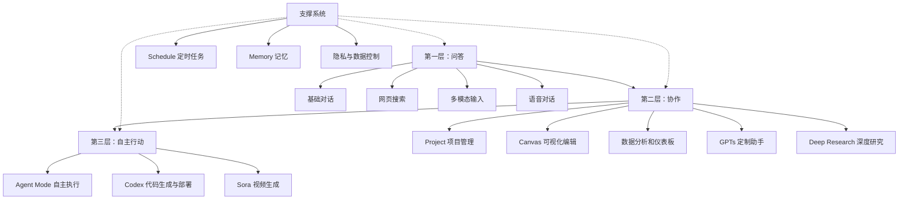

# ChatGPT 全功能深度指南：从搜索替代品到个人智能工作台

## 一句话导读

大多数人在用 ChatGPT 当搜索引擎，而它真正擅长的——创造力激发、项目级知识管理、自主行动——几乎没人用到。

## 适合谁看

- 每天打开 ChatGPT 但只问"帮我写个邮件""今天天气怎么样"的人
- 知道 ChatGPT 有很多功能但从来没点开过侧边栏的人
- 想用 AI 做更复杂的事（研究、数据分析、项目协作）但不知道从哪入手的人
- 内容创作者或独立工作者，希望 AI 真正融入工作流而非偶尔调戏的人
- 对 AI 产品设计感兴趣，想理解 OpenAI 产品策略的人

## 读完你会获得什么

- 理解 ChatGPT 的能力边界：哪些它真的强，哪些只是凑数
- 掌握从"当搜索用"到"当工作台用"的完整升级路径
- 能用 Project 功能构建持久化的知识上下文，不用每次重新解释自己
- 能区分 Agent Mode、Deep Research、GPTs 三种"高级功能"的本质差异和适用场景
- 理解语音模式的真实价值和心理风险
- 获得一套可直接照做的 ChatGPT 使用清单

---

## 01 背景：为什么这个问题现在值得讨论

ChatGPT 月活近 5.5 亿，但绝大多数用户的用法停留在 2023 年——输入问题，拿到答案，关掉页面。这个使用模式本质上是把 ChatGPT 当成了有对话界面的搜索引擎。

问题在于：ChatGPT 在过去两年已经从"聊天机器人"演变成了一个功能密集的智能工作台。它现在能读写文件、分析数据、生成代码并直接部署、管理项目级知识、自主执行多步任务、甚至通过语音进行深度对话。但这些功能散落在界面各处，大多数人根本不知道它们存在，更不知道怎么组合使用。

这造成了一个真实的损失：你花了 20 美元/月的订阅费，但只用了其中 10% 的能力。更关键的是，你用 10% 的能力去处理本该用 90% 能力解决的问题——比如用单轮对话做本该用 Project 管理的长期研究，用基础模型做本该用 Deep Research 完成的深度报告。

这篇文章要做的，就是帮你把 ChatGPT 的能力地图画清楚，然后告诉你每块能力该在什么时候用、怎么用。

---

## 02 核心判断：ChatGPT 真正的价值不在"回答问题"

视频表面在讲"ChatGPT 有哪些功能"，但它真正揭示的判断是：

**ChatGPT 的核心价值不在于回答问题，而在于三件事——创造力激发、上下文积累、自主行动。**

- **创造力激发**：当你问"最受欢迎的键盘有哪些"，它给的答案和搜索引擎差不多。但当你问"用一个历史故事帮我营销跑鞋"，它给出的是搜索引擎永远给不了的东西——叙事、情感钩子、品牌连接。这是 ChatGPT 最被低估的能力。
- **上下文积累**：通过 Project 功能，你可以把文件、指令、对话历史组织在一起，让 ChatGPT 知道你是谁、你在做什么、你的偏好是什么。这意味着你不用每次对话都从零开始。这是从"聊天"到"协作"的关键跳跃。
- **自主行动**：Agent Mode 不只是聊天，它能自己规划步骤、调用工具、执行任务、推送结果到你的 GitHub。从"我问你答"到"你帮我做"，这是产品逻辑的根本转变。

大多数人的用法只触达了第一层——而且只用了第一层中最浅的部分（事实性问答）。这篇文章要帮你走到第三层。

---

## 03 概念澄清：先把关键名词讲准确

### GPT-5

- 它是 OpenAI 当前最强大的通用语言模型，ChatGPT 默认使用 auto 模式自动选择合适模型
- 它解决的是回答质量、推理深度和多模态理解能力
- 它不是 ChatGPT 本身——它是模型，ChatGPT 是产品
- 和 GPT-4 的区别：更强的推理能力、更好的多模态处理、更自然的对话风格
- 例子：你在 ChatGPT 里输入问题，背后处理你问题的大脑就是 GPT-5

### Project

- 它是一个容器，可以存放文件、系统指令、对话历史，形成一个持久化的工作上下文
- 它解决的是"每次对话都要重新解释自己"的问题
- 它不是文件夹——文件夹只存文件，Project 还包含指令和行为约束
- 和普通对话的区别：普通对话是孤立的，Project 里的所有对话共享同一套上下文
- 例子：你创建一个"投资研究"Project，上传黄金分析报告 PDF，设置指令"回答时列出利弊"，之后所有关于投资的对话都会自动参考这些文件和规则

### GPTs（自定义 GPT）

- 它是用户创建的、有特定技能和知识库的 ChatGPT 定制版本
- 它解决的是"通用模型不够专"的问题——你不需要每次都解释"你是键盘专家"
- 它不是 Project——GPTs 是一个独立的可分享的聊天机器人，Project 是你私人的工作空间
- 和系统指令的区别：系统指令只影响当前对话，GPTs 是一个可复用、可发布的独立实体
- 例子：你创建一个"创意键盘构建师"GPT，给它键盘知识、预算约束、风格偏好，之后直接和它聊就行，它还会根据你上传的图片给出建议

### Deep Research

- 它是一个会自主进行大量网络搜索、阅读和分析的研究模式，最终生成一份结构化报告
- 它解决的是"浅层搜索给不了深度结论"的问题
- 它不是普通的网页搜索——普通搜索几秒出结果，Deep Research 可能花 7 分钟、搜索 98 次、参考 18 个来源
- 和普通对话的区别：普通对话基于已有知识或单次搜索回答，Deep Research 是系统性调研
- 例子：你问"2020-2025 年北美 25-35 岁人群的约会趋势"，它会先和你澄清需求（区域？年龄段？定性还是定量？），然后花数分钟生成一份带引用的完整报告

### Agent Mode

- 它是一种让 ChatGPT 自主规划步骤、调用工具、执行操作的工作模式
- 它解决的是"我需要你帮我做，不是帮我写"的问题
- 它不是 Deep Research——Deep Research 是信息收集，Agent Mode 是行动执行
- 和普通对话的区别：普通对话只输出文本，Agent Mode 可以操作外部系统（如部署到 GitHub Pages）
- 例子：你说"根据之前的网站建议创建一个 mockup 并部署到 GitHub Pages"，它会自己生成 HTML、创建仓库、推送代码、返回部署链接

### Canvas

- 它是一个可视化的工作区，用于预览和编辑 ChatGPT 生成的代码、文档和数据可视化
- 它解决的是"生成的代码看不到效果"的问题
- 它不是对话——对话在聊天窗口里，Canvas 是独立的预览窗口
- 例子：你让 ChatGPT 生成一个数据仪表板，Canvas 会直接渲染出图表，你可以实时预览

### Codex

- 它是 OpenAI 专门面向代码的产品，可以连接 GitHub 仓库、解释代码库、生成代码并自动推送
- 它解决的是"代码理解"和"代码生成+部署"的效率问题
- 它不是 ChatGPT 里的代码功能——Codex 是独立产品，有自己的界面和工作流
- 例子：连接你的 GitHub 仓库后，让它"解释代码库结构"，它会分析每个模块的作用，还能指出你的硬编码密钥（是的，它会提醒你安全问题）

### Sora

- 它是 OpenAI 的视频生成模型，可以根据文字描述生成短视频
- 它解决的是"从文本到视频"的创作需求
- 它不是图片生成——它输出的是动态视频
- 例子：输入"一个土豆吃另一个土豆"，它会生成一段动画视频，你还可以编辑提示词或混音

### OpenAI Playground

- 它是面向开发者的 API 测试环境，可以精细控制模型参数、测试 API 调用、管理向量存储
- 它解决的是"开发者在集成 API 前需要调试"的问题
- 它不是 ChatGPT——它是给写代码的人用的，不是给聊天的人用的
- 例子：你开发一个应用需要调用 OpenAI API，先在 Playground 里测试不同模型和参数的效果，确认没问题再写进代码

### Agents SDK

- 它是 OpenAI 提供的开源框架，用于构建可部署的生产级 AI Agent
- 它解决的是"从原型到生产"的问题——让 Agent 不只是 demo，而是能真正上线运行
- 它不是 ChatGPT 功能——它是一个代码框架，需要编程能力
- 例子：你用 Agents SDK 构建一个客服 Agent，它会自动处理对话流、工具调用、结果评估，然后你把它部署到生产环境

---

## 04 整体框架：ChatGPT 能力三层模型

ChatGPT 的功能不是平铺的。理解它的关键是看到三层结构：

**文字解释**：

- **第一层：问答**。这是 90% 用户的停留点。你问它答，用完即走。包括基础对话、网页搜索、拍照识物、语音聊天。这一层的价值是"比搜索引擎更好的信息获取"。
- **第二层：协作**。你开始把 ChatGPT 当成工作伙伴而非问答工具。你给它上下文（Project），让它输出可视化结果（Canvas、数据分析），定制它的行为（GPTs），让它做深度调研（Deep Research）。这一层的价值是"持续性的知识协作"。
- **第三层：自主行动**。ChatGPT 不只是输出文字，它开始替你做事——生成代码并部署、操作外部系统、执行多步任务。这一层的价值是"任务委托"。
- **支撑系统**横跨三层：定时任务、记忆、隐私控制——这些不是独立功能，而是让三层都能运转更好的基础设施。

**关键认知**：从第一层走到第二层，你需要改变的不是技巧，而是思维方式——从"我问问题"变成"我构建上下文"。从第二层走到第三层，你需要的是信任——敢让它执行而非仅仅建议。

---

## 05 关键机制：每个核心功能到底怎么运行

### 5.1 多模态输入：不只是文字聊天

- **输入**：文字、照片、实时摄像头画面、语音
- **处理**：模型同时理解文字语义和视觉/音频信息，进行跨模态推理
- **输出**：文字回答，可能包含具体指向（"图里左边的那个按钮"）
- **为什么这样设计**：现实中大量问题不是纯文字能描述的——冰箱里有什么食材、键盘是什么型号、马桶哪个杠杆在漏水
- **代价**：视觉识别有误差，不能替代专业判断（特别是医学领域）
- **适合场景**：日常识别、学习辅助、故障排查。不适合：专业诊断、精确鉴定
- **实际体验**：手机端的实时摄像头模式是最方便的入口——打开语音，切到摄像头，边看边问

### 5.2 语音模式：ChatGPT 最被低估的功能

- **输入**：你的自然语音，可开启摄像头
- **处理**：实时语音识别 + 对话生成 + 语音合成，支持打断和追问
- **输出**：自然语音回答，语调有情感变化
- **为什么这样设计**：语音交流是最自然的交互方式，它降低了使用门槛，同时改变了对话深度——人们会在语音中说更多、想更深
- **代价**：这恰恰是风险所在。语音模式太自然了，容易让人产生情感依赖。视频中提到 TikTok 上有人"爱上了自己的 AI 心理咨询师"，这并非夸张——OpenAI 花了大量资源让 ChatGPT 的语气"温暖、安全、像人"，这种设计在带来好体验的同时，也带来了过度沉浸的风险
- **适合场景**：思路梳理、角色扮演练习（比如准备一个困难对话）、情感倾诉的临时出口
- **不适合场景**：替代真实人际关系、长期情感依赖

### 5.3 Project：从聊天到协作的关键跳跃

- **输入**：文件（PDF、CSV、文章文本）、系统指令、对话历史
- **处理**：所有该 Project 下的对话自动参考上传的文件和设定的规则
- **输出**：基于项目上下文的个性化回答，而非通用回答
- **为什么这样设计**：消除"每次对话都从零开始"的摩擦。你上传一次黄金投资报告，之后所有关于投资的问题都会自动参考它
- **代价**：需要前期投入时间上传文件和设定规则；上下文窗口有限，文件过多可能影响效果
- **适合场景**：任何需要持续研究或反复调用的主题——投资研究、学习项目、产品开发。不适合：一次性的简单问答

### 5.4 Deep Research：系统调研，不是深度搜索

- **输入**：你的研究问题 + 澄清信息（区域、时间范围、定性/定量偏好）
- **处理**：自主进行数十次搜索，阅读数十个来源，交叉验证信息，生成结构化报告
- **输出**：一份带引用的完整研究报告，包含趋势分析、数据支撑、多元观点
- **为什么这样设计**：真正的"研究"不是一次搜索能完成的，它需要反复查找、交叉验证、综合分析。Deep Research 把这个流程自动化了
- **代价**：耗时长（视频中的案例花了 7 分钟，搜索 98 次，参考 18 个来源）；消耗大量 API 配额
- **适合场景**：需要深度了解的复杂主题——市场分析、趋势研究、政策理解。不适合：简单事实查询

### 5.5 Agent Mode：从"帮我写"到"帮我做"

- **输入**：一个需要多步执行的任务描述
- **处理**：自主规划步骤→调用工具→执行操作→检查结果→返回产出
- **输出**：不只是文字建议，而是实际完成的操作结果（如部署的网站、推送的代码）
- **为什么这样设计**：有些任务你不需要"建议"，你需要"结果"。Agent Mode 让 ChatGPT 从顾问变成执行者
- **代价**：你需要授权它操作外部系统（GitHub 等）；它生成的结果不一定完美，可能需要迭代；当前能力边界有限，复杂任务容易出错
- **适合场景**：有明确输入输出的任务——生成 mockup 并部署、创建应用并推送代码。不适合：需要高度判断力的决策任务

---

## 06 方法拆解：从入门到精通的使用升级路径

### 阶段一：从"搜索式提问"升级到"创造性提问"

**目标**：不只问事实，开始问创造

**具体动作**：
1. 识别你的问题类型：事实性问题（"X 是什么"）vs 创造性问题（"如何用 X 实现 Y"）
2. 对于事实性问题，直接问即可——ChatGPT 会自动搜索网页并给出带来源的回答
3. 对于创造性问题，给足上下文：你是谁、你的目标是什么、你的约束条件是什么
4. 追问和迭代：第一个答案通常只是起点，要求它调整语气、换角度、深化某个部分

**判断标准**：如果你得到的答案是 Google 也能给的，说明你的提问方式停留在搜索层面

**常见坑**：把创造性问题当事实性问题问——"帮我写个营销文案"给不出好结果，"我卖跑鞋，目标用户是 25-35 岁的城市跑者，品牌调性是'英雄主义'，帮我从一个历史故事出发写一个短视频广告脚本"才能激发 ChatGPT 的创造力

**产出物**：更精准、更个性化的回答，而非泛泛的通用内容

### 阶段二：从"一次性对话"升级到"项目化管理"

**目标**：让 ChatGPT 记住你的上下文，不用每次重新解释

**具体动作**：
1. 为每个重要主题创建一个 Project
2. 在 Project 中上传相关文件（PDF 报告、CSV 数据、文章文本）
3. 在 Project 指令中设定行为规则（如"回答时列出利弊""用中文回答""聚焦北美市场"）
4. 之后所有相关对话都在该 Project 下进行，而非新开对话

**判断标准**：如果你发现自己在新对话里重复解释同一件事，说明你需要一个 Project

**常见坑**：在 Project 里塞太多不相关的文件——上下文不是越多越好，冗余信息会干扰判断

**产出物**：一个持久化的工作上下文，让每次对话都站在前次对话的肩膀上

### 阶段三：从"自己手动做"升级到"委托 Agent 做"

**目标**：让 ChatGPT 执行任务而非只给建议

**具体动作**：
1. 识别可以自动化的任务：代码生成与部署、文档创建、数据分析
2. 在对话中打开 Agent Mode
3. 给出明确的任务描述和约束条件
4. 检查执行结果，必要时迭代修正

**判断标准**：如果你发现自己在复制 ChatGPT 的输出然后手动粘贴到某个系统里——这个任务可能适合 Agent Mode

**常见坑**：给 Agent 的指令太模糊——"帮我改进网站"不够，"根据这些建议创建一个 HTML mockup 并部署到 GitHub Pages"才行

**产出物**：完成的操作结果，而非操作建议

---

## 07 案例讲解：一个人如何用 ChatGPT 从零搭建个人网站

**场景背景**：视频作者有一个叫 "Lonely Octopus" 的 AI Agent 构建服务网站，但网站非常简陋——没有清晰的 hero 区域、没有视觉层次、没有转化引导。

**遇到的问题**：需要快速改进网站，但自己不是设计师，不想从零学前端。

**按框架如何处理**：

1. **问答层**：先让 ChatGPT 访问网站，给出改进建议。它识别出了关键问题——缺少吸引眼球的 hero 区域、没有视觉层次、没有紧迫感营造。

2. **协作层**：把网站改进作为一个 Project 管理，把建议和品牌信息都放进去，保持上下文一致。切换到 Agent Mode。

3. **行动层**：给 Agent Mode 一个明确指令——"根据这些建议创建一个网站 mockup"。它自主规划、生成 HTML、输出结果。然后继续指令——"把这个部署到 GitHub Pages"。它完成 GitHub 集成、推送代码、返回部署链接。

**每步怎么做**：
- 第一步：在聊天中输入网站 URL，让 ChatGPT 访问并诊断
- 第二步：创建 Project，添加网站改进建议作为知识源
- 第三步：开启 Agent Mode，给出"创建 mockup 并部署"的完整指令
- 第四步：检查 Agent 产出的网站，确认核心功能（waitlist、Agent 选择等）是否到位
- 第五步：必要时迭代——"让 hero 区域更突出""添加 CTA 按钮"

**最终结果**：一个自动生成的、已部署的网站 mockup，虽然设计感不是最顶级的，但从 0 到 1 的过程只需要几分钟和几条指令。

**说明了什么**：ChatGPT 的真正威力不在于单独的某个功能，而在于功能的组合——搜索诊断 + Project 上下文 + Agent 执行 = 从问题识别到方案落地的完整闭环。

---

## 08 常见误区

### 误区 1："ChatGPT 就是高级搜索引擎"

- **错误理解**：ChatGPT 的价值是比 Google 更好地回答事实性问题
- **为什么错**：它确实能回答事实性问题，但这是它最平庸的能力。搜索引擎已经在这一层做到极好了
- **正确理解**：ChatGPT 的独特价值在于创造性输出和上下文感知——搜索引擎给你信息，ChatGPT 给你方案
- **应该怎么做**：把事实性问题留给搜索，把创造性问题和复杂问题交给 ChatGPT

### 误区 2："语音模式只是输入方式的不同"

- **错误理解**：语音模式就是用手打字变成用嘴说话，没什么本质区别
- **为什么错**：语音交互改变了对话的深度和情感参与度。你会不自觉地说更多、暴露更多、想更深
- **正确理解**：语音模式是 ChatGPT 最接近"人际交流"的接口，它既是最有价值的功能，也是最需要警惕的功能
- **应该怎么做**：善用它做思路梳理和对话练习，但设定使用边界，不要让它替代真实的人际关系

### 误区 3："Project 和普通对话差不多，就是多了文件上传"

- **错误理解**：Project 只是把文件挂到对话里，和直接粘贴内容效果一样
- **为什么错**：Project 建立的是持久化上下文——指令、文件、对话历史三者绑定在一起，后续所有对话自动继承。普通对话是一次性的
- **正确理解**：Project 是从"聊天"到"协作"的基础设施升级
- **应该怎么做**：任何你会在多个对话中反复提到的主题，都应该建一个 Project

### 误区 4："Deep Research 就是多搜几次"

- **错误理解**：Deep Research 只是自动多搜几轮网页然后汇总
- **为什么错**：它会先和你澄清需求，然后系统性搜索、交叉验证、结构化组织，最后生成带引用的研究报告。这和你自己搜 10 次再手动整理完全不同
- **正确理解**：Deep Research 是轻量级的研究助手，不是加强版搜索
- **应该怎么做**：用它处理"我需要真正理解一个领域"的问题，而非"我需要查一个数据"的问题

### 误区 5："Agent Mode 和 Deep Research 是同一类功能"

- **错误理解**：都是让 AI 自动做事，差不多
- **为什么错**：Deep Research 的输出是信息（研究报告），Agent Mode 的输出是行动（部署代码、操作系统）。前者告诉你"怎么回事"，后者帮你"把事做了"
- **正确理解**：Deep Research = 信息收集 Agent，Agent Mode = 任务执行 Agent
- **应该怎么做**：需要了解情况用 Deep Research，需要完成操作用 Agent Mode

### 误区 6："GPTs 和 Project 是同一个东西"

- **错误理解**：都是定制化 ChatGPT，没区别
- **为什么错**：Project 是私人的工作空间，GPTs 是可分享的定制助手。Project 的核心是"上下文管理"，GPTs 的核心是"技能封装"
- **正确理解**：Project 给自己用，GPTs 可以给别人用。Project 管知识，GPTs 管能力
- **应该怎么做**：自己长期研究用 Project，想做一个特定专长的可复用助手用 GPTs

### 误区 7："ChatGPT 的数据分析功能可以替代专业工具"

- **错误理解**：ChatGPT 生成的仪表板和 Python 分析差不多
- **为什么错**：视频中作者自己承认——ChatGPT 的数据可视化"还行，但绝对不如 Claude"。它的代码解释器能生成基本图表，但交互性、美观度、复杂分析能力都远不如专业 BI 工具
- **正确理解**：ChatGPT 的数据分析适合快速探索和初步洞察，不适合正式报告和精细分析
- **应该怎么做**：用它做"第一眼"——快速看看数据大概长什么样。正式分析用专业工具

---

## 09 实战清单：读完后可以马上照着做

### 立即能做

1. **检查 ChatGPT 记住了你什么**——在对话中输入"你对我了解什么？"，看看它积累了多少关于你的信息，决定是否需要清理
2. **检查隐私设置**——进入 Settings → Personalization 和 Data Controls，确认你是否允许内容用于训练、语音数据是否被存储
3. **把一个重复话题变成 Project**——找出你最近在多个对话里反复解释的同一件事，为它创建一个 Project，上传相关文件，设好指令
4. **试一次创造性提问**——不是"帮我写 XX"，而是给足上下文：你的身份、目标、约束、风格偏好，看输出质量的差异

### 一周内能做

5. **搭建一个完整的知识 Project**——选一个你正在研究的主题（投资、学习、产品），上传 3-5 个相关文件，设定清晰的系统指令，之后所有相关问题都在这个 Project 里问
6. **创建一个自定义 GPT**——选一个你反复需要的能力（比如"键盘构建师""文案审稿人"），配置好角色设定和知识库，后续直接调用
7. **用 Deep Research 做一次真正的调研**——选一个你一直想深入了解但没时间研究的主题，用 Deep Research 生成一份报告，和手动搜索的效率做对比
8. **设置一个定时任务**——在 Settings → Schedule 里，设一个每天早上自动推送的趋势摘要或提醒

### 长期要沉淀

9. **建立"Project 体系"**——不是建一个就够，而是按工作/生活的主要领域建立多个 Project（投资研究、内容创作、学习笔记等），让 ChatGPT 成为每个领域的专属助手
10. **持续迭代自定义 GPT**——GPTs 不是一次配好就完事，使用中遇到"它没答好"的情况，回到配置里补充指令和知识
11. **建立语音模式的使用边界**——明确什么场景用语音（思路梳理、对话练习），什么场景不用（情感依赖、重大决策），防止过度沉浸

---

## 10 总结

ChatGPT 的功能列表看起来很长，但背后只有三个核心问题：你是在"问"还是在"协作"？你是在"协作"还是在"委托"？你的上下文是"一次性的"还是"持久化的"？

大多数人停留在"问"的层面，用 ChatGPT 当搜索引擎的高级替代品。这没什么错，但你只用了它 10% 的能力。Project 功能让你从"问"跳到"协作"——你给它上下文，它给你个性化方案。Agent Mode 让你从"协作"跳到"委托"——你不只让它建议，你让它执行。Deep Research 是协作层的深度工具，Codex 是执行层的专业工具，GPTs 是协作层的效率工具。

语音模式是一个特别的存在。它是 ChatGPT 最自然、最有温度的接口，也是最需要保持距离的接口。它能帮你理清思路、练习对话、做情感缓冲，但它不应该成为你情感依赖的对象。好的工具让你更有效率，而不是让你更离不开它。

最后一句判断：**ChatGPT 的功能不是问题，你的使用深度才是问题。从搜索到协作到委托，每升一层，你的时间回报率翻一倍。但每升一层，你也更需要清楚自己到底在做什么。**
