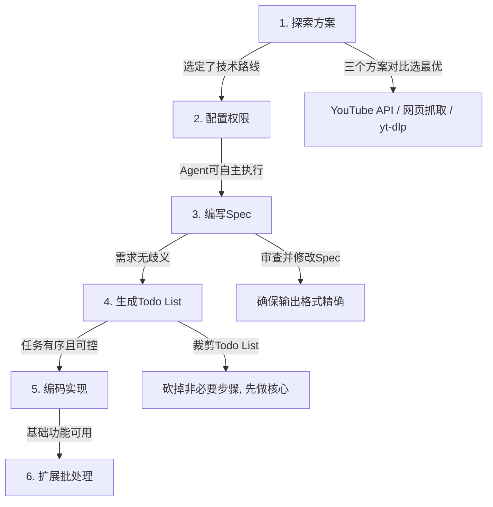

# 用 Claude Code 构建自定义 Agent 命令：从规划到一次成型的工作流

**一句话导读：** 大多数人拿到 AI 编程工具就急着写代码，但真正让 AI 一次写对的秘密是——在写代码之前，先把方案、规格、清单全部想清楚。

---

**适合谁看：**

- 用过 Claude Code 或类似 AI 编程工具，但经常需要反复修改输出结果的人
- 想把重复性研究任务自动化，但不知道如何结构化地设计 Agent 工作流的人
- 内容创作者，需要定期分析竞品频道、行业趋势、多源信息的人
- 产品经理或独立开发者，希望用 AI 快速搭建定制化工具的人
- 对 AI Agent 的实际落地流程感兴趣，想看完整闭环案例的人

---

**读完你会获得什么：**

- 理解 Claude Code 的 Slash Command 机制，知道如何把常用工作流封装成可复用命令
- 掌握"探索→规格→清单→编码"的四阶段工作流，理解为什么这个顺序能大幅提高 AI 一次成功的概率
- 能照着步骤独立创建一个 YouTube 频道分析 Agent，并扩展到其他研究场景
- 理解权限配置、Spec 审查、Todo List 裁剪等实操细节的判断标准
- 能把这套工作流迁移到任何需要 AI 自动化执行的研究任务上

---

## 01 背景：为什么这个问题现在值得讨论

AI 编程工具的普及速度远超预期，但一个普遍的困境是：**工具能力够用，人的使用方式不够用。**

大多数人的典型路径是——打开工具，输入需求，拿到结果，不满意，再改，再改，再改。每次迭代消耗的不是 AI 的算力，而是人的判断力和耐心。

与此同时，内容创作者、研究者、产品经理面临的研究任务越来越频繁：竞品分析、趋势追踪、多源信息整合。手动做一次可能要 2-3 小时，但这类任务的结构高度重复——获取数据、提取特征、分析模式、输出报告。

Claude Code 的 Slash Command 机制恰好处于这两个问题的交叉点：它让你能把一个完整的研究工作流封装成一条命令，而正确的规划流程能让 AI 在编码阶段一次性成功，而不是反复修补。

视频作者 Peter Yang 用一个 YouTube 频道分析 Agent 的完整构建过程，展示了一套可复用的方法论。但视频的价值不在 YouTube Agent 本身——而在那个**先规划后编码**的工作流。

---

## 02 核心判断：视频真正想讲的不是"怎么做 YouTube Agent"

视频的表面内容是：用 Claude Code 搭建一个 YouTube 频道研究工具。但它的真实命题是：

**AI Agent 的编码质量，取决于你在编码前投入的规划质量。**

视频中有一句关键的话："I've been following this process for a long time and I haven't run into a case where Claude hasn't one-shot the actual code, because we've done all these preceding steps."

这是一个强判断。它的逻辑是：AI 一次写对代码，不是因为 AI 聪明，而是因为你把歧义、遗漏、方向错误全部在编码之前解决了。

这意味着：如果你跳过规划直接让 AI 写代码，你不是在节省时间——你是在把规划的成本转移到调试阶段，而且调试阶段的理解成本远高于规划阶段。

---

## 03 概念澄清：先把关键名词讲准确

### Claude Code

- 它是什么：Anthropic 推出的命令行 AI Agent 工具，能读写文件、执行命令、搜索代码，以对话方式完成编程和自动化任务
- 它解决什么问题：让 AI 不只是回答问题，而是直接在你的项目环境中执行操作
- 它不是什么：它不是 IDE，不是代码补全工具，不是只会写代码的 ChatGPT
- 和相关概念的区别：GitHub Copilot 是"补全代码"，Claude Code 是"完成整个任务"，包括规划、编码、测试、调试
- 简单例子：你告诉它"帮我建一个 YouTube 数据分析工具"，它会自己写代码、装依赖、运行命令、生成结果文件

### Plan Mode

- 它是什么：Claude Code 的一种模式，在此模式下 AI 只讨论和规划，不执行任何代码修改
- 它解决什么问题：让你在不产生副作用的前提下，和 AI 自由讨论方案
- 它不是什么：它不是"更慢的模式"，不是"只读模式"，而是一个有意识的规划阶段
- 和直接编码的区别：直接编码是"做"，Plan Mode 是"想清楚再做"
- 简单例子：在 Plan Mode 中问"有几种方式实现 YouTube 数据获取？"，AI 会列出方案对比，但不会动手写代码

### Slash Command

- 它是什么：Claude Code 中自定义的可复用命令，把一个完整的 Prompt + 工作流封装成 `/命令名` 的形式
- 它解决什么问题：把常用的复杂操作变成一键触发，避免每次都写长 Prompt
- 它不是什么：它不是系统内置命令（如 `/help`），而是用户自己定义的
- 和普通 Prompt 的区别：普通 Prompt 是一次性的，Slash Command 是可沉淀、可迭代、可分享的
- 简单例子：定义 `/youtube` 命令后，输入 `/youtube peteryangyt` 就能自动获取频道数据并生成分析报告

### Spec（规格文档）

- 它是什么：在编码之前写的一份结构化需求文档，定义命令的输入、输出、格式、行为
- 它解决什么问题：把模糊的意图变成精确的规格，消除 AI 编码时的歧义
- 它不是什么：它不是 PRD，不是用户故事，它是给 AI 看的"施工图纸"
- 和 Todo List 的区别：Spec 定义"做什么"，Todo List 定义"按什么顺序做"
- 简单例子：Spec 里写"输出格式：5 条关键洞察 + 3 个下期选题建议 + Top 10 视频列表"，AI 就不会自由发挥输出格式

### yt-dlp

- 它是什么：一个开源命令行工具，能从 YouTube 等视频平台提取视频元数据和下载内容
- 它解决什么问题：绕过 YouTube 官方 API 的配额限制和账号要求，直接获取视频信息
- 它不是什么：它不是 YouTube 官方工具，不是 API 封装库
- 和 YouTube Data API 的区别：API 需要 Google Cloud 账号和密钥，有配额限制；yt-dlp 直接解析页面，无配额但有被限制的风险
- 简单例子：运行 `yt-dlp --flat-playlist --print "%(title)s %(view_count)s" CHANNEL_URL`，直接拿到频道视频标题和播放量

---

## 04 整体框架：这套内容应该如何理解

整个工作流可以用一个决策链来理解——每一步都在为下一步消除不确定性：

**文字解释：**

这个流程的核心逻辑是**不确定性递减**。每一步都在为下一步扫清障碍：

- **探索方案**解决"走哪条路"——方向错误是一切浪费的根源
- **配置权限**解决"AI 能不能放手干"——频繁的权限确认会打断 AI 的执行流
- **编写 Spec**解决"做成什么样"——输出格式的歧义是 AI 产出偏差的第一大原因
- **生成 Todo List**解决"按什么顺序做"——防止 AI 跳步或遗漏
- **编码实现**是前面所有准备的自然结果——此时不确定性已经降到最低
- **扩展批处理**是在核心功能验证后的增量迭代

注意：编码是第五步，不是第一步。这不是流程的终点，而是规划的结果。

---

## 05 关键机制：先规划后编码为什么有效

### 机制一：方案探索消除方向性返工

- **输入**：一个模糊的需求（"我想做一个 YouTube 分析工具"）
- **中间处理**：让 AI 在 Plan Mode 下列出 2-3 种技术路线，对比优劣
- **输出**：一个明确的技术选型决策（视频中选择 yt-dlp）
- **为什么这样设计**：需求越模糊，AI 自作主张的空间越大，方向错误的概率越高。方案探索是在用最低成本排除最差选项
- **代价**：多花 5-10 分钟讨论。但这是保险费，不是浪费
- **适合场景**：需求模糊、技术路线不唯一、你没有明确偏好时。不适合你已经有成熟方案的情况

### 机制二：Spec 审查消除输出歧义

- **输入**：你脑中对"理想输出"的模糊想象
- **中间处理**：让 AI 把这个想象写成具体规格，你再逐条审查修改
- **输出**：一份双方（你和 AI）对齐的规格文档
- **为什么这样设计**：AI 无法读取你的内心。你想要的"关键洞察"和 AI 理解的"关键洞察"可能完全不同。Spec 就是把隐式期望变成显式约束
- **代价**：需要你认真审查和修改 Spec，不能扫一眼就过
- **适合场景**：输出格式有明确要求、你对结果有品味标准时。不适合你真的"随便什么都行"的情况

### 机制三：Todo List 裁剪防止范围失控

- **输入**：Spec 中定义的完整需求
- **中间处理**：让 AI 把 Spec 拆成有序的 Todo List，你决定做哪些、砍哪些
- **输出**：一个精简的、有序的实施清单
- **为什么这样设计**：AI 生成的 Todo List 往往包含错误处理、缓存、日志等"好事"。但在首次实现中，这些好事会增加复杂度和出错面。先做核心流程，验证可行性，再追加增强功能
- **代价**：你可能在后续迭代中要补回被砍掉的功能
- **适合场景**：首次实现、功能验证阶段。不适合已经稳定需要补全健壮性的阶段

---

## 06 方法拆解：从零搭建一个 YouTube 研究 Agent

### 步骤一：在 Plan Mode 中探索方案

**目标**：确定技术路线，不急着动手。

**具体动作**：
1. 在 Claude Code 中按 `Shift+Tab` 切换到 Plan Mode
2. 输入你的需求描述，明确要求"探索三种不同方案"
3. Prompt 示例：`我想做一个工具，输入 /youtube 频道名，输出该频道的 Top 视频和关键洞察。请探索三种不同实现方式`

**判断标准**：AI 给出的方案之间有实质差异（如数据源不同、架构不同），而不是同一方案的微调变体。

**常见坑**：
- 看到方案就想直接让 AI 开始编码——不要。Plan Mode 的意义就是讨论，不是执行
- 只看推荐的方案就选——应该对比所有方案的权衡

**产出物**：一个明确的技术选型决策。

### 步骤二：配置权限让 Agent 自主执行

**目标**：让 AI 在编码阶段不被权限确认打断。

**具体动作**：
1. 输入 `/permissions` 命令
2. 在生成的配置文件中添加允许的工具和命令
3. 关键权限：`Read`（读文件）、`Write`（写文件）、`Bash(npm*)`、`Bash(yt-dlp*)`、`WebSearch`

**判断标准**：权限列表覆盖了实现方案所需的所有操作，但不包含不必要的危险操作（如 `rm -rf`）。

**常见坑**：
- 给了过多权限——应该只开放当前任务需要的
- 忘记保存到 `.claude/settings.local.json`——下次启动又要重新配置

**产出物**：一份配置好的权限文件，AI 可以无中断地执行操作。

### 步骤三：编写并审查 Spec

**目标**：把模糊需求变成精确规格，尤其是输出格式。

**具体动作**：
1. Prompt：`创建一个 Spec 文件 youtube-command-spec.md，定义 /youtube 命令的完整行为`
2. 明确指定：输入格式、数据来源、输出板块、每个板块的内容要求、理想输出格式的示例
3. AI 生成 Spec 后，逐条审查：哪些字段不需要？输出格式是否精确？有没有遗漏的约束？
4. 直接修改 Spec 文件，删除不需要的部分，补充缺失的部分

**判断标准**：一个没参与过讨论的人读完 Spec，能准确知道输出应该长什么样。

**常见坑**：
- 不审查 Spec 直接进入下一步——这是整个流程中最容易犯的错误，也是代价最大的错误
- Spec 中遗漏输出格式示例——AI 会自行推断，推断结果往往和你的期望有偏差

**产出物**：一份经过审查和修改的、你和 AI 都认同的规格文档。

### 步骤四：生成并裁剪 Todo List

**目标**：把 Spec 转成有序的实施步骤，并控制范围。

**具体动作**：
1. Prompt：`基于 Spec 创建一个 Todo List 来实现 /youtube 命令`
2. 审查 AI 生成的 Todo List，识别哪些是核心功能、哪些是增强功能
3. 裁剪策略：首次实现只保留核心步骤（视频中选择只做步骤 1-7，砍掉错误处理、缓存等）

**判断标准**：Todo List 的每一步都指向一个明确的可交付物，没有"锦上添花"的步骤。

**常见坑**：
- 全盘接受 AI 的 Todo List——AI 倾向于生成"理想完整"的清单，首次实现不需要
- 裁剪过度砍掉核心功能——确保最小可用路径完整

**产出物**：一个精简的、有序的实施清单。

### 步骤五：编码实现

**目标**：让 AI 按照规划和规格编码，一次成型。

**具体动作**：
1. Prompt：`按照 Todo List 实现 /youtube 命令`
2. AI 编码完成后，用真实频道测试：`/youtube peteryangyt`
3. 检查输出：洞察是否合理？链接是否有效？数据是否准确？
4. 发现问题直接反馈给 AI 修正

**判断标准**：基础功能可用，输出格式符合 Spec，核心数据准确。

**常见坑**：
- 跳过前四步直接编码——大概率需要多轮修改
- 测试只用示例数据——必须用真实数据验证

**产出物**：一个可运行的 Slash Command。

### 步骤六：扩展批处理能力

**目标**：从"单次执行"升级为"批量处理"。

**具体动作**：
1. 创建 `youtube-channels.md` 文件，列出要分析的频道列表
2. 更新 Spec 和命令逻辑：如果命令没有指定频道，就从文件中读取所有频道并逐一处理
3. 测试：不指定频道运行命令，检查是否所有频道都被处理

**判断标准**：批处理结果与单次处理结果质量一致。

**常见坑**：
- 一次加入太多频道——应该先少量验证，再扩展

**产出物**：一个支持批量处理的 Slash Command。

---

## 07 案例讲解：从需求到产出的完整过程

**场景背景**：Peter Yang 是一位 AI 教程创作者，他想知道自己和同领域创作者的内容表现模式——什么类型的视频播放量高？标题有没有规律？下一步应该做什么内容？

**遇到的问题**：手动分析一个频道需要打开页面、浏览视频列表、记录数据、归纳规律，一个频道至少 20-30 分钟。五个频道就是 2-3 小时。而且归纳全凭感觉，缺乏数据支撑。

**按框架如何处理**：

1. **探索方案**：YouTube Data API 可靠但需要账号和配额；网页抓取不可靠；yt-dlp 开源且无配额限制——选择 yt-dlp
2. **配置权限**：开放文件读写和 yt-dlp 执行权限，让 AI 不被权限确认打断
3. **编写 Spec**：定义输出格式为"关键洞察（5 条）+ 下期选题建议（3 个）+ Top 10 视频列表（含链接和播放量）"，逐条审查后删除不需要的上传日期字段
4. **生成 Todo List**：AI 列出 12 步，裁剪到前 7 步核心流程
5. **编码**：AI 一次实现成功，测试频道 `peteryangyt`，输出包含洞察（长教程比短视频播放量高 3 倍）、标题规律（"tutorial""complete guide"表现好）、Top 10 列表
6. **扩展批处理**：创建频道列表文件，包含 5 个频道，命令自动处理全部

**最终结果**：
- Peter Yang 的频道洞察：45-60 分钟的实战教程播放量最高，标题带"tutorial"或"complete guide"效果好
- Lenny's Podcast：创始人访谈和名人嘉宾节目播放量更高
- Greg 的频道：创业想法验证类视频播放量是其他类型的 4 倍
- Tina 的频道：AI 工具和生产力内容播放量是其他类型的 5 倍

**说明了什么**：手动完成同样分析可能需要 2-3 小时，用 Agent 工作流约 15-20 分钟。更重要的不是时间节省，而是**分析的一致性和可重复性**——你随时可以用同样的命令重新分析，结果结构保持一致。

---

## 08 常见误区

**误区一：拿到工具就写代码**

- 错误理解：AI 编程工具这么强，直接告诉它需求就行
- 为什么错：模糊需求 → AI 自行推断 → 输出和预期不符 → 反复修改 → 总时间反而更长
- 正确理解：AI 的编码能力越强，规划质量对结果的影响越大
- 应该怎么做：先在 Plan Mode 中把方向、规格、步骤全部确定，再让 AI 编码

**误区二：Spec 写完就过**

- 错误理解：AI 生成的 Spec 大概看看就行，细节编码时再调
- 为什么错：Spec 中的每一个模糊点都会在编码阶段放大成返工。输出格式的歧义是 AI 产出偏差的第一大原因
- 正确理解：Spec 审查是整个流程中投入产出比最高的环节
- 应该怎么做：逐条审查，特别关注输出格式示例，删除不需要的字段，补充缺失的约束

**误区三：Todo List 越完整越好**

- 错误理解：AI 列了 12 步就全做，越完整越不容易遗漏
- 为什么错：首次实现包含错误处理、缓存、日志等增强功能，增加了复杂度和出错面，反而降低了一次成功的概率
- 正确理解：首次实现追求最小可用路径，增强功能在验证核心功能后再追加
- 应该怎么做：识别核心步骤和增强步骤，首次只做核心

**误区四：权限配置可有可无**

- 错误理解：权限确认就是点一下的事，不值得专门配置
- 为什么错：频繁的权限确认会打断 AI 的执行流，尤其是批量任务时，你可能要坐在电脑前不断点击确认
- 正确理解：权限配置是让 AI 进入"无人值守"模式的前提
- 应该怎么做：项目开始时花 2 分钟配置好权限，后续省下大量交互时间

**误区五：这个工作流只适用于编程任务**

- 错误理解：Slash Command 是编程工具，只有写代码才用得上
- 为什么错：Slash Command 的本质是"可复用的自动化工作流"，编码只是其中一种执行方式
- 正确理解：任何结构化的研究、分析、生成任务都可以用同样模式封装
- 应该怎么做：用同样的"探索→Spec→Todo→编码"流程，构建日常简报、行业研究、信息摘要等非编程类命令

**误区六：AI 一定能一次写对**

- 错误理解：按流程走就保证一次成功，不需要测试
- 为什么错："一次写对"的前提是规划充分且需求合理。如果需求本身有矛盾或遗漏，再好的流程也无法弥补
- 正确理解：流程大幅提高一次成功的概率，但不能替代测试和验证
- 应该怎么做：编码完成后必须用真实数据测试，检查输出的合理性、准确性和格式合规性

---

## 09 实战清单

**立即能做：**

1. 打开 Claude Code，按 `Shift+Tab` 进入 Plan Mode，把你手头的一个重复性任务描述给 AI，要求它探索三种实现方案
2. 输入 `/permissions`，为当前项目配置基本权限（文件读写 + 常用命令），保存到项目本地配置
3. 检查你当前项目中是否有常用的长 Prompt，如果有，考虑将其封装成 Slash Command

**一周内能做：**

4. 选一个你每周都要手动做的研究任务（竞品分析、行业简报、内容复盘），按照"探索→Spec→Todo→编码"流程构建一个 Slash Command
5. 用真实数据测试命令输出，重点检查：输出格式是否符合预期、数据是否准确、洞察是否有价值
6. 如果命令可用，为它添加批处理能力——从文件读取输入列表，一次处理多条

**长期要沉淀：**

7. 建立自己的 Slash Command 库，按用途分类（研究类、生成类、分析类），每个命令配套一份 Spec
8. 每次使用命令后，记录输出的不足之处，定期迭代 Spec 和命令逻辑
9. 把"探索→Spec→Todo→编码"变成你使用任何 AI Agent 工具时的默认流程，而不限于 Claude Code

---

## 10 总结

Claude Code 的 Slash Command 机制，本质上是一个"把人的工作流编码为 AI 的执行流"的工具。你定义规则，AI 按规则执行，输出结构稳定、可重复、可迭代。

但这个机制能否发挥作用，取决于一件更上游的事：你在让 AI 动手之前，有没有把方向想清楚、把规格写清楚、把步骤理清楚。

视频中展示的六步流程——探索方案、配置权限、编写 Spec、生成 Todo List、编码实现、扩展批处理——它的核心不是步骤本身，而是**顺序**。编码排在第五位，前面四步都是规划。这不是低效，这是在用最低成本消除最大的不确定性。

视频作者说，遵循这个流程后，AI 编码几乎都能一次成功。这个判断可能偏乐观——需求复杂度和 AI 的理解能力之间存在天然张力。但方向是对的：**规划投入和返工成本之间，存在强烈的负相关。** 你在规划阶段省下的每一分钟，都会在调试阶段以倍数偿还。

真正值得记住的只有一句话：**AI 不是在替你思考，它是在执行你已经想清楚的事。如果你自己没想清楚，AI 只会更快地输出一个你不想要的结果。**
