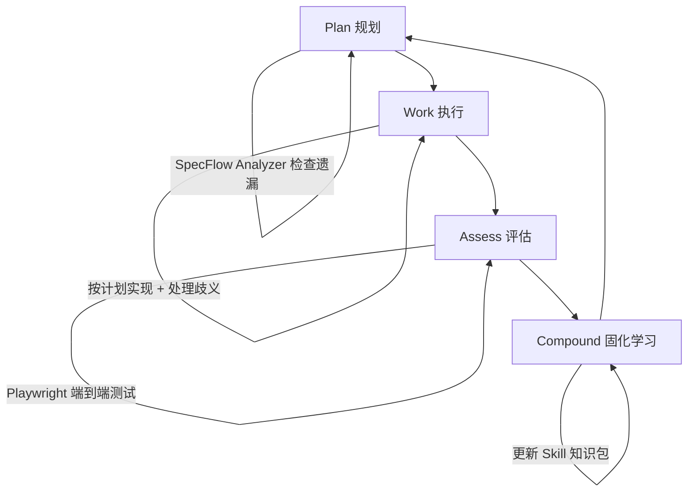

# Compound Engineering：让 AI 每次都比上次更懂你

## 一句话导读

AI 编程工具的真正价值不是替你写代码，而是建立一个每次使用都比上次更好的学习循环。

## 适合谁看

- 正在用 Claude Code / Cursor 等 AI 编程工具，但感觉每次都要重新教 AI 的开发者
- 带 AI 辅助团队写代码，想建立可复用工程实践的技术负责人
- 已经在用 AI 写代码但不敢放手、总想逐行审查的工程师
- 想理解 Skills、Subagents、Hooks、Commands 这些概念到底怎么配合使用的 Claude Code 用户
- 对 AI 时代工程方法论演进感兴趣的从业者

## 读完你会获得什么

- 理解 Compound Engineering 四步循环的完整逻辑，知道为什么缺了任何一步都会失效
- 分清 Claude Code 中 Commands、Subagents、Skills 三个概念的区别和使用场景
- 掌握用 Playwright 做 AI 驱动端到端测试的方法
- 知道如何把 AI 的错误转化为持久知识，避免重复犯错
- 获得一套可立即照做的 AI 编程工作流清单

---

## 01 背景：为什么这个问题现在值得讨论

AI 编程工具已经普及，但一个普遍的痛点是：每次开新对话，AI 都像新员工第一天上班——你之前纠正过它的错误，它全忘了；你之前建立的模式，它不知道。

过去的做法是两种极端：要么逐行审查 AI 写的每一行代码（本质上是把 AI 当高级自动补全），要么完全放手（结果质量不可控）。两种方式都没有解决核心问题——**AI 的经验无法累积**。

Claude Code 等工具已经提供了 CLAUDE.md、Skills、Hooks 等机制来让 AI 记住上下文，但大多数人不系统使用这些机制。Compound Engineering 要做的，就是把这些散落的机制组织成一个可运行的闭环。

## 02 核心判断：AI 编程的真正杠杆不是写代码的速度

视频表面在讲一个 Claude Code 插件的用法，实际在讲一个更深层的判断：

**AI 编程的核心杠杆不是让 AI 写代码更快，而是让 AI 每次写代码都比上次更准确。**

这意味着：如果你只用 AI 做一次性任务（写个脚本、修个 bug），你只用了 AI 10% 的潜力。AI 真正的威力在于——它是一个可以从错误中学习的系统，前提是你把每次纠错都固化下来。

Koen 原话的关键洞察：*"AI can learn. If you invest time to have the AI learn what you like and learn what it does wrong, it won't do it the next time."*

这不是一个功能描述，而是一个工程原则。围绕它，需要一套完整的实践体系。

## 03 概念澄清：先把关键名词讲准确

### Compound Engineering

- **是什么**：一种 AI 辅助开发哲学，核心是四步循环——Plan（规划）、Work（执行）、Assess（评估）、Compound（固化学习）
- **解决什么问题**：AI 每次对话都从零开始，无法积累经验和偏好
- **不是什么**：不是自动化流水线，不是 AI 替你做所有决定，不是无需人工介入的全自动流程
- **和相关概念的区别**：传统 CI/CD 是代码提交后自动跑检查；Compound Engineering 是在开发过程中就持续捕获学习，影响下一次开发
- **简单例子**：AI 帮你实现了功能，但你发现它创建了 10 个独立的工具函数。你纠正它"应该合并成一个通用工具"。Compound 的动作是把这条经验写入文档，下次 AI 写计划时自动参考

### Skill（技能）

- **是什么**：一种"按需加载"的知识包——包含文档、参考链接、可执行脚本，AI 在需要时自动拉取
- **解决什么问题**：有些知识很重要但体积大，全部塞进上下文会撑爆 token 预算
- **不是什么**：不是常驻提示词，不是插件，不是简单的 markdown 文件引用
- **和相关概念的区别**：CLAUDE.md 是始终加载的全局指令；Skill 是"刚好在需要时加载"的专题知识
- **简单例子**：你有一个关于"Agent 原生架构"的 2000 字文档。不需要每次对话都加载，只在涉及 agent 架构设计时 Skill 才被激活

### Subagent（子代理）

- **是什么**：在独立上下文中运行的 AI 代理，执行特定任务后返回结果给主线程
- **解决什么问题**：主线程上下文有限，且某些任务适合并行执行
- **不是什么**：不是新的对话窗口，不是简单的函数调用，不是始终在后台运行的后台进程
- **和相关概念的区别**：Command 是你主动触发的指令；Subagent 是被 Command 调用来执行具体工作的隔离执行单元
- **简单例子**：计划阶段同时启动三个 Subagent——一个读你的代码库，一个搜最佳实践文章，一个查框架版本——结果汇总后形成计划

### SpecFlow Analyzer

- **是什么**：用用户角色（persona）走一遍功能流程，检查是否有遗漏
- **解决什么问题**：AI 规划时容易过度聚焦细节，忘记整体流程中的缺失环节
- **不是什么**：不是自动化测试，不是代码审查，不是用户调研
- **简单例子**：AI 规划了"设置页面的 agent 功能对等"，但漏掉了"用户编辑"这个子页面。SpecFlow Analyzer 用"新用户"角色走一遍流程，发现遗漏

## 04 整体框架：Compound Engineering 四步循环



**文字解释**：

这个循环的核心逻辑是——每次开发不是从零开始，而是站在上次积累的基础上。

- **Plan** 不只是"写个计划"，而是让 AI 先做三项研究（代码库、最佳实践、框架版本），再用 SpecFlow Analyzer 查漏，最后才输出计划
- **Work** 按计划执行，但会在开始前处理歧义（比如"这个字段是可选还是必填？"）
- **Assess** 不只看代码，而是从多个角色视角（安全、架构、简洁性、产品契合度）综合评估
- **Compound** 把评估中发现的问题、纠正、更好的方案都固化为知识，写入文档或 CLAUDE.md，下次 Plan 时自动生效

**关键设计：Plan 阶段就应该纠正方向，而不是 Work 完了再回头。** Koen 反复强调的一点：*"If you start implementing and then half an hour later want to change direction, it's much harder."* 越早纠正，成本越低。

## 05 关键机制：每一步到底在做什么

### 5.1 Plan 阶段——三项研究 + 查漏

**输入**：一段自然语言需求描述（Koen 用语音输入，不手打字）

**处理**：
1. 代码库研究——Subagent 读你的现有代码，识别已有模式和风格
2. 最佳实践研究——Subagent 搜索相关文章，了解社区推荐做法
3. 框架研究——Subagent 检查你使用的框架/库版本，确保方案匹配
4. SpecFlow Analyzer——用用户角色走一遍功能流程，找遗漏

**输出**：一份结构化的实施计划

**为什么这样设计**：普通 `plan` 命令只看代码库，容易忽略社区实践和版本兼容性。三项研究确保计划不是闭门造车。

**代价**：Token 消耗大。三个 Subagent 各自消耗 5-7k token。需要 Max 计划（$200/月）才能跑得动。

**适合场景**：中大型功能开发、涉及多模块的架构决策、首次实现某类功能。

**不适合场景**：简单 bug 修复、改几行配置的小改动——杀鸡不用牛刀。

### 5.2 Work 阶段——不只是执行

**输入**：Plan 阶段的输出（markdown 格式的计划）

**处理**：
1. 检查计划中的歧义点，提出澄清问题
2. 为每个歧义做出判断（用户可以交互决策，也可以让 AI 自行判断）
3. 制定执行顺序
4. 逐步实现

**输出**：实现代码 + 提交记录

**为什么这样设计**：Work 不只是"照做"，而是先处理模糊地带。这避免了 AI 在执行中自行猜测导致的偏离。

**关键细节**：Koen 建议在开始 Work 前开一个新会话，因为"所有上下文都已经捕获在计划中了"。清空上下文可以减少干扰。

### 5.3 Assess 阶段——多角色审查 + Playwright 测试

**输入**：Work 的产出代码

**处理**：
1. 多角色 Review——安全审查员、架构审查员、代码简洁性审查员、产品契合度审查员，各自独立评估
2. 综合汇总——所有审查结果合成优先级列表（P1 紧急/P2 重要/P3 改进）
3. Playwright 端到端测试——AI 启动浏览器，像真实用户一样操作整个流程
4. Triage 对话式引导——不让你读长报告，而是 AI 逐条带你过发现的问题，你来决策

**输出**：按优先级排列的问题清单 + 每条的处理决策

**Playwright 的特殊价值**：这是 Opus 4 之后才真正可用的能力。之前的模型用 Playwright 效果差，Opus 4 是第一个能让 Playwright 稳定运行的模型。它不只是写测试——它启动浏览器、点击按钮、读控制台日志、甚至录屏。如果发现问题，它可以直接修复并验证修复是否生效。对于需要登录第三方服务（如 Gmail）的测试，传统集成测试做不到，但 Playwright 可以用真实浏览器操作。

**为什么这样设计**：代码审查容易只看代码层面，而 Playwright 补上了"功能是否真的能用"这一环。两者结合，既看代码质量，又看功能完整性。

### 5.4 Compound 阶段——让 AI 记住这次学到的东西

**输入**：Assess 阶段的所有发现和纠正

**处理**：
1. 识别哪些发现是"可复用的教训"（不只是本次 bug，而是通用原则）
2. 写入 `docs/` 目录，按架构决策、解决方案、最佳实践分类
3. 检查是否与已有知识关联，如果是则追加而非新建
4. 可选：更新 CLAUDE.md（最简单的方式）

**输出**：持久化的知识文档

**两种实现路径**：

- **轻量版**：直接告诉 Claude Code "下次别犯这个错误"，它会写入 CLAUDE.md。适合通用性强的偏好（如"不要用 X 库"）
- **完整版**：运行 Compound 流程，它会自动分析、分类、关联、存储。适合结构化的架构决策

**为什么这样设计**：没有这一步，整个循环就退化为"计划-执行-评估"的一次性流程。Compound 让它变成真正的飞轮。

## 06 方法拆解：从零搭建 Compound Engineering 工作流

### 第一步：安装 Compound Engineering 插件

**目标**：让你的 Claude Code 拥有完整的工作流命令

**具体动作**：
```
# 在你的项目目录执行
claude mcp add compound-engineering
# 安装插件
```

**判断标准**：在 Claude Code 中输入 `/workflow-plan` 能被识别

**常见坑**：插件是开源的，但需要 Max 计划才能流畅跑完整流程（Subagent token 消耗大）

**产出物**：配置好的 Claude Code 环境

### 第二步：用 workflow-plan 做规划

**目标**：生成一份基于代码库、最佳实践和框架研究的实施计划

**具体动作**：
1. 在 Claude Code 中输入 `/workflow-plan`
2. 用自然语言描述你要做什么（越具体越好）
3. 等待三个 Subagent 完成研究（约 2-5 分钟）
4. 审查输出计划，看是否有遗漏或方向偏差
5. 如果有问题，直接在对话中提出修正，然后运行"compound"让 AI 记住这次纠正

**判断标准**：计划能覆盖所有功能点，没有明显的架构问题

**常见坑**：
- 需求描述太模糊——AI 会自行猜测，结果可能偏离预期
- 不审查直接进入 Work——发现方向错时已经浪费大量 token

**产出物**：一份 markdown 格式的实施计划

### 第三步：用 workflow-work 执行

**目标**：按计划实现功能

**具体动作**：
1. 开一个新会话（清空上下文）
2. 输入 `/workflow-work`，粘贴计划内容
3. 回答 AI 提出的歧义问题
4. 等待实现完成

**判断标准**：代码通过基础功能验证

**常见坑**：不处理歧义就让它"just go"——小问题会滚成大问题

**产出物**：实现的代码 + git 提交

### 第四步：用 Playwright 做端到端测试

**目标**：验证功能在真实浏览器中是否可用

**具体动作**：
1. 确保 Playwright 已安装
2. 在 Claude Code 中说"用 Playwright 测试这个功能"
3. AI 会自动启动浏览器、执行用户流程、截图/录屏
4. 如果发现问题，AI 会直接修复并重新验证

**判断标准**：功能在浏览器中可正常操作，无崩溃

**常见坑**：Playwright 测试不是传统自动化测试——它更像是让 AI 临时当 QA，不会长期保留测试用例

**产出物**：测试通过确认 + 可选的录屏视频

### 第五步：用 workflow-review 做多角色审查

**目标**：从安全、架构、简洁性等角度审查代码

**具体动作**：
1. 输入 `/workflow-review`
2. 多个 Subagent 从不同角色审查代码
3. 查看综合评估结果（P1/P2/P3 优先级）
4. 运行 triage，让 AI 逐条带你决策
5. 确认要修复的项目
6. 运行 `resolve-todo-parallel` 批量修复

**判断标准**：无 P1 问题，P2 问题有明确处理计划

**常见坑**：审查后直接让 AI 修复所有问题——应该先 triage 确认优先级，避免范围扩大

**产出物**：修复后的代码 + PR

### 第六步：Compound 学习

**目标**：把本次开发中的教训固化为持久知识

**具体动作**：
1. 输入 `/compound` 或直接说"把这次学到的东西记录下来"
2. AI 会自动分析、分类、写入 `docs/` 目录
3. 检查写入内容是否准确（AI 可能误判什么是通用教训）

**判断标准**：下次 Plan 阶段 AI 自动参考了这些知识

**常见坑**：记录太多噪音——不是每个小问题都值得固化，只有"下次可能再犯"的才值得

**产出物**：`docs/` 目录下的知识文件 + 更新的 CLAUDE.md

## 07 案例讲解：让 Cora 助手拥有与用户对等的设置能力

**场景背景**：Cora 是一个邮件助手产品，能筛选收件箱、每日两次简报、内置对话助手。产品有一个设置页面，用户可以修改各种配置。但助手（Agent）无法修改这些设置——用户能做的事，Agent 做不了。

**遇到的问题**：需要实现"Agent Native"——让 Agent 能做到用户能做的一切。不是逐步添加功能，而是系统性对等。

**按框架如何处理**：

**Plan 阶段**：Koen 用语音描述需求："让助手能修改用户在设置页面能修改的所有内容。先梳理用户能做什么，再确保助手也能做。" 三个 Subagent 分别研究代码库、搜最佳实践、查框架版本。SpecFlow Analyzer 用用户角色走流程，发现遗漏了"用户编辑"和"安全设置"页面。

**关键纠正**：Plan 输出后，Koen 发现 AI 计划创建 10 个独立的工具函数来对应不同设置项。他提出："能不能合并成一个通用工具？" AI 重新规划，改为一个 `update_settings` 工具处理多种设置。这个纠正被 Compound 记录——下次 AI 写类似计划会自动考虑合并。

**Work 阶段**：开新会话，粘贴修改后的计划。AI 提出歧义问题："新用户是否需要先创建账户？"让 AI 自行判断后开始实现。

**Assess 阶段**：Playwright 启动浏览器，像真实用户一样操作设置流程，发现一处遗漏。多角色审查发现需要添加名称长度校验（P2）。

**Compound 阶段**：把"工具函数应合并而非拆分"这条经验写入架构决策文档。

**最终结果**：功能实现、测试通过、PR 创建、经验固化。

**说明了什么**：整个过程中，真正有价值的人工介入只有两处——审查计划时发现工具拆分问题、确认审查优先级。其余全部由 AI 完成。而这两处人工介入都被 Compound 捕获，下次不再需要人工做同样的判断。

## 08 常见误区

### 误区一：Compound Engineering 就是让 AI 全自动

**错误理解**：装上插件，说一句话，等一小时，代码就写好了。

**为什么错**：`lg` 命令确实可以跑全自动流程，但前提是你已经通过多次 Compound 循环训练过 AI。全自动是结果，不是起点。

**正确理解**：Compound Engineering 是渐进式的信任建立过程。先手动走循环，每次都纠正和固化学习，等 AI 的错误率降到可接受范围后，再逐步放手。

### 误区二：Skills 就是高级版 CLAUDE.md

**错误理解**：把所有文档都写成 Skill，以为和写在 CLAUDE.md 里效果一样。

**为什么错**：CLAUDE.md 始终加载，每次对话都占用上下文。Skill 是按需加载，只在相关场景激活。两者解决不同问题。

**正确理解**：CLAUDE.md 写全局规则和偏好（"用 TypeScript"、"测试用 Jest"）；Skill 写专题知识（"如何用 Gemini API 生成图片"、"Agent 原生架构指南"）。

### 误区三：Subagents 和 Commands 是同一种东西

**错误理解**：Subagent 和 Command 都是让 AI 做事的方式，随便用哪个都行。

**为什么错**：Command 是你触发的业务逻辑——"做计划"、"执行工作"、"审查代码"。Subagent 是被 Command 调用的执行单元——独立上下文、可并行、只返回结果。你应该触发 Command，让 Command 内部调度 Subagent。

**正确理解**：Command 是入口，Subagent 是内部机制。你写 Command 来编排流程，Subagent 在 Command 内部被调度执行具体任务。

### 误区四：Playwright 测试可以替代所有测试

**错误理解**：有了 Playwright，不需要写单元测试和集成测试了。

**为什么错**：Playwright 做的是端到端功能验证——"这个按钮点了之后页面正常吗？"它不替代单元测试的逻辑验证，也不替代集成测试的接口校验。

**正确理解**：Playwright 补上了传统测试覆盖不到的一层——真实浏览器中的用户行为验证。三层测试各有各的价值。

### 误区五：dangerously skip permissions 就是"完全信任 AI"

**错误理解**：跳过所有权限检查，AI 想干什么就干什么。

**为什么错**：跳过权限的前提是你的开发环境是安全的沙箱——AI 不会接触生产数据库、不会泄露密钥、不会删除重要数据。跳过权限是为了减少交互中断，不是放弃安全。

**正确理解**：确保你的工作环境是隔离的，然后跳过权限以提升效率。真正的安全检查放在代码合并和部署环节。

### 误区六：Compound 阶段只是写文档

**错误理解**：Compound 就是让 AI 写一堆文档，和写 README 没区别。

**为什么错**：Compound 写的文档有特定目的——它是给 AI 下次 Plan 时自动参考的。如果写了一堆 AI 永远不会查阅的文档，Compound 就失效了。

**正确理解**：Compound 的产出物必须能被 AI 在后续流程中自动发现和使用。写入 `docs/` 目录并建立关键词索引，或更新 CLAUDE.md，确保 AI 能检索到。

### 误区七：必须用完整的 Compound Engineering 流程

**错误理解**：每次开发都要走完整的四步循环，否则就不是 Compound Engineering。

**为什么错**：Koen 明确说过——"You don't need to use all of this." 你可以只用 Plan 阶段，然后手动写代码。你可以只用 CLAUDE.md 做最轻量的 Compound。

**正确理解**：Compound Engineering 是一套工具箱，不是一条流水线。根据任务复杂度选择合适的环节组合。

## 09 实战清单

### 立即能做

- [ ] 把你最近一次纠正 AI 的偏好写入 CLAUDE.md（比如"不要用 X 库"、"测试文件放在 tests/ 目录"）
- [ ] 在 Claude Code 中安装 Compound Engineering 插件
- [ ] 下次做功能开发时，先用 `/workflow-plan` 替代直接说"帮我实现 X"

### 一周内能做

- [ ] 为你项目中重复出现的知识领域创建一个 Skill（比如"项目部署流程"、"API 设计规范"）
- [ ] 试一次 Playwright 端到端测试——对一个已有功能说"用 Playwright 测试这个流程"
- [ ] 跑一次完整的四步循环，把过程中发现的所有纠正都 Compound 下来
- [ ] 在代码审查后，把发现的通用问题写入 CLAUDE.md 或 docs 目录

### 长期要沉淀

- [ ] 建立项目的 docs/ 知识库，按架构决策、解决方案、最佳实践分类，并确保 AI 能检索
- [ ] 根据自己的工作流定制 Compound Engineering 插件——添加你领域特有的 Skill 和 Review 角色
- [ ] 定期做"反向验证"——检查 Compound 写入的知识是否真的在后续 Plan 中被引用了。如果没有，说明存储位置或索引有问题
- [ ] 逐步把重复性高、错误率低的任务交给 `lg` 全自动流程，只在关键节点人工介入

## 10 总结

AI 编程工具的使用者正在分化为两类人：一类把 AI 当打字机用——每次对话都从零开始，纠正过的错误下次还会犯；另一类把 AI 当团队成员用——每次交互都在积累经验，错误率持续下降。

Compound Engineering 的本质不是一套工具或一个插件，而是一个判断：**AI 的价值不在于它现在能做什么，而在于它下次能比这次做得更好。**

四步循环——Plan、Work、Assess、Compound——的每一步都服务于这个判断。Plan 用三项研究确保方向正确；Work 在执行中处理歧义而非忽略歧义；Assess 用多角色审查和浏览器测试覆盖代码审查看不到的盲区；Compound 把每次纠正都转化为持久知识，确保同样的错误不犯第二次。

这个循环的真正威力在第四步。没有 Compound，前三个步骤只是一次性的质量保障流程。有了 Compound，它才变成飞轮——每一次使用都在让下一次更准确、更高效、更需要你介入的地方更少。

未来会走到"一句话完成一个功能"的阶段。但到达那个阶段的前提，是你已经通过足够多的 Compound 循环，把你的偏好、你的架构决策、你的质量标准都教会了 AI。捷径不存在。
