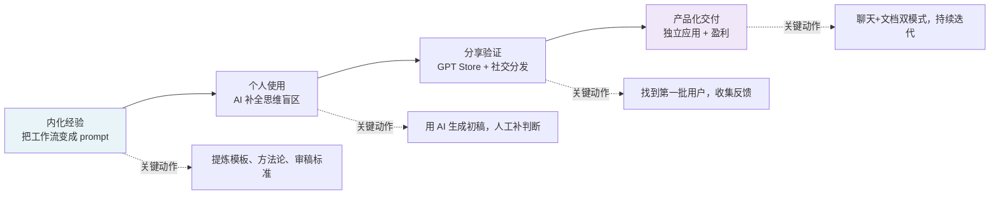

# 一个人 + AI：从内化经验到独立交付产品

# 一句话导读

AI 不只是帮你写文档更快——它正在重新定义"一个人能做什么"，以及产品经理这个角色还剩什么不可替代的价值。

# 适合谁看

- 想用 AI 提升产品工作产出效率的产品经理
- 想把个人经验变成可售卖产品、但团队只有自己的创业者
- 管理产品团队、需要判断 AI 对团队能力结构影响的管理者
- 想用 Zapier + AI API 自动化处理日常信息洪流的任何人
- 对"AI 时代还需要产品经理吗"这个问题有真实困惑的人

# 读完你会获得什么

- 理解从"个人工作流"到"可售卖产品"的完整路径，以及每步该做什么
- 分清 AI 在产品工作中真正擅长的三件事，以及它做不了的
- 能判断自己团队中 PM 与工程师的比例是否需要调整，以及往哪个方向调
- 能照着搭建两个立刻有用的自动化：招聘邮件处理 + 信息摘要过滤
- 理解为什么"战略思维"反而是最可能被 AI 替代的，以及该往哪个方向补能力
- 重新评估"是否需要融资"这个问题——AI 时代的盈利模型可能变了

---

## 01 背景：为什么这个问题现在值得讨论

产品经理的日常工作有一个结构性矛盾：你需要输出高质量文档（PRD、策略、路线图），但你的日历被会议填满，留给深度写作的时间极少。

这个矛盾过去只能靠两个办法缓解：要么加班，要么招更多初级 PM 来分担。但两个办法都有硬上限——加班有身体极限，招人有预算和组织极限。

Claire Vo 的故事之所以值得拆解，不是因为她又做了一个 AI 工具，而是因为她走通了一条新路径：**先让 AI 解决自己的问题，再把解决方案变成产品，全程一个人完成**。这条路径在两年前几乎不可能走通——一个人无法同时做产品、设计、工程、运营。但现在可以了。

更值得注意的是，她不是工程师，不是 AI 研究者，她是一个资深产品经理。这意味着她验证的事情有普遍性：**如果连产品经理都能一个人做出可盈利的产品，那"一个人能做什么"这个问题的边界，需要重新划。**

---

## 02 核心判断：AI 对产品工作的真正改变不是"写得更快"，而是"补齐你没想到的"

视频表面上在讲一个产品经理如何用 AI 做副业。但它真正在讲的是三层转变：

**第一层：AI 补全思维的盲区。**Claire 反复强调的"aha moment"不是 AI 帮她写快了，而是 AI 提醒她"你需要 filters"——一个她作为 20 年经验的产品经理应该想到但没想到的东西。AI 在这个场景里的角色不是打字员，是另一个 PM 坐在你旁边说"你漏了"。

**第二层：经验从个人脑中变成可复用的系统。**她把多年积累的 PRD 模板、产品思维、审稿标准压进 prompt，从"每次重新想"变成"一次设定、反复调用"。这本质上是把隐性经验显性化、可复制化。

**第三层：一个人可以做过去需要一个团队做的事。**从产品定义到 UI 到工程到部署，她一个人在感恩节假期内完成。不是因为她是全栈天才，而是因为 AI 把每个环节的门槛都降低了。

这三层叠加的结果是：**产品工作的瓶颈从"执行能力"转移到了"判断力和愿景"。** 而这恰恰引出一个反直觉的推论——最可能被 AI 替代的，不是执行层，而是战略层。后文会展开。

---

## 03 概念澄清：先把关键名词讲准确

### PRD（Product Requirements Document，产品需求文档）

- **它是什么**：定义"要做什么"以及"为什么做"的文档，是产品从想法到执行的起点
- **它解决什么问题**：让产品、工程、设计对齐到同一份理解上，避免各做各的
- **它不是什么**：不是技术文档，不是项目计划，不是用户手册
- **和相关概念的区别**：PRD 定义"做什么"，技术规格定义"怎么做"，项目计划定义"什么时候做完"
- **例子**：你要给产品加团队协作功能，PRD 里写的是"团队需要共享模板和计费"以及"用户是谁、成功标准是什么"，不是"用 Stripe API 接支付"

### ChatPRD

- **它是什么**：一个 AI 驱动的 PRD 写作工具，包含聊天模式和文档模式
- **它解决什么问题**：PM 写 PRD 时需要从空白页开始、容易遗漏功能点、模板不一致
- **它不是什么**：不是通用 AI 助手，不是项目管理工具，不是 Notion 替代品
- **和相关概念的区别**：GPT Store 里的自定义 GPT 只有聊天能力，ChatPRD 增加了文档持久化、自定义模板、用户记忆、迭代式写作
- **例子**：你在聊天模式中说"帮我写一个团队功能的 PRD"，它生成初稿；你说"用户故事太粗了，展开细节"，它补充；你切换到文档模式，可以直接编辑最终稿

### Solo Building（单人构建）

- **它是什么**：一个人完成产品设计、开发、部署的全过程
- **它解决什么问题**：传统团队中产品-设计-工程之间的沟通损耗和愿景失真
- **它不是什么**：不是"什么都自己硬扛"，而是用 AI 填补每个角色的能力缺口
- **和相关概念的区别**：Indie Hacker 强调小团队创业，Solo Building 强调一人多角色且 AI 补位
- **例子**：Claire 用 ChatPRD 定义产品，用 Copilot 写代码，用 Tiptap 做文档编辑器——三个角色，一个人，AI 是每个角色的"副驾驶"

### 战略思维的可替代性

- **它是什么**：将既有框架（如商业模式画布、竞争分析）应用于具体业务问题的能力
- **它解决什么问题**：帮组织决定"往哪走"
- **它不是什么**：不是"远见"或"创造新范式的想象力"，后者仍然不可替代
- **和相关概念的区别**：战略思维是"套框架做判断"，愿景力是"没有框架时设定方向"
- **例子**：AI 能帮你做竞品分析和市场定位（战略思维），但"苹果应该做 iPhone"这种判断（愿景力），AI 做不了

---

## 04 整体框架：从个人效率到产品交付的完整路径

Claire 的故事可以用一个四阶段模型概括：

**阶段一：内化经验。** 你必须先有自己的方法论。Claire 有 20 年 PM 经验和成熟的 PRD 模板。AI 不能凭空创造好的 prompt——好 prompt 来自好经验的压缩。没有经验的人写不出好 prompt，就像不懂做饭的人写不出好菜谱。

**阶段二：个人使用。** 用 AI 做自己真实的工作，发现它能补什么、不能补什么。Claire 的关键发现是：AI 最大的价值不是写得快，而是提醒你漏了什么。这个发现只有在真实工作中才能获得。

**阶段三：分享验证。** 把你的 prompt/product 放出去，看有没有人用。Claire 的优势是她有产品内容的社交影响力，但这不是必须的——GPT Store 本身就是分发渠道。关键是有渠道验证需求是否真实。

**阶段四：产品化交付。** 从 prompt 变成应用，从一次性生成变成可迭代的工作流。ChatPRD 和 GPT Store 版本的差异是：记忆、自定义模板、文档持久化、聊天-文档双模式。每一个功能都来自用户的真实反馈。

**这四个阶段的本质是：个人经验 → 可复用系统 → 可验证需求 → 可盈利产品。** 每一步都需要前一步的基础。跳过任何一步，后面的步骤都会塌。

---

## 05 关键机制：AI 在产品工作中的三种角色

### 角色一：思维补全器——"你漏了"

- **输入**：你的粗略想法 + 业务背景 + 模板结构
- **处理**：将你的输入与模板中所有"应该有的章节"做比对，发现缺失项
- **输出**：一个完整的、没有明显遗漏的 PRD 初稿
- **为什么这样设计**：人脑在专注某个维度时会忽略其他维度。当你想"数据审计工具需要什么数据源"时，你不会想"用户需要筛选功能"。AI 没有注意力偏好，所以能补全
- **代价**：它补全的是"标准项"，不是"创新项"。如果你需要的是突破性功能，AI 不太可能给你
- **适合场景**：有成熟模板的文档类型（PRD、策略文档、竞品分析）
- **不适合场景**：探索全新品类、没有参考框架的创新工作

Claire 的原话很准确："It thought of functional requirements I would have truly forgotten." 注意她说的是 **forgotten**——是"忘了该有的东西"，不是"没想到新东西"。这是两种完全不同的价值。

### 角色二：快速原型器——"从想法到可交付物"

- **输入**：一段文字描述（甚至是懒惰的、粗略的）
- **处理**：结合你的模板和上下文，生成结构化文档
- **输出**：一份可以交给工程师或利益相关者的文档
- **为什么这样设计**：PM 最大的时间黑洞不是"想"，是"写"。从想法到可审阅文档的距离越短，迭代速度越快
- **代价**：初稿质量取决于你的 prompt 质量。输入垃圾，输出还是垃圾，只是格式好看的垃圾
- **适合场景**：你已经有想法，需要快速变成文档
- **不适合场景**：你还不知道自己要做什么，希望 AI 帮你想

Claire 的使用方式是：给 ChatPRD 一个很懒的输入（"teams features for chatprd"），然后通过多轮对话逐步精化。**她不是一次生成，是迭代精化。** 这是关键区别——她把 AI 当对话伙伴用，不是当一次性生成器用。

### 角色三：经验教练——"你这样写，但应该那样写"

- **输入**：团队成员写好的 PRD
- **输出**：改进建议 + 具体修改
- **为什么这样设计**：作为产品领导，Claire 没时间一对一辅导每个 PM。但 ChatPRD 可以。它等于把 Claire 的审稿标准变成了一个随时可用的教练
- **代价**：AI 的建议基于"好 PRD 的通用标准"，不基于你的具体业务上下文。它不知道你们公司的技术债、组织政治和资源限制
- **适合场景**：远程团队中初级 PM 的日常辅导
- **不适合场景**：需要深度业务判断的复杂决策

---

## 06 方法拆解：如果你要复制这条路径，应该怎么落地

### 第一步：提炼你自己的方法论

**目标**：把你的隐性经验变成显性模板。

**具体动作**：
1. 找出你工作中最常写的三类文档
2. 对每类文档，列出你心中"一份好文档必须包含的部分"
3. 对每个部分，写下"好 vs 差"的判例——什么是好的功能描述，什么是差的功能描述
4. 把以上内容组织成 prompt 或模板

**判断标准**：你提炼的模板，拿给一个不了解你工作的同事看，他能不能理解每个部分应该写什么。

**常见坑**：把模板写成目录索引。模板不是"标题列表"，是"每个标题下应该写什么、写到什么程度"的指导。

**产出物**：一份结构化 prompt 或模板文件。

### 第二步：在日常工作中使用并迭代

**目标**：验证 AI 能在哪些环节真正帮到你。

**具体动作**：
1. 下次写文档时，先用自己的模板 + AI 生成初稿
2. 逐段对比 AI 生成的内容和你自己会写的内容
3. 标记三类差异：AI 漏了的、AI 多出来的、AI 写得更好的
4. 根据差异调整你的 prompt

**判断标准**：你用 AI 辅助后，文档质量是否不低于纯手写？写文档的时间是否减少了 50% 以上？

**常见坑**：不迭代 prompt，每次都重新想怎么用。Prompt 也需要版本管理。

**产出物**：一个经过至少 5 轮迭代的 prompt 版本，以及一份"AI 在哪些环节帮到了我"的清单。

### 第三步：找到分发渠道，验证需求

**目标**：确认你的解决方案对其他人也有价值。

**具体动作**：
1. 把你的 prompt 或工具分享给 3-5 个同行
2. 收集他们的反馈：哪些有用、哪些没用、他们想要什么你没有的
3. 选择一个分发渠道（GPT Store、Twitter、Newsletter、公司内部）
4. 发布并追踪使用数据

**判断标准**：有没有人在没有你推动的情况下主动使用？有没有人主动告诉别人？

**常见坑**：把"朋友礼貌性夸奖"当成需求验证。真正的验证是：陌生人愿意花时间用，甚至愿意付钱。

**产出物**：首批用户反馈 + 初步的使用数据。

### 第四步：从 prompt 到产品

**目标**：把一次性工具变成可持续使用的产品。

**具体动作**：
1. 识别 prompt 最大的三个限制（通常是：无记忆、无持久化、无法定制）
2. 选择技术栈（Claire 用 Next.js + Tailwind + Tiptap，你也可以）
3. 用 AI 辅助编码，先做 MVP
4. 上线，定价，持续迭代

**判断标准**：用户是否愿意付费？留存率是否健康？

**常见坑**：过度工程化。MVP 不需要完美，需要可收费。

**产出物**：一个可运行、可收费的产品。

---

## 07 案例讲解：Claire 如何用 AI 在 5 分钟内从想法到可交付 PRD

**场景背景**：ChatPRD 的用户反馈中，大量人要求团队版。Claire 需要写一个团队功能的 PRD，交给工程师开始开发。

**遇到的问题**：
- 她只有粗略方向（共享计费、共享模板、团队知识共享），没有详细的功能拆解
- 她不想花 2-3 天坐在空白文档前从头写
- 她需要一份足够具体的文档，让工程师知道要做什么

**按框架如何处理**：

**第一步：粗略输入。** 她在 ChatPRD 中输入："teams features for chatprd"。不是精心措辞的需求描述，就是一句话。

**第二步：AI 生成初稿。** ChatPRD 基于内置模板和上下文，生成了包含问题陈述、商业目标、用户画像、用户体验、成功指标、技术考虑、里程碑的完整文档。

**第三步：发现不足并迭代。** 她发现用户故事太笼统——"我想分享聊天和文档"这种表述无法交给工程师。她要求："展开用户故事，聚焦几个具体角色——计费负责人、团队负责人、管理员、个人用户。列出更详细的功能和子功能。"

**第四步：加入业务约束。** 她说"我要三周内做完"，让 AI 重新规划里程碑。

**第五步：补充技术细节。** 她回到文档模式，发现缺少技术考虑章节。她告诉 AI："我们用 Stripe 做计费，用 Clerk 做用户管理。加上技术考虑章节。"

**第六步：保存文档，分享给团队。** 最终文档保存为可编辑格式，分享链接发给同事审阅。

**最终结果**：5 分钟内，从一个懒散的想法，到一份工程师可以开工的 PRD。过程中她做的不是"写"，是"判断"和"迭代"。

**说明了什么**：AI 把 PM 的核心工作从"写文档"变成了"审文档"。写是苦力活，审是判断力。你的价值不再体现在"能写多快"，而体现在"能判断什么是对的"。

---

## 08 常见误区

**误区一：AI 会替代产品经理**

- **错误理解**：AI 能写 PRD，所以 PM 要失业了
- **为什么错**：PRD 是 PM 的产出物，不是 PM 的全部价值。PM 的核心价值是判断力、对齐能力和愿景设定。AI 能写文档，但不能判断"做还是不做"
- **正确理解**：AI 替代的是 PM 的低价值输出时间，释放出时间去做更高价值的判断和对齐
- **应该怎么做**：把写作时间压缩到 20%，把判断和对齐时间提升到 80%

**误区二：战略思维是 PM 最安全的领域**

- **错误理解**：AI 能写 PRD，但做不了战略，所以战略是人的护城河
- **为什么错**：大部分"战略工作"是把既有框架（波特五力、SWOT、商业模式画布）应用到具体问题。LLM 在这方面很强——它读过所有商学院教材，能比你更快地套框架
- **正确理解**：战略思维中"套框架"的部分最危险；"设定方向"和"让团队相信这个方向"的部分最安全
- **应该怎么做**：别把"做战略分析"当成不可替代的能力。真正不可替代的是在没有框架时做出判断

**误区三：AI 生成的东西质量不够，不能直接用**

- **错误理解**：AI 写的 PRD 总是需要大幅修改，不如自己写
- **为什么错**：Claire 的案例说明，AI 初稿的质量取决于两个东西：你的 prompt 质量、你的迭代能力。好的 prompt + 2-3 轮迭代，产出可以超过大多数人的第一稿
- **正确理解**：AI 的价值不是"一次生成完美文档"，是"快速生成可迭代的初稿"，然后你用人脑做判断式精修
- **应该怎么做**：停止追求"一次对"。改为"快速生成 → 审阅判断 → 定向修改"的迭代模式

**误区四：只有技术人才适合做 AI 产品**

- **错误理解**：AI 产品需要深度技术能力，产品经理做不了
- **为什么错**：Claire 不是工程师。她用 Copilot 写代码，用 Tiptap 做编辑器，用现成服务做认证和支付。现在的技术栈把门槛降到了"能描述需求就能搭出来"的程度
- **正确理解**：做 AI 产品需要的不是编码能力，是产品判断力和执行力。技术能力是加分项，不是必要条件
- **应该怎么做**：别等"学好编程再说"。用 AI 辅助编码，边做边学

**误区五：做副业产品一定要融资**

- **错误理解**：做产品就要融资，不融资做不大
- **为什么错**：Claire 的 ChatPRD 已经盈利，用户数千，开发成本极低。AI 时代的产品，尤其是工具类产品，边际成本接近零，不需要大量前期资本
- **正确理解**：融资是选择，不是必须。10 万美元年收入对你可能是改变人生的结果，但对 VC 来说不是可接受的回报。如果你不需要 VC 级别的回报，就不需要 VC
- **应该怎么做**：先做到盈利，再决定是否融资。不要在还没验证需求时就规划融资

**误区六：AI 会让初级 PM 更难找到工作**

- **错误理解**：AI 能做初级 PM 的工作，所以初级岗位会消失
- **为什么错**：Claire 明确指出相反趋势——AI 相当于一个随时可用的教练，初级 PM 可以用它更快地提升产出质量。以前需要资深 PM 手把手教的东西，现在 AI 就能教
- **正确理解**：初级 PM 的门槛没变，但成长速度变了。AI 让他们能更快地做出中高级质量的产出
- **应该怎么做**：如果你是初级 PM，把 AI 当教练用——每次写完文档，让 AI 审阅并告诉你哪里可以更好

**误区七：用 AI 就是用 ChatGPT 聊天**

- **错误理解**：AI 的用法就是打开 ChatGPT 网页聊天
- **为什么错**：Claire 的两个自动化（招聘邮件处理、学校信息摘要）完全不用聊天界面——她用 Zapier + OpenAI API 搭建了无人值守的自动化流程
- **正确理解**：AI 有两种用法：交互式（聊天）和自动化（API + 工作流）。后者才是真正省时间的用法
- **应该怎么做**：把你每周重复做的信息处理任务列出来，每个都值得评估是否能自动化

---

## 09 实战清单

### 立即能做

1. **打开你最近写的一份 PRD 或工作文档**，用 Claude/ChatGPT 审阅，问它"这份文档遗漏了什么"。对比它的反馈和你自己的判断——你会发现它在"标准项遗漏"上确实有用
2. **列出你工作中最重复的三类信息处理任务**（邮件分类、会议纪要、报告汇总），标记哪些可以交给 AI
3. **写下你做产品/工作的方法论大纲**——你判断"好 vs 差"的标准是什么。这是你未来 prompt 的核心素材，也是你最不可替代的部分
4. **注册 Zapier 免费版**，试一个最简单的自动化：新邮件 → 发到 Slack。体验一次"无人值守 AI"的感觉
5. **如果你是管理者**，把 ChatPRD 或类似工具推荐给团队中最年轻的 PM，观察他们用它后产出质量的变化

### 一周内能做

1. **搭建一个 AI 辅助的文档写作流程**：模板 → AI 初稿 → 人工审阅 → 定向修改 → 定稿。计时对比你之前纯手写的用时
2. **如果收到招聘邮件**，用 AI 起草一封个性化拒绝+表达偏好 的回复模板，后续微调复用
3. **选择一个你有经验但没产品化的领域**，写一个详细的 prompt，让 AI 帮你做那个领域的分析或文档。评估质量
4. **和团队讨论**：如果 PM 的文档产出时间减少 60%，多出来的时间应该用来做什么？重新分配工作重心

### 长期要沉淀

1. **建立你的 prompt 库**，按场景分类，持续迭代版本。这是你的"经验代码化"资产
2. **评估你团队中 PM 与工程师的比例**，是否需要从 1:7-10 向 1:15-20 调整？调整后省下的 headcount 投到哪里？
3. **刻意练习"无框架判断"能力**——在没有标准方法论的领域做决策，这是 AI 最难替代的部分
4. **如果你有一个副业想法**，不要等"准备好"。用 AI 辅助，给自己一个周末做 MVP，验证需求

---

## 10 总结

Claire Vo 的故事表面上是"一个产品经理做了个 AI 副业"。但如果你只看到这一层，就错过了真正重要的东西。

她验证的是一个结构性变化：**AI 把产品工作的能力门槛从"能不能做"降到了"该不该做"。** 过去，你有想法但做不出来，因为写文档、做设计、写代码、搞部署，每个环节都需要人。现在这些环节的门槛都在下降，剩下的瓶颈只有一个——你的判断力够不够好。

而这个变化带来的最反直觉的推论是：**执行工作反而比战略工作更安全。** 因为"战略"的大头是框架套用，AI 比你快；而"做出一个东西"需要面对具体的约束和意外，AI 目前还只能辅助，不能替代。更准确地说，安全的是"在具体约束中做判断"的能力，危险的是"在抽象层面做推演"的能力。

真正不可替代的三件事：**设定方向**（在没有框架时做判断）、**对齐人心**（让团队相信并愿意走向那个方向）、**在现实中落地**（处理具体的约束和意外）。这三件事都不在 AI 的能力范围内。

最后一点关于商业模式：Claire 用一个人的时间、极低的成本、零融资，做出了一个盈利的产品。这不是奇迹，这是 AI 时代的新常态。**当构建成本趋近于零，你需要的不是更多资本，而是更好的判断和更快的行动。** 融资是一种选择，不是必经之路。10 万美元年收入不是"做得不够大"，是很多人改变生活的起点。

不要等准备好。用 AI 做点什么。
