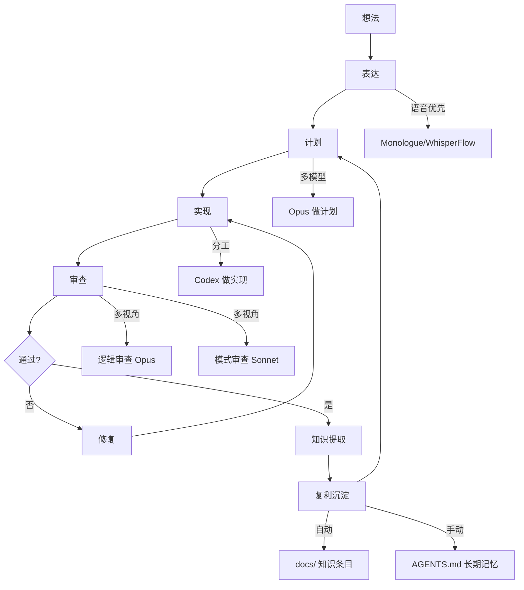

# 从原型到生产：Vibe Coding 的方法论升级

# 一句话导读

当 Opus 4.5 和 Codex 5.2 把 AI 编程推过"能用"的门槛后，真正的竞争不再是"能不能让 AI 写代码"，而是"怎么让 AI 在真实项目中持续产出高质量代码"。

# 适合谁看

- 已经用 Claude Code 或 Cursor 写过代码，但感觉"总能跑，总差点意思"的人
- 带团队的 CTO 或工程负责人，想判断 AI 编程到底能不能上生产
- 非技术出身的创业者或产品经理，靠 AI 编程做产品，但频繁卡在 bug 循环里
- 想从"单次对话写个 demo"进化到"系统化地用 AI 构建和维护产品"的人

# 读完你会获得什么

- 理解 vibe coding 从"原型玩具"到"生产工具"的关键转变点在哪里
- 掌握 Agent Native 架构的两个核心原则（对等性和粒度），以及它们如何改变软件设计
- 学会 Compound Engineering 的完整循环：计划 → 执行 → 审查 → 复利
- 知道什么时候用 Opus、什么时候用 Codex、什么时候自己动手
- 能搭建自己的 Agent 工作流：从语音输入到多 Agent 协作到自动化循环
- 避开最常见的五个误区：包括"卡住了就怪 AI""不读代码直接放行""把 slop 当产品"

---

## 01 背景：为什么这个问题现在值得讨论

2024 年初，用 Cursor + Sonnet 3.5 写代码已经可行，但质量不稳定。大部分人把 AI 编程当成快速原型的工具——写个 demo 可以，上生产不行。 vibe coding 这个词甚至带点贬义：做出来的东西是 slop，经不起推敲。

2025 年 Opus 4.5 和 Codex 5.2 发布后，情况变了。多位有十几年经验的资深工程师公开承认：这些模型写出来的代码，质量已经接近真正的工程师。Nat Eliason 的话很有代表性："以前我建议别人学 vibe coding 还有点心虚，现在不了。连 DHH 这样的资深工程师都说够用了。"

但这里有一个被忽视的断层：**模型能力上去了，人的方法论没跟上。** 大部分人还在用"一句话描述需求 → 等结果 → 修 bug"的模式，这相当于请了一个高级工程师，却不给他需求文档、不 review 他的代码、不做知识沉淀。结果自然不稳定。

Vibe Code Camp 这个 8 小时直播的核心价值，不是展示"AI 多厉害"，而是十几位一线实践者展示了**他们怎么和 AI 协作**——计划、审查、教学、循环、知识复利。这些方法论才是真正值得学的东西。

---

## 02 核心判断：真正的技能不是写代码，是编排理解

直播中反复出现的不是"AI 太强了"的惊叹，而是一个更朴素的问题：**人和 AI 之间的理解鸿沟怎么弥合？**

Ben Tossell（非技术背景，用 AI 构建了完整的广告投放平台）说了一句狠话："每次卡住，几乎都是我的错。"他指的不是谦虚，而是一个结构性问题：当你给 AI 的指令含糊，AI 就会用它自己的判断填补空白——而那些判断常常不符合你的意图。

Jeffrey Lii（Notion）的做法更极端：每个 PR 完成后，他会让 AI 出一道测验，考自己是否真的理解了这次改动。"如果你没法向朋友解释清楚，你就没真懂。"他拒绝合并任何自己无法通过测验的 PR。

Dan Shipper（Every CEO）造了一个工具叫 Proof，核心功能就是区分文档中"人写的"和"AI 写的"。他说："我永远不想花更多时间读一个东西，比作者花在写它上面的时间还多。"

这些做法指向同一个判断：**当 AI 足够强时，瓶颈不是 AI 的能力，而是人能否维持对系统的理解。** Vibe coding 的方法论本质，就是一套维持人机共同理解的工程实践。

---

## 03 概念澄清：先把关键名词讲准确

### Agent Native 架构

- **它是什么**：一种软件设计方式，核心是 agent 而非硬编码逻辑。UI 上的每个按钮本质上都是调用 agent 的一个 skill。
- **它解决什么问题**：让软件具有涌现能力——agent 能组合已有工具完成你没想到的功能。
- **它不是什么**：不是在传统软件上加一个聊天窗口。
- **和相关概念的区别**：传统软件是人写规则，agent 执行；agent native 是人定义工具，agent 自行组合。
- **例子**：Dan 的 Proof 编辑器没有"清除所有评论"按钮，但 agent 可以调用逐个删除评论的工具来组合实现这个功能——用户说"帮我清掉所有评论"，它就自动做完了。

### Compound Engineering（复利工程）

- **它是什么**：一套 AI 编程工作流，包含计划、执行、审查、复利四个阶段。核心是"复利"——每次犯错后提取教训，自动写入知识库，下次不再犯。
- **它解决什么问题**：避免每次和 AI 对话都从零开始，让 AI 的输出随时间越来越好。
- **它不是什么**：不是简单的 prompt 模板库。
- **和相关概念的区别**：普通的 AGENTS.md 是静态文档；compound engineering 中的 docs/ 文件夹是根据具体错误动态生成的、按关键词索引的知识条目。
- **例子**：AI 做了一个你不喜欢的设计决策，你运行 compound workflow，它会自动提取"在这种情况下应该选方案 B 而非方案 A"，写成一条 markdown，下次做计划或审查时自动检索并应用。

### Ralph Loop

- **它是什么**：一种用 bash 脚本驱动的 agent 自动循环：从 JSON 任务列表取任务 → 实现 → 测试 → 如果失败则修复 → 如果通过则提交 → 更新进度 → 取下一个任务。
- **它解决什么问题**：让 agent 可以长时间自主运行，不需要人每步都按确认。
- **它不是什么**：不是让 AI 无限制自由发挥——有严格的任务定义和验收标准。
- **和相关概念的区别**：和 compound engineering 的区别是，Ralph Loop 更偏"执行层自动化"，compound engineering 更偏"知识层复利"。两者可以组合。
- **例子**：Ryan Carson 的 Compound Product 方案——每天凌晨 cron job 拉产品数据 → Opus 写分析报告 → 解析报告生成任务 → Ralph Loop 逐条实现 → 提交 PR。

### 对等性（Parity）

- **它是什么**：agent 能做的一切，用户通过 UI 也能做；用户通过 UI 能做的一切，agent 也能做。
- **它解决什么问题**：防止 agent 变成黑箱，同时防止 UI 功能成为 agent 的盲区。
- **例子**：Notion 的 AI agent 能创建页面、编辑数据库、添加评论——因为这些都是用户在 UI 里能做的。

### 粒度（Granularity）

- **它是什么**：给 agent 的工具要小于用户可见的功能，这样 agent 才能自由组合。
- **它解决什么问题**：如果工具粒度和功能一一对应，agent 就只能做你预想到的事；粒度更细意味着涌现能力。
- **例子**：Proof 的"删除单条评论"是原子工具，"清除所有评论"不是。但 agent 能组合多个"删除单条评论"来实现后者。

---

## 04 整体框架：从单次对话到系统工程

把十几位实践者的方法综合起来，可以看到一个清晰的演进路径：

**框架解释**：

这不是一个线性流程，而是一个带反馈的循环系统。关键在于三个"非显而易见"的设计：

1. **表达和计划是分开的**：大部分人跳过计划直接让 AI 写代码。但所有高效实践者都先做详细计划——就像你不会让一个新入职的工程师不经需求评审就开始写代码。

2. **审查是多视角的**：Portola 用不同的模型做不同类型的审查（Opus 审逻辑，Sonnet 审模式），因为不同模型擅长的事不同。Kevin Rose 的做法更直觉：让 Opus 写代码，让 GPT-5 做另一个视角的审查，再把反馈喂回去。

3. **知识提取是闭环比**：每次犯错或修正都不是一次性事件——它是知识库的一次增量更新。下次做计划时，相关条目会被自动检索并注入上下文，让 AI 在起点就比上次更聪明。

---

## 05 关键机制：它到底是怎么运行的

### 机制一：语音优先输入

**输入**：人脑中的模糊想法
**处理**：Monologue/WhisperFlow 转写，配合 app 专属 mode 做定向编辑
**输出**：结构化 prompt，可直接喂给 Claude Code

**为什么要这样设计**：打字时人会偷懒，省略关键上下文。说话时人更自然地补充背景——因为说话比打字快 5-10 倍，你不会因为"懒得打字"而省略重要信息。CJ（10x）的观察很准确："我发现打字时有些该给的上下文我就不给了，但说话时我会全说出来。"

**代价**：需要适应口头表达的混乱，需要一个转写+整理的中间层。

**适合**：长 prompt、计划阶段、需求描述。不适合精确代码修改。

### 机制二：多模型分工

**输入**：同一任务的不同阶段
**处理**：根据任务性质分配不同模型——Opus 做规划和复杂推理，Codex 做深度实现，Sonnet 做快速批量审查
**输出**：每个阶段的最优结果

**为什么这样设计**：Nat Eliason 的比喻很精准——"Opus 是我的工程经理，Codex 是我的高级工程师。"经理不需要写代码最快，但需要判断力最好；工程师不需要最强的综合推理，但需要在代码层面又深又准。

**代价**：需要管理多套 API key 和 token 额度，需要在不同工具间切换。Nat 用 Conductor（一个 Claude Code/Codex 的 GUI 管理器）来降低切换成本。

**适合**：中大型项目、需要高质量代码的生产环境。不适合一次性小脚本。

### 机制三：自动化循环（Ralph Loop / Compound Product）

**输入**：JSON 格式的任务列表，每个任务有明确的描述和验收标准
**处理**：bash 脚本从列表取任务 → 启动 agent → agent 实现 → 自动测试 → 通过则提交，失败则修复 → 更新进度文件 → 下一个
**输出**：完成所有任务后的 PR，附带进度日志

**核心设计细节**：

- **progress.txt**（短期记忆）：记录本次循环中遇到的坑。下一次循环启动时先读这个文件，避免重复踩坑。
- **AGENTS.md**（中期记忆）：当 agent 发现某个坑是反复出现的，会自动把它从 progress.txt 提升到 AGENTS.md。
- **docs/ 知识库**（长期记忆）：compound engineering 的核心。每个知识条目是一份 markdown 文件，带关键词索引。做计划或审查时自动检索并注入。

**为什么这样设计**：就像一个有经验的工程师，不会每次都从零开始。他会记住"这个项目里数据库连接用 Supabase Functions""这个 UI 组件用自定义的而非标准库"。agent 也需要这个。

**代价**：前期搭建成本高——需要写 skills、hooks、测试用例。Portola 的 Dan Feerman 花了大量时间搭建这套体系，其他工程师才能受益。

**适合**：持续性项目、有明确验收标准的任务。不适合探索性工作或需求模糊的场景。

### 机制四：反向工程学习法

**输入**：你电脑上任何一个 .app 文件
**处理**：Claude Code 读取 app 包内的文件结构、框架、依赖、API 端点，生成一份完整的"拆解报告"
**输出**：一份 markdown 文档，记录这个 app 用了什么技术栈、为什么这样选、你可以学什么

Yash（Sparkle）的实践："ChatGPT 的 Mac app 用了 LiveKit 做实时通信、用 ScreenCaptureKit 做屏幕录制——如果你要做一个类似功能，直接用这些框架就对了，因为这些是百亿美元公司验证过的选择。"

**为什么这样设计**：AI 编程时代，你不应该花时间从零调研技术选型。已经有人花了上亿美金替你做了选择，你只需要读取他们的决策。

**代价**：有法律灰地带（但 Yash 强调他不抄代码，只学架构决策）。另外，拆解报告不能替代真正的架构思考——你的产品可能有不同的约束。

**适合**：项目启动阶段的技术选型、学习优秀 app 的实现模式。

---

## 06 方法拆解：如果自己要做，应该怎么落地

### 步骤一：搭建输入层——语音+模式

**目标**：让想法到 prompt 的路径尽量短、信息尽量完整。

**具体动作**：
1. 安装一个语音转文本工具（Monologue、WhisperFlow、Superwhisper 任选）
2. 为你最常用的 app 配置专属 mode——比如 Claude Code mode 里加上"用 compound engineering""先做计划再动手"；邮件 mode 里加上"语气专业简洁"
3. 开启自动发送（auto-enter），录制完直接粘贴执行，不用手动确认

**判断标准**：你能对着电脑说一段 60 秒的话，AI 拿到的 prompt 就是你想要的意思，不需要再修改。

**常见坑**：说话太短、太模糊。解决方法：假想你跟一个聪明但完全不了解上下文的新同事说话——你会给什么背景，就说什么背景。

**产出物**：一套可复用的 mode 配置文件。

### 步骤二：建立计划习惯

**目标**：每次让 AI 写代码之前，先有一份详细计划。

**具体动作**：
1. 用语音描述你想要什么，越详细越好
2. 让 AI 基于你的描述做一份结构化计划（markdown 格式）
3. 审查计划——重点看 AI 是否理解了你的意图、是否有遗漏
4. 如果计划质量不够，让 AI"深化计划"（compound engineering 的 deepen 功能）
5. 计划确认后才动手写代码

**判断标准**：计划是否具体到可以拆分为独立任务、每个任务是否有验收标准。

**常见坑**：跳过计划直接开干。这是最常见的失败模式。Ken（Compound Engineering 作者）的话："如果你有一个能干的团队，第一件事是做计划——为什么面对 AI 就忘了？"

**产出物**：一份 markdown 计划文件，包含任务分解和验收标准。

### 步骤三：多模型执行

**目标**：让最合适的模型做最合适的事。

**具体动作**：
1. 计划阶段：用 Opus 或最强推理模型
2. 实现阶段：用 Codex 做深度代码实现（它在代码层面的精度更高）
3. 让 Opus 做 Codex 的"工程经理"——Opus 审查 Codex 的输出，发现问题后指挥 Codex 修复
4. 如果项目较大，用 git worktree 隔离多个并行任务

**判断标准**：代码是否能通过自动化测试、是否符合项目的既有模式。

**常见坑**：只用一个模型从头到尾。每个模型都有盲区，单一模型会在特定类型的问题上反复犯同样的错。

**产出物**：通过审查的代码变更，提交为 PR。

### 步骤四：多视角审查

**目标**：不让同一个思维盲点漏过。

**具体动作**：
1. 让 Opus 审查逻辑正确性
2. 让 Sonnet 审查模式一致性（是否符合项目既有风格）
3. 如果你有一个 compound engineering 插件，让它自动检索 docs/ 知识库，检查是否违反已知最佳实践
4. Portola 的做法更进阶：让 AI 自己写 PR、自己审查自己的审查、自己 shepherding PR（处理 review 意见并提交修复）

**判断标准**：审查是否覆盖了逻辑、模式、安全三个维度。

**常见坑**：审查只看"能不能跑"，不看"是不是对的"。

**产出物**：审查报告 + 修复后的代码。

### 步骤五：知识复利

**目标**：每次修正都变成永久知识。

**具体动作**：
1. 每次你和 AI 意见不一致并最终修正，运行 compound workflow
2. AI 自动提取"在这个具体模式下，应该选方案 A 而非方案 B"
3. 写入 docs/ 文件夹，带关键词 frontmatter
4. 下次做计划或审查时，系统自动检索相关条目并注入上下文

**判断标准**：一个月后，同样类型的错误是否减少了。

**常见坑**：把所有东西都堆进 AGENTS.md，导致上下文爆炸。应该区分：一次性的坑放 progress.txt，反复出现的放 AGENTS.md，模式级的放 docs/。

**产出物**：持续增长的知识库。

---

## 07 案例讲解：从"修不好"到"自动化"的真实路径

### 场景

Ben Tossell 在用 AI 重建 Ben's Bites 的广告投放平台——一个原本用 Bubble（无代码平台）搭建的系统。Bubble 版本开始频繁出问题，他决定用 AI 从零重建。

### 遇到的问题

重建后的应用可以本地运行，但 Supabase 数据库始终写不进去——无法创建订单、无法创建客户、无法创建询价。Ben 反复让 AI"修复"，进入了长达数天的 bug 循环。

### 按框架如何处理

**步骤 1：承认理解鸿沟是自己的问题**

Ben 的判断："反复修复同一个问题是信号——不是我给的方向错了，就是我给的上下文不够。AI 不是在故意搞砸。"

**步骤 2：系统性排查而非盲目修复**

Ben 停止了"修它、修它、修它"的循环，改为：
- 让 AI 列出所有可能导致数据库写入失败的原因
- 让 AI 用 agent browser（自动化浏览器）逐个测试
- 让 AI 按优先级排序最可能的原因

**步骤 3：用直觉指向正确区域**

Ben 根据自己的经验判断："本地能跑，线上不行，数据根本没到 Supabase——那问题八成在连接层。"他引导 AI 去检查 Supabase Functions 的配置。

**步骤 4：验证修复**

AI 发现确实缺少 Supabase Functions 的正确配置。修复后，让 AI 用 agent browser 走完整个用户流程——创建账号、下单、付款——确认全部通过。

**步骤 5：沉淀知识**

Ben 把这个坑写进了 agent 的配置："这个项目使用 Supabase Functions 作为数据库连接层，不是直连。如果遇到数据库写入问题，先检查 Functions 配置。"

### 最终结果

平台成功上线，运行正常。整个排查过程从"盲目修复"到"定向解决"，关键是 Ben 改变了和 AI 的交互方式——从命令式的"修它"变成引导式的"这是所有可能原因，按优先级排查，我怀疑在连接层"。

### 说明了什么

**卡住时的第一反应应该是"我的指令或上下文是否足够清晰"，而不是"AI 太蠢了"。** 这不是鸡汤——这是一个可操作的诊断方法。如果你的指令是"修复它"，AI 只能在它自己的理解范围内随机尝试；如果你的指令是"这里有五个可能的原因，我怀疑是第三个，请验证"，AI 就有了明确的工作方向。

---

## 08 常见误区

### 误区一："Vibe coding 就是随便说句话让 AI 写代码"

**错误理解**：prompt 越短越好，AI 聪明到能猜到你的意思。

**为什么错**：AI 的推理是在它见过的所有代码的平均水平上进行的。给的信息越少，AI 就越倾向于输出"最常见"的方案——而最常见往往不是你想要的。Kevin Rose 的经验：他花 15-20 分钟口述需求，得到的结果远好于"帮我做个 X"。

**正确理解**：好的 prompt = 上下文（为什么做）+ 约束（用什么技术）+ 验收标准（做成什么样算好）。

**应该怎么做**：像给新入职的工程师写需求文档一样写 prompt——不是因为他笨，而是因为他不了解你的项目。

### 误区二："AI 写的代码不用读，能跑就行"

**错误理解**：AI 写的代码质量足够好，我不需要逐行审查。

**为什么错**：Jeffrey Lii 的实践证明，不读代码会导致理解退化——你以为自己懂了，但当你需要做下一个功能时，才发现自己完全不知道现有代码是怎么工作的。Yash（Sparkle）更直接："我读每一行代码，不是因为我喜欢读，而是因为当出问题时我需要能在两分钟内修复。"

**正确理解**：审查 AI 代码的目的不是找 bug（AI 找得比你快），而是维持你对系统的理解。

**应该怎么做**：每次 AI 提交 PR 后，要求它写一份人话解释——这段代码做了什么、为什么这样设计、改了什么。更好的做法：让 AI 出一道测验，考你自己。

### 误区三："卡住了就换模型/换工具试试"

**错误理解**：这个模型搞不定，换一个可能就行。

**为什么错**：如果你给的问题定义本身就有问题，换什么模型都一样。不同模型的不同之处在于擅长领域，而不在于能读心。

**正确理解**：卡住时先诊断——是问题定义不清（所有模型都会卡），还是模型在特定任务上有弱点（换个模型可能解决）。

**应该怎么做**：先检查你的 prompt 是否足够具体。如果足够具体还是不行，再考虑换模型。Nat Eliason 的策略：Opus 做"工程经理"判断方向，Codex 做"工程师"深入实现——各司其职，而不是随机替换。

### 误区四："自动化循环可以取代人工审查"

**错误理解**：Ralph Loop 可以让 AI 无限自动运行，我不需要看。

**为什么错**：CJ（10x）的判断："Ralph Loop 适合周末项目，不适合生产系统。"自动化循环的验收标准是硬编码的——如果你的验收标准本身有漏洞，AI 会在错误的方向上高效地越走越远。

**正确理解**：自动化循环是"效率倍增器"，不是"判断替代器"。它可以加速执行，但不能替代人对方向的判断。

**应该怎么做**：循环可以自动运行，但 PR 必须人工审查。审查的重点不是代码细节（AI 做得更好），而是"这个变更的方向对不对"。

### 误区五："我的 AI 工作流是临时方案，等模型更好了就不需要了"

**错误理解**：skills、hooks、知识库都是过度工程化，下一个版本的模型会自动解决这些问题。

**为什么错**：Tori（Anthropic）的原话："模型会变好，但人的编排能力也会变得更重要。"更好的模型意味着更强的能力，也意味着更大的出错空间——一个更强的模型在错误方向上走得更远。Portola 的经验：他们有 13 个 skills、多个 hooks、大量 MCP 集成，这些不是在弥补模型的不足，而是在教模型他们的项目规范。

**正确理解**：AI 工作流的价值在于"教 AI 你的项目上下文"，这不是临时方案，而是长期投资。当然，某些具体的 scaffolding 会随模型进步而淘汰——Tori 提到他们正在用 tasks 替换 todo——但"教 AI 理解你的项目"这件事不会消失。

**应该怎么做**：每隔一段时间重新评估你的 scaffolding——哪些仍然有用、哪些可以被更简单的方案替代、哪些可以变成 skill。关键不是删不删，而是持续优化。

### 误区六："Slop 时代已经结束了"

**错误理解**：现在的模型足够强，产出的代码和设计都是高质量的。

**为什么错**：Logan（Google AI Studio）的定义更准确："Slop 是任何落在 AI 分布中心的内容。"当大家都用同样的模型、同样的默认设置、同样的 prompt 风格时，产出的东西会趋同——看起来不错，但没有个性，没有深度。Dan Shipper 的 Proof 应用代码质量可能不高，但应用本身有用——区别在于他花了大量时间在设计意图上，而不是让 AI 自由发挥。

**正确理解**：Slop 的定义不是"AI 生成的"，而是"没有人的判断注入的"。模型越强，生成 slop 越容易——因为输出看起来越合理，你就越容易放松警惕。

**应该怎么做**：在 AI 最容易"自动完成"的地方（UI 设计、文案写作、架构选择）注入最多的个人判断。把你的品味、你的约束、你的偏好写进 skills 和 prompt 里。

### 误区七："非技术人员不可能用 AI 构建真正的产品"

**错误理解**：不懂代码就只能在 Lovable/V0 上做个原型，真正的产品必须由工程师构建。

**为什么错**：Ben Tossell 重建了完整的广告投放平台（Supabase + 前端 + 支付集成），前后端代码全部由 AI 编写。Portola 的设计师甚至直接开 PR——当然有工程师 review，但 PR 本身质量已经足够高。Paola（Portola iOS 工程师）："我们的设计师没有写过代码，但他们在提交 PR，用户根本看不出区别。"

**正确理解**：非技术人员能用 AI 构建产品的上限，取决于他们的"产品判断力"而非"编码能力"。Ben 的广告平台成功不是因为他学会了编码，而是因为他知道广告平台的业务逻辑应该怎么跑。

**应该怎么做**：如果你是非技术人员，重点投资两件事——对业务逻辑的深度理解、和 AI 沟通的精准表达。编码本身交给 AI。

---

## 09 实战清单：读完后可以马上照着做

### 立即能做

- [ ] 给你的语音转文本工具配置一个 Claude Code 专属 mode，加上"先做计划再动手""使用 compound engineering"的指令
- [ ] 下次让 AI 写代码之前，先口述一份 3 分钟的计划，让 AI 基于计划工作，而不是直接开干
- [ ] 在你当前的项目里创建一个 `docs/` 文件夹，把今天遇到的第一个"AI 做错了但我纠正了"的事写成一条知识条目

### 一周内能做

- [ ] 搭建多模型协作流程：用一个模型做计划，另一个做实现，再换回第一个做审查。记录结果差异
- [ ] 选一个你常用的 app，让 Claude Code 做反向工程拆解。把学到的技术决策记录下来，思考是否适用于你的项目
- [ ] 在你的 Claude Code 配置里加上至少一个 hook：比如"每次修改数据库相关文件时，先检查迁移脚本是否存在"
- [ ] 为你的项目写一份 AGENTS.md，包含：技术栈选择及原因、项目特殊约束、常见踩坑

### 长期要沉淀

- [ ] 建立完整的 compound engineering 流程：计划 → 执行 → 审查 → 知识提取 → 复利。确保每次犯错都被记录和复用
- [ ] 为你的核心业务场景创建自定义 skills——不是通用 skill，是你的项目独有的知识（比如"我们的支付系统用 Stripe + Supabase Functions，不直连数据库"）
- [ ] 搭建一个 agent watch 系统（Yash 的做法）或 kanban 系统（Jeffrey 的做法），让你在多个 agent 并行运行时保持对全局的感知
- [ ] 定期清理你的 scaffolding——每月问一次：哪些 skills/ hooks 已经不需要了？哪些可以被更简单的方案替代？

---

## 10 总结

这场 8 小时直播呈现的不是"AI 编程有多酷"，而是一群一线实践者在回答一个更本质的问题：**当 AI 足够强时，人的工作变成什么？**

答案不是"被替代"，也不是"变成审查员"。答案是变成了**编排者**——定义方向、维持理解、沉淀知识、持续校准。这些事情以前也是资深工程师的核心工作，只是以前他们还要花大量时间写代码，现在这部分被释放了。

几个具体的判断：

**计划和审查的权重会继续上升。** 当实现成本趋近于零，决定做什么和判断做得对不对就成了主要瓶颈。所有高效实践者都在这两件事上投入远超"写代码"的时间。

**知识复利是长期的竞争优势。** 谁的知识库更丰富，谁的 AI 就更聪明——不是模型本身更聪明，而是注入的上下文更精准。这和"公司文化""组织记忆"是完全同构的问题。

**人的判断力比工具选择更重要。** Opus vs Codex vs Sonnet 的选择会变，但"知道什么时候该让 AI 自己跑、什么时候必须介入"这个判断力不会过时。Jeffrey Lii 的自测方法、Ben Tossell 的"是我的错"心态、Dan Shipper 的"不想花比作者更多时间读"原则——这些是工具无关的。

**最后一句判断：Vibe coding 从原型到生产的关键跨越，不是模型能力的提升，而是人从"使用者"到"编排者"的角色转变。** 用 AI 写出能跑的代码已经不难，难的是在 AI 的帮助下持续构建一个你真正理解的系统。
