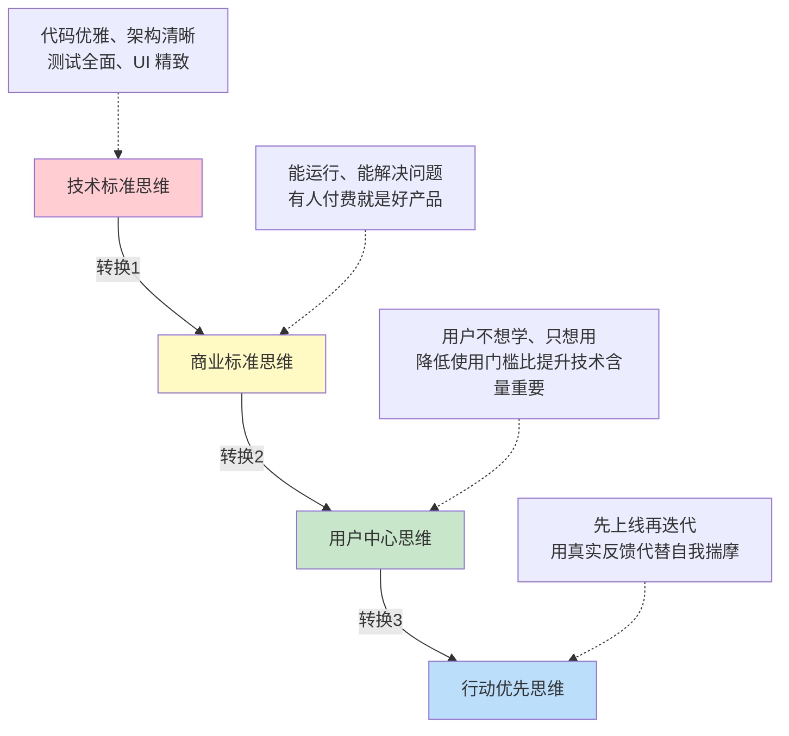

# 技术人卖不出产品，不是能力问题，是认知问题

**一句话导读：** 技术人最容易犯的商业错误——把产品当作品打磨，把上线当考试交卷，结果永远在准备，永远没卖出去过。

**适合谁看：**
- 有技术能力但变现困难的独立开发者
- 从技术岗转型做产品或自媒体的人
- 想用技能做 C 端服务却不知如何起步的人
- 正在纠结"产品还没做好能不能发布"的人
- 做知识付费或虚拟产品但转化率低的人

**读完你会获得什么：**
- 理解"技术好但产品卖不动"的根本原因
- 区分"完美产品"和"有效产品"的标准差异
- 掌握 MVP 的真正含义——它不是一个简化版产品，而是一种验证方式
- 知道 C 端用户真正在为什么付费
- 有一份可以直接照做的新产品上线清单
- 明白"过度准备"背后的心理机制，以及如何破解它

---

## 01 背景：为什么这个问题现在值得讨论

AI 工具大幅降低了开发门槛。以前做一个产品需要前后端、部署、运维，现在一个人用低代码平台搭个工作流就能跑。按理说，技术人应该更容易变现了。

但现实相反。大量技术能力强的人，产品做出来没人买。不是因为东西不好，而是因为他们在用一套错误的认知框架做商业决策——把"做好产品"等同于"写好代码"，把"上线"等同于"交出完美答卷"。

更具体地说：在扣子（Coze）等平台上，大量 1 分钱源码包在流转，卖的是原材料；而另一些人用同样的工具，打包成解决方案，卖到了几十块甚至上百块。同样是工作流，为什么定价和销量差出一个量级？

这个问题的答案，不在技术层面，在认知层面。

---

## 02 核心判断：视频真正想讲的不是"先做再完美"

视频表面讲的是"不要等产品完美再上线"，但真正想说的是：**技术人用技术标准替代了商业标准，这是卖不出产品的根本原因。**

更直白地说——你以为用户在买你的代码架构、你的 UI 设计、你的工程规范。实际上用户在买三样东西：**信任、解决方案、使用门槛足够低。**

视频作者亲身验证了这一点：他卖出去的第一个产品，没有官网、没有 App、没有助理，只有 28 个扣子工作流源码加上几个飞书文档。定价从免费到 40 块。他当时觉得"拿不出手"，咬咬牙发了出去——首月变现一万多，工作流卖了六千多，咨询接了六千多。没有爆款视频，没有大量粉丝，只有精准流量。

这就是核心判断：**商业世界里，"能用"比"优雅"值钱，"解决了问题"比"代码漂亮"值钱，"用户能上手"比"架构可扩展"值钱。**

---

## 03 概念澄清：先把关键名词讲准确

### MVP（Minimum Viable Product）

- **它是什么：** 用最低成本验证一个商业假设的产品形态。注意，关键词是"验证假设"，不是"做阉割版产品"。
- **它解决什么问题：** 在投入大量资源之前，确认有人愿意为你的解决方案付费。
- **它不是什么：** 它不是"随便做个半成品糊弄人"。它必须能解决一个真实问题，只是形态可能很粗糙——可以是一份文档、一次咨询、一个半成品 Demo。
- **和相关概念的区别：** MVP ≠ 原型（Prototype）。原型用来验证技术可行性，MVP 用来验证商业可行性。两个验证的目标完全不同。
- **简单例子：** 视频作者的 MVP 是 28 个扣子工作流 + 飞书文档，不是他后来做的完整社群产品。

### 原材料 vs 解决方案

- **它是什么：** 原材料是未经加工的中间产物（源码、数据、工具）；解决方案是已经把原材料加工成用户可以直接使用的形态，并附带使用指导。
- **它解决什么问题：** 区分你到底在卖什么——你在帮用户省的是"加工成本"还是"决策成本"。
- **它不是什么：** 原材料不是差产品，但它只服务有加工能力的人。大部分人没有这个能力。
- **和相关概念的区别：** 原材料对应"给你鱼竿"，解决方案对应"给你做好的鱼并告诉你怎么吃"。
- **简单例子：** 扣子平台上 1 分钱卖的工作流压缩包是原材料；视频作者精选 28 条工作流、写好文档、教你怎么用、出了报错帮你修——这是解决方案。

### 过度准备

- **它是什么：** 把"再优化一下"当作推迟上线的理由，本质上是对真实反馈的回避。
- **它解决什么问题：** 这个词不是在描述一个行为，而是在揭示一个心理——你不是在精益求精，你是在害怕上线后发现没人买单。
- **它不是什么：** 它不是正常的品控流程。品控有明确标准，过度准备没有终点。
- **和相关概念的区别：** 过度准备 ≠ 完美主义。完美主义可能确实产出高质量结果；过度准备的结果往往是什么都没上线。
- **简单例子：** "我还要优化一下 UI""我还要加几个功能""我还要做做测试"——三个月过去了，产品还没上线。

---

## 04 整体框架：技术人的商业认知转换

这套内容可以理解为一个三层认知转换：

**第一层转换：技术标准 → 商业标准。** 技术人习惯用代码质量、架构优雅度、测试覆盖率来衡量产品好坏。但商业世界的衡量标准只有一个：能不能运行、能不能解决用户的实际问题。视频作者本科时做过一个项目——几个传感器测柱子的倾斜角度，代码烂、界面丑，但导师说这东西能打包卖给运营商。那一刻他意识到：变现不需要高精度，需要有用。

**第二层转换：商业标准 → 用户中心。** 即便你知道"能用就行"，很多人还是会把"能用"理解为"功能完整"。但 C 端用户的核心特征是：**不想学，只想用。** 你的工作流原理再牛，如果用户需要理解原理才能用，那对大部分用户来说就是不能用。用户付费买的不是你的技术含量，而是"我按哪个键能出图"。

**第三层转换：用户中心 → 行动优先。** 知道了用户要什么，还要真的迈出第一步。过度准备的本质是恐惧——怕上线后没人买，不如躲在"优化"的避风港里。但任何完美主义都换不来一样东西：**真实用户的真实反馈。** 你在屋子里揣摩一百遍，不如上线看一次真实数据。

---

## 05 关键机制：为什么"丑产品"反而能卖出去

视频中的核心机制可以用一个对比来拆解：

### 机制：解决方案定价 > 原材料定价

**输入：** 同一批技术能力（比如扣子工作流开发能力）

**中间处理方式 A（原材料模式）：** 把所有工作流打包成 ZIP，标价 1 分钱，丢给用户自己研究。用户拿到手：不知道怎么用、报错了没人管、版本更新了旧包过期。结果：用户流失，口碑差，无法溢价。

**中间处理方式 B（解决方案模式）：** 从上百个工作流中精选 28 条，附上使用文档，出了导入导出功能后实时更新，报错了教你怎么修，愿意听的讲讲背后的逻辑。结果：定价可以到几十块，首月变现过万，用户留存好。

**输出差异的核心原因：** 用户不是在买你的代码，是在买"我能不能用起来"的确定性。你帮他降低了从"拿到东西"到"用出结果"之间的距离，这个距离越短，他愿意付的钱越多。

**为什么要这样设计：** 因为 C 端用户的时间成本和学习意愿极低。你帮他省下的每一分钟学习成本，都可以转化为定价空间。

**代价：** 解决方案模式意味着你需要持续投入服务成本——回答问题、更新内容、修复报错。这不是一锤子买卖，是长期运营。

**适合/不适合场景：** 适合个人或小团队做高客单价、高复购的 C 端服务。不适合想做规模化、自动化的平台型产品（那需要走另一条路：产品化程度要高，但初期验证阶段仍然需要解决方案思维）。

---

## 06 方法拆解：从零到第一笔收入的具体步骤

### 第一步：找到你能解决的一个具体问题

- **目标：** 确定一个有人愿意付费的具体痛点
- **具体动作：** 盘点你现有的技能和资源，找到别人反复问你的、你已经能解决但还没产品化的问题
- **判断标准：** 这个问题是否具体到可以用一句话描述？是否有人已经在为类似问题付费？
- **常见坑：** 找了一个"伪需求"——你觉得别人需要，但没人问过也没人付过钱
- **产出物：** 一句话的问题定义（例："扣子工作流新手不知道怎么上手，市面上的源码包没有使用指导"）

### 第二步：用最小形态交付，不要等产品完整

- **目标：** 用最低成本做出一个能解决上述问题的东西
- **具体动作：** 你的 MVP 可以是：一份文档、一次 1v1 咨询、一个半成品 Demo、一个精选的资源集合。关键是——它必须能解决问题，形态无所谓
- **判断标准：** 用户拿到你的 MVP 之后，能不能直接用？能不能出结果？如果能，就够了
- **常见坑：** 做着做着就开始加功能、改 UI、搭官网——这些全都不属于 MVP 阶段
- **产出物：** 一个"拿得出手但不完美"的交付物（视频作者的例子：28 个工作流 + 飞书文档）

### 第三步：定价从低开始，甚至免费

- **目标：** 获取第一批真实用户和真实反馈
- **具体动作：** 前期可以免费或低价（比如 9.9 元）。价格不是目的，反馈才是
- **判断标准：** 有没有人愿意用？用了之后反馈是什么？哪些地方卡住了？
- **常见坑：** 一上来就定高价——没有信任基础时，高价只会把人吓走；或者永远免费不敢收费——那你永远无法验证付费意愿
- **产出物：** 至少 3-5 个真实用户的详细反馈

### 第四步：根据反馈迭代，而不是根据想象迭代

- **目标：** 让产品从"能用"变成"好用"
- **具体动作：** 拿着反馈，只改用户真正卡住的地方。用户说"报错了不知道怎么办"，你就加个排错文档；用户说"不知道按哪个键"，你就加个操作截图
- **判断标准：** 每次迭代后，用户从"拿到东西"到"用出结果"的步骤是否变少了？
- **常见坑：** 脱离反馈自己加功能——"我觉得用户需要这个"是最危险的想法
- **产出物：** 更新后的产品 + 逐步提升的定价

### 第五步：建立信任，持续交付

- **目标：** 从一次性交易变成可持续的服务
- **具体动作：** 持续更新内容、回应用户问题、分享你的迭代过程。让用户感受到"这个人靠谱，这个产品在进化"
- **判断标准：** 有没有复购？有没有口碑推荐？有没有用户主动帮你传播？
- **常见坑：** 觉得产品做完了就不用管了——C 端产品没有"做完"这个状态
- **产出物：** 一个有复购、有口碑的服务体系

---

## 07 案例讲解：从"拿不出手"到首月变现过万

**场景背景：** 视频作者是一个技术出身的独立服务提供者，已经有一些成熟的 B 端定制业务，但想在 C 端和自媒体方向做新探索。

**遇到的问题：** 扣子平台上的工作流生态已经存在，但存在两个痛点——（1）大部分群卖的工作流价格虚高（动辄 500+），且没人管售后；（2）便宜的源码包只是原材料，用户不会用、报错了没人帮、版本过期没人更新。作者自己有技术能力，但不确定自己精选的工作流值不值得收费。

**按框架如何处理：**

1. **定义问题：** 扣子新手需要一个"买来就能用、出了问题有人帮"的工作流集合，而不是一堆冷冰冰的源码文件。

2. **最小形态交付：** 不做官网、不做 App、不搭社群平台。只做两件事——精选 28 条工作流，配上飞书文档说明。自己亲自交付，没有助理。

3. **低价验证：** 初始定价免费到 40 块。他当时觉得这个产品"拿不出手"——没有开发，就是源码加文档。但咬咬牙发了出去。

4. **获取真实反馈：** 首月变现一万多。工作流卖了六千多，咨询接了六千多。没有任何爆款视频，粉丝只有四百多，纯靠精准流量。

5. **根据反馈迭代：** 扣子出了导入导出功能后，他立刻从手动复制粘贴源码升级为实时更新。用户报错了，他教怎么修。愿意听的，讲讲背后逻辑。

6. **建立信任：** 前期用户免费进来，验证了价值后逐步提升定价和产品形态，最终演进成现在的社群模式。

**最终结果：** 从一个"自己都觉得拿不出手"的产品起步，验证了方向正确，逐步进化成有完整交付体系的 C 端服务。

**说明了什么：** 你不需要一个完美的产品来开始变现。你需要的是一个能解决具体问题的最小交付物，加上愿意根据真实反馈迭代的行动力。视频作者后来说：**"初步社群加进来，我明白用户买的不是你的完美代码，而是你的信任和解决方案。"**

---

## 08 常见误区

### 误区一："产品没做好，不能上线"

- **错误理解：** 代码还没写完、UI 还没调好、功能还不全，不能上线
- **为什么错：** 你在用技术标准衡量商业决策。上线的目的不是展示完美，而是验证假设
- **正确理解：** 能解决一个具体问题的最小交付物，就是可以上线的版本
- **应该怎么做：** 问自己：我的产品现在能不能帮用户解决哪怕一个问题？如果能，就上线

### 误区二："用户会欣赏我的技术实现"

- **错误理解：** 只要技术实现够牛，用户自然会来
- **为什么错：** C 端用户不关心你的架构、你的算法、你的代码风格。他们关心的是"按哪个键能出结果"
- **正确理解：** 技术含量是手段，不是卖点。用户为解决方案付费，不为技术实现付费
- **应该怎么做：** 把"教用户理解原理"的精力，花在"让用户不用理解原理也能用"上

### 误区三："功能越多，产品越值钱"

- **错误理解：** 多加功能 = 多给价值 = 可以定更高的价
- **为什么错：** 每多一个功能，用户的学习成本就增加一层。功能越多，用户越不知道从哪开始
- **正确理解：** 精选比堆量值钱。28 条精选工作流 > 200 条未筛选的工作流
- **应该怎么做：** 砍掉所有"有了更好"的功能，只保留"没有不行"的功能

### 误区四："价格低是因为产品差"

- **错误理解：** 低价 = 低质量，所以一开始就要定高价来证明价值
- **为什么错：** 低价在早期是获客手段，不是价值判断。先有用户和反馈，才有定价的依据
- **正确理解：** 低价/免费是获取第一批反馈的投资，不是对你产品价值的否定
- **应该怎么做：** 前期低价甚至免费获取反馈，验证价值后再提价

### 误区五："我还在优化，优化完自然有人买"

- **错误理解：** 产品足够好，用户会自动来
- **为什么错：** 这是最隐蔽的自我欺骗。"再优化一下"是没有终点的。过度准备的本质是恐惧——怕上线后没人买，不如一直在"优化"的安全区里
- **正确理解：** 任何完美主义都换不来真实用户反馈。你躲在屋子里优化一百遍，不如上线看一次真实数据
- **应该怎么做：** 给自己设一个硬性上线时间，到了就发，不管是否满意

### 误区六："营销是骗人的，产品好才是硬道理"

- **错误理解：** 只要产品好，不需要营销
- **为什么错：** 在当前环境下，营销往往大于产品本身。这不是价值判断，是事实判断——两个人找你投钱，一个拿着 50 页完美商业计划书但没用户，一个拿着又丑又报错的 Demo 但已经有真实用户，你投谁？肯定投第二个
- **正确理解：** 营销不是欺骗，是让你的目标用户知道你的解决方案存在。没有触达，就没有交易
- **应该怎么做：** 把"做产品"和"做触达"当作同等重要的事，不要只做前者

### 误区七："卖源码和卖解决方案是一回事"

- **错误理解：** 把代码文件打包发出去，用户自己会搞定
- **为什么错：** 大部分用户没有技术能力消化源码。给他们原材料，他们拿到手不会用、报错了没人帮、版本过期没人更新
- **正确理解：** 源码是原材料，解决方案是加工品。两者的定价逻辑和目标用户完全不同
- **应该怎么做：** 如果你的目标用户是普通 C 端用户，请交付解决方案，不是原材料

---

## 09 实战清单：读完后可以马上照着做

**立即能做：**

1. **写下你能解决的一个具体问题。** 一句话，不要超过 20 个字。写不出来就说明你还没想清楚。
2. **用最小形态做出交付物。** 一份文档、一次咨询、一个半成品 Demo——任何能解决上述问题的东西，今天就开始做。
3. **给你的交付物定一个价格。** 哪怕 9.9 元，哪怕免费。关键是让它有一个"交易形式"。
4. **发出去。** 发到你现有的任何一个渠道——朋友圈、社群、朋友圈、任何地方。不要等准备完美。
5. **记录第一个用户的反馈。** 无论正面还是负面，记录下来。这是你下一步迭代的唯一依据。

**一周内能做：**

1. **根据前几个用户的反馈，修改你的交付物。** 只改用户真正卡住的地方，不靠自己想象加功能。
2. **把你的交付过程标准化。** 如果有 3 个人问了同一个问题，说明你的文档缺了这一块。补上它。
3. **找到 3 个精准流量来源。** 不需要爆款，不需要大流量。找到你的目标用户聚集的地方，持续出现在那里。
4. **和至少 1 个用户深度聊一次。** 不是问"你觉得好不好"，而是观察他怎么用你的产品，卡在哪里。

**长期要沉淀：**

1. **建立反馈驱动的迭代节奏。** 每次迭代的出发点必须是用户反馈，不是"我觉得"。
2. **逐步提升产品形态和定价。** 从文档到半成品到完整产品，从免费到低价到正常定价。每次提升都要有用户验证作为支撑。
3. **积累信任资产。** 每一次及时回复、每一次主动更新、每一次解决问题，都在积累信任。这是你未来溢价的根基。
4. **定期回顾：我是在优化，还是在逃避上线？** 如果发现自己连续两周在"准备"但没有接触任何真实用户，立即停止，先上线再说。

---

## 10 总结

技术人做产品卖不动，几乎从来不是因为技术不行，而是因为用错了衡量标准。用代码质量衡量商业成功，就像用厨师的刀工衡量餐厅的收入——刀工当然重要，但食客买单的是菜品，不是刀工。

视频作者的经历验证了一条清晰的路径：从一个自己都觉得"拿不出手"的最小交付物开始，用低价或免费换取真实反馈，根据反馈迭代，逐步提升产品形态和定价。首月变现一万多，靠的不是完美的产品，而是精准的问题定义和最低门槛的交付。

C 端用户的核心特征是不想学、只想用。你帮他缩短从"拿到东西"到"用出结果"的距离，这个距离就是你定价的依据。源码是原材料，解决方案是加工品，两者的市场价值差一个数量级。

最后，"再优化一下"是最危险的四个字。它的本质不是精益求精，而是对真实反馈的恐惧。硅谷那句话说得对：如果你对第一个版本的产品不感到羞耻，那你发布得太晚了。拿一个丑陋的 Demo 出来见光，用第一笔真实的收入证明方向没错——这才是一个独立做产品的人该有的样子。
