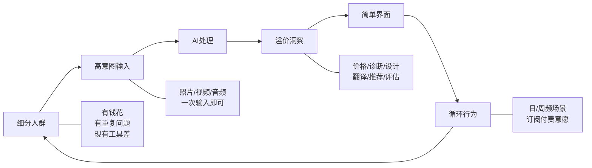

# 2026年移动应用创业：从8个隐秘赚钱App中逆向工程出的选品方法论

> 一句话导读：这篇文章解决的问题是——当AI把开发门槛降到接近零时，决定一个App能否月入5万美元的关键变量不再是技术，而是你选了什么人群的什么痛点。

---

**适合谁看**

- 打算在2026年做独立App的创业者或开发者，手里有技术但缺选品方向
- 正在做Side Project想验证商业化的产品经理
- 对"AI+移动应用"赛道感兴趣，但不确定从哪个切入点下手的探索者
- 已经有一个App但MRR停在几千美元，想理解瓶颈在哪的人

---

**读完你会获得什么**

- 一套可复用的"$50K MRR选品框架"，能系统化评估一个App想法的赚钱潜力
- 理解为什么"高意图输入 → AI溢价洞察 → 简单界面 → 循环行为"这条链路是关键
- 能区分"看起来有需求"和"真的有人反复付费"的差别
- 8个真实案例的逆向拆解，看到模式而非孤例
- 一份可直接执行的选品行动清单

---

## 01 背景：为什么这个问题现在值得讨论

2026年，做移动应用的门槛降到了历史最低。Vibe coding让一个人就能完成从前一个小团队的工程量，AI模型API的普及让"智能功能"不再是壁垒。

但门槛降低带来一个新问题：**供给爆炸，但需求没有同步增长。** App Store里堆满了功能相似的产品，绝大多数连第一个用户都找不到。与此同时，一批你没听过的App却在悄悄月入5万、10万甚至30万美元。

这组反差值得认真对待。它说明：**当技术不再是瓶颈时，选品成了唯一决定性变量。** 你做得出来不代表有人需要，有人需要不代表有人愿意反复付费。

过去做App的思路是"我有一个技术，找场景落地"。现在有效的路径是反过来的：**先找到一个有疼痛感的人群，再想AI怎么帮他们解决。** 这篇文章要拆解的，就是这条反向路径的具体操作方法。

---

## 02 核心判断：视频真正想讲的不是"8个赚钱App"

视频表面上在列举8个月入5万美元以上的App，但真正有价值的不是这些案例本身，而是案例背后反复出现的**模式**。

核心判断：**月入5万美元以上的独立App有一个共性结构——它们都找到了一个"高频、高意图、高痛感"的细分人群，用AI把一个原本需要专业知识或大量时间才能得到的洞察，压缩成一次拍照或一次点击。**

这个判断比"8个App"重要得多。因为具体的App会过时，但这个结构可以迁移。视频里列举的每一个App，都是这个结构在不同人群和不同场景下的具体实例。

另外，视频有一个隐含但没明说的观点也值得点出来：**这些App大多数不是技术驱动的突破，而是"洞察包装"——把已有的AI能力（图像识别、文本生成、语音转写）重新打包，瞄准一个被忽视的人群。** 技术是通用的，但包装和人群选择是独占的。

---

## 03 概念澄清：先把关键名词讲准确

### 高意图输入（High-Intent Input）

- **是什么**：用户在使用App时提供的那一个核心输入——通常是一张照片、一段录音、一个地址或一个提示词
- **解决什么问题**：它决定了AI能不能在瞬间给出有价值的输出。输入越具体、越有指向性，AI的输出越精准，用户越觉得"值"
- **不是什么**：不是"用户随便输点什么"。泛泛的聊天输入是低意图的，比如"帮我写个故事"——而"拍一张黑胶唱片，告诉我它值多少钱"是高意图的
- **和相关概念的区别**：和"用户画像"不同，高意图输入是行为层面的——用户在那一刻做了什么，而不是他们是谁
- **例子**：拍一张房间照片（AI Home Decor）、扫描一张黑胶唱片封面（Vinyl Snap）、录一段布道音频（Bible Note）

### 溢价洞察（Premium Insight）

- **是什么**：AI基于用户输入即时产出的、过去需要专业知识或大量时间才能获得的判断
- **解决什么问题**：它回答的是"我为什么要为这个App付费"——因为AI给了一个我自己得不到、或者需要花很多成本才能得到的答案
- **不是什么**：不是通用的AI对话或信息检索。ChatGPT能回答很多问题，但它不给你"这个黑胶值$2000"这种具体判断
- **和相关概念的区别**：和"AI功能"不同，溢价洞察强调的是**价值密度**——不是AI能做什么，而是AI的输出替用户省了多少时间或避了多少风险
- **例子**：唱片的价格估值、房间的设计效果图、英语口语的即时纠错、餐厅菜单上最符合你目标的那道菜

### 循环行为（Recurring Behavior Loop）

- **是什么**：用户因为场景本身的重复性，自然地一次又一次打开App的行为模式
- **解决什么问题**：它解决了订阅制App最核心的问题——留存。没有循环行为，就没有持续收入
- **不是什么**：不是推送通知拉回来的"假留存"。真正的循环行为来自用户生活场景的内在节奏
- **和相关概念的区别**：和"日活"不同，循环行为关注的是**驱动频率的自然场景**，而非产品设计的运营手段
- **例子**：每周日去教堂做礼拜（Bible Note）、每次外出就餐（Menu Fit）、每天练习英语对话（Lla Learn）、每次买新唱片（Vinyl Snap）

### ASO（App Store Optimization）

- **是什么**：通过优化App名称、关键词、描述等，让App在App Store搜索中排名靠前的策略
- **解决什么问题**：让目标用户能通过搜索找到你的App，而不是靠广告投放
- **不是什么**：不是ASO本身能保证成功，它只是让好产品被找到的前提
- **例子**：Logo Maker这个直白到笨的名字，恰恰是ASO策略——用户搜"I need a logo"，它就出现了。相比之下，Zoofi这个名字没人会搜

---

## 04 整体框架：这套内容应该如何理解

把8个App和6个框架收束成一个整体，可以用一条链路来理解：

**文字解释**：这条链路的核心逻辑是——找到一个人群（他们有钱、有反复出现的痛点、现有工具很差），设计一个极简的输入方式（通常是拍照或录音），让AI在背后把输入转化为用户自己得不到的洞察（价格、设计、诊断、翻译），用尽可能简单的界面呈现结果，然后让用户的生活节奏自然驱动他们反复回来。

关键在于这条链路是**自增强的**：循环行为带来的数据和使用习惯，反过来强化了AI的输出质量和用户黏性。

视频中的6个框架，本质上是对这条链路不同环节的展开：

1. **$50K MRR框架**（五项检测清单）→ 评估"人群"这个环节是否成立
2. **从神经末梢开始**（Identity, Urgency, Stakes, Repetition）→ 评估"痛点"的真实性
3. **只做一件事** → 评估"输入→洞察"这条链是否聚焦
4. **围绕单一高意图输入** → 评估"输入"环节的质量
5. **AI解锁溢价洞察** → 评估"洞察"环节的价值密度
6. **简单可欲的界面** → 评估"呈现"环节的转化效率

---

## 05 关键机制：它到底是怎么运行的

### 机制一：五项检测清单——如何判断一个人群值不值得做

**输入**：一个你感兴趣的人群或场景

**处理**：依次检验五个条件——
1. **这个人群花钱吗？** 不花钱的人群再痛也不构成商业。65岁的黑胶收藏者比19岁的学生有更强的付费能力
2. **他们的问题会反复出现吗？** 一次性问题只能支撑一次性付费，订阅制需要重复场景
3. **他们能通过照片或视频作为输入吗？** 这是AI App最自然的交互方式，也是转化率最高的入口
4. **他们在乎准确度吗？** 准确度意味着付费意愿——如果偏差1000美元，用户愿意付钱确保准确
5. **现有工具很烂吗？** 如果已有好的解决方案，你的App没有存在空间

**输出**：五项全过 → 高潜力；缺一项 → 需要评估缺的那项能否被弥补；缺两项以上 → 放弃

**为什么这样设计**：这五个条件分别对应了商业可行性的五个基本面——付费能力、留存基础、交互效率、价值感知、竞争空间。缺任何一个，App要么赚不到钱，要么赚到了但守不住。

**代价**：这个框架偏保守，会筛掉一些"看起来小但实际能长大"的机会。它更适合验证型创业者，不适合愿景型创业者。

**适合场景**：你有一个想法但不确定是否值得投入时间。不适合：你已经在做了，想知道怎么优化。

### 机制二：IUSR四维痛点验证——如何判断一个痛点是真的

**输入**：一个具体的人群-问题组合

**处理**：检验四个维度——
- **Identity（身份认同）**：这个人群是否自我认同为一个群体？收藏家、教徒、健身者——他们有"我们"的感觉
- **Urgency（紧迫性）**：这个问题是否需要"现在就知道答案"？唱片值多少钱、这顿饭该点什么——是即时需求
- **Stakes（利害）**：答错的代价是什么？金钱、健康、时间——代价越大，付费意愿越强
- **Repetition（重复性）**：这个场景多久出现一次？日频、周频远优于月频或年频

**输出**：四维都有 → 真痛点；只有1-2维 → 可能是伪需求

**为什么这样设计**：很多独立开发者失败的原因不是做不出来，而是选了一个"听起来有需求但没人愿意反复付费"的方向。IUSR帮你提前排除这类伪需求。

**代价**：不适用于"创造新需求"类型的创新。这些App全部是满足已有需求，只是用AI提供了更好的解决方案。

### 机制三：一_job × 一人群 × 一重复需求——如何确保产品聚焦

**输入**：你脑海中模糊的产品想法

**处理**：强迫自己用一句话填写——"帮【某个人群】做【某一件事】，他们【多长时间】需要做一次"

**输出**：如果填不出来，说明想法太散；如果填出来了，这就是你的MVP范围

**为什么这样设计**：视频里每一个成功的App都只做一件事。Logo Maker只做logo，Vinyl Snap只查唱片价格，Menu Fit只推荐餐厅菜品。做一件小事做到极致，比做一个大而全的产品更容易获得第一批付费用户。

**代价**：聚焦意味着放弃其他可能的功能。很多开发者忍不住加功能，结果什么都做了但什么都不够好。

**适合场景**：MVP阶段。不适合成熟期产品——当你已经验证了核心功能，可以围绕主场景扩展。

---

## 06 方法拆解：如果自己要做，应该怎么落地

### 第一步：用五项检测清单筛选目标人群

**目标**：找出2-3个值得深入的人群方向

**具体动作**：
- 列出你熟悉的5-10个细分人群（从你的爱好、职业、生活经验出发）
- 对每个人群逐项打分：花钱能力、问题频率、照片/视频输入、准确度需求、现有工具
- 只保留4项以上通过的人群

**判断标准**：如果你对这个人群完全没有体感（不认识任何一个属于这个群体的人），大概率你选错了

**常见坑**：选"创业者"或"上班族"这种太泛的群体——没有身份认同，没有共享的重复场景

**产出物**：2-3个通过筛选的人群，每个人群附一句话说明他们的核心痛点

### 第二步：用IUSR框架验证痛点真实性

**目标**：确认选中的痛点是"真疼"而不是"有点烦"

**具体动作**：
- 对每个痛点检验IUSR四维
- 找到至少一个属于这个人群的人，问他们：你现在怎么解决？花了多少钱？多久遇到一次？
- 如果对方说"我用Excel/手动/问朋友"——说明现有工具确实差，好消息

**判断标准**：如果对方说"其实也没什么，就这样吧"——这不是痛点

**常见坑**：把自己想象的需求当成别人的痛点

**产出物**：每个痛点一段50字以内的描述，包含"谁、什么场景、多频繁、答错代价多大"

### 第三步：定义高意图输入和溢价洞察

**目标**：明确用户"输入什么"和"得到什么"

**具体动作**：
- 写下："用户拍一张______的照片，AI告诉他______"
- 如果填不出这个空格，说明你的想法还太抽象
- 检查输出的"溢价"——这个洞察，用户自己能拿到吗？要花多少时间或钱？

**判断标准**：如果AI的输出用户Google 10分钟也能找到，溢价不够

**常见坑**：设计了很好的输入，但输出太泛（比如拍照后只给一段通用建议）

**产出物**：一句话定义——"用户【动作】，AI给出【具体判断】"

### 第四步：设计最简界面和命名

**目标**：让用户3秒内理解这个App是干嘛的

**具体动作**：
- 界面只保留一个核心操作——拍照、录音、或输入一句话
- 命名用功能直译：Logo Maker、Vinyl Snap、Menu Fit都是这个思路
- 检查ASO：在App Store搜你的核心关键词，看排名前10的App是什么水平

**判断标准**：一个陌生人看到你的App名称和截图，能不能在5秒内说出它是做什么的

**常见坑**：取了一个"酷"但没人会搜的名字（如Zoofi），或者界面做了一堆功能入口

**产出物**：App名称、一句话描述、核心界面的线框图

### 第五步：验证循环行为的存在

**目标**：确认用户会反复回来，而不是用一次就走

**具体动作**：
- 明确驱动用户回来的自然场景是什么——是日频、周频、还是月频？
- 如果是月频或更低频，考虑是否有办法设计更频繁的触点（如每日推送、锁屏小组件）
- 评估订阅定价：日频场景可以收月费，周频场景更适合年费

**判断标准**：如果找不到自然的循环场景，订阅制大概率跑不通

**常见坑**：用推送通知硬拉DAU，但用户打开后没有自然使用场景

**产出物**：用户行为循环图——"场景触发 → 打开App → 完成核心动作 → 获得洞察 → 离开 → 下次触发"

---

## 07 案例讲解：用一个具体场景串起来

**场景**：假设你注意到一个现象——越来越多人在二手平台买卖中古服装，但定价全靠感觉，经常被坑。

**遇到的问题**：中古服装没有标准化的价格参考。同一件Vintage外套，有人卖200有人卖2000，买家不知道该不该出手，卖家不知道标多少合适。

**按框架如何处理**：

**第一步：五项检测**
- 中古服装买家/卖家花钱吗？✓ 这个群体本来就在交易，有明确的付费场景
- 问题反复出现吗？✓ 频繁买卖的人每周都要查价
- 能用照片输入吗？✓ 拍一件衣服的照片
- 在乎准确度吗？✓ 差价可能几百到几千
- 现有工具差吗？✓ 现在只能手动搜各平台比价，或者去论坛问人

五项全过，进入下一步。

**第二步：IUSR验证**
- Identity：中古玩家有明确的社群认同 ✓
- Urgency：看到一件想买的东西，需要立刻判断值不值 ✓
- Stakes：买错亏几百，卖错少赚几百 ✓
- Repetition：频繁交易者每周多次 ✓

**第三步：定义输入和洞察**
- 输入：拍一件衣服的照片
- 溢价洞察：AI识别品牌、年代、品相，给出市场参考价区间，并标注"低于市场价—值得入手"或"高于市场价—谨慎"

**第四步：界面和命名**
- 命名：Vintage Price Check 或 中古估价
- 界面：一个拍照按钮 → 结果页显示品牌、年代、品相评分、价格区间、同类成交记录

**第五步：循环行为**
- 触发场景：每次在二手平台看到想买的东西、每次准备上架卖东西
- 频率：活跃交易者每周2-3次
- 可扩展触点：每日推送"今日市场热门品类价格变动"

**最终结果**：一个只做"拍衣服→查价格"的极简App，瞄准中古服装交易者这个有身份认同、有金钱利害、有重复场景的人群。

**这说明什么**：这个案例完全遵循了"高意图输入 → 溢价洞察 → 简单界面 → 循环行为"的链路。你不需要发明新算法，只需要把AI能力正确地指向一个被忽视的人群。

---

## 08 常见误区

**误区一："AI本身是壁垒"**

- 错误理解：我用了最先进的模型，所以我的App有护城河
- 为什么错：视频里的Genora AI用的甚至不是最新模型，照样月入30万美元。模型是公共基础设施，不是差异化
- 正确理解：壁垒在于你选了什么人群、怎么包装洞察、怎么建立循环行为
- 应该怎么做：把精力放在选品和体验上，而不是在模型上追求技术领先

**误区二："功能越多越好"**

- 错误理解：我要做一个全能型App，覆盖多种需求
- 为什么错：视频里每一个成功的App都只做一件事。Logo Maker只做logo不做名片，Vinyl Snap只查唱片不查其他收藏品
- 正确理解：一_job × 一人群 × 一重复需求——聚焦是付费转化的前提
- 应该怎么做：MVP只做一个核心功能，做透它

**误区三："大市场比小市场好"**

- 错误理解：我要做面向所有人的App，市场越大越好
- 为什么错：大市场意味着大竞争，独立开发者没有资源打正面战场
- 正确理解：视频里的App全部是细分市场——黑胶收藏者、教徒、中古玩家、健身者
- 应该怎么做：找一个"小到巨头不屑做、大到足够支撑月入5万美元"的细分人群

**误区四："名字要酷"**

- 错误理解：取一个独特、有记忆点的名字最重要
- 为什么错：Zoofi这个名字没人会搜，Logo Maker这种直白名字反而靠ASO吃到了自然流量
- 正确理解：对独立App来说，ASO比品牌调性重要得多——用户搜的是功能词，不是品牌词
- 应该怎么做：名字里包含核心功能关键词

**误区五："AI能解决一切"**

- 错误理解：只要用了AI，产品就有价值
- 为什么错：AI只是把"输入"转化为"洞察"的引擎。如果输入是低意图的，或者洞察没有溢价，AI再强也没用
- 正确理解：AI是中间环节，不是起点也不是终点。起点是人群的痛点，终点是用户愿意付费的洞察
- 应该怎么做：先想清楚"用户凭什么付费"，再想"AI怎么帮我交付这个价值"

**误区六："先做出来再说"**

- 错误理解：先开发，再找用户
- 为什么错：当开发成本趋近于零时，"做出来"不再是门槛，"选对了"才是
- 正确理解：选品的时间应该远多于开发的时间
- 应该怎么做：用五项检测清单和IUSR框架先验证，再动手

**误区七："照抄一个成功的App就行"**

- 错误理解：Flash Loop能月入5万，我做一个一模一样的也能
- 为什么错：同一个方向，先发者有ASO和用户积累优势。你做一样的，就是在红海里竞争
- 正确理解：视频反复强调的是"迁移"——把已验证的模式应用到不同的细分人群
- 应该怎么做：不要抄产品，抄模式。AI视频生成这个模式，可以迁移到宠物、Cosplay、减肥等不同人群

---

## 09 实战清单：读完后可以马上照着做

### 立即能做

1. 列出你本人最熟悉的5个细分人群（从爱好、职业、生活经验出发），用五项检测清单打分
2. 在App Store搜索你感兴趣的关键词，看排名前10的App是什么水平——如果都很粗糙，说明有机会
3. 找到一个属于你目标人群的人，问他："你现在怎么解决XX问题？花了多少时间或钱？"

### 一周内能做

4. 用"用户拍一张______的照片，AI告诉他______"这个句式，写出3个具体的产品定义
5. 为每个产品定义检验IUSR四维，只保留得分最高的1个
6. 画出这个产品的核心界面——只允许有一个主要操作按钮

### 长期要沉淀

7. 建立一个"人群-痛点"数据库：每次你发现一个有趣的细分人群，记录下来，标注五项检测结果
8. 追踪已上架App的数据：用Sensor Tower或类似工具，观察同类App的下载和收入趋势
9. 每3个月重新评估你的选品：市场在变，新AI能力在释放新场景，去年不可行的想法今年可能可行

---

## 10 总结

2026年做移动应用，最大的变化不是AI变强了，而是**做App这件事本身不再稀缺**。当所有人都能做的时候，做什么比怎么做重要一百倍。

视频里8个月入5万美元以上的App，没有一个是技术突破。它们做的事情本质上相同：找到一个被忽视的群体，确认他们有一个反复出现的、答错有代价的问题，然后用AI把"获得答案"这件事从"需要专业知识或大量时间"压缩成"拍一张照片"。

6个框架是对这个模式的六个视角的拆解：从人群筛选、痛点验证、输入设计、洞察价值、界面简化到行为循环。它们不是互相替代的，而是从不同角度检验同一个问题——**你的App有没有让人反复付费的理由？**

最终判断：**AI时代移动应用创业的核心竞争力不是技术能力，而是洞察力——你能否看到一个群体正在忍受什么、他们愿意为什么付钱、以及AI如何把那个"答案"变得即时可得。** 这个能力无法被AI替代，因为它需要你走进真实的人群，理解真实的痛感。
