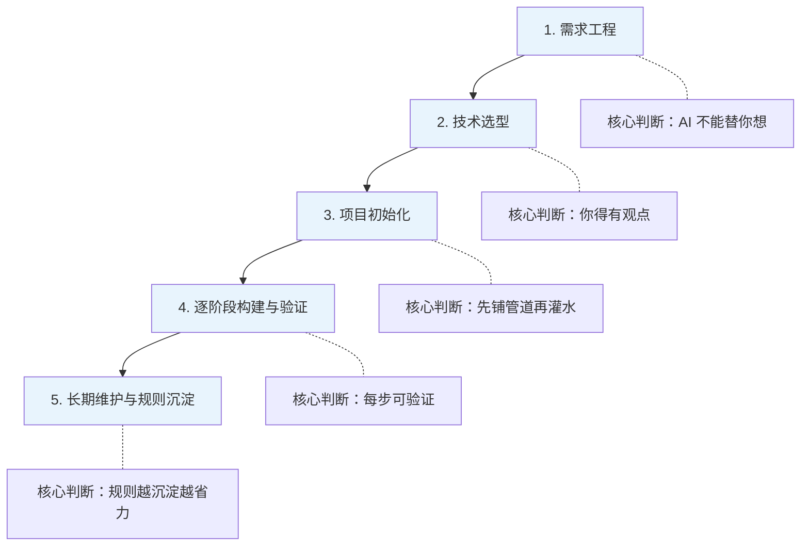

# 用 AI 写代码，为什么你反而需要更懂工程？

# 一句话导读

AI 编程工具让写代码变容易了，但让写好代码变难了——这篇文章讲的是如何在 AI 时代真正做好软件工程。

# 适合谁看

- 正在用 Cursor、Copilot 等 AI 编程工具，但感觉"只能写 demo，写不了正经项目"的开发者
- 想从零开始用 AI 搭建应用，但不知道如何组织需求和技术选型的产品经理
- 已经有工程经验，想理解 AI Agent 工作方式以便更好协作的工程师
- 带 AI 工程团队，需要建立工作规范的技术管理者

# 读完你会获得什么

- 理解 AI 编程的核心悖论：工具越强，对人的工程素养要求越高
- 掌握用 AI Agent 从零搭建应用的完整流程——从写需求到验证交付
- 理解为什么测试、Lint、类型系统在 AI 编程中变得前所未有的重要
- 能区分"vibe coding"和"正经工程"的边界，知道什么时候该用哪种
- 学会管理 AI Agent 的上下文、记忆和规则，避免失控
- 有一份可以直接照做的行动清单

---

## 01 背景：为什么这个问题现在值得讨论

过去一年，AI 编程工具经历了三次跃迁：从自动补全（Autocomplete），到行动级补全（Next Action Completion），再到能自主写代码、跑测试、修 bug 的 Agent。工具能力在短短几个月内发生了质变。

但一个反直觉的现象正在发生：**工具越强，翻车的人越多。**

原因很简单。以前的开发流程里，人是写代码的主体，工具只是加速器。人天然会做验证——自己写的代码，自己会检查。但 Agent 模式下，代码的生成和验证被拆开了：AI 写代码，人审代码。审代码这件事的难度，远比大多数人想的高。如果你不知道自己在看什么，审和没审一样。

更麻烦的是，AI 让"写出能跑的代码"变得太容易了。一个完全不懂 API 概念的人，可以让 Agent 生成一个调用第三方服务的应用，跑通、上线——然后把 API Key 明文写在客户端代码里，全世界可见。他甚至不知道该问"API Key 放在客户端有什么问题"。

这就是当前的局面：**入门门槛降低了，但出事的门槛也降低了。**

---

## 02 核心判断：AI 时代，工程素养不是变淡了，是变浓了

这段对话表面在讲"如何用 Cursor 从零搭建应用"，实际在讲一个更深层的判断：

**AI 编程工具没有降低对工程知识的需求，它改变了工程知识的表达方式。** 过去你需要自己写代码来证明你懂，现在你需要能在对话中精确地指定、在代码审查中准确地判断来证明你懂。

这意味着两件事：

1. **如果你有工程基础**，AI 是乘数——你的判断力被放大，你能在更高层面指挥 Agent 完成工作。
2. **如果你没有工程基础**，AI 是陷阱——你写得出第一版，但维护不了第二版。你会进入一个"先出活，后补课"的循环，而补课的代价远比先学再做的代价高。

视频主讲人 Lee Robinson 的核心立场很明确：他欢迎 AI 让更多人接触编程，但他不接受"工程知识可以跳过"这个叙事。**Vibe coding 是好的实验方式，但不能替代工程方法。**

---

## 03 概念澄清：先把关键名词讲准确

### AI Agent（AI 代理）

- **是什么**：能自主执行多步骤任务的 AI 程序。不同于单次问答，Agent 会规划步骤、执行操作、读取结果、根据结果调整后续行为。
- **解决什么问题**：把"人逐步指令"变成"人给定目标，AI 自主推进"。
- **不是什么**：不是万能的。它不能"替你想"，它只能在你的指令框架内行动。
- **和相关概念的区别**：Autocomplete 是"你写一个字，它猜下一个字"；Agent 是"你定一个目标，它写完整个方案并执行"。
- **例子**：你告诉 Agent"搭建项目并确保测试通过"，它会自己创建文件、安装依赖、写测试、跑测试、修复失败、提交代码。

### 前景 Agent vs 后台 Agent

- **前景 Agent**：你在当前对话中实时观察和干预的 Agent。你可以随时批准或否决它的操作。
- **后台 Agent**：从 Slack 或其他入口触发，在后台独立运行的 Agent。你不需要盯着它，完成后它会汇报结果。
- **区别**：前景 Agent 适合需要精细控制的阶段（项目初期、关键决策）；后台 Agent 适合明确的、可并行的任务（修 typo、修 UI bug）。
- **代价**：多个 Agent 同时操作同一代码库时，需要协调——否则会互相覆盖。

### 上下文窗口（Context Window）

- **是什么**：AI 模型在单次对话中能"记住"的内容总量。以 token 计量，当前主流模型约 200K token。
- **解决什么问题**：为 Agent 提供工作记忆，让它理解项目现状和你的指令。
- **不是什么**：不是无限大的。填满后，早期信息会被"稀释"，模型难以从中提取关键细节。
- **核心问题**：上下文使用率越高，模型越容易出现"大海捞针"问题——你知道信息在里面，但它找不到。类似你和一个人聊了 30 分钟，然后问他"我第一句话说了什么"。
- **例子**：对话进行到 24% 上下文使用量时，Agent 还能清晰回忆所有细节；到 90% 时，它可能忽略早期的关键约束。

### 自验证循环（Self-Verifying Loop）

- **是什么**：Agent 写代码 → 跑测试 → 测试失败 → 读取错误信息 → 修复代码 → 重新测试，直到通过。
- **解决什么问题**：让 Agent 不只是"写完就走"，而是能自行验证和修正。
- **前提条件**：必须有测试。没有测试，Agent 就没有验证手段。
- **例子**：Agent 写了一个页面，跑测试发现"找不到 main 元素"，它读取错误、补上 `<main>` 标签、重新测试、通过。

### Vibe Coding（氛围编程）

- **是什么**：用自然语言描述需求，让 AI 生成代码，不强求理解每行代码的写法，以"能跑就行"为标准。
- **适用场景**：快速原型、个人实验项目、一次性脚本。
- **不适用场景**：需要长期维护的项目、生产环境代码、团队协作项目。
- **核心风险**：第一版能跑，但无法迭代。因为你不理解代码结构，改不动。

### Cursor Rule（Cursor 规则）

- **是什么**：写入项目配置的规则文件，在每次对话开始时自动注入 Agent 的上下文。相当于给 Agent 写的"工作手册"。
- **解决什么问题**：避免每次对话重复说同样的话（"用 pnpm"、"跑测试"、"写规范的 commit"）。
- **演进**：早期是单一文件 `.cursorrules`；现在是 `.cursor/rules/` 目录下的多个文件，可以按需选择注入哪些规则、是否附加文档搜索能力。

---

## 04 整体框架：AI 协作开发的五个阶段

这个框架的核心逻辑是：**AI 编程不是"提示词工程"，是"工程判断力 + AI 执行力"的组合。** 你的判断力决定了方向和标准，AI 的执行力决定了速度。

五个阶段的关系：
- **需求工程**决定了做什么——AI 无法替你定义产品
- **技术选型**决定了怎么做——你的技术知识越深，选型越精准，Agent 执行越顺
- **项目初始化**决定了后续效率——测试、Lint、类型系统在第一天就装好，Agent 才能自验证
- **逐阶段构建**决定了质量——每步有可交付的验证标准，问题不累积
- **规则沉淀**决定了长期成本——重复指令变成配置，人的干预越来越少

---

## 05 关键机制：Agent 的自验证循环到底怎么运作

这是整段内容中最值得深入理解的机制。

### 输入

你给 Agent 一个任务（"搭建项目，确保测试通过"）+ 一组规则（"用 TypeScript、用 Playwright、写描述性 commit"）。

### 中间处理

Agent 按以下逻辑工作：

1. **规划**：将任务拆成子步骤，形成 to-do list
2. **执行**：逐步完成每个子步骤——创建文件、安装依赖、写代码
3. **验证**：运行测试和 Lint，获取反馈
4. **修正**：如果验证失败，读取错误输出，定位问题，修改代码
5. **提交**：验证通过后，自动 commit
6. **更新计划**：标记完成的步骤，推进到下一个

### 输出

每完成一个阶段，你得到：
- 可运行的代码
- 通过的测试
- 一条描述性的 commit
- 更新的计划文档

### 为什么这样设计

关键在于**把人的验证工作前置为系统验证**。在传统开发中，测试是人写给人看的——确保自己没改坏。在 Agent 模式下，测试是写给机器看的——让 Agent 知道自己做对了没有。

### 代价

- **前期投入大**：你必须先搭好测试基础设施，才能让 Agent 跑起来
- **测试本身可能有 bug**：如果测试写错了，Agent 会"通过"一个实际有问题的实现
- **不能覆盖所有问题**：测试能验证"功能是否符合预期"，但不能验证"设计是否合理"、"代码是否可维护"

### 适合/不适合场景

- **适合**：业务逻辑清晰、输入输出明确的功能（表单验证、数据处理、API 集成）
- **不适合**：主观判断类任务（UI 美不美观、文案好不好、架构选择对不对）

---

## 06 方法拆解：用 AI 从零搭建应用的完整流程

### 第一步：写一份结构化需求文档

**目标**：在对话开始前，把你想做的产品想清楚。

**具体动作**：
- 在 README 或独立文档中写下：产品目标、功能需求、技术选型、设计意向、测试策略、开发流程
- 需求要具体到"用 Google OAuth 登录"而不是"需要登录功能"
- 技术选型要有明确意见——用什么框架、什么包管理器、什么测试库

**判断标准**：一个不了解你项目的工程师读完这份文档，能独立开始写代码吗？如果能，Agent 也能。

**常见坑**：写得太模糊。"做一个音乐追踪 App"——Agent 会填入它自己的理解，而它的理解可能和你完全不同。

**产出物**：一份可迭代的需求文档，后续可以随开发推进持续更新。

### 第二步：让 Agent 生成计划，你来审核

**目标**：把需求变成可执行的分阶段计划。

**具体动作**：
- 把需求文档交给 Agent，让它生成计划
- 审核计划的拆分逻辑——阶段顺序是否合理？依赖关系是否正确？
- 审核每个阶段的可交付验证标准——"搭好项目"不是验证标准，"服务器能启动、测试能跑通"才是
- 把验证标准移入每个阶段内部，而不是堆在最后

**判断标准**：每个阶段完成后，能独立回答"这一步做对了吗？"

**常见坑**：跳过审核直接开工。Agent 生成的计划通常方向正确但细节有问题——阶段粒度不对、验证标准缺失、测试安排太晚。

**产出物**：一份你审核过的、每阶段都有交付标准的开发计划。

### 第三步：第一天就铺好验证基础设施

**目标**：在写任何业务代码之前，先让测试、Lint、类型系统就位。

**具体动作**：
- 让 Agent 在项目初始化阶段就安装和配置测试框架（如 Playwright、Jest）
- 配置 Lint（如 ESLint）——Lint 能给 Agent 即时反馈，类似"编译器报错"
- 使用 TypeScript 等类型系统——类型错误是另一种 Agent 可读取的反馈信号
- 配置 Git，约定 commit 规范

**判断标准**：项目初始化完成后，运行 `test`、`lint`、`build` 三个命令都能正常执行（哪怕测试只有一个"页面能渲染"的空壳）。

**常见坑**：觉得"先写功能，后补测试"。在没有测试的情况下，Agent 写错代码后只能靠你人工发现——这违背了 Agent 自验证的核心理念。

**产出物**：一个有完整验证管道的空项目。

### 第四步：逐阶段开发，每步验证

**目标**：按计划推进，每完成一个阶段都确保可运行、可验证。

**具体动作**：
- 每完成一个阶段，让 Agent 运行测试确认通过
- 审查关键文件——不需要逐行看，但要看整体结构和关键逻辑
- 遇到 Agent 产出不符合预期的部分，直接在对话中指出并让它修正
- 阶段完成后让它 commit 并更新计划

**判断标准**：任何时刻回退到最近的 commit，应用都能正常运行。

**常见坑**：连续让 Agent 跑多个阶段而不审查。累积的代码量越大，审查难度指数级上升。

**产出物**：每个阶段都有对应的 commit 和通过测试的可用代码。

### 第五步：管理上下文，适时重置对话

**目标**：避免上下文窗口"稀释"导致 Agent 性能下降。

**具体动作**：
- 每完成一个阶段并 commit 后，考虑开新对话
- 新对话中，Agent 可以从项目文件和计划文档重新获取上下文，不受之前对话的噪音干扰
- 把反复出现的指令写入 Cursor Rule，避免每次对话重复说明

**判断标准**：Agent 在新对话中的表现是否和在长对话中一样准确？如果是，说明重置对话是安全的。

**常见坑**：在同一个对话里塞太多任务。上下文到了 90% 以上时，Agent 遗漏早期约束的概率显著升高。

**产出物**：干净的分阶段对话历史和持续生效的规则文件。

---

## 07 案例讲解：从零搭建一个音乐追踪应用

### 场景背景

Lee 想复刻 Last.fm 的核心功能：连接 Spotify 账户，追踪听歌记录，展示最常听的歌手和歌曲统计。

### 遇到的问题

这不是一个"一句话需求"。它涉及认证、第三方 API、数据存储、前端展示——一个人要同时扮演前端、后端、DevOps、PM、设计师多个角色。

### 按框架如何处理

**需求工程阶段**：Lee 没有简单说"做一个音乐追踪 App"，而是写了一份结构化文档，包含：功能需求（Google OAuth、Spotify API、数据存储）、技术选型（React、Tailwind、Shadcn UI、Next.js）、测试策略（业务逻辑用单元测试、用户流程用端到端测试）、开发流程（用 Git、用 pnpm、每步 commit）。

**让 Agent 生成计划**：Agent 把需求拆成了五个阶段——项目初始化、数据库搭建、认证集成、Spotify 集成、功能开发。Lee 审核后发现两个问题：测试应该更早安排，验证标准应该放入每个阶段而不是堆在最后。他直接在对话中修正了这些问题。

**项目初始化**：Agent 自动安装了所有依赖、配置了 TypeScript 和 ESLint、搭建了测试框架、写了第一个测试（"页面能渲染"），甚至发现测试失败后自主修复了 `<main>` 元素缺失的问题。一切通过后，Agent 自动 commit。

**上下文管理**：项目初始化用了约 24% 的上下文。Lee 在 commit 后开了新对话，让后续任务从干净状态开始，避免早期对话内容干扰。

**规则沉淀**：当 Lee 发现自己反复说"要跑测试"、"要用 Git commit"时，他让 Agent 把这些指令写入了 Cursor Rule——后续对话中这些规则自动生效，不再需要手动重复。

### 最终结果

几个阶段下来，应用有了可运行的框架、通过的测试、规范的 commit 记录。前端虽然还很基础（"Hello World 级别"），但基础设施牢固——认证逻辑、数据模型、测试管道都已就位，后续功能迭代可以在这个基础上稳步推进。

### 说明了什么

**决定最终质量的不是 AI 的生成能力，而是你在需求阶段的精确度和验证管道的完整度。** 同一个 Agent，面对模糊需求和结构化需求，产出天差地别。

---

## 08 常见误区

### 误区一："AI 能替我做产品决策"

- **错误理解**：我把想法告诉 AI，它来决定产品应该怎么做。
- **为什么错**：AI 的"决策"基于训练数据的统计模式，不是基于你的用户、你的场景、你的约束。它能生成"合理的方案"，但无法判断"适不适合你"。
- **正确理解**：AI 是执行力放大器，不是判断力替代品。产品决策——做什么、不做什么、优先什么——必须由人来做。
- **应该怎么做**：在需求文档中明确你的判断（"用 Google OAuth 而不是邮箱注册"），然后让 Agent 执行。

### 误区二："Vibe coding 和正经工程是一回事"

- **错误理解**：AI 生成的代码能用就行，和手写代码没有本质区别。
- **为什么错**：Vibe coding 的产出是"此刻能跑的代码"，正经工程的产出是"未来可维护的系统"。前者没有测试、没有文档、没有规范；后者有。
- **正确理解**：Vibe coding 是探索工具，不是构建方式。用它做实验、做原型、做一次性脚本完全合理。用它做需要长期维护的项目，迟早要还债。
- **应该怎么做**：明确当前项目的属性。如果是实验——随便 vibe。如果是产品——按工程标准来。

### 误区三："有 AI 就不需要学基础了"

- **错误理解**：AI 能写代码，我不需要理解代码。
- **为什么错**：不理解的代码你审查不了，审查不了的代码你维护不了。AI 生成的代码有问题时，你需要能读懂错误信息、定位问题、给出精确修正指令。
- **正确理解**：AI 让"从零到能跑"变快了，但让"从能跑到可持续"更需要基础。数据结构、算法、API 概念、客户端与服务端的区别——这些不是过时知识，是审查 AI 产出的前提。
- **应该怎么做**：边用 AI 边学。看到 AI 生成了你不理解的代码，停下来问它"这段在做什么"——用 AI 学习基础知识，而不是跳过基础知识。

### 误区四："测试是可选的，现在不急"

- **错误理解**：先写功能，后补测试。测试是锦上添花。
- **为什么错**：在 Agent 模式下，测试不是锦上添花，是**自验证循环的前提**。没有测试，Agent 写完代码后没有任何手段确认自己做得对不对——只能等你来人工检查。
- **正确理解**：测试是 Agent 的"眼睛"。它让 Agent 能自己发现问题、自己修复问题。测试越早到位，Agent 越高效。
- **应该怎么做**：项目初始化阶段就搭好测试框架，哪怕第一个测试只是"页面能渲染"。

### 误区五："上下文窗口很大，不用担心"

- **错误理解**：200K token 的上下文窗口足够用，不需要管理。
- **为什么错**：已有研究表明，上下文使用率越高，模型从早期信息中提取关键细节的能力越差。95% 上下文使用率时，模型的表现显著下降。
- **正确理解**：上下文窗口是"工作记忆"，不是"无限硬盘"。就像和人聊天——聊 30 分钟后，对方记不住第一句话。
- **应该怎么做**：完成一个阶段并 commit 后，开新对话。把重复指令写入规则文件而不是每次对话重新说。

### 误区六："Agent 写的代码不需要审查"

- **错误理解**：Agent 跑通了测试，代码就没问题了。
- **为什么错**：测试验证的是"功能是否符合预期"，不是"实现是否合理"。Agent 可能用了低效的实现方式、遗漏了边界条件、或者做了不符合项目规范的选择。
- **正确理解**：审查的重点不是"代码能不能跑"，而是"代码是否合理"——结构是否清晰、命名是否规范、实现是否过度复杂。
- **应该怎么做**：每个阶段完成后，至少审查核心文件的结构和关键逻辑。不需要逐行看，但要看大局。

### 误区七："API Key 泄露这种事不会发生在 AI 写的代码里"

- **错误理解**：AI 生成的代码是"标准做法"，不会有安全漏洞。
- **为什么错**：AI 模型的训练数据中包含大量有漏洞的代码。如果你不告诉 Agent "API Key 不能放在客户端"，它完全可能把 Key 硬编码在前端代码里。你甚至不知道该提这个要求。
- **正确理解**：安全意识不会因为工具升级而自动出现。你需要主动在需求和规则中注入安全约束。
- **应该怎么做**：在需求文档和 Cursor Rule 中加入安全规则。"敏感信息必须放在服务端环境变量中"——这类规则应该成为项目标配。

---

## 09 实战清单：读完后可以马上照着做

### 立即能做

1. **写一份你当前项目的结构化需求文档**——按"产品目标 / 功能需求 / 技术选型 / 测试策略 / 开发流程"五个部分组织，哪怕每个部分只有三行。
2. **检查你的项目有没有测试**——如果没有，今天就加一个，哪怕只测"页面能渲染"。
3. **检查你的项目有没有 Lint 配置**——如果没有，装一个。ESLint、Pylint、Clippy，取决于你的语言。
4. **检查你的代码里有没有硬编码的密钥**——如果有，立刻移到环境变量中。

### 一周内能做

5. **为你的 AI 编程工具写第一条规则**——把你在对话中反复说的指令写成规则文件。"每次修改后跑测试"、"commit 信息要描述做了什么"——从这两条开始。
6. **把当前项目的开发计划拆成阶段**——每个阶段有明确的可交付验证标准。不是"做完前端"，而是"首页能渲染、导航能跳转、测试能通过"。
7. **在下一个开发任务中，先写测试再写功能**——体验一次 Agent 自验证循环的完整流程。
8. **做一次上下文管理实验**——完成一个任务后，分别在同对话和新建对话中执行下一个任务，对比 Agent 的表现差异。

### 长期要沉淀

9. **建立项目级别的 AI 工作规范**——技术选型偏好、测试覆盖标准、commit 规范、安全规则，全部写入规则文件，团队共享。
10. **补齐你的工程基础知识**——选一个你不扎实的领域（数据结构、网络协议、数据库原理），用 AI 辅助学习。每次让 AI 解释代码时，追问"为什么要这样设计"。
11. **建立代码审查清单**——审查 Agent 产出时看什么？结构是否清晰、命名是否合理、测试是否覆盖关键路径、安全规则是否遵守——形成你自己的检查项。

---

## 10 总结

AI 编程工具正在改变软件的构建方式，但这个改变的方向和大多数人的直觉相反。工具越强大，对使用者的要求不是降低了，而是转移了——从"能不能写出来"转移到"能不能想清楚、看明白、管得住"。

Lee Robinson 在对话中反复强调的核心观点是：AI Agent 需要你提供精确的方向、需要验证管道来闭环、需要上下文管理来保持清醒。测试、Lint、类型系统——这些过去被视为"工程最佳实践"的东西，在 Agent 时代变成了"让 Agent 正常工作的基础设施"。不是可选的，是必须的。

对话中最值得注意的细节是那个 Cursor 工程师的故事：一个看似简单的"给客户退款并发邮件"任务，那位工程师用了脚本而不是 SaaS 工具，写入了错误处理、干跑验证、状态追踪、交付测试，最后把这个脚本提交到了团队的脚本仓库。这不是 vibe coding，这是工程思维乘以 AI 工具的产出。**AI 没有替代他的判断力，AI 放大了他的判断力。**

最终的判断很简单：**AI 时代最有价值的能力，不是会用 AI，是在 AI 的辅助下依然知道什么是好的工程。**
