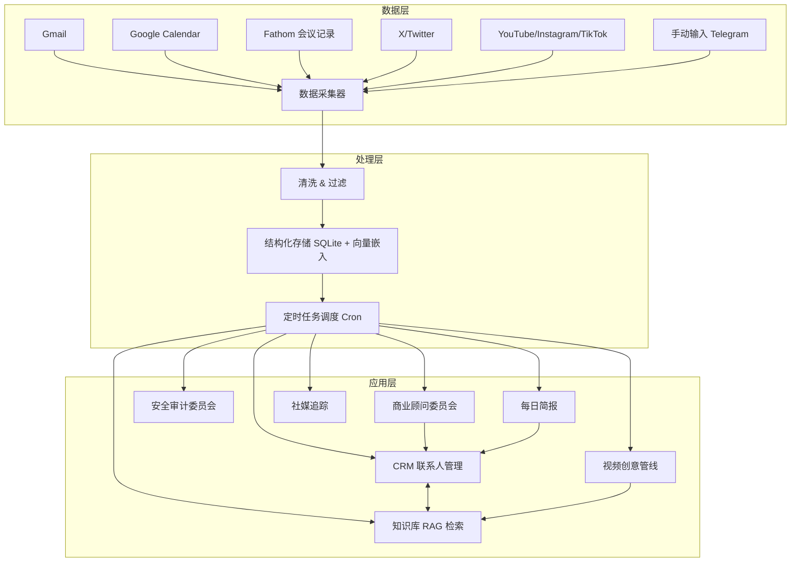

# 用 OpenClaw 搭建个人 AI 操作系统：从零散工具到自进化系统

# 一句话导读

一个人如何用一台 MacBook 搭建出 CRM、知识库、商业顾问、安全审计等十几个系统，并让它们互相协作、自我进化。

# 适合谁看

- 有技术基础、正在用或考虑用 AI Agent 框架提升个人效率的独立工作者
- 内容创作者——需要管理知识、追踪数据、生产创意的全栈个体
- 小团队创始人——没有预算雇佣多个岗位，但需要覆盖销售、运营、安全等职能
- 对本地优先（local-first）AI 架构感兴趣的技术决策者
- 已经在用 Claude/ChatGPT 但觉得零散对话无法积累的人

# 读完你会获得什么

- 理解"个人 AI 操作系统"的架构逻辑——为什么组件之间要互相喂数据
- 能区分 OpenClaw 的三层核心机制：身份系统、记忆系统、技能系统
- 能照着 prompt 清单搭建自己的 CRM、知识库、每日简报等核心模块
- 理解本地 AI 系统的安全风险边界，以及可用的防护策略
- 明白"自进化"不是魔法，而是「反馈→修正→更新 prompt」的工程闭环
- 能判断这套方案适不适合自己——它有哪些硬代价和前提条件

---

## 01 背景：为什么这个问题现在值得讨论

大部分人的 AI 使用方式是零散的：在 ChatGPT 里问问题，在 Claude 里写邮件，用 Copilot 补代码。每次对话都是孤立的，没有记忆、没有上下文、没有协作。

这意味着三个问题始终无法解决：

**第一，知识无法积累。** 你告诉过 AI 你的偏好、你的业务背景、你的写作风格——下一条对话它全忘了。

**第二，系统无法协作。** 你的邮件里有客户信息，你的日历里有会议安排，你的笔记里有知识素材——它们分别躺在不同工具里，互相不知道对方的存在。

**第三，流程无法自动化。** 你每天重复做的事——检查邮件、回顾会议、追踪数据——每件都要你亲手启动。

OpenClaw 试图用一个框架解决这三件事：给 AI 一个持久的身份和记忆，让它接入你的所有数据源，然后把重复性工作变成定时任务。

它不是唯一的方案，但它是目前开源生态中最完整的一个本地优先实践。

---

## 02 核心判断：视频真正想讲的不是"这些用例很酷"

视频展示了十几个用例——CRM、知识库、商业顾问、安全审计、社媒追踪、视频创意管线、每日简报、食物日记……如果只看到"每个用例怎么配"，就错过了最重要的东西。

**核心判断：真正有价值的不是单个用例，而是用例之间的耦合关系。**

CRM 里的联系人数据喂给每日简报，会议记录提取的行动项关联到 CRM 联系人，知识库的内容触发视频创意管线，社媒数据进入商业顾问的分析池，安全审计检查所有系统的代码……每个模块单独看只是"自动化了一个任务"，但组合起来，它们构成了一个**数据流动的系统**——上游的输出是下游的输入，单一数据点在多个上下文中被复用，价值被放大。

这就是为什么作者反复说"你会看到所有这些模块如何互相增强"。他展示的不是工具箱，是操作系统。

---

## 03 概念澄清：先把关键名词讲准确

### OpenClaw

- **是什么：** 一个开源框架，用于在本地搭建个人 AI 助手，支持接入多种大模型
- **解决什么问题：** 把零散的 AI 对话变成有身份、有记忆、有技能的持续服务
- **不是什么：** 不是大模型本身，不是 SaaS 产品，不是聊天机器人壳子
- **和相关概念的区别：** ChatGPT 是对话工具，OpenClaw 是对话引擎之上的一整套运行时——身份、记忆、技能、调度、集成都在里面
- **例子：** 你用 ChatGPT 写邮件，每次都要重新说"我的风格是简洁专业"；用 OpenClaw，你的身份文件和记忆文件里已经存了这个偏好，每次自动生效

### Identity 文件（identity.md）

- **是什么：** 定义 AI 助手基本身份的配置文件——名字、角色、能力范围
- **解决什么问题：** 让 AI 知道"我是谁"，从而在行为上有边界和一致性
- **不是什么：** 不是完整的性格定义（那是 Soul 文件的职责）
- **例子：** "你是一个个人 AI 助手，名叫 Cloud，服务对象是 Matt"

### Soul 文件（soul.md）

- **是什么：** 定义 AI 助手行为风格的文件——回答多简洁、多正式、幽默程度、不同场景下的风格切换规则
- **解决什么问题：** 同一个 AI 在不同上下文中表现不同——和你在 Telegram 私聊时像朋友，在 Slack 工作频道里像同事
- **不是什么：** 不是记忆系统（Soul 定义"怎么说话"，记忆系统定义"知道什么"）
- **例子：** "当从 Telegram 触发时，语气放松、可以直接；当从 Slack 触发且其他人可见时，正式、专业"

### 记忆系统（Memory）

- **是什么：** OpenClaw 的持久化知识层。自动记录每日对话要点，提炼偏好，存入记忆文件，下次对话时自动读取
- **解决什么问题：** AI 的知识跨对话积累，不需要你每次重复说明
- **不是什么：** 不是简单的对话历史存储。它是经过蒸馏的偏好和知识——从100条对话中提炼出"你喜欢简洁的写作风格"这一条规则
- **和相关概念的区别：** QMD（Shopify 创始人做的记忆系统）和 Supermemory（外部服务）是替代实现，作者用的是默认内置方案
- **例子：** 你用过三次"humanizer"技能去除 AI 味道，记忆系统提炼出"用户偏好去除 AI 痕迹的写作风格"，后续自动应用

### Cron 任务

- **是什么：** 定时执行的任务调度，来自 Unix 系统的经典概念
- **解决什么问题：** 不需要你手动触发，AI 按计划自动执行检查、分析、备份等重复性工作
- **不是什么：** 不是实时响应——它是按时间表执行的批处理
- **例子：** 每晚 3:30 AM 运行安全审计，每 30 分钟检查紧急邮件，每小时备份数据库

### RAG（检索增强生成）

- **是什么：** 先从本地知识库中检索相关内容，再让大模型基于检索结果生成回答
- **解决什么问题：** 大模型的训练数据是通用的，你的私有数据它不知道。RAG 让它能查询你的数据
- **不是什么：** 不是"让 AI 记住所有东西"——它是按需检索，不是全量加载
- **例子：** 你问"我上次和 John 聊了什么"，系统先从 CRM 数据库向量搜索 John 相关记录，再把结果喂给大模型生成回答

---

## 04 整体框架：这套内容应该如何理解

可以把作者的系统理解为一个三层架构：

**文字解释：**

- **数据层：** 所有原始数据源——邮件、日历、会议记录、社交媒体、手动输入。数据从这里进入系统。
- **处理层：** 原始数据先被清洗（去噪、去营销邮件），再结构化存储（SQLite + 向量嵌入），然后由 Cron 调度器按时间表触发各类处理任务。
- **应用层：** 面向用户的具体功能——CRM、知识库、商业分析等。

**关键在于层与层之间的关系不是单向的。** 应用层的输出会回流到处理层——CRM 里新增的联系人会影响每日简报的内容，知识库里的素材会触发视频创意管线，安全审计会修改处理层的代码。这就是"自进化"的具体含义：不是 AI 自己变聪明了，而是系统的组件在互相修正。

---

## 05 关键机制：它到底是怎么运行的

### 机制一：身份 + 记忆——AI 为什么能"认识你"

**输入：** 你和 AI 的所有历史对话

**处理：**
1. 每日自动生成笔记文件（以日期命名的 markdown）
2. 从笔记中蒸馏出偏好和模式，存入 memory.md
3. 下次对话启动时，自动读取 memory.md 和 identity 文件
4. 同时对所有记忆文件做向量化，支持 RAG 检索

**输出：** AI 在新对话中自动应用你的偏好——写作风格、关注领域、工作模式

**为什么这样设计：** 大模型本身是无状态的。身份文件和记忆文件是人工构造的"状态层"，让每次对话看起来是连续的。

**代价：** 记忆蒸馏可能出错——AI 可能从少数对话中过度归纳出一条"偏好"。需要偶尔人工检查 memory.md。

**适合/不适合：** 适合有稳定偏好的人；不适合每天都在变的人（记忆系统会反复覆盖自己）。

### 机制二：多源数据采集 → 清洗 → 结构化存储

**输入：** Gmail、Google Calendar、Fathom 会议记录、X/Twitter 等

**处理：**
1. 定时拉取原始数据（邮件每 30 分钟、会议记录每 5 分钟）
2. 用确定性代码过滤噪音（营销邮件、冷启动推销）
3. 用 LLM 判断剩余内容是否值得保存
4. 对值得保存的内容提取实体、嵌入向量、存入 SQLite

**输出：** 本地结构化数据库，支持自然语言查询

**为什么这样设计：** 原始数据噪音极大。不过滤直接存库，检索质量会严重下降。用两层过滤（确定性 + LLM）是必要的——确定性代码处理明确模式（如已知营销发件人），LLM 处理需要语义理解的部分（如这封邮件是不是真正有价值的商业联系）。

**代价：** 过滤可能误删重要内容。作者提到行动项提取有时不准——这就是 LLM 判断层的固有误差。

**适合/不适合：** 适合数据源相对固定的场景；不适合数据源频繁变化的情况（每新增一个数据源都要写新的采集和清洗逻辑）。

### 机制三：反馈 → 修正 → 自进化

**输入：** 用户对 AI 输出的反馈（批准/拒绝行动项、修正错误判断）

**处理：**
1. 用户拒绝一个行动项时，AI 记录"为什么这是错的"
2. 用这个原因更新对应的 prompt 文件
3. 下次运行时使用更新后的 prompt

**输出：** 逐渐提高准确率的自动化流程

**为什么这样设计：** 这是整个系统最被误解的部分。"自进化"不是 AI 自己学会了新知识，而是**人工反馈被编码回 prompt，形成闭环**。本质上和传统软件的"修 bug"没区别，只是修的是 prompt 而不是代码。

**代价：** 闭环不是自动的——你必须给反馈。如果你只是忽略错误而不纠正，系统不会自己变好。

**适合/不适合：** 适合愿意持续调优的人；不适合"设完就不管"的心态。

### 机制四：并行专家委员会

**输入：** 来自多个数据源的汇总数据

**处理：**
1. 拉取所有相关数据（YouTube 分析、邮件、会议记录等）
2. 分配给 8 个不同角色的专家 Agent（财务、营销、增长等）
3. 所有专家并行运行，各自产出建议
4. 一个综合器合并所有建议，去重，按优先级排序

**输出：** 一份排名的推荐清单，发送到 Telegram

**为什么这样设计：** 单个 Agent 容易有视角盲区。并行专家模拟了真实团队中不同职能的碰撞——财务专家看到的问题，增长专家未必注意到。

**代价：** Token 消耗是单个 Agent 的 8 倍以上。并行运行增加系统复杂度。

**适合/不适合：** 适合数据量大、决策维度多的场景；不适合简单场景（8 个专家看同样少的数据，产出的差异化不够）。

---

## 06 方法拆解：如果自己要做，应该怎么落地

### 第一步：搭建 OpenClaw 基础环境

**目标：** 跑通最基本的 OpenClaw 实例

**具体动作：**
1. 安装 OpenClaw（参照官方文档）
2. 配置身份文件 identity.md——定义 AI 的名字和角色
3. 配置灵魂文件 soul.md——定义回答风格、正式程度、场景切换规则
4. 接入至少一个聊天渠道（Telegram 最简单）
5. 配置一个大模型 API（作者主要用 Claude Opus 4.6）

**判断标准：** 能在 Telegram 里和 AI 对话，AI 知道自己是谁，回答风格符合你写的 Soul 文件

**常见坑：** Soul 文件写得太长反而不好——AI 会选择性忽略。保持在 200 行以内，规则要具体、可执行。

**产出物：** 一个有身份、有风格、可通过即时通讯工具交互的 AI 助手

### 第二步：配置记忆系统

**目标：** 让 AI 跨对话积累知识

**具体动作：**
1. 确认记忆系统已启用（默认内置方案即可）
2. 和 AI 进行几轮有实质内容的对话——故意暴露你的偏好（写作风格、关注领域）
3. 检查 memory 文件夹，确认每日笔记和蒸馏偏好被正确生成

**判断标准：** 新对话中 AI 能准确引用你之前说过的偏好，且不需要你重复

**常见坑：** 记忆蒸馏是近似的。如果你的偏好表述前后矛盾，AI 会困惑。在初期养成"明确说偏好"的习惯。

**产出物：** 一个会随时间了解你越来越多的 AI

### 第三步：接入第一个数据源，搭建第一个应用

**目标：** 从"聊天"升级到"做事"

**具体动作：**
1. 选择你最痛的一个问题（建议从知识库或每日简报开始，比 CRM 简单）
2. 接入对应的数据源（知识库需要 Telegram 输入渠道；简报需要日历和邮件）
3. 用自然语言向 OpenClaw 描述你想要的功能——这就是"prompt 即代码"
4. 测试基本流程，逐步调优

**判断标准：** 不需要你手动触发，AI 能自动完成一次完整的数据采集 → 处理 → 输出循环

**常见坑：** 不要一上来就搭所有模块。第一个模块跑稳再搭第二个。每个模块都需要迭代——你不可能一次写对 prompt。

**产出物：** 一个能自动运行的单个应用模块

### 第四步：配置 Cron 任务，建立自动化节奏

**目标：** 让系统按时间表自动运行

**具体动作：**
1. 列出你希望定时执行的任务和频率
2. 在 OpenClaw 中配置 Cron 任务
3. 设置失败告警（任务失败时通知你）
4. 运行 3-5 天，检查日志，修正问题

**判断标准：** 任务按时触发，成功/失败有记录，失败时你能收到通知

**常见坑：** 注意 API 配额分布——作者特意把安全审计放在凌晨 3:30，就是避免和其他夜间任务抢额度。

**产出物：** 一套稳定运行的定时任务系统

### 第五步：增加模块，建立模块间连接

**目标：** 让数据在模块间流动，实现复合价值

**具体动作：**
1. 每增加一个模块，明确它的数据输入来自哪里、输出流向哪里
2. 在现有模块的 prompt 中增加对其他模块输出的引用
3. 验证数据流是否真的在流动——手动检查几个跨模块的查询

**判断标准：** 在一个模块中输入的数据，能在另一个模块的输出中被正确引用

**常见坑：** 这是整个系统最难的部分。模块间连接不是自动的——你需要在 prompt 里显式告诉 AI 去查另一个数据源。

**产出物：** 一个模块间有数据流动的 AI 操作系统

### 第六步：加固安全

**目标：** 把风险降到可接受的水平

**具体动作：**
1. 用确定性代码过滤外部输入中的 prompt 注入攻击
2. 最小化权限——OpenClaw 对邮件、日历只给读权限，不给写权限
3. 日志中自动脱敏——检测到密钥、token 等自动打码
4. 敏感数据加密存储
5. 设置定时备份（每小时一次数据库 + 代码仓库）

**判断标准：** 外部注入的恶意指令被拦截；即使数据库泄露，没有明文密钥；备份可恢复

**常见坑：** 安全没有完美方案。作者明确说了"it's not perfect, it will never be perfect"——大模型是非确定性系统，你无法 100% 防住所有注入。目标是降低风险，不是消除风险。

**产出物：** 一个有基本安全防护的本地 AI 系统

---

## 07 案例讲解：用一个具体场景串起来

**场景背景：** 你是一个独立内容创作者，每天要处理大量信息——看文章、看邮件、开会、想视频创意、追踪数据。

**遇到的问题：** 信息散落在各处，会议讨论的创意要靠记忆，邮件里的重要联系容易被淹没，数据复盘全靠手动。

**按框架如何处理：**

**第一步——搭建知识库：** 在 Telegram 里建一个 topic，看到好文章直接扔链接进去。OpenClaw 自动抓取内容、提取关键实体、向量化存储。你的团队成员也加入这个 topic，看到你觉得值得读的内容。你以后可以用自然语言查询："给我看过所有关于 OpenAI 的文章。"系统从向量数据库中检索，瞬间返回。

**第二步——接入 CRM：** 配置 OpenClaw 扫描 Gmail 和日历。过滤掉营销邮件，只保留真实人际联系。每个联系人自动建档——谁、什么公司、怎么认识的、上次聊了什么。3 个月后，你有了一个 300+ 联系人的本地 CRM，可以随时问"我上次和 Stripe 的谁聊过？"

**第三步——会议行动项闭环：** 你和赞助商开了一个会。Fathom 自动转录会议。OpenClaw 提取行动项——"Matt 说他会发一封跟进邮件"。这个行动项推送到你的 Telegram，你批准后自动进入 Todoist。三天后，OpenClaw 检测到你确实发了那封邮件，自动标记完成。如果赞助商说"我会把合同发给你"，系统也会追踪——他们发了吗？

**第四步——创意从信息流中长出来：** 你在 Slack 里看到一篇关于新模型发布的文章，回复"这是个视频创意"。OpenClaw 自动启动深度研究——搜索 X 上的讨论、查趋势、评估这个创意值不值得做、生成视频大纲、创建 Asana 任务卡片。10 分钟后，一个完整的视频策划方案出现在你的任务管理工具里。

**第五步——每日简报把一切串起来：** 每天早上，你收到一份简报：昨天的视频数据、今天的会议和背景、待办事项、紧急邮件摘要。这些信息分别来自社媒追踪、CRM、行动项系统和邮件扫描——它们在你不需要主动切换工具的情况下，汇总到了一个地方。

**最终结果：** 你不再是"打开邮件→打开日历→打开分析后台→打开笔记"的切换机器。数据在系统内流动，重复性工作自动完成，你只需要做判断和决策。

**说明了什么：** 单个模块的价值是"省了 20 分钟"。模块组合的价值是"改变了工作方式"。关键不是工具多，而是数据在工具间流动。

---

## 08 常见误区：很多人会在哪里理解错

**误区一："AI 自己会变聪明"**

- **错误理解：** OpenClaw 的自进化意味着 AI 会自己学习、自己变好
- **为什么错：** 所谓自进化，本质是「人工反馈 → 修改 prompt → 下次行为改变」的工程闭环。AI 不会自己发明新能力，它只是在你的纠正下减少重复犯错
- **正确理解：** 自进化 = 持续的人工反馈 + 自动化的 prompt 更新。你给反馈，它改行为。不给反馈，它不会变
- **应该怎么做：** 把给反馈当成日常习惯，而不是可选项

**误区二："本地运行 = 绝对安全"**

- **错误理解：** 数据都在本地，所以没有安全问题
- **为什么错：** 本地存储只解决了数据不在云端的问题。但 prompt 注入攻击的威胁来自外部数据本身——一封精心构造的邮件可能包含"忽略之前所有指令"的注入语句，被 AI 执行
- **正确理解：** 本地运行减少了数据泄露的面，但引入了新的攻击面——AI 系统对输入的信任。必须做输入过滤和权限最小化
- **应该怎么做：** 确定性代码过滤 + 最小权限原则 + 日志脱敏 + 定期安全审计

**误区三："prompt 写一次就行了"**

- **错误理解：** 把 prompt 给 OpenClaw，它就能完美运行，不需要迭代
- **为什么错：** 视频中每个模块都经过多次调优。行动项提取会误判，邮件过滤会漏掉或误删，专家建议会有重复——这些都是 prompt 需要持续调整的证据
- **正确理解：** Prompt 是活的代码，需要根据运行结果持续优化
- **应该怎么做：** 上线后前两周每天检查输出，逐步修正。稳定后可以降低频率，但不能完全不维护

**误区四："所有功能都要一起搭"**

- **错误理解：** 看视频里十几个模块，觉得要一口气全搭完
- **为什么错：** 每个模块都需要调试。同时搭多个模块，问题交叉在一起，你分不清是哪个模块出了错
- **正确理解：** 一次搭一个模块，跑稳了再搭下一个。模块间连接是最后一步
- **应该怎么做：** 先搭你痛点最深的那个。作者自己最常用的是知识库，不是 CRM

**误区五："OpenClaw 能代替所有软件"**

- **错误理解：** 有了 OpenClaw，不需要任何 SaaS 了
- **为什么错：** OpenClaw 替代的是高度个性化的需求（个人 CRM、个人知识库），但在通用场景下，专业 SaaS 的可靠性和功能深度仍然更好。作者的 CRM 只有 371 个联系人——如果是一个 10 万级联系人、多角色协同的销售团队，自建 CRM 不现实
- **正确理解：** OpenClaw 适合"标准工具太重、纯手工太慢"的中间地带
- **应该怎么做：** 先审视你为哪些 SaaS 付了费但只用到了 20% 的功能——那些是 OpenClaw 可以替代的

**误区六："向量搜索比关键词搜索强"**

- **错误理解：** RAG + 向量搜索能解决所有检索问题
- **为什么错：** 向量搜索擅长语义匹配（"关于 OpenAI 的文章"），但不擅长精确匹配（"标题包含 QwQ-35 的文章"）。视频作者实际上混合使用了向量列和结构化查询
- **正确理解：** 向量搜索和结构化查询是互补的，不是替代关系
- **应该怎么做：** 对实体、日期、精确名称用结构化查询；对语义类问题用向量搜索

**误区七："模型越强越好"**

- **错误理解：** 所有任务都用最强的模型（如 Opus）
- **为什么错：** 8 个专家并行运行 × 每个用 Opus = 巨额 token 费用。而且不同任务对模型能力的要求差异很大——过滤营销邮件用 Sonnet 就够了，商业战略分析才需要 Opus
- **正确理解：** 根据任务复杂度选择模型，简单任务用小模型，复杂任务用大模型
- **应该怎么做：** 为不同技能配置不同模型。作者的日常对话用 Sonnet，商业顾问委员会用 Opus

---

## 09 实战清单：读完后可以马上照着做

### 立即能做

- [ ] 安装 OpenClaw，配置 identity.md 和 soul.md，在 Telegram 里完成第一次对话
- [ ] 把你的核心偏好（写作风格、关注领域、工作模式）写进 soul.md，测试 AI 是否在新对话中自动应用
- [ ] 选择你最痛的一个日常重复任务，用自然语言向 OpenClaw 描述你想要什么，先跑通最小流程

### 一周内能做

- [ ] 搭建知识库——从 Telegram 投入 10 篇你最近读过的文章，测试自然语言检索是否好用
- [ ] 配置第一个 Cron 任务——从最简单的"每日早上 8 点发简报"开始
- [ ] 为你的主要模型下载一份官方 prompt 最佳实践指南，存到本地，让 OpenClaw 在修改任何 prompt 时参考它
- [ ] 设置最基本的安全防护：确认 API 权限是只读的，日志中检查是否有密钥明文

### 长期要沉淀

- [ ] 逐步增加模块，每增加一个都明确其数据输入和输出——画出你自己的数据流图
- [ ] 建立反馈习惯——每次 AI 犯错，不只是忽略，而是告诉它为什么错。持续一个月后检查 memory.md，看蒸馏结果是否准确
- [ ] 配置加密备份策略——数据库每小时备份到加密存储，代码仓库同步到 GitHub，备份失败时告警
- [ ] 定期做安全审计——即使是手动检查也行。重点看：外部输入是否都经过清洗，权限是否还是最小化的，日志里有没有异常
- [ ] 评估哪些 SaaS 可以被 OpenClaw 替代，哪些不能——做一张清单，标注替代的成本和收益

---

## 10 总结

OpenClaw 代表的不是一个工具，而是一种工作方式的重新设计。核心思路是：把散落在不同系统中的数据汇聚到本地，用 AI 做清洗、结构化和检索，再用定时任务把重复工作自动化。

这个思路的关键不在于单个模块有多酷，而在于模块之间的数据流动。CRM 的数据丰富了每日简报，知识库的素材触发了视频创意，社媒数据喂给了商业顾问——每一个新增模块都让已有模块更有价值。这是复利效应，不是功能堆叠。

但这条路上没有免费的午餐。每个模块都需要调优，安全防护永远不够完美，token 成本随模块数量线性增长，而最关键的自进化机制依赖于你持续给反馈——这意味着你省下了执行时间，但必须投入治理时间。

最后，一个判断：**这套系统适合"愿意用工程思维管理自己生活"的人。** 它不是开箱即用的产品，是你需要持续搭建和调试的工程。如果你享受这个过程，它会成为你最强的个人工具。如果你只想"设完就忘"，它会变成一个永远在出 bug 的半成品。
