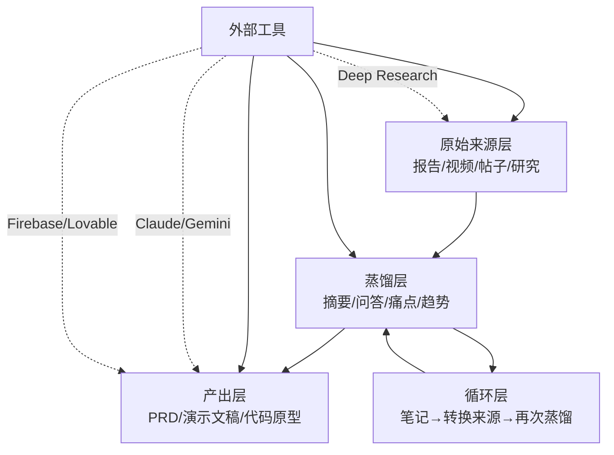

# NotebookLM 实战指南：从信息过载到可执行产出

# 一句话导读

NotebookLM 的核心价值不是「和文档聊天」，而是作为一个知识蒸馏中枢，把散乱信息压缩成可行动的决策依据，再配合外部工具把决策变成产出。

# 适合谁看

- 需要快速消化大量研究报告、用户反馈、行业文档的产品经理或创业者
- 想用 AI 工具链搭建从调研到原型的工作流，但不知道如何串联各工具的独立开发者
- 听过 NotebookLM 但只用来做摘要，想知道还能做什么的知识工作者
- 正在做竞品分析或用户痛点梳理，需要从多个信息源中提炼结构化结论的人
- 对「AI 工具组合拳」感兴趣，想了解 Deep Research + NotebookLM + 代码工具如何衔接的人

# 读完你会获得什么

- 理解 NotebookLM 的完整功能地图，而不只是「上传文件然后问问题」
- 掌握「来源→蒸馏→笔记→转回来源」的核心循环，这是用好 NotebookLM 的关键机制
- 学会把 NotebookLM 和 Deep Research、Claude、AI 编码工具组合成一条完整工作流
- 能照着步骤完成从行业调研到产品需求文档的完整流程
- 知道免费版和付费版的实际差异，做出合理的取舍判断
- 识别 5 个以上常见误区，避免把 NotebookLM 用成低效的聊天机器人

---

## 01 背景：为什么这个问题现在值得讨论

信息获取的成本已经接近零。一篇 Deep Research 报告、一段 YouTube 视频、一个 Reddit 帖子——获取它们几乎不需要付出什么。但理解、整合、把这些信息变成可执行的判断，成本反而更高了。

过去的知识管理工具解决这个问题的方式是「存起来以后看」。Notion、Obsidian、各种笔记软件，本质上都是存储系统。它们帮你归档，但不帮你理解。

NotebookLM 做了一件不同的事：它不存储信息，它蒸馏信息。你把来源喂进去，它帮你把几百页的内容压缩成你可以理解和行动的形式。更重要的是，它的回答始终锚定在你提供的来源上，而不是从训练数据中编造——这大幅降低了幻觉问题。

但工具本身只是起点。单独用 NotebookLM，你能做摘要和问答；把它放进一条工具链里，你能从「一堆文档」走到「一个可运行的产品原型」。这才是它真正值得花时间学的原因。

---

## 02 核心判断：视频真正想讲的不是工具功能

视频表面上是 NotebookLM 的功能教程，但它实际想传递的判断是：

**工具的价值不在于单个功能有多强，而在于你能不能用「蒸馏循环」把信息一步步压缩成行动。**

视频中最有价值的部分不是某个按钮在哪里，而是这个循环：

上传来源 → 提问蒸馏 → 保存笔记 → 笔记转回来源 → 再次蒸馏 → 最终输出结构化文档

大多数人在 NotebookLM 里只做前两步就停了。视频作者展示了完整走完这个循环后，把蒸馏结果喂给 AI 编码工具，直接生成了一个可运行的语言学习应用。这才是 NotebookLM 从「好用」变成「不可替代」的分界线。

---

## 03 概念澄清：先把关键名词讲准确

### NotebookLM

- **它是什么**：Google 推出的 AI 笔记本，可以上传多种来源，对来源内容进行问答、摘要和生成多种格式的输出
- **它解决什么问题**：信息过载——把大量文档压缩成你可以理解和行动的形式
- **它不是什么**：它不是通用聊天机器人（如 ChatGPT），它的回答严格锚定在你上传的来源上
- **和相关概念的区别**：与 Perplexity 等搜索型 AI 不同，NotebookLM 不搜索互联网，只处理你给的来源；与通用笔记工具不同，它不是存储系统，而是理解系统
- **例子**：你上传了 5 份行业报告，问「这些报告里提到的共同趋势是什么」，它会从这 5 份报告里综合回答，而不是从互联网上找答案

### 来源（Source）

- **它是什么**：你上传到 NotebookLM 的任何信息载体——PDF、网页链接、YouTube 视频、Google Drive 文件、复制的文本
- **它解决什么问题**：定义 NotebookLM 的知识边界——它只基于你给的来源回答问题
- **它不是什么**：来源不是训练数据，NotebookLM 不会用你的来源训练模型
- **和相关概念的区别**：来源 vs. 笔记——来源是原始素材（不可在 NotebookLM 内编辑），笔记是你自己的思考产出
- **例子**：一份 OECD 教育趋势报告、一段 Y Combinator 的 YouTube 视频、一篇 Reddit 帖子，每个都是独立的来源

### 蒸馏（Distillation）

- **它是什么**：通过提问让 NotebookLM 从来源中提取、压缩、重组信息的过程
- **它解决什么问题**：把几百页的原始内容变成几段你可以直接使用的信息
- **它不是什么**：蒸馏不是简单摘要——你可以指定角度（「从用户痛点角度总结」），产出可以比原文更有结构
- **和相关概念的区别**：蒸馏 vs. 搜索——搜索是在来源中找到某句话，蒸馏是从多个来源中综合出原文没有直接写出的结论
- **例子**：10 个 Reddit 帖子各自提到不同痛点，你问「总结语言学习用户的共同痛点」，NotebookLM 能从 10 个来源中归纳出 3-5 个核心痛点——这是任何一个单独来源里都没有的

### 转换为来源（Convert to Source）

- **它是什么**：把你在 NotebookLM 中生成的笔记或摘要转化为新的来源，让后续提问可以引用它
- **它解决什么问题**：让你的蒸馏结果可以反过来喂养下一次蒸馏，形成迭代循环
- **它不是什么**：不是简单的复制粘贴——转换后的来源会获得和原始来源同等的引用地位
- **和相关概念的区别**：笔记 vs. 转换后的来源——笔记只是你写的文本，转换后它变成了 NotebookLM 可以引用的知识基础
- **例子**：你从行业报告中蒸馏出「AI 语言学习的 5 个市场趋势」，保存为笔记并转换为来源；然后选中这个新来源加上用户痛点来源，问「基于趋势和痛点，这个应用应该有哪些核心功能」——此时蒸馏结果本身成为了新推理的基础

---

## 04 整体框架：这套内容应该如何理解

NotebookLM 的使用可以理解为三层结构：

**第一层：来源层。** 这是所有操作的起点。来源的质量直接决定产出的质量。视频作者花了大量时间展示如何从多个渠道收集来源：直接上传文件、链接 YouTube 视频、从 Google Drive 导入、复制 Deep Research 产出的文本、使用「发现来源」功能搜索外部内容。**来源的选择本身就是一次判断——你选了什么来源，就定义了 NotebookLM 看到的世界。**

**第二层：蒸馏层。** 来源上传后，通过提问、摘要、音频概述、思维导图、报告生成等方式，从来源中提取结构化信息。这一层的核心动作是「选准角度提问」——同一个来源集，不同的提问角度会产生截然不同的蒸馏结果。

**第三层：产出层。** 蒸馏的结果可以导向多种最终产出：产品需求文档、演示文稿、学习资料、FAQ 页面。但关键机制是中间的**循环层**：蒸馏结果保存为笔记→笔记转换为来源→新来源参与下一轮蒸馏。这个循环让信息一步步被压缩和精炼，直到变成可直接行动的结论。

外部工具不是可选项，而是这个框架的加速器。Deep Research 生成高质量来源，Claude/Gemini 做可视化和代码生成，Firebase Studio/Lovable 把需求变成可运行的原型。

---

## 05 关键机制：蒸馏循环到底是怎么运行的

### 机制一：来源筛选与标注

- **输入**：多种类型的原始信息（报告、视频、帖子、研究文本）
- **中间处理**：对来源按用途分类标注（视频作者用前缀命名：`user-` 表示用户视角来源，`evaluate-` 表示评估框架来源，`trends-` 表示行业趋势来源）
- **输出**：结构化的来源集，每组来源有明确的用途标签
- **为什么这样设计**：后续蒸馏时可以按组选择来源，让回答聚焦在特定维度上，避免不同类型信息互相干扰
- **代价**：前期需要花时间组织来源，但这段时间远少于在混乱来源中反复提问的时间
- **适合场景**：来源超过 5 个、来源类型混合（有用户反馈也有行业报告）时尤其重要

### 机制二：定向蒸馏

- **输入**：选定一组来源 + 一个带角度的提问
- **中间处理**：NotebookLM 只在选中的来源中寻找答案，并标注每个结论对应的来源引用
- **输出**：结构化的蒸馏结果，附带来源引用
- **为什么这样设计**：锚定来源降低了幻觉风险；选择来源子集让回答更聚焦
- **代价**：如果选错了来源子集，回答可能偏颇——这不是工具的缺陷，而是使用者的判断问题
- **适合场景**：任何需要从多来源中提取特定维度信息的情况

**关键操作**：蒸馏后必须点「保存到笔记」，否则对话历史不会保留（NotebookLM 的隐私策略不保存聊天记录）。

### 机制三：笔记→来源→再蒸馏的循环

- **输入**：前一轮蒸馏的笔记，转换为来源
- **中间处理**：新来源与原始来源并列，可以被后续提问引用
- **输出**：综合了多轮蒸馏的更精炼结论
- **为什么这样设计**：单次蒸馏只能从一个角度提取信息；循环蒸馏可以让不同角度的结论互相碰撞，最终产生原始来源中没有直接写出的综合判断
- **代价**：每多一轮循环，信息就多一层压缩，可能丢失细节——需要判断何时停止
- **适合场景**：需要从多个维度（趋势、痛点、评估框架）综合出一个决策时

### 机制四：多格式输出

- **输入**：来源集（原始来源 + 转换后的笔记来源）
- **中间处理**：NotebookLM 按格式模板生成输出——音频概述、视频、思维导图、简报文档、学习指南、FAQ、时间线
- **输出**：不同消费场景适用的内容格式
- **为什么这样设计**：不同场景需要不同格式——自己学习用音频，汇报用简报，教学用学习指南，网站用 FAQ
- **代价**：每种格式都是基于相同来源的不同视角，不会产生新信息，只是重新组织
- **适合场景**：需要把同一份研究以不同形式交付给不同受众时

---

## 06 方法拆解：如果自己要做，应该怎么落地

### 步骤一：收集和组织来源

- **目标**：建立一个覆盖研究问题多个维度的来源集
- **具体动作**：
  1. 列出你的研究问题需要覆盖的维度（如：行业趋势、用户痛点、竞品分析、评估框架）
  2. 对每个维度，找到 2-3 个高质量来源
  3. 上传到 NotebookLM，用前缀标注每个来源的维度（如 `trends-OECD报告`、`user-Reddit帖子1`）
  4. 使用「发现来源」功能补充你遗漏的信息
- **判断标准**：来源集是否覆盖了所有关键维度？每个维度的来源是否来自可信渠道？
- **常见坑**：只收集支持自己假设的来源，忽略反面证据；把所有来源混在一起不做分类
- **产出物**：一个按维度标注的来源集

### 步骤二：按维度蒸馏

- **目标**：从每个维度中提取结构化结论
- **具体动作**：
  1. 取消选中其他维度，只保留一个维度的来源
  2. 提问时要带角度：「总结语言学习用户的痛点」（而不是「总结这些内容」）
  3. 阅读回答，检查来源引用是否准确
  4. 点击「保存到笔记」
  5. 对每个维度重复以上步骤
- **判断标准**：蒸馏结果是否回答了具体问题？是否有来源支撑？
- **常见坑**：忘记保存到笔记（对话不保留）；提问太宽泛导致回答没有焦点
- **产出物**：每个维度一份结构化的笔记

### 步骤三：把笔记转换为来源，进行跨维度综合

- **目标**：综合多个维度的结论，得出原始来源中没有直接写出的判断
- **具体动作**：
  1. 把每个维度的笔记都「转换为来源」
  2. 选中所有转换后的来源
  3. 提出综合性问题：「基于趋势和痛点，这个应用应该有哪些核心功能？」
  4. 保存综合结论到笔记
- **判断标准**：综合结论是否在任何一个单独维度中无法直接得出？是否引用了多个维度的信息？
- **常见坑**：直接用原始来源做综合，跳过了按维度蒸馏的步骤——结果往往是信息量大但结构模糊
- **产出物**：一份跨维度的综合结论

### 步骤四：把综合结论变成可执行文档

- **目标**：把蒸馏结果转化为可以直接行动的产出
- **具体动作**：
  1. 明确你的产出类型（PRD、演示文稿、学习资料等）
  2. 在 NotebookLM 中生成对应格式的输出（简报文档、学习指南等）
  3. 或把综合结论复制到 ChatGPT/Gemini，用提示词引导深入细化
  4. 把细化后的需求文档粘贴到 AI 编码工具（Firebase Studio / Lovable / Claude Code）生成原型
- **判断标准**：产出的文档是否足够具体，可以直接开始执行？
- **常见坑**：从蒸馏直接跳到编码，跳过了「在 ChatGPT/Gemini 中细化需求」的步骤——结果是对话式 AI 生成的东西和你真正想要的差距很大
- **产出物**：一份可直接用于执行的结构化文档，或一个可运行的原型

### 步骤五：选择合适的消费格式

- **目标**：让蒸馏结果以最适合的形式被消费
- **具体动作**：
  1. 自己学习用 → 音频概述（通勤时听）
  2. 汇报用 → 简报文档或演示文稿
  3. 教学用 → 学习指南（含测验题和答案）
  4. 网站用 → FAQ
  5. 可视化用 → 思维导图或时间线
- **判断标准**：消费场景和格式是否匹配？
- **常见坑**：生成所有格式但实际上只看了一种——每个格式生成都需要时间，按需选择
- **产出物**：适配消费场景的内容格式

---

## 07 案例讲解：从一个完整场景串起来

### 场景背景

视频作者想构建一个 AI 驱动的语言学习应用。他需要从零开始做市场调研，最终产出一个可以直接喂给 AI 编码工具的产品需求文档。

### 遇到的问题

- 行业信息分散在报告、视频、帖子中，无法一眼看清全貌
- 用户痛点埋在 Reddit 等UGC 平台里，需要从大量噪音中提取信号
- 即使收集了所有信息，从「信息」到「产品功能」之间还缺一个综合推理的环节

### 按框架如何处理

**第一步：收集和组织来源**

他上传了以下来源并分类标注：
- `trends-` 前缀：OECD 教育趋势报告、行业研究文章
- `evaluate-` 前缀：Y Combinator 关于如何评估 AI 应用创意的视频
- `user-` 前缀：从 Reddit 上搜索到的语言学习用户反馈帖子
- 额外来源：从 Google Gemini Deep Research 生成的教育行业深度分析文本

**第二步：按维度蒸馏**

他取消选中其他来源，只留趋势类来源，问：「语言学习的行业趋势是什么？」得到了一份关于市场扩张、AI 驱动定制化、语音识别技术的结构化摘要。保存到笔记。

再选中用户反馈来源，问：「用户痛点是什么？」Duolingo 用户的核心痛点浮出水面：缺乏对话练习、语法解释不足、无法建立真实的会话能力。保存到笔记。

**第三步：跨维度综合**

把趋势笔记和痛点笔记都转换为来源，选中所有转换后的来源，问：「基于这些趋势和痛点，一个 AI 语言学习应用应该有哪些核心功能？」回答中包含了多个功能方向，他又追加提问：「只保留最核心、最有竞争力的最小功能集。」最终蒸馏出：**实时对话练习 + 即时详细反馈**。

**第四步：细化需求并生成原型**

把这份核心功能列表复制到 ChatGPT，用一组提示词深入思考：用户画像是什么？主要用户流程是什么？MVP 功能清单？把这些细节补充完后，把完整的产品需求粘贴到 Firebase Studio，生成了一个可运行的语言学习对话应用原型。

### 最终结果

从一堆散乱的文档到一个可以对话的语言学习应用，整个过程中 NotebookLM 承担了从信息到判断的蒸馏工作，ChatGPT 承担了从判断到需求的细化工作，Firebase Studio 承担了从需求到原型的实现工作。

### 说明了什么

**单个工具只能做单步操作，只有工具链才能完成从信息到产出的完整路径。NotebookLM 在这条链中的位置是「蒸馏中枢」——它不生成代码，不做设计，但它把信息压缩到足够精炼，让下游工具可以在正确的方向上高效工作。**

---

## 08 常见误区

### 误区一：把 NotebookLM 当成聊天机器人

- **错误理解**：随便问问题，期待它像 ChatGPT 一样什么都答
- **为什么错**：NotebookLM 的回答严格锚定在你上传的来源上。问来源之外的问题，它要么不答，要么明确告诉你来源中没有相关信息
- **正确理解**：NotebookLM 是一个「和你自己的资料对话」的工具，不是通用 AI
- **应该怎么做**：先把问题转化为「我的来源中有没有关于 X 的信息」的形式

### 误区二：上传来源后直接问大问题

- **错误理解**：选中所有来源，问「给我总结一下」
- **为什么错**：混合维度的来源会让回答变得面面俱到但没有焦点，不同类型的信息互相冲淡
- **正确理解**：先按维度分组来源，分别蒸馏，再综合
- **应该怎么做**：按维度筛选来源→定向提问→保存笔记→转换为来源→跨维度综合

### 误区三：蒸馏完了不保存笔记

- **错误理解**：看完回答就继续下一个问题
- **为什么错**：NotebookLM 出于隐私保护不保存聊天历史，刷新或关闭后所有对话内容消失
- **正确理解**：每次有价值的蒸馏结果都必须手动保存到笔记
- **应该怎么做**：养成「看到好回答就点保存」的习惯

### 误区四：把音频概述当娱乐，不当学习工具

- **错误理解**：音频概述就是好玩的 AI 播客，听听就行
- **为什么错**：音频概述实际上是对来源的深度综合，两位 AI 主持人会从不同角度讨论来源内容，比文字摘要更容易形成直觉理解
- **正确理解**：音频概述是一种高信息密度的学习格式，尤其适合通勤、运动等场景
- **应该怎么做**：视频作者的进阶技巧——下载音频 → 用 Google AI Studio 提取转录 → 去除对话中的寒暄和过渡 → 转为单人叙述 → 用 TTS 工具以 2-3 倍速播放，大幅提高信息摄入效率

### 误区五：忽视来源质量

- **错误理解**：只要有来源就行，数量比质量重要
- **为什么错**：NotebookLM 的输出质量完全由来源质量决定——垃圾进，垃圾出。如果你上传了低质量来源，蒸馏出来的也是低质量结论
- **正确理解**：来源筛选是整个流程中最重要的判断环节
- **应该怎么做**：优先使用 Deep Research 等工具生成高质量来源；对来源做维度标注时也做质量评估

### 误区六：从 NotebookLM 直接跳到编码

- **错误理解**：蒸馏出功能列表后直接粘贴到 AI 编码工具
- **为什么错**：蒸馏结果是高层判断，缺少产品细节（用户流程、界面文案、交互逻辑、MVP 边界）。跳过细化步骤，AI 编码工具会用自己的假设填补空白，产出往往不是你要的
- **正确理解**：NotebookLM 和 AI 编码工具之间需要一个需求细化环节
- **应该怎么做**：把蒸馏结果先在 ChatGPT/Gemini 中用提示词深入思考产品细节，形成完整的产品需求文档后再编码

### 误区七：为了付费功能而付费

- **错误理解**：付费版有更多功能，一定更值
- **为什么错**：视频作者明确表示付费版的额外功能（自定义对话风格、自定义音频概述长度和重点）「不会带来太大差别」。免费版已经覆盖了 90% 的核心功能
- **正确理解**：免费版 50 个来源的限制是最大的实际约束；其他付费功能对大多数用户是锦上添花
- **应该怎么做**：先在免费版中用到来源数量限制，再评估是否需要升级

---

## 09 实战清单：读完后可以马上照着做

### 立即能做

1. **注册并创建第一个 Notebook**：选一个你正在研究的话题，上传 3-5 个来源（至少包含一个文档和一个网页链接）
2. **练习定向蒸馏**：取消选中部分来源，只留 2-3 个，问一个带角度的具体问题，保存回答到笔记
3. **完成一次笔记→来源→再蒸馏的循环**：把刚保存的笔记转换为来源，选中新来源加上一个原始来源，提出一个跨维度的问题
4. **生成一个音频概述**：听完之后，写下你从中学到的、文字摘要中没注意到的点
5. **给你的来源加上维度前缀**：用 `trends-`、`user-`、`evaluate-` 等前缀重命名现有来源

### 一周内能做

1. **用 Deep Research 生成一个高质量来源**：选一个你需要深入调研的细分话题，在 Gemini 或 ChatGPT 中运行 Deep Research，把结果作为来源导入 NotebookLM
2. **完成一次从调研到需求文档的完整蒸馏流程**：收集来源→按维度蒸馏→综合→输出产品需求或决策文档
3. **尝试视频作者的加速学习技巧**：生成音频概述 → 下载 → 提取转录 → 去除对话填充词 → 转为单人叙述 → 2 倍速播放
4. **探索一种你没用过的输出格式**：思维导图、学习指南、FAQ 或时间线，选一个你实际需要的使用场景来尝试

### 长期要沉淀

1. **建立你的来源收集系统**：日常阅读中遇到好资料就存下来，按维度分类，形成个人知识库。每次做新调研时，你可以从已有来源中快速补充
2. **打磨一套蒸馏提问模板**：哪些提问角度总能产出高质量的蒸馏结果？记录下来，形成你自己的提问框架
3. **构建你的工具链**：NotebookLM 是蒸馏中枢，但上下游工具因人而异——找到你的 Deep Research 替代品、你的编码工具、你的可视化工具，形成固定的组合
4. **定期做知识库健康检查**：NotebookLM 中的来源是否还代表当前认知？转换后的笔记来源是否还准确？过时的信息要及时清理

---

## 10 总结

NotebookLM 解决的问题不是「存信息」，而是「理解信息」。它的回答锚定在你提供的来源上，这既是限制也是优势——限制了回答范围，但大幅降低了 AI 幻觉的风险。

用好它的关键不在于掌握每个按钮，而在于理解「蒸馏循环」：来源→蒸馏→笔记→转换来源→再蒸馏。这个循环让信息从散乱走向结构，从结构走向判断，从判断走向行动。大多数人在第二步就停了，而真正有价值的结果至少需要三轮循环。

工具链思维是另一个关键。NotebookLM 不应该孤立使用。Deep Research 在上游生成高质量来源，Claude/Gemini 在下游做可视化和代码生成，AI 编码工具在终端把需求变成原型。NotebookLM 在这条链中的位置是蒸馏中枢——它把信息压缩到足够精炼，让下游工具可以在正确方向上高效工作。

最后，一个可能被忽略的事实：**来源的选择是整个流程中最重要的判断。** 你选了什么来源，就定义了 NotebookLM 看到的世界。如果你只选了支持自己假设的来源，蒸馏结果只会强化你的偏见。工具不会替你做这个判断——这是使用者的责任。
