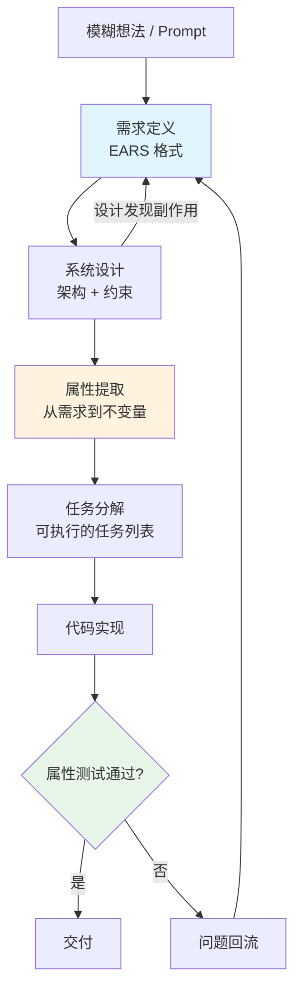

# 用规格驱动开发替代 Vibe Coding：AI 编程的结构化之路

# 一句话导读

Vibe Coding 的瓶颈不在模型能力，而在操作者能否为 AI 提供足够清晰的结构约束——规格驱动开发（Spec-Driven Development）是一套从需求到交付的全流程方法，让 AI 编程的结果可复现、可验证、可回溯。

# 适合谁看

- 已经用过 Cursor/Copilot 等 AI 编程工具，但发现结果不稳定、难以复现的开发者
- 带团队的 Tech Lead，想让团队用 AI 写代码时有统一的质量标准
- 做过 Vibe Coding 但感到"我自己的操作才是瓶颈"的人
- 对需求工程和软件质量保证有兴趣的产品经理或架构师
- 想理解"AI 编程下一步往哪走"的技术决策者

# 读完你会获得什么

- 理解 Vibe Coding 和 Spec-Driven Development 的本质区别
- 掌握 EARS 格式写需求的方法，知道为什么结构化自然语言比自由文本更适合 AI 处理
- 理解需求→属性测试的贯通逻辑，知道如何让需求直接变成可验证的系统不变量
- 学会在规格驱动流程的每个阶段嵌入 MCP 工具，提升 AI 的外部知识获取能力
- 识别自己给 AI 的 prompt 中隐含的偏见，并掌握纠正方法
- 有一套可立即执行的行动清单，改善当前 AI 辅助开发流程

---

## 01 背景：为什么这个问题现在值得讨论

AI 编程工具已经普及。Cursor、Copilot、Windsurf、Kiro——选择越来越多，模型越来越强。但一个共同的问题浮出水面：**AI 能写出代码，但写出的代码不一定是你要的。**

这个问题的根源不在模型。模型的能力在快速提升，但操作者给 AI 的输入——也就是 prompt——质量参差不齐。大多数人的工作方式是这样的：脑子里有个模糊想法，敲一段自然语言描述，让 AI 去猜你要什么。猜对了就万事大吉，猜错了就再改 prompt 再来一轮。

这就是所谓 Vibe Coding：**操作者靠直觉和经验给 AI 设护栏，AI 靠概率和上下文去揣摩意图。** 当问题简单时这够用。当代码量超过几百行、需求涉及多个模块、或者需要团队协作时，Vibe Coding 的结果不可复现、不可验证、不可传递。

过去软件工程已经解决了类似问题。瀑布模型、XP、敏捷——这些方法论的核心都不是"写代码"，而是"定义清楚要写什么代码"。现在 AI 加入了开发流程，这个问题不是消失了，而是更尖锐了：**当你有一个每秒生成 1000 行代码的助手，"写什么"的重要性远超"怎么写"。**

Kiro 团队（AWS 下的一个小团队）提出了一个思路：把 AI 编程放入完整的软件开发生命周期（SDLC），用结构化的规格驱动 AI 从需求到设计到实现的全流程。这个思路的核心不是某个工具的功能，而是一个判断——**AI 编程的可靠性，取决于你给它的结构化约束有多强。**

---

## 02 核心判断：视频真正想讲的不是 Kiro 这个工具

表面上看，这是一个 Kiro 的产品演示会。但真正值得关注的是它背后的判断：

**AI 编程的下一个台阶不是更强的模型，而是更结构化的工作流。**

这个判断有两层含义：

第一，模型能力提升带来的边际收益在递减。当你从 GPT-3.5 升级到 GPT-4 再到 Claude Opus，代码质量的提升是显著的。但从当前一代模型再往上走，"写对代码"的瓶颈已经从模型能力转移到了需求清晰度。模型能写任何代码，但它不知道你到底要什么。

第二，结构化工作流的价值不仅在于约束 AI，更在于让人的思考前置。当你被迫用 EARS 格式写"当用户点击提交按钮时，系统应当验证所有必填字段"，你实际上是在做需求工程。这个思考过程本身——而不是 AI 的生成能力——才是产出高质量代码的关键。

所以：**Spec-Driven Development 的本质不是让 AI 更聪明，而是让人类更清晰地思考。AI 只是那个严格执行你思考结果的执行者。**

---

## 03 概念澄清：先把关键名词讲准确

### Vibe Coding

- **它是什么**：一种依赖操作者直觉和经验的 AI 编程方式，操作者通过不断调整 prompt 来引导 AI 生成代码
- **它解决什么问题**：快速原型、探索性编程、简单任务的快速完成
- **它不是什么**：它不是一种工程方法论，缺乏可复现性和可传递性
- **和相关概念的区别**：Vibe Coding 强调操作者即兴引导；Spec-Driven Development 强调前置结构化定义
- **简单例子**：你告诉 AI "给我写个登录页面"，AI 写了一个，你不满意，改 prompt 说"加个记住我按钮"，AI 改了，你再说"验证规则不对"……这就是 Vibe Coding

### Spec-Driven Development（规格驱动开发）

- **它是什么**：一种将需求定义、系统设计、任务分解和代码实现串联为结构化工作流的 AI 编程方法
- **它解决什么问题**：AI 编程结果不可复现、需求模糊导致返工、代码与需求不一致
- **它不是什么**：它不是瀑布模型的复辟——规格可以被修改和迭代，但修改是有结构的
- **和相关概念的区别**：与传统敏捷比，它更强调前置规格；与 Vibe Coding 比，它用结构代替直觉；与 TDD 比，它从需求层而非测试层出发
- **简单例子**：你先定义"用户点击提交时系统应验证必填字段"（EARS 格式需求），再设计验证模块的架构，再分解为具体任务，AI 按任务执行——而不是一上来就写代码

### EARS 格式（Easy Approach to Requirements Syntax）

- **它是什么**：一种结构化自然语言的需求编写格式，用"当……时，系统应当……"的固定句式描述系统行为
- **它解决什么问题**：自然语言需求存在歧义，纯形式化语言太难写，EARS 在两者之间找到平衡点
- **它不是什么**：它不是编程语言，不是形式化验证语言，它是自然语言的约束子集
- **和相关概念的区别**：与 Gherkin（Given-When-Then）比，EARS 更轻量，专注于需求描述而非测试场景；与 User Story 比，EARS 更精确，减少歧义空间
- **简单例子**：`当会话包含已有检查点时，系统应当从最后一个检查点恢复状态`——这比"系统要支持会话恢复"精确得多

### Property-Based Testing（基于属性的测试）

- **它是什么**：一种测试方法，不写具体测试用例，而是描述系统应满足的不变量（属性），然后用大量随机输入来尝试 falsify 这个不变量
- **它解决什么问题**：示例测试只能覆盖你想得到的场景，基于属性的测试能发现你没想到的边界情况
- **它不是什么**：它不是单元测试的替代品，它是补充——单元测试验证已知场景，属性测试发现未知缺陷
- **和相关概念的区别**：与单元测试比，属性测试不依赖具体输入输出对；与模糊测试比，属性测试有明确的正确性谓词
- **简单例子**：对于排序函数，属性测试不写 `assert sort([3,1,2]) == [1,2,3]`，而是写"对于任意输入列表，输出列表的长度等于输入列表长度，且每个元素不大于其后继元素"

### MCP（Model Context Protocol）

- **它是什么**：一种让 AI 工具连接外部数据源和服务的协议，AI 可以通过 MCP 服务器访问 API、数据库、文档等
- **它解决什么问题**：AI 的训练数据有截止日期，MCP 让 AI 在工作时获取实时外部信息
- **它不是什么**：它不是插件系统，不是 API 网关，它是一种专门为 LLM 交互设计的工具调用协议
- **和相关概念的区别**：与 RAG 比，MCP 是主动查询（AI 决定何时查什么），RAG 是被动检索（系统预先检索并注入上下文）；与 Function Calling 比，MCP 是标准化的工具描述和调用协议
- **简单例子**：给 AI 配一个 GitHub MCP 服务器，AI 就能在编码时自己查看仓库中的 PR 和 Issue

### Steering（Kiro 中的引导文档）

- **它是什么**：类似 Cursor Rules 或 Memory 的项目级指令，告诉 AI 你的编码偏好、部署流程、提交规范等
- **它解决什么问题**：避免每次对话都重复说明相同的偏好和约束
- **它不是什么**：它不是 prompt，不是一次性指令，它是持久化的项目知识
- **简单例子**：你的 Steering 文档里写"所有 commit 的 co-author 必须设为 agent"，AI 就会在每次提交时自动添加

---

## 04 整体框架：Spec-Driven Development 的完整流程

Spec-Driven Development 不是一个线性瀑布，而是一个双钻结构：**先发散再收敛，再发散再收敛**。第一颗钻石是从模糊想法到清晰需求，第二颗钻石是从需求到设计到实现。关键是——实现中发现的问题要回流到需求层。

**文字解释**：

1. **需求定义**是整个流程的锚点。用 EARS 格式写需求，不是因为格式本身有多好，而是因为结构化自然语言可以被确定性解析——不只是 LLM 能理解，自动化推理工具也能处理。这意味着未来可以用更少的 LLM、更多的确定性验证来检查需求质量。

2. **系统设计**不只是画架构图。设计文档中要包含约束、关注点、测试策略。设计阶段最容易发现需求的遗漏——当你试图设计一个 S3 检查点存储时，才发现需求里没说并发写入怎么处理。

3. **属性提取**是 EARS 格式的杀手级应用。因为需求是用结构化自然语言写的，可以自动从中提取系统不变量，转化为属性测试。需求"当会话包含已有检查点时，系统应当恢复状态"→ 属性"对于任意会话，若存在检查点，恢复后的状态必须等于检查点时的状态"。

4. **任务分解**把设计和需求变成可执行的小块。每个任务关联明确的验收标准和测试用例，AI 执行时有清晰的完成定义。

5. **回流机制**是区别于瀑布模型的关键。实现中发现的问题不是"打补丁"，而是回到需求层重新审视——这和敏捷的"发现→调整"精神一致，但调整是有结构的，不是随意的。

---

## 05 关键机制：从需求到属性测试的贯通

这是整个 Spec-Driven Development 中最值得关注的技术机制，也是 Kiro 在 GA 版本中新推出的核心能力。

### 输入：EARS 格式的结构化需求

EARS 需求的典型格式是：

> When [条件], the system shall [行为]

例如：

> When a conversation contains existing checkpoints, the system shall restore state from the most recent checkpoint

关键特性：**句式固定、语义明确、可机器解析。** 这不是自然语言的随意表达，而是自然语言的约束子集。

### 中间处理：从需求提取不变量

系统分析 EARS 需求，提取出系统应满足的"正确性属性"（correctness properties）。这些属性是需求的形式化映射——不是用数学公式，而是用可执行的谓词表达。

例如上面的需求可以映射为属性：
- 对于任意会话 S，若 S 包含检查点 C，则恢复后的状态 state(S) == state(C)
- 对于任意会话 S，若 S 不包含检查点，则恢复后的状态为初始状态

### 输出：基于属性的测试用例

这些属性直接转化为 property-based testing 的输入。测试框架（如 Python 的 Hypothesis、JS 的 fast-check）会用大量随机输入来尝试 falsify 这些不变量。如果任何输入能证明属性不成立，说明需求未被满足。

### 为什么要这样设计

传统流程中，需求和测试是断裂的。产品经理写需求，开发写代码，QA 写测试。需求变了，测试可能没跟着变。属性测试通过"需求→属性→测试"的自动贯通，消除了这个断裂。**需求是唯一的事实来源，测试是需求的自动投影。**

### 带来了什么代价

- EARS 格式写需求有学习成本，不如自由文本随意
- 属性测试写得好不好，直接影响验证质量——写一个不完整的不变量，测试会给你虚假的信心
- 对于探索性、原型性的工作，这个流程可能过重

### 适合/不适合什么场景

- **适合**：生产级代码、需要可靠交付的功能开发、多团队协作的项目、涉及安全或合规的场景
- **不适合**：一次性脚本、快速原型验证、需求本身还不明确的探索阶段

---

## 06 方法拆解：如何落地 Spec-Driven Development

### 第一步：写出结构化需求

**目标**：把模糊想法变成 EARS 格式的需求文档。

**具体动作**：
1. 列出所有你期望系统做的事
2. 对每一条，用"当……时，系统应当……"的句式重写
3. 对非功能需求（性能、安全、可用性），用"系统应当始终……"的句式写
4. 检查需求之间是否有冲突——Kiro 内置了需求冲突检测，也可以人工审查

**判断标准**：一个没参与讨论的人读你的需求，能无歧义地理解系统应该做什么。

**常见坑**：把实现细节写进需求。需求是"系统应当持久化会话状态"，不是"系统应当用 S3 存储会话状态"——后者是设计决策，不是需求。

**产出物**：一份 EARS 格式的需求文档。

### 第二步：用设计验证需求

**目标**：通过设计过程发现需求的遗漏和错误。

**具体动作**：
1. 基于需求画出系统架构
2. 为每个需求标注对应的模块和接口
3. 写出伪代码或关键流程
4. 检查：有没有需求在设计时发现无法实现？有没有设计暴露出需求遗漏？

**判断标准**：设计文档能完整覆盖所有需求，且没有需求在设计中被"忘记"。

**常见坑**：设计文档只写架构不写约束。好的设计文档要包含：模块职责、模块间交互、约束条件（如并发、延迟、容量）、测试策略。

**产出物**：一份包含架构、约束和测试策略的设计文档。

### 第三步：让 AI 用 MCP 获取外部知识

**目标**：在需求和设计阶段，让 AI 访问外部文档和 API，避免闭门造车。

**具体动作**：
1. 在项目中配置需要的 MCP 服务器（文档 API、搜索工具、项目管理工具等）
2. 在需求阶段，明确要求 AI 查阅相关技术文档后再写需求
3. 在设计阶段，要求 AI 对比多种技术方案后再推荐
4. 注意：修改 MCP 配置会导致缓存失效，在长会话中尽量避免频繁修改

**判断标准**：AI 的需求和建议中包含了来自外部文档的具体信息，而不仅仅是训练数据中的泛化知识。

**常见坑**：只在实现阶段用 MCP，需求和设计阶段让 AI 凭"记忆"工作——这正是错误最多的地方。

**产出物**：经过外部知识验证的需求和设计文档。

### 第四步：识别并纠正 prompt 中的偏见

**目标**：避免你的初始 prompt 隐式锁定了不合理的实现选择。

**具体动作**：
1. 写完 prompt 后，检查是否包含特定技术选型（如"用 S3 存储""用 Redis 缓存"）
2. 如果包含，明确问 AI："这是实现这个需求的最佳方式吗？有哪些替代方案？"
3. 让 AI 通过 MCP 查阅最新文档，给出基于当前信息的推荐
4. 基于推荐重新审视需求，去掉不必要的实现约束

**判断标准**：需求文档中只包含"做什么"，不包含"怎么做"。

**常见坑**：你以为自己在写需求，实际上在写实现方案。讲者自己在演示中也犯了这个问题——他告诉 AI "dump conversations to S3"，实际上 Agent Core 有原生的内存功能，比 S3 方案更合适。

**产出物**：去偏见的需求文档。

### 第五步：自定义产出物，适配你的流程

**目标**：让 Spec-Driven Development 的产出物适合你的团队和工作方式。

**具体动作**：
1. 如果你需要 UI 设计，要求在设计文档中加入线框图（ASCII 或 Mermaid）
2. 如果你关注代码质量，要求在任务列表中加入显式测试用例
3. 如果你关注非功能需求，要求在设计阶段加入性能和约束分析
4. 如果你想控制代码风格，在 Steering 文档中写明偏好（如测试覆盖率下限、commit 规范）

**判断标准**：AI 的产出物能直接用于你的团队评审，而不需要你手动补充大量内容。

**常见坑**：接受 AI 的默认产出格式。默认格式是起点，不是终点——你可以要求任何你觉得重要的内容。

**产出物**：适配团队流程的规格文档模板。

### 第六步：执行、验证、回流

**目标**：按任务列表执行，用属性测试验证，问题回流到需求层。

**具体动作**：
1. 按任务顺序执行（Kiro 当前建议逐个执行，避免并行导致的上下文丢失）
2. 每个任务完成后检查关联的测试用例是否通过
3. 全部任务完成后，运行属性测试验证整体正确性
4. 如果属性测试失败，分析根因：是代码 bug、需求遗漏、还是属性定义不完整？
5. 根据根因回到对应层级修复，而不是在代码层打补丁

**判断标准**：所有属性测试通过，且代码变更可追溯到需求条目。

**常见坑**：AI 说"我完成了"就相信它。AI 非常擅长声称任务完成，但测试可能没通过、边界情况可能没处理。永远看测试结果，不看 AI 的自我评估。

**产出物**：通过属性测试的代码 + 可追溯的需求-代码映射。

---

## 07 案例讲解：给一个笑话生成器加记忆功能

### 场景背景

讲者正在做一个项目叫 "graamps"——一个部署在 AWS Agent Core 上的冷笑话生成器。每次用户问它要笑话，它都返回同一个笑话。这很无聊。讲者想给它加上会话记忆，让它在同一会话中不会重复讲笑话。

### 遇到的问题

- 讲者知道需要"会话持久化"，但不确定 Agent Core 平台有什么原生支持
- 习惯性地想用 S3 存储对话记录（因为自己熟悉 S3）
- 直接告诉 AI "dump conversations to S3 file"，在 prompt 中隐式锁定了技术选型

### 按框架如何处理

**第一步：写需求时去偏见**

需求应该是"系统应当支持跨请求的会话状态持久化"，而不是"系统应当用 S3 存储会话"。后者把实现选择混入了需求。

**第二步：让 AI 用 MCP 查阅最新文档**

讲者配置了 AWS 文档 MCP 服务器。在 AI 生成需求后，讲者挑战它："这是实现会话持久化的最合适方式吗？" AI 通过 MCP 查阅了 Agent Core 文档，发现 Agent Core 有原生的 Memory 功能，比 S3 方案更符合平台惯例。

**第三步：基于新信息修正需求**

AI 给出了两个方案：
- Agent Core Memory（更符合平台惯例，面向未来）
- S3 检查点（讲者最初建议的方案，更通用但不是最佳实践）

讲者选择了 Agent Core Memory 方案，修正了需求。

**第四步：完成规格→设计→任务→实现的完整流程**

AI 生成了 EARS 格式需求、系统设计、任务列表，逐一执行并完成实现。

### 最终结果

笑话生成器现在能在同一会话中记住之前讲过的笑话，不再重复。代码包含了 S3 检查点存储模块、与 LangGraph 的集成、以及属性测试。

### 说明了什么

这个案例的关键不是最终代码，而是流程中暴露的一个普遍问题：**你以为自己在描述需求，实际上你在指定实现。** 讲者作为 Kiro 的核心开发者，自己在演示中也犯了这个错误。这说明去偏见不是一个"注意一下"就能解决的问题，而是需要刻意的流程约束——让 AI 主动挑战你的假设，让 MCP 提供你没有的外部知识。

---

## 08 常见误区

### 误区 1："AI 编程工具都差不多，选哪个无所谓"

**为什么错**：不同工具的设计哲学差异巨大。Cursor 偏向自由对话和快速迭代，Kiro 偏向结构化规格驱动。选择工具不只是选择模型，更是选择工作流。用 Vibe Coding 的工具做 Spec-Driven Development，和用 Spec-Driven Development 的工具做 Vibe Coding，都会别扭。

**正确理解**：工具的选择应该匹配你的工作性质。探索性工作选灵活的工具，生产级交付选结构化的工具。

**应该怎么做**：先想清楚你要解决什么性质的问题，再选工具。

### 误区 2："Spec-Driven Development 就是瀑布模型的翻版"

**为什么错**：瀑布模型的需求是冻结的，设计是单向的，实现是不可逆的。Spec-Driven Development 的规格是活的——可以修改、可以回流、可以迭代。关键是修改是有结构的，不是随意的。

**正确理解**：Spec-Driven Development 是敏捷的结构化版本——保留了迭代和反馈，但加了结构约束。

**应该怎么做**：不要把规格文档当作一次性的。后续迭代时，修改现有规格而不是创建新规格。Kiro 支持对已有规格的增量修改。

### 误区 3："需求文档写得越详细越好"

**为什么错**：详细不等于清晰。一份 50 页的自然语言需求文档，歧义可能比 5 页的 EARS 格式需求更多。结构化比详细更重要。

**正确理解**：需求的价值在于无歧义，不在于信息量。EARS 格式通过约束表达方式来减少歧义空间。

**应该怎么做**：用固定句式写需求，检查每一条是否只有一种理解方式。

### 误区 4："MCP 只在写代码时有用"

**为什么错**：MCP 在需求和设计阶段的价值可能更大。写代码时 AI 可以看现有代码上下文，但写需求时 AI 如果只能凭训练数据工作，产出的质量会大打折扣。

**正确理解**：MCP 的最佳使用时机是 AI 需要你不知道的信息时——在需求阶段查阅技术文档，在设计阶段对比方案。

**应该怎么做**：在 Spec 流程的每个阶段都评估是否需要 MCP 支持，而不是只在实现阶段配置。

### 误区 5："AI 说了完成了就是完成了"

**为什么错**：LLM 有强烈的"宣称完成"倾向。它会说"我已完成所有任务"，但测试可能没跑、边界情况可能没处理、代码可能有编译错误。这不是模型在撒谎，而是它的训练目标倾向于让对话结束。

**正确理解**：AI 的"完成"声明没有任何意义。只有自动化验证（测试、属性检查、编译）的结果才可信。

**应该怎么做**：在任务定义中包含显式测试用例，用 agent hooks 或 CI 强制运行测试，不接受 AI 的口头完成声明。

### 误区 6："属性测试能保证系统正确"

**为什么错**：属性测试只验证你写了属性的那些方面。如果需求本身有遗漏，属性测试不会帮你发现——它只能验证属性，不能发现缺失的属性。

**正确理解**：属性测试提供的是"对已定义属性的高置信度验证"，不是"系统整体正确性保证"。

**应该怎么做**：把属性测试和需求审查结合起来。属性测试验证已知的正确性条件，需求审查发现未知的遗漏。

### 误区 7："Spec-Driven Development 太重了，不适合快速迭代"

**为什么错**：这个判断混淆了"流程结构"和"流程重量"。EARS 格式写需求可能只比自由 prompt 多花 5 分钟，但它省下的返工时间可能是几小时。结构化不等于慢，无结构也不等于快——返工才是真正的慢。

**正确理解**：Spec-Driven Development 的投资是前置的，回报是后置的。对简单任务可能不值得，对复杂任务几乎总是值得。

**应该怎么做**：按任务复杂度选择流程深度。一行代码的修改不需要走完整规格流程，但新功能开发应该。

### 误区 8："Brownfield 项目不适合 Spec-Driven Development"

**为什么错**：Brownfield 项目（已有代码库）确实比 Greenfield 项目（从零开始）更有挑战，但挑战不是来自方法本身，而是来自代码库的可理解性。如果代码库模块分离清晰、测试覆盖良好，AI 在 Brownfield 场景下的表现可以很好。

**正确理解**：Spec-Driven Development 在 Brownfield 场景下的效果，取决于代码库本身的可理解性。这和人类开发者面临的情况一样。

**应该怎么做**：在 Brownfield 项目中，先让 AI 理解现有系统结构（通过代码搜索、上下文索引），再开始规格流程。

---

## 09 实战清单：读完后可以马上照着做

### 立即能做

1. **审查你最近一次给 AI 的 prompt**：找出其中隐含的技术选型偏见（"用 X 实现"→ 改为"实现 Y 功能，用什么方式请研究后推荐"）
2. **用 EARS 格式重写一条需求**：挑一个你正在做的功能，用"当……时，系统应当……"的句式写出来，检查是否比原来的描述更无歧义
3. **给你的 AI 工具配置一个 MCP 服务器**：即使是简单的 fetch 工具，也能让 AI 在需求阶段获取实时信息，而不是依赖过时的训练数据
4. **写一条 Steering 规则**：把你每次都要重复告诉 AI 的偏好（代码风格、测试要求、commit 规范）写进 Steering/Cursor Rules，从此不用再重复

### 一周内能做

5. **对一个正在开发的功能走一遍完整规格流程**：从需求→设计→任务→实现，不要跳步。体会每一步发现的问题是否比直接写代码更多
6. **在设计文档中加入属性定义**：对 2-3 条核心需求，写出对应的系统不变量。即使不跑属性测试，这个思考过程本身就有价值
7. **要求 AI 在给出方案前先做研究**：在你的下一个 AI 编程会话中，明确要求 AI 使用外部文档或搜索工具查阅信息后再推荐方案，而不是直接给出第一个想到的方案
8. **设置完成验证**：在任务描述中加入显式测试用例或验证标准，不接受 AI 的"我完成了"声明

### 长期要沉淀

9. **建立项目的规格模板**：根据你的团队和工作方式，定制需求文档、设计文档和任务列表的模板——默认格式是起点，不是终点
10. **建立需求→测试的贯通机制**：让需求变更自动触发测试更新，而不是靠人工同步。这是属性测试的长期价值
11. **定期做规格审查**：把规格文档当作活文档，定期审查需求是否有冲突、是否有遗漏、是否有过时条目
12. **记录你的去偏见决策**：每次发现 prompt 中隐含了不合理的技术选型，记录下来。这个模式库能帮你未来更快地识别偏见

---

## 10 总结

AI 编程工具已经走过了"能不能写代码"的阶段，现在的问题变成了"能不能写对的代码"。这个转变意味着，瓶颈从模型能力转移到了操作者的需求定义能力。

Spec-Driven Development 的核心思路是：用结构化的工作流代替直觉驱动的 prompt 迭代。EARS 格式让需求无歧义，属性测试让需求可验证，MCP 让 AI 在每个阶段都能获取外部知识，Steering 让项目级约束持久化。这些机制单独看都不新鲜，但组合在一起构成了一个完整回路：**从清晰的需求出发，经过有约束的设计，到可验证的实现，再回流到需求层。**

Vibe Coding 和 Spec-Driven Development 不是对立关系。Vibe Coding 适合探索，Spec-Driven Development 适合交付。真正的问题不是选哪个，而是知道什么时候该从前者切换到后者。当你的项目从"试一试"变成"要上线"的那一刻，就是切换的时机。

**AI 编程的成熟标志，不是 AI 能写多复杂的代码，而是人类能在多大程度上把"我想要什么"清晰地表达出来，并让这个表达贯穿到最终交付。**
