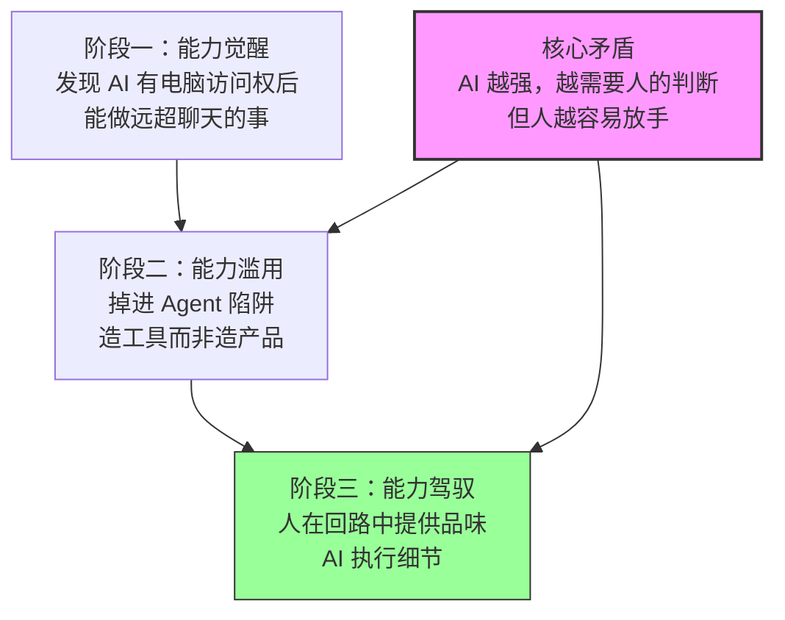

# 当 AI 能直接操控你的电脑：从聊天机器人到个人操作系统的跨越

**一句话导读：** 给 AI 一台电脑的访问权，它就从"回答问题的工具"变成了"替你做事的代理人"——但大多数人会用错这个能力。

---

**适合谁看：**

- 已经用过 ChatGPT/Claude 网页版，但觉得"也就那样"的人
- 正在考虑给 AI Agent 加工具、加编排、加多轮对话的开发者
- 想用 AI 提升个人效率，但只会用现成 App 的非技术用户
- 对 AI Agent 方向感兴趣，想判断产品形态走向的创业者
- 已经在 vibe coding 但开始怀疑"这样做对吗"的人

---

**读完你会获得什么：**

- 理解"AI 有电脑访问权"和"AI 在网页里聊天"之间的本质差距
- 识别"Agent 陷阱"——什么时候你在造工具而不是在造产品
- 掌握人与 AI 协作的正确节奏：什么时候该放手，什么时候必须介入
- 判断哪些 App 会被 AI Agent 替代，哪些不会
- 获得一套可落地的 AI Agent 使用策略，而不是概念堆砌
- 明白为什么"让 AI 跑 24 小时无人干预"是个虚荣指标

---

## 01 背景：为什么这个问题现在值得讨论

2024 年底到 2025 年初，AI 编程工具爆发。Claude Code、Codex、Cursor、Windsurf——每个都在说"AI 帮你写代码"。但它们有一个共同限制：**你得坐在电脑前，盯着终端窗口，和 AI 对话。**

这意味着什么？AI 变成了一个需要你时刻看管的实习生。它跑了两分钟，遇到一个问题，停下来等你回答。你去吃个饭回来，它还在等你。你的生产力没有提升，你只是换了一种方式被拴在电脑前。

Peter（Cloudbot 创始人）的出发点很简单：**他想从手机上控制电脑上的 AI。** 他在旅行时发现，自己需要时不时查看 AI 的进展、回答它的问题，但身边只有手机。于是他把 WhatsApp 接到了 Claude Code 上——发消息给 AI，AI 在远程电脑上执行，结果发回来。

这个看似简单的改动，打开了一个更大的可能性：**如果你给 AI 完整的电脑访问权，它就不再只是一个聊天机器人，而是一个能替你做任何事的操作代理。**

而这件事，大多数人还没意识到。

---

## 02 核心判断：视频真正想讲的不是"AI Agent 很强"

表面上看，这个视频在展示一个 AI 工具的各种酷炫用法——修 bug、叫外卖、查航班、控制智能家居。

但 Peter 真正在讲的是两个判断：

**判断一：给 AI 电脑访问权，改变的不仅是能力，而是交互范式。** 你不再"使用"一个 App，而是"告诉"一个代理人去完成目标。中间的过程——打开哪个网站、填哪个表单、调哪个 API——AI 自己搞定。

**判断二：大多数人拿到这种能力后，会掉进"Agent 陷阱"——花大量时间给 AI 造工具、造编排系统、造多层级代理架构，但忘了自己到底要造什么产品。** 更长的无人干预运行时间、更复杂的 Agent 编排，并不等于更好的产出。**没有品味（taste）的 AI，跑再久也只是生产垃圾。**

这两个判断合在一起，构成了全文主线：**AI 的能力已经足够强，真正的瓶颈不在 AI 本身，而在人怎么用它。**

---

## 03 概念澄清：先把关键名词讲准确

### 电脑访问权（Computer Access）

- **它是什么**：AI 可以直接操作你电脑上的文件系统、终端、浏览器、API——任何你能用手做的事情，它都能做。
- **它解决什么问题**：打破了 AI 只能在"聊天框里回答问题"的局限，让它能真正执行操作。
- **它不是什么**：不是远程桌面，不是 RPA 脚本，不是预设流程自动化。AI 是自主决策的，它看到问题后会自己找方法解决。
- **和相关概念的区别**：MCP/工具调用是"给 AI 一个锤子"，电脑访问权是"给 AI 整个工具箱和整个工坊"。
- **例子**：Peter 收到一条 Twitter 截图报告 bug，他把截图发给 AI（通过 WhatsApp），AI 自己读图、理解 bug、克隆代码仓库、修复代码、提交 commit、回复 Twitter。全程无人干预。

### Agent 陷阱（The Agent Trap）

- **它是什么**：一种常见的行为模式——发现 AI Agent 很强之后，不断给它加工具、加编排、加多层级架构，但越来越偏离"造产品"的目标。
- **它解决什么问题**：它本身不解决问题，它是一个需要被识别和规避的模式。
- **它不是什么**：不是"不该给 AI 加工具"，而是"加工具本身不应该成为目的"。
- **和相关概念的区别**：YAGNI（You Aren't Gonna Need It）是工程原则，Agent 陷阱是行为模式——你不是不知道不需要，而是加工具太好玩了停不下来。
- **例子**：Peter 自己承认，他曾经花两个月优化 Vibe Tunnel（手机访问终端的工具），把它做到极致完美，但那两个月他没有参与任何真正的产品对话。

### 品味（Taste）

- **它是什么**：对"什么是好的"的判断力。在 AI 语境下，指人能判断 AI 的产出是否值得保留，以及该往什么方向迭代。
- **它解决什么问题**：AI 缺乏审美和判断。它很聪明，但它不知道什么算"好"。没有品味引导的 AI 产出，再多也只是堆量。
- **它不是什么**：不是技术能力，不是提示词技巧，不是知识量。
- **和相关概念的区别**：品味 vs 经验——经验让你知道怎么做，品味让你知道值不值得做。
- **例子**：有人展示一个完全由 AI 生成的 App 界面，Peter 说"一看就是 AI 做的，没有正常人类会这样设计"——AI 把所有功能都做了，但没有做出"对"的设计。

### 技能（Skill）

- **它是什么**：AI 从一次交互中学到的可复用操作模式。第一次你需要详细教它，之后只需要提一句，它就会自动执行。
- **它解决什么问题**：避免每次都从头教 AI 做同一件事。
- **它不是什么**：不是传统的插件/扩展，不是预设脚本，不是 MCP 工具。技能是 AI 自己生成和记忆的操作流程。
- **和相关概念的区别**：技能 vs 工具——工具是你给 AI 的一把锤子，技能是 AI 自己学会的木工手艺。
- **例子**：第一次让 AI 帮你在英国航空网站 check-in，它花了 20 分钟——找护照、填表单、处理各种验证。但它记住了流程，下次只需两分钟。

---

## 04 整体框架：这套内容应该如何理解

视频内容可以重构为三个阶段、一个核心矛盾：

**阶段一：能力觉醒**——当你第一次给 AI 完整的电脑访问权，你会发现它能做你没想到的事。Peter 的 AI 甚至在他没有构建语音支持的情况下，自己找到了 FFmpeg、转换音频格式、调用 OpenAI Whisper API，把语音消息转录成文字再回复。

**阶段二：能力滥用**——觉醒之后，最自然的反应是"让它更强"——加更多工具、加更多编排、让它跑更久。但这恰恰是陷阱。Peter 明确批评了当前的"Agent 编排热"：多层级监督者、市长-议会架构、循环清理上下文重新开始——他管这叫"终极 token 燃烧机"。

**阶段三：能力驾驭**——正确的做法是保持人在回路中。你提供方向和品味，AI 提供执行力和速度。你不需要 AI 跑 24 小时无人干预，你需要的是：你提出一个想法，AI 帮你快速实现，你看了结果后决定下一步。

**核心矛盾**：AI 越强，人越倾向于放手；但 AI 越强，越需要人的判断来导航。这个矛盾不会随模型进步而消失——模型越强，它"能做"的事越多，但"该做"什么仍然需要人决定。

---

## 05 关键机制：AI 操控电脑到底是怎么运行的

### 机制一：消息入口 → 终端执行 → 结果返回

- **输入**：用户通过即时通讯工具（WhatsApp/Telegram/Discord）发送文字、图片或语音消息
- **中间处理**：AI 读取消息内容，在自己的电脑环境中决定需要执行什么操作——可能是写代码、运行命令、访问网页、调用 API
- **输出**：AI 把执行结果发回即时通讯工具
- **为什么这样设计**：把入口放在即时通讯工具上，意味着你不需要坐在电脑前。你可以在走路时发语音、在旅行时发截图、在任何地方给 AI 下指令
- **代价**：AI 拥有你电脑的完整权限。如果你不断点"确认"，它可能真的会删掉你的文件。安全性是未解决的问题
- **适合场景**：重复性操作、需要多步骤执行的任务、你在移动中需要远程操控电脑的场景
- **不适合场景**：需要实时交互和视觉反馈的任务（如 UI 微调）、对安全性要求极高的操作

### 机制二：技能学习与复用

- **输入**：第一次你详细描述一个任务（如"帮我在英国航空网站 check-in"）
- **中间处理**：AI 执行任务，同时记录操作流程、发现的坑、成功的路径，存储为"技能"
- **输出**：下次你只需要说"check-in"，AI 自动调用已学到的技能
- **为什么这样设计**：避免每次交互都从零开始，让 AI 的能力随使用积累而增长
- **代价**：技能可能过时（网站改版、API 变更），需要偶尔"重新学习"
- **适合场景**：你会重复执行的操作
- **不适合场景**：一次性任务

### 机制三：AI 的自主推理与工具发现

- **输入**：AI 遇到一个它没有直接工具的问题（如收到一个没有文件扩展名的音频文件）
- **中间处理**：AI 检查文件头部判断格式 → 在电脑上搜索可用的转换工具（找到 FFmpeg）→ 转换格式 → 在电脑上搜索可用的转录服务（找到 OpenAI API key）→ 调用 API → 获得转录文本
- **输出**：AI 回复了语音消息的内容
- **为什么这样设计**：不预设 AI 需要什么工具，让它自己从环境中找解决方案。这比预先配置所有可能的工具链更灵活
- **代价**：行为不可预测。AI 可能找到你没想到的方式来解决问题，也可能用你不希望的方式（如调用付费 API）
- **适合场景**：开放式问题、你无法预知所有可能需求的场景
- **不适合场景**：对行为有严格约束的生产环境

---

## 06 方法拆解：如果你要用 AI Agent，应该怎么做

### 第一步：选一个即时通讯工具作为入口

**目标**：让 AI 可达，但不占用你的电脑桌面。

**具体动作**：安装 Cloudbot 或类似工具，连接到你的 WhatsApp/Telegram/Discord。先只连一个，不要贪多。

**判断标准**：你能从手机上给 AI 发一条消息并收到回复。

**常见坑**：跳过即时通讯入口直接用终端——你会回到"坐在电脑前"的模式。

**产出物**：一个可用的 AI 通讯入口。

### 第二步：给 AI 有限的电脑访问权，逐步放开

**目标**：在安全边界内探索 AI 的能力。

**具体动作**：先给 AI 访问一个项目目录的权限，确认它不会越界操作。逐步添加：文件系统访问、终端执行权、浏览器控制、API 调用。每次放开权限前，想清楚最坏情况是什么。

**判断标准**：AI 能在授权范围内完成任务，且没有误操作。

**常见坑**：一开始就给全部权限——这是把整台电脑的钥匙交给一个你还不太了解的代理。

**产出物**：一份明确的权限清单和对应的安全边界。

### 第三步：从一个真实痛点开始，不要从"加工具"开始

**目标**：用 AI 解决你生活或工作中的一个问题，而不是先搭建完美的 Agent 框架。

**具体动作**：找一件你每天/每周都要做的重复操作——可能是查日历、跟踪快递、管理待办、回复常见邮件。让 AI 帮你做这件事。第一次可能要手把手教，但让它记住流程。

**判断标准**：这件事从"你手动做"变成"你发一句话，AI 做完"。

**常见坑**：还没解决任何真实问题，就开始研究"怎么给 AI 加 MCP 工具""怎么搭多 Agent 编排"——你已经掉进 Agent 陷阱了。

**产出物**：一个真正省了你时间的 AI 技能。

### 第四步：保持人在回路，用对话替代规划

**目标**：让 AI 成为你的协作者，而不是自动驾驶。

**具体动作**：不要试图在项目开始前写出完美的需求文档让 AI 独立执行。用对话的方式：告诉 AI 你的粗略想法 → 它实现一个雏形 → 你看了之后决定改什么 → 它迭代 → 你再判断。每个下一步取决于当前结果。

**判断标准**：你对 AI 的每一个产出都有判断——保留、修改还是重来。

**常见坑**：试图让 AI 跑 24 小时无人干预。跑得久不等于做得好。没有品味导航的长时间运行 = 大量低质量产出。

**产出物**：一个你认可的高质量结果（而不是一个 AI 自动生成但你不敢用的东西）。

### 第五步：用多个终端并行，但只做一个项目

**目标**：在 AI 等待时你不会闲着，但你也不会同时在造多个东西。

**具体动作**：开 3-5 个终端窗口，每个连着 AI，每个在处理不同阶段的任务——一个在探索、一个在构建、一个在修 bug。当一个在等待 AI 响应时，切到另一个。

**判断标准**：你始终处于心流状态，没有"干等 AI"的空转时间。

**常见坑**：每个终端做不同的项目——你会失去焦点。应该是同一个项目的不同阶段。

**产出物**：高密度的有效工作时段。

---

## 07 案例讲解：从修 bug 到航线 check-in

**场景背景**：Peter 在摩洛哥旅行，远离电脑。

**遇到的问题 1**：有人发 Twitter 报了一个 bug。

**按框架如何处理**：
1. 有人把 bug 报告截图发到 WhatsApp
2. Peter 把截图转发给 AI（Cloudbot）
3. AI 读取截图内容，理解 bug 描述
4. AI 自己克隆对应的 Git 仓库
5. AI 定位 bug、修复代码、提交 commit
6. AI 回复那条 Twitter："已修复"

**每步的关键**：Peter 从头到尾只做了一件事——转发截图。剩下的全是 AI 自主完成。

**最终结果**：bug 修好了，Peter 人在摩洛哥，没碰电脑。

**遇到的问题 2**：需要在英国航空网站 check-in。

**按框架如何处理**：
1. Peter 发消息让 AI 帮他 check-in
2. AI 打开浏览器，导航到英国航空网站
3. AI 在 Peter 的文件系统中找到护照扫描件
4. AI 提取关键信息，填写表单
5. AI 处理各种验证步骤，完成 check-in

**每步的关键**：这是一个"图灵测试"级别的任务——操纵一个复杂网站完成多步表单。第一次花了 20 分钟（因为要探索流程），第二次只花了两分钟（因为技能已学会）。

**最终结果**：航班 check-in 完成，无需打开电脑。

**说明了什么**：这两个案例展示了"AI 有电脑访问权"和"AI 在聊天框里"的根本差距。聊天框里的 AI 只能告诉你"你可以这样修 bug"，有电脑访问权的 AI 直接帮你修好了。这不是量的提升，是质的转变——从"顾问"变成了"执行者"。

---

## 08 常见误区

**误区一：AI Agent 的目标是无人工干预运行**

- **错误理解**：好的 Agent 应该能跑 24 小时不需要人介入。
- **为什么错**：运行时长是虚荣指标。AI 没有品味，没有判断"这算不算好"的能力。无人干预运行 24 小时产出的东西，很可能全是垃圾。
- **正确理解**：目标是人在回路中的高效协作——人提供方向和判断，AI 提供执行力和速度。
- **应该怎么做**：设定短的交互循环。看产出、给反馈、再迭代，而不是放手让它跑。

**误区二：给 AI 加的工具越多，它就越强**

- **错误理解**：应该尽可能多地给 AI 配置 MCP 工具、API 接入、技能包。
- **为什么错**：加工具本身不等于解决问题。Peter 批评了"市长-议会"式的多层 Agent 编排——看起来很复杂，实际上只是 token 燃烧机。他自己的 Cloudbot 不用 MCP，不用复杂的编排系统。
- **正确理解**：AI 的核心优势是自主推理和工具发现——它能在你的电脑上找到解决问题的方法，不需要你预先配置好一切。
- **应该怎么做**：先解决真实问题，只在确实需要时才加工具。如果 AI 能自己找到解决方案，就不要提前帮它配置。

**误区三：AI 编程工具只对程序员有用**

- **错误理解**：Claude Code、Codex 这类工具只有开发者才用得上。
- **为什么错**：这些工具的核心能力——操控电脑、执行操作、访问 API——对任何需要和电脑交互的人都有用。Peter 的商业伙伴是律师出身，不会写代码，但用 Cloudbot 发 Pull Request。
- **正确理解**：AI 编程工具的本质是"AI 操作电脑"，编程只是其中一种操作。管理邮件、订机票、查日历、控制家居——都是"操作电脑"。
- **应该怎么做**：如果你有任何重复性电脑操作，都可以尝试让 AI 代劳，不需要你是程序员。

**误区四：评估 AI 只需要花一天试试**

- **错误理解**：用一天时间测试 AI 模型，写个简短提示词让它做个 App，不行就否定整个方向。
- **为什么错**：AI 模型有自己独特的"思维方式"和语言习惯。你需要持续使用才能理解它怎么推理、什么时候会犯错、什么提示方式对它有效。一天的时间只够看到表层。
- **正确理解**：学会用 AI 是一项需要练习的技能，和学编程一样。你需要犯错、调整、积累经验。
- **应该怎么做**：给自己至少两周的持续使用时间。从简单任务开始，逐步挑战更复杂的场景。

**误区五：未来的 AI 会替代所有 App**

- **错误理解**：有了 AI Agent，所有 App 都会被淘汰。
- **为什么错**：Peter 的判断更精确——大约 80% 的 App 会"融化"，因为它们本质上只是某个 API 的界面包装。但剩下的 20%——需要深度交互、实时反馈、专业体验的应用——不会被替代。
- **正确理解**：被替代的是"信息查询+表单提交"类的 App。不会被替代的是需要沉浸式体验、精细操作、或者有强网络效应的产品。
- **应该怎么做**：如果你的产品本质上是"帮用户填表"，需要认真思考差异化。如果你的产品价值在于体验和判断，AI 是增强而非威胁。

**误区六：应该一开始就设计完美的提示词和流程**

- **错误理解**：在让 AI 开始工作前，应该写出完整的需求文档、上下文、约束条件。
- **为什么错**：Peter 说得很清楚：他的下一步提示取决于当前代码长什么样。产品愿景是在构建过程中逐渐清晰的，不是一开始就能完全想清楚。如果你试图把所有需求前置，你就跳过了"人机协作中逐渐明确方向"这个最有价值的部分。
- **正确理解**：用对话替代规划。给出粗略方向，让 AI 实现一版，你看了之后决定下一步。
- **应该怎么做**：说"我们来讨论这个功能"，而不是"按照以下 20 条需求实现"。让 AI 提出澄清问题，你回答，它实现，你判断，循环迭代。

**误区七：上下文管理是 AI Agent 的核心挑战**

- **错误理解**：必须精心管理上下文窗口，频繁压缩和摘要。
- **为什么错**：这是旧模型时代的遗留问题。Claude 的上下文窗口实际可用长度远超纸面数字，内部思考机制让它在长对话中保持连贯性。大多数功能开发可以在一个对话窗口内完成。
- **正确理解**：上下文管理的重要性在下降，但不意味着可以忽视。对于非常大的项目，开新对话仍然是合理策略。
- **应该怎么做**：先不管上下文，如果对话变得混乱再开新的。不要过早优化上下文管理。

---

## 09 实战清单：读完后可以马上照着做

**立即能做**

- [ ] 安装一个 AI Agent 工具（Cloudbot、Claude Code 或其他），连接到你的手机即时通讯工具，让它脱离"必须坐在电脑前"的模式
- [ ] 列出你过去一周手动做的重复性电脑操作，选一个最简单的，让 AI 帮你做
- [ ] 下次写提示词时，加上"先问我几个澄清问题再开始"——观察 AI 的理解和你最初描述之间的差距

**一周内能做**

- [ ] 用"对话式开发"完成一个小功能：给 AI 粗略想法 → 看它的实现 → 决定改什么 → 迭代，循环至少 3 轮
- [ ] 审视你当前在用的 Agent 工具/编排系统——删掉那些"为了加而加"的部分
- [ ] 找一件你日常生活中的非编程任务（订餐、查快递、管日历），让 AI 帮你完成，体验"AI 操作电脑"而非"AI 写代码"

**长期要沉淀**

- [ ] 建立你的 AI 技能库——每次教 AI 做新事，确保它记住了，下次能直接调用
- [ ] 培养对 AI 产出的"品味判断"——不只是看它做得对不对，而是看它做得好不好。这个判断力是 AI 无法替代的
- [ ] 定期回顾你的 AI 使用模式：你是在解决真实问题，还是在"加工具玩"？如果后者占比超过 30%，你已经在陷阱里了

---

## 10 总结

AI 聊天机器人和 AI 操作代理之间的差距，不是"更方便了一点"，而是从"问一个聪明的顾问"变成了"雇一个全能的助手"。顾问只能告诉你该怎么做，助手直接帮你做了。当你能在摩洛哥的海滩上，用 WhatsApp 发一张截图就修好一个 bug，你就知道这不是量变，是质变。

但这个能力的危险在于：它太好用了，好用到你会忍不住不断加工具、加编排、加层级，忘了你最初要造什么。Agent 陷阱的核心不是"加工具是错的"，而是"加工具太好玩了，好玩到让你以为自己在做产品"。Peter 用自己的经历证明了这一点——他花两个月优化终端访问工具，完美到可以和朋友炫耀，但那两个月他没有做任何真正重要的产品决策。

品味的不可替代性是这篇文章最重要的判断。AI 会越来越强，跑得越来越久，但"什么是好的"这个问题，它回答不了。你的角色不是让 AI 跑 24 小时，而是在它每一步的产出面前做判断：留、改、还是重来。这个判断力，才是 AI 时代真正稀缺的能力。

**AI 已经足够快了。现在瓶颈不在 AI，在于你愿不愿意在速度面前保持判断。**
