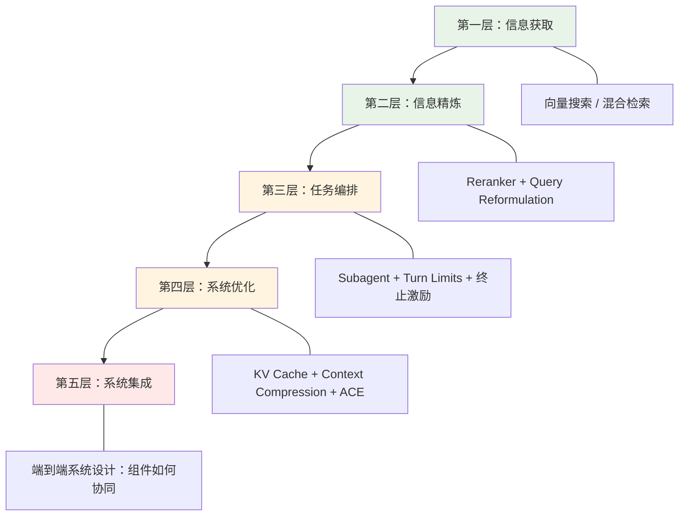

# Context Engineering：从组件拼装到系统设计的转折点

一句话导读：Context engineering 已经从"让 Agent 尽量多用 token"的粗放阶段，进入需要精约束、精调度、精设计的工程化阶段——而大多数团队还停留在组件层面，缺少整体系统思维。

适合谁看：
- 正在做 RAG / Agent 系统的工程师，遇到上下文失控、检索不准、Agent 跑飞等问题
- 负责AI产品落地的产品经理，需要理解为什么 demo 能跑但上线就崩
- 关注 AI 工程化进展的技术管理者，需要判断团队该投入哪个方向
- 刚入门 RAG 的开发者，想避开"先踩坑再醒悟"的老路
- 对 MCP、subagent、reranker 等概念有碎片了解但缺少系统框架的人

读完你会获得什么：
- 能分清 RAG、Agentic RAG、动态 Agent 三代架构的差异和适用边界
- 能理解为什么 reranker 是 context engineering 的关键组件，而非可选优化
- 能识别 context rot 的成因和量化方式，不再凭感觉判断上下文质量
- 能掌握 subagent 约束设计的核心原则：turn limit、终止激励、结果校验
- 能判断 MCP 在原型阶段和生产阶段的不同定位，避免把原型方案当生产方案
- 能建立从组件优化走向系统设计的思维框架

---

## 01 背景：为什么这个问题现在值得讨论

2024 年下半年，context engineering 从一个模糊的概念变成了一个工程领域的名字。Anthropic 连续发布上下文设计相关的技术博客，MCP 协议推出后迅速被采纳，各类 Agent 框架都在处理同一个问题：如何把正确的信息，在正确的时刻，以正确的量，放进 LLM 的上下文窗口。

但这个领域目前处于一个尴尬的阶段：人人都知道它重要，却没有人有成熟的设计范式。各团队在各自场景中摸索出了组件级的方案——reranker、subagent、query reformulation、KV cache、context compression——但这些组件如何组合成一个完整系统，目前没有定论。

更关键的是，基准测试正在快速饱和。Princeton 的 HOW 基准（用于评估长时间运行的生成式任务）在 2024 年 10 月发布，几周内就被 Claude Code 刷到了超越人类表现的水平。这意味着：组件级的能力已经不是瓶颈，瓶颈在系统集成。

小模型的故事也印证了同一趋势。Apple Intelligence 被广泛认为失败，Chrome 中的 Gemini Nano 迟迟未大规模部署，小模型在通用场景的市占率持续走低。但小模型在特定组件（如 reranker）上因为延迟优势反而有不可替代的价值。这说明：未来的胜负不在单一模型的规模，而在系统如何调度不同规格的模型完成不同任务。

---

## 02 核心判断：视频真正想讲的不是表层问题

这场对话表面上在讨论 RAG 的演进、reranker 的价值、MCP 的问题、subagent 的设计。但真正的主判断是：

**Context engineering 正在从"组件优化"走向"系统设计"，而大多数人还在组件层面打转。**

这意味着：
- 讨论"RAG 还是 Agentic RAG"已经过时——Agentic RAG 显然更好，这不是一个有意义的争议
- 讨论"该用 reranker 还是 hybrid search"也过时了——答案是你都需要，问题是怎么组合
- 讨论"MCP 好不好"更过时——MCP 是原型工具，不是生产架构

真正值得讨论的是：当你有了 reranker、subagent、query reformulation、KV cache、context compression 这些组件后，如何把它们组织成一个可靠运行的系统？这个系统如何在不同规模、不同延迟预算、不同数据量级下保持稳定？

---

## 03 概念澄清：先把关键名词讲准确

### Context Engineering（上下文工程）

- **它是什么**：设计、组织、优化进入 LLM 上下文窗口的信息流的工程实践
- **它解决什么问题**：LLM 的输出质量高度依赖输入上下文的质量和结构——context engineering 确保正确的信息在正确时刻以正确量进入窗口
- **它不是什么**：它不是 prompt engineering。Prompt engineering 优化的是指令，context engineering 优化的是整个信息环境
- **和相关概念的区别**：Prompt engineering 是 context engineering 的子集；RAG 是 context engineering 的一种信息获取策略
- **简单例子**：你问 Agent"这家公司去年营收多少"，prompt engineering 决定你怎么问，context engineering 决定 Agent 检索哪些文档、用什么顺序排列、截取多少内容、是否需要二次验证

### Context Rot（上下文腐化）

- **它是什么**：随着对话轮次增加或上下文内容膨胀，模型输出质量逐渐退化的现象
- **它解决什么问题**：解释了为什么 Agent 在长对话中表现越来越差，为什么检索到太多内容反而不如检索到精准内容
- **它不是什么**：它不只是"token 太多了导致注意力分散"——它是信息冗余、冲突、过时累积后对模型推理的系统性干扰
- **和相关概念的区别**：Context poisoning 是恶意注入导致的上下文污染；context rot 是自然积累的退化。两者成因不同，解法也不同
- **简单例子**：一个百万 token 的上下文中，检索系统只找到了 7000 条相关内容，准确率 30%——这就是 context rot 的量化表现

### Reranker（重排序器）

- **它是什么**：对初始检索结果进行精排的模型，通常使用 cross-encoder 架构
- **它解决什么问题**：初始检索（如向量搜索）重召回轻精度；reranker 在召回结果上做精度筛选，减少进入上下文窗口的无关内容
- **它不是什么**：它不是搜索引擎本身，它是搜索引擎之后的第二道筛选
- **和相关概念的区别**：向量搜索是"粗筛"，reranker 是"精排"。先粗后精是标准管线
- **简单例子**：向量搜索召回 100 篇文档，reranker 根据查询语义重新打分，选出最相关的 10 篇进入上下文窗口

### Agentic RAG（智能体化 RAG）

- **它是什么**：在传统 RAG 管线上引入 Agent 行为——查询改写、子查询分解、多轮检索、结果验证
- **它解决什么问题**：传统 RAG 一次检索一次回答，无法处理复杂查询；Agentic RAG 允许系统自主决策检索策略
- **它不是什么**：它不是"加上 LLM 的 RAG"——关键是 Agent 能自主分解查询、决定是否需要二次检索、验证结果质量
- **和相关概念的区别**：传统 RAG = 检索 + 生成；Agentic RAG = 规划 + 检索 + 生成 + 验证
- **简单例子**：用户问"比较 A 公司和 B 公司的盈利能力"，传统 RAG 分别检索两家公司信息拼在一起；Agentic RAG 先分解为两个子查询，分别检索，然后发现数据口径不同，再追加检索统一口径的财报

### Subagent（子智能体）

- **它是什么**：在主 Agent 控制下执行特定任务的受约束 Agent
- **它解决什么问题**：单一 Agent 处理复杂任务时容易失控；拆分为专用 subagent 后，每个 agent 的行为空间有限，更可靠
- **它不是什么**：它不是一个独立的 AI 系统——它受主 Agent 调度，有明确的工具集、turn limit 和终止条件
- **和相关概念的区别**：Subagent 是受限的；autonomous agent 是自主的。Subagent 的价值恰恰来自约束而非自由
- **简单例子**：主 Agent 收到"分析这 10 万份零售数据"的请求，派出一个 subagent 做非结构化检索，另一个做结构化查询，两者结果汇总后交给主 Agent 综合

### ACE（Agent Context Engineering）

- **它是什么**：一种自动优化 Agent 系统提示词的方法，通过渐进式小修改而非全量重写来提升性能
- **它解决什么问题**：类似 DSPy 的 prompt 优化方法会"压缩-扩展-压缩"循环，导致信息丢失和性能下降；ACE 通过小幅迭代避免这个问题
- **它不是什么**：它不是从零生成 prompt——它基于现有 prompt 做增量优化
- **和相关概念的区别**：DSPy/Jina 的方法类似遗传算法，可能大幅变异；ACE 更像梯度下降——每步只走一小步
- **简单例子**：当前 prompt 在金融文档分析中准确率 78%，ACE 不是重写整个 prompt，而是微调其中一条指令的措辞，测试效果后决定保留或回滚

---

## 04 整体框架：这套内容应该如何理解

Context engineering 的现状可以用一个分层演进框架来理解：

**文字解释：**

- **第一层（信息获取）**：传统 RAG 停在这里。向量搜索或混合检索拿到候选内容，直接塞进上下文窗口。
- **第二层（信息精炼）**：Agentic RAG 在这里。Query reformulation 改写查询，reranker 精排结果，减少进入窗口的噪音。
- **第三层（任务编排）**：Subagent 架构在这里。复杂任务被拆分，每个 subagent 有约束的行为空间，主 Agent 负责调度和综合。
- **第四层（系统优化）**：工程化关注点。KV cache 降低成本、context compression 延长对话寿命、ACE 自动优化提示词。
- **第五层（系统集成）**：当前缺失的一层。不是优化单个组件，而是设计组件间的信息流、控制流、资源分配。

绿色两层是已基本成熟的实践。橙色两层是 2024 年的热点。红色一层是 2025 年的主战场。

---

## 05 关键机制：它到底是怎么运行的

### 机制一：Reranker 在检索管线中的位置

- **输入**：向量搜索/混合检索的召回结果（通常 50-200 条），加上原始查询
- **中间处理**：Cross-encoder 对每条结果与查询做深度语义匹配打分，重新排序
- **输出**：精排后的 top-K 结果（通常 5-20 条），进入 LLM 上下文窗口
- **为什么这样设计**：向量搜索是双编码器架构，查询和文档独立编码后算相似度，速度快但精度有限。Reranker 用交叉编码器，查询和文档联合编码，精度高但速度慢。两级架构平衡了召回率和延迟
- **带来了什么代价**：延迟。这也是 Contextual 的 reranker 收到的最大抱怨。解决方案是使用更小的模型（小模型在组件场景有延迟优势）
- **适合/不适合场景**：适合大规模文档库（召回噪声大），不适合小文档库（召回结果本身就不多，精排收益有限）

### 机制二：Subagent 的约束设计

- **输入**：主 Agent 分解的任务 + 限定工具集 + turn limit + 终止条件
- **中间处理**：Subagent 在约束空间内执行，每个 turn 调用工具获取信息或执行操作，达到 turn limit 或满足终止条件时返回结果
- **输出**：结构化的任务结果，返回给主 Agent
- **为什么这样设计**：无限自由的 Agent 会"翻遍每一块石头"——在大规模数据上，subagent 可能无止境地检索和验证。约束让它在有限步数内给出"足够好"的答案
- **带来了什么代价**：可能过早终止，错过关键信息。需要在"充分搜索"和"及时终止"之间找平衡
- **适合/不适合场景**：适合大规模数据上的精确查询（如 10 万份零售文档中找特定指标），不适合需要开放式探索的创意任务

**Contextual 的实战发现**（来自零售数据黑客松）：
1. Subagent 倾向于跑太多 turn——数据量大时，它想确保"翻遍每块石头"
2. Subagent 倾向于反复验证自己的结果——同一信息检查很多遍
3. 解决方案：在 RL 奖励结构中或系统提示词中显式约束 turn 数和验证次数

**SReps 的相关发现**：
1. 训练模型支持 6-8 路并行搜索（而非通常的 1-4 路），大幅提升检索效率
2. 在 RL 中加入终止激励，让 agent 倾向于在有限步内返回答案

### 机制三：MCP 的原型定位与上下文膨胀

- **输入**：MCP 服务器的 JSON 描述（包含工具定义、参数 schema 等）
- **中间处理**：所有 MCP 工具定义在 Agent 启动时一次性加载到上下文窗口
- **输出**：Agent 可调用的工具集，但上下文窗口被大量工具定义占据
- **为什么这样设计**：MCP 的目标是标准化工具接入，让原型快速跑通。一次性加载所有工具定义是最简单的实现方式
- **带来了什么代价**：10 个以上工具时，上下文窗口被工具定义占满，触发 context rot。Agent 真正需要的信息空间被压缩
- **适合/不适合场景**：适合原型验证（快速接入工具，证明可行性）；不适合大规模生产（需要替换为更精简的 API 调用）

**实际演进路径**：先用 MCP 服务器快速原型验证 → 确认方案可行后 → 替换为直接 API 调用，去掉 MCP 的 JSON 负担。也有人尝试用 subagent 来选择应该激活哪些 MCP 服务器——这本身就是一个 context engineering 问题。

---

## 06 方法拆解：如果自己要做，应该怎么落地

### 步骤一：建立检索管线

**目标**：从原始数据到高质量上下文输入

**具体动作**：
1. 部署混合检索（向量 + 关键词），覆盖语义匹配和精确匹配
2. 在检索后接 reranker 做精排
3. 实现 query reformulation：用户查询 → 分解为子查询 → 并行检索 → 合并结果

**判断标准**：检索召回率 > 90%，精排后精度 > 80%。可以用已知答案的查询做回归测试

**常见坑**：只看召回率不看精度——召回 200 条但 180 条无关，reranker 压力巨大且容易漏掉真正相关的结果

**产出物**：可复用的检索 API，输入查询输出精排后的 top-K 文档片段

### 步骤二：设计 Agent 约束

**目标**：让 Agent 在有限步骤内完成高质量任务

**具体动作**：
1. 定义 turn limit（建议从 5-8 起步，根据任务复杂度调整）
2. 在系统提示词中显式写明终止条件和最大验证次数
3. 如果用 RL 训练，在奖励函数中加入"及时终止"的正激励
4. 实现并行搜索能力（目标是 4-6 路并行）

**判断标准**：Agent 在 80% 的查询中能在 turn limit 内给出有效结果；超限率 < 20%

**常见坑**：不设 turn limit，导致 Agent 无限循环；或设得太紧，导致任务未完成就被截断

**产出物**：带约束的 subagent 配置文件，包含工具集、turn limit、终止条件、验证策略

### 步骤三：管理上下文生命周期

**目标**：在长对话中维持上下文质量

**具体动作**：
1. 利用 KV cache 缓存不变的上下文部分（系统提示词、工具定义）
2. 监控有效信息比：进入窗口的内容中，实际被模型利用的比例
3. 在对话过长时主动压缩历史（"intentional context compression"）
4. 不要等模型自己 compaction——在用户感知到质量下降前就压缩

**判断标准**：对话 10 轮后，任务完成率下降 < 15%

**常见坑**：盲目信任模型的自动 compaction，或相反——完全不压缩直到上下文窗口爆满

**产出物**：上下文管理策略文档，包含缓存规则、压缩触发条件、压缩方法

### 步骤四：从原型到生产

**目标**：把 MCP 原型转为生产级 API

**具体动作**：
1. 用 MCP 服务器快速验证工具可用性和方案可行性
2. 记录哪些工具被实际使用、哪些从未触发
3. 去掉未使用的工具定义，减少上下文占用
4. 将高频工具从 MCP 替换为直接 API 调用
5. 如果工具数量仍然很多，考虑用 subagent 做工具选择

**判断标准**：生产环境中，工具定义占上下文窗口 < 15%

**常见坑**：把 MCP 原型当生产方案直接上线，10+ 工具的 JSON 定义把上下文窗口塞满

**产出物**：生产级工具接入方案，含 API 端点、精简后的工具集、工具选择策略

---

## 07 案例讲解：用一个具体场景串起来

### 场景背景

一个电商数据平台拥有 10 万份零售行业文档（PDF、表格、CSV、Parquet 文件），用户需要查询复杂的业务问题，如"2024 年 Q3 东北区母婴品类中，哪些 SKU 的毛利率同比提升超过 10%，且库存周转天数低于行业均值？"

### 遇到的问题

1. **检索噪声大**：10 万份文档中，向量搜索可能召回数千条"相关"结果，但绝大多数只是关键词碰巧匹配
2. **查询太复杂**：原始查询包含多维度筛选（时间、区域、品类、指标），单一检索无法覆盖
3. **Agent 跑飞**：无约束的 agent 会在数据中反复检索，翻遍每一块石头，消耗大量 token 而不返回结果
4. **Agent 反复验证**：找到答案后，agent 会反复检查同一数据，浪费 turn

### 按框架如何处理

**第一步（信息获取）**：混合检索召回候选文档集
- 用向量搜索做语义召回
- 用关键词搜索做精确匹配（SKU 编号、区域代码等）
- 合并两路结果

**第二步（信息精炼）**：Query reformulation + Reranker
- 将原始查询分解为子查询："东北区母婴品类 2024Q3 毛利率数据"、"母婴品类行业库存周转均值"
- 子查询并行检索
- Reranker 对每路结果精排，选出最相关的 10-20 条

**第三步（任务编排）**：Subagent 约束执行
- 派出结构化查询 subagent（负责从表格数据中提取精确指标）
- 派出非结构化检索 subagent（负责从 PDF/文本中提取行业分析结论）
- 两者 turn limit 均设为 8，验证次数限 2 次
- 主 Agent 汇总结果，做最终判断

**第四步（系统优化）**：上下文管理
- 系统提示词和工具定义走 KV cache
- 检索结果按相关性排序，超过窗口容量的截断
- 对话超过 10 轮时触发压缩，保留关键中间结论

**最终结果**：在约 10-15 个 turn 内给出结构化答案，包含具体 SKU 列表、毛利率数据、库存周转天数和行业对比

**说明了什么**：单靠任何一层都不够。没有 reranker，上下文窗口被噪声填满；没有 subagent 约束，agent 在 10 万份文档中无限循环；没有上下文管理，长对话后质量退化。系统集成是唯一能可靠产出的路径。

---

## 08 常见误区：很多人会在哪里理解错

**误区一：RAG 和 Agentic RAG 是可以并列选择的两条路**
- 错误理解：根据场景选 RAG 或 Agentic RAG
- 为什么错：Agentic RAG 在几乎所有场景下都优于传统 RAG，连最基本的 query reformulation 就能大幅提升性能。这不是一个"各有适用场景"的问题
- 正确理解：传统 RAG 是基线，Agentic RAG 是升级。除非你有极端的延迟预算（< 100ms），否则没有理由选择传统 RAG
- 应该怎么做：默认使用 Agentic RAG，只在延迟敏感场景考虑退回传统 RAG

**误区二：上下文窗口越大越好**
- 错误理解：百万 token 的上下文窗口意味着可以放进更多信息，效果更好
- 为什么错：百万 token 上下文中，检索准确率可能只有 30%。信息越多，模型越容易迷失在噪音中。Context rot 证明：不是放进去的越多越好，是放进去的越精准越好
- 正确理解：上下文窗口的大小是容量，不是质量。关键是用 reranker 等工具确保进入窗口的信息是高信噪比的
- 应该怎么做：监控有效信息比，优先优化精度而非追求窗口大小

**误区三：MCP 是生产级工具协议**
- 错误理解：MCP 标准化了工具接入，应该直接用于生产
- 为什么错：MCP 把所有工具定义一次性塞进上下文，10+ 工具就会触发 context rot。MCP 的设计目标是快速原型验证，不是大规模生产
- 正确理解：MCP 是原型工具。用它快速验证可行性，然后用精简 API 替换
- 应该怎么做：建立"原型用 MCP，生产用 API"的工作流

**误区四：Agent 应该有尽可能多的自由度**
- 错误理解：Agent 越自主越好，应该让它自由决定何时搜索、何时停止、何时验证
- 为什么错：实战数据表明，无约束的 agent 倾向于过度检索和过度验证。在大规模数据上，它会翻遍每一块石头、反复检查同一结果
- 正确理解：Subagent 的价值来自约束而非自由。Turn limit、终止激励、验证次数限制是必要的工程设计
- 应该怎么做：为每个 subagent 设定明确的行为边界，在 RL 奖励或系统提示词中嵌入约束

**误区五：小模型会在端侧取代大模型**
- 错误理解：Apple Intelligence 和 Gemini Nano 代表了未来趋势，小模型将主导设备端体验
- 为什么错：Apple Intelligence 被广泛承认失败，小模型在通用场景的市占率持续走低。OpenRouter 的数据显示小模型（<15B）市场份额在下降
- 正确理解：小模型在特定组件上有价值（如 reranker 的延迟优势），但在通用对话场景中，中大型模型仍然不可替代
- 应该怎么做：用大模型做主 Agent，用小模型做延迟敏感的组件任务

**误区六：Prompt 优化应该从零重写**
- 错误理解：像 DSPy 那样，让系统自动搜索最优 prompt，可能需要完全重写
- 为什么错：ACE 的研究表明，全量重写会导致信息丢失。压缩-扩展的循环中，关键约束和上下文会丢失，性能反而下降
- 正确理解：Prompt 优化应该是渐进式的小修改，不是颠覆式的重写
- 应该怎么做：用 ACE 方法，每次只调整 prompt 中的一条指令，测试后决定保留或回滚

**误区七：Context engineering 就是 prompt engineering 的高级叫法**
- 错误理解：换个更时髦的名字而已，本质上还是写好 prompt
- 为什么错：Prompt engineering 优化的是指令文本。Context engineering 优化的是整个信息环境：检索什么、排什么顺序、截取多少、何时压缩、如何缓存、何时终止。它涉及系统设计，不是文本优化
- 正确理解：Prompt engineering 是 context engineering 的子集
- 应该怎么做：把 context engineering 当作系统设计问题来对待，而非文本优化问题

**误区八：Benchmarks 能代表真实场景表现**
- 错误理解：在 SWE-bench 或 HOW 上得分高，说明系统在真实场景中也行
- 为什么错：大多数 benchmark 用小数据集测试，而真实场景可能需要推理 10 万份文档。Benchmark 会被快速饱和，但真实大规模场景的挑战远未解决
- 正确理解：Benchmark 是方向标，不是终点。需要行业级、大规模的评估数据集
- 应该怎么做：在 benchmark 之外，建立自己的场景化评估数据集

---

## 09 实战清单：读完后可以马上照着做

### 立即能做

1. **检查你的 RAG 管线是否有 reranker**：如果没有，这是投入产出比最高的改进点。部署一个 instruction-following reranker，对比精排前后的检索精度
2. **给你的 Agent 加 turn limit**：如果你有在跑的 Agent 系统，立刻检查是否有明确的 turn 限制。没有的话，先设一个保守值（8-10），观察超限率后再调整
3. **实现 query reformulation**：用户查询先过一次 LLM 做子查询分解，再并行检索。这是从 RAG 到 Agentic RAG 的最小改动，效果立竿见影
4. **统计你的上下文窗口利用率**：计算进入上下文窗口的内容中，实际被模型引用的比例。如果低于 50%，说明你在浪费 token 并增加 context rot 风险

### 一周内能做

5. **审计 MCP 工具定义的上下文占用**：列出你 Agent 系统中所有 MCP 工具的 JSON 定义，计算总 token 数占上下文窗口的百分比。超过 15% 就需要精简
6. **为 subagent 设定显式终止条件和验证限制**：在系统提示词中写明"最多验证 N 次"和"以下情况应立即返回结果"
7. **建立检索质量的回归测试集**：准备 20-50 个有标准答案的查询，每次改动管线后跑一遍，对比检索精度和最终回答质量

### 长期要沉淀

8. **建立端到端的上下文管理系统**：不只是优化单个组件，而是设计从检索到压缩到缓存的全链路信息流，确保信息在整个生命周期中保持高质量
9. **积累领域专属的评估数据集**：不要只依赖公开 benchmark。用你真实场景的数据构建评估集，覆盖不同规模、不同复杂度的查询
10. **跟踪 ACE 等自动优化方法的进展**：当前 prompt 优化还是手工活，ACE 代表了自动化方向。当它成熟后，可以显著降低 context engineering 的维护成本

---

## 10 总结：把全文收束成一个判断

Context engineering 在 2024 年完成了从概念到工程的跨越。Reranker 从可选优化变成了管线标配，Agentic RAG 取代了传统 RAG 成为新基线，subagent 的约束设计有了实战验证，上下文压缩和 KV cache 成为系统级考量。

但这些都是组件级的进步。每个组件都在变好，但组件之间的组合方式仍然没有成熟范式。当前的状态是：人人都在搭自己的系统，但没有人有信心说自己的架构是对的。

MCP 的遭遇就是缩影。它让原型跑得更快，但生产环境必须换掉它。这恰恰说明了当前阶段的特征——我们擅长快速验证，但不擅长系统设计。

2025 年的关键词不会是 reranker、不会是 subagent、不会是 MCP，而是**系统**。当所有组件都够用时，胜负取决于你如何组合它们。
