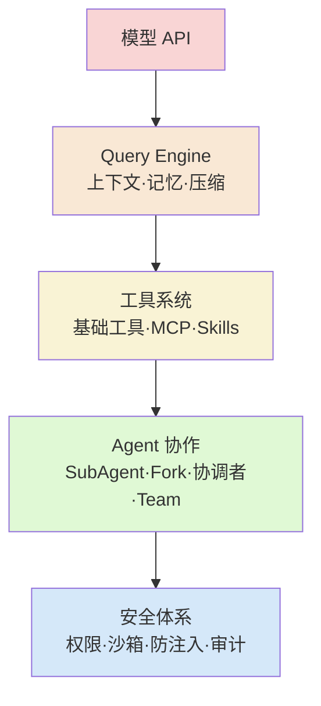

# Claude Code 源码解读：从驾驭工程视角理解 Agent 架构设计

# 一句话导读

读懂 Claude Code 的架构，就拿到了"驾驭工程"的最佳实践样板——知道 Agent 系统每一层该放什么、怎么放、为什么这样放。

# 适合谁看

- 正在构建或改造 Agent 应用的工程师，需要一张清晰的架构蓝图
- 用过 Claude Code / Cursor 但只停留在"工具层面"，想理解底层机制的开发者
- 对"驾驭工程"概念感到混乱，需要被正本清源的技术管理者
- 需要在企业内部落地 Agent 系统，尤其是安全和协作层有要求的架构师
- 在做 AI 产品选型，想判断各家 Agent 框架本质差异的产品经理

# 读完你会获得什么

- 能说清"驾驭工程"到底驾驭的是什么，和 Agent、模型之间是什么关系
- 能画出 Claude Code 的分层架构图，并解释每一层的设计意图
- 能理解 ReAct 循环的完整运行机制，包括状态管理、工具调用、压缩触发
- 能借鉴 Claude Code 的上下文工程策略，在自己的应用中实现静态分割与缓存优化
- 能区分五种 Agent 协作模式的本质差异，知道什么时候用哪种
- 能建立 Agent 安全设计的系统认知，不再只靠"加个沙箱"解决问题

---

## 01 背景：为什么这个问题现在值得讨论

Claude Code 核心源码被泄露（后部分开源）后，很多人兴奋地去翻代码，但看到的只是一堆 TypeScript 文件和零散的工具定义。问题在于：如果你只按代码结构去读——入口文件、初始化流程、UI 组件——你读到的只是"怎么写的"，不是"为什么这么写"。

与此同时，"驾驭工程"（Harnessness Engineering）这个词正在被滥泛化。最早它是 Anthropic 论文里用来描述如何让 Agent 稳定运行的方法论，后来被无限扩展成"模型以外的一切"都叫 Harness。这种语义膨胀让从业者越来越糊涂：到底什么是 Harness？它包含哪些东西？边界在哪？

Claude Code 的源码恰好提供了一个极其珍贵的参照物——它是 Anthropic 自家的产品，是 Harness 概念提出者的工程实现。读懂它，就能给"驾驭工程"一个不再模糊的定义。

---

## 02 核心判断：Claude Code 不是 AI 编码工具，是一套 Agent 工程架构

视频表面的内容是"Claude Code 源码解析"，但真正要讲的是：**Claude Code 是驾驭工程的最佳实践样板**。理解了它的架构，就理解了构建任何 Agent 系统需要哪些层次、每个层次该做什么、以及——最重要的——该克制什么。

Claude Code 的设计哲学不是"能加的功能都加上"，而是"能砍的功能都砍掉"。从工具过滤到权限默认拒绝，从记忆克制到协调者模式的减法设计，贯穿始终的原则是：**宁可功能少，不可系统乱**。这和开源社区驱动的产品（如 Cursor 背后的一些开源框架）形成了鲜明对比——后者倾向于不断做加法。

---

## 03 概念澄清：先把关键名词讲准确

### 驾驭工程（Harnessness Engineering）

- **它是什么**：让 Agent 稳定、可控、高效运行所需的全部工程手段，涵盖上下文管理、工具编排、记忆、安全、协作等
- **它解决什么问题**：光有模型跑不起来，或者跑起来不可控、不可靠、成本失控
- **它不是什么**：不是模型本身的能力，不是简单的 Prompt Engineering
- **和相关概念的区别**：Prompt Engineering 只管"怎么跟模型说话"，Harness 管的是"让模型在一个完整工程体系里说话和做事"
- **语义演变的混乱点**：最初指"驾驭 Agent 让它跑得好"（三大支柱：工程约束、规则约束、定期垃圾回收），后来被泛化为"模型 + Harness = Agent"，Harness 变成了一个什么都往里装的大筐
- **例子**：你让 Agent 写代码，模型决定"我需要读文件"——模型本身不会读文件，从"决定读"到"真的读到"再到"把结果喂回模型"这整条链路，都是 Harness

### ReAct 循环

- **它是什么**：Agent 的核心运行模式——思考（Reason）→ 行动（Act）→ 观察结果（Observe）→ 再思考，如此循环
- **它解决什么问题**：让模型能多步完成任务，而不是一步出结果就结束
- **它不是什么**：不是简单的"调用 API → 拿结果"，而是一个有状态、有判断、有退出的循环结构
- **例子**：用户说"帮我修这个 bug"，模型先思考需要看哪些文件，调用读文件工具，拿到内容后判断还需要看另一个文件，再调用，最终判断信息足够了，输出修复方案——这就是多轮 ReAct

### Query Engine

- **它是什么**：Claude Code 中包裹模型 API 的核心引擎，负责上下文拼接、ReAct 循环驱动、Token 管理、记忆注入
- **它解决什么问题**：模型只是"大脑"，Query Engine 是"神经系统"——把信号从各处汇聚、处理、传给大脑，再把大脑的指令分发到四肢
- **它不是什么**：不是模型本身，不是工具系统，而是模型和工具之间的调度层

### Fork Agent vs SubAgent vs 通用 SubAgent

- **Fork Agent**：复制主 Agent 的全部上下文，在此基础上继续执行子任务。好处是子任务完全知情，且利用 Token 缓存几乎不增加输入成本；坏处是上下文不隔离
- **通用 SubAgent**：从空白状态启动，只接收主 Agent 传入的任务描述。好处是上下文干净、成本低；坏处是缺乏前置信息
- **SubAgent（专项）**：预定义了专有 System Prompt、工具集和模型的子 Agent（如探索型、规划型、验证型），由主 Agent 按需选择

---

## 04 整体框架：Claude Code 的五层架构

从内到外，Claude Code 的架构可以分成五个同心圆：



**文字解释：**

- **第一层：模型 API**——最核心的被驾驭对象。所有外层存在的意义就是让模型在一个可控的工程环境中运行
- **第二层：Query Engine**——神经系统。包含 ReAct 循环驱动、上下文工程（System Prompt 动态拼装）、Token 管理（三层压缩）、记忆管理（短期+长期+Auto Dream）
- **第三层：工具系统**——手和脚。基础工具（Shell、文件系统）、MCP 服务、Skills 系统、Agent 工具。关键设计：52 个内置工具经过三层过滤后，Agent 实际可见的不到 20 个
- **第四层：Agent 协作**——多人协作。五种模式：通用 SubAgent、Fork Agent、专项 SubAgent、协调者模式、Team 模式。越往后越实验性
- **第五层：安全体系**——防御基建。权限漏斗、沙箱隔离、提示注入防控、审计日志。没有一招鲜，每个漏洞都是独立封堵

---

## 05 关键机制：它到底是怎么运行的

### 5.1 ReAct 循环的完整运行流程

**输入**：用户消息 + 初始 System Prompt + 可用工具列表

**处理流程**：

1. 构建初始 Message List（System Prompt + User Prompt）
2. 发送请求给模型
3. 模型返回两种结果之一：
   - 直接文本 → 退出循环，返回给用户
   - 工具调用 → 进入步骤 4
4. 框架执行工具调用，将结果作为 `tool_result` 追加到 Message List
5. 检查是否需要压缩（Token 管理），若需要则执行压缩
6. 重新构建请求，再次调用模型
7. 重复 2-6，直到模型输出直接文本

**输出**：模型的最终文本响应

**为什么要这样设计**：模型本身无法执行任何操作，它只能"说要做什么"。ReAct 循环让工程框架成为模型的执行代理，同时通过 Message List 的累积让模型在每轮都拥有完整上下文。

**代价**：Message List 不断增长，Token 消耗加速，必须配合压缩机制使用。

**适合/不适合**：适合需要多步推理和工具调用的任务；不适合单轮问答场景（但可以第一轮就直接返回文本退出）。

### 5.2 上下文工程：静态分割与 Token 缓存

这是 Claude Code 最值得借鉴的工程技巧之一。

**输入**：来自多个来源的 Prompt 片段

**处理逻辑**：

Claude Code 的 System Prompt 不是写在一个文件里读进来，而是由 `buildEffectiveSystemPrompt` 函数动态拼装。拼装顺序遵循一个核心原则：**静态在前，动态在后**。

| 位置 | 内容示例 | 变化频率 |
|------|----------|----------|
| 最前 | 身份定义、系统规则、安全规则 | 几乎不变 |
| 中间 | Agent 工具列表、Skill 指令、CLAUDE.md | 偶尔变化 |
| 最后 | Git 状态、当前日期、用户消息 | 每轮都变 |

在静态内容和动态内容之间，插入一个**静态分割符**，告诉模型："前面的部分查一下缓存。"

**为什么要这样设计**：大模型推理是线性的——从前往后逐 Token 处理。API 服务端会在中间过程做 Token 缓存。如果前半部分和上次请求完全相同，服务端可以直接命中缓存，跳过重新计算。命中缓存的 Token 价格是正常的 **十分之一**。

**实际收益**：Agent 长时间运行时，每次请求的上下文可能达到几十万 Token。没有缓存的话，一条请求就可能花掉数美元。有了缓存，输入端的大部分 Token 只花十分之一的价格。

**Fork Agent 的额外收益**：Fork 模式复制主 Agent 的全部上下文给子任务，看似成本高昂。但因为服务端缓存了前面所有对话，子任务的输入 Token 全部命中缓存，实际新增成本只有子任务自身新增的部分。

**代价**：需要严格管理 Prompt 片段的顺序和稳定性，工程复杂度高。

**适合**：所有需要长上下文、多轮交互的 Agent 应用。不适合短对话场景（收益不明显）。

### 5.3 Token 管理：三层压缩机制

**输入**：不断增长的 Message List

**三层压缩**：

| 层级 | 机制 | 触发时机 | 用户感知 |
|------|------|----------|----------|
| 第一层：剪裁 | 删除 N 轮以前的 `tool_result` | 每轮执行 | 无感知 |
| 第二层：磁盘重建 | 异步压缩+磁盘存储，到达阈值时从磁盘重新加载 | Token 使用超比例时 | 几乎无感知 |
| 第三层：全量摘要 | 同步对全部历史进行摘要压缩 | 磁盘重建时后台压缩未完成 | 明显等待 |

**第二层的精妙之处**：不是等到 Token 溢出才开始压缩，而是在 Token 使用超过一定比例时，**异步**将上下文写入磁盘并启动后台压缩。当真正到达阈值时，从磁盘加载已经压缩好的上下文，大大减少等待时间。

**第三层为什么慢**：全量摘要需要模型输出大量 Token（比如把 100 万字历史摘要成 10 万字），输出 Token 耗时与长度线性相关。这就是用户感受到"压缩五分钟"的原因。

**压缩的结构化要求**：Claude Code 不是告诉模型"你去压缩吧"，而是要求压缩结果必须满足特定的 JSON 结构——用户问题、待办清单、澄清内容等标准化字段。结构化压缩比自由摘要更高效、更可用。

**为什么要这样设计**：没有压缩，Agent 跑几轮就崩。单层压缩要么太激进丢失信息，要么太慢影响体验。三层压缩在不同时机用不同策略，平衡了信息保留和响应速度。

### 5.4 记忆管理：克制比记忆更重要

Claude Code 的记忆系统有一个反直觉的设计：**它在"写记忆"这件事上极度克制**。

当前用户能触发的记忆机制：

- System Prompt 中写了一句"你拥有持久化记忆系统，可以用 Write 工具写记忆"
- 当用户**明确要求**记住某件事时，立刻保存
- 当用户**明确要求**忘记某件事时，立刻删除

仅此而已。没有主动记忆、没有自动摘要、没有周期性归档。

**为什么克制**：宁可少记，不可记乱。代码编写场景下，大部分上下文是临时的、项目特定的。如果 Agent 自行决定记录，很容易存入噪声，反而干扰后续工作。

**未开放的高级机制**：

| 机制 | 原理 | 开放状态 |
|------|------|----------|
| Extract Memory | 每次 ReAct 结束后，在 Stop Hook 中将全部 Message List 喂给后台程序提取记忆 | 需环境变量开启 |
| Auto Dream | 每 24 小时触发，扫描工作空间所有 Memory 和 CLAUDE.md，整合、去重、去噪、清理冲突 | 需内部开关，实验性 |

**Auto Dream 的仿生学逻辑**：人类睡眠时大脑并不休息，而是把白天经历的事情过一遍——该记的归类记住，不该记的一觉忘掉。Auto Dream 做的是同样的事：定期扫描、整合、抽象、清理。这对应 OpenAI 早期论文中 Harnessness 三大支柱的第三条——**定期垃圾回收**。

### 5.5 工具系统：三层过滤的克制设计

Claude Code 内置 52 个工具，但 Agent 实际能看到的不到 20 个。原因：三层过滤。

**过滤流程**：

```
52个内置工具
  → 第一层：Feature Flag 过滤（隐藏实验功能）→ 砍掉约一半
  → 第二层：权限模式过滤（Read-only / Plan 模式禁用写工具）→ 再砍一批
  → 第三层：项目/企业策略过滤（用户自定义规则）→ 最终剩余 ~20个
```

**核心工具类别**：

- **基础工具**：Shell/Bash/PowerShell（核心中的核心）、文件读写、Grep 搜索（Claude Code **没有任何向量检索或 RAG 机制**，所有文件搜索全靠 Grep 和文件名匹配）、Web Search/Fetch
- **MCP 工具**：动态加载注册的 MCP 服务，按需暴露 Description 给 Agent（不再一次性把所有 MCP 工具塞进 System Prompt，解决上下文占用问题）
- **Skills 系统**：作为子进程注册，按优先级加载（本地项目 `.claude/skills/` > 用户目录 > 全局目录）

**为什么要这样设计**：给 Agent 看更多工具 ≠ 更强。工具列表本身就是上下文的一部分，太多工具浪费 Token、干扰模型判断。只暴露必要工具，反而让模型更精准地选择。

**值得注意的设计选择**：Claude Code 不用 RAG，不用向量数据库，不做语义检索。对于代码库这个规模的文件系统，Grep + 文件名匹配足够用。但如果你做的是企业级知识库（TB 级文档），RAG 仍然不可替代。

---

## 06 方法拆解：如果要构建自己的 Agent 系统，应该怎么落地

### 步骤一：搭建 Query Engine

**目标**：让模型能跑起来，能多步推理，能管理状态。

**具体动作**：
- 实现 ReAct 循环：Message List + 工具列表 → 请求模型 → 处理结果 → 循环或退出
- 定义 State 对象：消息列表、工具列表、对话轮次、压缩状态、终止标志
- 实现工具执行的框架层：模型返回工具调用 → 框架真正执行 → 结果追加到 Message List

**判断标准**：能让模型完成一个需要 2-3 步工具调用的任务，且每步都能基于前一步结果做判断。

**常见坑**：忘记在 tool_result 返回后重新调用模型；Message List 没有正确累积导致模型丢失上下文。

**产出物**：一个可运行的 ReAct 循环框架。

### 步骤二：实现上下文工程

**目标**：System Prompt 动态拼装 + 静态分割缓存。

**具体动作**：
- 将 System Prompt 拆分为静态片段和动态片段
- 按变化频率排列：几乎不变 → 偶尔变化 → 每轮都变
- 在静态和动态之间插入缓存分割标记
- 实现 `buildEffectiveSystemPrompt` 函数，从各模块拉取片段并拼接

**判断标准**：连续多轮对话时，静态部分命中缓存，输入 Token 费用降至正常的十分之一。

**常见坑**：把本应静态的内容放在了动态区（比如把身份定义放在日期后面），导致缓存命中率低。

**产出物**：带缓存优化的 Prompt 拼装系统。

### 步骤三：接入 Token 管理

**目标**：Agent 能长时间运行而不崩溃。

**具体动作**：
- 实现剪裁：配置保留最近 N 轮的 tool_result，更早的删除
- 实现异步压缩：Token 使用超比例时，将上下文写入磁盘，启动后台压缩
- 实现全量摘要兜底：到达阈值时，若异步压缩未完成，执行同步摘要
- 定义结构化压缩模板（JSON 结构），让压缩结果可用

**判断标准**：Agent 能在 50+ 轮对话后仍正常运行，且压缩等待时间可接受。

**常见坑**：只做全量摘要不做剪裁，导致压缩触发过频；压缩结果非结构化，后续模型无法有效利用。

**产出物**：三层压缩机制。

### 步骤四：选择 Agent 协作模式

**目标**：根据场景选择合适的子 Agent 模式。

**具体动作**：
- 通用 SubAgent：空白启动，适合独立探索任务
- Fork Agent：复制上下文，适合需要前置信息的延续任务（前提：服务端支持 Token 缓存）
- 专项 SubAgent：预定义角色+工具+模型，适合高频重复场景（如代码探索、验证、规划）
- 协调者模式：主 Agent 只编排不执行，适合需要严格约束的大任务
- Team 模式：独立数字员工协作，适合多角色持续协作

**判断标准**：子任务完成质量和成本的平衡。

**常见坑**：不区分模式混用；在无 Token 缓存的环境下使用 Fork 模式导致成本爆炸。

**产出物**：Agent 协作层。

### 步骤五：建设安全体系

**目标**：纵深防御，每个可能出漏洞的地方都封堵。

**具体动作**：
- 权限漏斗：Feature Flag → 企业策略 → Ask 规则 → Auto 规则 → 权限模式
- 沙箱隔离：网络层管控、目录限制、配置文件不可见
- 提示注入防控：逐条封堵已知攻击手段（清环境变量、随机化 Skill 路径、路径遍历防御）
- 审计日志：功能使用日志、决策日志、分布式链路追踪、成本追踪

**判断标准**：已知攻击手段全部有对应防御；权限默认拒绝；Agent 被拒绝后能友好降级而非崩溃。

**常见坑**：以为加个沙箱就安全了；权限只在工具调用时检查而不在工具注册时过滤；忘记在 tool_result 返回后做权限校验。

**产出物**：安全防御体系。

---

## 07 案例讲解：用 Claude Code 完成一次代码探索任务

**场景背景**：用户让 Claude Code "去检查这 20 个文件，看看哪些有未处理的 TODO 注释"。

**遇到的问题**：20 个文件逐个读，如果由主 Agent 串行处理，耗时长且上下文会膨胀。

**按框架如何处理**：

1. **主 Agent 判断**：这是一个可并行的探索任务，选择使用 SubAgent
2. **任务拆分**：主 Agent 创建多个 Task，每个 Task 对应一个文件或一组文件
3. **子 Agent 启动**：每个子 Agent 以专项 SubAgent（探索型）模式启动——只读权限、轻量模型、精简 System Prompt
4. **并行执行**：多个子 Agent 后台并行读取文件、搜索 TODO
5. **结果回收**：子 Agent 完成后结果进入队列，主 Agent 在 Stop Hook 时读取
6. **汇总输出**：主 Agent 综合所有子 Agent 的结果，输出汇总报告

**每步怎么做**：

- 步骤 2 中，主 Agent 使用 `create_task` 工具创建异步任务，指定 Task ID、状态、描述，分配给 SubAgent
- 步骤 3 中，探索型 SubAgent 的 System Prompt 明确规定"只读、不修改"，工具集只有 Read 和 Grep，模型选择轻量级版本降低成本
- 步骤 5 中，主 Agent 不阻塞等待，而是在自己当前轮次完成后，在 Stop Hook 中从队列读取子任务结果

**最终结果**：20 个文件并行处理，总耗时接近单个文件的处理时间，成本因轻量模型和只读工具而可控。

**说明了什么**：专项 SubAgent + 异步执行是 Agent 系统处理批量任务的标准范式。关键不是"能不能并行"，而是"用什么模式并行"——选择正确的 SubAgent 类型，决定了工具权限、模型选择和上下文隔离策略。

---

## 08 常见误区

### 误区一：以为 Harness 就是"模型以外的所有东西"

**错误理解**：Harness 是一个大筐，什么都往里装。  
**为什么错**：这种泛化让概念失去了指导意义。如果一切都是 Harness，那 Harness 等于什么都没说。  
**正确理解**：Harness 是一套有层次的工程体系，核心是"让模型能在一个可控环境中运行"——从最内层的上下文管理到最外层的安全防御，每一层解决特定问题。  
**应该怎么做**：用分层思维理解 Harness，而不是把它当做一个模糊的大词。

### 误区二：以为给 Agent 更多工具就更强

**错误理解**：把所有可用工具都注册给 Agent，让它自己选。  
**为什么错**：工具列表本身就是上下文的一部分。工具越多，Token 消耗越大，模型选择越容易出错。  
**正确理解**：Claude Code 52 个工具经过三层过滤只剩约 20 个可见。克制暴露工具，反而让模型更精准。  
**应该怎么做**：根据当前场景和权限，只暴露必要工具。

### 误区三：以为压缩就是"让模型压缩一下"

**错误理解**：到 Token 快满了，告诉模型"帮我把历史压缩一下"。  
**为什么错**：自由摘要的压缩结果不可控、不可复用，且同步执行会导致长时间阻塞。  
**正确理解**：压缩需要三层机制（剪裁→异步→全量兜底），压缩结果需要结构化。  
**应该怎么做**：配置剪裁轮数、实现异步压缩+磁盘存储、定义结构化压缩模板。

### 误区四：以为 Agent 应该尽可能多记东西

**错误理解**：让 Agent 记住所有对话内容，以后总能用到。  
**为什么错**：噪声记忆会干扰后续判断。Claude Code 的设计哲学是"宁可少记，不可记乱"。  
**正确理解**：记忆应该有明确的触发条件（用户显式要求），有定期的清理机制（Auto Dream）。  
**应该怎么做**：只在用户明确要求时写记忆；如果有条件，实现 Auto Dream 定期清理。

### 误区五：以为加个沙箱就解决安全问题了

**错误理解**：安全 = 沙箱，装上沙箱就万事大吉。  
**为什么错**：沙箱只能解决一部分隔离问题。提示注入、权限泄露、路径遍历、环境变量窃取等问题，沙箱管不了或管不全。  
**正确理解**：安全是纵深防御——权限漏斗、沙箱、注入防控、审计日志，每个漏洞独立封堵。  
**应该怎么做**：梳理所有已知攻击手段，逐条实现防御；权限默认拒绝；永远不信任模型输出。

### 误区六：以为 Claude Code 用 RAG 做代码检索

**错误理解**：Claude Code 肯定用了向量数据库或 RAG 来检索代码。  
**为什么错**：Claude Code 没有任何向量检索或 RAG 机制，所有文件搜索全靠 Grep 和文件名匹配。  
**正确理解**：对于代码库规模的文件系统，Grep 足够。RAG 的价值在 TB 级企业知识库场景。  
**应该怎么做**：根据数据规模选择检索方案，不要无脑上 RAG。

### 误区七：以为协调者模式是在做加法

**错误理解**：协调者模式 = 更强的 Agent，加了编排能力。  
**为什么错**：协调者模式是在做减法——主 Agent 被剥夺了所有执行能力，只能编排；Worker 不能再建子 Agent；后台 Worker 只有只读权限。  
**正确理解**：协调者模式通过严格限制每个角色的能力来换取更可控的协作。  
**应该怎么做**：在需要严格约束的大任务编排场景考虑此模式，但要知道它目前仍处于实验阶段。

### 误区八：以为有了开源源码就追上了

**错误理解**：源码都拿到了，照着抄就能做出一样的东西。  
**为什么错**：源码只是切面。如何迭代这套系统、如何构建评测体系、如何做版本管理和回归测试、如何运营 Harness 迭代——这些都是黑盒。  
**正确理解**：源码给你的是实现，不是能力。真正的差距在构建过程，不在产物。  
**应该怎么做**：读懂架构思想，而非复制代码；重点补齐评测体系和迭代流程。

---

## 09 实战清单：读完后可以马上照着做

### 立即能做

1. **审查你的 Agent 工具列表**：列出当前 Agent 可见的所有工具，标注哪些是每次对话必需的、哪些只在特定场景需要，把不必要的从默认列表中移除
2. **重新排列你的 System Prompt**：按变化频率从低到高排列片段，在静态和动态之间标记缓存分割点
3. **配置剪裁策略**：在 ReAct 循环中添加剪裁逻辑，默认保留最近 10 轮 tool_result，更早的直接删除
4. **检查权限默认值**：确保所有工具和操作的默认权限是"拒绝"，需要用户显式授权才放行

### 一周内能做

5. **实现异步压缩**：Token 使用超比例时，将上下文写入磁盘并启动后台摘要压缩
6. **定义结构化压缩模板**：设计 JSON 格式的压缩输出结构（用户问题、待办、澄清、关键决策等字段）
7. **梳理提示注入防御**：列出 5-10 种已知攻击手段（环境变量窃取、路径遍历、Skill 篡改等），逐条实现对应防御
8. **创建第一个专项 SubAgent**：选择一个高频场景（如代码探索、文档查询），定义专有 System Prompt、工具集和模型选择策略

### 长期要沉淀

9. **构建评测体系**：为你的 Agent 建立基准测试集，量化准确率、稳定性、成本、压缩效果
10. **实现 Auto Dream 机制**：定期扫描工作空间的记忆和配置，去重、去噪、清理冲突、抽象提炼
11. **探索 Team 协作模式**：设计独立数字员工的协作协议——信箱机制、广播能力、共享总线
12. **补齐身份认证**：在企业场景下，解决"Agent 操作了外部系统，但外部系统不知道是谁在操作"的问题

---

## 10 总结

Claude Code 的源码揭示了一个清晰的 Agent 架构：从模型 API 到 Query Engine，到工具系统，到 Agent 协作，到安全体系——五层同心圆，每一层有明确的职责边界。

这个架构的核心设计原则可以浓缩为一个词：**克制**。工具不过度暴露，记忆不过度写入，权限默认拒绝，协调者模式做减法不做加法。Claude Code 的哲学是：一个 Agent 系统，宁可功能少而精准，不可功能多而混乱。

但这套克制的设计之所以成立，是因为它背后有完整的工程支撑——三层压缩保证长时间运行、静态分割保证缓存命中、专项 SubAgent 保证任务精准、纵深防御保证安全底线。克制不是简陋，而是在充分理解问题空间后的精准取舍。

最后，源码给的是实现，不是能力。如何评测、如何迭代、如何从零构建这套体系——这些仍然是黑盒。读懂 Claude Code 的架构是起点，不是终点。
