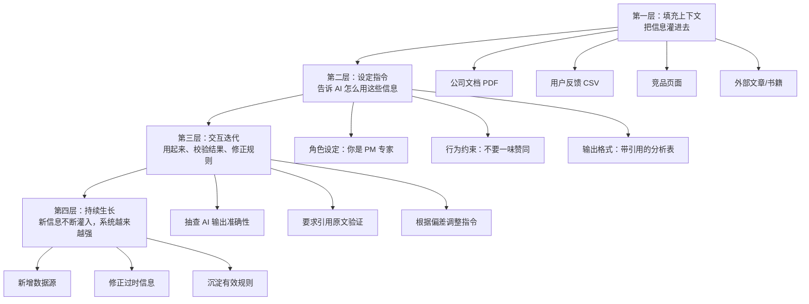

# PM 的第二大脑：如何用 AI 项目构建持久化的工作外脑

> 一个产品经理用四个真实场景证明：AI 的真正价值不是回答一次性问题，而是构建持有上下文的持久化外脑——它能替你持有信息、替你分析数据、替你训练技能。

---

# 适合谁看

- 每天要在多个项目间切换、脑容量不够用的产品经理
- 知道 AI 能用但只会"问一句答一句"，还没搭建过持续化工作流的人
- 想用 AI 做用户调研和竞品分析但不知道如何程序化获取数据的人
- 收到过"写得太长""表达不清晰"等反馈，却缺乏持续改进手段的人
- 正在准备面试，需要一个随时能练习的陪练的人

---

# 读完你会获得什么

- 理解"AI 第二大脑"和"一次性问答"的本质区别，知道为什么前者更值得投入
- 掌握给 AI 项目填充上下文的完整方法论：什么文件该放、什么不该放、为什么
- 能用 AI 辅助自己写出数据抓取脚本，即使不会写代码
- 知道如何把收到的个人反馈转化为一个持续改进的 AI 教练
- 明白语音模式和文本模式在面试准备中的差异，以及各自的最佳用法
- 获得一份可以直接照做的分阶段行动清单

---

# 01 背景：为什么这个问题现在值得讨论

产品经理的工作有一个结构性矛盾：你需要同时持有大量上下文——公司战略、团队目标、用户反馈、竞品动态、技术约束、项目进度——但你的大脑容量是有限的。

过去，PM 们用笔记本、文档、Notion、Slack 置顶消息来对抗遗忘。但这些工具是被动的：信息躺在那里，你不去翻它就不起作用。更关键的是，它们不会替你思考。

大语言模型的出现改变了这件事。你可以把上下文灌给一个 AI 项目，它不仅持有信息，还能基于这些信息和你对话、分析、生成、质疑。这不是一个更好的笔记本，是一个能思考的知识库。

但大多数人的用法停留在"问一句答一句"。每次对话从零开始，上下文不复用，AI 不了解你的工作背景，输出质量自然不稳定。

问题的核心不是"AI 能不能帮上忙"，而是"你有没有把 AI 变成一个持有你工作上下文的持久化系统"。

---

# 02 核心判断：视频真正想讲的不是"AI 工具推荐"

这段视频表面上在讲四个独立场景——建 GPT 项目、写爬虫脚本、做写作教练、用语音模拟面试——但它真正在讲的是同一件事：

**AI 的价值密度取决于你给它多少结构化上下文。**

零上下文 → AI 是通用问答机器人，输出平庸。
少量上下文 → AI 是稍好一点的助手，偶尔有用。
大量、分层、持续积累的上下文 → AI 是你的第二大脑，能替你持有信息、做出判断、给出针对性反馈。

视频中的 Aimon 做对的不是"用了 AI"，而是**为每个具体问题构建了一个持有专属上下文的 AI 系统**。他的 Reddit 分析项目里装着公司启动会文档、产品页面、34000 行用户对话；他的写作教练里装着老板的反馈、专业写作指南、具体重写规则；他的面试 GPT 里装着产品面试框架、题目类型、评分标准。

这些上下文不是一次性投喂，而是持续生长的：每获得新信息就往里加，每次用完就多一层积累。

这才是从"用 AI"到"依赖 AI"的关键跨越。

---

# 03 概念澄清：先把关键名词讲准确

### AI 项目 / Custom GPT / Claude Project

- **它是什么**：大语言模型平台提供的功能，允许你创建一个持有固定文件和系统指令的 AI 实例，所有对话自动继承这些上下文
- **它解决什么问题**：避免每次对话从零开始，让 AI 持有你的工作背景和历史信息
- **它不是什么**：它不是一个独立的模型，仍然是底层模型 + 你给的上下文在起作用
- **它和普通对话的区别**：普通对话是一次性的，关掉就没了；项目是持久的，上下文跨对话保留
- **简单例子**：你在 ChatGPT 里创建一个"周一项目"，上传了产品文档和用户反馈，之后每次在这个项目里开新对话，AI 都知道你的产品是什么、用户在说什么

### 第二大脑（Second Brain）

- **它是什么**：一个比喻，指替你持有信息、辅助思考的外部系统
- **它解决什么问题**：人脑短期记忆有限，第二大脑扩展了你的信息持有能力
- **它不是什么**：不是简单的文件存储，而是能基于存储的信息和你交互的系统
- **它和知识库的区别**：知识库是被动存储，第二大脑是主动交互——你问它答，你写它改，你说它评
- **简单例子**：Evernote 是知识库，你存了文章但得自己去找；AI 项目是第二大脑，你问"用户最想要什么功能"，它能基于你存的 34000 条对话给你排序

### 数据抓取（Scraping）

- **它是什么**：通过程序自动从网站获取结构化数据
- **它解决什么问题**：手动浏览大量网页信息效率太低，抓取可以批量、程序化地获取
- **它不是什么**：不是黑客行为，Reddit 等平台提供开发者 API 允许合法访问公开数据
- **它和搜索的区别**：搜索是获取特定答案，抓取是获取大量原始数据供后续分析
- **简单例子**：你想知道 Reddit 上大家怎么评价你们公司的 AI 功能，搜索只能一条一条看，抓取可以一次性拉取几千条相关帖子

### 语音模式（Voice Mode）

- **它是什么**：大语言模型的语音交互界面，支持实时对话
- **它解决什么问题**：口语表达和书面表达是不同的技能，文本练习无法训练口语能力
- **它不是什么**：不是简单的语音转文字，是真正理解语境的对话系统
- **它和文本模式的区别**：文本模式适合结构和逻辑，语音模式适合表达和节奏；面试是口语场景，用语音练习更接近真实
- **简单例子**：你在文本框里写"我会先了解用户痛点"，AI 无法判断你的语气是否自信；你在语音模式里说出来，节奏、停顿、措辞都是可被评估的维度

---

# 04 整体框架：构建 AI 第二大脑的四层模型

视频内容可以重构为一个从基础到进阶的四层框架：

**第一层：填充上下文**——把信息灌进去。这是基础，没有上下文就没有第二大脑。视频中的关键洞察是"**一切皆文本**"：Google Slides 导出为 PDF、产品页面打印为 PDF、竞品定价页保存为 PDF、用户反馈导出为 CSV——这些都能被 AI 读取。不需要特殊格式，只要能变成文字就行。

**第二层：设定指令**——告诉 AI 如何使用这些上下文。这决定了 AI 是你的应声虫还是你的挑战者。Aimon 明确要求 AI "不要一味赞同我的想法，要敢于挑战"，这避免了 AI 最常见的讨好倾向。

**第三层：交互迭代**——用起来，然后校验。AI 会犯错，你不校验就会误用。Aimon 的做法是要求 AI 给出引用原文，他去回查验证。这是信任但验证的态度。

**第四层：持续生长**——第二大脑不是建完就结束的。每次获得新信息都往里加，每次发现 AI 的偏差都修正指令。文件从 2-3 个长到十几个，指令从简单描述到精确规则，系统越用越强。

---

# 05 关键机制：每个场景到底是怎么运行的

## 机制一：用 AI 辅助构建数据抓取流程

**输入**：一个模糊的需求——"我想知道网上所有关于 monday.com AI 功能的讨论"

**中间处理**：
1. 向 Claude 描述需求，Claude 帮你评估可行的数据源（Reddit API 免费，LinkedIn/Twitter API 有限制或付费）
2. Claude 逐步指导你注册 Reddit 开发者账号、安装 Python 环境、安装依赖包
3. Claude 为你编写抓取脚本，你只需要填入自己的 API 凭证
4. 脚本运行后输出 CSV 文件

**输出**：包含 34000 行对话数据的 CSV 文件，涵盖公司名、AI、Agent 等关键词的 Reddit 讨论

**为什么这样设计**：PM 不需要成为程序员，但需要程序化地获取大量数据。让 AI 承担编程工作，人承担定义需求和验证结果的工作，这是合理的分工。

**代价**：你需要愿意在终端里跑命令，需要注册开发者账号，需要处理可能的报错。整个过程不是零门槛，但 AI 把门槛从"会写 Python"降到了"能跟着步骤操作"。

**适合场景**：需要大量定性数据来支撑产品决策时。不适合场景：数据量小、手动就能看完的情况——不值得搭基础设施。

## 机制二：用 AI 分析大量定性数据

**输入**：34000 行 Reddit 对话 CSV + "帮我按主题分类、计算频率、提取关键讨论点"的指令

**中间处理**：
1. AI 读取全部数据
2. 按主题聚类（如"AI Agent 功能期望""竞品对比""定价反馈"）
3. 计算每个主题的出现频率和占比
4. 提取每个主题下最有代表性的讨论要点
5. 生成结构化分析表

**输出**：一张带权重的话题排序表，告诉你用户最关心的前五个领域是什么

**为什么这样设计**：34000 行数据人读不完，但 AI 可以。关键在于不是让 AI 替你做判断，而是让 AI 替你做初筛和排序，你基于排序结果做判断。

**代价**：AI 可能会误分类或遗漏，所以需要验证。Aimon 的做法是要求 AI 附带原文引用，他去回查。

**适合场景**：数据量大到人工无法全读，但需要定性洞察时。不适合场景：数据量小或只需要简单统计时——直接用 Excel 就够了。

## 机制三：把个人反馈转化为 AI 教练

**输入**：老板/同事的反馈（"你写得太长了"）+ 专业写作指南（Lenny 的 newsletter、相关书籍）+ 重写规则（"保持自然语气，避免过多破折号和项目符号"）

**中间处理**：
1. AI 学习写作指南中的简洁表达原则
2. AI 学习反馈中指出的具体问题
3. 你粘贴一条写好的 Slack 消息
4. AI 按规则重写：更简洁、更直接、保持你的自然语气

**输出**：重写后的消息，比原文更简洁但不失信息量

**为什么这样设计**：多数人收到反馈后不知道如何持续改进。读一本书关于写作和每天练习写简洁消息之间有巨大鸿沟。AI 教练填平了这个鸿沟——它把抽象的写作原则变成每次写作时的即时反馈。

**代价**：如果你不认真对待 AI 的重写建议、只是无脑接受，你的写作不会真正提升。AI 教练的效果取决于你是否对比原文和改写、理解为什么这样改更好。

**适合场景**：有明确的改进方向但缺乏持续练习手段时。不适合场景：你还没搞清楚自己到底要改进什么时——先搞清楚问题，再建教练。

## 机制四：用语音模式做模拟面试

**输入**：面试框架指令（"不要引导我，要直接提问，最后给反馈"）+ 角色/公司信息 + 你的简历

**中间处理**：
1. AI 按产品面试框架提问（产品感题、执行力题）
2. 你口语回答
3. AI 不引导、不提示，像真实面试官一样推进
4. 面试结束后 AI 给出反馈：哪里好、哪里需要改进、下一次应该注意什么
5. 多次练习后，AI 可以指出你的进步轨迹

**输出**：即时口语练习 + 结构化反馈 + 纵向进步追踪

**为什么这样设计**：面试是口语场景，书面练习无法训练语感、节奏和临场反应。对着镜子练没有互动，找人练对方不懂产品面试框架。语音模式同时解决了互动性和专业性的问题。

**代价**：语音模式可能不总是可用或稳定；AI 的提问深度可能不如经验丰富的真人面试官。

**适合场景**：需要高频练习口语表达和即时反馈时。不适合场景：需要行业深度洞察的面试准备——AI 不了解目标公司的内部情况。

---

# 06 方法拆解：如果自己要做，应该怎么落地

## 第一步：选定一个高频痛点

**目标**：找到你工作中最消耗认知资源的那个环节

**具体动作**：列出你每天/每周反复做的事，标注哪些需要大量上下文、哪些重复性高、哪些你经常遗忘细节

**判断标准**：选那个"如果有人替我持有这些信息并随时回答，我效率提升最大"的环节

**常见坑**：不要一上来就建五六个项目，先做一个做透

**产出物**：一个明确的痛点描述，如"我需要在多个项目间切换，每次都要重新回忆上下文"

## 第二步：收集和转化上下文文件

**目标**：把相关信息全部转化为 AI 可读的文本格式

**具体动作**：
- 公司启动会 PPT → 下载为 PDF
- 产品页面和支持页面 → 浏览器打印为 PDF
- 竞品定价页面 → 打印为 PDF
- 用户反馈数据 → 导出为 CSV
- 内部文档 → 直接上传或复制粘贴
- 外部参考文章/书籍 → 找到文本版上传

**判断标准**：问自己"如果新来一个同事，我需要给他看哪些材料才能让他理解这件事？"——那些材料就是你该上传的

**常见坑**：不要只放"重要"文档而忽略"基础"文档。AI 不了解你们公司做什么，产品介绍页比战略文档更基础

**产出物**：5-10 个 PDF/CSV/TXT 文件，覆盖背景信息、参考资料、历史数据

## 第三步：写系统指令

**目标**：告诉 AI 它的角色、行为边界和输出偏好

**具体动作**：
- 设定角色："你是一名资深产品经理，擅长产品策略和用户洞察"
- 设定行为约束："不要一味赞同我的想法，要敢于挑战和质疑"
- 设定输出格式："分析时请附带原文引用""输出时用表格呈现，包含频率和权重"
- 设定语气："保持专业但直接，避免空话"

**判断标准**：如果你第一次用这个项目时 AI 的回复让你想修正它的行为，那个修正就该写进指令里

**常见坑**：指令太模糊（"帮我做好产品决策"）或太死板（"必须用五个要点回答"）。好的指令是原则性的，不是操作性的

**产出物**：一段 200-500 字的系统指令，覆盖角色、行为、输出三个维度

## 第四步：使用并校验

**目标**：开始用，但不要盲信

**具体动作**：
- 先问一个你已经知道答案的问题，看 AI 是否准确
- 要求 AI 附带引用或出处，便于回查
- 对比 AI 的分析和你的手动分析，看有无遗漏或偏差
- 发现偏差就修正指令或补充文件

**判断标准**：AI 的输出在你抽查的 3-5 个点上是否基本准确

**常见坑**：要么完全不信任 AI（浪费了它的能力），要么完全信任（被错误输出误导）。正确做法是信任但验证

**产出物**：经过校验的项目 + 修正后的指令/文件

## 第五步：持续迭代

**目标**：让第二大脑随你的工作一起进化

**具体动作**：
- 每获得新信息（新的用户反馈、新的竞品动态、新的老板反馈）就往项目里加
- 每次发现 AI 的偏差就修正指令
- 定期清理过时信息
- 把有效的规则沉淀到指令中

**判断标准**：项目里的文件数量是否在持续增长，指令是否在持续精确化

**常见坑**：建完就不管了。第二大脑不迭代就会过时，过时的上下文比没有上下文更危险

**产出物**：一个持续生长的、越来越精准的 AI 项目

---

# 07 案例讲解：从"模糊的需求"到"数据驱动的产品决策"

**场景背景**：Aimon 加入 monday.com 负责 AI Agent 团队。公司内部对 Agent 有无数种期待——销售团队想要自动化销售流程，客服团队想要自动回复，产品团队想要智能推荐，高管想要"能做一切"的 Agent。每个人对 Agent 的定义都不一样，没人知道用户到底想要什么。

**遇到的问题**：
- 内部声音太多、太杂、太有立场
- 需要一个无偏见的信息源来辅助决策
- 手动搜索 Reddit 和 Twitter 效率太低，看不完

**按框架如何处理**：

**第一步——填充上下文**：把公司的启动会 PPT、产品介绍页面、支持页面全部导出为 PDF，上传到 ChatGPT 项目。这些给 AI 提供了基础认知：monday.com 是什么、团队在做什么。

**第二步——程序化获取外部数据**：用 Claude 逐步指导，从注册 Reddit 开发者账号到运行抓取脚本，获得了 34000 行与 monday.com AI Agent 相关的 Reddit 对话。同时抓取竞品相关的讨论数据。

**第三步——让 AI 做数据分析**：把 CSV 文件喂给 Claude，要求按主题分类、计算频率、提取关键讨论点，附带原文引用。得到一张排序表：用户最期待的 AI 功能前五名是什么。

**第四步——校验**：抽查 AI 提供的引用原文，确认分类和总结基本准确。

**第五步——把分析结果回灌项目**：把分析结果也放进 GPT 项目，这样后续任何对话中 AI 都知道"用户最关心什么"。

**最终结果**：Aimon 获得了一份有数据权重的用户需求优先级表，可以拿着这个回到团队说"这不是我的判断，这是 34000 条真实对话告诉我们的"。内部讨论从"我觉得用户想要 X"变成了"数据显示用户最常讨论的是 Y"。

**说明了什么**：AI 在这个场景中的价值不是替你做判断，而是帮你从海量噪声中提取信号，把模糊的内部争论锚定在有数据支撑的基础上。关键路径是：**定义信息需求 → 程序化获取 → AI 初筛分析 → 人工校验 → 决策使用**。

---

# 08 常见误区

**误区一：以为建了 GPT 项目就等于有了第二大脑**

- 错误理解：创建一个项目、随便传两个文件，就大功告成了
- 为什么错：没有足够的上下文，AI 项目和普通对话没有本质区别。2 个文件的项目是聊胜于无
- 正确理解：第二大脑的价值和输入的上下文量成正比。Aimon 的项目从 2-3 个文件起步，逐渐增长到十几二十个
- 应该怎么做：持续往项目里加信息，而不是建完就结束

**误区二：把 AI 当搜索引擎用**

- 错误理解：每次对话只问一个具体问题，拿到答案就关掉
- 为什么错：这样你永远在从零开始，AI 无法积累对你工作背景的理解
- 正确理解：AI 项目是一个持续的上下文容器，对话是迭代，不是查询
- 应该怎么做：在同一个项目里展开多轮对话，让 AI 的理解越来越深

**误区三：放任 AI 一味赞同你**

- 错误理解：AI 说我好就觉得好，AI 说我的想法不错就心安
- 为什么错：大语言模型有讨好倾向，默认会肯定你的想法。你得到的是情绪价值，不是认知价值
- 正确理解：真正有用的 AI 是能挑战你的 AI
- 应该怎么做：在指令中明确写"不要一味赞同，要敢于质疑和挑战"

**误区四：不校验 AI 的输出**

- 错误理解：AI 生成的分析表看起来很专业，直接拿去用
- 为什么错：AI 会犯错，尤其在大数据量分析中会误分类、遗漏或编造
- 正确理解：AI 的输出是草稿，不是定稿
- 应该怎么做：要求 AI 附带原文引用，抽查关键结论，验证后才能使用

**误区五：觉得"我不会写代码"就无法做数据抓取**

- 错误理解：数据抓取是程序员的活，PM 做不了
- 为什么错：AI 可以帮你写代码、指导你安装环境、逐步带你运行。你不需要会写 Python，你只需要会描述需求
- 正确理解：门槛从"会编程"降到了"能跟着 AI 的步骤操作"
- 应该怎么做：向 AI 清楚描述你想抓取什么，让它给你逐步指南

**误区六：用文本模式准备口语场景**

- 错误理解：面试准备就是在文本框里写答案
- 为什么错：口语表达和书面表达是不同技能。你在文本框里写得再有逻辑，开口说可能是另一回事
- 正确理解：口语场景需要口语练习
- 应该怎么做：面试、演讲、汇报等口语场景，用语音模式练习

**误区七：收到反馈后只是"记住了"**

- 错误理解：老板说你写得太长，你点头说"好的我会注意"，然后就忘了
- 为什么错：没有机制保证你真的在改进。人的惯性很强，光靠"记住"不会改变行为
- 正确理解：反馈需要被制度化——变成一个 AI 教练的规则，每次你写作时自动生效
- 应该怎么做：把反馈内容 + 改进指南加载到 AI 项目中，让它每次都帮你校验

**误区八：一次建太多项目**

- 错误理解：我有五个痛点，马上建五个 GPT 项目
- 为什么错：每个项目都需要投入时间填充上下文、写指令、校验和迭代。同时搞五个，哪个都做不好
- 正确理解：先做一个，做透，理解了模式再复制
- 应该怎么做：选最痛的那个点，花一周时间把它做到"离了它就不舒服"的程度

---

# 09 实战清单：读完后可以马上照着做

## 立即能做

1. **选一个痛点**：列出你工作中最消耗脑力的 3 件事，选最痛的那个
2. **收集 5 个文件**：把和这个痛点相关的文档（PPT、PDF、页面截图转文字、邮件摘录）准备好
3. **在 ChatGPT 或 Claude 中创建一个项目**，上传这些文件，写一段 200 字的系统指令（角色 + 行为约束 + 输出偏好）
4. **提一个你已经知道答案的问题**，看 AI 的回答是否准确，据此调整指令
5. **把一段自己写的文字（Slack 消息、邮件、文档）粘贴进去**，让 AI 按"更简洁、更直接"的原则重写，对比差异

## 一周内能做

1. **注册 Reddit 开发者账号**：如果你需要外部用户反馈数据，这是第一步
2. **让 AI 帮你写一个简单的数据抓取脚本**：不需要一步到位，先跑通一个小需求（比如抓取 100 条某个子论坛的帖子）
3. **把你最近收到的一条工作反馈写进 AI 项目指令中**：比如"我的表达需要更简洁"→ 写成具体的重写规则
4. **用语音模式做一次 10 分钟的模拟练习**：面试、汇报、演讲，选一个你即将面对的口语场景
5. **给 AI 加上"必须附带引用"的规则**：从此以后它的分析输出都有可追溯的来源

## 长期要沉淀

1. **每个 AI 项目定期（月度）更新文件**：删除过时信息，补充新获得的数据和文档
2. **把 AI 的有效挑战和纠偏记录下来**：当你发现 AI 说得对、你原本想错了的时刻，记下来——这是你认知盲区的地图
3. **把好的 AI 项目模板分享给团队**：你验证过的指令和文件结构，对同事同样有价值
4. **建立个人反馈 → AI 教练的常态化机制**：每收到新反馈，不只是"记住"，而是写进 AI 的规则里
5. **追踪自己的进步**：定期让 AI 对比你早期和近期的输出，评估你在目标技能上的改善程度

---

# 10 总结

这段视频展示的不是"AI 工具推荐清单"，而是一个产品经理如何把 AI 从偶尔使用的问答工具，变成不可或缺的工作基础设施。

核心模式只有一套：**填充上下文 → 设定指令 → 交互迭代 → 持续生长**。四个场景——用户调研、数据分析、写作改进、面试准备——都是这个模式的具体应用。区别只在于上下文的类型不同、指令的侧重不同、迭代的节奏不同。

视频中最值得注意的洞见有两个。一是"一切皆文本"：任何你能变成文字的信息都可以灌给 AI，PPT 导出 PDF、网页打印为 PDF、数据导出 CSV，不需要特殊格式。二是"把反馈制度化"：收到反馈后不是"记住了"，而是写进 AI 的规则里，让它在每次交互中自动生效——这是从一次性改善到系统性改进的关键。

Aimon 在 monday.com 的 90 个 PM 中排名 AI 使用第四，但他说自己还有两个月的延迟。这意味着排在他前面的人比他更早、更深入地采用了同样的方法。**AI 的竞争力不在于你会不会用它，而在于你有没有把它变成一个持有你专属上下文、和你一起进化的系统。** 那些先跑起来的人，他们的第二大脑已经比你的更丰富了——而这个差距会随时间复利增长。
