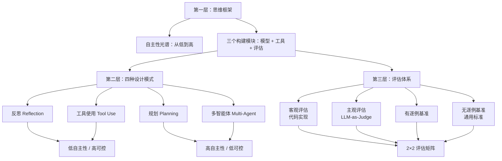

# Andrew Ng 的 Agent AI 课程精华：从三个构建模块到四种设计模式，真正被忽略的是评估

## 一句话导读

Andrew Ng 的 Agent AI 课程最核心的贡献不是教你用什么模式搭系统，而是指出：评估（evals）才是 Agent 开发的另一半，没有它你连自己有没有在进步都不知道。

## 适合谁看

- 正在构建 AI Agent 产品、但对"怎么知道它好不好"没有系统方法的技术人和产品经理
- 听过 Reflection、Tool Use、Multi-Agent 这些词，但分不清它们各自的适用边界和代价
- 想从零开始搭 Agent 系统，需要一个从设计到评估的完整思维框架
- 已经在用 LLM 做应用，但停留在单次调用的水平，想理解多步 Agent 工作流的价值

## 读完你会获得什么

- 能用"自主性光谱"替代"是不是 Agent"的无意义争论，做出明确的设计决策
- 能说清 Agent AI 的三个构建模块（模型、工具、评估）各自的角色和关系
- 能区分四种设计模式（反思、工具使用、规划、多智能体）的适用场景和代价
- 能用 2×2 矩阵（客观/主观 × 有/无逐例基准）为自己的 Agent 选择正确的评估方法
- 能按照"先跑脏数据、再建评估"的路径从零启动 Agent 项目

---

## 01 背景：为什么这个问题现在值得讨论

大语言模型的调用方式正在经历一次结构性变化。

过去两年，大多数人的用法是：给 LLM 一个 prompt，拿一个回答，结束。单次调用，单次输出。能用，但天花板很低——你没法让它处理需要多步骤、多工具、多轮判断的复杂任务。

与此同时，行业里陷入了一场低效争论：一个系统到底算不算"Agent"？如果它没有完全自主决策的能力，还能叫 Agent 吗？这场争论消耗了大量注意力，却没有产出任何有用的设计指导。

Andrew Ng 在这门课里明确拒绝了这个二元框架。他的核心立场是：**不要纠结"是不是 Agent"，而要关注"你在自主性光谱上的哪个位置"**。这是一个务实的转向——从语义争论转向工程选择。

这个转向之所以现在重要，是因为越来越多团队开始构建 Agent 系统，但绝大多数人只关注了"怎么搭"（模型选哪个、工具接什么），而忽略了"怎么知道搭得好不好"。这正是这门课最有价值的部分：评估（evals）不是可选项，而是 Agent 开发的第三个构建模块。

---

## 02 核心判断：视频真正想讲的不是设计模式，是评估

这门课的表面结构是：一个定义 + 四种模式 + 实操建议。但如果你只记住了 Reflection、Tool Use、Planning、Multi-Agent 这四个词，你就错过了重点。

真正核心的判断是：**评估是 Agent 开发的另一半，不是附加项。**

原因很简单：Agent 系统的输出是非确定性的。同一个输入，换一次 prompt 调整、换一次模型升级，结果可能变好也可能变坏。如果你没有一个客观的方式来衡量"变好"还是"变坏"，你所有所谓的"优化"都只是在凭感觉。Andrew Ng 用了课程中最大的篇幅来讲评估，这本身就是一个信号——行业里人人都在谈 Agent 架构，但几乎没有人系统讲过 Agent 评估。

四种设计模式当然有价值，但它们更像是"怎么搭"的答案。评估回答的是更根本的问题："搭出来之后，怎么知道它行不行？怎么让它变得更好？"

---

## 03 概念澄清：先把关键名词讲准确

### Agent AI / Agentic AI Workflow

- **它是什么**：一个 LLM 驱动的工作流，通过多个步骤完成一个任务，每个步骤可以涉及模型调用、工具使用或人工介入
- **它解决什么问题**：单次 LLM 调用无法处理需要多步推理、外部数据获取、中间判断的复杂任务
- **它不是什么**：它不是一个自主意识体。"Agent"这个词容易让人联想到自主决策的智能体，但在工程语境下，它只是"多步骤 LLM 工作流"的简称
- **和相关概念的区别**：传统 LLM 调用是"一次输入 → 一次输出"；Agent 工作流是"一个目标 → 多步骤执行 → 最终输出"，中间步骤可以包含循环、条件分支和工具调用
- **简单例子**：写一篇关于茶道的文章——不是让 LLM 一次性写完，而是让它先列提纲、再做研究、写初稿、反思改进、最终定稿

### 自主性光谱（Autonomy Spectrum）

- **它是什么**：一个连续的光谱，一端是步骤完全预定义的低自主性工作流，另一端是 LLM 自行决定步骤和工具的高自主性工作流
- **它解决什么问题**：替代"是不是 Agent"的二元争论，把设计决策变成一个度的问题
- **它不是什么**：不是"低自主性 = 差，高自主性 = 好"。两者各有代价
- **简单例子**：写文章——低自主性版本指定"先写提纲→再做研究→写初稿→反思→定稿"；高自主性版本只给目标和一组工具，让 LLM 自己决定步骤

### 设计模式（Design Pattern）

- **它是什么**：经过验证的 Agent 工作流结构，针对特定类型任务的标准解法
- **它解决什么问题**：大部分 Agent 任务会收敛到少数几种模式，不用每次从零设计
- **它不是什么**：不是必须严格遵守的模板。你可以组合、裁剪、调整

### 评估（Eval）

- **它是什么**：一套衡量 Agent 输出质量的机制，包括评估标准、评估方法和改进闭环
- **它解决什么问题**：Agent 输出非确定性高，没有评估就无法客观判断系统是否在改善
- **它不是什么**：不是测试套件的简单移植。传统软件测试假设输出是确定的，Agent 评估需要处理模糊性和主观性
- **简单例子**：你的邮件回复 Agent 是否提到了竞争对手——写一段代码检查输出中是否包含竞品名称，计数器不为零就说明有问题

---

## 04 整体框架：这套内容应该如何理解

这门课的内容可以重构为一个三层递进的结构：

**文字解释**：

第一层建立思维框架——理解自主性光谱和三个构建模块。这是做任何设计决策的基础。

第二层介绍四种设计模式——反思和工具使用偏向低自主性、高可控；规划和多智能体偏向高自主性、低可控。选择哪种模式，取决于你对控制力和灵活性的权衡。

第三层是评估体系——2×2 矩阵（客观/主观 × 有/无逐例基准）帮你选择正确的评估方法。评估不是最后一层才做的事，而是贯穿整个开发过程的核心能力。

三层的关系是：框架决定你用什么模式，模式决定你面临什么评估挑战，评估决定你能不能持续改进。

---

## 05 关键机制：四种设计模式到底怎么运行

### 反思（Reflection）

- **输入**：LLM 的首次输出（通常是初稿）
- **中间处理**：让同一个 LLM（或另一个 LLM）审视首次输出，找出问题，生成改进版本。可以多轮迭代
- **输出**：经过反思改进后的最终结果
- **为什么这样设计**：LLM 一次性输出的质量往往不稳定，但让它"看一眼自己写的东西再改"，效果会显著提升。这和人类写完草稿后回头修改是同一个道理
- **代价**：增加了 LLM 调用次数，延迟和成本上升；改进幅度有上限，不会因为反思更多轮就无限变好
- **适合场景**：写作、代码生成、邮件回复等输出质量有明确改善空间、且改善方向可以被 LLM 自身识别的任务

### 工具使用（Tool Use）

- **输入**：LLM 需要执行它自身无法完成的操作（查数据库、发邮件、调 API）
- **中间处理**：在系统提示中告知 LLM 可用的工具列表及其功能描述，LLM 根据任务需要选择并调用对应工具
- **输出**：LLM 基于工具返回的结果生成最终回答
- **为什么这样设计**：LLM 本身只能生成文本，不能执行操作。工具扩展了它的能力边界
- **代价**：你必须为每个工具写清晰的描述和接口定义，否则 LLM 不知道什么时候该用哪个工具；工具越多，选择错误的概率也越高
- **适合场景**：需要与外部系统交互的任务——查日历、订会议、查库存、更新数据库等

**一个关键细节**：Andrew Ng 在课程中把 Tool Use 既作为"构建模块"又作为"设计模式"来讲。作为构建模块，它指的是"你的 Agent 有没有工具可用"；作为设计模式，它强调的是"给 Agent 提供工具能显著提升性能"。这两个层面不矛盾，但需要区分清楚。

### 规划（Planning）

- **输入**：一个需要多步推理才能回答的查询
- **中间处理**：LLM 先生成一个执行计划（"我需要先做 A，再做 B，最后做 C"），然后按计划逐步执行
- **输出**：按计划执行后的最终结果
- **为什么这样设计**：有些任务没有固定路径，Agent 需要根据当前信息和可用工具自己规划步骤
- **代价**：计划不是预设的，你无法预先知道 Agent 会走什么路径。这导致调试困难、结果不可预测
- **适合场景**：客户服务中需要组合多条件查询的场景（"有没有 100 美元以下的圆框墨镜"需要先找款式、再查库存、再比价格）

### 多智能体（Multi-Agent）

- **输入**：一个复杂任务，涉及多种不同类型的工作
- **中间处理**：将任务拆分给多个专业化 Agent，每个 Agent 负责一个子任务，结果在 Agent 之间传递
- **输出**：各 Agent 协作完成后的最终产出
- **为什么这样设计**：一个 Agent 做所有事，和一个人做公司所有事一样——每个领域都只做到及格。专业化分工能提升每个环节的质量
- **代价**：系统复杂度急剧上升；Agent 之间的信息传递可能丢失关键上下文；调试一个多 Agent 系统比调试单 Agent 系统难得多
- **适合场景**：营销团队（研究员+设计师+写手）、软件开发（前端+后端+测试）等天然需要分工的协作场景

---

## 06 方法拆解：评估体系怎么落地

评估是这门课最核心、最实用的部分。以下是可操作的落地步骤。

### 第一步：先跑脏数据，发现问题

| 项目 | 内容 |
|------|------|
| **目标** | 发现你的 Agent 在哪些地方出错，而不是预先猜测 |
| **具体动作** | 用 10-20 个真实输入跑一遍 Agent，记录每次输出的结果 |
| **判断标准** | 看到某种错误模式反复出现（比如日期提取总出错），就找到了值得建评估的点 |
| **常见坑** | 在没有运行任何数据之前就试图设计完美的评估体系——你不知道该评估什么 |
| **产出物** | 一份错误模式清单，标注哪些错误出现频率最高 |

### 第二步：选择评估类型

用 2×2 矩阵定位你的评估需求：

|  | **有逐例基准** | **无逐例基准（通用标准）** |
|---|---|---|
| **客观** | 代码检查：提取的日期 == 真实日期？ | 代码检查：文案长度 ≤ 100 词？ |
| **主观** | LLM-as-Judge：文章是否包含关键知识点？ | LLM-as-Judge：图表标签是否清晰、颜色是否易辨？ |

**判断规则**：
- 输出有明确对错（日期对不对、字段对不对）→ 客观评估，用代码实现
- 输出质量需要判断（文章好不好、图表清不清晰）→ 主观评估，用 LLM-as-Judge
- 每个输入都有不同的正确答案 → 需要逐例基准
- 所有输入共享同一个质量标准 → 用通用标准

### 第三步：构建客观评估（有逐例基准）

| 项目 | 内容 |
|------|------|
| **目标** | 用代码精确判断 Agent 输出是否正确 |
| **具体动作** | 1) 手动标注 10-20 个示例的正确答案（ground truth）；2) 在 prompt 中指定输出格式，使结果可用代码解析；3) 写代码对比 Agent 输出和 ground truth |
| **判断标准** | 准确率达到多少算可接受，取决于业务场景——但首先你得有一个数字 |
| **常见坑** | 输出格式不一致导致代码无法解析——务必在 prompt 中锁定输出格式 |
| **产出物** | 一个可运行的评估脚本，输入 Agent 结果，输出准确率 |

**课程中的例子**：发票提取 Agent。给系统 10-20 张 PDF 发票，LLM 提取四个字段（供应商地址、金额、发票日期、到期日期）。手动标注真实日期，写代码对比提取结果和真实值，得到日期提取的准确率。

### 第四步：构建主观评估（有逐例基准）

| 项目 | 内容 |
|------|------|
| **目标** | 用 LLM-as-Judge 评估无法用代码直接判断的输出质量 |
| **具体动作** | 1) 选几个测试主题；2) 为每个主题手动建立"黄金标准知识点"（必须包含的关键内容）；3) 用另一个 LLM 检查 Agent 输出中包含了多少个知识点；4) 汇总得分 |
| **判断标准** | 需要用 LLM 而非代码来计数，因为同一个概念可能有多种表述方式（"事件视界"可能被写成"event horizon"、"视界"、"黑洞边界"等） |
| **常见坑** | 知识点标注需要领域知识——如果自己不懂该主题，需要找懂的人来标 |
| **产出物** | 一个 LLM-as-Judge 的 prompt 模板 + 每个主题的黄金标准知识点列表 |

### 第五步：用评估驱动改进

| 项目 | 内容 |
|------|------|
| **目标** | 建立评估 → 改进 → 再评估的闭环 |
| **具体动作** | 每次调整 prompt、更换模型、修改工具定义后，重新跑评估，看指标是否提升 |
| **判断标准** | 指标持续上升 → 方向正确；指标不动或下降 → 回退变更，换方向 |
| **常见坑** | 同时改多个变量，无法判断哪个变更导致了指标变化——每次只改一个变量 |
| **产出物** | 一份变更日志，记录每次改动和对应的评估指标变化 |

---

## 07 案例讲解：用"客服邮件回复 Agent"串起来

**场景背景**：你的公司收到一封客户投诉邮件——"我订的是蓝色 Kitchen Pro 搅拌机，订单号 xxx，但收到的是红色烤面包机。我女儿这周末过生日需要搅拌机，请帮忙。"

**遇到的问题**：你想构建一个 Agent 自动处理这类邮件，但不知道从哪开始。

**按框架如何处理**：

**第一步：拆解任务。** 想想一个人类客服会怎么做——先提取关键信息（订单号、正确商品、错误商品、时间要求），再查订单数据库确认记录，然后写回复并发送。

**第二步：分配构建模块。**
- 提取关键信息 → LLM 直接做，不需要工具
- 查订单数据库 → 需要工具（订单数据库查询）
- 写回复并发邮件 → LLM 写回复 + 工具（发邮件）

**第三步：选择设计模式。** 这是一个步骤明确的线性任务，用低自主性工作流即可——步骤预定义，每步该做什么很清楚。

**第四步：运行脏数据，发现错误模式。** 跑 10-20 封不同的客户邮件，记录结果。你可能会发现：Agent 在回复中提到了竞争对手的名字（"我们比 RivalCorp 好多了"），这显然不行。

**第五步：建评估。**
- 评估 1（客观，无逐例基准）：写代码检查回复中是否包含竞品名称，计数器应为零
- 评估 2（客观，有逐例基准）：手动标注每封邮件的正确回复要点，检查 Agent 回复是否覆盖

**第六步：用评估驱动改进。** 发现竞品提及计数器 > 0 → 在 prompt 中增加"不得提及任何竞争对手" → 重新跑评估 → 计数器降为 0 → 问题解决。

**最终结果**：Agent 输出类似"感谢联系。经查，您的订单确实对应蓝色搅拌机。我们为发错商品道歉，将加急发货，确保明天送达，让您赶上周末女儿的生日。您可保留红色烤面包机。"

**这个案例说明了什么**：构建 Agent 的关键不是选最复杂的模式，而是：1) 从人的做法出发拆解任务；2) 只在 LLM 做不到的地方引入工具；3) 用评估发现你看不到的问题，用评估验证你的改法是否有效。

---

## 08 常见误区

**误区 1：必须做完全自主的 Agent 才算"真正的 Agent"**
- 错误理解：低自主性的工作流不配叫 Agent
- 为什么错：Andrew Ng 明确拒绝了这个二元判断。Agent AI 是一个光谱，低自主性意味着更多控制、更高可预测性，这在生产环境中往往是优势
- 正确理解：选择自主性级别是设计决策，不是身份认证
- 应该怎么做：根据任务的可预测性要求和你的容错空间来选择自主性级别

**误区 2：设计模式是从复杂到简单的升级路线**
- 错误理解：Reflection → Tool Use → Planning → Multi-Agent 是从简单到高级的升级路径
- 为什么错：它们是针对不同任务类型的设计选择，不是等级。Multi-Agent 不比 Reflection "高级"，只是适用于不同场景
- 正确理解：Reflection 适合需要自我改进的输出任务；Planning 适合路径不确定的推理任务；Multi-Agent 适合需要专业分工的协作任务
- 应该怎么做：根据任务特征选择模式，不要默认选最复杂的

**误区 3：评估是做完系统之后才需要考虑的事**
- 错误理解：先搭好 Agent，再想怎么测试
- 为什么错：没有评估，你连"搭好"的标准都没有。你在开发过程中做的每一个决策（改 prompt、换模型、加工具）都无法客观判断效果
- 正确理解：评估是开发过程的内置组件，不是收尾步骤。课程建议"先跑脏数据再建评估"——这意味着评估从第一天就参与
- 应该怎么做：搭出能跑的原型后，立刻开始建评估

**误区 4：LLM-as-Judge 不靠谱，只有代码评估才可靠**
- 错误理解：主观评估不如客观评估，用 LLM 判断 LLM 的输出是循环论证
- 为什么错：很多 Agent 输出的质量本身就是主观的（文章质量、图表美观度）。如果只用代码评估，你只能检查表面指标，无法评估实质质量
- 正确理解：LLM-as-Judge 是处理主观评估的有效方法，关键是要建立明确的评分标准和黄金标准标注
- 应该怎么做：客观评估用代码，主观评估用 LLM-as-Judge，两者配合使用

**误区 5：必须会写代码才能构建 Agent 系统**
- 错误理解：Andrew Ng 的课程用代码实现，所以不用代码做不了 Agent
- 为什么错：课程作者本人在视频中也指出，这个印象是错误的。无代码平台（如 n8n、Dify、Coze 等）已经可以实现所有四种设计模式
- 正确理解：代码实现给你更多控制和灵活性，但不是必需条件
- 应该怎么做：根据自己的技术背景选择实现方式，不要让"我不会代码"阻止你开始

**误区 6：给 Agent 更多的工具就能得到更好的结果**
- 错误理解：工具越多，Agent 能力越强，效果越好
- 为什么错：工具越多，LLM 选择错误工具的概率越高。每个工具都需要清晰的描述和接口定义，否则 LLM 不知道何时该用哪个
- 正确理解：工具要精简、定义要清晰。只提供完成任务所必需的工具
- 应该怎么做：从最少工具开始，根据评估结果判断是否需要增加

**误区 7：高自主性 Agent 的不可预测性是小问题**
- 错误理解：Planning 和 Multi-Agent 模式虽然不可预测，但"大部分时候效果还不错"
- 为什么错：不可预测性在生产环境中是致命的。你无法复现错误、无法提前测试所有路径、无法保证用户看到的不是离谱结果
- 正确理解：高自主性模式的灵活性是优势也是风险，必须有评估机制兜底
- 应该怎么做：使用高自主性模式时，投入更多精力在评估上——尤其是通用标准的主观评估

---

## 09 实战清单：读完后可以马上照着做

### 立即能做

1. **画出你当前项目的自主性位置。** 画一条线，左端是"步骤完全预定义"，右端是"LLM 自行决定一切"。标出你的系统在哪个位置，明确这是你的有意识选择
2. **列出你的 Agent 可用的所有工具。** 写清每个工具的名字、功能描述、何时该用。如果写不清楚，说明工具定义有问题
3. **跑 10 个真实输入，记录所有输出。** 不要挑最好的 10 个，用真实的、有代表性的输入。逐条检查结果，标注出错的地方

### 一周内能做

4. **从错误模式中选出最高频的一个，建立评估。** 参照 2×2 矩阵判断评估类型，写代码或设计 LLM-as-Judge prompt
5. **建立 ground truth。** 如果是有逐例基准的客观评估，手动标注正确答案；如果是主观评估，标注黄金标准知识点
6. **做一次评估驱动的改进。** 改一个变量（prompt、模型、工具定义），重新跑评估，看指标变化。记录结果

### 长期要沉淀

7. **建立评估套件。** 为你的 Agent 系统建立一套完整的评估机制——覆盖主要错误模式，兼顾客观和主观评估，定期运行
8. **积累测试用例库。** 每次发现新的错误模式，把它转化为新的测试用例加入评估套件。用例库只会增长，不会缩减
9. **建立变更日志制度。** 每次修改系统后记录变更内容和评估指标变化。这是你判断"系统是否在改善"的唯一客观依据

---

## 10 总结

Andrew Ng 这门课的价值不在于教你四种设计模式——Reflection、Tool Use、Planning、Multi-Agent 这些概念在行业内已经被广泛讨论。真正的价值在于它重新排列了优先级：**模型和工具决定了 Agent 能做什么，评估决定了它做得多好，以及能不能持续变好。**

自主性光谱的框架把"是不是 Agent"的争论转化为一个工程选择——你选择多少控制力、多少灵活性，这是一个度的问题，不是身份问题。四种设计模式给出了常见的组织方式，但它们不是升级路线，而是针对不同任务类型的选择。

2×2 评估矩阵是这门课最实用的产出。客观/主观、有/无逐例基准——四个象限覆盖了绝大多数评估场景。关键原则是：先跑数据发现问题，再建评估，用评估驱动改进。没有评估，所有优化都是猜测。

最后一句判断：**如果你正在构建 Agent 系统却还没有建立评估机制，那你不是在做工程，是在做实验——而且是没有记录的实验。**
