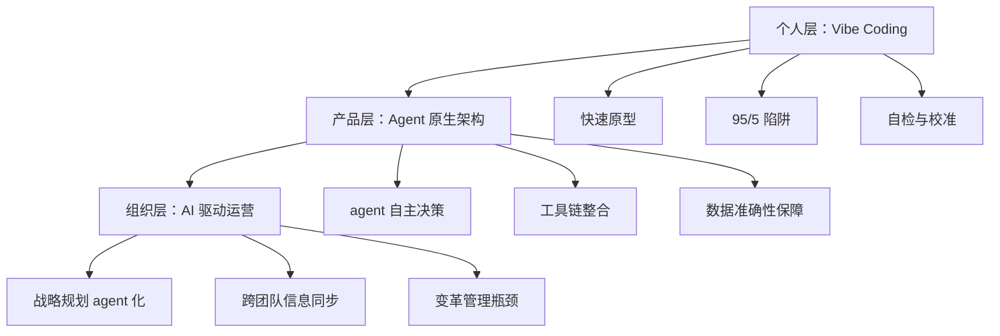

# Vibe Coding 与 Agent 原生组织：一个人 + AI 正在重塑什么

# 一句话导读

AI 让"一个人做一家公司的事"从夸张修辞变成了可验证的现实——但前提是你得理解 vibe coding 的 95/5 陷阱，以及为什么 agent 原生架构比传统架构更接近正确答案。

# 适合谁看

- 正在用 AI 写代码但卡在"最后 5%"反复修 bug 的独立开发者
- 想用 AI agent 优化公司运营但不知道从哪下手的管理者
- 做产品但不确定该把 AI 当"功能"还是当"架构"的产品经理
- 对 AI 原生创业感兴趣、想知道实际体感是什么样的创业者
- 负责推动组织 AI 化但受困于变革阻力的内部推动者

# 读完你会获得什么

- 理解 vibe coding 的真实体验：2 小时到 95%，然后最后 5% 可能永远做不完
- 分清"给产品加 AI 功能"和"做 agent 原生产品"的本质区别
- 掌握用 AI agent 驱动公司战略规划和日常运营的具体路径
- 理解为什么 AI 对高执行力个体的放大效应远大于对组织的
- 获得一套可落地的 AI 工作流：从移动端 Claude Code 到 agent 自检
- 知道变革管理才是 AI 落地最大的瓶颈，而不是技术

---

## 01 背景：为什么这个问题现在值得讨论

2025 年以来，一个现象反复出现：一个人用 AI 在几天内搭出了过去需要一个小团队做几个月的产品原型。但紧接着，另一个现象也反复出现——原型跑通了 95%，最后 5% 的数据准确性、边界情况、可靠性，卡了几周甚至几个月。

这不是个别现象，而是一个结构性矛盾：**AI 极大降低了"做出来"的门槛，但"做对"的门槛并没有降低。**

与此同时，另一个更深层的变化正在发生：AI 不只是在改变"怎么写代码"，它正在改变"怎么运作一家公司"。从战略规划到部门协同，从会议纪要到跨团队信息同步，agent 正在接管过去由中层管理者和运营团队承担的连接工作。

这两件事——个人开发的 95/5 困境和组织运作的 agent 化——看似无关，实际上指向同一个问题：**当 AI 能做大部分执行工作时，剩下不能自动化的部分，决定了你是止步于 demo 还是真正交付价值。**

---

## 02 核心判断：视频真正想讲的不是"AI 能做什么"

这段对话表面上在展示两个 vibe-coded 产品和一个 AI 驱动的公司规划流程，但核心判断是：

**AI 最大的价值不是"替你做事"，而是"消除协调成本"。**

当你把 AI 当工具用，你得到的是效率提升——代码写得快了、文档生成快了。但当你把 AI 当架构用，你得到的是结构变化——原本需要多人协调才能运转的流程，现在一个人就能驱动。

这个判断的推论是：对高执行力个体来说，AI 是"从走路到骑自行车到开直升机"的跃迁；但对组织来说，AI 的价值被变革管理成本严重拖后腿。两边的体验差距正在拉大，而不是缩小。

---

## 03 概念澄清：先把关键名词讲准确

### Vibe Coding

- **它是什么**：用自然语言描述需求，让 AI（如 Claude Code）生成代码，快速搭建可运行的产品原型
- **它解决什么问题**：让非专业开发者或小团队在极短时间内把想法变成可交互的产品
- **它不是什么**：不是"不用管代码质量"，不是"AI 写的代码不需要审查"，更不是"产品已经完成了"
- **它和相关概念的区别**：传统开发是"写代码→调试→交付"，vibe coding 是"描述意图→AI 生成→人工校准最后 5%"
- **一个简单例子**：用 2 小时搭出一个有完整 UI 的公司分析工具，能上传文件、调用 API、生成报告——但报告里的数据可能不准

### Agent 原生架构（Agent-Native Architecture）

- **它是什么**：从设计之初就把 AI agent 作为核心执行者而非辅助工具的产品架构
- **它解决什么问题**：传统架构中 AI 只是"被调用的工具"，agent 原生架构让 AI 能自主判断、搜索、重试、补全——直到任务完成
- **它不是什么**：不是"在产品里加个聊天框"，不是"用 RAG 检索一下文档"
- **它和相关概念的区别**：传统 AI 集成是"人发起请求→AI 响应→人判断"；agent 原生是"人设定目标→agent 自主执行→人审核结果"
- **一个简单例子**：做公司财务分析时，传统架构调一次 API 返回什么就显示什么；agent 原生架构会判断"数据缺失，主动去 web 搜索补全，直到每个字段都有值"

### AI 驱动的组织运营

- **它是什么**：用 AI agent 接管组织中的信息收集、汇总、对齐、反馈等协调性工作
- **它解决什么问题**：组织越大，协调成本越高——agent 能代替大量"人在中间传递信息"的工作
- **它不是什么**：不是"AI 替管理者做决策"，不是"不需要人沟通了"
- **它和相关概念的区别**：传统管理是"人→人→人"的信息链；AI 驱动是"人→agent→所有人"的广播式信息同步
- **一个简单例子**：用 Notion agent 逐个采访各部门负责人，汇总季度复盘，自动对齐公司战略目标，而不是 COO 一个个开 1 对 1 会议

---

## 04 整体框架：从个人到组织的 AI 原生化路径

视频中的内容可以重构为三层递进框架：

**框架解读**：

三层不是独立选择，而是递进关系。个人先用 vibe coding 跑通原型，然后发现传统架构无法解决最后 5% 的问题，转向 agent 原生架构；当 agent 原生思维内化后，自然会延伸到组织运营——如果 agent 能自主完成产品任务，为什么不能自主完成公司运营任务？

每一层都有其核心矛盾：

- **个人层**：速度 vs. 准确性
- **产品层**：自动化 vs. 可控性
- **组织层**：效率 vs. 变革成本

---

## 05 关键机制：三个核心机制拆解

### 机制一：Vibe Coding 的 95/5 循环

- **输入**：自然语言描述的产品意图
- **中间处理**：AI（Claude Code 等）根据意图生成代码，快速迭代 UI 和基础功能
- **输出**：一个看起来完整、交互可用、但数据层可能不准的产品原型
- **为什么要这样设计**：用最低成本验证"这个方向值不值得做"
- **带来了什么代价**：最后 5%——数据准确性、边界情况、可靠性——可能需要比前 95% 多十倍的时间
- **适合/不适合什么场景**：适合早期验证和内部工具；不适合直接面向客户的金融/医疗等高准确性要求场景

视频中说话人的原话精准概括了这个体验："The most infuriating thing about vibe coding is that you can really 95% of the way there in like two hours, and then the final five it just goes on forever."

### 机制二：Agent 原生架构的自驱闭环

- **输入**：用户设定的目标（如"分析这家公司的财务状况"）
- **中间处理**：agent 判断需要哪些信息→调用搜索 API→发现数据缺失→继续搜索→交叉验证→填充所有字段→生成报告
- **输出**：一个信息尽可能完整的分析结果
- **为什么要这样设计**：传统架构中，AI 只回答"你问的"，不回答"你没问但需要的"；agent 原生架构让 AI 主动补全
- **带来了什么代价**：执行时间更长、API 调用成本更高、需要更完善的错误处理和日志
- **适合/不适合什么场景**：适合信息整合类任务（研究、分析、报告）；不适合需要确定性输出的计算任务

视频中的建议是：安装 Compound Engineering 插件让 agent 自检，"让它测试自己，一直运行直到通过"。这本质上就是把"人工校准最后 5%"变成"agent 自己校准自己"。

### 机制三：AI 驱动的组织信息流

- **输入**：公司战略目标 + 各部门负责人的输入（访谈、文档、会议记录）
- **中间处理**：agent 逐个采访部门→汇总信息→对齐战略目标→追问假设→检查矛盾→生成部门计划和公司级对齐文档
- **输出**：全员对齐的季度计划，每个部门都能看到自己的工作如何关联公司目标
- **为什么要这样设计**：过去这需要 COO 或 HR 团队花大量时间做 1 对 1 访谈和汇总，现在 agent 可以并行处理
- **带来了什么代价**：信息质量取决于输入质量；agent 可能遗漏非正式沟通中的隐含信息；团队需要建立"默认记录"的文化
- **适合/不适合什么场景**：适合战略对齐、季度规划、全员信息同步；不适合需要深度情感判断的 1 对 1 辅导

---

## 06 方法拆解：如果自己要做，应该怎么落地

### 步骤一：用 Vibe Coding 快速验证想法

**目标**：在 2-4 小时内得到一个可交互的原型，判断方向是否值得继续投入。

**具体动作**：
1. 用 Claude Code 或同类工具，用自然语言描述你要做的产品
2. 专注于核心用户流程，不要在 UI 细节上纠结
3. 跑通主流程后立即停止，不要追求完美

**判断标准**：原型能让一个没见过的用户理解产品在做什么吗？如果能，方向成立。

**常见坑**：在原型阶段就过度打磨 UI，导致把时间花在装饰而非验证上。

**产出物**：一个可运行、可交互的产品 demo。

### 步骤二：识别并解决 95/5 陷阱

**目标**：判断最后 5% 的卡点在哪里，决定是手动修、让 agent 自检、还是重构架构。

**具体动作**：
1. 列出原型中所有"数据不准"或"功能断裂"的地方
2. 分类：哪些是 API 数据源问题？哪些是 agent 不会主动搜索？哪些是逻辑边界？
3. 针对数据源问题：接入更可靠的 API（如用 Ample/Plaid 拉金融数据替代通用搜索）
4. 针对 agent 行为问题：添加自检机制，让 agent "测试自己直到通过"
5. 针对逻辑边界：在初始 prompt 中设定更严格的 guardrails 和日志

**判断标准**：关键路径上的数据是否可靠到可以对外展示？

**常见坑**：用"让它再跑一次"代替"找到根本原因"。反复重试而不诊断，是 95/5 陷阱的典型表现。

**产出物**：一份问题清单 + 对应解决方案，明确哪些值得修、哪些应该接受为当前限制。

### 步骤三：向 Agent 原生架构迁移

**目标**：让产品从"人触发→AI 响应"变成"人设定目标→agent 自主执行"。

**具体动作**：
1. 识别产品中所有"需要人工判断下一步"的环节
2. 为 agent 添加工具：web 搜索、API 调用、数据验证、自检循环
3. 设定 guardrails：agent 最多重试几次、什么情况下停下来问人、日志记录什么
4. 用 Compound Engineering 的 agent-native review 评估架构是否达标

**判断标准**：用户设定目标后，agent 能否在不需要人工干预的情况下填充所有必要信息？

**常见坑**：把 agent 原生理解成"让 AI 自由发挥"，没有设定边界和验证机制。

**产出物**：重构后的产品架构，agent 能自主完成核心任务。

### 步骤四：把 Agent 思维延伸到组织运营

**目标**：用 agent 替代组织中的协调性工作，降低内部沟通成本。

**具体动作**：
1. 选一个高痛点的协调场景（如季度规划、全员信息同步、会议纪要分发）
2. 用现有工具（Notion agent、Claude 等）搭建 agent 流程
3. 让 agent 逐个采访/收集信息，汇总后对齐公司目标
4. 建立"默认记录"文化：会议默认录音/转写，重要讨论默认留痕

**判断标准**：过去需要 3-5 次 1 对 1 会议才能完成的信息对齐，现在 agent 能否在一个流程中完成？

**常见坑**：在没有建立"默认记录"文化的情况下部署 agent——agent 的输出质量取决于输入质量，如果团队不习惯记录，agent 只能拿到碎片信息。

**产出物**：一个可复用的 agent 驱动运营流程 + 团队对"默认记录"的共识。

---

## 07 案例讲解：从 deal analysis app 到组织 agent 化

### 场景背景

说话人是一家 AI 媒体/工具公司的创始人，团队约 20 人。他同时在做两件事：用 vibe coding 搭建金融分析产品，用 AI agent 优化公司运营。

### 遇到的问题

**产品层面**：他用 AI 快速搭出了一个公司分析工具，能上传文件、调用 API、生成报告——但数据经常不准，财务信息缺失，估值无法计算。UI 很漂亮，但核心功能不可靠。

**组织层面**：20 人团队做 2026 年规划，过去需要 COO 逐个与部门负责人开会，汇总信息，对齐目标，耗时数周。

### 按框架如何处理

**产品**：他不打算在传统架构上继续修修补补。计划是先导出 PDF，让 Claude 逐条 fact-check，然后根据 fact-check 结果反向工程正确的 API 调用方式。更长远的方向是转向 agent 原生架构——让 agent 自己判断"数据不够，我去搜索"，而不是等人输入。

**组织**：COO 用 Notion agent 逐个采访各部门负责人，了解上季度表现和下季度计划，自动对齐公司战略目标。agent 会追问假设、检查矛盾。最终每个部门都有一份对齐了公司方向的计划，而 COO 不需要开 20 场 1 对 1。

### 每步怎么做

1. **设定目标**：公司 2026 战略是"成为你唯一需要的 AI 订阅"
2. **agent 采集**：Notion agent 采访每个部门，收集信息和计划
3. **agent 对齐**：agent 检查每个部门计划是否与公司战略一致，追问不一致的地方
4. **人工审核**：COO 和创始人审核 agent 输出，补充 agent 遗漏的隐含信息
5. **全员同步**：对齐后的计划文档作为全年的执行基准

### 最终结果

产品仍在迭代中，但方向已经从"修 bug"转向"重构架构"。

组织运营已经见效——20 人公司的年度规划从"COO 花几周逐个对齐"变成"agent 并行采集 + 人工审核"。

### 说明了什么

**vibe coding 解决的是"做出来"的问题，agent 原生架构解决的是"做对"的问题，AI 驱动运营解决的是"做快"的问题。** 三者是递进关系，不是替代关系。

---

## 08 常见误区

**误区一：Vibe Coding = 产品已经完成**

- **错误理解**：AI 能在 2 小时内搭出产品，所以产品已经做完了
- **为什么错**：95% 的完成度是可见部分（UI、交互流程），5% 的未完成是决定产品是否可用的部分（数据准确性、边界情况、可靠性）
- **正确理解**：Vibe coding 产出的是原型，不是产品。原型验证方向，产品交付价值
- **应该怎么做**：把 vibe coding 当作"快速验证"阶段，而不是"开发完成"阶段

**误区二：在产品里加个聊天框就是 agent 原生**

- **错误理解**：给产品加一个 AI 对话界面，就叫 agent 原生
- **为什么错**：聊天框是"人问 AI 答"，agent 原生是"人设目标 AI 自主执行"。前者是工具集成，后者是架构设计
- **正确理解**：Agent 原生的核心特征是 AI 能自主判断、搜索、重试、补全
- **应该怎么做**：检查你的产品中，AI 是"被动响应"还是"主动执行"

**误区三：AI 会自动把组织变高效**

- **错误理解**：引入 AI 工具后，团队自然会变高效
- **为什么错**：AI 的组织价值取决于信息输入质量。如果团队没有"默认记录"的习惯，agent 拿不到足够的输入
- **正确理解**：AI 是放大器，不是转换器。它放大已有的好习惯，也放大已有的坏习惯
- **应该怎么做**：先建立"默认记录"文化，再部署 agent 流程

**误区四：Agent 能完全替代人与人之间的沟通**

- **错误理解**：有了 agent，就不需要人与人之间直接沟通了
- **为什么错**：agent 能处理信息传递和逻辑对齐，但无法处理情感、信任、隐含语境
- **正确理解**：Agent 替代的是"信息搬运"型沟通，不是"关系维护"型沟通
- **应该怎么做**：把 1 对 1 会议中"传递信息"的部分交给 agent，把"建立信任"的部分留给人

**误区五：Vibe Coding 的最后 5% 靠"再跑一次"就能解决**

- **错误理解**：数据不准是因为 AI 偶尔出错，多试几次就好了
- **为什么错**：最后 5% 的问题通常是结构性的——数据源不可靠、agent 不会主动搜索、边界条件未定义。重试不能解决结构性问题
- **正确理解**：最后 5% 需要诊断根本原因，然后针对性修复
- **应该怎么做**：先分类问题（数据源？agent 行为？逻辑边界？），再对应解决

**误区六：大组织的 AI 化只是"引入工具"的问题**

- **错误理解**：给团队配 AI 工具，组织就会 AI 化
- **为什么错**：大组织的 AI 化最大障碍是变革管理——不同管理者的 AI 采纳度差异巨大
- **正确理解**：技术部署是容易的部分，让人改变工作方式才是难的
- **应该怎么做**：对关键管理者做 1 对 1 沟通，用具体场景展示价值，而不是空谈趋势

**误区七：移动端 Claude Code 体验已经够好**

- **错误理解**：在手机上用 Claude Code 和在电脑上一样方便
- **为什么错**：移动端需要保持 app 开启、不能直接在主分支工作、合并流程繁琐
- **正确理解**：移动端适合"快速发起任务"，不适合"深度开发"。正确用法是手机上开分支提需求，电脑上合并审核
- **应该怎么做**：用 Happy Cloud 同步会话、用 Cloud Island 追踪进度、在手机上开分支，在电脑上合并

---

## 09 实战清单：读完后可以马上照着做

### 立即能做

1. **列出你当前产品/项目的 95/5 清单**：哪些部分已经跑通？哪些是卡住的地方？分类标记是数据问题、架构问题还是逻辑问题
2. **检查你的 AI 集成是"工具型"还是"agent 型"**：AI 是被动响应还是主动执行？如果是被动响应，选一个环节尝试改成 agent 自主执行
3. **给 vibe-coded 产品加自检机制**：让 AI 生成结果后自动 fact-check，而不是等用户发现错误
4. **建立"默认记录"习惯**：从今天起，会议默认录音/转写，重要讨论默认留文档痕迹

### 一周内能做

1. **选一个高痛点协调场景，用 agent 流程替代**：如每周团队同步、项目进度汇总、跨部门信息对齐
2. **为你的产品添加 agent 工具链**：web 搜索 API、数据验证、自检循环——让 agent 能"自己补全缺失信息"
3. **用 Claude Code 做一次"agent native review"**：评估现有产品架构，找出哪些环节应该从"人触发"变成"agent 自主"
4. **搭建移动端→电脑端的工作流**：手机上用 Claude Code 开分支提需求，电脑上合并审核，形成"随时发起、定点收口"的节奏

### 长期要沉淀

1. **积累 agent 的 guardrails 库**：每个场景下 agent 的重试上限、停止条件、日志标准——这些是可复用的组织资产
2. **建立 agent 输出质量的可观测性**：agent 的 fact-check 通过率、数据补全率、人工干预率——用数据衡量 agent 原生架构的成熟度
3. **在组织中推广"agent-first"思维**：不是"人做不了才交给 AI"，而是"AI 能做就交给 AI，人只做判断和审核"
4. **持续追踪 AI 工具链的演进**：Compound Engineering、Happy Cloud、Cloud Island、Atlas——工具链在快速迭代，保持更新
5. **记录变革管理案例**：哪些人接受 AI 最快？什么场景最有说服力？这些经验在推广时比任何技术文档都有用

---

## 10 总结

Vibe coding 打开了"一个人做产品"的可能性，但它也暴露了一个结构性矛盾：AI 能让你快速到达 95%，但最后 5% 的可靠性问题，靠"再试一次"解决不了。这个问题的正确答案不是更耐心地修 bug，而是从架构层面重新思考——让 agent 从被动工具变成自主执行者。

这个思维转变的适用范围远不止产品开发。当 agent 能自主完成信息采集、对齐、汇总时，组织运作的方式也在改变。20 人公司的年度规划可以从"COO 逐个开会"变成"agent 并行采集 + 人工审核"。但这一切的前提是团队有"默认记录"的文化——agent 的输出质量取决于输入质量。

更深层的问题是变革管理。AI 对高执行力个体的放大效应是立竿见影的——"从走路到骑自行车到开直升机"。但对组织来说，AI 化的最大障碍从来不是技术，而是人。不同管理者的 AI 采纳度差异巨大，而传统组织的惯性让转向变得"像把果冻钉在墙上"。

**AI 正在把"个人能力"和"组织能力"的差距拉得前所未有的开。理解这个差距，并选择站在哪一边，是现在最值得认真思考的事。**
