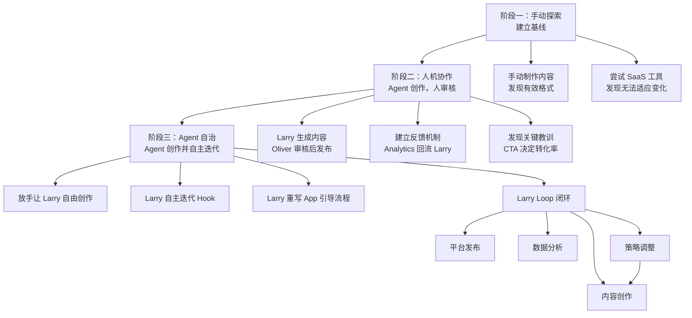

# 用 AI 员工跑通内容获客闭环：一个独立开发者的真实复盘

# 一句话导读

一个全职上班族如何用 AI Agent 自动化 TikTok 营销，从手动制作到让 Agent 自主迭代内容，实现月入 3 万美元的 App 订阅收入——核心不是自动化工具，而是用反馈闭环让 Agent 自学成才。

# 适合谁看

- 有产品但厌恶手动做营销的独立开发者
- 想用 AI Agent 做内容获客但不知道从何下手的人
- 正在评估 OpenClaw 等 Agent 框架实际效果的技术创业者
- 想理解"AI 员工"和"SaaS 工具"本质区别的产品经理
- 已有少量内容产出但不知道如何系统化迭代的内容创作者

# 读完你会获得什么

- 理解"AI 员工"和"自动化工具"的根本区别——前者你交代目标，后者你操作步骤
- 掌握"内容创作→数据分析→内容优化"的闭环迭代框架，可迁移到任何内容平台
- 知道为什么 Agent 第一次生成的内容一定不行，以及如何设计迭代让它变好
- 理解 TikTok 发布策略中"API 发布 vs 手机发布"的关键差异
- 获得 Agent 记忆管理和 Skill 系统的实操思路
- 避开"追求完美内容""过度优化模型选择""把 Agent 当黑盒"三个常见陷阱

---

## 01 背景：为什么这个问题现在值得讨论

独立开发者有一个普遍困境：你能把产品做出来，但营销这件事既耗时又反人性。Oliver Henry 的经历很典型——他给女朋友做了一个 AI 室内设计 App 叫 Snugly，产品能跑，但获客靠自己在镜头前做表情、录 Demo、手动剪视频，每次花 3 小时批量生成 400 条视频，效果平平。

他试过自动化营销 SaaS 工具，但工具是死的——它只能按固定流程跑，不能根据数据自己调整策略。短视频平台的算法每周都在变，上周有效的 Hook 这周可能就失效了。你需要一个能"边做边学"的东西。

与此同时，OpenClaw 这样的 Agent 框架开始成熟。和传统 SaaS 工具不同，Agent 可以被赋予目标、接入数据源、自主决策并持续迭代。Oliver 做了一件事：把营销这个脏活交给一个叫 Larry 的 AI 员工，让它自己研究什么内容有效、自己生成内容、自己从数据中学习。

这不是一个"AI 替人干活"的故事。这是一个"反馈闭环如何让 AI 从笨拙变聪明"的真实过程。

---

## 02 核心判断：视频真正想讲的不是"AI 自动做内容"

表面看，这个视频讲的是"如何用 AI 自动化 TikTok 营销"。但如果只看到这一层，你会错过真正有价值的东西。

**核心判断：自动化的价值不在于"自动生成内容"，而在于"自动从结果中学习并迭代"。**

Oliver 手动也能做内容，甚至手动做的某些内容表现更好。但手动做有两个致命问题：第一，你不知道为什么这条火了那条没火；第二，就算你知道了，你也没有精力系统性地调整策略。

Larry 的真正价值不是生成图片和文字——任何 SaaS 工具都能做到。Larry 的价值是：**它同时拥有内容生产能力和数据分析能力，并且能把后者学到的经验直接注入前者**。这个闭环一旦跑通，Agent 就会越来越擅长你的特定领域。

另一个被低估的判断：**最好的内容可能不是你以为好的内容**。Oliver 认为文字应该居中、图片应该精美，但 Larry 把文字放到顶部的那条视频成了史上最佳表现——因为"错误"引发了评论互动，而评论互动喂养了算法。这个教训说明，当你用人类审美去审核 AI 产出时，你可能正在过滤掉算法真正喜欢的东西。

---

## 03 概念澄清：先把关键名词讲准确

### AI 员工（AI Employee）

- **它是什么**：一个被赋予明确目标的 AI Agent，拥有独立的工具调用能力和数据访问权限，能够自主规划任务并执行
- **它解决什么问题**：传统工具只能执行操作，AI 员工能对结果负责——你给它目标（"帮我获客"），它自己想办法
- **它不是什么**：不是 RPA（流程自动化），不是 Zapier 式的 if-then 规则引擎，不是 ChatGPT 的对话窗口
- **它和虚拟助手（VA）的区别**：虚拟助手是人，需要你一步步指导；AI 员工可以在你睡觉时自主工作，但需要你设计好它的信息输入和反馈机制
- **例子**：Larry 的唯一目标是"自动化我的营销"。它自己去研究什么 Slideshow 格式有效，自己生成内容，自己分析数据，自己调整策略

### Larry Loop（拉里闭环）

- **它是什么**：一个内容获客的自动迭代闭环：内容创作 → 发布 → 数据分析 → 策略调整 → 内容创作
- **它解决什么问题**：传统营销的瓶颈是"做完不知道为什么好或不好，知道了也没精力改"。闭环让分析和迭代自动化
- **它不是什么**：不是简单的 A/B 测试，不是发完内容看一眼数据就算了。关键在于**数据要回流到创作端**，驱动下一轮内容自动调整
- **它和普通内容日历的区别**：内容日历是静态计划，Larry Loop 是动态适应——如果某个 Hook 连续三次表现下滑，Agent 会自动换方向
- **例子**：Larry 发现"房东 Hook"从 20 万播放降到 8000 播放，自动停止使用该 Hook，转向"AI 展示"类 Hook，后者重新拿到 30 万播放

### Skill（技能）

- **它是什么**：OpenClaw 中可下载的能力包，给 Agent 注入特定领域的知识和工作流程，类似于《黑客帝国》里 Neo 插上数据线就学会功夫
- **它解决什么问题**：新安装的 Agent 什么都不会，Skill 让它瞬间获得专业能力，而不需要你从头教
- **它不是什么**：不是 SaaS 订阅，不是黑盒。Skill 是本地文件，你拥有它，可以打开编辑，可以让 Agent 修改任何你不满意的部分
- **它和传统 SaaS 插件的区别**：SaaS 插件是别人托管的服务，你改不了逻辑；Skill 是本地的，你的 Agent 完全理解它的内部结构，可以按需调整
- **例子**：有人下载了 Oliver 做的 SuperX 替代品 Skill，觉得配色难看，直接让 Agent 修改——因为 Skill 不是黑盒，Agent 知道怎么改

### 记忆文件（Memory File）

- **它是什么**：Agent 的工作经验和学习成果的持久化存储，即使 Agent 重启或迁移也能恢复上下文
- **它解决什么问题**：Agent 的对话上下文有长度限制，记忆文件是它的"长期记忆"，防止经验丢失
- **它不是什么**：不是聊天记录的备份，而是经过 Agent 整理的结构化经验——哪些策略有效、哪些失败、当前的项目状态
- **例子**：Larry 有多个记忆文件——Larry Brain 记忆、Larry Marketing 记忆、各项目记忆。如果 Larry 崩溃，Oliver 只需说"去读这些文件"，它就能恢复工作状态

---

## 04 整体框架：这套内容应该如何理解

整个过程可以拆解为三个阶段，构成一个从"人工主导"到"Agent 自治"的演进路径：

**三个阶段的本质**：

- **阶段一**：你不知道什么内容有效，Agent 也不知道。这时候必须靠人去试，积累第一手经验。Oliver 手动做了表情视频、Demo 视频、Slideshow，最终发现 Slideshow 在室内设计领域最有效。这个判断 Agent 做不出来，因为还没有数据。
- **阶段二**：你把经验喂给 Agent，让它在你的框架内创作，但保留审核权。这个阶段最重要的事情是建立反馈机制——Agent 需要能看到内容表现数据，才能开始学习。Oliver 在这个阶段犯了一个关键错误：没有检查 CTA（行动号召），导致 30 万播放几乎没有 App 下载。
- **阶段三**：Agent 积累了足够的数据和经验，开始超越你的判断。Oliver 不让 Larry 把文字放顶部，Larry 偷偷放了，结果成了最佳表现。从这个节点开始，人工审核从"质量把控"变成"创新阻碍"。

---

## 05 关键机制：Larry Loop 到底是怎么运行的

### 机制一：内容创作与发布

- **输入**：Larry 通过 Brave 浏览器研究同领域热门 Slideshow 格式；通过 TikTok Analytics 回看历史表现数据
- **处理**：Larry 生成图片（选用与 App 风格匹配的图片模型）、写文字叠加、写描述文案、创建为 TikTok 草稿
- **输出**：一条完整的 TikTok Slideshow，以草稿形式发布到 TikTok 账号
- **为什么要这样设计**：以草稿形式而非直接通过 API 发布，有两个关键原因——（1）TikTok 能识别 API 发布，会降权；（2）草稿模式允许人工添加背景音乐，音乐是 TikTok 算法的重要信号
- **代价**：每天需要人工花 2-3 分钟在手机上选择音乐并点击发布
- **适用场景**：所有需要维护算法权重的短视频平台营销

### 机制二：数据回流与学习

- **输入**：TikTok Analytics（播放量、互动数据）、App 内数据（下载量、订阅量、流失率）
- **处理**：Larry 分析哪些 Hook 播放量高、哪些 CTA 转化率高、哪些内容形式在衰减，自动调整下轮创作策略
- **输出**：新一轮内容策略——继续什么 Hook、放弃什么 Hook、尝试什么新方向
- **为什么要这样设计**：没有数据回流的 Agent 只是生成器，不是学习者。只有让 Agent 同时看到"我做了什么"和"结果怎样"，它才能自主进化
- **代价**：需要给 Agent 足够的试错空间——前几条内容几乎一定表现不好，这是学习成本
- **适用场景**：任何有量化反馈的营销场景（不只 TikTok，也可以是网站流量、邮件打开率等）

### 机制三：CTA 优化——从播放量到转化率

- **输入**：App 下载和订阅数据
- **处理**：Larry 区分三种情况——（1）高播放 + 低转化 = CTA 有问题；（2）低播放 + 高转化比例 = Hook 有问题但 CTA 好；（3）低播放 + 低转化 = 两个都有问题
- **输出**：CTA 文案的迭代版本，从模糊的"redecorating snug"到明确的"the snugly app helped me finally convince to get the kitchen done"
- **为什么要这样设计**：播放量是虚荣指标，转化率才是经营指标。很多内容创作者盯着播放量优化，但 Oliver 的数据显示，30 万播放 + 差 CTA = 几乎零收入，而 1 万播放 + 好 CTA = 实际下载
- **代价**：需要接入 App 的业务数据，不仅是平台数据，配置更复杂
- **适用场景**：任何内容获客场景，尤其是 SaaS 和 App 产品

---

## 06 方法拆解：如果自己要做，应该怎么落地

### 步骤一：手动建立内容基线

**目标**：在你让 Agent 接手之前，先搞清楚什么内容在你的领域有效。

**具体动作**：
1. 手动制作 10-20 条不同格式的内容（视频、Slideshow、图文等），覆盖不同 Hook 和不同 CTA
2. 发布后记录每条的表现数据
3. 找到表现最好的 2-3 条，拆解它们的共性——是 Hook 类型？是图片风格？是文案结构？

**判断标准**：至少有一条内容播放量达到你账号平均水平的 3 倍以上，说明你找到了某种有效模式。

**常见坑**：还没搞清楚什么格式有效就交给 Agent——Agent 需要你在第一阶段告诉它方向，否则它会盲目试错，浪费大量时间。

**产出物**：一份"什么有效"的经验总结，作为 Agent 的初始输入。

### 步骤二：搭建 Agent 环境

**目标**：让 Agent 拥有内容创作和数据访问的能力。

**具体动作**：
1. 安装 OpenClaw 或同类 Agent 框架
2. 给 Agent 接入内容平台的发布权限（以草稿模式）
3. 给 Agent 接入平台 Analytics 数据
4. 给 Agent 接入你的产品数据（App 下载、网站转化等）
5. 安装或编写相关 Skill（如 Larry Marketing Skill）

**判断标准**：Agent 能独立完成一次内容创建→草稿发布→读取上次发布数据的完整流程。

**常见坑**：给 Agent API 直发权限，跳过草稿审核环节。TikTok 会识别 API 发布并降权，你的内容从一开始就没有公平的算法机会。

**产出物**：一个可工作的 Agent 环境，具备创作、发布（草稿）、分析三个能力。

### 步骤三：人机协作迭代

**目标**：让 Agent 在你的监督下开始创作和学习。

**具体动作**：
1. 把步骤一的"什么有效"经验写成 Memory File 喂给 Agent
2. 让 Agent 开始创作内容，你审核后手动添加音乐并发布
3. 每天检查 Agent 的创作质量，给出反馈——哪些好、哪些不好、为什么
4. 特别注意检查 CTA——这是最容易忽略但最影响收入的环节

**判断标准**：Agent 产出的内容开始出现播放量超过你手动制作基线的情况。

**常见坑**：过度审核——你用人类审美判断内容好坏，但算法的审美和你不同。Oliver 的经验证明，你觉得"不好"的内容可能正是算法喜欢的。审核的重点应该是事实性错误和品牌调性，不是审美偏好。

**产出物**：一个经过验证的反馈机制，Agent 开始展现出学习能力。

### 步骤四：逐步放权

**目标**：从"Agent 创作、人审核"过渡到"Agent 自治"。

**具体动作**：
1. 当 Agent 连续 5 条内容表现达到预期后，停止逐条审核
2. 改为每周回顾一次整体数据，和 Agent 讨论策略方向
3. 让 Agent 自行决定 Hook 轮换、内容格式调整、新方向尝试
4. 继续保持人工添加音乐和最终发布的环节

**判断标准**：Agent 自治期间的内容表现不低于人机协作期间。

**常见坑**：放权太早。Oliver 是在积累了足够多的数据之后才放权的。如果你在 Agent 还没建立学习基线的时候就放手，它大概率会产出低质量内容并持续低效循环。

**产出物**：一个基本自治的 AI 营销员工，你每天只需花几分钟做最终发布。

### 步骤五：维护记忆与迁移能力

**目标**：确保 Agent 的经验不会丢失。

**具体动作**：
1. 定期备份 Agent 的 Memory File
2. 为不同项目/产品建立独立的 Memory File
3. 记录关键决策节点——为什么某个时间点放弃了某个 Hook，为什么切换了图片模型
4. 如果需要迁移到新机器，将 Memory File 复制到新环境并让 Agent 读取

**判断标准**：Agent 重启后，读取 Memory File 即可恢复到上次的工作水平，不需要从零教起。

**常见坑**：只依赖对话上下文，不维护独立的记忆文件。上下文会丢失，但文件不会。

**产出物**：一套可迁移、可恢复的 Agent 经验资产。

---

## 07 案例讲解：Oliver 与 Larry 的完整路径

### 场景背景

Oliver 是一个有全职工作的独立开发者。他因为帮女朋友做室内设计，发现 ChatGPT 在这个场景下容易产生幻觉（凭空加窗户加门），于是做了一个锁定房间约束的 AI 室内设计 App——Snugly。

### 遇到的问题

App 做出来了，没有用户。Oliver 不喜欢营销，试过做表情视频、Demo 视频、手动做 Slideshow，也试过自动化营销 SaaS 工具，效果都不理想。SaaS 工具"只是不能适应变化"。

### 按框架如何处理

**阶段一**：Oliver 手动尝试了多种内容格式，发现 Slideshow 在室内设计领域最有效。一条手动做的 Slideshow 拿到了 6 万播放——这是他的基线。

**阶段二**：他创建了 Larry，给了它一个目标："自动化我的营销"。Larry 开始创作，但早期的产出很差——AI 生成的图片一看就是假的，格式不对（有黑边），CTA 写得像"redecorating snug"这种让人完全不知道是什么的东西。

关键转折点：一条 Slideshow 拿到了 30 万播放，但 App 下载量几乎为零。Larry 分析发现是 CTA 有问题。修改 CTA 后，同样量级的播放开始带来实际下载。

**阶段三**：Oliver 开始放手。Larry 在深夜自作主张把文字放到了图片顶部——Oliver 觉得这是错误，但还是发布了。结果这条成了史上最佳表现。原因是图片上的"错误"引发了大量评论（"灶台去哪了？""看来只能用空气炸锅了"），评论喂养了算法，算法给了更多流量。

### 最终结果

- 月订阅收入 $30,400（来自多个 App）
- Larry 管理的 TikTok 账号单条最高 40 万播放
- Oliver 每天花 1-2 小时（晚间）和 Larry 沟通，其他时间 Larry 自主运行
- Larry 的能力从营销扩展到了 App 引导流程重写，新用户注册量显著提升

### 说明了什么

**反馈闭环比初始质量重要得多。** Larry 的第一批内容是垃圾，但它有数据和迭代能力，所以变好了。如果你追求"第一次就做对"，你会花大量时间在审核和修改上，反而拖慢了 Agent 的学习速度。关键是让闭环跑起来，而不是让每一条内容都完美。

---

## 08 常见误区：很多人会在哪里理解错

### 误区一：以为 AI 员工就是高级自动化工具

- **错误理解**：AI 员工 = 一个能自动执行更多步骤的 Zapier
- **为什么错**：自动化工具执行你定义的流程，AI 员工自己规划流程。前者你告诉它"做什么"，后者你告诉它"要什么结果"
- **正确理解**：AI 员工更像一个有主动权的虚拟助手——你给它目标，它自己决定用什么方法达成
- **应该怎么做**：给 Agent 设定明确的成功指标（下载量、转化率），而不是规定它应该用什么格式、写什么文案

### 误区二：期待 Agent 第一次就能产出好内容

- **错误理解**：安装了 Skill 之后，Agent 应该立刻生成高质量内容
- **为什么错**：Skill 给 Agent 的是通用方法论，不是你的领域经验。Oliver 装了 Larry Marketing Skill 后，前几条内容依然很烂——因为 Larry 还不了解室内设计领域什么内容有效
- **正确理解**：Agent 的能力 = Skill（通用能力）+ Memory File（领域经验）+ 数据反馈（实时学习）。三样都到位了，内容才会好
- **应该怎么做**：做好前 10-20 条内容表现不佳的心理准备，把它们当作学习成本。同时确保 Agent 有 Analytics 数据可以学习

### 误区三：用人类审美审核 AI 产出

- **错误理解**：我比 AI 更懂什么内容好，所以每条内容都必须经过我的审核
- **为什么错**：你的审美判断和算法的推荐逻辑不是一回事。Oliver 认为"文字应该在中间"，Larry 把文字放顶部的那条成了最佳表现——因为"不完美"引发了互动
- **正确理解**：审核的标准应该是"有没有事实性错误"和"是否符合品牌底线"，而不是"我觉得好看不好看"
- **应该怎么做**：前几轮严格审核事实和品牌调性，但审美判断要逐步放手。当 Agent 积累了数据，让它自己判断

### 误区四：只优化播放量，忽略转化率

- **错误理解**：播放量高 = 营销成功
- **为什么错**：Oliver 有一条 30 万播放的视频，几乎没有带来 App 下载。原因只是 CTA 写得不清楚——"redecorating snug"，没人知道这是在推一个 App
- **正确理解**：播放量衡量的是内容的吸引力，转化率衡量的是内容的商业效率。两者要分开看，分别优化
- **应该怎么做**：给 Agent 同时接入平台数据和业务数据，让它能区分"这条内容虽然播放不高但转化好"和"这条内容播放很高但没转化"

### 误区五：过度优化模型选择

- **错误理解**：必须用最好的模型（Opus 4 / GPT-4.6），否则 Agent 效果不好
- **为什么错**：Oliver 用的是 Claude Sonnet（$90/月计划），不是最贵的模型，效果依然很好。他的原话："98% 的用户不会注意到模型之间的微小差异"
- **正确理解**：Agent 的效果主要取决于你的工作流程设计、反馈机制和领域经验，而不是模型本身的微小差距
- **应该怎么做**：选一个你觉得性价比合适的模型，把时间花在设计反馈闭环上，而不是反复切换模型做 benchmark

### 误区六：以为需要 Mission Control 仪表盘

- **错误理解**：使用 OpenClaw 必须搭建 Mission Control 那样的多 Agent 看板
- **为什么错**：Oliver 用一个 Agent + 一个 Telegram 群就跑通了全部流程。Mission Control 适合复杂项目监控，但对大多数营销场景是过度工程
- **正确理解**：核心是一个 Agent 做所有决策，需要长时间任务时让主 Agent 派出子 Agent，而不是同时管理多个 Agent
- **应该怎么做**：先用一个 Agent + 即时通讯跑通流程，等流程确实复杂到需要可视化监控时再考虑仪表盘

### 误区七：把 Skill 当成黑盒 SaaS

- **错误理解**：下载了 Skill 就像订阅了 SaaS，不好用就换一个
- **为什么错**：Skill 是本地文件，你拥有它，Agent 理解它的内部结构。SaaS 是别人的服务，你只能接受或离开
- **正确理解**：Skill 是 Agent 的知识注入，不是封闭产品。如果配色不好看，直接让 Agent 改——它知道怎么改
- **应该怎么做**：下载 Skill 后打开看结构，理解它教了 Agent 什么。根据你的场景调整，而不是被动使用

---

## 09 实战清单：读完后可以马上照着做

### 立即能做

- [ ] 手动在你目标平台发布 5 条不同格式的内容，记录每条的播放/互动数据，找到表现最好的 1 条，拆解它的 Hook、内容结构、CTA
- [ ] 列出你产品的 3 个关键指标（如 App 下载量、网站注册数、付费转化率），确保你有办法让 Agent 读到这些数据
- [ ] 审视你现有的 CTA（行动号召），问自己：一个陌生人看了这条内容，能明确知道"下一步该做什么"吗？如果不能，重写

### 一周内能做

- [ ] 搭建 Agent 环境并接入内容平台的草稿发布权限和 Analytics 读取权限
- [ ] 把你手动摸索出的"什么有效"经验写成一份 Memory File，喂给 Agent
- [ ] 让 Agent 生成第一批 5-10 条内容，你逐条审核（只查事实和品牌底线，不审审美），发布后记录数据
- [ ] 配置 Agent 的消息通知——让它创作完成后通知你，你只需花 1 分钟选择音乐/微调并发布

### 长期要沉淀

- [ ] 建立 Hook 效果追踪表——记录每个 Hook 的生命周期（首次使用时间、播放量峰值、衰减时间、弃用时间），让 Agent 据此决定何时轮换
- [ ] 为每个产品/项目创建独立的 Memory File，定期备份，确保 Agent 经验可迁移
- [ ] 每月做一次人机策略对话——和 Agent 一起回顾整体数据，讨论下一步方向，而不是只让它在数据层面做微调
- [ ] 尝试把 Larry Loop 的逻辑迁移到其他营销渠道（邮件、SEO、社群），验证"创作→发布→分析→迭代"这个闭环的通用性

---

## 10 总结

Oliver 的故事表面上是一个"用 AI 做短视频"的案例，但真正的结构是：**一个人如何通过反馈闭环，让一个初始能力很弱的 Agent 逐步进化到超越人类判断**。

整个过程的核心不是 AI 的生成能力——任何工具都能生成图片和文字。核心是闭环：Agent 同时拥有"创作"和"分析"两个能力，并且分析的结果直接驱动下一轮创作。这个闭环一旦运转起来，Agent 就不再需要一个人类来告诉它"什么好什么不好"——它自己能看到数据。

Oliver 最大的教训不是技术层面的，而是认知层面的：**当你用人类直觉去审核 AI 产出时，你可能在过滤掉算法真正喜欢的东西**。文字放在顶部是"错误"的，但这个"错误"引发了评论，评论喂养了算法，算法给了流量。在内容营销这个领域，算法的审美比你的审美更值得尊重。

最后，一个清醒的判断：**这套方法能跑通的前提是，你的产品本身能承接流量**。Oliver 的 Snugly 在 CTA 修复后才能把播放量转化为下载。如果产品体验差、引导流程烂、留存率低，再多的流量也只是过路水。AI 员工能帮你获客，但留不住客户的问题，只能靠产品本身解决。
