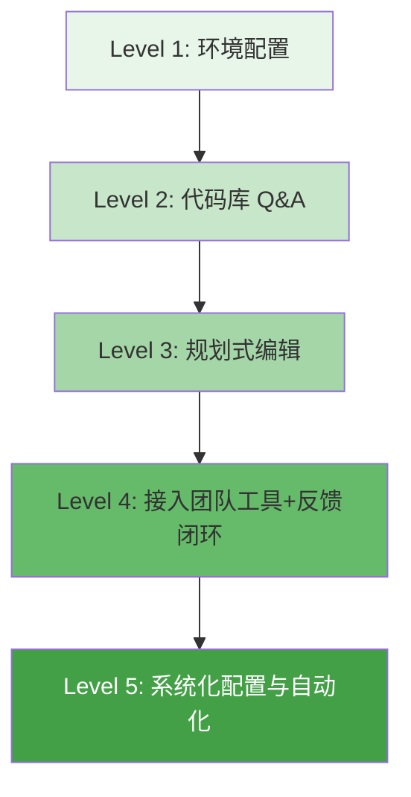

# Claude Code 实战指南：从装上到真正用好，你需要跨过五道坎

**一句话导读：** 多数人拿到 Claude Code 后只会让它"写代码"，但真正的高手做的是五件事——问对问题、先想后做、接上团队工具、喂足上下文、给反馈让它迭代。

## 适合谁看

- 刚装上 Claude Code 但不知道从何下手的工程师
- 已经在用但只会说"帮我实现这个功能"的 Claude Code 用户
- 想在团队里推广 AI 辅助编程的技术管理者
- 正在做技术 onboarding 并希望加速新人与代码库磨合的团队
- 对 agentic coding 工具的设计理念感兴趣的产品或技术决策者

## 读完你会获得什么

- 理解 Claude Code 和传统代码补全工具的本质区别
- 掌握从 Q&A 到编辑到高级配置的渐进式上手路径
- 知道如何通过"先规划再编码"和"给反馈让它迭代"两个关键模式显著提升输出质量
- 能为自己的项目配置 CLAUDE.md、MCP 工具和权限体系
- 能用 SDK 把 Claude Code 变成 CI/流水线/unix 管道的一部分
- 避开"上来就让它写大功能"和"逐条批准命令"两个最常见的坑

---

## 01 背景：为什么这个问题现在值得讨论

代码补全工具已经存在好几年了。从 Copilot 到 Cursor，大多数 AI 辅助编程工具的核心交互模式是：你写一行，它补一行。这对写模板代码有用，但面对"实现一个完整功能""修一个跨文件的 bug""理解一个陌生代码库"这类任务，逐行补全帮不上忙。

Claude Code 代表的是另一条路：**agentic coding**。你给一个意图，它自己决定用哪些工具（搜索、编辑、执行命令）、按什么顺序、怎么组合，来完成整个任务。这不是补全，是委托。

但问题来了：一个什么都能干的工具，新手反而不知道怎么用。自由度太高，prompt 写什么、写到什么粒度、什么时候干预——这些都是空白。Anthropic 内部也踩过这些坑，这篇内容就是他们把实战经验提炼成的一套渐进式方法论。

---

## 02 核心判断：视频真正想讲的不是工具功能，而是一套与 AI agent 协作的工作系统

表面上，这个演讲在介绍 Claude Code 的功能和技巧。实际上，它在传达一个判断：**用好 agentic coding 工具的关键不是 prompt 写得多花哨，而是你愿不愿意花时间构建三个东西——足够的上下文、清晰的工作流、有效的反馈闭环。**

演讲者反复提到的不是"它能做什么"，而是"你应该怎么跟它协作"。每次提到高质量输出，背后都有同一个模式：先让它理解环境，再让它规划方案，然后给它验证手段让它自己迭代。这和传统的"写需求 → AI 输出 → 人工检查"是完全不同的交互范式。

---

## 03 概念澄清：先把关键名词讲准确

### Agentic Coding（代理式编程）

- **是什么**：AI 不再逐行补全，而是接收一个意图后自主规划步骤、调用工具、执行任务
- **解决什么问题**：跨文件修改、复杂 bug 修复、代码库理解等需要多步推理和工具组合的任务
- **不是什么**：不是"AI 自动写完整个项目"，人仍然在决策和验证环节
- **和相关概念的区别**：代码补全是"你敲一个字，它猜下一个字"；agentic coding 是"你说一个目标，它决定怎么做"
- **例子**：你说"这个函数为什么有 15 个参数"，它会自己翻 git log、找 commit message、关联 issue，然后给你一个综合回答

### CLAUDE.md

- **是什么**：放在项目根目录的 Markdown 文件，Claude Code 每次启动会话时自动读取
- **解决什么问题**：跨会话持久化项目上下文（常用命令、架构决策、风格指南），不用每次重复告诉它
- **不是什么**：不是配置文件，不是 prompt 模板，是给 AI 看的"项目 README"
- **和相关概念的区别**：区别于 `.claude/commands/`（后者是可调用的命令脚本，类似快捷方式）
- **例子**：一个 CLAUDE.md 里写了"跑测试用 `pnpm test`，代码风格遵循 X 规范，核心入口文件是 Y"，Claude Code 后续所有操作都会遵守

### MCP（Model Context Protocol）

- **是什么**：一种标准协议，让 AI agent 能够调用外部工具服务器（如 Puppeteer、数据库客户端、内部 CLI）
- **解决什么问题**：给 Claude Code 接入你团队已经在用的工具，而不需要每个工程师单独配置
- **不是什么**：不是 API 调用，不是插件系统——它是一个协议标准，工具服务器独立运行
- **例子**：团队在项目里放一个 `.mcp.json`，声明了 Puppeteer 服务器，所有工程师用 Claude Code 时都能自动截图网页并迭代 UI

### Iteration with Feedback（带反馈的迭代）

- **是什么**：给 Claude Code 一种验证自身输出的手段（跑测试、截图、lint），让它看到结果后自己修正
- **解决什么问题**：AI 一次性输出很难完美，但如果有客观反馈信号，迭代两三轮后质量会大幅提升
- **不是什么**：不是人手动审查后告诉它改哪里——是让工具自动提供反馈
- **例子**：让 Claude Code 实现一个 UI，同时给它 Puppeteer 截图能力。它写完代码 → 截图 → 自己看到布局有问题 → 修改 → 再截图 → 直到结果接近设计稿

---

## 04 整体框架：用好 Claude Code 的五个递进层级

这五个层级是递进关系，不是并列关系。每一层是下一层的前提。

**Level 1 — 环境配置**：装好工具，设置好快捷键、主题、权限。这是 10 分钟的事，但跳过它会让后面每一步都别扭。

**Level 2 — 代码库 Q&A**：不急着让它改代码，先用它理解代码。提问是最好的学习方式——既学代码库，也学 Claude Code 的能力边界。Anthropic 新人 onboarding 从三周缩短到三天，靠的就是这一层。

**Level 3 — 规划式编辑**：开始让它改代码，但遵循一个原则——先让它想，再让它做。"先制定方案，经我确认后再写代码"，这句话就够了。

**Level 4 — 接入团队工具+反馈闭环**：给它你的团队工具（bash CLI、MCP 服务器），更重要的是给它验证手段。有测试就让它跑测试，有界面就让它截图。这是质量飞跃的关键跳板。

**Level 5 — 系统化配置与自动化**：CLAUDE.md 分层管理、权限体系设计、命令和 MCP 共享、SDK 集成到 CI。这是团队级甚至企业级的工程化实践。

---

## 05 关键机制：两个让输出质量质变的运行模式

### 机制一：规划-确认-执行

**输入**：一个模糊或复杂的需求（如"实现用户通知系统"）

**中间处理**：
1. Claude Code 搜索相关代码，理解现有架构
2. 生成一个实现方案（文件结构、接口设计、改动范围）
3. 等待人类确认
4. 确认后才动手修改文件

**输出**：符合预期的代码改动，而不是偏航后才发现的返工

**为什么要这样设计**：AI 一次性完成复杂任务时，方向偏了就是大面积返工。先规划是把方向校验前置，成本远低于事后纠正。

**代价**：多一轮交互，感觉上"慢了"。但实际总耗时更短，因为返工少了。

**适合场景**：跨文件改动、架构决策、不确定实现路径的任务

**不适合场景**：单文件小改动、你非常确定怎么做的任务

### 机制二：反馈驱动的自动迭代

**输入**：一个需求 + 一种验证手段（测试套件、截图工具、lint 检查）

**中间处理**：
1. Claude Code 生成第一版代码
2. 自动运行验证手段，获取反馈信号
3. 根据反馈判断问题所在
4. 修改代码
5. 再次验证
6. 重复 2-5 直到通过或达到迭代上限

**输出**：经过多轮自我修正的代码，质量显著高于单次输出

**为什么要这样设计**：AI 和人一样，一次写对很难，但有反馈就能快速收敛。关键区别是——这个反馈不需要人提供，工具自动给出。

**代价**：消耗更多 token 和时间；验证工具本身需要配置

**适合场景**：UI 实现（截图对比）、有测试覆盖的功能开发、代码重构

**不适合场景**：没有自动化验证手段的任务（纯创作类、没有测试的遗留代码）

---

## 06 方法拆解：从零到高级用户的完整落地路径

### 第一步：环境配置（10 分钟）

| 动作 | 命令/操作 | 目的 |
|------|----------|------|
| 安装 | `npm install -g @anthropic-ai/claude-code` | 前提：需要 Node.js |
| 终端设置 | `claude terminal-setup` | 启用 Shift+Enter 换行 |
| 主题设置 | `claude theme` | 选择亮/暗主题 |
| 安装 GitHub App | `claude /install-github-app` | 在 GitHub issue 上 @claude |
| 自定义权限 | 在设置中配置自动批准/拒绝的命令列表 | 减少重复确认 |
| 开启语音输入 | macOS → 系统设置 → 辅助功能 → 听写 | 用语音代替手打 prompt |

**判断标准**：能在终端里顺畅输入多行 prompt，不需要反复按权限确认。

**常见坑**：跳过权限配置，导致每条 bash 命令都要手动批准，效率极低。

### 第二步：代码库 Q&A（第 1-3 天）

目标：用提问理解代码库，同时理解 Claude Code 的能力边界。

**推荐的提问模式**：

| 问题类型 | 示例 prompt | 你会得到什么 |
|---------|------------|------------|
| 用法查询 | "这个函数在整个项目里怎么被调用的？" | 比文本搜索更深的调用链分析 |
| 历史追溯 | "为什么这个函数有 15 个参数？查一下 git 历史" | commit 追溯 + issue 关联 + 演变总结 |
| 问题定位 | "这个 bug 可能的根因是什么？" | 代码路径分析 + 假设排序 |
| 周报生成 | "查一下我本周的 git log，整理成 standup 报告" | 自动格式化的工作摘要 |

**判断标准**：你能用 Claude Code 回答过去需要问同事或翻文档才能搞清楚的问题。

**常见坑**：一上来就让它改代码。Q&A 阶段的目的是建立对工具能力的直觉，跳过它会导致后续 prompt 粒度把握不准。

### 第三步：规划式编辑（第 4-7 天）

核心原则：**任何非平凡改动，先让它规划，再让它执行。**

Prompt 模板：
- "先分析代码结构，制定实现方案，经我确认后再写代码"
- "先做 plan，列出要修改的文件和方案，我确认后再动手"
- "think through this, then commit and push"

最后一个特别实用：Claude Code 会自动分析 git log 格式、分支命名规则、commit 惯例，然后按项目风格完成 commit 和 push。你不需要教它怎么写 commit message。

**判断标准**：你发出的编辑类 prompt 中，超过 50% 包含"先规划/先分析"的前置指令。

**常见坑**：给它一个 300 行的大功能需求，它一次写完，结果方向完全偏了。正确做法是拆成小步，每步确认。

### 第四步：接入工具和反馈闭环（第 2 周）

**接入 bash 工具**：
- 告诉 Claude Code 你团队的 CLI 工具存在，让它 `--help` 自己学会用法
- 高频使用的命令写入 CLAUDE.md，跨会话记住

**接入 MCP 工具**：
- 在项目根目录创建 `.mcp.json`，声明 MCP 服务器
- 团队成员 clone 项目后自动获得工具配置

**建立反馈闭环**：
- 有单元测试？让它改完代码自动跑测试
- 是前端？接入 Puppeteer 或 iOS Simulator 截图
- 有 lint？让它改完后自动检查

**判断标准**：Claude Code 至少 30% 的编辑操作后能自动获取反馈信号并据此迭代。

**常见坑**：只给它工具但不给它验证手段。没有反馈的 agent 就像蒙眼干活——效率再高也容易偏。

### 第五步：系统化配置（第 3 周起）

**CLAUDE.md 分层策略**：

| 层级 | 位置 | 内容 | 共享范围 |
|------|------|------|---------|
| 项目级 | 项目根目录 | 架构决策、常用命令、风格指南 | 整个团队，提交到 git |
| 个人级 | `.claude/` 本地目录 | 个人偏好、临时笔记 | 仅自己 |
| 目录级 | 子目录中的 CLAUDE.md | 该模块的特殊约定 | 在该目录下工作时自动加载 |
| 企业级 | 企业策略配置 | 全局权限、安全规则 | 全公司所有项目 |

**权限配置**：
- 自动批准：只读命令、测试命令、团队标准工具
- 阻止列表：敏感 URL、危险操作
- 在企业级配置中统一管理，员工无法覆盖

**判断标准**：新成员 clone 项目后，5 分钟内就能获得和你一样的工作环境（CLAUDE.md + MCP + 权限全部就绪）。

**常见坑**：CLAUDE.md 写得太长。内容膨胀后反而消耗上下文窗口，降低输出质量。保持精简——只放必须知道的信息。

---

## 07 案例讲解：Anthropic 内部的 onboarding 实践

**场景背景**：Anthropic 有大量内部代码库，新入职的技术人员需要理解复杂的系统架构、代码约定和工具链。

**过去的问题**：新人 onboarding 耗时 2-3 周。新人需要反复问老员工问题、自己翻代码、摸索工具用法。老员工的回答质量参差不齐，且占用了大量时间。

**按框架如何处理**：

1. **Level 2 — Q&A 阶段**：新员工装上 Claude Code 后，第一件事不是写代码，而是对着代码库提问。"这个模块负责什么？""这个接口为什么这样设计？""这条 pipeline 的数据流是什么？"Claude Code 搜索代码、追溯 git 历史、综合分析后给出回答。

2. **Level 5 — 配置阶段**：团队提前在 CLAUDE.md 中写好了架构概览、常用命令和代码风格。新员工不需要人带路，Claude Code 已经"知道"了项目约定。

3. **Level 4 — 工具阶段**：MCP 服务器（如 Puppeteer）已经在项目里配好，新人可以直接让 Claude Code 跑端到端测试并截图验证。

**最终结果**：onboarding 时间从 2-3 周缩短到 2-3 天。不是因为 AI 替新人干了活，而是因为 AI 成了一个 24 小时在线、对代码库了如指掌的导师。

**说明了什么**：agentic coding 工具的最大价值未必是"写代码更快"，而是"让知识的获取和传递成本趋近于零"。当团队成员不再需要彼此回答重复问题时，每个人都更快地到达了可以产生价值的起点。

---

## 08 常见误区

**误区一：一上来就让 AI 写代码**

- 错误理解：装好工具就该让它干活
- 为什么错：你还不了解它的能力边界，它还不了解你的代码库。直接写代码大概率偏航
- 正确理解：先用 Q&A 建立双向理解——你理解它能做什么，它理解代码库是什么
- 应该怎么做：前三天只提问，不编辑

**误区二：一次性给出大需求**

- 错误理解："帮我实现整个用户系统"这样的 prompt 是高效利用
- 为什么错：大需求导致 AI 一次生成大量代码，方向偏了就是全面返工
- 正确理解：复杂任务必须拆步，每步校验
- 应该怎么做：先让它出方案，确认方向后再分步执行

**误区三：每条命令都手动批准**

- 错误理解：安全就是逐条审批
- 为什么错：逐条审批让 agentic 工具退化为半自动工具，迭代效率极低
- 正确理解：安全通过分级权限实现——只读命令自动批准，写操作和敏感操作需确认
- 应该怎么做：花 10 分钟配置权限白名单，把安全的命令设为自动批准

**误区四：CLAUDE.md 越详细越好**

- 错误理解：把所有项目文档都塞进 CLAUDE.md
- 为什么错：过长的 CLAUDE.md 消耗上下文窗口，反而降低输出质量
- 正确理解：CLAUDE.md 是"必须知道的最小信息集"，不是项目百科
- 应该怎么做：只放常用命令、核心架构决策、风格约定。保持一页以内

**误区五：只给工具不给反馈手段**

- 错误理解：接入了 MCP 和 CLI 就够了
- 为什么错：没有验证手段的 AI 是蒙眼工作——速度再快也可能方向全错
- 正确理解：工具让它能做，反馈让它能做对
- 应该怎么做：至少给它一种自动验证方式——测试、截图、lint，选你能配的最简单的那种

**误区六：认为它只是代码补全的升级版**

- 错误理解：Claude Code 就是更强版的 Copilot
- 为什么错：补全是"你写一行它补一行"，agent 是"你说目标它决定怎么做"。交互模式完全不同
- 正确理解：你从"操作者"变成了"委托者"——你的主要工作从写代码变成定义目标和校验方向
- 应该怎么做：调整心态，不再微观管理每一步，而是聚焦在"我要什么"和"结果对不对"

**误区七：必须在 VS Code 里才能用**

- 错误理解：AI 编程工具只能在 IDE 里用
- 为什么错：Claude Code 是终端工具，任何终端都能跑——VS Code、Xcode、Vim、SSH 远程都行
- 正确理解：终端是所有开发环境的最大公约数
- 应该怎么做：在你现有的任何终端里直接使用，不需要换 IDE

---

## 09 实战清单：读完后可以马上照着做

### 立即能做

- [ ] 安装 Claude Code，运行 `claude terminal-setup` 和 `claude theme`
- [ ] 对你当前项目问 3 个问题：某个复杂函数的用途、某段代码的 git 历史、某个模块的数据流
- [ ] 在你的 prompt 里加一句："先分析再动手，方案确认后再写代码"
- [ ] 配置权限白名单：把 `git log`、`git diff`、`cat`、`ls`、测试命令设为自动批准
- [ ] 用 `#` 让 Claude Code 记住一条你希望它始终遵守的规则

### 一周内能做

- [ ] 为你的项目创建 CLAUDE.md，写入：常用命令、核心架构、代码风格
- [ ] 找到一个可以自动验证的场景（测试套件/lint/截图），让 Claude Code 在编辑后自动验证并迭代
- [ ] 用"think through this, commit and push"完成一次完整的功能开发-提交流程
- [ ] 试用 `!` 快捷键直接执行一条 bash 命令并让结果进入上下文
- [ ] 给团队中一个没用过 Claude Code 的人做演示，从 Q&A 开始

### 长期要沉淀

- [ ] 为团队项目配置 `.mcp.json`，把团队常用工具（如 Puppeteer、数据库客户端）接入
- [ ] 建立 CLAUDE.md 分层体系：项目级（团队共享）+ 目录级（模块特殊约定）+ 个人级（本地偏好）
- [ ] 探索 SDK 在 CI/流水线中的集成：自动 issue 标记、日志分析、代码审查
- [ ] 用 `claude memory` 审查和整理所有记忆文件，确保上下文精简有效
- [ ] 建立团队权限策略：自动批准安全命令、阻止敏感操作、统一管理 MCP 配置

---

## 10 总结

Claude Code 不是更强的代码补全工具。它是一个需要你重新理解"怎么和 AI 协作"的 agent。补全工具的交互是"你推一下它动一下"；agent 的交互是"你说目标，它找路径"。

这个范式转换意味着你的工作重心从"写代码"转向了三件事：**给上下文、定方向、供反馈**。上下文通过 CLAUDE.md 和配置体系注入；方向通过"先规划再执行"的工作流保证；反馈通过测试、截图等自动验证手段提供。三者缺一，输出质量就会打折。

Anthropic 内部的实践已经验证了这个路径：新人 onboarding 从三周变三天，不是因为 AI 神奇，而是因为他们花了时间构建这三样东西。80% 的技术人员每天使用 Claude Code，靠的不是 prompt 技巧，是系统化的上下文管理和工具配置。

最后一句话：**agentic coding 工具的天花板不是模型能力，是你愿意花多少时间把你的上下文和工作流灌给它。** 投入配置的时间，回报是后续每一次交互的质量提升——这是复利，不是一次性消费。
