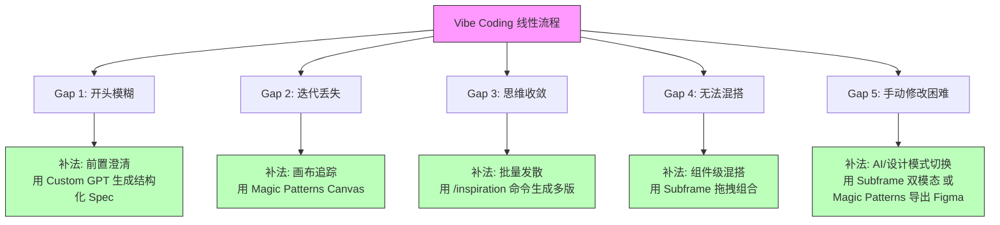

# Vibe Coding 很爽，但设计探索很痛：五招补齐 AI 原型设计的短板

## 一句话导读

Vibe coding 工具擅长线性迭代，却不擅长设计探索——本文提供五条可落地的方法，帮你从"Prompt 出来的第一个方案"走向"真正值得比较和选择的设计空间"。

## 适合谁看

- 用过 Lovable、v0、Bolt、Cursor 等工具做原型，但总觉得"每版都差不多"的产品经理或设计师
- 想用 AI 工具做设计探索，却受限于线性 Prompt-Iterate 工作流的人
- 带 UI/UX 交付的独立开发者，需要快速产出多个设计方案再决策
- 对 Magic Patterns、Subframe 等 AI 原型工具有兴趣但还没深入用过的人
- 在团队中推动 AI 设计工作流、需要方法论支撑的负责人

## 读完你会获得什么

- 理解 Vibe Coding 工作流的根本局限——为什么它让你"越迭代越窄"而非"越迭代越宽"
- 掌握五个具体方法，分别解决 AI 设计流程中"开头模糊、迭代丢失、思维收敛、无法混搭、手动修改困难"的问题
- 能用"反向 Prompting"技术，为自己的设计系统生成定制化的 AI 指令
- 能根据自身需求，在 Magic Patterns 和 Subframe 之间做出合理选择
- 有一份可直接照做的行动清单，从今天开始改善 AI 设计工作流

---

## 01 背景：为什么这个问题现在值得讨论

Vibe Coding 正在改变产品原型的生产方式。无论你用的是 Lovable、v0、Bolt 还是 Cursor，核心流程都一样：给一个 Prompt → AI 生成一版 → 你提修改意见 → AI 再生成一版。循环往复，直到满意。

这个流程的好处显而易见：门槛低、速度快、能快速从 0 到 1。但问题是——**它是一条直线**。

你从 Prompt A 出发，走到迭代 1，再走到迭代 2，路径是线性的。如果你想回到出发点换一个方向？如果你想同时比较三个方向？如果你想把方向 2 的某个组件和方向 3 的某个布局拼在一起？线性流程做不了这些事。

对于工程师来说，这不是大问题——他们要的是"能跑的东西"。但对于设计师来说，这是根本性的限制。设计的核心动作是**探索和比较**，不是"改到对为止"。

Shiren（"Design with AI" 通讯创始人、"AI for Designers" 课程讲师）在大量实践后提炼出了五个具体的"Gap"——Vibe Coding 工作流在设计探索层面的五个缺口。这五个缺口不是"AI 不够聪明"的问题，而是**工作流结构本身不支持发散**的问题。

---

## 02 核心判断：问题不在 AI 的能力，而在工作流的结构

视频表面在讲"五个技巧让你更好地用 AI 做设计"，但真正要讲的判断是：

**Vibe Coding 的线性 Prompt-Iterate 结构，天然偏向收敛思维。你想用它做发散探索，就必须在工作流中主动插入"分叉、并排、混搭、回退"的结构性环节。**

这些环节不会自然出现。AI 工具不会替你做——它们的设计逻辑就是"你说话，我改"，永远在线性路径上前进。你必须用额外的工具、额外的流程、额外的前置工作来补偿。

这意味着：**用 AI 做好设计，比用 AI 写出能跑的代码，多出来的工作量不在 AI 端，而在工作流设计端。**

---

## 03 概念澄清：先把关键名词讲准确

### Vibe Coding

- 它是什么：一种以自然语言 Prompt 驱动的 AI 编码方式，核心特征是"边说边改、快速出活"
- 它解决什么问题：让非工程师也能快速构建可运行的软件原型
- 它不是什么：它不是设计方法论，不包含设计探索、方案比较等环节
- 和传统编码的区别：传统编码是"写代码→运行→调试"，Vibe Coding 是"说意图→AI 生成→提修改→再生成"
- 例子：你对 Cursor 说"做一个待办事项 App"，它直接生成一个可交互的网页

### Vibe Designing

- 它是什么：在 Vibe Coding 基础上，主动补充设计探索环节的工作方式
- 它解决什么问题：Vibe Coding 只能线性收敛，Vibe Designing 让你能发散、比较、混搭、回退
- 它不是什么：不是"让 AI 设计得更好看"——那只是 Prompt 优化
- 和 Vibe Coding 的区别：Vibe Coding 关注"做出来"，Vibe Designing 关注"做对选择"
- 例子：同一个产品需求，Vibe Coding 生成一版就改；Vibe Designing 先生成四版并排比较，再决定方向

### 设计探索（Design Exploration）

- 它是什么：同时生成多个设计方案、并排比较、择优组合的过程
- 它解决什么问题：避免过早收敛到一个局部最优方案
- 它不是什么：不是"多改几版"——多改几版仍然是在一条路径上走
- 和设计迭代的区别：迭代是同方向的优化，探索是不同方向的尝试
- 例子：为同一个页面生成四个不同的布局方案，横向比较优劣

### 反向 Prompting（Reverse Prompting）

- 它是什么：把现成的设计截图喂给 AI，让 AI 反推出一套描述该设计系统的指令
- 它解决什么问题：你很难用文字精确描述一个设计系统的风格规则，但 AI 可以从截图中提炼
- 它不是什么：不是"让 AI 生成设计"，而是"让 AI 生成描述设计的指令"
- 和普通 Prompting 的区别：普通 Prompting 是"人写指令→AI 执行"，反向 Prompting 是"人给样本→AI 写指令"
- 例子：把 Uber 的五个典型界面截图给 ChatGPT，让它生成描述 Uber 配色、字阶、间距规则的 Markdown 文件

### Custom Instruction / 设计系统指令

- 它是什么：一段预先写好的文本，告诉 AI 你的设计规则（配色、字体、间距、组件偏好等）
- 它解决什么问题：避免 AI 每次都生成"紫色渐变、圆角卡片"的默认 AI 风格
- 它不是什么：不是组件库——组件库是可复用的 UI 零件，指令是指导 AI 如何组合零件的规则
- 两者的关系：**组件库 + 设计系统指令 = 可控的设计输出**
- 例子：在 Magic Patterns 中设置 Uber 预设，AI 生成的原型就会遵循 Uber 的视觉风格

---

## 04 整体框架：五道缺口与五种补法

Vibe Coding 的线性流程有五道结构性缺口，每一道都需要特定的工具或方法来弥补：

**理解这个框架的关键**：五个 Gap 不是五个独立的问题，而是同一条线性流程在不同阶段暴露出的五种缺陷。它们有逻辑顺序——开头没想清楚（Gap 1），后面就难分叉（Gap 3）；分叉了没记录（Gap 2），记录了没法组合（Gap 4）；组合完了还想微调（Gap 5）。解决它们也需要顺序推进。

---

## 05 关键机制：每道缺口到底卡在哪里

### Gap 1：开头模糊——第一个 Prompt 决定了你能走多远

- **输入**：一个模糊的产品想法，比如"做一个健身 App"
- **问题**：AI 拿到这种 Prompt 后，会自行填补大量空白——目标用户、核心场景、交互优先级全靠猜。猜错了，后续所有迭代都在错误方向上打转
- **输出**：一个看似完整但方向可能完全偏掉的初始原型
- **为什么这样设计代价大**：后续修正方向的成本远高于开头多花五分钟想清楚。更糟的是，你可能根本意识不到方向偏了——因为 AI 生成的结果"看起来不错"
- **适合的场景**：快速出 Demo 不在乎方向时可以接受；做正式产品设计时绝不能跳过

### Gap 2：迭代丢失——线性工具没有"存档点"

- **输入**：你在 Lovable 中做了三轮迭代，方向 A → 方向 B → 方向 C
- **问题**：走到 C 发现 B 其实更好，但 B 的状态已经没了。大多数工具只保留当前状态，没有"版本树"或"设计快照"
- **输出**：要么手动重新走一遍 B 的路径（浪费 Token 和时间），要么放弃 B
- **为什么这样设计**：这些工具的底层逻辑是"聊天记录"——线性的对话历史，不是"版本管理系统"
- **适合的场景**：方向明确只需微调时影响不大；需要探索多个方向时是致命缺陷

### Gap 3：思维收敛——工具让你"改这一版"，不让你"再开一版"

- **输入**：你有一个页面设计，想同时看四种不同的布局方式
- **问题**：大多数工具的交互逻辑是"修改当前设计"，不是"生成替代方案"。你很难在同一个项目里并排展示多个方向
- **输出**：你只能在脑子里比较，或每次手动新建项目
- **为什么这样设计**：工具的核心假设是"用户要的是一个对的结果"，不是"用户要看到多个可能性"
- **适合的场景**：需求明确、方案空间小时不是问题；需求模糊、需要发散时是核心瓶颈

### Gap 4：无法混搭——方案之间不可交叉取材

- **输入**：方案 A 的导航栏好，方案 B 的卡片布局好，方案 C 的配色好
- **问题**：在大多数工具中，你无法从方案 A 里拿一个组件插到方案 B 里——它们是独立的聊天记录/项目
- **输出**：要么手写代码重新拼，要么选一个方案后手动改
- **为什么这样设计**：工具的版本模型是"每个对话产生一个设计"，没有跨对话的组件共享机制
- **适合的场景**：方案差异小、不存在混搭需求时无影响；方案差异大、各有亮点时非常痛

### Gap 5：手动修改困难——AI 生成的结果不好微调

- **输入**：AI 生成的原型整体不错，但某个按钮的间距、某个文字的大小需要微调
- **问题**：在代码驱动的工具中，手动微调意味着要么改代码，要么重新 Prompt——而"把按钮左移 8px"这种指令，用自然语言描述既不精确又浪费 Token
- **输出**：要么忍受不完美的细节，要么浪费大量 Token 做微调
- **为什么这样设计**：这些工具的交互层是自然语言，而设计微调需要的是像素级精度——两者存在根本的精度鸿沟
- **适合的场景**：高保真交付阶段最痛；低保真探索阶段影响较小

---

## 06 方法拆解：如果自己要做，应该怎么落地

### 步骤一：用结构化流程生成第一个 Prompt

**目标**：在进入任何 AI 原型工具之前，先把产品定义想清楚。

**具体动作**：

1. 回答四个问题：**谁**是目标用户？他们的**核心需求**是什么？你想聚焦的**用户流程**是哪一条？产品的**平台**是什么？
2. 不要自己从零写 Prompt——做一个 Custom GPT（或用 Shiren 分享的模板），让它通过问答引导你完成上述四步，然后自动生成一段结构化的 Spec
3. 这个 Spec 不是 PRD，而是一份"AI 原型专用规格书"——只包含核心用户流程和关键交互点

**判断标准**：生成的 Spec 能不能直接粘贴到任意 AI 原型工具（Lovable、v0、Magic Patterns）中作为第一个 Prompt 使用？如果能，说明足够清晰。

**常见坑**：
- 一上来就写"做一个全功能的 XX App"——太宽泛，AI 会平均用力，哪个流程都浅
- 跳过用户定义直接写功能——没有用户锚点，AI 会生成面向"所有人"的通用设计
- Spec 写太长——AI 原型 Spec 应该控制在半屏代码块以内，不是越长越好

**产出物**：一段可直接粘贴到 AI 原型工具的 Spec 文本（代码块格式）

### 步骤二：用画布工具追踪设计迭代

**目标**：每一次设计探索都保留快照，可随时回溯和比较。

**具体动作**：

1. 使用 Magic Patterns 的 Canvas 功能（目前少数支持画布视图的 AI 原型工具）
2. 每一次新的设计方向，在画布上生成一个新的预览窗口，而非在同一个对话中覆盖
3. 需要深入某个方向时，点击该窗口进入编辑模式（等同于打开对应的聊天记录）
4. 修改完成回到画布，预览自动更新

**判断标准**：你是否能在同一屏幕上看到所有设计方向的并排比较？如果能回退到任意历史版本而无需重新生成，说明流程正确。

**常见坑**：
- 在同一个聊天记录中来回改——这是线性迭代，不是设计探索
- 忘记定期把有价值的中间状态"钉"到画布上——好的方向可能被后续迭代覆盖

**产出物**：一个包含多个设计方向快照的画布文件

### 步骤三：用批量生成做发散探索

**目标**：同一个设计需求，一次性获得多个方向不同的方案。

**具体动作**：

1. 在 Magic Patterns 中，对某个页面或组件使用 `/inspiration` 命令
2. 工具默认生成四个不同设计选项
3. 如果不满意，刷新重新生成四个
4. 如果需要更精准的控制，先选中某个组件添加到上下文，再输入更具体的指令（如"生成更紧凑的间距方案"或"生成更可访问的布局方案"）

**判断标准**：四个方案之间是否有明显的布局/风格/交互差异？如果四个方案看起来只是配色不同，说明 Prompt 太模糊或约束太多。

**常见坑**：
- 不给上下文直接 `/inspiration`——结果可能过于随机
- 给太多约束——四个方案变成同一方向的四个微调版本
- 只看第一轮就选——至少看两轮（八个方案）再判断方向

**产出物**：画布上并排展示的 4-8 个不同设计方向

### 步骤四：跨方案混搭组件

**目标**：从方案 A 取一个组件，从方案 B 取另一个组件，组合成新方案。

**具体动作**：

1. 在 Subframe 中打开两个设计选项
2. 从方案 A 中拖拽你想要的组件到方案 B 的画布上
3. 删除方案 B 中被替换的组件
4. 调整布局使组合后的设计协调

**判断标准**：混搭后的方案是否仍然在视觉和交互上一致？如果出现明显的风格断裂，说明两个来源的设计系统差异太大，需要统一基础样式后再混搭。

**常见坑**：
- 混搭来自设计系统差异过大的方案——组件风格不统一
- 只拖不改——放入新上下文的组件通常需要微调间距和对齐

**产出物**：一个融合了多个方案优点的组合设计

### 步骤五：在 AI 模式和手动设计模式之间无缝切换

**目标**：AI 生成大方向，手动微调细节，再回到 AI 模式继续探索——不用在工具间切换。

**具体动作**：

1. **Subframe 方案**：在 Ask AI 模式中生成设计 → 切换到 Design 模式手动调整间距、padding、位置 → 切回 Ask AI 模式继续用自然语言探索。两个模式共享同一个设计状态
2. **Magic Patterns + Figma 方案**：在 Magic Patterns 中完成探索 → 导出到 Figma → 在 Figma 中手动精修。适合设计师日常流程，但导出后失去交互性，且改完需要手动同步回代码

**判断标准**：你的手动修改是否能在 30 秒内完成？如果每次微调都需要重新写 Prompt 或切换工具，说明工作流还有优化空间。

**常见坑**：
- 在 Figma 中改完又想回到 AI 流程——没有自动反向同步，需要手动搬运
- 在 Subframe 中做太多手动修改后，AI 后续生成的结果可能与手动修改的风格不一致

**产出物**：一个经过手动精修的、可交互的高保真原型

---

## 07 案例讲解：一个礼品分享 App 的设计探索全过程

**场景背景**：你要设计一个"礼品分享 App"——用户可以浏览推荐礼品、分享给朋友、查看对方是否喜欢。

**遇到的问题**：直接对 Lovable 说"做一个礼品分享 App"，出来的东西大概率是紫色渐变卡片流，和你在网上见过的所有 AI 生成原型一模一样。你想探索不同的页面结构和交互模式，但不知道怎么系统地做。

**按框架如何处理**：

**第一步：前置澄清**。打开 Custom GPT，回答：目标用户是想送礼物但不知道送什么的年轻人；核心场景是浏览推荐和分享；平台是移动端；聚焦用户流程是"发现→分享→查看反馈"。GPT 生成一段 Spec，直接复制。

**第二步：粘贴 Spec 到 Magic Patterns**。生成初始原型。

**第三步：发散探索**。在主页面使用 `/inspiration`，生成四个不同布局方案——可能是卡片流、列表流、双列瀑布流、故事流。不满意就刷新，再来四个。

**第四步：并排比较**。把所有方案放在 Canvas 上，逐一交互预览。发现方案 3 的礼物卡片展示最清晰，但方案 1 的顶部导航更直觉。

**第五步：混搭**。打开 Subframe，把方案 3 的礼物卡片组件拖到方案 1 的布局中，删除方案 1 原来的卡片。微调间距。

**第六步：手动精修**。切换到 Design 模式，把分享按钮的间距从 16px 调到 12px，卡片圆角从 8px 调到 12px。切回 AI 模式，问"能不能给卡片加一个'已送出'的状态标签"。

**最终结果**：一个融合了多个设计方向优点的、经过手动精修的移动端礼品分享 App 原型。

**说明了什么**：Vibe Coding 做不到的事——比较、选择、混搭、精修——Vibe Designing 通过结构化的工作流和特定工具组合可以做到。关键不是 AI 更聪明了，而是**流程更完整了**。

---

## 08 常见误区

**误区一："Prompt 写得越好，设计就越好"**

- 错误理解：只要 Prompt 足够精确，AI 就能直接生成最佳设计
- 为什么错：Prompt 精确只能保证输出可预期，不能保证输出是最优解。设计的核心是"比较多个可能性"，不是"精确描述一个可能性"
- 正确理解：Prompt 解决的是"方向正确"，设计探索解决的是"找到最优"。两者缺一不可
- 应该怎么做：写好 Prompt 之后，还要做批量发散和并排比较

**误区二："多迭代几轮就等于设计探索"**

- 错误理解：我在 Lovable 里改了八版，这就算探索了
- 为什么错：八次线性迭代可能只是在一个方向上越走越远，真正的探索需要同时生成多个不同方向
- 正确理解：迭代是同方向的优化，探索是不同方向的尝试。两者是正交的
- 应该怎么做：在迭代之前先做批量发散，确保你在对的赛道上跑

**误区三："AI 生成的原型不需要手动调整"**

- 错误理解：AI 工具应该能一步到位，如果还需要手动改，说明 AI 不够好
- 为什么错：自然语言交互和像素级精确设计之间存在根本的精度鸿沟。AI 擅长大方向，不擅长 8px 的间距调整
- 正确理解：AI 和手动编辑是互补的，不是替代关系。最好的流程是两者无缝切换
- 应该怎么做：用 AI 做探索和大方向，用手动模式做精修，而不是强迫自己全程用自然语言

**误区四："用哪个工具不重要，关键是 Prompt"**

- 错误理解：所有 AI 原型工具都差不多，差别只在 AI 模型
- 为什么错：工具的交互模型决定了你能做什么——Lovable 和 v0 是"对话式单版本"，Magic Patterns 是"画布式多版本"，Subframe 是"设计工具 + AI 助手"。工具结构决定了工作流结构
- 正确理解：选工具就是选工作流。你要做探索就选支持画布的工具，要做精修就选支持手动模式的工具
- 应该怎么做：根据你的核心需求（探索 vs. 交付 vs. 精修）选择工具，不要只看"哪个 AI 更强"

**误区五："设计系统指令和组件库是一回事"**

- 错误理解：我有了组件库，AI 就能生成符合我品牌的设计
- 为什么错：组件库提供的是可复用的零件，但不告诉 AI 怎么组合这些零件。没有设计规则，AI 可能用你的按钮拼出一个完全不符合品牌调性的布局
- 正确理解：**组件库 = 零件；设计系统指令 = 装配规则**。两者必须配对使用
- 应该怎么做：先用反向 Prompting 生成设计系统指令（配色、字阶、间距、网格规则），再配合组件库，才能得到可控的设计输出

**误区六："所有 AI 原型都长一样，没法避免"**

- 错误理解：AI 生成的原型天生就是紫色渐变风，无法改变
- 为什么错：这不是 AI 的"天性"，而是你没有提供设计约束。AI 默认使用 Base 样式库，所以出来的都一样
- 正确理解：通过预设样式库（如 Magic Patterns 的 Uber/Wireframe 预设）或自定义设计系统指令，可以让 AI 生成任何风格
- 应该怎么做：花 20 分钟做一次反向 Prompting，为你的品牌生成一套设计系统指令，以后每次使用都带上

---

## 09 实战清单：读完后可以马上照着做

### 立即能做

1. **下次 Prompt 之前先回答四个问题**：目标用户、核心需求、聚焦流程、平台——用自然语言写下来再动手，不依赖任何工具
2. **做一次反向 Prompting**：找 5 张你喜欢的产品界面截图，喂给 ChatGPT，让它生成一套设计系统指令（配色、字阶、间距），保存为 Markdown 文件
3. **注册 Magic Patterns 并试用 `/inspiration` 命令**：用任意页面体验一次"同时生成四个设计选项"的发散流程
4. **用 Subframe 体验一次 AI 模式和 Design 模式的切换**：同一个设计，先让 AI 生成，再切到 Design 模式手动调一个按钮的间距

### 一周内能做

5. **做一个 Custom GPT 来生成 AI 原型 Spec**：设置引导性问题（用户是谁？核心流程？平台？），让 GPT 自动生成可直接粘贴的 Spec 代码块
6. **为你的品牌/项目创建一套 Magic Patterns 预设**：包含设计系统指令 + 组件库，以后每次探索都带上
7. **用 Magic Patterns Canvas 做一次完整的设计探索**：从一个 Spec 出发，生成至少 8 个不同的设计方向，并排比较后选出最优
8. **尝试一次跨方案混搭**：在 Subframe 中从两个不同的设计方向各取一个组件，组合成新方案

### 长期要沉淀

9. **建立你的个人/团队设计系统指令库**：为不同项目或品牌各维护一套指令，定期更新
10. **形成固定的 Vibe Designing 工作流**：Spec 生成 → 批量发散 → 并排比较 → 混搭组合 → 手动精修。每次做设计都按这个流程走
11. **定期评估工具链**：AI 原型工具迭代很快，每季度检查是否有新工具填补了你当前工作流的缺口

---

## 10 总结

Vibe Coding 解决了"做出来"的问题，但没解决"做对选择"的问题。它的线性 Prompt-Iterate 结构天然偏向收敛——你越迭代，方向越窄，而不是越宽。

这五个 Gap——开头模糊、迭代丢失、思维收敛、无法混搭、手动修改困难——不是 AI 能力不足导致的，而是工作流结构导致的。你不能靠"写更好的 Prompt"来解决它们，你必须改变工作流本身。

具体的改变是：在 Prompt 之前插入结构化澄清（Gap 1），在迭代过程中用画布工具保留快照（Gap 2），在需要发散时用批量生成替代单次生成（Gap 3），在需要组合时用组件级混搭替代整体替换（Gap 4），在需要精修时用手动模式替代自然语言（Gap 5）。

**Vibe Coding 让非设计师也能做原型，但 Vibe Designing 让所有人都能做好的设计决策——区别在于，前者是让 AI 替你做，后者是让 AI 帮你看清选择。**
