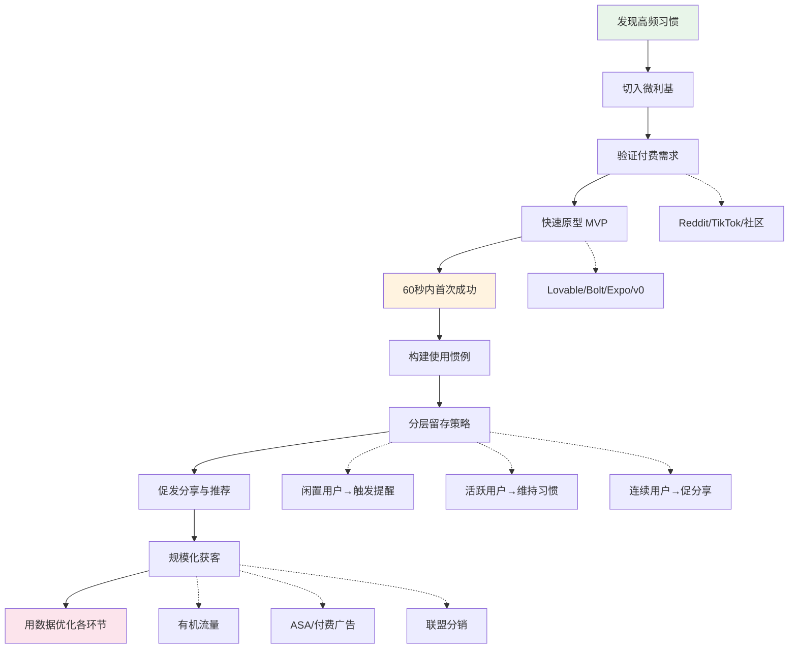

# 月入十万美元的消费级 App：从找到一个习惯开始

> 如果你想做一款赚钱的 App，最重要的不是技术，不是创意，而是你选择服务的那个"习惯"。

## 一句话导读

这篇文章给出一套从零到月入十万美元的消费级移动应用构建框架——以"高频习惯"为起点，以"首次成功体验"为支点，以"周活跃付费用户"为北极星指标，逐层拆解验证、产品、获客、留存、变现的完整链路。

## 适合谁看

- 想独立开发消费级 App 但不知道从哪个方向切入的开发者
- 有技术能力但缺乏产品方法论、不知道怎么验证需求的独立创业者
- 做过 App 但卡在获客和留存、月收入在几千美元徘徊的人
- 想理解当前消费级 AI App 为什么能跑出来的产品经理
- 在考虑是否该投入消费级移动应用赛道的创业者

## 读完你会获得什么

- 掌握"习惯-微利基-验证"的需求发现方法，能判断一个想法值不值得做
- 理解"首次成功体验"为什么是 App 存亡的关键，以及如何在 60 秒内实现它
- 拿到一套可执行的 30 天从零到收入的时间表
- 明确该看哪些指标、怎么算 LTV、什么时候该花钱获客
- 能用 ICE 评分法给功能排优先级，避免开发资源浪费
- 理解为什么当下是消费级 App 的窗口期，以及窗口的核心驱动力是什么

---

## 01 背景：为什么这个问题现在值得讨论

两年前，一个独立开发者想做出月入十万美元的消费级 App，几乎不可能。你需要融资、需要团队、需要至少一年时间。渠道被大公司垄断，获客成本高得离谱。

但现在三件事同时发生了变化：

**消费者开始主动寻找 AI 产品。** 以前用户不会因为"这个 App 用了 AI"就下载，现在会。拍照识别卡路里、扫描成分表、AI 生成学习计划——这些新行为在两年前根本不存在。AI 不是噱头，它解锁了全新的交互方式。

**创作经济提供了分发杠杆。** TikTok、Instagram 上的创作者生态，让一个没有预算的独立开发者可以通过内容获取用户。你不需要买广告，你需要的是一条能传播的视频。

**原型工具把开发周期从月压到了天。** Lovable、Bolt、Cursor、Expo、v0 这些工具，让一个人可以在几天内做出可用的 MVP。技术不再是瓶颈。

这三件事叠加的结果是：现在有人——包括经验很少的年轻人——在做月入数十万美元的消费级 App。不是因为运气，而是因为他们理解了这套框架。

---

## 02 核心判断：这篇文章真正要讲的不是"怎么做 App"

视频表面上在讲"如何做一款月入十万美元的 App"，但它的核心判断其实是：

**消费级 App 的成败，80% 取决于你选择服务的那个习惯，而不是你的产品技术。**

大多数人做 App 的思路是"我有一个好点子"→ 做出来 → 找用户。这套思路的失败率极高，因为：

- 你的点子大概率不是高频需求，用户一周用一次，甚至一月用一次，留存上不去
- 你的点子大概率没有付费意愿，有需求不等于有人愿意付钱
- 你的点子大概率赛道太宽，和成熟产品正面竞争

视频真正的方法论是反过来：**先找到一个每天都会发生、有人愿意为此付费、且竞争不够密集的习惯，然后围绕它做最小产品。** 产品是习惯的容器，不是创意的展示。

---

## 03 概念澄清：先把关键名词讲准确

### 习惯（Habit）

- 它是什么：用户每天自然发生的行为，不需要 App 提醒也会做的事
- 它解决什么问题：给 App 提供高频打开的理由，留存的基础
- 它不是什么：不是"用户可能感兴趣的功能"，不是"用一次就够的工具"
- 区别：习惯 vs 需求——需求是"我想要"，习惯是"我每天都在做"。"我想减肥"是需求，"我每天拍照记录饮食"是习惯
- 例子：Cal AI 的核心习惯是"每顿饭拍照识别卡路里"——用户每天做 3 次

### 微利基（Narrow Wedge）

- 它是什么：一个大习惯中足够窄、竞争不够密集的切面
- 它解决什么问题：避免和成熟产品正面竞争，找到立足点
- 它不是什么：不是"小众市场"，不是"没人要的边缘需求"
- 区别：微利基 vs 细分市场——细分市场是按人群切，微利基是按场景切。"健身 App"是细分市场，"深蹲动作实时纠正"是微利基
- 例子：不做"睡眠追踪 App"，做"偏头痛患者的天气预警"——更窄，但付费意愿更强

### 首次成功体验（First Win）

- 它是什么：用户打开 App 后第一次感受到产品价值的时刻
- 它解决什么问题：决定用户是否留下来，是留存最关键的节点
- 它不是什么：不是注册完成、不是看到界面、不是"了解了功能"
- 区别：首次成功 vs 首次使用——首次使用是动作，首次成功是结果。"拍了张照片"是首次使用，"照片识别出了卡路里并给出了饮食建议"是首次成功
- 例子：用户打开 Cal AI，拍第一张食物照片，30 秒内看到卡路里数据——这就是首次成功

### 北极星指标（North Star Metric）

- 它是什么：衡量产品健康度的唯一核心指标，所有子指标都为它服务
- 它解决什么问题：防止团队在多个指标间左右摇摆，聚焦最重要的东西
- 它不是什么：不是"所有重要指标的集合"，不是"收入"
- 区别：北极星 vs KPI——KPI 是分部门的目标，北极星是全公司对齐的一个指标
- 例子：视频建议消费级 App 的北极星是**周活跃付费用户（Weekly Active Paying Users, WAPU）**

### K 因子（K-Factor）

- 它是什么：每个用户平均带来多少新用户，衡量产品自发传播能力
- 它解决什么问题：判断产品能否靠口碑增长，而不完全依赖付费获客
- 它不是什么：不是"分享次数"，不是"邀请发送量"
- 区别：K 因子 vs 分享率——分享率是"多少人点了分享"，K 因子是"分享后实际转化了多少新用户"
- 例子：K=1 意味着每个用户带来 1 个新用户，此时产品可以自增长；K<1 需要外部获客补充

---

## 04 整体框架：从习惯到十万美元的完整链路

这个框架的逻辑是一根漏斗：**从选对习惯开始，用验证过滤掉伪需求，用快速原型测试产品假设，用首次成功锁住用户，用留存机制建立习惯，用分享和推荐降低获客成本，最后在数据验证 LTV 后才投入付费获客。**

大多数人的错误是在没有验证习惯和需求之前就投入开发，或者在留存没有跑通之前就花钱买量。

---

## 05 关键机制：这套方法到底是怎么运行的

### 机制一：习惯验证——为什么"有需求"不等于"值得做"

**输入：** 一个模糊的 App 想法（比如"我想做一个睡眠追踪 App"）

**处理过程：**
1. 把想法拆到习惯层——"用户每天具体做什么动作？"
2. 检查频率——这个动作是每天发生还是每周/每月？如果是周频或月频，直接淘汰
3. 检查付费意愿——有没有人已经在为类似需求付费？搜索 Reddit、TikTok、App Store 评论
4. 检查竞争密度——这个微利基里有没有成熟产品？如果有，它做得够好吗？

**输出：** 一个经过验证的、高频的、有人愿意付费的微利基习惯

**为什么要这样设计：** 做一个没人愿意每天用、没人愿意付钱的 App，是最大的资源浪费。需求验证不是可选项，是前提。

**代价：** 你可能会发现"很酷的想法"通不过验证，需要放弃。这对创意型的人很难受。

**适合场景：** 任何消费级 App 的 0→1 阶段。不适合企业级产品（决策逻辑完全不同）。

### 机制二：首次成功体验——为什么 60 秒决定 App 生死

**输入：** 一个新下载了你 App 的用户

**处理过程：**
1. 用户打开 App → 极简注册（最多几步）
2. 立刻引导到核心动作（拍照片、扫码、输入数据）
3. 几秒到几十秒内呈现结果（AI 分析、个性化建议、视觉反馈）
4. 用户感受到"这个 App 有用"

**输出：** 用户在首次使用中获得了一个明确的"成功"，愿意再次打开

**为什么要这样设计：** 研究数据很清楚——首次成功发生在 30 分钟内 vs 22 小时后，留存率差一个数量级。用户不会给你第二次机会。

**代价：** 你必须砍掉所有不是核心功能的 onboarding 步骤。很多人忍不住想"先让用户填完个人信息""先做一个教程"——这些都是阻力。

**适合场景：** 所有面向 C 端的产品。企业级产品可以给更多时间，但趋势也是在缩短。

### 机制三：用户分层运营——为什么不能用一套策略对待所有人

**输入：** 已经进入 App 的用户群体

**处理过程：**
1. **识别三层用户**：闲置用户（几天没用）、活跃用户（在用但没形成连续习惯）、连续用户（每天都在用、在保持习惯连续性）
2. **对闲置用户**：发送有价值的触发提醒——不是"快来用 App"，而是"今天湿度高，偏头痛风险增加，建议记录症状"
3. **对活跃用户**：强化习惯连续性机制——连续使用记录、进度可视化、成就解锁
4. **对连续用户**：促发分享和推荐——他们是最有力的代言人

**输出：** 不同层级的用户收到不同的触达策略，最大化每层用户的贡献

**为什么要这样设计：** 一个常见的错误是给所有用户发同样的推送通知。连续用户不需要被提醒，他们需要被激励分享；闲置用户不需要功能更新通知，他们需要重新体验价值。混淆这两类消息，会同时惹恼两组人。

**代价：** 需要更精细的用户数据追踪和更复杂的推送逻辑。

**适合场景：** 用户量达到几百以上时就必须开始分层，否则留存会持续流失。

---

## 06 方法拆解：如果自己要做，应该怎么落地

### 第一步：找到一个值得做的高频习惯

**目标：** 确定你要服务的那个每天发生的微习惯

**具体动作：**
- 列出你感兴趣的大领域（健康、理财、学习、健身、宠物……）
- 在每个领域里写出 5-10 个具体的日常行为（不是"健身"，而是"深蹲时纠正姿势"）
- 检查频率：留下每天都会发生的，删掉周频和月频的
- 检查付费信号：去 Reddit 相关子版块，按"Top / This Year"排序，看有没有人在说"我愿意为 X 付钱"；在 TikTok 搜索相关关键词，按点赞数排序，看有没有高互动内容

**判断标准：** 如果找不到"有人已经在为类似需求付费"的证据，这个习惯不值得做

**常见坑：** 把自己的需求当成大众需求。你想要不代表别人想要，别人想要不代表别人愿意付钱

**产出物：** 一个写好的"习惯描述"——谁、每天做什么、为什么这件事对他重要

### 第二步：验证付费需求

**目标：** 确认有人愿意为解决这个习惯痛点的产品付费

**具体动作：**
- Reddit：找到 10 个相关子版块，按 Top 排序读帖，记录人们描述的痛点、正在用的替代方案、明确表达付费意愿的发言
- TikTok：搜索关键词，按点赞排序，看高互动视频的评论区——人们在求什么？
- App Store：搜竞品，看差评——用户在抱怨什么？这些抱怨就是你的切入点
- 如果有条件，使用 Idea Browser 这类工具自动化上述过程（该工具可抓取 Facebook 群组和 Reddit 的痛点、替代方案和付费信号）

**判断标准：** 至少看到 3 个以上独立来源的"我愿意为此付钱"信号

**常见坑：** 只看搜索量，不看付费信号。搜索量高只说明有人关心，不说明有人付钱

**产出物：** 一份简短的需求验证文档——痛点列表、现有替代方案、付费信号证据

### 第三步：快速构建 MVP

**目标：** 用最短时间做出能实现"首次成功"的最小产品

**具体动作：**
- 用 Lovable、Bolt、v0 等工具快速搭建前端原型
- 用 Expo 打包成移动端（如果需要原生体验）
- 用 Cursor 辅助后端逻辑开发
- 只实现一个核心循环：用户打开 → 完成核心动作 → 获得价值反馈

**判断标准：** 用户能不能在 60 秒内从打开 App 到获得第一个有价值的输出

**常见坑：** 在 MVP 阶段加社交功能、加排行榜、加多种付费方案——这些全部是后置的。MVP 只做一件事：让用户体验到首次成功

**产出物：** 一个可下载、可使用、能完成核心循环的 App

### 第四步：优化 App Store 转化

**目标：** 让搜索到你的 App 的人愿意下载

**具体动作：**
- 名称要直击习惯和关键词（"Vibecode"比"Code Helper"好，"Cal AI"比"Diet Tracker"好）
- 预览图要展示核心动作和结果（不是功能列表，是"拍了这张照片 → 得到了这个结果"）
- 加预览视频
- 做基础 ASO：标题、副标题、关键词字段包含目标用户搜索的词

**判断标准：** App Store 页面的转化率（从看到下载）至少达到行业基准

**常见坑：** 用抽象的品牌名，用户搜不到你；用功能列表做预览图，用户感受不到价值

**产出物：** 一个转化率合格的 App Store 页面

### 第五步：找到一个分发渠道，测试三种内容形式

**目标：** 找到能带来第一批用户的内容渠道和内容形式

**具体动作：**
- 选择一个平台：TikTok 或 Instagram（先只选一个）
- 设计三种不同的内容形式：故事型（"我如何用这个方法瘦了 30 斤"）、梗图型、展示型（直接展示 App 效果）
- 每周发 3 条，持续 2-4 周
- 看哪种形式的互动和转化最好

**判断标准：** 有一种形式的互动数据显著高于其他两种

**常见坑：** 同时开 5 个平台、试 10 种形式——资源分散，什么都测不出来

**产出物：** 一个验证过的"渠道 + 内容形式"组合

### 第六步：获取前 100 个真实用户并开始变现

**目标：** 从内容流量中转化出 100 个下载用户，部分转化为付费用户

**具体动作：**
- 用 ManyChat 做自动 DM 分发（"评论关键词 → 自动私信下载链接"）
- 设置 7 天免费试用
- 在用户获得"首次成功"后设置付费墙
- 定价：$15-40/月 或 $49/年 + 增值包

**判断标准：** 试用转付费率 > 10%

**常见坑：** 免费试用给太久（14 天不如 7 天有效）；付费墙出现在首次成功之前（用户还没感受价值就被要钱）

**产出物：** 第一笔收入

### 第七步：构建留存循环和推荐机制

**目标：** 让用户持续使用，并带来新用户

**具体动作：**
- 加习惯连续性记录和进度可视化
- 加排行榜（如果适合）
- 对连续用户：提示分享和推荐（"邀请 3 个朋友送 1 个月 Pro"）
- 对闲置用户：发送有价值的触发提醒（站在用户角度，"这条消息对用户有什么价值？"）

**判断标准：** D7 留存 > 25%，D30 留存 > 10%，K 因子 > 0.3

**常见坑：** 推送通知站在自己角度写（"快来用 App！"）而不是站在用户角度（"今天气压变化，偏头痛风险升高"）

**产出物：** 一个有留存和自发传播能力的增长循环

---

## 07 案例讲解：用"偏头痛天气预警"串联全流程

**场景背景：** 你是一个有偏头痛的人。你知道气压变化、红葡萄酒、某些红肉会触发你的偏头痛。你试图追踪这些触发因素，但手动记录太麻烦，而且你总是来不及预防——等你感觉到痛的时候已经晚了。

**遇到的问题：** 没有一个产品能把天气变化和你的个人触发模式结合起来，提前几个小时预警你。

**按框架如何处理：**

**第一步——习惯验证。** 偏头痛患者有每天记录症状的习惯吗？有。他们在 Reddit 的 r/migraine 子版块里讨论触发因素、分享追踪方法。按 Top 排序，你能看到大量"我愿意为更好的追踪工具付钱"的信号。TikTok 上"migraine tracker"相关视频有高互动。频率：每天。付费信号：明确。通过。

**第二步——微利基切入。** 不是做"头痛 App"（太宽），也不是做"健康追踪 App"（更宽），而是做"偏头痛触发因素 + 超本地天气预警"。这个切面足够窄，现有竞品做得不够好。

**第三步——MVP。** 用 Bolt 或 Lovable 搭前端：打开 App → 3 步注册 → 首页是一个大按钮"记录今天的状态" + 一个天气预警卡片"今天气压下降 5hPa，偏头痛风险中等"。60 秒内用户就看到了"这个 App 知道我的问题"。

**第四步——App Store。** 名称：MigraineGuard。预览图：一张天气预警截图 + "在偏头痛来之前知道它要来"。ASO 关键词：migraine tracker, headache forecast, barometric pressure。

**第五步——分发。** 选 Reddit。r/migraine、r/HeadacheFree、神经科诊所的线上社区。内容形式：分享你自己的偏头痛故事 + 产品如何帮你提前预防。同时做 TikTok，展示"气压变化 → App 推送预警 → 用户提前服药"的流程。

**第六步——变现。** 7 天免费试用。首次成功 = 用户记录了第一次症状 + 收到了第一次天气预警。然后付费墙出现。定价 $7/月，或 $49/年。附加：偏头痛相关产品的联盟链接（冰帽、补剂），提高 LTV。

**第七步——留存。** 连续性记录（"你已经连续追踪 7 天"）。天气变化时主动推送有价值的通知。连续用户获得推荐奖励。

**最终结果：** 产品不是在做"头痛百科"，而是在做"一个每天帮你预防偏头痛的工具"。用户每天打开，因为天气每天都在变。

**说明了什么：** 好的消费级 App 不是信息产品，是行动工具。用户不需要"了解偏头痛"，用户需要"在头痛之前知道它要来"。

---

## 08 常见误区

**误区一："我的点子很好，做了就会有人用"**

- 错误理解：好的创意 = 好的产品
- 为什么错：创意不值钱，验证才值钱。你可能觉得"做一个 AI 植物识别 App"很好，但 PlantSnap 已经做了，做了一亿下载。你的点子不差，但没有通过微利基验证
- 正确理解：好的产品 = 被验证的高频习惯 + 狭窄到没有强敌的切入面
- 应该怎么做：先花一周验证，再花一周开发

**误区二："用户一周用一次也没关系，我做得足够好他们会回来"**

- 错误理解：质量可以弥补频率
- 为什么错：消费级 App 的留存公式是频率驱动的。周频产品的 D30 留存很难超过 5%，月频产品几乎不可能留存
- 正确理解：如果你的核心动作不是每天发生的，你需要换一个核心动作，而不是优化现有功能
- 应该怎么做：把"周频需求"拆成"这个需求里有没有每天发生的小动作"

**误区三："先做产品，再想获客"**

- 错误理解：产品和获客是两个阶段
- 为什么错：消费级 App 的生死在获客。一个没人知道的好产品等于不存在。而且获客策略会影响产品设计——如果你靠 TikTok 获客，你的产品需要"可展示"（能拍出效果好的短视频）
- 正确理解：产品和获客应该同步设计
- 应该怎么做：在定义 MVP 时就同时定义"我打算怎么让第一批 100 人知道它"

**误区四："付费广告是获客的必经之路"**

- 错误理解：做 App = 投广告
- 为什么错：在 LTV 没跑通之前投广告是烧钱。你不知道一个用户值多少钱，就不知道该花多少钱获取他
- 正确理解：先用有机流量验证留存和变现，算出 LTV，再投入付费获客
- 应该怎么做：前 3 个月零广告预算，全靠内容、社区和口碑。算出 LTV 后，要求付费回收期 < 3 个月，LTV/CAC > 3

**误区五："功能越多，App 越有价值"**

- 错误理解：功能丰富 = 产品好
- 为什么错：每个非核心功能都是 onboarding 的阻力、开发的浪费、用户注意力的稀释
- 正确理解：MVP 只做一件事——让用户体验首次成功
- 应该怎么做：用 ICE 评分（Impact × Confidence ÷ Effort）给功能排优先级，每周只做排名最高的 2-3 个

**误区六："Clipping（长视频切短视频）是高效获客"**

- 错误理解：花 $5 CPM 买 100 万次观看 = 便宜获客
- 为什么错：从实际数据看，clipping 带来的观看量转化率极低。100 万次观看中真正下载 App 的比例远低于预期
- 正确理解：流量不等于用户。获客渠道的衡量标准是"每个付费用户的成本"，不是"每次曝光的成本"
- 应该怎么做：谨慎测试 clipping，如果 2 周内看不到合理的 CPI，立刻停止

**误区七："赛道已经很饱和了，没有机会了"**

- 错误理解：Cal AI 成功了 = 卡路里 App 没机会了
- 为什么错：Cal AI 证明了"AI + 日常习惯 + 付费意愿"这个模型成立，不代表它垄断了所有习惯。健康领域有几百个微利基，健身有几百个，学习有几百个
- 正确理解：一个成功案例验证的是模型，不是垄断了市场
- 应该怎么做：Cal AI 验证了"拍照 + AI 分析"这个交互模型，你可以把这个模型迁移到其他习惯上

---

## 09 实战清单：读完后可以马上照着做

### 立即能做

- [ ] 写下你感兴趣的 3 个大领域，每个领域列出 5 个具体的日常行为习惯
- [ ] 在 Reddit 找到这 3 个领域各 3 个子版块，按 Top / This Year 排序，花 1 小时读帖，记录痛点和付费信号
- [ ] 在 TikTok 搜索你最有信心的那个习惯关键词，按点赞排序，看前 20 条视频的评论区

### 一周内能做

- [ ] 把 3 个习惯候选缩减到 1 个，完成需求验证文档（痛点、替代方案、付费信号）
- [ ] 用 Lovable / Bolt / v0 搭出 MVP 原型，跑通核心循环（用户打开 → 核心动作 → 价值反馈）
- [ ] 找 5 个目标用户（朋友、Reddit 上的发帖者、相关社区的人），让他们试用，看他们能不能在 60 秒内完成首次成功

### 长期要沉淀

- [ ] 建立周活跃付费用户（WAPU）仪表盘，每周追踪：获取量、激活率、付费转化率、周留存率
- [ ] 当有机获客跑通、LTV 可计算后，开始小规模测试 ASA 和 Facebook 广告，目标是 LTV/CAC > 3、付费回收期 < 3 个月
- [ ] 每周用 ICE 评分排功能优先级，只做排名最高的 2-3 个，其余全部进 backlog

---

## 10 总结

消费级 App 在 2026 年面临的机会窗口，核心驱动力有三个：消费者对 AI 产品的好奇心和付费意愿、创作经济提供的低成本分发渠道、原型工具将开发周期从月压缩到天。这三件事同时成立的时间窗口不会永远敞开。

这套框架的核心逻辑是一条因果链：**选对习惯 → 验证付费 → 60 秒首次成功 → 留存循环 → 推荐增长 → 数据驱动付费获客。** 每一步都是下一步的前提。跳过验证直接开发，或者跳过留存直接买量，结果都是浪费。

框架里最被低估的环节是"首次成功体验"。一个用户在 30 分钟内体验到产品价值 vs 22 小时后才体验到，留存率差一个数量级。这不是优化项，这是存亡线。

最后给一个判断：**消费级 App 的机会不在"做一个更好的通用工具"，而在"为一个具体的日常习惯，做一个刚好够用的最小产品"。** 谁能找到那个足够窄、足够高频、有人愿意付钱的习惯切面，谁就有机会跑出来。赛道远没有饱和——饱和的只是"通用型"产品，微利基里的机会大量存在。
