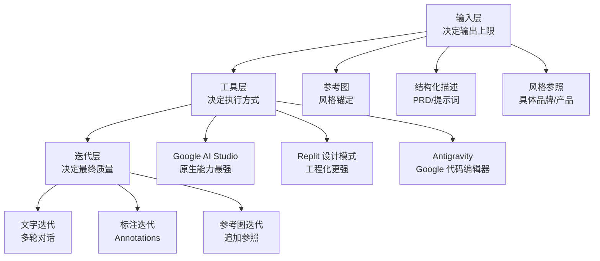

# Gemini 3.0 设计实测：AI 设计工具的质量拐点已经到了

## 一句话导读

AI 设计工具的瓶颈不再是"能不能做出来"，而是你能不能说清楚自己想要什么。

## 适合谁看

- 想做产品但请不起设计师的独立开发者
- 用过 vibe coding 工具但总觉得产出"差点意思"的人
- 需要快速验证产品想法的产品经理或创业者
- 想了解 Google AI Studio + Gemini 3.0 设计能力边界的人
- 对 AI 设计工作流感兴趣、想知道如何拿到高质量产出的人

## 读完你会获得什么

- 理解 AI 设计工具从"能出图"到"能出好图"的关键变化是什么
- 掌握用 Gemini 3.0 在 Google AI Studio 中做设计的完整流程
- 知道什么样的输入（提示词、参考图、PRD）能产出什么样的设计
- 分清 Google AI Studio、Antigravity、Replit 等工具的设计能力差异
- 能避掉"给一句模糊提示就指望产出好设计"的常见坑
- 有一份可直接照做的实战行动清单

---

## 01 背景：为什么这个问题现在值得讨论

一年前，用 AI 做 UI 设计，结果基本是同一个模子刻出来的——紫色渐变、Tailwind 默认样式、看着像模板而不是产品。这是"vibe coding"早期最被人诟病的地方：功能能跑，但设计没法看。

2026 年，情况变了。Google 推出 Gemini 3.0 Pro，内置在 Google AI Studio 的 Build 模式中，可以直接生成带交互的完整 Web 应用。Replit 也上线了基于 Gemini 3.0 的设计模式。Google 自己的代码编辑器 Antigravity 正在公测。

这意味着一件事：**AI 设计工具的能力已经跨过了一个质量门槛。** 以前的问题是"AI 能不能做出设计"，现在的问题是"你能不能让 AI 做出好设计"。输入质量成了新的瓶颈。

这篇文章要回答的核心问题就是：**在当前工具条件下，普通人能做到什么程度的设计？拿到好结果的关键变量是什么？**

---

## 02 核心判断：设计民主化的真正瓶颈已经转移

视频表面上在评测 Gemini 3.0 的设计能力——个人网站打了 9 分，SaaS 仪表盘打了 8.5 分，移动端 App 打了 8 分。

但真正值得注意的判断是：**AI 设计工具的质量拐点已经到了，但这个拐点不是工具自动变强带来的，而是"参考图 + 精准描述"这套输入方法成熟后带来的。**

换句话说，工具已经够用了。差的是人的输入。

视频中的三个案例，产出质量差异的根本原因不是工具波动，而是输入精度的差异。个人网站给了网站截图 + 风格指令（Windows XP），产出最惊艳；SaaS 仪表盘给了 Dribbble 参考图 + 实物产品照片（Teenage Engineering），产出很有调性；移动端 App 只给了 App Store 预览图，产出虽好但交互细节不足。

**核心规律：输入的精准度和信息密度，直接决定输出的设计质量。**

---

## 03 概念澄清：先把关键名词讲准确

### Google AI Studio

- 它是 Google 提供的 AI 开发平台，可以在浏览器中使用 Gemini 系列模型
- 它的 Build 模式可以让你用自然语言 + 参考图直接生成可运行的 Web 应用
- 它不是代码编辑器，也不是设计工具（如 Figma），而是一个"对话式应用生成器"
- 和 Replit 的区别：Google AI Studio 是模型的原生界面，输出更贴近模型能力上限；Replit 是集成环境，加了额外的工程化封装
- 类比：如果你把 Gemini 3.0 当成一位设计师，Google AI Studio 就是你和这位设计师对话的房间

### Gemini 3.0 Pro

- Google DeepMind 的最新多模态模型，支持文本、图像、代码的输入和输出
- 在设计场景中的核心能力：理解参考图、生成完整 React + Tailwind 应用、支持多轮迭代
- 它不是专门的设计模型，而是通用模型在设计任务上的表现
- 和 Claude、ChatGPT 在设计场景中的差异：Gemini 3.0 在 Google AI Studio 中有原生 Build 模式，能直接输出可运行的应用，而不只是代码片段

### Vibe Coding / Vibe Design

- Vibe Coding：用自然语言描述需求，让 AI 生成代码，主打"不用写代码就能做产品"
- Vibe Design：同样的逻辑，但聚焦在设计层面——用自然语言 + 参考图描述设计意图，让 AI 生成视觉方案
- 它们不是一种技术，而是一种工作方式：人提供方向和品味，AI 提供执行
- 常见误解：Vibe Design 不是"随便说一句让 AI 自由发挥"，而是"用自然语言精准传达设计意图"

### PRD（Product Requirements Document）

- 产品需求文档，描述产品要解决什么问题、目标用户是谁、核心功能是什么
- 在 AI 设计场景中，PRD 是给模型的"需求说明书"——你给的信息越结构化，输出越贴合预期
- 它不是技术文档，而是产品逻辑文档
- 类比：如果你请设计师做方案，PRD 就是你的设计简报（design brief）

### Annotations（标注功能）

- Google AI Studio Build 模式中的功能，允许你在应用预览上直接画框、写批注
- 输入方式从纯文字变成"视觉 + 文字"，可以精准指出哪里需要改、改成什么样
- 它不是截图标注工具，标注内容会直接作为上下文传给 Gemini 模型
- 实际效果：比纯文字反馈更直观，但仍然依赖你能否说清改什么

---

## 04 整体框架：AI 设计工作的三层模型

**文字解释：**

AI 设计的工作质量取决于三个层级的叠加效果。

**输入层**是根基。参考图决定了风格的锚点，结构化描述（PRD 或详细提示词）决定了功能的完整性，风格参照（具体品牌或产品名）决定了调性的精准度。三个变量同时给齐，产出基本不会差。少给任何一个，质量就会打折。

**工具层**是执行通道。同一个 Gemini 3.0 模型，在不同工具中的表现不同。Google AI Studio 是模型的原生界面，设计输出最贴近模型能力上限。Replit 加了工程化封装，方便部署但设计自由度受限。Antigravity 目前在设计场景的表现还不如直接用 AI Studio。

**迭代层**是质量放大器。一次生成很难完美，关键是迭代方式。文字迭代最通用但精度最低，标注迭代精度更高但功能有限，追加参考图迭代效果最好但成本最高。

三层共同决定了最终产出。**大多数人卡在输入层就跳到了工具层，然后用迭代层补救——这效率很低。** 正确做法是在输入层做足准备。

---

## 05 关键机制：参考图如何决定设计输出

这是整个视频中最值得深挖的机制。

### 输入：参考图 + 文字描述

Google AI Studio 的 Build 模式接受两类输入：图片（截图、参考设计、实物照片）和文字（需求描述、风格指令、PRD）。

### 处理：Gemini 如何理解参考图

Gemini 3.0 是多模态模型，它不是简单地"看到图片风格然后模仿"，而是从图片中提取多个维度的信息：

- **视觉风格**：配色、排版、圆角、阴影、留白
- **交互模式**：按钮位置、导航结构、信息层级
- **调性**：专业感、趣味感、极简感、复古感

这些维度会被融合到生成的代码中。所以当你给一张 Teenage Engineering 的产品照片，它不只是抄颜色，而是试图把那种"物理旋钮、精密仪表"的调性转化成 UI 语言。

### 输出：可运行的 React 应用

Gemini 生成的不只是设计稿，而是一个完整的 React + Tailwind CSS 应用。这意味着：

- 生成即可交互，不是静态截图
- 可以直接在浏览器中体验布局和动效
- 代码可以下载和二次修改

### 为什么要这样设计

这是 Google 和其他 AI 设计工具的一个关键差异点。生成可运行应用而不是设计稿，是因为：

- 设计稿到代码的转化本身是损耗最大的环节
- 让用户直接体验交互，比看静态图更能判断设计好坏
- 减少了"设计-开发"之间的沟通损耗

### 带来了什么代价

- 生成时间较长（完整网站约 111 秒，修改背景约 136 秒）
- 生成的代码不一定干净，二次修改成本可能很高
- 交互细节（如拖拽）可能不完整
- 对移动端的原生支持有限（生成的是 Web 应用，不是原生 App）

### 适合/不适合的场景

**适合：** 快速验证产品想法、做个人项目、做概念原型、做展示 Demo

**不适合：** 生产级应用、需要精细动效的场景、需要原生移动端体验的场景、对代码质量有严格要求的团队

---

## 06 方法拆解：用 Gemini 3.0 做设计的完整流程

### 第一步：准备参考图

**目标：** 为你的设计找到一个风格锚点。

**具体动作：**
1. 去 Dribbble、Behance、Pttrns 等设计社区搜索你要做的产品类型（如"SaaS dashboard""mobile fitness app"）
2. 找 1-3 张你真正喜欢的设计截图，注意要能说清为什么喜欢
3. 如果有特定的品牌调性参考（如 Teenage Engineering、Apple、Notion），准备该品牌的实物或界面照片
4. 如果你已经有现有产品截图，也准备好——模型可以基于现有内容做风格升级

**判断标准：** 你拿着这张图能对朋友说"我想要类似这种感觉的"，而不是"大概就是好看那种"。

**常见坑：** 只给文字不给图。视频中的三个案例都给了参考图，这是产出质量高的直接原因。纯文字描述风格，模型只能从训练数据中取平均值，结果就是"紫色 Tailwind 应用"。

**产出物：** 1-3 张参考图，保存到剪贴板或本地。

### 第二步：编写设计提示词

**目标：** 用自然语言把设计意图结构化表达出来。

**具体动作：**
1. 说明产品是什么（"一个面向餐厅的 AI 分析 SaaS"）
2. 说明风格方向（"像 Teenage Engineering 的产品设计"，"Windows XP 的视觉风格"）
3. 说明关键设计元素（"按钮要有物理感，像真实世界的旋钮"）
4. 说明参考图的关系（"我附了一张 Dribbble 上的 SaaS 仪表盘截图，我想在这个调性上做"）

**判断标准：** 一个不认识你的人读完这段话，能画出和你脑海相近的东西。

**常见坑：** 给太少信息（"做个好看的网站"）或给太多矛盾信息（"极简但又要丰富"）。视频中的个人网站案例就是给的信息偏模糊（"更色彩、更清新、更有趣"），但靠 Windows XP 这个强风格锚点补回来了。

**产出物：** 一段 3-5 句话的设计描述。

### 第三步：在 Google AI Studio 中生成

**目标：** 获得第一版可交互的设计产出。

**具体动作：**
1. 打开 [Google AI Studio](https://aistudio.google.com)，进入 Build 模式
2. 选择 Gemini 3.0 Pro 模型
3. 上传参考图 + 粘贴提示词
4. 点击生成，等待模型完成（通常 1-3 分钟）
5. 在右侧预览区域查看生成结果

**判断标准：** 整体风格是否和参考图调性一致？核心功能是否被呈现？交互是否基本可用？

**常见坑：** 生成完后急着做小修改，忽略了整体方向是否对。如果整体方向不对（比如风格完全偏离），应该重新生成而不是在错误方向上迭代。

**产出物：** 第一版可交互的应用。

### 第四步：用标注功能做精准迭代

**目标：** 精准修改不满意的局部，而不是推翻重来。

**具体动作：**
1. 点击预览区域的 Annotations 按钮
2. 在需要修改的区域画框或添加文字批注（如"这个白色背景太无聊，换成 XP 经典蓝天绿地"）
3. 将标注添加到对话中，让模型理解你要改什么
4. 等待模型重新生成对应部分

**判断标准：** 修改是否精准命中你标注的区域？是否保持了其他部分不变？

**常见坑：** 视频中的实际案例——让模型把白色背景换成 XP 的蓝天绿地，结果背景改了但图标被破坏了。**标注迭代的精度有限，改一个区域可能会影响其他区域。** 如果修改范围大，考虑重新生成而不是局部修改。

**产出物：** 迭代后的应用版本。

### 第五步：评估是否需要更多轮迭代或换方向

**目标：** 判断当前产出是否值得继续迭代，还是应该换方向重来。

**具体动作：**
1. 对比产出和你的初始期望，列出不满意的点
2. 判断这些点是"可以迭代修复的"还是"方向性错误"
3. 如果是前者，继续用标注或文字迭代
4. 如果是后者，重新准备参考图和提示词，重新生成

**判断标准：** 如果迭代 3 轮还没有明显改善，大概率是输入层的问题，不是迭代能救的。

**常见坑：** 在一个错误方向上死磕迭代，浪费大量时间。记住：**输入层决定上限，迭代层只是逼近上限。**

**产出物：** 可交付的设计原型，或重新开始的决定。

---

## 07 案例讲解：三个设计任务的质量差异拆解

视频做了三个设计任务，我用统一框架拆解它们，看看到底是什么变量导致了产出差异。

### 案例 1：个人网站 → Windows XP 风格 | 评分 9/10

**场景背景：** Greg Isenberg 有一个个人网站，功能齐全但设计普通——标准的 About 页面，带链接到 Newsletter、指南、播客、投资组合。他想让它变得更有记忆点。

**输入分析：**
- 参考图：现有网站截图 ✅
- 风格锚点：Windows XP ✅（这是决定性的强锚点）
- 内容来源：提供了域名 eiseberg.co ✅
- 功能描述：模糊，"更有色彩、更清新、更有趣" ⚠️

**产出亮点：**
- 模型自动从原网站抓取了文案（"The internet is my playground"）
- 把网站功能映射成 XP 的"应用程序"（About、Greg's Letter、Guides），每个可点击打开
- 图标在第一版不够好，但一轮文字反馈后就修复了
- 移动端居然也能正常显示

**为什么得分最高：** Windows XP 是一个极度明确的风格锚点——配色、窗口、任务栏、字体，模型训练数据中有大量 XP 界面。这等于给模型画了一条非常窄但非常清晰的走廊，它几乎不可能跑偏。

### 案例 2：SaaS 仪表盘 → Teenage Engineering 风格 | 评分 8.5/10

**场景背景：** 设计一个面向餐厅的 AI 分析 SaaS 的仪表盘。

**输入分析：**
- 参考图：Dribbble 上的 SaaS 仪表盘截图 ✅ + Teenage Engineering 实物产品照片 ✅
- 风格锚点：Teenage Engineering ✅ + "按钮要有物理感" ✅
- 功能描述：简略，"AI 分析 + 餐厅" ⚠️
- 产品名称：模型自主生成了"Gains"（后续移动端案例也用了这个名字）

**产出亮点：**
- 按钮设计真的有 Teenage Engineering 的物理旋钮感
- 布局参考了 Dribbble 截图的层次结构
- 内置了模拟数据（"14 active tables, average ticket size"），像一个可卖的产品
- 有微动效

**扣分点：** 拖拽交互不完整（窗口可以点击但不能自由拖动），模型没有拿到完整 PRD 所以功能较浅。

**关键发现：** 给两张不同类型的参考图（一张 UI 截图 + 一张实物照片），模型能够做跨域融合——从 UI 截图取布局，从实物照片取调性。这是人很难直接描述的，但模型能做到。

### 案例 3：移动端 App → Brainrot 风格健身应用 | 评分 8/10

**场景背景：** 仿照 Brainrot App 的设计语言，做一个"健身版 Brainrot"。

**输入分析：**
- 参考图：Brainrot 的 App Store 预览图 ✅
- 风格锚点："Brainrot 的吉祥物、游戏化、暖色调" ✅
- 功能描述：较清晰（"帮助用户健身，有吉祥物、游戏化机制"）✅
- 平台要求：明确说"iOS App" ✅

**产出亮点：**
- 模型自主生成了名字"Gains"——一个很好的名字
- 吉祥物设计符合 Brainrot 的风格
- 有打卡日历、活动追踪、贡献者排行等游戏化功能
- 整体设计感很好

**扣分点：** 交互功能不完整（点击按钮无响应，无法实际打卡），设置页缺失。这是因为 Gemini 3.0 在 AI Studio 中生成的是 Web 应用，不是原生 iOS App——它无法直接生成 Swift/SwiftUI 代码。

**关键发现：** 移动端设计是 AI 设计工具目前最薄弱的环节。如果做移动端是核心需求，应该考虑专门做移动端的工具（如 Ro、Vibe Code App、Create Anything）。

---

## 08 常见误区

### 误区 1："AI 设计工具 = 一句话出好设计"

**错误理解：** 我只要说"做个好看的网站"，AI 就能给我一个满意的结果。

**为什么错：** 模型在缺少约束时会从训练数据中取统计平均值，产出就是"最像大多数网站"的网站——紫色渐变、默认 Tailwind、无记忆点。

**正确理解：** AI 设计工具的价值在于执行，不在于决策。风格决策、内容决策、交互决策都必须由你来做。

**应该怎么做：** 每次给提示前，问自己：如果我对一个人说同样的话，他能画出我想要的东西吗？如果不能，你的提示就不够。

### 误区 2："迭代能解决一切问题"

**错误理解：** 第一版不好没关系，多迭代几轮就好了。

**为什么错：** 迭代只能逼近输入层设定的上限。如果输入是模糊的，上限本身就低，迭代只是在低上限附近反复打转。

**正确理解：** 迭代是微调工具，不是方向工具。方向错了，迭代只会让你在错误方向上走得更远。

**应该怎么做：** 第一版产出如果整体方向不对，先回到输入层重新准备，而不是急着迭代。

### 误区 3："给越多参考图越好"

**错误理解：** 我给 10 张参考图，模型就能综合出最好的设计。

**为什么错：** 参考图之间如果有冲突（一个极简、一个繁复），模型会不知所措，产出变成四不像。

**正确理解：** 参考图贵精不贵多。1-2 张方向一致的参考图，比 10 张互相矛盾的图效果好得多。

**应该怎么做：** 所有参考图应该指向同一个风格方向。如果风格方向还没想清楚，先想清楚再给图。

### 误区 4："AI Studio 和 Replit/Antigravity 效果一样"

**错误理解：** 都是 Gemini 3.0，在哪个工具里用效果一样。

**为什么错：** 同一个模型在不同工具中的表现差异很大。AI Studio 是原生界面，模型的设计输出最完整。Replit 加了工程化封装，设计自由度受限。Antigravity 目前设计能力还不如 AI Studio。

**正确理解：** 如果追求设计质量上限，去 AI Studio。如果追求工程完整性和部署便利，去 Replit。

**应该怎么做：** 先在 AI Studio 中验证设计方向，再用你习惯的工程化工具实现。

### 误区 5："生成的代码可以直接用于生产"

**错误理解：** AI 生成的是一个完整应用，我可以直接上线。

**为什么错：** 生成的代码是 React + Tailwind 的原型代码，代码质量不一定达到生产标准。动效、状态管理、错误处理、响应式细节都可能不完整。

**正确理解：** AI 生成的应用是高保真原型，不是生产代码。它的价值是快速验证设计方向和交互逻辑。

**应该怎么做：** 把 AI 产出当作设计稿而非代码库。确认设计方向后，再由工程师或你自己重写生产级代码。

### 误区 6："AI 设计 = 不需要设计师"

**错误理解：** AI 这么强了，设计师可以不用请了。

**为什么错：** 视频中的案例恰恰说明，好的设计产出依赖好的输入——而好的输入本身需要设计品味。品味不是"我觉得好看"，而是能判断什么风格适合什么产品、什么交互符合什么用户心理。这是设计师的核心能力。

**正确理解：** AI 设计工具替代的是设计的执行环节，不是设计的决策环节。品味的价值反而被放大了。

**应该怎么做：** 把 AI 当成你的设计执行搭档。你来决策，它来执行。如果你没有设计品味，先培养品味——多看好设计、多分析为什么好，而不是急着用工具。

### 误区 7："标注迭代比文字迭代一定更好"

**错误理解：** 有了 Annotations 功能，就不用写文字反馈了，画框就行。

**为什么错：** 视频中实际测试的结果——用标注要求改背景，背景改了但图标被破坏。标注只告诉了模型"改这里"，但没有告诉模型"别动那里"。

**正确理解：** 标注迭代的精度比文字高，但副作用也更大。局部修改可能引发全局影响。

**应该怎么做：** 标注和文字结合使用。标注指出位置，文字说明约束（"改背景，但保持图标不变"）。

---

## 09 实战清单：读完后可以马上照着做

### 立即能做

1. **整理你的参考图库：** 花 30 分钟去 Dribbble、Behance、Pttrns 收集 10-20 张你真正喜欢的设计截图，按类型分类（SaaS、移动端、个人网站），下次做设计时直接用
2. **打开 Google AI Studio 跑一遍个人网站：** 用你自己的网站截图 + 一个明确的风格锚点（某个操作系统、某个品牌、某个时代的设计语言），感受一次完整流程
3. **写一份最小 PRD：** 用 5-8 句话描述你手上的项目——问题是什么、用户是谁、核心功能是什么、风格方向是什么。下次给 AI 提示时直接贴进去

### 一周内能做

4. **对比测试输入精度对产出的影响：** 同一个产品想法，用三个不同精度的输入分别生成——(a) 只有一句话描述，(b) 有描述 + 一张参考图，(c) 有 PRD + 两张参考图 + 品牌风格锚点。对比产出质量差异，建立你的直觉
5. **测试标注迭代和文字迭代的差异：** 用同一个设计做两轮修改——一轮纯文字，一轮用 Annotations。记录哪种方式对你更高效
6. **评估你的设计是否值得用 AI 做原型：** 列出你手上 3 个需要设计的项目，判断哪些适合用 AI 快速出原型（概念验证类），哪些必须找专业设计师（生产级产品类）

### 长期要沉淀

7. **建立你的风格参考系统：** 维护一个 Notion 或 Obsidian 页面，记录"我喜欢的风格 + 为什么喜欢 + 什么时候用"。这不是审美收藏夹，而是设计决策的工具箱
8. **培养设计品味的方法论：** 每周花 1 小时分析 3 个你喜欢的产品的设计——不只说"好看"，而要说清楚配色方案是什么、信息层级如何、交互模式是什么、调性关键词是什么
9. **跟踪 AI 设计工具的进化节奏：** 每月花 30 分钟测试一次主流工具（AI Studio、Replit、Bolt、v0 等）的设计能力变化。工具迭代很快，3 个月前的判断可能已经过时

---

## 10 总结

AI 设计工具在 2026 年初跨过了一个实实在在的质量拐点。这不是营销话术——用 Gemini 3.0 Pro 在 Google AI Studio 中，一个没有设计背景的人，凭一张参考图和一个明确的风格锚点，可以在两分钟内得到一个让人惊讶的可交互原型。个人网站、SaaS 仪表盘、移动端 App，三个品类都跑通了。

但这个拐点的本质不是工具变强了那么简单。它更准确的描述是：**工具的能力已经超过了大多数人输入的质量。** 你不再需要担心 AI 画不出来，你需要担心的是自己说不清楚。

视频中最有价值的方法发现是：参考图才是决定产出质量的第一变量。文字描述划定功能边界，参考图锁定风格方向，两者叠加才能让模型走出"紫色 Tailwind 默认值"的泥潭。Windows XP、Teenage Engineering、Brainrot——三个风格锚点，三个超出预期的产出。这不是巧合，这是机制。

设计民主化的下一阶段，竞争焦点不是"谁的模型更强"，而是"谁更能说清楚自己想要什么"。品味、参照、结构化表达——这些过去是设计师的隐性知识，现在成了每个人都需要掌握的显性技能。

**AI 让设计的执行门槛趋近于零，但决策门槛一点也没降。反而因为执行不再是瓶颈，决策的重要性被放大了。**
