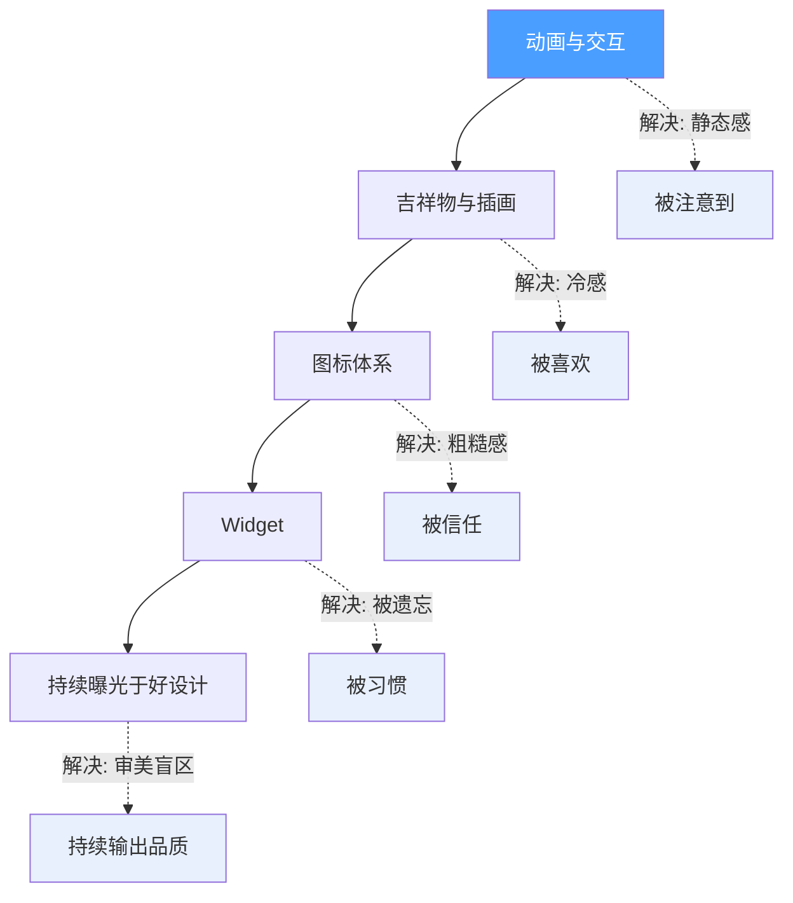

# 当任何人都能 24 小时做出 App，什么决定了它能不能活下来

一句话导读：AI 让编码不再是瓶颈，设计细节才是独立开发者在拥挤市场中突围的唯一杠杆。

## 适合谁看

- 正在用 AI 工具独立开发移动应用的个人开发者
- 有产品想法但不知道如何让 App「看起来不像 AI 生成的」的创业者
- 负责小团队产品交付、需要在有限资源内提升品质的产品经理
- 刚入门移动开发、想做一款让自己骄傲的作品的学习者
- 内容创作者或独立开发者，想验证想法是否值得投入之前先测试市场反应

## 读完你会获得什么

- 理解为什么「功能相同、交互不同」的两个产品，市场反响可以差 100 倍
- 掌握 5 个可独立落地的设计维度，每个都有具体方法和工具
- 学会用「概念视频社交验证法」——不写代码就能测试产品方向
- 知道如何用 AI 工具实现过去需要专业设计师才能做的动画、插画和 Widget
- 拿到一份从设计资源到行动步骤的完整清单，读完就能开始动手

---

## 01 背景：为什么这个问题现在值得讨论

两个事实正在同时发生。

第一，开发门槛暴跌。借助 Claude Code、Cursor、Lovable 这类工具，一个没有编程经验的人可以在 24 小时内做出一个功能完整的移动应用。这不是预测，是每天都在发生的事。应用商店每天涌入数百款新应用，其中大量是 AI 辅助生成的。

第二，用户的识别能力在上升。就像人们学会了识别 AI 生成的图片和视频一样，用户也开始能分辨一个 App 是精心打磨的还是 24 小时赶工出来的。最明显的信号是什么？**静态感**。页面没有过渡、按钮没有反馈、列表没有动效、空状态没有插画——这些缺失暴露了应用的生产方式。

当编码不再是稀缺能力，什么才是？这是这篇文章要回答的问题。

---

## 02 核心判断：视频真正想讲的不是「如何设计好看的应用」

视频的表层内容是：给独立开发者分享 5 个让 App 更精致的设计技巧。但背后真正的判断是——

**在 AI 编码时代，设计细节不是锦上添花，而是产品能否被感知到的唯一门槛。**

Chris 在视频中用一组对比数据证明了这个判断：同一天、同一个概念、同一个开发者发布的两条推文，一条获得近千赞和 800 个等待名单注册，另一条只有 7 个赞。唯一的区别是第二条缺少精心设计的动画和交互细节。

这意味着：用户选择的不是功能更好的产品，而是**感觉更好的产品**。功能是基础条件，感觉才是决胜因素。

---

## 03 概念澄清：先把关键名词讲准确

### 动画与交互（Animations & Interactions）

- **它是什么**：界面元素在状态变化时的运动反馈，包括页面切换滑动、按钮点击缩放、加载状态的渐变动画等
- **它解决什么问题**：消除应用的「静态感」，让用户感知到产品有人打磨过，而非机器批量生成
- **它不是什么**：不是装饰性的炫技动效，不是为了动而动。好的动画几乎不被用户有意识地注意到，但删掉它会立刻感到「哪里不对」
- **和相关概念的区别**：交互是用户触发后的响应逻辑（点击→展开），动画是响应过程中的视觉运动（展开时从左滑入带弹性）。交互决定「做什么」，动画决定「怎么感觉」
- **例子**：iOS 通讯录切换页面是瞬间跳转，而 Chris 在预算应用中加入了页面左右滑动的过渡——用户说不出哪里不同，但觉得「就是比别的预算 App 舒服」

### 吉祥物与插画（Mascots & Illustrations）

- **它是什么**：赋予应用人格化的视觉角色，以及用于空状态、引导页等场景的定制插图
- **它解决什么问题**：在纯功能界面中注入情感温度，尤其在 AI 驱动的应用中，吉祥物让用户感觉在「和谁对话」而非「操作什么系统」
- **它不是什么**：不是随意生成的一个卡通形象。没有一致性的人设和应用场景配合，吉祥物只是噪音
- **和相关概念的区别**：Icon 是功能标识（点击触发操作），吉祥物是情感锚点（让用户记住和喜欢这个产品）
- **例子**：Chris 的 AI 日程应用中，吉祥物 Lily 是一只幽灵，在搜索空状态时拿着放大镜——用户看到的是「Lily 在帮我找」，而不是冷冰冰的「无结果」

### 图标体系（Iconography）

- **它是什么**：应用内所有功能图标的风格选择与一致性管理
- **它解决什么问题**：图标风格的一致性直接影响应用的专业感。混用不同风格的图标是「赶工感」的最强信号
- **它不是什么**：不是「选好看的图标」这么简单。同一套图标库中选择线条风格还是填充风格，选中态和未选中态如何区分，这些才是关键
- **和相关概念的区别**：图标体系关注的是风格一致性和状态逻辑，排版（Typography）关注的是文字的层级和可读性，两者共同构成视觉基础
- **例子**：底部导航栏中，未选中的 Tab 使用线条图标（Outlined），选中的 Tab 切换为填充图标（Filled）。如果其中某个 Tab 混用了相反风格，用户可能说不出来，但会本能地觉得「这应用不太对」

### Widget（桌面小组件）

- **它是什么**：在 iOS 主屏幕、锁屏界面或 Apple Watch 上展示应用信息的小组件
- **它解决什么问题**：双重价值——对用户是便利（不用打开 App 就看信息），对开发者是留存利器（占据屏幕位置 = 持续提醒用户你的存在）
- **它不是什么**：不是简单的信息展示。锁屏 Widget 最多只有 4 个位置，能占据其中一个意味着你的应用获得了每天至少 150 次的曝光机会
- **和相关概念的区别**：推送通知是「打断式」提醒（可能被关掉），Widget 是「陪伴式」存在（安静地占据注意力）
- **例子**：Chris 的日程应用 Widget 显示剩余任务数，预算应用 Widget 显示今日支出。用户每次亮屏都会看到——这种存在感是任何推送通知做不到的

---

## 04 整体框架：让应用脱颖而出的五维模型

这五个维度不是并列的装饰清单，而是一个从「被注意到」到「被记住」的递进结构：

**动画与交互**解决的是第一印象问题——用户打开应用的 3 秒内，潜意识就在判断「这东西有没有人认真做过」。**吉祥物与插画**解决的是情感连接问题——用户记住的不是功能列表，而是在使用过程中产生的感受。**图标体系**解决的是专业感问题——这是最容易做对、也最容易做错的细节，混用图标风格会瞬间摧毁信任。**Widget**解决的是留存问题——应用被下载后最大的敌人不是竞品，而是遗忘。**持续接触好设计**是前四项的元能力——没有审美输入，就没有审美输出。

这五个维度的投入产出比不同。动画与交互的杠杆最高——同样的功能，加一层动画可能就是病毒传播和无人问津的区别。Widget 的留存杠杆最高——一旦占据用户主屏幕，卸载率会显著下降。

---

## 05 关键机制：为什么这些细节能产生不成比例的效果

### 机制一：「感觉更好」的心理学底层

- **输入**：用户使用功能相同的两个应用 A 和 B，A 有精心设计的微交互，B 没有
- **处理过程**：人脑对「流畅感」的偏好是进化性的。微动画降低了认知负荷——页面滑动代替瞬间跳转，让大脑有时间建立空间映射；按钮反馈代替无响应，让操作获得确认感。这些处理在意识层面之下发生
- **输出**：用户给 A 更高的评价，即使无法说出具体原因
- **为什么这样设计**：人类对「有意图的运动」极度敏感——我们能从风中树叶的摇动判断风向，从对方眼神的微小移动判断情绪。界面的微动画触发了同样的感知通道，传递的信号是「有人在控制这个系统」
- **代价**：过度动画会让应用变慢。每增加一层动效，就必须权衡延迟感。好动画的标准是「删掉后用户才会注意到」
- **适合场景**：用户会反复使用的核心流程（列表滚动、页面切换、状态确认）。不适合一次性操作或高频重复操作（如快速翻页）

### 机制二：社交验证飞轮

- **输入**：一个精心打磨的概念演示视频（不是完整产品，是可交互的原型或概念动画）
- **处理过程**：发布到社交媒体 → 精致的视觉细节引发设计师和用户的自发传播 → 等待名单 / 早期用户积累 → 根据反馈决定是否投入完整开发
- **输出**：在写一行代码之前（或只写了少量代码时），获得市场信号
- **为什么这样设计**：Chris 的卡路里追踪应用本来只是一个 24 小时的实验项目——他在测试 Apple 的新设计框架时随手做的。但当概念视频在 Twitter 上获得数百个等待注册时，他意识到这是一个被验证的需求。传统路径是「做完整产品→发布→看数据」，新路径是「做精致概念→发社交媒体→看反应→再决定是否做完整产品」
- **代价**：概念视频可能过度承诺——展示的交互在实际开发中可能难以完全还原。需要在「足够精致以引发兴趣」和「可实现以避免失望」之间找平衡
- **适合场景**：竞争激烈的品类（卡路里追踪、预算管理、日程规划）。在这些品类中，差异化不来自功能，来自感受。不适合功能完全未被验证的全新品类——那种情况下用户不知道要看什么

### 机制三：Widget 留存增强

- **输入**：用户下载了你的应用
- **处理过程**：引导用户添加主屏幕 / 锁屏 Widget → Widget 每次亮屏时展示关键信息 → 用户无需打开 App 就获得价值 → 每次看到 Widget 都是一次「这个应用有用」的隐性提醒
- **输出**：留存率显著提升。Chris 报告添加 Widget 后留存率翻倍以上
- **为什么这样设计**：手机主屏幕是注意力最稀缺的房地产。锁屏只有 4 个 Widget 位置，主屏幕每个格子都是用户主动选择放置的。占据一个位置 = 用户做了一个承诺行为，而人会倾向于与自己的承诺保持一致
- **代价**：Widget 开发和维护需要额外工作量。但 AI 工具已将这个成本从 1-2 周降到 4-5 小时
- **适合场景**：有高频查看需求的数据型应用（支出、任务、卡路里、天气）。不适合低频使用的工具型应用

---

## 06 方法拆解：如果自己要做，应该怎么落地

### 第一步：用动画与交互消除静态感

**目标**：让应用的核心流程有流畅的状态过渡，去除「瞬间跳转」和「无响应」的感觉。

**具体动作**：

1. 识别应用中所有页面切换点，为每个切换添加滑动过渡（而非瞬间出现）
2. 识别所有异步操作（加载、搜索、计算），为等待状态添加动态指示（旋转渐变、脉冲动画、「搜索中...」文字配微动效）
3. 识别所有按钮点击和状态切换，添加触觉反馈（Haptic）和视觉反馈（缩放、颜色变化、图标旋转）

**判断标准**：录屏后以 0.5 倍速回看。如果每一处状态变化都有运动感，说明够了。如果有任何瞬间跳变，说明还缺。

**常见坑**：动画时长超过 300ms 用户会感到迟钝。大多数微交互的甜蜜区在 150-250ms。

**AI 实现方式**：用自然语言向 AI 编码工具描述期望效果。例如：「当用户点击麦克风按钮时，黑色背景从麦克风图标位置扩展覆盖屏幕，同时发送按钮旋转变为确认按钮」。Chris 实测 Claude Code 对这类交互描述的理解非常准确，因为 Apple 的动画框架文档完整，AI 训练数据充足。

**产出物**：核心流程无静态跳变的应用。

### 第二步：用吉祥物与插画注入人格

**目标**：应用至少有一个空状态或引导页使用定制插画，而非通用图标或空白。

**具体动作**：

1. 确定应用的人格调性（温暖？专业？调皮？），据此选择吉祥物方向
2. **推荐路径**：花 200-300 美元请一位插画师画第一版吉祥物，以此为基础用 ChatGPT/GPT-5 生成变体。如果预算为零，用 ChatGPT 生成初始版本，但务必提供风格参考图（可以是手绘草图、照片、或其他风格的组合），而非只靠文字描述
3. 为以下场景生成插画变体：空状态、加载中、错误提示、引导页每一步
4. 用 Midjourney 的图像动画功能（输入起始帧/结束帧）为吉祥物制作登录页循环动画

**判断标准**：把你的空状态截图和竞品的空状态截图放在一起。如果你的看起来像「有人为它花过心思」，说明够了。

**常见坑**：
- 直接用文字描述让 AI 生成吉祥物，结果缺乏独特性——市场上大量 AI 应用使用几乎相同的插画风格
- 直接复制已有品牌风格——既不道德也可能侵权
- 吉祥物风格与应用调性不匹配——严肃的金融应用放一个卡通恐龙可能适得其反

**产出物**：一组统一的、有辨识度的应用插画资产。

### 第三步：统一图标风格与排版

**目标**：应用内所有图标来自同一图标集，风格一致（线条或填充，不混用），排版层级清晰。

**具体动作**：

1. 从 Heroicons、Font Awesome 或 Nucleo 中选择一套图标集，全应用统一使用
2. 确定规则：未选中状态用线条图标，选中状态用填充图标——严格执行，无例外
3. 排版：花 30 分钟看一个排版基础视频，然后在应用中建立标题、副标题、正文的字号/字重/颜色规范，严格执行

**判断标准**：截图后缩放到 50% 看整体视觉节奏。如果图标风格混乱或文字层级糊成一片，说明还不够。

**常见坑**：AI 编码工具生成的代码经常从不同图标库中混取图标——这是最常见的风格不一致来源。必须在开发早期就明确指定图标库。

**产出物**：视觉一致性合格的应用界面。

### 第四步：添加 Widget

**目标**：至少提供一个主屏幕 Widget 和一个锁屏 Widget。

**具体动作**：

1. 确定 Widget 展示的核心数据（任务数、今日支出、连续打卡天数等）
2. 用 AI 编码工具生成 Widget 代码——Chris 实测 4-5 小时可完成两个 Widget
3. 为 Widget 配置深度链接（Deep Link），点击后直接跳转到应用内对应页面
4. 在首次使用时引导用户添加 Widget（这是关键——不引导，大部分用户不会主动添加）

**判断标准**：添加 Widget 后，用户每次亮屏都能看到你的应用信息。如果是锁屏 Widget，确认它占据了 4 个位置之一。

**常见坑**：Widget 信息过于复杂。锁屏 Widget 的空间极小，只能展示一个核心数据点。塞太多信息反而让用户想移除。

**产出物**：可用的主屏幕 + 锁屏 Widget。

### 第五步：持续输入好设计

**目标**：建立日常设计灵感输入的习惯，持续提升审美判断力。

**具体动作**：

1. 注册 Mobbin（付费，有折扣码可用），每天花 10 分钟浏览高质量应用截图
2. 关注 60fps 和 Spotted Pro，专门看交互和动画案例
3. 关注 Twitter 账号 @screenshotforcompany，学习 App Store 截图的呈现方式
4. 看到喜欢的细节时，录屏慢放拆解——Chris 最初也是看到某个应用「感觉不对」但说不出来，录屏 0.5 倍速回看才发现是页面过渡方式在起作用

**判断标准**：当你能在一秒钟内判断一个应用「有没有被认真打磨过」，你的审美输入就够了。

**产出物**：持续升级的审美判断力——这是前面四步的元能力。

---

## 07 案例讲解：一个卡路里追踪应用的突围路径

**场景背景**：卡路里追踪是移动应用中最拥挤的品类之一。头部竞品月收入数百万美元，每月新增竞品数以千计。选择这个品类做独立开发，常识判断是「别去」。

**遇到的问题**：Chris 的 fiancé 看到他宣布进入卡路里追踪赛道时，第一反应也是「别做」——竞争太激烈了。

**按框架如何处理**：

1. **动画与交互**：Chris 没有做传统的「搜索食物→选择→记录」流程，而是采用了「Apple Notes 式输入 + AI 自动计算」的新交互范式。在搜索结果区域，他添加了渐变动画的「搜索中...」状态、来源信息逐条下滑的动效。这个概念视频在 Twitter 上获得 800+ 等待名单注册，而前一天发布的同一概念、但缺少这些动画的版本只有 7 个赞。

2. **吉祥物与插画**：他的 fiancé 手绘了应用吉祥物（一只猫），并用 Procrate 制作动画，用于引导页。50 位内测用户中最被夸赞的就是引导页——有人甚至注册了两次就为了再看一遍。

3. **图标体系**：全应用统一使用 Heroicons 的线条/填充风格。

4. **Widget**：主屏幕 Widget 展示每日卡路里摄入，配手绘风格插画。锁屏 Widget 展示连续打卡天数。

5. **游戏化交互**：连续打卡功能配有手绘徽章，徽章解锁后可以像全息贴纸一样用手指拖动——这个效果用 Swift Metal 实现，完全是 AI 生成的代码，Chris 一行没写。

**最终结果**：在竞争最激烈的品类中，一个独立开发者的概念视频获得了病毒式传播，等待名单远超预期，应用正式发布后用户最常说的评价是「就是感觉不一样」。

**说明了什么**：在功能高度同质化的品类中，突围的路径不是「做更多功能」，而是「让同样的功能感觉完全不同」。Chris 没有发明任何新功能——卡路里追踪、连续打卡、徽章奖励这些功能都早已存在。他做的是把这些功能的体验打磨到了让用户愿意多看一眼的程度。而这一眼，就是 7 个赞和 800 个等待名单的区别。

---

## 08 常见误区

**误区一：「功能够好就行，动画是花架子」**

错误理解：只要功能完整、没有 Bug，用户就会选择我的产品。动画是可有可无的装饰。

为什么错：在功能同质化的市场中，用户决策发生在理性判断之前。Chris 的两条推文对比已经证明：完全相同的功能，有无动画可以让市场反响差 100 倍以上。动画不是装饰，是产品被感知到的载体。

正确理解：动画是用户感知产品品质的第一通道。没有动画，功能再好也像毛坯房——住得了，但没人想住。

应该怎么做：把动画当作核心功能的一部分来规划，而不是上线后「有空再加」的可选项。

**误区二：「AI 生成的插画够用了，不需要请设计师」**

错误理解：ChatGPT 能生成插画，直接用就行，不需要花钱请人。

为什么错：当所有人都在用同一个 AI 工具生成插画时，AI 输出的同质化比手工时代更严重。用户已经开始识别「AI 插画风格」——那和识别 AI 生成的文字一样，是一种正在形成的集体直觉。

正确理解：AI 是迭代工具，不是创意起点。请一位插画师做第一版（200-300 美元），再用 AI 生成变体——这样既保证独特性，又获得批量生产力。

应该怎么做：先花钱买独特性，再用 AI 买规模。顺序反了，就和其他人没有区别。

**误区三：「Widget 只是信息展示，不重要」**

错误理解：Widget 是锦上添花的功能，核心还是应用本身的体验。

为什么错：Widget 的价值不在于「展示信息」，而在于「占据注意力」。主屏幕是用户每天查看上百次的界面，每一个 Widget 位置都是一次无声的品牌曝光。锁屏的 4 个位置更是稀缺到极致——能占一个，你的应用就在用户最频繁的视觉路径上获得了固定席位。

正确理解：Widget 是留存工具。Chris 实测添加 Widget 后留存率翻倍以上。这不是偶然——用户每次亮屏看到你的 Widget，就是一次「我还在用这个应用」的隐性确认。

应该怎么做：把 Widget 当作留存策略的核心组件来设计，而不是功能清单里的可选项。

**误区四：「AI 做不了复杂动画和交互」**

错误理解：像全息贴纸、页面弹性滑动这种效果太复杂，AI 工具肯定做不了。

为什么错：Apple 的动画框架（SwiftUI、Swift Metal）文档非常完整，AI 训练数据充足。Chris 用自然语言描述了「全息贴纸效果，手指拖动时贴纸随角度变化反光」——Claude Code 一次生成，一行手写代码都没有。

正确理解：AI 对 Apple 生态的动画能力远超大多数人的预期。关键不是 AI 能不能做，而是你能不能用自然语言准确描述你想要什么效果。

应该怎么做：先拆解效果描述——动作（旋转/滑动/缩放）+ 触发条件（点击/长按/滑动）+ 物理属性（弹性/阻尼/速度）。把这三要素组合成自然语言，AI 就能理解。

**误区五：「App Store 截图是最后的事，先把产品做好再说」**

错误理解：截图只是展示界面的辅助材料，等应用做完再随便截几张就行。

为什么错：App Store 截图是用户接触你的产品的第一个界面。如果截图看起来粗糙，用户不会下载——连体验的机会都没有。Chris 引用了一个精准的类比：对 YouTuber 来说，标题和封面决定了视频会不会被点击；对开发者来说，App Store 截图决定了应用会不会被下载。

正确理解：App Store 截图是转化漏斗的第一关。投入在截图上的每一分钟，都直接转化为下载量。

应该怎么做：在开发过程中就同步设计截图策略，而不是上线前临时截几张屏。关注 @screenshotforcompany 学习高质量截图的呈现方式。

**误区六：「好的设计需要好的审美天赋，我没有」**

错误理解：设计感是天赋，不是后天习得的。

为什么错：Chris 明确说了他提升设计能力的唯一方法：持续接触好设计。每天花 10 分钟在 Mobbin 上浏览高质量应用截图，看 60fps 上的交互案例，慢放拆解你觉得「感觉不对但说不出来」的细节。审美是可以训练的，前提是你得有足够的输入。

正确理解：设计判断力是暴露量驱动的技能。看 1000 个好设计之后，你会本能地知道什么是好的。

应该怎么做：把「每天 10 分钟浏览设计资源」当作和「每天写代码」一样的基本习惯。

---

## 09 实战清单：读完后可以马上照着做

### 立即能做

- [ ] 录屏你当前应用的核心流程，0.5 倍速回看，标记所有「瞬间跳变」的地方——这些就是你缺少动画的位置
- [ ] 检查应用内所有图标，确认它们来自同一套图标集，未选中 / 选中状态风格统一。如未统一，立即指定一套图标库（推荐 Heroicons）
- [ ] 为应用的空状态页面设计插画或吉祥物方案，而非只显示「暂无数据」文字
- [ ] 花半小时看一个排版基础视频，然后检查你的标题 / 副标题 / 正文的字号和字重是否有清晰层级

### 一周内能做

- [ ] 用 AI 编码工具为标记出的「瞬间跳变」位置添加过渡动画（滑动、渐变、弹性缩放等）
- [ ] 用 ChatGPT 生成应用吉祥物的 5-10 个变体，选择最合适的一个，为 3 个核心场景（空状态、加载中、引导页）生成插画
- [ ] 用 AI 编码工具生成一个主屏幕 Widget，展示应用的核心数据点
- [ ] 制作一个概念演示视频（30 秒以内），展示你的应用最有特色的交互，发布到社交媒体测试反应

### 长期要沉淀

- [ ] 建立「每日 10 分钟设计浏览」习惯——Mobbin + 60fps + Spotted Pro 轮换
- [ ] 建立个人设计灵感库——看到好的交互细节就录屏归档，定期回看拆解
- [ ] 为每个新项目建立设计规范文档：图标集、字体层级、动画时长、品牌色——在写第一行代码之前就确定
- [ ] 持续关注 App Store 截图呈现趋势，每次发布前都重新审视截图策略

---

## 10 总结

这篇文章讨论的核心问题是：当 AI 让编码不再是瓶颈时，什么决定了独立开发者的产品能否在拥挤的市场中被注意到、被喜欢、被留下。

答案是设计细节——但不是设计师语境下的「设计」，而是开发者可以独立完成的五个具体维度：动画与交互、吉祥物与插画、图标体系、Widget、以及持续输入好设计的习惯。这五个维度中，每一个都有成熟的 AI 工具支持实现，每一个都有可观测的输出效果。

Chris 的案例已经证明：同样的功能，有没有这些细节可以是 7 个赞和 800 个等待名单的区别。这不是品味问题，是生存问题。

最后给出一个判断：**在 AI 编码时代，「做得出来」已经是基准线，「做得让人愿意多看一眼」才是竞争力。** 那一眼的价值，远比你想象的大。
