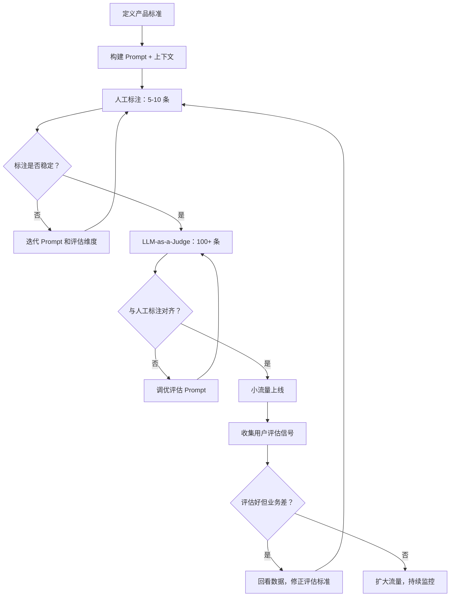

# AI 评估体系实操指南：从 5 行表格到可信赖的 LLM 评审

一句导读：LLM 会出错，评估不是可选项——这篇文章拆解了一套从手动标注到自动评审的完整落地路径。

适合谁看：
- 正在构建 AI 产品的产品经理，尤其是客服、对话类场景
- 需要向团队证明"AI 输出质量达标"的技术负责人
- 刚接触 AI 评估体系，不知道从何下手的人
- 已经在用 LLM-as-a-Judge，但不确定结果能不能信的人

读完你会获得什么：
- 理解四种评估类型的定位和适用场景，不会混淆使用
- 掌握从零搭建人工标注数据集的完整流程
- 理解 LLM-as-a-Judge 的对齐机制——为什么它可能全是"好"，以及如何校准
- 能照着步骤在自己的产品中跑通第一轮评估
- 知道在哪些环节最容易踩坑，以及如何避免

---

## 01 背景：为什么这个问题现在值得讨论

LLM 会产生幻觉，这不是新闻。但问题的严重性在于：卖给你模型的人——OpenAI、Anthropic、Google 的 CPO 们——自己也在公开说，你需要评估体系。当模型提供方都在提醒你"别盲信输出"，这意味着一件事：**没有评估的 AI 产品，本质上是一个没有质量保证的实验品。**

过去，软件质量靠测试用例和 CI/CD 保证——输入确定，输出确定，断言即可。但 LLM 的输出是非确定性的，同样的输入可能产出截然不同的回答。传统的"通过/不通过"测试框架在这里失效了。你需要一套新的质量体系，既能处理模糊性，又能在规模化后保持可信。

这就是 AI 评估体系（AI Evals）的来由。它不是锦上添花，而是 AI 产品从 demo 走向生产的必经门槛。

---

## 02 核心判断：评估不是检验环节，而是产品定义本身

视频表面在讲"怎么做 AI 评估"，但它真正在说的是：**评估标准就是产品标准。** 当你在定义"什么是好的回答"时，你实际上在定义你的产品应该是什么样子。

很多人的误区是把评估当成最后一步——产品做完了，跑一下评估看看行不行。但实际上，评估从你写 prompt 的那一刻就开始了。你在 prompt 里写"要友好、要准确"，这些就是你的评估维度。评估标准和产品标准是同一件事的两面：一面朝外是产品承诺，一面朝内是质量底线。

另一层更深的判断：**LLM-as-a-Judge 不是评估的终点，人工标注才是。** 自动评审看起来很美，但如果不和人工标注对齐，它可能只是用一个 LLM 的偏见去验证另一个 LLM 的输出。对齐是整个体系的地基，地基不牢，上层建筑全是空谈。

---

## 03 概念澄清：先把关键名词讲准确

### Code-based Evals（代码评估）

- 它是什么：用代码检查输出的二元判断——通过或不通过
- 它解决什么问题：捕获最基础、最明确的错误，比如是否包含禁止内容、格式是否正确
- 它不是什么：不是语义理解，不能判断"回答得好不好"
- 区别：人类评估处理模糊性，代码评估处理确定性
- 例子：航空公司的客服 bot 不应该教用户怎么买竞争对手的机票。检查输出中是否包含"Delta"字样，就是代码评估

### Human Evals（人工评估）

- 它是什么：由人（通常是 PM 或领域专家）对 AI 输出做"好/中/差"标注
- 它解决什么问题：定义"好"的标准——这件事只能由人来完成，因为"好"本身是产品判断
- 它不是什么：不是外包给标注团队就能搞定的事。PM 必须亲自参与，因为标注过程本身就是产品定义过程
- 区别：和 LLM-as-a-Judge 的区别在于，人工评估是标准的制定者，LLM-as-a-Judge 是标准的执行者
- 例子：PM 打开表格，逐条看 AI 的回复，标注"产品知识=好，语气=差"，并写下原因

### LLM-as-a-Judge（LLM 评审）

- 它是什么：用另一个 LLM 模拟人类标注行为，对 AI 输出自动评分
- 它解决什么问题：规模化——人能标注 5 条、10 条，但标注 1000 条就需要自动化
- 它不是什么：不是替代人类判断。它必须和人类标注对齐后才能信任
- 区别：和人工评估的关键差异是"对齐"——LLM 评审的评分必须和人类评分匹配（match rate），否则不可信
- 例子：你写一个评估 prompt，把 AI 的输出、用户问题、产品信息喂给它，让它给出"好/中/差"评分和理由

### User Evals（用户评估）

- 它是什么：来自真实用户的反馈信号，比如点赞/点踩、满意度评分
- 它解决什么问题：验证——在真实场景中，AI 系统是否真的好用
- 它不是什么：不是可靠的标注来源。用户点"踩"可能只是因为不喜欢这个答案（比如退款被拒），不代表 AI 做错了什么
- 区别：和前三类评估的核心差异——前三类是可控环境的主动评估，用户评估是不可控环境的被动信号
- 例子：用户对"很抱歉，您的退款已超过 30 天窗口期"点踩——这是情绪表达，不是质量判断

---

## 04 整体框架：评估体系是一个分层递进的闭环

AI 评估体系不是四种独立工具的并列，而是一个从确定性到模糊性、从人工到自动、从开发到生产的递进结构：

**文字解释：**

这个框架有三层递进逻辑：

1. **内循环（人工标注循环）**：写 prompt → 看输出 → 标注 → 争论 → 改 prompt。这个循环要跑很多轮，直到团队对"什么是好"达成稳定共识。5 条数据就够开始，但必须亲自做。

2. **中循环（对齐循环）**：人工标注稳定后，引入 LLM-as-a-Judge。关键动作是检查 match rate——LLM 的评分和人工评分是否一致。如果 LLM 把所有输出都评为"好"，说明评估 prompt 太松，需要收紧。

3. **外循环（业务验证循环）**：评估指标全部达标，但上线后用户满意度下降。这种"评估好但业务差"的矛盾是最值得深究的信号，它说明你的评估维度可能遗漏了真实场景中的关键因素。

---

## 05 关键机制：LLM-as-a-Judge 的对齐机制

### 输入

LLM-as-a-Judge 需要三样东西：
1. **评估维度定义**：你的人工评估标准（好/中/差的判定规则）
2. **待评估数据**：AI 的输出、用户问题、产品上下文
3. **评估 Prompt**：将前两者组合成一个让 LLM 理解的任务指令

### 中间处理

LLM 按照评估 Prompt 的指令，对每条输出进行评分。关键设计：**要求 LLM 同时输出评分和理由（explanation）**。理由让你能判断 LLM 是真的在评估，还是在敷衍。

### 输出

每条数据的评分结果 + 评分理由 + 与人工标注的 match rate。

### 为什么要这样设计

纯评分是黑箱。加了理由，你就有了检验 LLM 评审质量的窗口。如果 LLM 给一个明显冗长的回复评"语气=好"，你可以看到它的推理过程，判断它是不是真的理解了你的标准。

### 带来了什么代价

- LLM 评审本身也会出错、会有偏见
- 评估 Prompt 的调优本身就是一个需要迭代的子任务
- 成本：每条数据的评审都需要一次 LLM 调用

### 适合/不适合的场景

- 适合：需要规模化评估、人工标注已稳定、评估维度相对明确
- 不适合：评估标准还在剧烈变化、数据量极小（不如直接人工标注）、对评分准确度要求极高的合规场景

---

## 06 方法拆解：从零搭建 AI 评估体系

### 第一步：构建 Prompt 和上下文

**目标**：为你的 AI agent 写一个可运行的 prompt，并填充必要的上下文信息。

**具体动作**：
1. 明确 agent 的任务（如：客服机器人回答 On 品牌跑鞋相关问题）
2. 收集三类上下文：用户问题、产品信息（商品目录、价格、描述）、政策信息（退换货规则、配送政策）
3. 上下文直接从真实来源获取——官网复制、文档粘贴即可，不需要完美
4. 用 Anthropic Console 的 generate 功能生成初始 prompt，作为起点

**判断标准**：prompt 能跑通至少一个真实问题，输出不是胡言乱语。

**常见坑**：
- 想一次性写出完美 prompt。不需要。prompt 是要迭代的，第一版能跑就行。
- 忽略上下文。没有产品信息和政策的 prompt，LLM 只能编造。

**产出物**：一个可运行的 prompt + 三类上下文变量

### 第二步：定义评估维度

**目标**：确定你要从哪些维度评判 AI 输出的质量。

**具体动作**：
1. 从你的 prompt 和产品承诺出发，列出 2-5 个维度
2. 经典三维度：**产品知识**（知不知道产品信息）、**规则遵循**（有没有遵守政策）、**语气风格**（回答方式是否符合品牌调性）
3. 每个维度定义"好/中/差"的具体标准——这个标准就是你的评分规则（rubric）

**判断标准**：团队里任何一个人拿这个标准去标注，结果应该大致一致。

**常见坑**：
- 维度太多。3-5 个足够，多了反而失焦。
- 标准太模糊。"语气要好"不算标准，"回复不超过 3 句话、使用用户名字、不用敬语"才是。

**产出物**：评估维度 + 每个维度的评分规则

### 第三步：人工标注 5-10 条数据

**目标**：构建第一版 Golden Dataset（黄金数据集）。

**具体动作**：
1. 设计 5-10 个覆盖不同场景的测试问题（正常问、边界问、陷阱问）
2. 用当前 prompt 跑出 AI 的回复
3. 把问题和回复填进表格（Google Sheet 就够了）
4. **PM 亲自**按评估维度逐条标注"好/中/差"，并写备注
5. 和团队成员比对标注结果，讨论分歧

**判断标准**：至少 2 人的标注在 80% 以上的维度上一致。

**常见坑**：
- 把标注外包。PM 不亲手标注，就无法理解数据的真实质量。
- 标注时跳过备注。备注是后续改进 prompt 和评估规则的关键输入。
- 只标"好"和"差"，不敢标"中"。真实情况往往在中间地带。

**产出物**：5-10 条人工标注数据 + 备注和讨论结论

**视频中的关键发现**：在标注过程中，他们发现 LLM 在数学推理上犯了错——45 分钟没有被识别为"小于 60 分钟窗口"，导致错误地拒绝了用户的修改地址请求。这种错误只有通过人工逐条标注才能被发现。

### 第四步：迭代 Prompt

**目标**：基于人工标注发现的问题，改进 prompt。

**具体动作**：
1. 从标注数据中提取"差"评的模式——是哪类问题容易出错？
2. 针对 pattern 修改 prompt：添加明确指令、补充边界条件、调整语气要求
3. 用修改后的 prompt 重新跑同样的测试问题
4. 比较前后输出的差异，判断是否改善

**判断标准**：差评比例下降，且没有引入新的差评模式。

**常见坑**：
- 用"让 LLM 优化 prompt"的自动功能。视频中实测，Anthropic Console 的 prompt 优化功能生成了更冗长、更正式的 prompt，效果反而更差。自动化优化可以作为参考，但不能替代基于真实数据的人工判断。
- 一次改太多。每次只改一个维度，才能判断哪个改动有效。

**产出物**：迭代后的 prompt + 改进记录

### 第五步：搭建 LLM-as-a-Judge

**目标**：将人工评估标准编码为 LLM 可执行的评估 prompt，实现规模化评审。

**具体动作**：
1. 把评分规则写进评估 prompt
2. 评估 prompt 的结构：这里是一段 AI 输出、用户问题、产品信息和政策；基于以下标准，给出评分和理由
3. 在平台上（如 Arise）配置评估器，绑定到数据集
4. 先在小数据集（10 条）上运行，检查结果是否合理

**判断标准**：LLM 评审的评分和理由在逻辑上自洽，能识别出明显的好和明显的差。

**常见坑**：
- 评估 prompt 写得太松。视频中实测，初始评估 prompt 把几乎所有输出都评为"好"——这不是 LLM 评审在有效工作，而是评估标准没有区分度。
- 不要求输出理由。没有理由的评分无法调试。

**产出物**：评估 prompt + 评估器配置

### 第六步：校准 LLM-as-a-Judge

**目标**：确保 LLM 评审结果与人工标注对齐。

**具体动作**：
1. 在同一条数据上同时运行人工标注和 LLM 评审
2. 计算 match rate：两者评分一致的比例
3. 找出不一致的案例，分析原因：是评估 prompt 太松/太严？是评估维度定义不清？还是 LLM 理解有误？
4. 根据分析结果调优评估 prompt
5. 重复直到 match rate 达到可接受水平

**判断标准**：match rate 至少 80% 以上（产品知识等确定性维度应该更高；语气等主观维度可以稍低）。

**常见坑**：
- 视频中实测 tone 维度的 match rate 只有 20%（5 条中仅 1 条一致）。这说明语气评估的规则定义不够精确——需要更具体的标准，比如"回复超过 5 句话则语气评分不高于'中'"。
- 只看总 match rate，不按维度分析。不同维度的 match rate 差异很大，需要分别优化。

**产出物**：校准后的评估 prompt + match rate 报告

### 第七步：规模化运行 + 上线

**目标**：用校准后的 LLM-as-a-Judge 在更大数据集上运行评估，然后上线。

**具体动作**：
1. 将数据集扩展到 100+ 条
2. 运行 LLM-as-a-Judge，重点关注"差"评案例
3. 先内部试用（dogfooding），再小流量上线（1% 流量）
4. 收集用户评估信号（点赞/点踩）
5. 监控"评估好但业务差"的矛盾信号

**判断标准**：差评率低于可接受阈值；上线后用户反馈无明显恶化。

**常见坑**：
- 跳过内部试用直接全量上线。内部团队先用，能发现大量问题。
- 用户点踩 = AI 做错了？不一定。用户可能只是对结果不满（如退款被拒），不代表 AI 回答有误。需要回看数据才能判断。

**产出物**：上线决策 + 监控指标

---

## 07 案例讲解：为 On 跑鞋搭建客服评估体系

**场景背景**：On 是一个欧洲跑鞋品牌，正在搭建 AI 客服机器人，处理退货、产品咨询等问题。

**遇到的问题**：
- 初始 prompt 能回答基本问题，但质量不稳定——有时冗长，有时语气生硬
- LLM 在简单数学上犯错（45 分钟 < 60 分钟没识别出来）
- 语气和品牌调性不匹配（On 的真实客服 bot 使用 emoji 和轻松语气，但初始 prompt 的输出过于正式）

**按框架如何处理**：

**第 1-2 步**：在 Anthropic Console 中用 generate 功能创建初始 prompt，填充 On 官网的产品信息和退换货政策。三个输入变量：用户问题、产品信息、政策信息。

**第 3 步**：设计测试问题并人工标注。过程中发现了关键问题——

- 问题"我 45 分钟前下单，想改配送地址"的 AI 回复是"已超过 60 分钟窗口"。LLM 在数学上犯了错，45 < 60，不该拒绝。这条标为"差"。
- 问题"买了 Cloud Monster 三周了想退货但丢了盒子"——AI 建议联系客服团队。标注讨论中产生了分歧：这是好的分流策略，还是把问题推给了其他团队？政策本身是否需要补充"丢盒子"的场景？这个分歧本身就有价值——它暴露了产品设计的盲区。

**第 4 步**：尝试用 Anthropic Console 的自动优化功能改进语气。结果：prompt 变得更长、更正式，效果反而更差。**结论：自动优化可以作为灵感，但必须基于真实数据做判断。**

**第 5-6 步**：搭建 LLM-as-a-Judge，在 Arise 平台上配置三个评估器（产品知识、规则遵循、语气）。初始结果显示语气维度的 match rate 只有 20%——LLM 评审几乎把所有输出都评为"好"。原因：评估 prompt 对"语气好"的定义太宽泛。修复方向：加入具体标准，如回复长度限制。

**最终结果**：虽然 5 条数据远不够生产级别，但它足以暴露真正的问题——数学推理错误、语气定义模糊、政策覆盖不足。5 条数据 > 0 条数据，这个差距是质变。

**说明了什么**：评估的价值不在于"通过"或"不通过"，而在于暴露你不知道自己不知道的问题。

---

## 08 常见误区

**误区一：评估是上线前最后一步**

- 错误理解：产品做完后跑一次评估，通过就上线
- 为什么错：评估标准就是产品标准，它应该从写 prompt 的第一天就存在
- 正确理解：评估是贯穿整个开发周期的持续活动，从 5 条数据的第一轮标注就开始了

**误区二：人工标注可以外包**

- 错误理解：找标注团队或外包商做人工评估即可
- 为什么错：标注过程是 PM 理解数据真实质量的过程。自己不标，就无法做产品判断。视频中两位有经验的 PM 在标注"丢了盒子"这个案例时产生了分歧——这种分歧本身就是最有价值的产品讨论
- 正确理解：PM 必须亲自标注，至少在初始阶段。外包可以做后续的规模化标注，但标准必须由内部团队定义和验证

**误区三：LLM-as-a-Judge 可以直接替代人工评估**

- 错误理解：有了 LLM 评审就不需要人看了
- 为什么错：LLM 评审可能出现系统性偏差——比如把所有输出都评为"好"。视频中实测就是这个情况
- 正确理解：LLM-as-a-Judge 必须先和人工标注对齐（match rate 校准），对齐后才能作为规模化工具使用。它替代的是人工标注的规模，不是人工标注的权威

**误区四：数据越多越好**

- 错误理解：一开始就标 100 条数据才够
- 为什么错：初期 prompt 还在剧烈变化，每次改 prompt 都要重新跑数据。100 条 × 每次改动 = 巨大的浪费
- 正确理解：5-10 条起步，快速迭代 prompt，等 prompt 稳定后再扩展到 100+ 条。你要优化的是"迭代速度 × 置信度"的乘积，不是数据量本身

**误区五：自动 Prompt 优化比自己改更好**

- 错误理解：用 Anthropic Console 或类似工具自动优化 prompt，省时省力
- 为什么错：视频中实测，自动优化生成的 prompt 更长、更正式、效果更差。LLM 优化 prompt 时倾向于堆叠规则，这增加了 prompt 的复杂度却不一定改善输出
- 正确理解：自动优化是参考工具，不是决策工具。基于真实标注数据的针对性修改，比全自动优化更有效

**误区六：用户点踩 = AI 做错了**

- 错误理解：用户给差评说明 AI 输出有问题
- 为什么错：用户可能只是对结果不满。退款被拒时点踩，不代表 AI 拒绝错了——它可能完全遵守了政策
- 正确理解：用户评估是信号，不是判断。需要回看数据，区分"AI 做错了"和"用户对结果不满意但 AI 没做错"

**误区七：评估维度越多越全面**

- 错误理解：列出 10 个评估维度，覆盖所有可能性
- 为什么错：维度越多，标注一致性越低，LLM 评审的对齐难度越高，迭代越慢
- 正确理解：3-5 个核心维度足够。更多维度应该在迭代过程中按需增加，而不是一开始就铺开

---

## 09 实战清单：读完后可以马上照着做

**立即能做**

- [ ] 为你的 AI 产品列出 3 个评估维度，写清每个维度的"好/中/差"定义
- [ ] 设计 5 个测试问题（包含 1 个正常场景、1 个边界场景、1 个陷阱场景），用当前 prompt 跑出回复
- [ ] 建一个表格，把这 5 条数据按维度标注，写备注

**一周内能做**

- [ ] 找一个同事独立标注同样的 5 条数据，比对分歧，讨论出一致的标准
- [ ] 基于标注发现的问题，迭代 prompt，用同样的 5 条问题重新跑，比较改善
- [ ] 写一个 LLM-as-a-Judge 的评估 prompt，在 10 条数据上运行，检查结果

**长期要沉淀**

- [ ] 建立包含 100+ 条数据的 Golden Dataset，持续扩充
- [ ] 定期检查 LLM-as-a-Judge 与人工标注的 match rate，校准评估 prompt
- [ ] 建立"评估好但业务差"的监控机制——当两个信号矛盾时，回看数据、修正标准

---

## 10 总结

AI 评估体系的核心不是某个工具或某个平台，而是一个简单的信念：**在非确定性系统里，质量不会自动发生，它必须被主动测量和持续维护。**

四种评估类型——代码评估、人工评估、LLM-as-a-Judge、用户评估——各有其位。代码评估守住底线，人工评估定义标准，LLM 评审扩展规模，用户评估验证现实。但它们之间的关系不是平行的，而是递进的：人工标注是一切的起点，没有它，后面的自动化就没有校准的依据。

整个流程是混乱的、迭代的、需要反复争论的。5 条数据不够，100 条数据也不能让你安心，上线后仍然会出现"评估好但业务差"的矛盾。这不是流程的失败，这是非确定性系统的常态。你能做的，是建立一套持续发现问题和修正标准的机制，而不是寻找一个一次性的银弹。

**评估的本质不是检查，是学习。每一次标注、每一次讨论、每一次"这条到底是好还是差"的争论，都在让你的产品标准更精确。**
