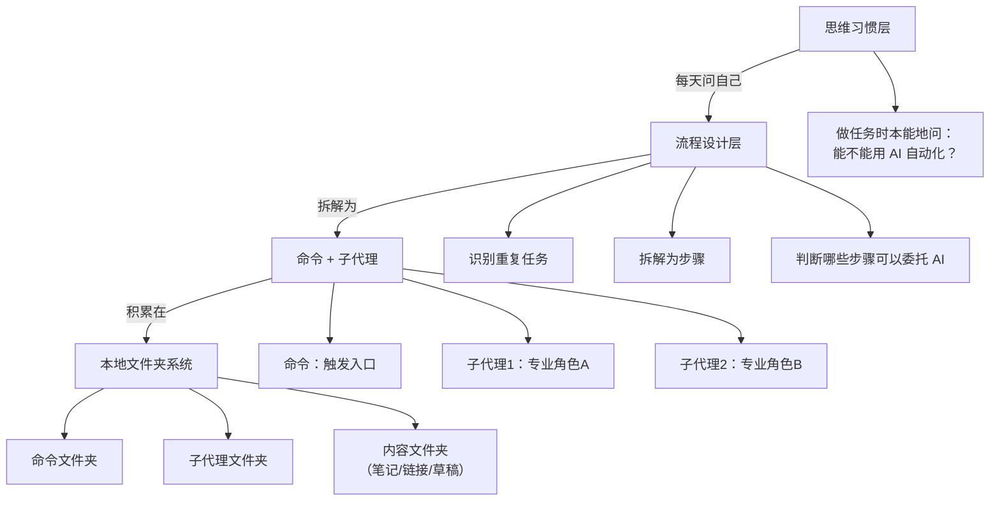

# 把 Claude Code 当个人操作系统用：从"写代码的工具"到"200块/月的万能员工"

# 一句话导读

Claude Code 不只是写代码的——它是一个能跑自定义命令和子代理的本地 AI 代理，你可以用它为自己搭建一套生活操作系统，把重复性任务自动化。

# 适合谁看

- 独立创作者/一人公司，没有团队但想用 AI 替代部分人力
- 已经在用 Claude Code 或 Cursor，但只拿它写代码，没想过别的用法
- 每周有固定重复任务（写 newsletter、做信息整理、追踪指标）的人
- 想用 AI 做个人知识管理，但不想依赖封闭的 SaaS 平台
- 对"AI Agent"概念感兴趣，但缺一个具体可参照的落地案例

# 读完你会获得什么

- 理解 Claude Code 的本质是通用 AI 代理，而非仅限编码工具
- 掌握"命令 + 子代理"的工作流设计模式
- 能照着步骤搭建自己的 Newsletter 研究自动化流程
- 理解"让 AI 自己写提示词"这种元认知用法
- 能避开"让 AI 替我做一切"的常见幻觉
- 获得一套从日常任务中发现 AI 自动化机会的思维方式

---

## 01 背景：为什么这个问题现在值得讨论

2025 年，AI 工具已经铺天盖地。但大多数人的使用方式停留在两个极端：要么拿 ChatGPT 问答式地单轮对话，要么拿 Cursor 写代码。中间有一大片空白——**那些每周都要做、有固定流程、但不够复杂到需要雇人的任务**，比如整理信息、写初稿、追踪指标、做每日简报。

过去，这些任务要么靠人力硬扛，要么靠买 SaaS 工具。但 SaaS 工具是别人定义的流程，你只能迁就它。而如果你用的是 Claude Code，你可以在本地文件夹里自己定义流程，让 AI 按你的方式跑。

Alex 的"Cloud Life"项目就是这样一个案例：一个人、没有员工、一个 200 美元/月的 Claude 订阅，搭出了整套生活操作系统。这个案例的价值不在于他做了什么具体功能，而在于他展示了一种**用 AI 代理构建个人工作流**的可行路径。

---

## 02 核心判断：视频真正想讲的不是"工具使用技巧"

视频表面在演示 Claude Code 的各种用法，但真正想讲的是一件事：

**2025 年最重要的技能，是在做任何任务时本能地问自己："这个任务能不能用 AI 自动化？"**

这不是关于 Claude Code 的教程。这是关于一种思维习惯：当你每天处理任务时，不是想"我能不能用 AI 帮忙"，而是想"我能不能搭一个命令，下次一键完成"。前者是单次优化，后者是系统化积累。

Alex 的所有命令和子代理，都是这种思维习惯的产物——他在做任务的过程中不断积累自动化，而不是等一个完美工具出现。

---

## 03 概念澄清：先把关键名词讲准确

### Claude Code

- **它是什么**：Anthropic 推出的命令行 AI 代理，可以在终端中运行，读写本地文件、搜索网页、执行代码
- **它解决什么问题**：让 AI 代理直接操作你的本地文件系统，而不是只在网页对话框里聊天
- **它不是什么**：它不只是代码编辑器插件。虽然被定位为编码工具，但本质上是一个能执行任意任务的通用代理
- **它和 Cursor 的区别**：Cursor 是 IDE（集成开发环境），内置了 AI 编码功能；Claude Code 是终端代理。你可以在 Cursor 的终端里运行 Claude Code，获得两者的优势——IDE 的代码可视化 + Claude Code 的代理能力
- **简单例子**：在终端输入 `claude`，然后告诉它"帮我整理这个文件夹里所有 markdown 文件的标签"，它会直接读取文件、修改内容

### 命令（Slash Command）

- **它是什么**：Claude Code 中的自定义快捷命令，用 `/命令名` 触发，执行一段预设的复杂流程
- **它解决什么问题**：把重复性的多步骤操作封装成一个词，一键执行
- **它不是什么**：不是简单的宏或脚本。每个命令背后可以启动子代理，执行多轮推理和网页搜索
- **简单例子**：输入 `/newsletter-researcher`，Claude Code 自动启动研究子代理 → 抓取竞品 newsletter → 分析趋势 → 启动写作子代理 → 生成初稿

### 子代理（Subagent）

- **它是什么**：由命令启动的、有独立角色和指令的 AI 代理实例
- **它解决什么问题**：把复杂任务拆成多个专业角色的协作，每个子代理专注一件事
- **它不是什么**：不是独立进程，不是真正的多 Agent 系统。它是在 Claude Code 会话中按角色分工的执行单元
- **简单例子**：Newsletter 研究流程中，"内容研究员"子代理负责抓取和分析竞品内容，"Newsletter 写手"子代理负责基于研究结果写初稿

### Cloud Life（Claude Life）

- **它是什么**：Alex 个人用 Claude Code 搭建的生活操作系统，包含多个命令和子代理
- **它解决什么问题**：把日常重复任务（信息整理、内容创作、指标追踪、情绪记录）系统化、自动化
- **它不是什么**：不是一个产品、不是开源项目、不是通用框架。它是个人工作流的实例，展示的是方法而非方案
- **简单例子**：每天早上运行 `/daily-brief`，自动获取最新行业新闻；每晚运行 `/daily-check-in`，记录当天完成事项和情绪

---

## 04 整体框架：这套内容应该如何理解

Alex 的方法可以抽象为三层结构：

**文字解释**：

最底层是**思维习惯**：在做任何任务时，自动思考"这能不能自动化"。这是驱动一切的起点。

中间层是**流程设计**：识别出重复任务后，拆解步骤，判断哪些步骤可以交给 AI，哪些必须自己做。关键是区分"AI 能做好的"和"必须人做的"——比如研究可以交给 AI，但最终编辑和判断必须自己来。

最上层是**技术实现**：用 Claude Code 的命令和子代理机制，把流程固化。每个命令对应一个触发入口，每个子代理对应一个专业角色。所有东西都存在本地文件夹里，是你可以直接查看和修改的文件。

---

## 05 关键机制："命令 + 子代理"到底是怎么运行的

以 Newsletter 研究员为例，完整拆解这个机制：

### 输入

- 一个包含竞品 newsletter 链接的 markdown 文件（`newsletter-links.md`）
- 一个主提示词（告诉 Claude Code 要创建什么命令和子代理）

### 中间处理

1. **主提示词触发**：你在 Claude Code 中粘贴主提示词，描述你想要的流程
2. **Claude Code 自主构建**：它读取主提示词后，自动在本地创建两个目录——`commands/`（存放命令指令）和 `subagents/`（存放子代理角色定义）
3. **子代理 1 执行研究**："内容研究员"子代理读取 `newsletter-links.md`，逐个抓取链接内容，分析主题、语言风格、趋势话题
4. **子代理 2 执行写作**："Newsletter 写手"子代理接收研究结果，参考 Alex 过往 newsletter 的语气，生成初稿和多个标题选项
5. **输出保存**：初稿自动保存到 `drafts/` 文件夹

### 输出

- 一份结构化的 newsletter 初稿，包含标题选项、正文、引用来源
- 存在本地文件夹中，可直接编辑

### 为什么要这样设计

- **子代理分工**：研究和写作是两种不同的认知模式，拆开比让一个代理同时做效果更好
- **本地存储**：所有中间产物和最终产物都是本地文件，你可以随时查看、修改、版本控制
- **命令化**：把复杂流程变成一个词，降低启动成本

### 带来了什么代价

- **需要审计**：AI 生成的初稿不能直接发布，必须人工编辑。Alex 明确说他会"把初稿几乎重写一遍"，只保留结构和模板
- **需要维护**：链接可能失效、提示词可能过时、子代理的行为可能偏离预期
- **依赖单一平台**：整个系统绑定在 Claude Code 上，如果 Anthropic 改了 API 或定价，影响很大

### 适合/不适合什么场景

- **适合**：有固定流程的重复性任务、信息密集型任务、需要多步骤但步骤可定义的任务
- **不适合**：一次性任务（搭命令的成本大于手动做）、需要高度创造力的任务（AI 可以给初稿，但核心创意必须人来）、涉及敏感信息的任务（本地文件安全需自行保障）

---

## 06 方法拆解：如果自己要做，应该怎么落地

### 第一步：安装 Claude Code

- **目标**：在终端中可以运行 `claude` 命令
- **具体动作**：访问 Anthropic 官网获取安装命令，在终端中执行。如果用 Cursor，在 Cursor 内置终端中安装即可
- **判断标准**：终端输入 `claude` 后能看到 Claude Code 的交互界面
- **常见坑**：Windows 用户需要 WSL 或 Git Bash；安装后需要登录 Anthropic 账号
- **产出物**：可运行的 Claude Code 环境

### 第二步：创建项目文件夹

- **目标**：建立一个本地文件夹作为你的"操作系统"根目录
- **具体动作**：在文档目录下创建一个项目文件夹（如 `my-life-os/`），在里面按需创建子文件夹（如 `notes/`、`newsletter/`、`brain-dumps/`）
- **判断标准**：文件夹结构清晰，每个子文件夹对应一类内容
- **常见坑**：不要把各种无关文件混在一起，保持每个子文件夹的用途单一
- **产出物**：一个有结构的本地项目目录

### 第三步：准备输入素材

- **目标**：把 AI 需要参考的内容放进去
- **具体动作**：以 Newsletter 研究员为例，创建 `newsletter-links.md`，把你想参考的 newsletter 链接逐行放进去
- **判断标准**：链接可访问、来源可靠、数量在 5-15 个之间（太少没参考价值，太多抓取时间过长）
- **常见坑**：不要放付费墙后的链接（AI 抓不到内容）；不要放太多链接导致处理时间爆炸
- **产出物**：结构化的输入文件

### 第四步：写主提示词，让 Claude Code 搭建命令和子代理

- **目标**：用一段描述性提示词，让 Claude Code 自动生成命令定义和子代理角色
- **具体动作**：在 Claude Code 中描述你想要的流程。例如："我想创建一个 newsletter-researcher 命令，它会启动一个研究子代理去抓取和分析我指定的 newsletter 链接中的趋势话题，然后启动一个写作子代理基于研究结果在我的风格下写初稿。请帮我创建命令文件和子代理文件。"
- **判断标准**：Claude Code 在 `commands/` 和 `subagents/` 目录下生成了对应的 markdown 文件
- **常见坑**：提示词太模糊会导致生成的子代理职责不清；提示词太具体会限制 AI 的创造力——Alex 的做法是给一个方向性描述，让 AI 自己补充你没想到的细节
- **产出物**：自动生成的命令文件和子代理文件

### 第五步：运行命令，审计输出

- **目标**：用 `/命令名` 触发流程，检查输出质量
- **具体动作**：输入命令，等 AI 完成全部步骤，查看生成的初稿
- **判断标准**：输出结构合理、信息准确、语气基本匹配
- **常见坑**：**不要直接复制粘贴发布**。AI 生成的内容仍然有"机器人味"，必须人工编辑。Alex 的做法是"几乎重写初稿"，只保留 AI 提供的结构和素材
- **产出物**：经人工编辑后的最终产出

### 第六步：持续迭代

- **目标**：在日常使用中不断添加新命令、优化现有命令
- **具体动作**：做任何重复任务时，问自己"能不能用 AI 自动化"，然后按上述流程添加新命令
- **判断标准**：命令数量随时间增长，每个命令都在实际使用中验证过
- **常见坑**：不要一次性搭建太多命令——先从一个最痛的重复任务开始，验证效果后再扩展
- **产出物**：持续增长的命令和子代理集合

---

## 07 案例讲解：Newsletter 研究员的完整工作流

### 场景背景

Alex 每周四发一期 newsletter，有 400 个订阅者，已经写了近 40 期。所有工作——研究、写作、编辑——都一个人做。写 newsletter 是他最有价值也最耗时的内容渠道。

### 遇到的问题

- 每期要花大量时间研究竞品 newsletter 在聊什么
- 要在多个来源之间找趋势、找话题
- 要用自己的风格写初稿
- 没有员工可以分担，但又不想降低质量

### 按框架如何处理

**第一步：准备输入**。创建 `newsletter-links.md`，放入 5-10 个他常读的 newsletter 链接。这些是他真正认可的内容来源，不是随意搜的。

**第二步：让 Claude Code 搭建系统**。在 Claude Code 中输入主提示词，描述想要的流程。Claude Code 自动创建命令和两个子代理：一个负责研究，一个负责写作。写作子代理的角色定义是 AI 读了 Alex 的往期 newsletter 后自己写的——包括"擅长吸引人的 newsletter、AI 创作者增长策略和个人故事"等描述。

**第三步：每周运行**。周四早上，输入 `/newsletter-researcher`。系统自动启动：研究子代理逐个抓取链接内容 → 识别被多个 newsletter 同时讨论的趋势话题 → 分析语言风格 → 写作子代理基于研究结果，在 Alex 的语气下生成初稿和多个标题选项 → 初稿保存到 `drafts/` 文件夹。

**第四步：人工编辑**。Alex 打开初稿，几乎重写正文，但保留 AI 提供的结构和素材方向。AI 生成的一篇初稿里包含了 Alex 在 MongoDB 工作的经历、他关于"95% 的创作者在盲飞"的观察——这些是他真实故事和观点，AI 只是把它们组织进了结构里。

### 最终结果

每周节省数小时的研究和初稿时间。产出质量由人工编辑保证，AI 只负责降低启动成本。

### 说明了什么

AI 的价值不在于"替你写"，而在于"替你启动"。最难的不是写 newsletter，而是面对空白页面开始。AI 把"从零到初稿"这个最耗意志力的环节自动化了，人只需要做"从初稿到成品"这个更有掌控感的环节。

---

## 08 常见误区：很多人会在哪里理解错

### 误区一：以为 Claude Code 只能写代码

- **错误理解**：Claude Code 是编程工具，不做编程的人用不上
- **为什么错**：Claude Code 的核心能力是读写本地文件 + 搜索网页 + 执行指令。写代码只是这些能力的应用之一。任何涉及"读取信息 → 处理信息 → 输出结果"的任务都在它的能力范围内
- **正确理解**：Claude Code 是通用 AI 代理，编码只是它的默认场景
- **应该怎么做**：先想"我要做什么任务"，再想"这个任务的步骤能不能映射到文件读写和信息搜索上"

### 误区二：以为 AI 生成的内容可以直接发布

- **错误理解**：命令跑完，初稿就是成品，复制粘贴即可
- **为什么错**：AI 生成的内容仍然有明显的"机器人味"——语言模式化、观点平滑化、缺乏个人真实经验。Alex 明确说他会"把初稿几乎重写一遍"
- **正确理解**：AI 的输出是半成品，是"你编辑的起点"，不是"你发布的终点"
- **应该怎么做**：把 AI 的输出当素材库，保留结构和素材，重写表达

### 误区三：以为必须自己写好所有提示词

- **错误理解**：要搭建命令和子代理，必须自己精心编写每一行提示词
- **为什么错**：Alex 的做法是给 Claude Code 一个方向性的主提示词，让 AI 自己生成子代理的角色定义和具体指令。AI 写的提示词往往比你写的更完整，因为它能想到你没考虑到的边界情况
- **正确理解**：你可以用 AI 来写 AI 的提示词——这是一种元认知用法
- **应该怎么做**：给方向，让 AI 生成细节，然后你审核和修改

### 误区四：以为要一次性搭建完整的系统

- **错误理解**：要像 Alex 那样有十几个命令和子代理，必须一开始就规划好整个系统
- **为什么错**：Alex 的所有命令都是在日常工作中逐步积累的，不是一次性设计的。每个命令都来自一个具体的痛点
- **正确理解**：系统是长出来的，不是设计出来的
- **应该怎么做**：从最痛的一个重复任务开始，搭一个命令，验证有效后再加下一个

### 误区五：以为本地文件系统不如 SaaS 产品专业

- **错误理解**：用文件夹和 markdown 管理工作流太原始，不如买专业的 SaaS 工具
- **为什么错**：SaaS 工具的流程是别人定义的，你只能迁就它。本地文件系统虽然朴素，但流程完全由你定义，而且你可以直接查看和修改所有中间产物
- **正确理解**：本地文件系统的优势是透明和可控，不是功能丰富
- **应该怎么做**：如果你现有的 SaaS 工具已经完美覆盖你的流程，没必要换。但如果你总在迁就工具而不是工具迁就你，试试本地文件方案

### 误区六：以为"AI 员工"可以完全替代真人

- **错误理解**：Alex 说 Claude Code 是他"200 美元/月的员工"，意味着 AI 可以完全替代一个人类员工
- **为什么错**：AI 替代的是重复性、可定义的执行环节，不是判断力、创造力和人际协作。Alex 的 newsletter 仍然是他自己写的，AI 只做研究和初稿
- **正确理解**："AI 员工"是类比，说明 AI 可以承担一部分执行工作，但审核和决策必须是人
- **应该怎么做**：把 AI 当"实习生"——能做调研、能写初稿、能整理信息，但最终交付物必须你审核

---

## 09 实战清单：读完后可以马上照着做

### 立即能做

1. **安装 Claude Code**：在终端中运行安装命令，确认 `claude` 可以启动
2. **创建一个项目文件夹**：在文档目录下建一个文件夹，放一个 `notes/` 子文件夹
3. **写一个脑暴笔记**：在 `notes/` 里写一个 markdown 文件，列出你每周重复做的 3-5 件事
4. **选一个最痛的重复任务**：从上面 3-5 件事里，选那个最耗时间、最让你拖延的
5. **在 Claude Code 中描述这个任务**：不要写提示词，就当聊天一样告诉它你想自动化什么，看它怎么建议

### 一周内能做

1. **为那个最痛的任务准备输入文件**：把 AI 需要参考的链接、文本、模板整理成 markdown 文件
2. **让 Claude Code 搭建一个命令**：用方向性描述让它自动生成命令和子代理
3. **运行命令，检查输出**：跑一次，看结果是否可用，哪里需要调整
4. **修改子代理定义**：根据第一次运行的结果，调整子代理的角色描述和指令
5. **在日常工作中练习"自动化直觉"**：每做一个任务，花 10 秒想"这能不能用 AI 自动化"

### 长期要沉淀

1. **建立命令库**：每发现一个可自动化的任务，就加一个命令，每周检查一次命令是否还在正常工作
2. **定期审计 AI 输出质量**：每月抽查 AI 生成的初稿，看语气是否偏离、信息是否过时
3. **维护输入素材**：定期更新链接列表、参考文档，确保 AI 的信息源不过时
4. **记录自动化收益**：每次用命令节省了时间，记下来。积累到一定量后，评估是否值得升级订阅或投入更多时间优化
5. **关注 Claude Code 更新**：Anthropic 可能推出新的能力（如更好的文件处理、更长的上下文），及时评估是否值得迁移

---

## 10 总结：把全文收束成一个判断

Claude Code 的真正价值不在编码，在于它是一个能操作本地文件、搜索网页、按自定义流程执行的通用 AI 代理。Alex 的"Cloud Life"展示了一种可复制的模式：用命令封装触发入口，用子代理分工执行，用本地文件夹存储所有中间产物和最终产出。

这套模式的核心不是技术，是习惯。在做任何任务时本能地问"这能不能自动化"，然后把答案变成一个命令。命令会积累。一个命令节省 30 分钟，十个命令就是每周 5 小时。这不是一次性优化，是复利增长。

但必须清醒：AI 输出是半成品，不是成品。所有命令的终点都是人工审核。如果你把 AI 当"替你做决定的人"，你会得到平庸的结果。如果你把 AI 当"替你启动的人"，你会得到更高的效率。

**判断：2025 年最有价值的 AI 技能不是"会用 AI 工具"，而是"能把重复任务变成可复用的自动化流程"。前者是消费，后者是投资。**
