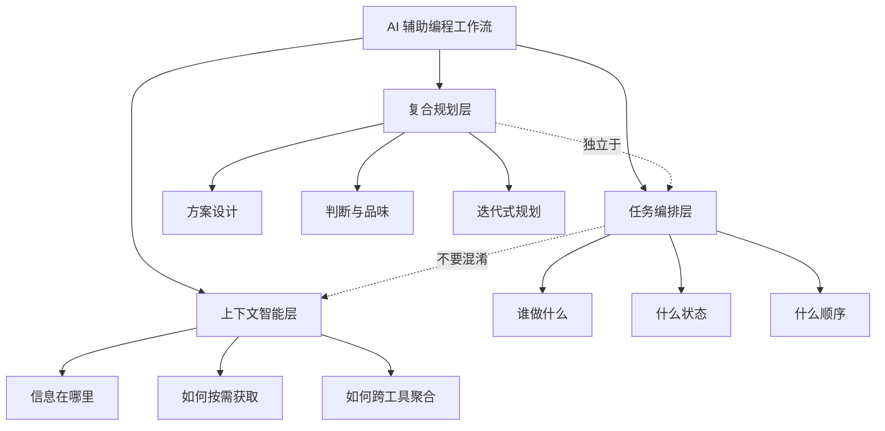

# AI 编程助手进入任务管理时代——但真正的价值不在任务追踪

**一句话导读：** Claude Code 推出了内置任务管理系统，但如果你只把它当成"更好的待办清单"，就错过了 AI 辅助编程正在发生的真正结构转变。

**适合谁看：**
- 用 Claude Code / Cursor / Windsurf 等工具写代码，已经在多会话、多任务场景中感到混乱的人
- 在做 Compound Engineering 或类似 AI 辅助工作流插件，需要理解任务系统设计约束的开发者
- 负责 AI 工具选型和流程设计的技术管理者
- 对 AI Agent 编排和多 Agent 协作感兴趣，想理解当前阶段的真实边界的人
- 正在纠结要不要上 BEADS 或类似任务管理方案的独立开发者

**读完你会获得什么：**
- 能分清"任务管理"和"上下文智能"是两个不同问题，避免把它们混在一起设计
- 能理解 Claude Code 新任务系统的实际机制、局限和可操作空间
- 能判断 Markdown 任务清单、BEADS、Claude 内置任务三种方案各自适合什么场景
- 能理解为什么"复合规划"（Compound Planning）应该从"复合工程"（Compound Engineering）中独立出来
- 能拿到一套可落地的行动清单，改进自己当前的 AI 辅助编程工作流

---

## 01 背景：为什么这个问题现在值得讨论

一个趋势正在发生：AI 编程助手从"单次对话完成单次任务"转向"跨会话、跨 Agent 的持续工作流"。

过去，你和 Claude Code 的交互是瞬时的——打开会话，写代码，关掉。任务在会话内完成，状态在会话内维护。这种方式在小功能上够用，但当你开始用 AI 做规划、做迭代式头脑风暴、做多轮代码审查时，问题出现了：

- 上一个会话里规划的任务，下一个会话忘了
- 一个会话在做规划，另一个会话在写代码，两者之间没有共享状态
- Agent 花 20% 的 token 在反复更新 Markdown 文件里的任务状态，而不是在做实际工作
- 上下文在会话间丢失，知识在文档里沉淀不下来

这些痛点的本质是：**AI 编程助手缺乏跨会话的状态持久化和任务协调机制。**

Claude Code 最近推出的内置任务管理系统，正是对这一问题的回应。但它目前还是早期形态——功能有限、文档不清、行为令人困惑。同时，社区里已有 BEADS 这样的第三方方案，以及最原始的 Markdown 待办清单。

三个方案并存，各自有各自的问题。更关键的是，很多人把"任务管理"和"上下文智能"混为一谈，这会导致架构上的根本性错误。

---

## 02 核心判断：视频真正想讲的不是表层问题

这段对话表面上在评测 Claude Code 的新任务管理系统，实际上指向一个更深的判断：

**AI 编程助手的工作流正在分裂成两个不同的问题域——任务编排和上下文智能。把它们当成同一个问题来解，是当前最大的设计误区。**

任务编排解决的是：谁做什么、什么顺序、什么状态。这是工程管理问题。

上下文智能解决的是：Agent 如何获得做决策所需的信息，即使这些信息分散在 Slack、文档、代码仓库、对话线程里。这是知识获取问题。

Claude Code 的任务系统在解决第一个问题。Unblocked 这类产品在解决第二个问题。BEADS 试图同时解决两个，结果是太重、太复杂。很多人会本能地想用任务系统承载上下文——比如把背景信息塞进任务描述里——但这会让任务系统承担它不该承担的角色，最终两个问题都解不好。

---

## 03 概念澄清：先把关键名词讲准确

### Claude Code 任务系统

- **它是什么：** Claude Code 内置的任务创建、更新和追踪机制，底层是文件系统存储（存在用户 home 目录的 `.claude/` 下），支持跨会话访问
- **它解决什么问题：** 让 AI Agent 能在不同会话之间维护任务状态，而不是每次都从零开始
- **它不是什么：** 它不是完整的项目管理工具，目前没有优先级、没有跨项目依赖、没有看板视图
- **和 BEADS 的区别：** BEADS 是第三方方案，依赖 Git 钩子和数据库同步，功能更全但更重；Claude 内置方案更轻量，但能力有限
- **和 Markdown 待办清单的区别：** Markdown 清单是会话内的、人可读的；Claude 任务系统是跨会话的、Agent 可操作的

### Compound Engineering

- **它是什么：** 一个 Claude Code 插件，通过"复合循环"让 AI 反复迭代改进代码——生成、审查、修正、再审查
- **它解决什么问题：** 让 AI 不只是写一次代码，而是在自我审查中持续提升质量
- **它不是什么：** 它不是任务管理框架，也不是项目规划工具
- **和 Compound Writing 的区别：** Compound Writing 面向内容生成；Compound Engineering 面向代码工程。但两者正在分化出"Compound Planning"这个新方向

### Compound Planning

- **它是什么：** 从 Compound Engineering 中独立出来的规划能力——头脑风暴、方案设计、任务拆解
- **它解决什么问题：** 规划和工程执行是不同心智模式，混在一起会让 Agent 在"规划"和"执行"之间反复跳转，浪费 token
- **它不是什么：** 它不是项目管理，不是任务追踪，它关注的是判断力、品味和方案设计

### 上下文智能 (Contextual Intelligence)

- **它是什么：** AI Agent 从分散的、多模态的信息源中获取所需上下文的能力——而不是靠人手动喂信息
- **它解决什么问题：** 现实中上下文散落在 Slack、Google Docs、Jira、代码仓库各处，强迫所有信息变成 Markdown 文件是不现实的
- **它不是什么：** 它不是任务管理。把上下文信息塞进任务描述里，是用错工具解错问题
- **一个例子：** Unblocked（getunblocked.co）连接 Slack、代码仓库等所有知识源，提供 MCP 接口。Agent 可以在需要时查询上下文，而不是事先把所有上下文塞进提示词

### BEADS

- **它是什么：** 一个为 AI 编程助手设计的任务管理系统，支持跨会话持久化、数据库同步、Git 钩子集成
- **它解决什么问题：** 让多个 Claude 实例共享任务状态，实现"一个规划、一个执行、一个测试"的多 Agent 分工
- **它不是什么：** 它不是轻量方案。它的 Git 钩子和自动同步会带来意外副作用
- **代价：** 需要管理数据库同步，Git 钩子可能和其他工具冲突，复杂度高到作者自己装了卸、卸了装，重复十几次

---

## 04 整体框架：这套内容应该如何理解

AI 编程助手的工作流正在经历一次三层分化：

**文字解释：**

- **任务编排层**解决的是执行协调问题：任务创建、状态追踪、依赖管理。Claude 内置任务系统、BEADS、Markdown 清单都在这一层。
- **上下文智能层**解决的是知识获取问题：Agent 如何在需要时从正确的信息源拿到正确的信息。Unblocked 代表这一层。
- **复合规划层**解决的是判断力问题：方案好不好、优先级对不对、取舍怎么定。Compound Planning 代表这一层。

三层之间有交互，但它们是不同的问题。最大的设计错误是把任务系统当成上下文存储，或者把规划混在执行里。

---

## 05 关键机制：Claude Code 任务系统到底是怎么运行的

通过对对话中的实际探索和源码逆向分析，Claude Code 任务系统的运行机制如下：

### 输入

- 用户在对话中提出需求，Agent 自主判断是否需要创建任务
- 或用户通过 `CLAUDE_TASK_ID` 环境变量指定任务上下文

### 中间处理

- 任务以 JSON 格式存储在用户 home 目录的 `.claude/` 文件夹下
- 每个任务有元数据：ID、状态（pending / in_progress / completed）、依赖关系（`blockedBy` 字段引用其他任务 ID）
- 任务默认是会话级别的，但通过环境变量或全局设置可以跨会话共享
- 存在 `teammate` 相关的工具接口，暗示多 Agent 协作能力正在开发中

### 输出

- Agent 在对话中可以查看、创建、更新任务
- 任务状态变化会反映在文件系统中，其他会话可以读取

### 为什么要这样设计

- **跨会话持久化：** 任务存储在 home 目录而非项目目录，确保不同项目、不同仓库的会话都能访问
- **Agent 自主性：** Agent 可以自行决定何时创建任务，而不是依赖人工操作
- **轻量起步：** 先解决最基础的"任务别丢了"问题，再逐步添加项目管理能力

### 带来了什么代价

- **组织能力弱：** 目前没有项目分组、优先级排序、看板视图，设为全局后所有任务混在一起
- **依赖仅限线程内：** `blockedBy` 只能引用同一会话的任务 ID，跨会话依赖无法表达
- **术语混乱：** "任务"在不同语境下有时指子 Agent（subagent），有时指待办事项，有时指工作项，给用户和 Agent 都造成困惑
- **删除能力缺失：** 目前没有 `task delete`，不想要的任务无法彻底移除

### 适合/不适合什么场景

- **适合：** 单人开发、小团队、跨会话需要延续状态的场景
- **不适合：** 需要严格项目管理的多人协作、需要跨项目依赖追踪的复杂工程、需要和外部系统（Jira、Linear）集成的企业场景

---

## 06 方法拆解：如何在自己的工作流中落地

### 第一步：清理现有的任务追踪方式

**目标：** 统一任务入口，避免 Markdown 待办清单和 Claude 内置任务系统并行造成混乱。

**具体动作：**
- 找到你当前所有存储任务的地方——Markdown 文件的 `- [ ]` 清单、Compound Engineering 的 todo skill、独立的 tasks.md
- 决定一个唯一入口。如果用 Claude Code 内置任务系统，删掉或停用其他入口
- 如果保留 Markdown 清单，明确它只做人可读的快照，不做事态的权威来源

**判断标准：** 你不再需要在两个地方更新同一个任务的状态。

**常见坑：** 删除旧的 todo skill 但没告诉 Agent 用新的任务系统，导致 Agent 仍在寻找已不存在的工具。

**产出物：** 一个唯一的任务来源，无论是什么。

### 第二步：设定任务的作用域

**目标：** 明确任务是项目级还是会话级，避免全局任务列表变成垃圾场。

**具体动作：**
- 如果你的工作集中在单个项目：将 `CLAUDE_TASK_LIST` 设为 `shared`，让同项目的多个会话共享任务
- 如果你在多个项目间切换：为每个项目设定不同的任务上下文，避免任务串台
- 在 Compound Engineering 的配置中添加指令：当 Agent 创建任务时，附加项目前缀（如 `eng_`），便于后续过滤

**判断标准：** 打开任意一个 Claude 会话，你能在 5 秒内找到和当前工作相关的任务。

**常见坑：** 设为全局后所有项目的任务混在一起，无法区分优先级。

**产出物：** 清晰的作用域配置和命名约定。

### 第三步：分离规划和执行

**目标：** 让规划环节和执行环节使用不同的会话和不同的任务上下文。

**具体动作：**
- 规划会话：用 Compound Planning 做头脑风暴和方案设计，产出的是方案文档和任务列表
- 执行会话：从任务列表中取任务，专注写代码，不再做方案设计
- 测试会话（可选）：独立运行浏览器测试，验证执行结果

**判断标准：** 规划会话不做代码变更，执行会话不做方案重设计。

**常见坑：** 执行会话中 Agent 发现方案有问题，就地修改方案，导致规划和执行再次耦合。

**产出物：** 至少两个独立的会话模板或启动配置。

### 第四步：建立上下文获取策略

**目标：** 不依赖任务系统来承载上下文，而是让 Agent 按需查询。

**具体动作：**
- 评估你团队的知识分布：哪些在代码仓库、哪些在 Slack、哪些在文档
- 如果信息主要在代码仓库：Claude Code 的内置学习能力够用
- 如果信息分散在多个工具：考虑接入 Unblocked 或类似产品，通过 MCP 让 Agent 按需查询
- 在 Compound Engineering 中配置：当 Agent 需要上下文时，先查询知识源，而不是把所有背景信息塞进提示词

**判断标准：** Agent 的上下文获取方式是"按需查询"而非"预先塞满"。

**常见坑：** 试图把 Slack 对话、设计文档全部转为 Markdown 放进项目目录——这是在用错层的方式解错层的问题。

**产出物：** 上下文获取的配置文档或 MCP 集成。

---

## 07 案例讲解：用一个具体场景串起来

### 场景背景

你是一个独立开发者，正在用 Claude Code 开发一个 SaaS 产品。当前有三个功能并行推进：用户认证重构、支付集成、数据导出。每个功能都需要规划、编码、测试。你习惯在 Markdown 文件里维护任务清单，但经常发现上一个会话里的任务状态和当前实际进度对不上。

### 遇到的问题

- 会话 A 做了认证重构的规划，产出了一堆 `- [ ]` 任务。会话 B 开始写代码时，找不到这些任务——它们在会话 A 的上下文里，没有持久化
- 你在 Slack 里和一个用户讨论了支付接口的边界情况，但 Agent 不知道这段对话的存在
- Agent 花 15% 的 token 在更新规划文档里的任务状态，而不是写代码
- 三个功能的任务混在同一个 Markdown 文件里，无法按功能过滤

### 按框架如何处理

**第一步：清理入口。** 删掉 Markdown 里的任务清单，改用 Claude 内置任务系统作为唯一来源。

**第二步：设定作用域。** 为三个功能设定不同的任务上下文前缀：`auth_`、`pay_`、`export_`。所有任务自动归属对应功能。

**第三步：分离规划和执行。** 认证重构的规划在会话 A 完成，产出任务列表后关闭。会话 B 从 `auth_` 任务中取第一个 pending 任务，直接写代码。如果发现方案有问题，创建一个新任务 `auth_plan_review`，而不是在执行会话中修改方案。

**第四步：建立上下文策略。** 支付接口的边界情况，不塞进任务描述。在会话中触发支付相关任务时，Agent 通过 MCP 查询 Slack 里相关的讨论记录，按需获取上下文。

### 最终结果

- 任务状态跨会话持续，不再丢失
- 规划和执行解耦，token 不浪费在状态更新上
- 上下文按需获取，不需要手动搬运信息
- 三个功能的任务不再串台

### 说明了什么

三个问题（任务持久化、规划执行分离、上下文获取）分别对应三个层次。用任务系统解决一切，或者用 Markdown 解决一切，都是用错工具解错问题。关键是分清每个问题的归属层次，然后用对层的工具。

---

## 08 常见误区：很多人会在哪里理解错

**误区一：以为 Claude 任务系统就是更好的待办清单**

- 错误理解：它就是 Markdown `- [ ]` 的升级版，换个格式存任务
- 为什么错：Markdown 清单是会话内的、人维护的；Claude 任务系统是跨会话的、Agent 维护的。核心差异不在格式，而在状态持久化和 Agent 可操作性
- 正确理解：它是一个 Agent 可读写的跨会话状态存储
- 应该怎么做：设计工作流时，重点考虑"哪些状态需要跨会话保持"，而不是"怎么把现有待办清单迁移过来"

**误区二：把上下文信息塞进任务描述里**

- 错误理解：任务描述写得越详细越好，把相关文档链接、Slack 讨论摘要都放进去
- 为什么错：任务系统解决的是"谁做什么、什么状态"，不是"信息在哪里"。把上下文塞进任务描述，会让任务系统膨胀成知识库，维护成本爆炸
- 正确理解：任务描述只保留执行所需的最小信息，上下文通过查询机制按需获取
- 应该怎么做：任务写"实现支付回调接口"，而不是"实现支付回调接口，根据 Slack #payments 频道 4/28 的讨论，需要处理超时重试……"

**误区三：BEADS 装上就万事大吉**

- 错误理解：BEADS 功能最全，装上就解决了所有任务管理问题
- 为什么错：BEADS 的 Git 钩子、数据库同步、自动提交会在你意想不到的时刻触发副作用。对话中提到作者自己装了卸、卸了装十几次
- 正确理解：功能全 ≠ 适合你。BEADS 适合需要严格多 Agent 编排的场景，但它的复杂度是真实代价
- 应该怎么做：先用最轻量的方案（Claude 内置任务系统或 Markdown），只在确实遇到瓶颈时才考虑更重的方案

**误区四：规划和执行应该在同一会话完成**

- 错误理解：Agent 应该一边规划一边执行，这样最高效
- 为什么错：规划和执行是不同的认知模式。混在一起会导致 Agent 在"想"和"做"之间反复跳转，token 浪费在更新规划文档上，而不是产出代码
- 正确理解：规划和执行应该在不同会话中完成，规划产出任务列表，执行消费任务列表
- 应该怎么做：规划会话结束的标志是"任务列表已经拆解到可以直接执行"，执行会话结束的标志是"当前任务完成"

**误区五：所有项目信息都应该在代码仓库里**

- 错误理解：把 Slack 讨论、设计文档、会议纪要全部转为 Markdown 放进项目目录
- 为什么错：现实中上下文是多模态、多来源的。强迫所有信息变成 Markdown 文件是工程师的思维惯性，不是现实的工作方式
- 正确理解：信息留在它自然存在的地方，Agent 通过查询机制按需获取
- 应该怎么做：接入 MCP 或类似查询接口，让 Agent 在需要时去 Slack、文档、代码仓库中检索信息

**误区六：Claude 任务系统会自动成为完整的项目管理工具**

- 错误理解：Anthropic 会持续迭代，最终任务系统会替代 Linear / Jira
- 为什么错：从当前实现看，任务系统连跨会话依赖、优先级、项目分组都不支持。它解决的是 Agent 的状态持久化，不是人类的项目管理。这是两个不同的产品方向
- 正确理解：任务系统服务于 Agent 的执行协调，项目管理服务于人类的决策协调
- 应该怎么做：不要等它变成 Linear。用它解决 Agent 的问题，用 Linear 解决人的问题

---

## 09 实战清单：读完后可以马上照着做

### 立即能做

1. **审计你当前的任务存储位置。** 列出所有你存任务的地方——Markdown 文件、工具自带的 todo、写在纸上的。确认有没有重复维护的情况。
2. **停用 Compound Engineering 的 todo skill。** 如果你已经升级到支持内置任务系统的 Claude Code 版本，在配置中移除旧的 todo skill，添加指令让 Agent 使用内置任务系统。
3. **检查 `.claude/` 目录下的任务文件。** 看看 Agent 自动创建了哪些任务，理解它的存储结构和字段，为后续定制做准备。

### 一周内能做

4. **为你的活跃项目设定任务前缀约定。** 在 Compound Engineering 配置中添加指令：创建任务时附加项目前缀（如 `projname_`），便于跨项目时过滤。
5. **搭建一个规划会话模板。** 写一段系统提示词，专门用于方案设计和任务拆解。确保规划会话只产出任务列表，不直接写代码。
6. **评估上下文获取方式。** 盘点你团队的知识分布（代码 / Slack / 文档 / 其他），判断哪些信息 Claude Code 内置能力可以覆盖，哪些需要接入 MCP 查询。

### 长期要沉淀

7. **建立"上下文智能"策略。** 如果信息分散在多个工具，评估 Unblocked 或类似产品是否值得接入。目标是 Agent 能按需查询，而不是你手动搬运。
8. **推动 Compound Planning 作为独立插件。** 如果你也在参与 Compound Engineering 社区，支持将规划能力独立出来，避免规划和执行继续耦合。
9. **定义任务状态流转规范。** 基于实际使用经验，确定适合你团队的任务状态流（如 pending → approved → in_progress → completed），并通过 Compound Engineering 的自定义 skill 实现。

---

## 10 总结：把全文收束成一个判断

AI 编程助手正在从"单次对话工具"进化为"持续工作流系统"。这个进化过程中，三个问题浮出水面：任务如何跨会话持久化、规划如何与执行解耦、上下文如何按需获取。

Claude Code 的内置任务系统是对第一个问题的初步回答。它够轻、够直接，但目前组织能力弱、依赖表达受限、术语混乱。BEADS 功能更全但代价太大，很多人装了又卸。Markdown 清单最简单但无法跨会话。三种方案各有位置，没有银弹。

更关键的是，任务管理只是三层问题中的一层。把上下文信息塞进任务系统，或者把规划混在执行里，都是在用错层的工具解错层的问题。**当前最大的设计误区，是把"任务编排"和"上下文智能"当成同一个问题来解。** 任务系统回答"谁做什么"，上下文智能回答"信息在哪里"。分开解，两个都能解好；混在一起，两个都解不好。

**判断：AI 编程助手的下一个竞争维度不是谁的任务管理功能更多，而是谁能更好地把任务编排、上下文智能和复合规划解耦成独立且协作的层。** 先解耦，再集成——而不是先堆功能，再想办法组织。
