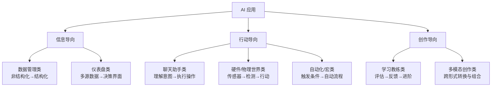

# 101 个 Vibe Coding 应用方向：从想法到上线的完整思维框架

一句话导读：这篇文章解决一个问题——你知道 AI 能做应用，但不知道从哪里下手、做什么、怎么做，这里给你一套分类思维和五步落地方法。

适合谁看：
- 有产品感觉但不会写代码，想用 Vibe Coding 做点东西的人
- 独立开发者 / Indie Hacker 在找下一个项目的方向
- 产品经理想理解 AI 应用到底有哪些类型，背后逻辑是什么
- 企业内部团队想把重复流程自动化，但不知道从哪类场景切入
- 内容创作者 / 课程设计者，需要一套 AI 应用的分类框架来组织内容

读完你会获得什么：
- 能用七分类框架判断任何 AI 应用想法属于哪个类型、该用什么思路做
- 能区分"数据管理类"和"仪表盘类"应用的本质差异
- 能按五步框架从零开始推进一个 AI 应用的落地
- 能识别哪些场景适合自动化，哪些场景需要人机协作
- 能避免"觉得什么都能做但什么都做不好"的常见陷阱
- 能从 101 个方向中选出最适合自己的 1-2 个起点

---

## 01 背景：为什么这个问题现在值得讨论

一个关键变化正在发生：构建软件应用的门槛，从"会写代码"降到了"能想清楚需求"。

过去，做一款应用意味着你需要掌握编程语言、框架、部署流程，整个链条对非技术人员完全封闭。现在，AI 辅助编码工具（Vibe Coding）把"写代码"这件事变成了一种人机对话——你描述需求，AI 生成代码，你调整反馈，AI 修正迭代。

但这带来一个新问题：**门槛降低后，最稀缺的不再是编码能力，而是产品思维和方向判断。** 能做的东西突然变多了，但哪些值得做、怎么做、做成什么样——这些问题反而更难回答了。

这就是这篇文章要处理的核心问题：当"技术实现"不再是瓶颈，你如何系统地思考 AI 应用的方向、分类和落地路径？

---

## 02 核心判断：101 个应用方向的真正价值不是灵感清单，是分类思维

视频标题说"101 个 AI 应用"，但如果你只是把它当成灵感目录，翻一遍收藏了事，那这篇文章对你没有用。

真正有价值的是背后的**分类逻辑**。这 101 个应用不是随机堆叠的，它们被归入七个类别，每个类别对应一种不同的工作流模式和产品架构：

1. **数据管理类** — 把非结构化数据变成可查询的结构
2. **硬件/物理世界类** — 用 AI 实时处理传感器数据并触发行动
3. **仪表盘类** — 把多源数据聚合为可交互的决策界面
4. **聊天助手类** — 理解用户意图，检索信息或执行操作
5. **学习教练类** — 评估用户输入，提供反馈和进阶路径
6. **多模态创作类** — 在多种内容形式间转换和组合
7. **自动化/宏类** — 触发条件满足时自动执行流程

这七个类别不是并列的灵感方向，而是七种**不同的产品工作流模式**。理解了模式，你就能判断任何一个想法该归入哪类、用什么思路去构建——而不是对着 101 个条目发呆。

---

## 03 概念澄清：先把关键名词讲准确

### Vibe Coding

- 它是什么：通过自然语言描述需求，由 AI 生成代码，人类负责需求和反馈的编码方式
- 它解决什么问题：让不会写代码的人也能构建功能完整的软件应用
- 它不是什么：不是"不需要动脑子"，不是"AI 全自动做一切"，不是"编码过时了"
- 和传统编码的区别：传统编码是人写代码告诉机器怎么做；Vibe Coding是人描述目标，AI 实现细节，人验收和调试
- 例子：你说"做一个能上传 PDF 并自动提取关键词的网页"，AI 生成完整代码，你运行后说"关键词提取不够准，请改用 TF-IDF 算法"，AI 修改——整个过程你没写一行代码

### Meta Prompt（元提示词）

- 它是什么：一个结构化的提示词模板，强迫你在动手之前想清楚产品的目标、受众、核心功能
- 它解决什么问题：避免"还没想清楚要做什么就让 AI 开始写代码"
- 它不是什么：不是产品文档，不是技术规格，它是思考框架
- 和 PRP 的区别：Meta Prompt 是提问工具（逼你思考），PRP（Product Requirements Prompt）是输出结果（你想清楚后的答案）
- 例子：Meta Prompt 会问你"这个应用的目标用户是谁？他们的痛点是什么？核心功能有哪些？"——你逐一回答后，输出就是 PRP

### Agent（智能体）

- 它是什么：能够理解用户意图、自主决策并执行多步操作的 AI 系统
- 它解决什么问题：简单的问答只能返回信息，Agent 能替你做事
- 它不是什么：不是所有 AI 应用都是 Agent。仪表盘是展示信息，数据库是存储检索，只有"理解意图→执行操作→返回结果"这条链路走通的才是 Agent
- 和 Chatbot 的区别：Chatbot 以对话为核心，Agent 以行动为核心；Chatbot 告诉你答案，Agent 替你操作
- 例子：你跟订阅管理 Agent 说"帮我取消 Netflix"，它不是告诉你怎么取消，而是直接调用 API 帮你取消了

---

## 04 整体框架：七类 AI 应用的分类逻辑

**文字解释**：

这七类应用可以按核心功能归入三大方向：

**信息导向**的应用处理数据、呈现信息。数据管理类把混乱变整洁，仪表盘类把分散变集中。它们的共同点是：用户的核心动作是"看"和"查"。

**行动导向**的应用替用户做事。聊天助手类通过对话理解意图后执行操作，硬件类从物理世界读取数据后触发行动，自动化类在条件满足时无人值守地跑流程。它们的共同点是：用户的核心动作是"委托"和"授权"。

**创作导向**的应用帮助用户产出内容。学习教练类产出的是"能力的提升"，多模态创作类产出的是"内容本身"。它们的共同点是：用户的核心动作是"创作"和"迭代"。

理解这个三层分类，你就能快速定位任何一个应用想法：它是帮人看东西、帮人做事、还是帮人创作？不同方向的产品架构和工作流完全不同。

---

## 05 关键机制：每类应用的工作流拆解

### 数据管理类：非结构化→结构化→可查询

- **输入**：原始数据（PDF、音频、视频、图片、Excel）
- **处理**：摄取→标注/转录→索引→入库
- **输出**：结构化数据库 + 搜索/查询/摘要接口
- **为什么这样设计**：AI 最强的能力之一就是把非结构化信息变成结构化数据。人类做这件事极慢，AI 做这件事极快。
- **代价**：前期数据清洗和索引的质量决定最终产品的可用性。垃圾进，垃圾出。
- **适合场景**：你有大量同类数据需要统一管理和检索（会议录音、客服记录、医学影像、合同库）
- **不适合场景**：数据量小、类型杂、且没有重复查询需求

**典型应用**：播客音频转录搜索、跨平台企业搜索（Notion+Slack+Google Drive）、医学影像标注分类、PDF 知识库问答

### 硬件/物理世界类：实时数据→检测→决策→行动

- **输入**：传感器/摄像头的实时数据流
- **处理**：流式接收→模式识别/异常检测→决策判断→触发行动
- **输出**：告警、控制指令、摘要报告
- **为什么这样设计**：物理世界的很多问题关键在于"及时发现"和"快速响应"，人类值守成本高、反应慢，AI 在实时检测上有天然优势。
- **代价**：对延迟敏感、对误报敏感、涉及物理安全时容错空间极小。
- **适合场景**：交通监控、设备预测性维护、能耗异常检测、安防识别
- **不适合场景**：需要复杂因果判断的场景（AI 检测到异常但无法判断是否真正需要干预时，必须有人类兜底）

**典型应用**：交通事故检测与交通灯调度、可穿戴设备数据聚合与健康建议、智能冰箱库存提醒、摄像头人脸/车牌模糊化隐私过滤

### 仪表盘类：多源数据→聚合→可视化→洞察

- **输入**：多个数据源（API、CSV、数据库、网页抓取）
- **处理**：数据拉取→清洗整合→统计分析→可视化渲染→AI 洞察生成
- **输出**：可交互的仪表盘界面 + AI 生成的洞察/告警
- **为什么这样设计**：决策者需要一眼看到全局、又能下钻细节。传统仪表盘只做展示，AI 增强的仪表盘还能告诉你"你应该关注什么"。
- **代价**：数据源越多，整合难度越大；实时性要求越高，架构成本越高。
- **适合场景**：财务监控、市场趋势追踪、KPI 仪表盘、竞品价格监控
- **不适合场景**：数据源单一、不需要实时更新、决策逻辑简单的场景

**典型应用**：个人财务仪表盘（自动分类支出并预警超标）、行业趋势监控、CRM 销售数据面板、项目资源分配追踪

### 聊天助手类：意图理解→信息检索/操作执行→结果返回

- **输入**：用户的自然语言请求（文字或语音）
- **处理**：意图识别→信息检索（从数据库/API）或操作执行→结果组装→返回用户
- **输出**：回答、操作确认、日志记录
- **为什么这样设计**：很多任务的核心瓶颈不是"做不到"而是"步骤太多太烦"。助手类应用的价值在于降低操作摩擦。
- **代价**：意图理解准确率是生命线；操作涉及敏感信息时（银行、医疗），错误代价极高。
- **适合场景**：高频重复性操作（预约、报销、订阅管理）、信息检索类任务（法律查询、保险理赔）
- **不适合场景**：需要深度专业判断的场景（医疗诊断、法律终裁），AI 只能辅助不能替代

**典型应用**：会计助手（拍照收据→自动入账）、订阅管理助手、预约预订助手、保险理赔导航助手

### 学习教练类：用户输入→评估→反馈→进阶

- **输入**：用户的练习/回答/行为数据
- **处理**：评估表现→评分→生成具体反馈→推荐下一步练习→追踪进展
- **输出**：个性化反馈 + 改进建议 + 进度追踪
- **为什么这样设计**：学习的关键环节是"及时反馈"。人类教练贵且时间有限，AI 教练可以 24 小时在线、即时反馈、无限耐心。
- **代价**：反馈质量取决于评估标准的设定；对于主观性强的领域（人际关系、创意写作），评估标准本身很难定义。
- **适合场景**：有明确对错标准的技能训练（语言学习、编程练习、体育动作纠正）、需要大量练习但人类教练成本高的场景
- **不适合场景**：完全开放的创造性领域、需要情感共鸣的深度心理咨询

**典型应用**：语言学习实时纠音、高尔夫挥杆分析、公共演讲教练、关系冲突处理教练

### 多模态创作类：跨形式输入→AI 转换/生成→人机协作迭代

- **输入**：一种或多种形式的内容（文字、图片、视频、音频）
- **处理**：AI 生成初稿→用户调整→AI 修改→循环迭代
- **输出**：跨形式的创作成品（幻灯片、新闻稿、音乐、视频、故事书）
- **为什么这样设计**：创作过程的核心不是从零开始，而是"快速出初稿+高效迭代"。AI 把"从零到一"的门槛降到极低，人类专注在"从一到好"。
- **代价**：初稿质量参差不齐；过度依赖 AI 生成可能导致风格同质化；版权和原创性边界模糊。
- **适合场景**：需要快速产出多形式内容的场景（社交媒体内容、演示文稿、教育材料）
- **不适合场景**：需要高度原创性和独特风格的核心创作

**典型应用**：幻灯片自动生成器、视频内容自动解说（如足球比赛实时评述）、图文混合故事生成、文字→图像→音频的全链路创作

### 自动化/宏类：触发条件→自动执行→记录/通知

- **输入**：触发事件（新邮件、新文件、定时任务、传感器信号）
- **处理**：AI 识别触发→执行预设流程→记录结果→通知（可选）
- **输出**：自动化完成的结果 + 执行日志
- **为什么这样设计**：日常工作中大量重复操作（分类邮件、整理文件、填写表单）消耗时间但不创造价值。自动化把它们变成不需要人参与的后台流程。
- **代价**：自动化流程一旦出错，可能连锁影响下游；缺乏人类判断可能导致机械执行。
- **适合场景**：规则明确、重复高频的任务（邮件分类、文件整理、发票处理、合规检查）
- **不适合场景**：需要灵活判断的非常规任务

**典型应用**：客户反馈自动分类→工单创建、下载文件夹自动整理重命名、发票自动处理归档、会议纪要自动生成→同步CRM、本地安全扫描（上传前检查敏感信息）

---

## 06 方法拆解：五步框架从想法到上线

### 第一步：Meta Prompt — 用提问逼自己想清楚

**目标**：在写任何代码之前，把"我要做什么"想透彻。

**具体动作**：
1. 使用 Meta Prompt 模板（视频作者提供了自己的版本，核心要素如下）
2. 逐一回答这些问题：
   - 这个应用的目的是什么？
   - 目标用户是谁？
   - 他们为什么要用这个？
   - 核心功能有哪些（不超过3个）？
   - 和现有方案的区别是什么？

**判断标准**：如果你不能用三句话说清楚"这个应用给谁用、解决什么问题、为什么比现有方案好"，说明还没想清楚，不要进入下一步。

**常见坑**：跳过这一步直接让 AI 写代码。结果是你不知道自己要什么，AI 也猜不到你要什么，来回折腾的时间远超先想清楚再动手。

**产出物**：一份回答了核心问题的思考文档。

### 第二步：PRP（Product Requirements Prompt）— 生成产品需求文档

**目标**：把第一步的零散回答，变成一份结构化的产品需求描述。

**具体动作**：
1. 把第一步的输出喂给 AI
2. 让 AI 生成一份 PRP，包含：产品描述、核心功能列表、用户流程、技术要求
3. 人工审阅，修正不准确的部分

**判断标准**：PRP 应该详细到——一个不了解你想法的开发者读了之后，能独立开始构建。

**常见坑**：PRP 写得太笼统（"做一个好用的工具"）或太细节（精确到像素级 UI）。PRP 的粒度应该在功能和流程层面，不是代码层面。

**产出物**：一份 Product Requirements Prompt 文档。

### 第三步：AI 辅助实现 — 从需求到原型

**目标**：基于 PRP，让 AI 生成可运行的代码。

**具体动作**：
1. 将 PRP 输入给 AI 编码工具
2. AI 生成初版代码
3. 运行、检查基本功能
4. 逐步调整：改 UI、改功能、改交互

**判断标准**：核心功能路径能走通（不是完美，是能跑）。

**常见坑**：试图一次让 AI 实现所有功能。正确做法是先实现一个最小可用路径，再逐步增加。

**产出物**：一个可运行的原型。

### 第四步：调试与迭代 — 小步快跑

**目标**：从"能跑"到"好用"。

**具体动作**：
1. 发现错误或不符合预期的行为
2. 截图 / 复制错误信息，反馈给 AI
3. AI 修复
4. 验证修复效果
5. 回到第1步，循环

**判断标准**：核心功能稳定可用，边缘情况不会崩溃。

**常见坑**：一次提太多修改要求，AI 改了 A 又坏了 B。每次只改一个点，改完验证再改下一个。

**产出物**：功能稳定、体验基本完整的应用。

### 第五步：部署上线

**目标**：让其他人能访问和使用。

**具体动作**：
1. 使用 Vibe Coding 工具自带的部署选项（如 Bolt.new 的一键部署）
2. 或使用传统方式部署（Vercel、Railway 等）
3. 注意安全设置（API Key 不要暴露、敏感数据加密）
4. 设置版本控制（Git）

**判断标准**：用户可以通过 URL 访问并正常使用应用。

**常见坑**：忽略安全——API Key 硬编码在前端代码中是最常见的低级错误。

**产出物**：一个在线可访问的应用。

---

## 07 案例讲解：从想法到产品的完整路径

**场景**：你是一个播客爱好者，订阅了 20 多档播客，经常想找某个嘉宾说过的一段话，但翻遍几百集也找不到。

**问题**：播客内容是音频，无法搜索；手动听完再做笔记，时间成本极高。

**按框架如何处理**：

**第一步 — 分类定位**：这是一个"数据管理类"应用。核心是把非结构化的音频变成可搜索的结构化数据。

**第二步 — Meta Prompt**：
- 目的：让用户能搜索播客内容，找到特定片段
- 目标用户：播客听众、内容创作者、研究者
- 核心功能：批量导入播客→自动转录→语义搜索→定位到时间点
- 区别于通用搜索：专注于音频内容，精确到时间戳

**第三步 — PRP**：AI 生成需求文档，你修正细节（比如要求搜索结果直接跳转到对应时间点播放）。

**第四步 — 实现**：让 AI 生成一个网页应用——上传音频文件，后端调用语音转文字 API，转录文本存入向量数据库，前端提供搜索框，搜索结果带时间戳链接。

**第五步 — 调试**：测试发现转录准确率不够→换用更好的语音识别模型；搜索结果排序不对→调整语义搜索算法；批量上传时超时→增加队列处理。

**第六步 — 部署**：一键部署到云端，设置 API Key 环境变量，开放给朋友测试。

**最终结果**：一个可以批量导入播客、自动转录、语义搜索、点击结果跳转播放的网页应用。

**说明了什么**：整个过程中，编码工作由 AI 完成，你做的是——想清楚要什么（步骤1-2）、验证功能对不对（步骤5）、决定用哪个技术方案（调试中的决策）。**技术实现不是瓶颈，产品判断才是。**

---

## 08 常见误区

**误区一：Vibe Coding 意味着不需要思考，让 AI 自己做就行**

- 错误理解：把需求随便一说，AI 会帮你搞定一切
- 为什么错：AI 能生成代码，但不能替你判断"这个应用该给谁用、解决什么问题"。需求模糊，产出必然模糊
- 正确理解：Vibe Coding 把编码门槛降低了，但对产品思维的要求反而更高了
- 应该怎么做：先花时间用 Meta Prompt 想清楚，再让 AI 动手

**误区二：101 个方向都要试试**

- 错误理解：这么多方向，每个都值得尝试
- 为什么错：精力分散是最大的资源浪费。每个方向的学习曲线和壁垒不同，同时做多个只会全部流于表面
- 正确理解：101 个方向是菜单不是任务清单，选 1-2 个最匹配你经验和资源的方向深入
- 应该怎么做：挑一个你有领域知识的方向，用五步框架快速做出一个 MVP

**误区三：Agent 就是加个聊天界面**

- 错误理解：给任何应用套个对话框就是 Agent
- 为什么错：聊天界面只是交互形式，Agent 的核心是"理解意图→自主执行操作"。如果对话框背后只是搜索返回文本，那不是 Agent，是搜索引擎
- 正确理解：判断是否是 Agent 的标准是——它能不能替你执行操作（调 API、改数据、触发流程）
- 应该怎么做：先定义 Agent 能执行哪些操作，再设计对话界面

**误区四：自动化可以完全替代人**

- 错误理解：自动化流程一旦设定，就不需要人参与了
- 为什么错：任何自动化都有边界情况。客户反馈分类可能误判，发票处理可能遇到异常格式，安全扫描可能有新型风险。完全无人值守在大多数场景下不现实
- 正确理解：自动化的目标是减少 80% 的重复劳动，剩余 20% 的边缘情况仍需人类兜底
- 应该怎么做：设计自动化时同步设计"异常处理→人工介入"的机制

**误区五：数据管理类应用的关键是搜索算法**

- 错误理解：只要搜索算法够好，应用就好用
- 为什么错：数据管理类应用的质量上限由数据清洗和索引的质量决定。算法再好，如果输入数据混乱、标注不准、索引不全，搜索结果也不会好
- 正确理解：花 70% 的时间在数据摄取、清洗、标注上，30% 在搜索和展示上
- 应该怎么做：先确保数据管线质量，再优化搜索体验

**误区六：仪表盘和数据库是同一类应用**

- 错误理解：仪表盘就是把数据库查询结果画成图表
- 为什么错：数据库应用的核心是"存和查"，仪表盘的核心是"聚合和洞察"。数据库让你找到特定记录，仪表盘让你看到全局趋势和异常
- 正确理解：数据库是后端能力，仪表盘是前端决策界面。两者经常配合，但产品逻辑完全不同
- 应该怎么做：如果用户需要"一眼看到关键指标+异常告警"，做仪表盘；如果用户需要"精确查到某条记录"，做数据库

---

## 09 实战清单

**立即能做**：
- 用 Meta Prompt 模板对你最想做的那个应用想法做一次完整的需求思考（写下目的、用户、核心功能、差异化）
- 从七类应用中选出最匹配你经验/资源的那一类，不要贪多
- 列出你现有可用的数据源（文件、API、数据库），思考哪些数据目前处于"有但用不起来"的状态

**一周内能做**：
- 基于 Meta Prompt 的输出，生成一份 PRP
- 用 Vibe Coding 工具（Bolt.new、Cursor 等）做出一个最小可用原型——只实现一个核心功能
- 找 2-3 个人试用原型，收集他们第一次使用时的困惑和反馈

**长期要沉淀**：
- 建立自己的"应用方向库"——每次看到有意思的 AI 应用，按七分类归档，积累领域认知
- 对已上线的应用持续监控用户反馈，区分"功能缺失"和"需求不存在"（前者迭代，后者 pivot）
- 逐步从单一应用向工作流整合演进——单个自动化动作的价值有限，多个动作串联成流程才有壁垒

---

## 10 总结

这篇文章做了一件事：把"101 个 AI 应用方向"从灵感清单重构为思维框架。

七个应用类别不是随机分组，它们各自对应一种不同的产品工作流——信息处理、行动委托、内容创作。理解了分类逻辑，你就不再需要对着 101 个条目逐个琢磨，而是能快速判断任何一个想法属于哪类、该用什么思路构建。

五步落地框架的核心是一个朴素的原则：**想清楚再动手。** Meta Prompt 逼你思考，PRP 把思考变成需求，AI 负责实现，你负责验证和迭代，最后部署。每一步的产出物是下一步的输入，缺了任何一步都会在后面付出代价。

Vibe Coding 降低了编码门槛，但这不意味着做应用的难度降低了——只是难度从"怎么写代码"转移到了"做什么、为什么做、怎么做对"。**技术实现不再是瓶颈，产品判断才是。**
