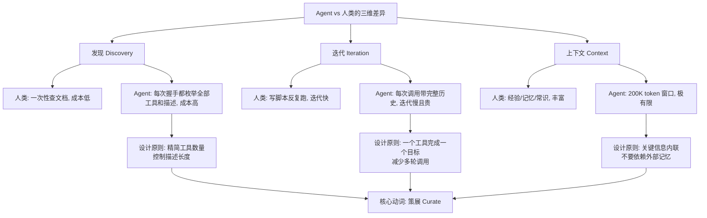

# MCP Server 不是 API：给 AI Agent 设计界面的五条产品法则

# 一句话导读

大多数 MCP Server 之所以难用，不是因为协议有问题，而是因为开发者把它们当 API 写了——而 Agent 需要的是产品界面。

# 适合谁看

- 正在开发或维护 MCP Server，发现 Agent 调用效果不好的工程师
- 需要评估"要不要把现有 REST API 暴露给 Agent"的技术决策者
- 构建 AI Agent 产品、需要理解服务端设计如何影响 Agent 表现的产品经理
- 刚接触 MCP、想避开常见坑的入门开发者
- 负责 Agent 基础设施、关心 token 成本和调用效率的团队

# 读完你会获得什么

- 能说清 Agent 和人类在使用 API 时的三个本质差异，以及为什么这个差异决定了 MCP Server 的设计逻辑
- 能判断一个 MCP Server 是"好的产品"还是"裸奔的 API"，并知道从哪里改起
- 能按照五条原则从零设计或重构一个 MCP Server
- 能理解"Agent Story"这个概念，并用它替代"API Endpoint"来驱动设计
- 能避开 REST API 转 MCP Server 时最常见的陷阱
- 能建立"MCP Server 是用户界面"的设计直觉

---

## 01 背景：为什么这个问题现在值得讨论

MCP（Model Context Protocol）发布刚满一年。这一年里，生态爆发式增长——以 FastMCP 为例，日均下载量已达 150 万次，成为构建 MCP Server 的事实标准。

但数量增长不等于质量增长。大量 MCP Server 被构建出来，却很难被 Agent 正确使用。问题出在哪里？

**出在认知错位。** 开发者把 MCP Server 当成了 API 的另一种暴露形式——把 REST endpoint 照搬过来，挂个 MCP 工具名，就算完成。但 Agent 不是人类开发者。人类用 API 的方式和 Agent 用 MCP Server 的方式，在三个关键维度上完全不同。无视这些差异，直接把人用的接口丢给 Agent，结果就是：Agent 调不准、调得慢、调得贵。

这不是一个协议层的技术问题，而是一个**产品设计问题**。MCP Server 本质上是 Agent 的用户界面——就像网站是人类用户的界面一样。你需要为它的使用者的能力边界来设计。

---

## 02 核心判断：视频真正想讲的不是"怎么写 MCP Server"

演讲者表面在讲 MCP Server 的最佳实践，实际在讲一个更根本的问题：**当你的用户是 AI Agent 时，产品设计该怎么做？**

这个问题的底层逻辑是：我们给人类设计产品时，会研究人的认知特点、操作习惯、信息处理能力，然后针对性地设计界面和交互。但当用户变成 Agent 时，大多数人跳过了这一步——直接假设"Agent 能用 API 就行"。

这个假设有两个致命错误：

1. **Agent 不是完美的。** 它会犯错、会困惑、会在错误方向上浪费大量 token。把它当成万能执行者，是在忽视它真实的能力边界。
2. **人类自己也不用裸 API。** 人类用 API 时，会给自己套上 SDK、客户端、Web 界面——任何能减少直接接触裸 API 的东西。那为什么给 Agent 就只给裸 API？

所以核心判断是：**Agent 值得拥有自己的、针对其能力优化过的界面。** MCP Server 就是这个界面。设计它的过程，就是为 Agent 做产品设计的过程。

---

## 03 概念澄清：先把关键名词讲准确

### MCP（Model Context Protocol）

- **它是什么**：一个标准协议，定义 LLM 与外部工具/数据源之间的通信方式
- **它解决什么问题**：在没有 MCP 之前，每个 Agent 框架都要自己定义工具调用接口，互不兼容。MCP 提供了统一的"插头"标准
- **它不是什么**：它不是 Agent 框架本身，不负责 Agent 的推理、记忆、规划
- **和相关概念的区别**：MCP 是协议层（类似 USB 标准），FastMCP 是基于协议的高层框架（类似 USB 设备驱动开发套件）
- **一个简单例子**：就像 USB-C 让任何充电器能给任何手机充电，MCP 让任何 Agent 能调用任何工具服务器

### MCP Server

- **它是什么**：一个遵循 MCP 协议的服务端程序，向 Agent 暴露一组工具（tools）和数据（resources）
- **它解决什么问题**：让 Agent 能以标准化方式访问特定能力（查天气、查订单、操作数据库等）
- **它不是什么**：它不是 REST API 的简单映射，不是微服务，不是 Agent 本身
- **核心定位**：它是 **Agent 的用户界面**，不是后端服务的传输层

### FastMCP

- **它是什么**：构建 MCP Server 的高层 Python 框架，由演讲者创建
- **它解决什么问题**：简化 MCP Server 开发——用装饰器声明工具，自动处理协议细节
- **它不是什么**：它不是 MCP 协议本身，也不是 MCP SDK（底层原语库）
- **定位变化**：FastMCP 正在定位为"高层接口"，MCP SDK 将专注底层原语，两者将明确分层

### Agent Story

- **它是什么**：描述一个 Agent 需要完成的目标的单元，类似人类产品中的 User Story
- **它解决什么问题**：驱动 MCP Server 的工具设计——每个工具应该对应一个 Agent Story
- **它不是什么**：它不是 API endpoint 的功能描述，不是技术任务拆分
- **和 User Story 的区别**：User Story 面向人类用户（有广泛经验、能快速迭代），Agent Story 面向有限上下文窗口的自主程序

---

## 04 整体框架：Agent 与人类的三维差异如何驱动设计

理解 MCP Server 设计原则的前提，是理解 Agent 和人类在"使用外部能力"时的本质差异。演讲者提炼了三个维度：**发现（Discovery）、迭代（Iteration）、上下文（Context）**。



**文字解释：**

人类开发者调用 REST API 时：查一次文档，写一个脚本，反复运行直到成功。发现成本低（一次性），迭代成本低（本地循环快），上下文丰富（经验+文档+搜索引擎）。

Agent 调用 MCP Server 时：每次连接都要完整握手，枚举所有工具及其描述；每次调用都要发送完整对话历史；上下文窗口只有 200K token，且与其他任务共享。

这三个维度的差异意味着：**对人类友好的 API 设计，对 Agent 可能是灾难。** 人类能自己完成发现、迭代和上下文补全，Agent 不行。所以 MCP Server 必须替 Agent 做这些事——这就引出了"策展"（Curate）这个核心动作。

---

## 05 关键机制：五条设计原则如何分别解决三个维度的问题

### 原则一：结果优先于操作（Outcomes over Operations）

- **输入**：一堆原子化的 API 操作（如 `get_user`、`list_orders`、`filter_status`）
- **中间处理**：将这些操作在服务端串联，封装成一个面向目标的工具（如 `track_latest_order`）
- **输出**：Agent 只需调用一个工具、传一个邮箱，就能拿到订单状态
- **为什么这样设计**：Agent 的迭代成本极高。让它自己决定调用顺序、处理中间结果，不仅慢，而且容易出错。服务端编排是确定性的，Agent 编排是概率性的——能用确定性解决的，不要交给概率
- **代价**：工具的灵活性降低。但 MCP Server 的目标是让 Agent 成功，不是让 Agent 自由
- **适合场景**：流程确定的多步骤操作（查订单、创建资源、审批流程）
- **不适合场景**：流程本身需要 Agent 判断的（不常见，但如果存在，可拆分判断点和执行点）

**关键概念：Agent Story。** 不要问"这个 API endpoint 暴露什么功能"，而要问"Agent 要完成什么目标"。一个工具 = 一个 Agent Story。

**命名也要为 Agent 服务。** 工具名不是给未来维护代码的开发者看的，是给 Agent 在推理时用来判断"该不该调这个"的。`track_latest_order` 比 `get_order` 好——因为前者告诉 Agent 结果是什么，后者只说了操作。

### 原则二：扁平化参数（Flatten Arguments）

- **输入**：嵌套的配置对象（如 `config: dict`）
- **中间处理**：展开成独立参数，每个参数类型明确
- **输出**：`email: str`、`include_canceled: bool`、`status: Literal["pending", "shipped", "delivered"]`
- **为什么这样设计**：Agent 构造复杂嵌套对象的能力远弱于人类。字典里每个字段的含义、格式、约束——除非写得很清楚，否则 Agent 要猜。猜错了就得迭代，迭代又回到"慢且贵"的问题
- **代价**：参数列表变长，但这是 Agent 可读性的胜利
- **适合场景**：几乎所有场景
- **不适合场景**：几乎不存在——如果参数真的复杂到无法扁平，考虑拆工具

**关于 Literal/Enum 的实操建议**：当你知道参数的可选值时，用 `Literal["pending", "shipped"]` 而不是 `str`。当前大多数 LLM 不知道 Python 的 Literal 语法，但它们能理解 `format: str = "basic"` 这种带默认值的写法。无论哪种，约束选择范围都能减少 Agent 的决策空间。

**关于紧耦合参数**：如果一个参数的合法值依赖于另一个参数的值（比如 `file_type` 决定了 `processing_mode` 的选项），这对 Agent 是额外的认知负担。尽量通过设计消除这种耦合，或将验证逻辑内置于工具内部。

### 原则三：指令即上下文（Instructions are Context）

- **输入**：一个没有文档的 MCP Server
- **中间处理**：为 Server 添加 `instructions` 字段，为每个工具添加完整的 docstring（含示例）
- **输出**：Agent 在握手时就读到如何使用你的 Server，减少猜测
- **为什么这样设计**：Agent 的上下文窗口有限，它不会去"搜文档"。它看到什么就是什么。你的 docstring 是它在调用前唯一能参考的信息
- **代价**：文档占用 token 预算（与原则四存在张力）
- **关键陷阱**：
  - **双重文档问题**：不要把用法说明放在 system prompt 或子 Agent 定义里，然后工具的 docstring 又写一份。当你修改工具时，两份文档会不一致，只有错误信息能救场
  - **示例即契约**：如果你的示例里有 2 个 tag，Agent 几乎永远会返回 2 个 tag——即使你要求"至少 1 个"。示例不只是参考，它对 Agent 来说是强信号。考虑用偏离常规的示例来减弱这种锚定效应

**关于错误信息**：这是被严重低估的设计杠杆。Agent 收到错误时，它看到的不是 HTTP 400 状态码，而是一段文本——这段文本会进入它的下一次推理。所以：**错误信息就是 Agent 的下一个 prompt。**

- 空 `ValueError` → Agent 知道错了，但不知道怎么改
- `"email 格式应为 user@domain.com，当前输入缺少 @ 符号"` → Agent 知道怎么改

更进一步：如果你有一个参数复杂的工具，与其在 docstring 里穷举所有规则，不如在错误信息里渐进地告诉 Agent 如何修正。这是一种"承认 Agent 第一次可能调错"的设计策略——不优雅，但实用。

### 原则四：尊重 Token 预算（Respect the Token Budget）

- **输入**：一个有 800 个工具的 MCP Server
- **中间处理**：假设 200K token 上下文窗口，800 个工具平均每个只能分到 250 token（含 schema + 名称 + 描述）
- **输出**：要么工具描述被截断，要么 Agent 的上下文被塞满，无法做任何推理
- **为什么这样设计**：这不是优化问题，是生存问题。**这是五条原则中唯一一条不遵守就会直接导致 Server 不可用的**
- **代价**：必须在功能丰富度和信息密度之间做取舍

**一个触目惊心的算术**：某公司在把 800 个 API endpoint 转 MCP 时，每个工具即使只分配 250 token 用于名称+schema+最简描述，光工具列表就占满了整个上下文窗口。Agent 连推理的空间都没有。

**50 工具是警戒线**：超过 50 个工具暴露给同一个 Agent，性能开始退化。这指的是 Agent 可见的工具总数——如果你有 2 个各 50 工具的 Server 连到同一个 Agent，Agent 面对的是 100 个工具。

**缓解策略**：
- 拆分 Server（管理工具 vs 用户工具）
- 语义路由（GitHub Server 用 170 个工具 + 语义匹配层来缓解）
- 渐进式披露（先暴露高频工具，通过元工具让 Agent 按需发现更多）
- 只暴露核心 endpoint，其余通过"深度工具"按需调用

### 原则五：无情策展（Curate Ruthlessly）

- **输入**：一个功能齐全但臃肿的 MCP Server
- **中间处理**：删掉不常用的工具、合并功能重叠的工具、把底层操作封装为高层结果
- **输出**：一个精简的、Agent 能高效使用的 Server
- **为什么这样设计**：Agent 能"在干草堆里找针"，但它会检查每一根干草。你放的干草越多，它越慢、越贵、越容易找错
- **代价**：需要持续维护，定期审查哪些工具真正被 Agent 使用

**关于 REST API 转 MCP Server 的禁忌**：这是违反所有五条原则的最快方式。REST API 是面向人类的原子操作集合，MCP Server 应该是面向 Agent 的目标导向界面。直接转换 = 把网站后端直接暴露给用户。

但有一个合理的妥协：**用 REST 转 MCP 来启动，但不要止步于此。** 先暴露几个关键 endpoint，验证 Agent 能调用成功，然后逐步替换为真正为 Agent 设计的工具。FastMCP 提供了自动转换功能——它的定位是"脚手架"，不是"成品"。

---

## 06 方法拆解：如何从零设计或重构一个 MCP Server

### 步骤一：写 Agent Story

- **目标**：明确你的 MCP Server 要帮 Agent 完成什么
- **具体动作**：不要从 API endpoint 列表开始，从 Agent 的目标场景开始写。格式："作为一个连接到此 Server 的 Agent，我需要___，以便___"
- **判断标准**：每个 Agent Story 应该对应一个可独立完成的目标，而不是一个技术操作
- **常见坑**：把 User Story 改个名字就叫 Agent Story——Agent Story 要考虑上下文窗口和迭代成本
- **产出物**：3-10 个 Agent Story 列表

### 步骤二：为每个 Story 设计一个工具

- **目标**：一个工具对应一个 Agent Story
- **具体动作**：把完成该目标所需的所有内部操作（API 调用、数据处理、条件判断）封装在工具内部。服务端做编排，不让 Agent 做
- **判断标准**：Agent 调用这个工具时，能否只传简单参数就拿到最终结果？
- **常见坑**：工具里又暴露了中间步骤——这说明你在写操作，不是结果
- **产出物**：每个工具的函数签名和内部流程

### 步骤三：扁平化所有参数，用 Literal 约束选择

- **目标**：让 Agent 不需要猜参数格式
- **具体动作**：
  - 嵌套 dict → 展开为独立参数
  - 字符串选项 → `Literal["a", "b", "c"]`
  - 布尔标志 → 带默认值的 `bool`
  - 必填 vs 选填 → 明确标注
- **判断标准**：Agent 看到参数名和类型，能否不查文档就正确传值？
- **常见坑**：保留了一个 `config: dict`——"因为有些参数不常用"。不常用的参数要么删掉，要么拆成另一个工具
- **产出物**：每个工具的完整参数定义

### 步骤四：写文档——docstring + 示例 + 错误信息

- **目标**：让 Agent 在握手时就有足够信息正确使用工具
- **具体动作**：
  - 每个 docstring 说明：工具做什么、参数含义、返回格式
  - 加 1 个示例（注意：示例的模式会被 Agent 强烈模仿，选择偏离常规的示例来减弱锚定）
  - 关键错误路径写清楚修正指引
  - Server 级别的 `instructions` 字段写高层说明
- **判断标准**：不看任何外部文档，只看工具描述，能否正确使用？
- **常见坑**：
  - 双重文档（system prompt 和 docstring 各写一份）
  - 示例太"正常"导致 Agent 被锚定
  - 错误信息只说"失败"不说"怎么改"
- **产出物**：每个工具的完整 docstring，Server 的 instructions 字段

### 步骤五：审查 Token 预算

- **目标**：确保所有工具的 schema + 描述总量不超过 Agent 上下文的合理比例
- **具体动作**：
  - 粗算：每个工具的描述 × 工具数量 ≤ 上下文窗口的 30-40%（留给推理和历史）
  - 超过 50 个工具 → 必须拆分 Server 或引入路由机制
  - 使用 `readOnlyHint` 注解标记只读工具（部分客户端会据此调整权限策略）
- **判断标准**：Agent 连接后，还有没有足够的 token 空间做 3 轮以上的推理？
- **常见坑**：觉得"每个工具描述已经很精简了"——但 50 个精简描述加在一起仍然很长
- **产出物**：工具数量确认，必要时拆分出的子 Server

### 步骤六：删掉不必要的工具

- **目标**：只保留 Agent 真正需要的工具
- **具体动作**：
  - 有没有功能重叠的工具？合并
  - 有没有只在罕见场景才用的工具？移除或降级为"按需发现"
  - 有没有底层操作被暴露为工具？收回内部
- **判断标准**：删掉这个工具后，Agent 是否仍能完成所有 Agent Story？
- **常见坑**：舍不得删——"万一以后要用"。MCP Server 不是 API 的版本化仓库，是 Agent 的界面
- **产出物**：最终的工具清单

---

## 07 案例讲解：从"坏 Server"到"好 Server"

### 场景背景

一个电商团队需要让 Agent 能帮用户查询订单状态。后端有三个 REST API：`get_user(email)` → `list_orders(user_id)` → `filter_status(orders, status)`。

### 遇到的问题

**初版 MCP Server**（坏版本）：直接暴露三个工具——`get_user`、`list_orders`、`filter_status`，每个工具对应一个 API endpoint。

Agent 调用时会发生什么？
1. 先调 `get_user`——但传的邮箱格式对吗？
2. 再调 `list_orders`——但 user_id 从哪来？上一步返回的结构是什么？
3. 再调 `filter_status`——status 的合法值是什么？
4. 任何一步出错，都要再来一轮，每轮都带完整历史

最少 3 次调用，每次都可能出错，每次出错都是一整轮迭代。

### 按框架如何处理

**Agent Story**：作为一个 Agent，我需要通过用户邮箱追踪其最新订单状态。

**重构后的工具**：

```python
@mcp.tool()
def track_latest_order(
    email: str,
    include_canceled: bool = False,
    status: Literal["pending", "shipped", "delivered"] = "pending",
) -> str:
    """Track the latest order for a given email address.

    Args:
        email: Customer email address (e.g., user@example.com)
        include_canceled: Whether to include canceled orders
        status: Filter by order status

    Returns:
        Order details including ID, status, and estimated delivery
    """
    # 内部完成三步 API 调用，Agent 只需调一次
    user = api.get_user(email)
    orders = api.list_orders(user.id)
    result = api.filter_status(orders, status, include_canceled)
    return format_order_summary(result)
```

### 最终结果

Agent 一次调用，传一个邮箱和可选的状态过滤，直接拿到结果。零出错空间，零迭代成本，零认知负担。

### 说明了什么

三个原子操作变成一个结果导向工具后，Agent 的调用路径从"3 次可能出错的调用"变成了"1 次确定性调用"。API 调用仍然发生了三次——但它们在服务端执行，是确定性的，不消耗 Agent 的上下文和 token。

---

## 08 常见误区

### 误区一："Agent 能用 API，所以直接暴露 API 就行"

- **错误理解**：Agent 和人类开发者一样，能自己读文档、调接口、处理错误
- **为什么错**：Agent 的发现成本、迭代成本、上下文限制都远高于人类。裸 API 对人类勉强可用，对 Agent 是灾难
- **正确理解**：Agent 需要的是为它优化过的界面，不是裸 API
- **应该怎么做**：用 Agent Story 驱动工具设计，而不是用 API endpoint 驱动

### 误区二："工具越多，Agent 能力越强"

- **错误理解**：多暴露工具 = 多给选择 = Agent 更灵活
- **为什么错**：每个工具都消耗 token 预算。50+ 工具时性能退化，800 工具时上下文直接溢出
- **正确理解**：工具越精，Agent 越强。"干草堆越大，找针越慢"
- **应该怎么做**：50 工具是警戒线，5 个是理想值。删掉 Agent 不用的工具

### 误区三："示例只是参考，Agent 会灵活理解"

- **错误理解**：示例只是展示格式，Agent 会根据实际需求调整
- **为什么错**：示例对 Agent 是强锚定信号。示例有 2 个 tag，Agent 几乎永远返回 2 个 tag
- **正确理解**：示例即契约——Agent 会忠实地复现示例的模式
- **应该怎么做**：选择偏离常规的示例来减弱锚定；不要用"典型值"做示例

### 误区四："错误信息只要报错就行"

- **错误理解**：抛一个 `ValueError` 或 MCP 错误码就够了，Agent 会知道怎么处理
- **为什么错**：Agent 收到错误时，错误信息就是它下一次推理的输入。空错误 = 空输入 = 再次犯错
- **正确理解**：错误信息是 Agent 的下一个 prompt，写清楚怎么修正
- **应该怎么做**：错误信息包含具体的修正指引（"邮箱格式应为 user@domain.com"）

### 误区五："REST API 转 MCP 是合理的起点，也是合理的终点"

- **错误理解**：用 FastMCP 的自动转换一键生成 MCP Server，就完成了
- **为什么错**：转换出来的 Server 违反全部五条原则——原子操作而非结果导向、参数嵌套、无策展、token 预算失控
- **正确理解**：REST 转 MCP 是脚手架，不是成品。用它验证连通性，然后逐步替换为 Agent 友好的设计
- **应该怎么做**：先暴露 2-3 个核心 endpoint，确认 Agent 能调用，然后按 Agent Story 重构

### 误区六："文档放在 system prompt 里和放在 docstring 里一样"

- **错误理解**：在 system prompt 里写了工具用法，docstring 就不用写了（或反过来）
- **为什么错**：两份文档会不一致。当你修改工具时，只更新了一处，另一处变成错误信息。只有运行时错误才能暴露这种不一致
- **正确理解**：工具的文档就在工具自身的 docstring 里，单一来源
- **应该怎么做**：docstring 是唯一文档源。Server 级别的 instructions 写高层概览，不写具体工具用法

### 误区七："命名要遵循代码规范，Agent 会自己理解"

- **错误理解**：工具名用 `get_order` 这种通用命名，比 `track_latest_order` 更"规范"
- **为什么错**：Agent 选工具时依赖名称推理。通用名称不提供决策信息，结果导向名称直接告诉 Agent "调我就能达到这个目标"
- **正确理解**：工具名是为 Agent 的推理服务的，不是为代码可维护性服务的
- **应该怎么做**：用描述结果的动词命名（track、find、create），不用描述操作的动词（get、list、update）

---

## 09 实战清单：读完后可以马上照着做

### 立即能做

1. **审查你现有 MCP Server 的工具数量**：超过 50 个？标记出哪些是 Agent Story 驱动的，哪些是 API endpoint 的直译
2. **为每个工具的 docstring 加上错误修正指引**：把所有抛空异常的地方改为包含具体修正说明的错误信息
3. **检查是否存在紧耦合参数**：一个参数的合法值依赖另一个参数的值？尝试拆分或内化验证逻辑
4. **把 `Literal` 类型加到所有有约束选项的参数上**：字符串参数如果有固定选项，改用 `Literal["a", "b", "c"]`

### 一周内能做

1. **重写工具名**：把操作导向的名称（get_xxx、list_xxx）改为结果导向的名称（track_xxx、find_xxx）
2. **为 Server 添加 `instructions` 字段**：写一段高层说明，让 Agent 握手时就知道这个 Server 能做什么
3. **扁平化所有嵌套参数**：逐个检查 `dict`/`object` 类型的参数，展开为独立字段
4. **算一次 token 预算**：估算你的 Server 握手时占多少 token，占 Agent 上下文窗口的多少比例

### 长期要沉淀

1. **建立 Agent Story 驱动的设计流程**：新工具的起点是 Agent Story，不是 API endpoint 列表
2. **定期策展**：每月审查工具使用情况，删掉 Agent 不用的工具，合并功能重叠的工具
3. **渐进式重构 REST 直译的 Server**：如果是从 REST API 转换来的，逐步替换为 Agent 友好的设计——每季度至少重构 2-3 个工具
4. **为只读工具添加 `readOnlyHint` 注解**：帮助支持该注解的客户端优化权限策略
5. **追踪 MCP 生态演进**：Elicitation（中途请求用户输入）、异步任务（SIP-1686）、语义路由等能力在成熟后，会为工具设计提供新的可能性

---

## 10 总结

MCP 协议解决了"Agent 怎么连接工具"的问题，但没有解决"工具怎么对 Agent 友好"的问题。后者是产品设计的课题，不是协议设计的课题。

Agent 和人类在发现、迭代、上下文三个维度上有本质差异。这些差异决定了：直接把人类用的 API 暴露给 Agent，效果一定不好。你需要为 Agent 设计专属的界面——就像你不会把数据库 schema 直接展示给终端用户一样。

五条原则——结果优先于操作、扁平化参数、指令即上下文、尊重 token 预算、无情策展——是对这三个维度差异的具体回应。它们不是理论，而是从大量 MCP Server 实践中提炼出的设计约束。违反任何一条，Agent 的调用效果都会打折扣；违反第四条，Server 直接不可用。

**你不是在构建工具，你在构建用户界面。** 只不过这个界面的用户，是一个上下文窗口有限、迭代成本极高、但能在约束条件下表现出色的自主程序。为它的能力边界设计，而不是为它的理论能力设计——这是 MCP Server 产品设计的核心判断。
