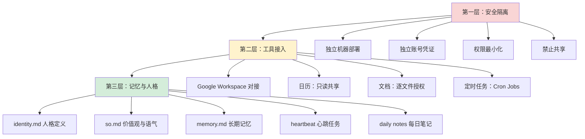

# 把 AI 助手变成「自己人」：OpenClaw 个性化配置实战指南

# 一句话导读

安全地部署一个真正懂你的 AI 助手，关键不在工具本身，而在权限设计、记忆架构和人格调校三件事。

# 适合谁看

- 想用 AI 管理日程、文档、信息流，但不想把全部数据交给商业产品的知识工作者
- 已经用过 ChatGPT/Claude，但觉得「对话式 AI」和「真正替你办事的 AI」之间还有巨大鸿沟的人
- 内容创作者，希望 AI 能自动汇总数据、生成报告、管理发布节奏
- 对开源 AI 工具有兴趣，想知道一个人能把自己的 AI 助手做到多深
- 正在评估是否要把 Google Workspace 等核心工具的权限开放给 AI 的决策者

# 读完你会获得什么

- 理解「聊天 AI」和「个人代理 AI」的根本区别——为什么后者需要完全不同的安全策略
- 掌握 AI 助手的权限最小化原则：哪些该给、哪些绝对不给、哪些只能只读
- 能照着步骤完成 Google Workspace 与 AI 助手的安全对接
- 理解 AI 记忆系统的架构：人格文件、长期记忆、每日笔记、心跳任务各管什么
- 能设计自己的每日简报和周期报告，把零散信息流变成结构化输入
- 避开最常见的安全陷阱——尤其是「把自己的 AI 助手暴露给他人」这个致命错误

---

## 01 背景：为什么这个问题现在值得讨论

AI 聊天工具已经足够好用了。ChatGPT 能写文案，Claude 能分析文档，Gemini 能看图。但它们的共同局限是：**每次对话，你都要从零开始**。它们不知道你昨天在想什么，不知道你这周的重点是什么，不知道你日历上有什么，更不可能主动提醒你该做什么。

这就好比你每天都要重新认识一个能力很强但完全没有记忆的助手。它能做事，但它不认识你。

与此同时，一批开源项目正在尝试另一条路：**让 AI 驻留在你自己的机器上，持续运行，接入你的工具，积累对你的理解，成为一个真正长期可用的个人代理。** OpenClaw 就是这类项目中的一个代表——一个人开发的、开源的、可以 24/7 运行的个人 AI 助手。

但问题在于：**让 AI 接入你的日历、邮件、文档和社交账号，这件事天然有风险。** 权限给多了，泄露不可避免；权限给少了，AI 做不了什么事。大多数人要么不敢用，要么用了但配置太粗，留下一堆安全隐患。

这篇文章要解决的就是这个核心矛盾：**怎么在安全边界内，把一个通用 AI 助手调校成真正懂你、能替你办事的「自己人」。**

---

## 02 核心判断：视频真正想讲的不是「OpenClaw 怎么用」

视频表面上是一个 OpenClaw 的使用教程——日历管理、文档编辑、语音聊天、每日简报、周报生成。但它的真正判断是：

**AI 助手的价值不取决于它能做什么，而取决于你花了多少心思让它理解你。**

视频里最值得注意的部分不是那五个演示案例——那些只是「它能干什么」的表层。真正有价值的是后半段：作者打开文件管理器，展示了 AI 助手背后的那些 `.md` 文件——人格定义、价值观声明、长期记忆、开放性任务追踪、每日复盘笔记。这些文件才是让 AI 从「工具」变成「自己人」的关键。

反过来，视频也在暗示一个警告：如果你只是装上 OpenClaw，连上 Google Workspace，然后开始聊天，你会得到一个功能上能跑、但本质上和 ChatGPT 没区别的东西。**权限给了，记忆没建，等于白给。**

---

## 03 概念澄清：先把关键名词讲准确

### 个人代理 AI（Personal AI Agent）

- **它是什么**：一个持续运行、拥有持久记忆、能操作你的工具（日历、文档、邮件）的 AI 系统。它不是按次对话的，而是持续在线的。
- **它解决什么问题**：对话式 AI 的「失忆症」和「无手症」——它既记不住你是谁，也动不了你的任何东西。
- **它不是什么**：它不是聊天机器人。聊天机器人是被动的：你问它答。个人代理是主动的：它可以定时发简报、追踪你的目标、在你忘事时提醒你。
- **它和聊天 AI 的区别**：ChatGPT 是「每次重新认识你的聪明陌生人」，个人代理是「越用越懂你的长期搭档」。
- **例子**：你告诉 AI「我下周三有个重要会议」，聊天 AI 会说「好的，祝你顺利」。个人代理会主动在周三早上提醒你，附上相关文档链接，并在会后问你进展如何。

### OpenClaw

- **它是什么**：一个开源的个人 AI 助手框架，可以 24/7 运行在你自己的机器上，通过 Telegram 等界面交互，接入 Google Workspace 等外部服务。
- **它解决什么问题**：让普通人也能拥有一个可自托管的、数据不出本地的个人 AI 代理，而不是把所有信息交给大厂。
- **它不是什么**：它不是 SaaS 产品，不是开箱即用的。它需要你自己部署、配置、维护。
- **例子**：作者把 OpenClaw 部署在一台 Mac Mini 上，通过 Telegram 和它对话，给它取名 Zoe。

### 权限最小化原则

- **它是什么**：给 AI 的每个权限都应该是完成特定任务所需的最小集合。只读的绝不给写，限定文件的绝不给全盘。
- **它解决什么问题**：避免 AI 助手成为数据泄露的单一突破口。一旦 AI 被社交工程攻破或误操作，损害范围可控。
- **它不是什么**：它不是「不给权限」。恰恰相反，它要求你精确地思考每个权限的必要性，然后精准地授予。
- **例子**：AI 需要读你的日历？给它「只读」权限，而不是把整个 Google 账号的管理权交给它。AI 需要编辑某个文档？只共享那个文档，而不是整个 Drive。

### 记忆架构（Memory Architecture）

- **它是什么**：AI 助手用来存储和检索关于你的长期知识的文件系统。在 OpenClaw 中，这是本地的一组 Markdown 文件。
- **它解决什么问题**：让 AI 在每次对话之外，拥有跨对话的、结构化的、可编辑的持久记忆。
- **它不是什么**：它不是传统数据库，不是向量检索，不是嵌入模型。它就是可读可写的文本文件，人和 AI 都能直接编辑。
- **它和 RAG 的区别**：RAG 是从文档库中检索相关片段来辅助回答；记忆架构是 AI 主动维护的、关于「你是谁」的结构化认知。RAG 回答「文档里写了什么」，记忆架构回答「这个人是谁、他在乎什么、他现在在做什么」。
- **例子**：AI 在记忆文件中记下「这个人最近在搭建基础设施，需要提醒他从搭建转向产出」，然后在每日简报中写道：「你一直在配置工具，该开始用工具做内容了。」

---

## 04 整体框架：这套内容应该如何理解

把整个配置过程理解为一个三层架构，从外到内：

**三层逻辑**：

- **第一层（安全隔离）是地基**。没有这一层，后面做再多都是空中楼阁。给 AI 太大权限又不隔离，出事只是时间问题。
- **第二层（工具接入）是能力**。让 AI 真正能替你做事——改日历、编文档、发简报。但每一项接入都必须在第一层的约束下完成。
- **第三层（记忆与人格）是灵魂**。这一层决定了 AI 是一个「工具」还是一个「搭档」。大多数人只做到第二层就停了，这是最大的浪费。

三层之间的关系是递进的：**安全边界划清楚了，才敢接入工具；工具接入了，记忆才有素材积累；记忆积累了，人格才有依据生长。** 反过来，如果跳过安全直接接入工具，风险失控；如果接入了工具但不建记忆，AI 永远停留在「能用但不了解你」的阶段。

---

## 05 关键机制：它到底是怎么运行的

### 机制一：权限代理模式

- **输入**：你需要 AI 操作你的某个服务（如 Google Calendar）
- **中间处理**：不给 AI 你的主账号权限，而是给它一个独立账号，然后从主账号向独立账号做**有限共享**（只读共享日历、逐文件共享文档）
- **输出**：AI 通过独立账号读取你的日历、编辑你授权的文档，但你主账号的其余内容对它完全不可见
- **为什么这样设计**：如果 AI 的凭证泄露，攻击者只能访问 AI 账号下被共享的内容，而不是你的整个 Google 账号
- **代价**：配置更复杂——你需要维护两套账号、手动共享文件、设置 Google Cloud Project 来启用 API
- **适合场景**：任何你不想把全盘权限交给 AI 的服务。尤其是邮件、云盘、社交媒体等高敏感服务
- **不适合场景**：如果你对安全完全不敏感（比如只是拿 AI 管理公开信息），可以简化配置——但这不是推荐做法

### 机制二：Cron Job 定时任务

- **输入**：你告诉 AI「每天早上给我发简报」或「每周给我发创作数据报告」
- **中间处理**：AI 设置定时任务，到时间后自动拉取多个数据源（日历、文档、Twitter、YouTube 数据、Substack 统计），汇总生成报告，通过聊天或邮件发送给你
- **输出**：结构化的每日简报或每周报告
- **为什么这样设计**：信息收集是 AI 最擅长的重复性工作。让人每天手动查天气、看日历、刷趋势，既浪费时间又容易遗漏
- **代价**：定时任务依赖外部 API 的稳定性。如果某个 API 挂了或改了接口，简报会缺数据。另外，简报质量取决于你接入的数据源是否足够丰富
- **适合场景**：你有多个信息源需要每日/每周汇总（日历 + 待办 + 社交 + 数据看板）
- **不适合场景**：你的信息来源单一，或者你更习惯主动查询而非被动接收

### 机制三：记忆文件系统

- **输入**：你和 AI 的日常对话、你手动写入的信息、AI 自动提炼的每日复盘
- **中间处理**：AI 将对话中的关键信息写入不同的 Markdown 文件——身份定义、价值观、长期记忆、开放任务、每日笔记
- **输出**：一组结构化的、人机可读的记忆文件，AI 在每次对话时读取这些文件来理解上下文
- **为什么这样设计**：纯对话历史是不可控的——太长、太碎、噪声太多。把记忆提炼成结构化文件，可以过滤噪声、保留洞察、让人也能审查和编辑
- **代价**：需要你持续维护这些文件的质量。如果记忆文件里塞满了无关信息，AI 的理解反而会变差。这不是「设了就不用管」的系统，而是「需要持续修剪的花园」
- **适合场景**：你和 AI 有长期、多主题的交互，需要 AI 跨对话追踪你的目标、偏好和状态
- **不适合场景**：你只是偶尔用 AI 做单次任务，不需要跨对话的上下文积累

---

## 06 方法拆解：如果自己要做，应该怎么落地

### 第一步：部署与隔离

**目标**：让 AI 在独立环境中 24/7 运行，与你的主账号完全隔离。

**具体动作**：
1. 准备一台专用机器（旧 Mac Mini、MacBook 均可），保持 24/7 在线
2. 为 AI 创建独立的 Apple ID 和 Gmail 账号
3. 在终端运行安全审计命令（OpenClaw 提供了 `security audit --deep`）
4. 配置机器的自动开机/保活工具，确保重启后 AI 自动恢复

**判断标准**：AI 的账号和你的主账号之间，除了你手动共享的内容之外，没有任何共享凭证。

**常见坑**：
- 用你自己的 Gmail 登录 AI 助手——这等于把主账号全盘交出
- 忘记配置自动保活，机器重启后 AI 离线你都不知道

**产出物**：一台独立运行 AI 助手的机器，拥有独立凭证。

### 第二步：权限配置

**目标**：只给 AI 完成特定任务所需的最小权限。

**具体动作**：
1. 从你的主 Google 账号，将日历以「只读」方式共享给 AI 的独立 Gmail
2. 对需要 AI 编辑的文档/表格，逐个用「编辑者」权限共享给 AI 的 Gmail
3. **永远不要**把整个 Google Drive 共享给 AI
4. 对社交媒体（如 Twitter），只给只读权限，不给发布权限

**判断标准**：列出 AI 能访问的每个服务和每个文件，确认每一项都是必要的，且权限级别是最低的。

**常见坑**：
- 为了方便，把整个 Drive 共享给 AI——一个误操作可能删除所有文件
- 给 AI 社交账号的写入权限——一旦被诱导，AI 可能发布你不想要的内容

**产出物**：一份权限清单，记录 AI 能访问的每个服务、权限级别和用途。

### 第三步：Google Cloud Project 配置

**目标**：让 AI 通过 Google API 程序化地操作你授权的服务。

**具体动作**：
1. 在 Google Cloud Console 创建新项目
2. 逐一启用所需的 API：Gmail API、Calendar API、Drive API、Docs API、Sheets API、Slides API
3. 配置 OAuth 同意屏幕，选择「外部」模式
4. 创建 OAuth 客户端（类型选「桌面应用」），下载 JSON 凭证文件
5. 将 JSON 文件提供给 AI，让它完成剩余的 OAuth 认证流程
6. 将你的主 Gmail 添加为测试用户

**判断标准**：AI 能通过 API 读取你共享的日历、编辑你共享的文档，但不能访问其他内容。

**常见坑**：
- Google Cloud Console 界面极其难用，容易迷路——遇到问题直接问你的 AI 助手，它可以给你分步指引
- 忘记添加测试用户——OAuth 在测试模式下只允许指定用户
- 忘记配置 API Scope——即使创建了凭证，没启用对应 Scope 也无法操作

**产出物**：一个配置完成的 Google Cloud Project，AI 可通过 API 操作你授权的服务。

### 第四步：设定定时任务

**目标**：让 AI 每天和每周自动生成个性化报告。

**具体动作**：
1. 在对话中告诉 AI 你希望每日简报包含哪些内容（天气、日历、待办、趋势、个人提醒）
2. 告诉 AI 你希望每周报告包含哪些数据（YouTube 统计、文章数据、竞品动态、内容建议）
3. 让 AI 设置 Cron Job——你不需要手动写 crontab，直接用自然语言告诉 AI 即可
4. 试运行几次，检查报告内容是否符合预期，调整信息源和格式

**判断标准**：每日简报在固定时间收到，内容覆盖你关注的所有维度，没有重大遗漏。

**常见坑**：
- 简报内容太泛——需要在初始指令中明确你关心的具体话题和数据维度
- 数据源不足——简报质量取决于你接入了多少信息源，只接日历的简报会很单薄

**产出物**：自动运行的每日简报和每周报告。

### 第五步：调校记忆与人格

**目标**：让 AI 的记忆文件和人格定义真正反映你的需求、偏好和价值观。

**具体动作**：
1. 打开 `identity.md`，设定 AI 的名字、语气和基本定位
2. 打开 `so.md`，写入你希望 AI 遵循的行为准则（如：直接坦率、不用 AI 套话、主动质疑我的观点、不使用 emoji）
3. 打开 `memory.md`，写入关于你的关键信息：当前角色、目标、能量来源、消耗来源、可用的工具和权限
4. 在 `memory.md` 中添加三个高价值分类：**开放性任务**（你提到过但未完成的事）、**矛盾与张力**（你的言行间的不一致）、**行为模式**（AI 观察到的你的规律）
5. 让 AI 每日自动生成日记文件（daily notes），记录当天对话要点
6. 定期审查记忆文件，删除过时信息、补充新洞察

**判断标准**：如果你问 AI「我最近在忙什么」或「我有什么未完成的事」，它能给出准确、有洞察的回答，而不是泛泛而谈。

**常见坑**：
- 记忆文件从不维护，信息越积越多，AI 开始引用过时或矛盾的内容
- 人格定义太模糊（如「友好、乐于助人」），导致 AI 回复和默认 ChatGPT 没区别
- 不敢让 AI 在人格定义中加入「质疑我」「主动提醒」等指令——结果 AI 沦为附和者

**产出物**：一套精心维护的记忆文件，构成 AI 理解你的基础。

---

## 07 案例讲解：用一个具体场景串起来

**场景背景**：周末早上，你想带家人坐火车去旧金山看展览，但需要查时刻表、安排行程、写计划文档、更新日程。

**遇到的问题**：传统做法需要打开浏览器查火车时刻表，切到 Google Calendar 创建事件，再打开 Google Docs 写行程计划——至少在三个应用间切换，每一步都要手动操作。

**按框架如何处理**：

1. **安全隔离已就位**：AI 助手（Zoe）有自己的 Gmail，你的日历已只读共享给它，行程文档已共享编辑权限。

2. **发一条消息**：「帮我查今天上午 10 点左右的 Caltrain 时刻表。」

3. **AI 搜索并返回结果**：Zoe 浏览网页，返回几个班次的时间。

4. **追加指令**：「帮我选 10:44 那班，发一个日历邀请，标题是『家庭出行——Ferry Building』，时长 3 小时。」

5. **AI 创建日历事件**：Zoe 在自己的日历上创建事件，把你添加为参与者。你在主账号收到邀请，可接受或拒绝。

6. **继续追加**：「在我们的行程文档里写一份计划，包括火车时间、Ferry Building 参观、午餐推荐。」

7. **AI 编辑文档**：Zoe 打开你共享的 Google Doc，写入结构化的行程计划，包含时间线、地点和推荐。

**最终结果**：你只发了几条消息，一个完整的周末出行计划就搞定了——日历有了，文档有了，连午餐推荐都有了。

**说明了什么**：AI 助手的真正价值不在单一功能（查时刻表、建日历、写文档这些你本来也能做），而在于**它把这些分散的操作整合到一个对话界面里**。你不需要在多个应用间切换，不需要复制粘贴，不需要手动同步。你只需要说话。

但这一切的前提是：**安全隔离做好了（你的主账号不会因为 AI 出问题而受影响），权限配置精确了（AI 只能碰你允许碰的东西），记忆系统运转了（AI 知道你家有小孩、偏好什么时间出门）。** 没有这三层基础，这个场景要么做不了，要么做了不安全。

---

## 08 常见误区：很多人会在哪里理解错

**误区一：「给 AI 完整的 Google 账号访问权限，它才能好好干活」**

- **错误理解**：权限越全，AI 越强。
- **为什么错**：完整权限意味着 AI 能读你的所有邮件、删你的所有文件、用你的身份发消息。一旦 AI 被诱导（社交工程攻击已经发生过），损害是不可逆的。视频中引用的真实案例：有人把 AI 助手放到了公开网站上，结果开始向公众泄露私人信息。
- **正确理解**：AI 的能力不取决于权限总量，而取决于权限精度。只读日历 + 逐文件编辑授权，已经能覆盖绝大多数使用场景。
- **应该怎么做**：永远为 AI 创建独立账号，用共享机制替代直接登录。

**误区二：「AI 助手装好就能用，和 ChatGPT 差不多」**

- **错误理解**：部署完 OpenClaw 就等于有了一个更强版的 ChatGPT。
- **为什么错**：刚装好的 OpenClaw 没有你的日历、没有你的文档、没有你的记忆、没有你的人格偏好。它就是一个空壳。你不花时间填充它，它就和任何聊天机器人没有区别。
- **正确理解**：AI 助手的价值和你在它身上投入的配置时间成正比。这不是开箱即用的产品，是需要调校的乐器。
- **应该怎么做**：完成部署后，立即开始第三层工作——填充记忆文件、定义人格、设置定时任务。这才是真正让 AI 变得有用的部分。

**误区三：「记忆文件写了就不用管了」**

- **错误理解**：把个人信息写进 memory.md 就一劳永逸了。
- **为什么错**：记忆文件会持续增长。AI 每天自动生成日记，长期记忆也在不断追加。如果不定期清理，信息会越来越杂，AI 开始引用过时或矛盾的内容。
- **正确理解**：记忆文件是需要修剪的花园，不是存了就忘的仓库。
- **应该怎么做**：每周花 10 分钟浏览记忆文件，删除过时条目，更新变化了的信息。

**误区四：「AI 能做的事越多越好」**

- **错误理解**：接入尽可能多的服务，让 AI 做尽可能多的事。
- **为什么错**：每多接入一个服务，就多一个攻击面。你不需要 AI 管理你生活的每一个角落，你需要它管理那些**重复的、信息密集的、容易遗漏**的部分。
- **正确理解**：AI 应该做的是那些「你不做会忘、做了又烦」的事：每日简报、日程提醒、数据汇总、文档起草。
- **应该怎么做**：从一个核心场景开始（比如每日简报），用熟了再逐步扩展。

**误区五：「我可以在群聊里共享 AI 助手」**

- **错误理解**：AI 助手和 Bot 一样，多人使用没问题。
- **为什么错**：你的 AI 助手拥有你的记忆、你的偏好、你的权限。把它放进群聊，等于让一群人看到一个了解你所有私事的角色。更糟的是，其他人可能通过社交工程让 AI 执行你不想要的操作。
- **正确理解**：个人 AI 助手必须是私有的。它的记忆和权限只服务于你一个人。
- **应该怎么做**：永远不要把 AI 助手加入群聊、公开网站或任何多用户环境。

**误区六：「Google Cloud 配置太难，算了不接了」**

- **错误理解**：Google Cloud 那套东西太复杂，不值得折腾。
- **为什么错**：Google Workspace 是多数人工作的核心基础设施。不接入它，AI 助手的能力会被严重限制——它无法管理你最常用的日历和文档。
- **正确理解**：配置确实痛苦（作者本人也吐槽了 Google Cloud 的界面），但在 AI 的帮助下，30 分钟可以搞定。而且这是一次性投入。
- **应该怎么做**：直接问你的 AI 助手怎么配置 Google Cloud Project，它可以给你分步指引。遇到界面找不到的地方，甚至可以截图给它看。

---

## 09 实战清单：读完后可以马上照着做

### 立即能做

- [ ] 为 AI 助手创建一个独立的 Gmail 账号，不要用你的主账号
- [ ] 从主账号将日历以「只读」方式共享给 AI 的独立 Gmail
- [ ] 选一个你想让 AI 编辑的 Google Doc，单独共享编辑权限给 AI
- [ ] 打开 AI 的 `identity.md` 和 `so.md`，写下你希望它的语气和行为准则

### 一周内能做

- [ ] 完成 Google Cloud Project 配置，启用 Calendar、Drive、Docs、Sheets API
- [ ] 设置一个每日简报 Cron Job，至少包含天气、日历和待办
- [ ] 在 `memory.md` 中写入你的核心信息：角色、目标、当前关注点、可用工具
- [ ] 在 `memory.md` 中添加「开放性任务」和「行为模式」两个分类

### 长期要沉淀

- [ ] 建立「记忆审查」习惯：每周浏览一次记忆文件，清理过时信息
- [ ] 逐步扩展 AI 的信息源：Twitter 只读、YouTube 数据、Substack 统计等
- [ ] 在 `so.md` 中持续细化 AI 的行为指令，让它越来越接近你想要的沟通风格
- [ ] 记录 AI 的实际使用中哪些任务它做得好、哪些经常出错，据此调整权限和配置
- [ ] 考虑是否需要设置 AI 的「矛盾追踪」功能——让它帮你发现言行间的不一致

---

## 10 总结：把全文收束成一个判断

个人 AI 助手正在从一个概念变成一个可用的现实。OpenClaw 这样的开源项目证明了一件事：**一个人、一台 Mac Mini、几个配置文件，就足以搭建一个 24/7 在线的、能管理你日程和文档的 AI 代理。**

但能搭和好用之间，隔着三道关。第一道是安全关：你是否愿意花时间做权限隔离，还是图省事把主账号全盘交出。第二道是能力关：你是否愿意忍受 Google Cloud 那样的痛苦界面，把 AI 接入你真正在用的工具。第三道是认知关：你是否愿意像维护一段关系一样，持续维护 AI 的记忆和人格——写入你的目标、修剪过时的信息、定义你希望它怎么和你说话。

大多数人在第一道关就退缩了——觉得太麻烦，或者觉得无所谓。少数人过了第二道关就停了——AI 能改日历、能编文档，觉得够用了。但真正让 AI 助手产生不可替代价值的，是第三道关。那些 `.md` 文件不是配置项，是你的 AI 助手理解你的唯一途径。你不填，它就是空壳。

**判断：个人 AI 助手的价值上限，由你在它身上投入的「自我认知」决定，而不是由它能接入多少 API 决定。** 一个只接入日历但记忆丰富的 AI，远比一个接入了十项服务但对你一无所知的 AI 更有用。
