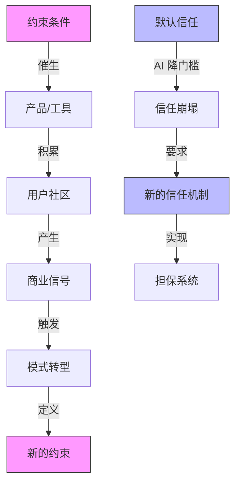

# 从约束中长出产品，在 AI 冲击下重建信任——Mitchell Hashimoto 的工程方法论与开源治理实践

# 一句话导读

一个从 12 岁自学编程、靠开源工具活过来的工程师，如何用约束驱动产品决策，又如何在 AI 低质量贡献洪流中为开源项目重建信任体系。

# 适合谁看

- 正在用 AI 写代码但不清楚边界在哪里的工程师
- 维护开源项目、被低质量 PR 困扰的 maintainer
- 想理解 HashiCorp 产品线背后设计逻辑的基础设施从业者
- 考虑创业或正在融资、想知道"什么时候该坚持、什么时候该转向"的技术创始人
- 需要制定 AI 使用策略的工程团队负责人

# 读完你会获得什么

- 理解"约束驱动产品"的具体含义，以及它和"需求驱动产品"的本质区别
- 能说清 HashiCorp 六大产品各自解决什么问题、为什么按那个顺序出现
- 掌握一套可执行的 AI Agent 工作流：始终让一个 Agent 做事，但绝不让它打断你
- 能判断开源项目何时需要从"默认信任"切换到"显式担保"模式
- 能区分"AI 加速开发"和"AI 制造噪声"的边界，并在团队中制定相应策略
- 理解为什么最好的工程师往往是最"无聊"的那群人

---

## 01 背景：为什么这个问题现在值得讨论

软件工程正在经历一次罕见的双重冲击。

**第一重冲击来自 AI 本身**。大模型让写代码变得极其容易——但也让制造"看起来合理实际错误"的代码变得同样容易。开源项目首当其冲：maintainer 们发现，每天收到的 PR 质量急剧下降，提交者不再是一个努力学习但水平有限的新手，而是一个根本没读过代码的 Agent。

**第二重冲击来自工作流的重组**。Agent 不只是写代码，它还在开 PR、做研究、跑测试。这改变了软件生产的节奏——从"人想清楚再动手"变成"Agent 先试，人再审"。这种节奏变化对代码审查、CI/CD、甚至版本控制本身都提出了新要求。

在这样的大背景下，Mitchell Hashimoto 的经历提供了一个稀缺的参照系。他从 12 岁靠开源软件活过来，到创立 HashiCorp 构建了定义云原生基础设施的工具栈，再到用 Zig 从零写一个终端模拟器 Ghostty——这个人的每个产品决策都在回答同一个问题：**在约束条件下，什么才是正确的做法？** 而他现在面对 AI 对开源的冲击，给出的回答同样是约束式的：用信任担保机制替代默认信任。

这些经验不只在"怎么做产品"层面有价值，更在"怎么在一个快速变化的环境中保持判断力"层面有价值。

---

## 02 核心判断：约束是产品的真实起点，信任是协作的真实货币

这段对话表面讲的是 HashiCorp 的创业故事、云厂商的关系、Ghostty 的架构，以及 AI 对开源的影响。但如果把所有内容压缩成一个判断，它说的是：

**好的产品从约束中长出来，好的协作从信任中长出来。当约束消失或信任被破坏时，系统会失灵——而修复的方式不是回到过去，而是设计新的约束和信任机制。**

具体来说：

- Vagrant 诞生于" consultancy 换客户时搭环境浪费 4 小时"的约束，而不是"开发者需要一个虚拟机工具"的需求。约束比需求更具体，因此指向的解法也更精确。
- HashiCorp 从纯开源转向 open-core，不是因为"想赚钱"，而是因为企业客户有明确的安全需求（secret replication），却没有预算归属——这是预算约束而非技术约束。
- AI 打破开源的方式不是"写坏代码"（坏代码一直有），而是消除了提交代码的**努力门槛**，从而破坏了基于努力和声誉的信任系统。解决方案不是禁止 AI，而是重建信任入口。

这条主线适用于 Mitchell 经历中的每个关键转折。

---

## 03 概念澄清：先把关键名词讲准确

### Infrastructure as Code (IaC)

- **它是什么**：用声明式配置文件定义基础设施（服务器、网络、存储等），由工具自动创建和管理，而非手动点击控制台。
- **它解决什么问题**：基础设施变更的可重复性和可审计性。手动操作不可复现、不可回滚、不可审计。
- **它不是什么**：不是"用脚本自动化部署"——脚本描述的是过程（先做 A 再做 B），IaC 描述的是状态（我要这些东西存在，怎么做到是你的事）。
- **和相关概念的区别**：和 Configuration Management（如 Ansible、Chef）的区别在于，后者管理的是机器内部的配置（装什么包、改什么配置文件），而 IaC 管理的是机器本身的存在（要不要这台机器、网络怎么连）。
- **例子**：在 AWS 控制台里手动点 20 次创建 VPC、子网、安全组——这是一次手动操作。用 Terraform 写一个 `.tf` 文件声明这些资源，运行 `terraform apply`——这是 IaC。

### Service Discovery

- **它是什么**：让服务在运行时自动找到其他服务的位置（IP、端口），而不依赖硬编码或静态 DNS。
- **它解决什么问题**：在动态扩缩容环境中，服务的网络位置频繁变化，静态配置跟不上。
- **它不是什么**：不是负载均衡（虽然常搭配使用），不是服务网格。
- **和相关概念的区别**：DNS 也能做"发现"，但 DNS 缓存导致更新延迟太长；Kubernetes 的 Service 资源内置了发现能力，Consul 把它独立为一个通用服务。
- **例子**：一个 Web 服务需要连接数据库。传统做法是在配置文件里写死数据库 IP。但当数据库因故障迁移到另一台机器时，Web 服务连不上。Consul 的做法是：数据库启动时向 Consul 注册"我是数据库，我现在在 10.0.1.5:5432"，Web 服务查询 Consul 获取最新地址。

### Open-Core

- **它是什么**：一种商业模式——核心软件开源，企业级功能（安全、合规、高可用等）闭源收费。
- **它解决什么问题**：让开源项目在保持社区传播力的同时，有可持续的商业收入。
- **它不是什么**：不是 Open Source（OSI 定义的开源不包含闭源组件），不是单纯的"开源 + SaaS"。
- **和相关概念的区别**：和纯开源模式的区别在于有闭源部分；和 SaaS 模式的区别在于核心是可自部署的开源软件；和"双许可"（dual licensing）的区别在于 open-core 是功能分层，双许可是同一功能两种许可。
- **例子**：Vault 开源版提供基础的 secret 管理和加密；Vault Enterprise 额外提供跨数据中心复制、HSM 集成、审计日志增强。企业为这些闭源功能付费。

### Vouching System（担保系统）

- **它是什么**：一种准入机制——新贡献者必须由已被信任的社区成员担保，才能提交 PR。
- **它解决什么问题**：AI 降低了提交代码的门槛，导致大量低质量 PR 涌入；担保系统把"默认允许"改为"默认拒绝，需担保方可进入"。
- **它不是什么**：不是代码审查（审查看代码质量，担保看人的可信度）；不是邀请制（邀请是项目方主动，担保是社区成员自发）。
- **和相关概念的区别**：和 CLA（贡献者许可协议）的区别在于，CLA 解决法律问题，担保解决信任问题；和 Lobsters 的邀请树类似，但 Ghostty 增加了"连坐"机制：如果你担保的人行为恶劣，你和所有你担保的人都会被封禁。
- **例子**：一个新开发者想给 Ghostty 提 PR。他需要先找到一位已在信任列表中的社区成员为他担保。担保人将自己的声誉押在这个新人身上。如果新人提交垃圾 PR，担保人和其整个邀请子树都会失去贡献资格。

---

## 04 整体框架：从约束到产品，从信任到治理

Mitchell 的经历可以沿两条主线理解：**产品线**（约束如何催生工具）和**治理线**（信任如何被破坏又如何重建）。

**产品线的逻辑**：每个产品都从一个具体约束出发。Vagrant 来自"换客户搭环境耗时"的约束，Packer 来自"EC2 启动太慢"的约束，Consul 来自"服务地址动态变化"的约束，Terraform 来自"手动管理云资源不可复现"的约束，Vault 来自"secret 在组织间流转无法追踪"的约束。这些产品不是来自"市场调研发现需求"，而是来自 Mitchell 和 Armon 自己在工作中撞到的墙。

**治理线的逻辑**：开源社区默认信任——任何人可以提 PR，maintainer 审查后决定合并。这套系统的稳定运行依赖一个隐含前提：提交 PR 需要足够多的努力，因此低质量贡献自然稀少。AI 打破了这个前提。当提交一个 PR 只需要几秒钟的 Agent 指令时，信号噪声比急剧下降。解决方案不是回到过去，而是设计新的信任入口——担保系统。

两条线的交汇点：**约束和信任本质上是同一件事**。约束限制了行为的范围，使系统可预测；信任限制了参与的范围，使协作可管理。当约束被移除（AI 降低了努力门槛），信任就需要新的形式来替代（担保替代默认信任）。

---

## 05 关键机制：它到底是怎么运行的

### 机制一：约束驱动的产品发现

- **输入**：一个具体的、令人痛苦的约束（时间、金钱、技术限制）
- **处理方式**：不是问"市场需要什么"，而是问"我自己被什么卡住了"，然后为这个具体痛点构建最小可行工具
- **输出**：一个恰好解决该约束的工具，往往比"市场调研型"产品更精准
- **为什么这样设计**：自己的约束是真实的、具体的、可验证的。市场调研发现的"需求"常常是抽象的、模糊的、被假设的。前者指向精确解法，后者指向大而全的产品。
- **带来的代价**：可能错过不属于自己的痛点。如果创始人没有亲身经历某个领域，就无法从这个领域获得约束信号。
- **适合场景**：创始人是自己产品的重度用户时。不适合：创始人与最终用户之间隔了多层时。

Vagrant 就是典型案例。Mitchell 在 consultancy 每两月换一个客户，每次搭开发环境要耗掉 4 小时——这不是假设，这是他每天都在流失的计费时间。他选择 VirtualBox 不因为它是"最好的虚拟化方案"，而是因为它是免费的——一个大学生没钱付 EC2 账单，这就是约束。约束越具体，解法越精确。

### 机制二：Open-Core 的商业化转折

- **输入**：开源产品有大量用户，但没有可持续收入；企业客户有付费意愿，但预算归属不清
- **处理方式**：将开源产品拆分为社区版（开源）和企业版（闭源），企业版提供安全、合规、高可用等企业级功能
- **输出**：一个有明确买家的商业产品——企业安全团队为 Vault Enterprise 付费，因为"secret 跨数据中心复制"直接对应他们的职责和预算
- **为什么这样设计**：Otzala（HashiCorp 第一个商业产品）失败的原因正是"预算归属不清"——它试图卖一个横跨安全、网络、基础设施的全栈方案，结果每个团队都觉得应该别的团队付钱。Open-Core 按产品拆分，每个产品有明确的买家。
- **带来的代价**：社区可能反感闭源行为；需要维护开源版和闭源版两套代码。
- **适合场景**：开源产品已有大量企业用户，且企业需求与社区需求有明确分层时。不适合：项目早期用户基数小，或企业需求与社区需求高度重合时。

关键转折点：那个周五的董事会后，Mitchell 和 Armon 在办公室白板上写下"如果从零开始，我们会怎么做"。答案清晰：per-product enterprise，Vault 先行。周一全员会议宣布转向，没人辞职——因为**有明确方向的恐惧好过没有方向的恐惧**。

### 机制三：担保信任系统

- **输入**：AI PR 数量激增，maintainer 审查资源被消耗；默认信任模式失效
- **处理方式**：从"任何人可提 PR，maintainer 审查质量"切换到"必须有人担保才可提 PR，担保人押上自己的声誉"
- **输出**：一个以声誉作抵押的准入门槛，过滤掉零成本的 Agent 灌水
- **为什么这样设计**：AI 打破的不是"代码质量"（坏代码一直有），而是"努力门槛"（提交坏代码从需要几小时变成需要几秒）。当提交成本趋近于零，审查成本必须前移——从审查代码质量前移到筛选人。
- **带来的代价**：可能阻止有价值的陌生贡献者；需要社区有足够多的活跃成员来担保；"连坐"机制可能过于严厉。
- **适合场景**：项目已有成熟的社区和信任网络。不适合：项目刚起步，社区极小时。

---

## 06 方法拆解：如果自己要做，应该怎么落地

### 方法一：用约束发现产品方向

**目标**：找到值得解决的问题，而不是想出一个"好点子"。

**具体动作**：

1. 记录自己工作中的真实痛点，特别是那些让你"浪费时间"或"无法推进"的时刻
2. 对每个痛点追问：是什么约束导致的？时间？金钱？技术？信息？
3. 评估这个约束是否普遍——其他人是否也撞到同一面墙？
4. 构建最小工具只为解决这个具体约束，不为"可能的需求"预留扩展

**判断标准**：

- 好的约束信号：你自己在反复手动做某事、你在为某个重复流程浪费时间、你因为某个限制被迫走更远的路
- 坏的约束信号：你假设别人有某个需求、你看到市场上有空白就想去填、你在为一个你不会自己用的场景设计

**常见坑**：

- 把"觉得某个技术很酷"当成约束信号。Mitchell 选 Zig 做 Ghostty 是为了恢复系统编程能力，而不是因为"Zig 很酷"——技术选择是手段，不是起点。
- 约束不够具体。"开发体验不好"不是约束。"每次换项目搭环境要 4 小时"才是。

**产出物**：一个具体的约束描述和一个最小可行工具的原型。

### 方法二：从开源转向商业

**目标**：为开源项目找到可持续的商业模型。

**具体动作**：

1. 识别开源用户中的企业用户——他们和社区用户的需求差异在哪里？
2. 找到企业用户中"有预算的买家"——不是"觉得产品好的人"，而是"有预算且预算归属清晰的人"
3. 把企业需求中与社区需求重叠的部分保持开源，差异的部分做闭源
4. 按产品拆分而非按功能拆分——每个产品对应一个明确的买家角色

**判断标准**：

- 好的商业信号：客户主动问你"有没有企业版"、"能不能付费买支持"、"你们有高可用方案吗"
- 坏的商业信号：你觉得"这么多人用，总该有人愿意付钱吧"——这不是信号，这是希望

**常见坑**：

- 做一个"全栈"商业产品，让多个团队争夺预算归属。Otzala 就是这个坑。
- 太晚开始商业化。HashiCorp 四年没有真正的商业模式——虽然最终走通了，但 Mitchell 自己承认"比平均晚了 1-2 年"。

**产出物**：一个产品拆分方案，每个产品有明确的开源/闭源边界和目标买家。

### 方法三：构建 AI 时代的开源贡献治理

**目标**：在 AI 低质量贡献洪流中保护 maintainer 时间和项目质量。

**具体动作**：

1. **建立 AI 披露政策**：要求贡献者披露 AI 参与。目的不是排斥 AI，而是让 maintainer 评估审查投入——AI 生成 5 分钟的代码，不值得花 2 小时审查。
2. **关联 issue 原则**：拒绝无关联 issue 的 drive-by PR。任何 PR 必须关联一个已被接受的 issue 或 feature request。
3. **构建担保系统**：新贡献者必须由已信任的社区成员担保才能提 PR。担保人承担声誉风险——被担保人行为恶劣，担保人及其邀请子树被封禁。
4. **设置否认机制**：已有信任的成员可以否认（denounce）行为恶劣的贡献者，直接封禁。

**判断标准**：

- 治理有效的标志：maintainer 审查的 PR 数量下降但合并的 PR 质量上升；社区成员对担保持审慎态度（因为押了自己的声誉）
- 治理过度的标志：有价值的新贡献者被挡在门外；社区活跃度下降

**常见坑**：

- 试图通过"检测 AI 代码"来过滤——AI 代码越来越难检测，这条路是死胡同。应该管人，不是管代码。
- 担保系统的"连坐"过于严厉导致没人敢担保——需要合理上诉机制。

**产出物**：一份贡献者政策文档和一套担保系统实现。

---

## 07 案例讲解：一个周末如何改变 HashiCorp 的命运

**场景背景**：2016 年左右，HashiCorp 约 20-30 人规模。公司推出了第一个商业产品 Otzala——一个试图将所有 HashiCorp 工具打包销售的企业平台。

**遇到的问题**：

- Otzala 要求客户使用全部 HashiCorp 工具，但大部分客户只用其中一个
- 预算归属混乱：安全团队、网络团队、基础设施团队都觉得应该别人付钱
- 即使是全栈用户，也无法确定哪个部门的预算覆盖这个产品
- 董事会不满意，但没有明确批评——"就像父母不高兴但不说话，你知道他们不高兴"

**按框架如何处理**：

1. **识别约束**：Otzala 的核心约束是"预算归属"——不是一个技术问题，是一个组织问题
2. **约束驱动重新设计**：如果从零开始，约束是什么？——每个产品必须有明确的买家。那答案就是 per-product enterprise。
3. **选择起点**：Vault 先行——因为"secret 管理"有最明确的买家（安全团队）和最迫切的需求（客户一直在问"怎么复制 secret"）

**每步怎么做**：

- 周五董事会后，Mitchell 和 Arman 开车回办公室（平时应该去喝酒放松）
- 在白板上写下"如果没有沉没成本，我们今天会怎么做"
- 列出：per-product、enterprise、open-core、Vault 先行
- Arman 看着白板说"为什么我们不直接这么做？"
- 那个周末决定废弃 Otzala，通知两个付费客户解约
- 周一全员会议宣布转向

**最终结果**：

- 没有员工辞职——Slack 里氛围反而变得积极
- 第一个季度销售 Vault Enterprise，客户对话质量明显不同——不再需要解释"你为什么要买这个"，而是客户主动说"我需要这个"
- 这成为 HashiCorp 商业化的真正起点

**说明了什么**：有明确方向的恐惧好过没有方向的恐惧。团队不怕转向，怕的是不知道往哪走。而转向的勇气来自一个简单的问题："如果没有沉没成本，我们今天会怎么做？"

---

## 08 常见误区

**误区一："先做开源，商业化以后再说"**

- 错误理解：开源是免费的营销，用户多了自然能赚钱
- 为什么错：HashiCorp 四年没有商业模式。用户量不等于收入。没有收入的时间越长，团队消耗越大，转向越难
- 正确理解：开源是分发渠道，不是商业模型。从第一天就想清楚谁会付钱、为什么付钱
- 应该怎么做：在构建产品的同时，持续验证商业信号——客户是否主动问企业版？是否有明确的买家角色？

**误区二："AI PR 和低质量人工 PR 是同一类问题"**

- 错误理解：坏代码一直有，AI 只是让坏代码多一点，审查就好
- 为什么错：关键区别在成本结构——人工 PR 背后是几小时的努力，maintainer 愿意花时间教育贡献者；AI PR 背后是几秒钟的指令，maintainer 不可能为每个花几秒生成的东西花几小时审查
- 正确理解：AI 改变的是信号噪声比，不是代码质量。问题不是"代码写得不好"，而是"提交代码的成本趋近于零"
- 应该怎么做：将治理从"审查代码"前移到"筛选人"

**误区三："多云是政治正确，不是技术选择"**

- 错误理解：AWS 统治一切，做多云工具是浪费时间
- 为什么错：2012 年很多人这么想。Mitchell 和 Arman 的判断是：任何经济上巨大的市场都会引来多方竞争，AWS 不可能独占
- 正确理解：多云不是"同时用三个云"，而是"不被一个云锁定"。这是风险管理的逻辑，不是技术偏好的逻辑
- 应该怎么做：在技术选型时评估锁定风险，选择有迁移路径的方案

**误区四："最好的工程师是最活跃的工程师"**

- 错误理解：看 GitHub 活跃度、开源贡献量、社交媒体影响力
- 为什么错：Mitchell 明确说，他在 HashiCorp 雇到的最好工程师是"无聊"的人——没有社交媒体账号，9-to-5，下班陪家人。但工作时间 100% 锁定
- 正确理解：最好的工程师是上下文切换最少的人。每一刻花在社交媒体上的时间，都是从深度思考中偷走的
- 应该怎么做：评估工程师时关注其专注度和深度，而非可见度和活跃度

**误区五："AI 工具用得越多越好"**

- 错误理解：让 AI 做所有事，人只做最终审查
- 为什么错：Mitchell 的做法是"始终让一个 Agent 做事"，但关键约束是"Agent 不许打断我，我打断 Agent"。他关掉了所有桌面通知
- 正确理解：AI 的价值在于让你选择想思考什么，而不是让你不用思考。把不需要思考的事交给 Agent，把需要思考的事留给自己
- 应该怎么做：每天离开工位前问自己——有什么慢任务可以让 Agent 在我不在的时候做？

**误区六："VMware 要收购我们是因为我们的产品太好了"**

- 错误理解：大公司收购意向证明你做对了
- 为什么错：VMware 的收购流程从低级别 BD 人员的"随便聊聊"开始，经过六七次会面才到 LOI，最终董事会投票没通过。一个关键人的否决就能改变一切
- 正确理解：收购意向是信息，不是验证。不要因为有人想买就认为自己做对了，也不要因为收购失败就认为自己做错了
- 应该怎么做：把收购对话视为获取信息的机会，但永远不要基于收购可能做产品决策

**误区七："Terraform 是因为先发优势才赢的"**

- 错误理解：Terraform 赢了 IaC 市场因为它是第一个
- 为什么错：Mitchell 本人反驳——"我们是第七个左右进入市场的"。当时 IaC 是一个混战市场，没有明确赢家
- 正确理解：Terraform 赢了因为多云支持、声明式模型、以及 Mitchell 疯狂的社区建设——他连续近 9 年每 8 天至少换一个地方出差，在每个会议上和人面对面交流
- 应该怎么做：先发优势不如"在场优势"——持续出现在用户面前，比早到更重要

---

## 09 实战清单：读完后可以马上照着做

### 立即能做

1. **检查你的 Agent 工作流**：你现在是否"始终有一个 Agent 在做事"？如果没有，在你离开工位前启动一个——让它做文献调研、代码审计、或文档整理等慢任务
2. **关掉 Agent 的通知**：关掉桌面通知、关闭 PR 评论的实时推送。你决定何时查看 Agent 的产出，而不是让 Agent 决定何时打断你
3. **记录今天的约束**：写下今天工作中让你"浪费时间"或"无法推进"的 3 个具体时刻。追问每个时刻背后的约束是什么
4. **检查你维护的开源项目的贡献政策**：是否要求 AI 披露？是否要求 PR 关联已接受的 issue？如果没有，加上这两条

### 一周内能做

1. **设计一个"白板实验"**：对你当前的项目，问自己"如果没有沉没成本，我今天会怎么做？"写下答案，评估与现状的差距
2. **为你的项目评估"预算归属"**：如果你的产品面向企业，画出买家地图——谁有预算？谁的预算归属清晰？有没有多个团队争夺预算的问题？
3. **审查你的代码审查投入**：过去一周你审查了多少 PR？其中有多少是低质量的？计算你在低质量 PR 上浪费的时间，评估是否需要调整贡献政策
4. **找到你的"9-to-5 高强度时段"**：识别你一天中注意力最集中的 3-4 小时，把所有需要深度思考的工作安排在这个时段，其他时段处理 Agent 产出和日常事务

### 长期要沉淀

1. **建立个人/团队的 Agent 工作协议**：明确哪些任务适合 Agent（研究、模板代码、文档整理）、哪些必须人做（架构决策、安全审查、核心逻辑）、何时启动 Agent、何时审查产出
2. **为开源项目构建担保信任机制**：如果你的项目面临 AI 低质量贡献问题，设计一个 vouching 系统——从信任列表、担保流程、连坐规则到上诉机制
3. **持续验证约束信号**：每季度回顾自己记录的"约束时刻"，评估哪些约束催生了有价值的产品改进，哪些只是噪音。校准自己的约束识别能力

---

## 10 总结

Mitchell Hashimoto 的经历横跨了软件工程的两个时代。前一个时代的核心问题是：如何用工具驯服云的复杂性？答案是一套从约束中长出来的产品——Vagrant 解决定位约束，Packer 解决启动约束，Consul 解决发现约束，Terraform 解决声明约束，Vault 解决安全约束。每个产品都不是来自市场调研，而是来自"我在这里被卡住了"。

后一个时代的核心问题是：如何在一个 AI 降低一切门槛的世界中维持工程质量？答案不是拒绝 AI，而是重新设计信任系统——从"默认允许任何人提交"切换到"必须有声誉担保才能进入"。

贯穿两个时代的统一逻辑是：**约束和信任是同一枚硬币的两面**。约束限制了行为的范围，使系统可预测；信任限制了参与的范围，使协作可管理。当技术进步消除了某个约束（AI 让提交代码成本趋近于零），系统就必须用新的信任机制来替代那个约束所提供的秩序。

Mitchell 对 AI 工具的态度也遵循同一逻辑。他始终让 Agent 运行，但绝不让 Agent 打断自己。他把不需要思考的事交给 Agent，把需要思考的事留给自己。这不是"用 AI 提高效率"，这是"用 AI 选择自己思考什么"。

最后的判断：**在 AI 时代，工程师的核心竞争力不是"用 AI 写更多代码"，而是"设计出让 AI 的产出可以被信任的系统，同时保留自己深度思考的空间"。** 前者是治理问题，后者是自律问题。两者缺一不可。
