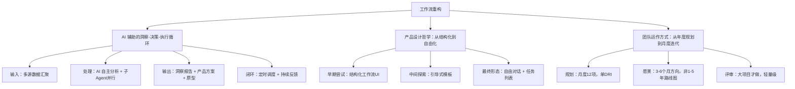

# AI 时代的产品工作流重构：从 Claude Co 的诞生看设计、协作与迭代

**一句话导读：** 当 AI 改变了"做产品"这件事本身，设计师的角色、团队的协作方式、产品的迭代节奏，都必须跟着变。

---

## 适合谁看

- 正在用 AI 工具做产品，但感觉工作流还没理顺的产品经理或设计师
- 团队在引入 AI 后，发现原来的规划、评审、交付节奏全部失效的管理者
- 想理解 Claude Co 和 Claude Code 的定位差异，以及各自适合什么场景的人
- 对"AI 时代设计团队怎么运作"有真实困惑，而不是只想看趋势报告的人
- 正在经历角色焦虑，不知道自己的专业价值往哪里放的设计从业者

---

## 读完你会获得什么

- 能分清 Claude Chat、Claude Co、Claude Code 三者的定位差异和使用场景
- 能理解"垃圾进、宝藏出"的 AI 辅助洞察工作流，并照着搭建自己的版本
- 能掌握从用户反馈到产品方案的全链路加速方法，包括并行任务、定时调度、快速原型
- 能理解"结构化 UI vs. 自由对话"的设计权衡，避免在产品设计中走弯路
- 能重新审视自己团队的规划节奏，判断是否需要从年度规划转向月度甚至周度迭代
- 能找到 AI 时代设计师的角色定位——不是被替代，而是工作重心迁移

---

## 01 背景：为什么这个问题现在值得讨论

2024 年底到 2025 年初，一个明显的拐点出现了：大量非技术人员开始用 AI 工具完成过去需要专业技能才能做的事。Anthropic 内部观察到一个现象——假期期间，原本不写代码的员工开始用 Claude Code 解析播客转录稿、做复杂分析。Claude Code 的 Agent 架构正在被非技术人群使用，但命令行界面对他们来说门槛太高。

与此同时，产品团队的工作方式也在剧变。过去一个产品规格文档可能需要精心排版、详细描述每个字段；现在，几条要点就够了。过去设计师花大量时间在 Figma 里做高保真稿；现在，AI 生成的线框图已经足够作为讨论起点。

问题不是"AI 能不能帮我们做产品"，而是"当 AI 改变了做产品的方式，我们的流程、角色、节奏该怎么跟着变"。

---

## 02 核心判断：视频真正想讲的不是 Claude Co 的功能

表面看，这段访谈在讲 Anthropic 的设计师怎么用 Claude Co 做事、Co 是怎么诞生的。但它真正在讲的是：**当 AI 把"做产品"的每个环节都加速了，产品工作的重心从"执行"转向了"判断和编排"。**

设计师不再是画图的人，而是"同时给五个项目做顾问"的人。规划不再是年度规划，而是月度甚至周度迭代。产品规格不再是详细文档，而是几条要点加一个原型。愿景不再是两年路线图，而是三到六个月的方向感。

这个判断的底层逻辑是：AI 把"从想法到可交互原型"的时间压缩了，但"判断做什么、判断什么好"这件事反而更稀缺了。

---

## 03 概念澄清：先把关键名词讲准确

### Claude Chat

- 它是什么：Anthropic 的对话式 AI 产品，类似 ChatGPT 的网页版
- 它解决什么问题：通用对话、问答、内容生成
- 它不是什么：它不是 Agent，不能自主执行多步骤任务、不能读写文件、不能调用外部工具
- 和相关概念的区别：Chat 是"你问一句我答一句"，Co 是"你给一个任务我跑完再汇报"

### Claude Code

- 它是什么：Anthropic 的命令行 AI Agent，能在终端中自主编写代码、操作文件、调用工具
- 它解决什么问题：开发者用 AI 自主完成编码任务，从写代码到提 PR 都能做
- 它不是什么：它不是给非技术人员用的，命令行界面是天然门槛
- 和相关概念的区别：Code 是"开发者工具，终端界面，完全自主"，Co 是"知识工作者工具，图形界面，人机协作"

### Claude Co

- 它是什么：Anthropic 的图形界面 AI Agent，能自主执行多步骤任务、读写文件、搜索网页、生成文档，有定时调度能力
- 它解决什么问题：让非技术人员也能用 Agent 能力——自动分析数据、生成报告、创建演示文稿、定时执行任务
- 它不是什么：它不是聊天机器人，不是简单的 Chat 加了个壳
- 和相关概念的区别：Co 有三个关键能力是 Chat 没有的——**自主执行（不需要你盯着）、文件操作（能读你电脑上的文件）、定时调度（能每周自动跑）**
- 例子：你让 Co 分析一周的用户反馈，它会自己读文件、搜网页、跑子 Agent、生成洞察报告、做成演示文稿，全程不需要你盯着

### Skills

- 它是什么：Co 中的可复用指令模板，类似于给 AI 写的"操作手册"
- 它解决什么问题：把重复性的 AI 交互固化成可复用的流程，比如"用 Anthropic 品牌风格生成幻灯片"
- 它不是什么：它不是插件，不是外部工具集成，只是一段格式化的指令
- 例子：Anthropic 内部有"文档 Skill"和"幻灯片 Skill"，让 AI 生成的文档自动带上公司品牌风格

### Dogfooding

- 它是什么：团队内部使用自己开发的产品
- 它解决什么问题：获取最快速、最诚实的反馈，尤其是交互细节方面的反馈
- 它不是什么：它不能替代外部用户反馈——内部用户关注交互细节，外部用户关注"能不能解决我的问题"
- 例子：Anthropic 内部有专门的 Slack 频道收集 Co 的使用反馈，内部员工是最早的"极端用户"

---

## 04 整体框架：这套内容应该如何理解

视频内容可以重构为一个三层递进框架：

**文字解释：**

三层框架的核心逻辑是：AI 不是一个"工具升级"，而是一个"工作方式升级"。

**第一层——工作流重构**：从"人做所有事"变成"AI 执行 + 人判断"。具体表现为一个"洞察→决策→执行"的加速循环：多源数据进来，AI 自主分析出洞察，基于洞察生成产品方案和原型，然后定时调度让这个循环持续运转。

**第二层——设计哲学迁移**：产品界面从"告诉用户怎么用"（结构化 UI、引导式模板）退回到"让用户自己决定怎么用"（自由对话 + 任务列表）。这不是偷懒，而是因为 AI 的能力边界在快速扩展，过度结构化的 UI 反而限制了可能性。

**第三层——团队运作变化**：规划从年度变成月度，愿景从两年变成三到六个月，评审从每个功能都做变成只做大项目。原因不是团队变懒了，而是技术变化太快，长期规划在快速失效。

---

## 05 关键机制：它到底是怎么运行的

### 机制一：AI 辅助的"垃圾进、宝藏出"洞察工作流

**输入**：多源原始数据——用户访谈转录稿、社交媒体反馈、产品评价、内部 Slack 频道反馈

**中间处理**：Claude Co 读取你指定的文件夹（访谈稿），同时搜索网页（社交媒体评价），可能启动子 Agent 并行处理不同数据源，最终提炼出 7 个左右的主题洞察

**输出**：一份结构化的洞察文档（.docx 格式，自动保存到你电脑的文件夹中）

**为什么这样设计**：传统方式需要研究员手动阅读所有材料、分类、提炼——可能需要几天。AI 把这个时间压缩到几分钟。但关键不是速度，而是**人不再需要做信息整理的苦活，直接从"判断洞察是否有价值"开始**

**代价**：AI 可能遗漏微妙的语气差异或文化语境；需要人复核输出质量

**适合场景**：有大量非结构化数据需要快速提炼主题的场景

**不适合场景**：需要深度定性分析、情感细微差别至关重要的研究

### 机制二：并行任务分解与定时调度

**输入**：一份洞察报告

**中间处理**：从一个洞察出发，同时派生两条并行任务——(1) 基于洞察生成产品功能方案；(2) 基于洞察生成本周团队演示文稿。两条任务独立运行，互不阻塞。完成后，可以把整个流程设为定时任务（如每周一上午 10 点自动执行）

**输出**：产品功能方案（含优先级排序）+ 团队演示文稿 + 自动化调度

**为什么这样设计**：过去从"拿到洞察"到"团队能看到方案"可能需要一周。现在压缩到一个上午。定时调度让反馈循环变成自动化的，不需要人记得"该做这件事了"

**代价**：需要前期设置好数据源和工作流模板；自动化的输出质量需要定期校准

**适合场景**：需要高频迭代、持续反馈的产品开发

**不适合场景**：低频、需要深度定制的研究项目

### 机制三：从线框图到原型的快速跳转

**输入**：产品功能描述（比如"步骤式任务进度 UI"）

**中间处理**：让 Claude 生成多个线框图方案，设计师从中选择一个方向，然后在 Figma 中细化，或在 Claude Code 中用真实设计系统组件实现可交互原型

**输出**：多个备选方案 → 一个选定方向 → 可交互原型

**为什么这样设计**：AI 擅长快速生成大量选项，但**选择哪个方向、微调到什么程度**仍然需要人的判断。这个机制把"生成选项"和"做出选择"拆开了

**代价**：AI 生成的线框图可能不符合品牌风格，需要额外 Skill 或手动调整

**适合场景**：早期探索阶段，需要快速看到多种可能性

**不适合场景**：需要像素级精确的最终交付

---

## 06 方法拆解：如果自己要做，应该怎么落地

### 步骤一：建立多源数据采集管道

**目标**：让 AI 有足够的原始材料可以分析

**具体动作**：
1. 在本地创建一个文件夹，专门存放用户反馈材料（访谈转录、问卷结果、客服记录）
2. 在 Co 中将这个文件夹挂载为上下文
3. 明确告诉 Co 还需要从哪些外部来源获取数据（社交媒体、产品评价网站）

**判断标准**：数据源至少覆盖两类（定性+定量，或内部+外部），否则洞察容易偏

**常见坑**：只依赖单一数据源；数据量太少导致 AI 无法提炼出有意义的模式

**产出物**：一个挂载了多源数据的工作空间

### 步骤二：跑一次完整的洞察提炼

**目标**：验证 AI 能否从你的数据中提炼出有价值的洞察

**具体动作**：
1. 给 Co 一个明确的指令："分析这个文件夹中的用户访谈和社交媒体反馈，提炼出本周最重要的 5-7 个主题"
2. 等待 AI 处理（可能需要几分钟，它会启动子 Agent 并行处理）
3. 检查输出：洞察是否准确？是否有遗漏？是否有过度概括？

**判断标准**：AI 输出的洞察中，至少 70% 与你手动阅读材料后的判断一致；如果低于这个比例，需要检查数据质量或调整提示词

**常见坑**：提示词太模糊（"分析一下"）导致输出太泛；数据中噪音太多导致 AI 被无关信息带偏

**产出物**：一份结构化的洞察文档

### 步骤三：从洞察派生并行任务

**目标**：把洞察转化为可行动的产品方案

**具体动作**：
1. 基于洞察报告，派生任务一："基于这些洞察，提出 3-5 个可以开发的产品功能，按优先级排序"
2. 同时派生任务二："基于这些洞察，生成一份团队演示文稿，包含关键发现和建议"
3. 两条任务并行运行，互不阻塞

**判断标准**：功能方案是否可直接进入讨论？演示文稿是否能让没看过原始数据的人理解核心发现？

**常见坑**：派生太多并行任务导致输出质量下降；功能方案太笼统，没有具体的用户场景

**产出物**：优先级排序的功能方案 + 团队演示文稿

### 步骤四：从方案到原型

**目标**：把文字方案变成可讨论的视觉形态

**具体动作**：
1. 选择一个优先级最高的功能方案
2. 让 AI 生成 2-3 个线框图方案
3. 从中选择最接近你判断的方向
4. 在 Figma 中细化，或在 Claude Code 中用真实组件实现原型

**判断标准**：原型是否足以让团队理解交互方式？是否能在 30 分钟内完成从"选方向"到"可讨论原型"？

**常见坑**：在 AI 生成的线框图上花太多时间微调（应该直接跳到 Figma 或代码）；没有给 AI 足够的品牌/设计系统上下文

**产出物**：可讨论的线框图或可交互原型

### 步骤五：设置定时调度，形成闭环

**目标**：让洞察-方案循环自动运转

**具体动作**：
1. 把步骤一到步骤三的完整流程设为定时任务（如每周一上午 10 点）
2. 配置 Slack MCP，让定时任务完成后自动发送到团队频道
3. 每周检查一次输出质量，必要时调整数据源或提示词

**判断标准**：团队是否每周一都能看到最新的洞察和方案？是否不再需要人手动做"信息整理"的苦活？

**常见坑**：设置后不检查输出质量，导致团队逐渐不再信任自动化的输出

**产出物**：自动化的周度洞察-方案循环

---

## 07 案例讲解：用一个具体场景串起来

**场景背景**：Jenny 是 Anthropic 的设计师，负责 Claude Co 的产品设计。团队每周需要从大量用户反馈中提炼洞察，并据此决定下一步做什么。

**遇到的问题**：
- 用户反馈来源分散：UXR 访谈转录、社交媒体评价、内部 Slack 频道、外部产品评论
- 每周人工整理这些材料需要 1-2 天
- 从"整理完材料"到"团队能看到方案"又要 2-3 天
- 整个循环太慢，产品迭代跟不上反馈速度

**按框架如何处理**：

**第一步——建立数据管道**：Jenny 在本地创建了一个文件夹存放所有 UXR 访谈转录稿，在 Co 中挂载这个文件夹，同时让 Co 搜索社交媒体和产品评论网站。

**第二步——跑洞察提炼**：Co 读取了所有访谈文件，搜索了网页上的用户评价，启动子 Agent 并行处理不同来源，最终输出 7 个主题洞察。原来需要 1-2 天的工作，几分钟完成。

**第三步——并行派生任务**：Jenny 同时启动两条并行任务：一条让 Co 基于洞察提出产品功能方案，另一条让 Co 生成团队演示文稿。两条任务独立运行。

**第四步——从方案到原型**：Co 给出了几个功能选项，Jenny 选了"步骤式任务进度 UI"，让 Co 生成多个线框图方案，然后选择一个方向，带到 Figma 或 Claude Code 中进一步细化。

**第五步——设置定时调度**：Jenny 把整个流程设为每周一上午 10 点自动执行，通过 Slack MCP 自动发送到团队频道。每周一早上，她和团队都能看到最新的洞察和方案。

**最终结果**：从"用户反馈"到"团队可讨论的方案"，整个循环从一周压缩到一天。而且这个循环是自动化的，不需要人记得"该做这件事了"。

**说明了什么**：AI 的价值不在于替代人做判断，而在于把"信息整理"和"格式转换"这两件最耗时的苦活自动化了，让人直接从"判断"开始工作。

---

## 08 常见误区

**误区一：Claude Co 就是 Chat 加了个壳**

- 错误理解：Co 就是 Chat 的界面改版，功能差不多
- 为什么错：Co 有三个 Chat 没有的核心能力——自主执行（不需要你盯着）、文件操作（能读你电脑上的文件）、定时调度（能每周自动跑）。它更像一个"AI 助理"而不是"聊天机器人"
- 正确理解：Co 是 Agent，Chat 是对话工具。区别在于 Agent 能自主完成多步骤任务
- 应该怎么做：需要 AI 自主完成一件事（而不是你一句我一句）的场景，用 Co；只需要快速问答的场景，用 Chat

**误区二：Claude Code 只能写代码**

- 错误理解：Code 是给程序员写代码的，非技术人员用不上
- 为什么错：Anthropic 内部的销售人员已经在用 Code 生成客户名单、准备通话话术。Code 的底层是 Agent 能力，"写代码"只是它最常见的一个应用
- 正确理解：Code 是命令行界面的 Agent，能做任何可以用命令行完成的事
- 应该怎么做：如果你能接受命令行界面，Code 的灵活性远超 Co；如果你需要图形界面，用 Co

**误区三：AI 生成的方案直接就能用**

- 错误理解：AI 生成的线框图、功能方案、演示文稿可以直接交付
- 为什么错：Jenny 明确说了，AI 生成的是"选项"和"起点"，不是最终交付物。选择方向、微调细节、确保品牌一致性，这些仍然需要人
- 正确理解：AI 的输出是"第一稿"，不是"终稿"。人的价值在于判断和选择
- 应该怎么做：让 AI 先出第一稿，你从判断开始，而不是从空白页开始

**误区四：产品界面应该引导用户怎么用**

- 错误理解：AI 产品应该有明确的引导流程，告诉用户"先做这个、再做那个"
- 为什么错：Anthropic 的 Co 团队试过了——结构化工作流 UI、引导式模板、预置选项——全都失败了。原因是 AI 的能力边界在快速扩展，过度结构化的 UI 反而限制了用户能做的事
- 正确理解：AI 产品的界面应该"退后"，让用户自己决定怎么用，而不是替用户决定
- 应该怎么做：提供自由对话作为主交互方式，把命令和 Skills 作为进阶功能，不作为主入口

**误区五：内部测试不能替代外部用户反馈**

- 错误理解：只有外部用户反馈才是真实反馈，内部测试只是自嗨
- 为什么错：Jenny 指出，内部用户和外部用户给出的是"不同海拔的反馈"——内部用户关注交互细节和边界情况，外部用户关注"能不能解决我的问题"。两者互补，不是替代关系
- 正确理解：内部反馈和外部反馈是两种不同类型的信号，都需要
- 应该怎么做：内部用户做快速迭代验证，外部用户做价值验证，两者缺一不可

**误区六：AI 时代设计师会被淘汰**

- 错误理解：AI 能生成线框图、做原型、写方案，设计师没用了
- 为什么错：Jenny 的工作方式证明了相反的情况——她现在同时参与 5 个项目，以前只能专注 1 个。AI 让她从"执行"中解放出来，把时间花在"判断"和"编排"上
- 正确理解：设计师的工作重心从"做东西"转向"判断做什么、选择哪个方向、确保体验一致性"
- 应该怎么做：主动把重复性执行工作交给 AI，把省下来的时间投入到更高层的判断和跨项目协调上

**误区七：Co 是 10 天做出来的**

- 错误理解：Anthropic 用 10 天就从零做出了 Co
- 为什么错：10 天是"决定上线到正式发布"的时间。Co 的方向 Anthropic 从一年前就在探索，期间经历了多个原型、多次技术实验、几个失败方案。10 天只是最后的冲刺
- 正确理解：10 天冲刺的前提是一年的探索积累。没有前面的试错，不可能有后面的快速交付
- 应该怎么做：不要被"10 天做出产品"的故事误导。真正的准备时间远比你看到的长

**误区八：AI 时代我们会有更多自由时间**

- 错误理解：AI 帮我们做了很多事，我们就能更轻松
- 为什么错：Jenny 说了大实话——"你不会得到更多自由时间，你会更努力地工作"。因为当你发现能做的事变多了，你的野心也会跟着膨胀
- 正确理解：AI 不是让你少做事，而是让你做更多有价值的事
- 应该怎么做：接受这个现实，然后问自己：我想用省下来的时间做什么更重要的事？

---

## 09 实战清单：读完后可以马上照着做

### 立即能做

1. **把你的用户反馈材料放进一个文件夹**——不管是访谈记录、客服工单还是用户评论，统一归到一个目录，这是 AI 分析的前提
2. **用 Co 或 Chat 跑一次洞察提炼**——给你的 AI 工具一个明确指令："分析这些材料，提炼出最重要的 5 个主题"，看看输出质量如何
3. **试一次并行任务派生**——从一次洞察出发，同时让 AI 做两件事：生成功能方案 + 生成汇报材料，体验并行执行的效率
4. **让 AI 给你生成线框图选项**——选一个你正在做的功能，让 AI 生成 3 个不同的交互方案，从中选一个方向，而不是从空白页开始

### 一周内能做

5. **设置一个定时洞察任务**——把你的"数据采集+洞察提炼"流程设为每周自动执行，输出到指定文件夹或 Slack 频道
6. **重新审视你的产品规格文档格式**——如果还在写详细的功能规格文档，试试缩减成几条要点+一个原型，看团队是否仍然能对齐
7. **检查你的团队是否在 dogfooding**——如果团队内部没有在使用自己做的产品，从本周开始建立一个内部反馈频道
8. **用 AI 准备一次你原本要手动做的汇报**——把原始材料丢给 AI，让它生成第一稿，你从编辑和判断开始

### 长期要沉淀

9. **建立你的"个人知识文件夹"**——像 Jenny 一样，把一一面记录、想法、笔记持续积累在一个文件夹中，让 AI 从这个文件夹中学习你的思维模式
10. **培养从"执行者"到"编排者"的角色转换**——定期问自己：这件事的哪部分可以让 AI 先出第一稿？我只需要在哪里做判断？
11. **每季度重新评估你的规划节奏**——如果你还在做年度规划，考虑是否应该缩短到季度甚至月度；如果你还在写两年愿景，考虑是否应该缩短到六个月
12. **建立团队的 Skills 库**——把团队中反复使用的 AI 指令模板化，比如品牌风格的文档生成、特定格式的汇报模板，形成可复用的资产

---

## 10 总结

AI 改变产品工作的方式，不是"更快地做同样的事"，而是"做不同的事"。过去设计师花 80% 的时间在执行——画图、排版、写文档、整理反馈。现在这些执行工作大部分可以交给 AI，设计师的 80% 应该花在判断上——判断做什么、判断哪个方向对、判断体验一致性。

Claude Co 的诞生过程本身就是一个例证。一年的探索、多个失败原型、最终 10 天冲刺上线——这个节奏不是偶然的。当技术变化的速度快于规划的速度，团队必须从"规划驱动"转向"反馈驱动"。规划的价值从"确定路线"变成了"指明方向"，愿景从"两年路线图"变成了"三到六个月的方向感"。

产品设计也在经历同样的退让。Co 的 UI 从结构化工作流退回到自由对话，从"告诉用户怎么用"退回到"让用户自己决定"。这不是偷懒，是因为 AI 的能力边界在快速扩展，任何过度结构化的界面都会很快过时。

最后，Jenny 说了一句大实话：如果你觉得脚下的地在晃，那是因为它确实在晃。但看看你的工程师同事——他们的工作变化比你还大，他们不仅活下来了，还产出了比以前更多更好的东西。设计师也可以。关键不是守住旧的工作方式，而是接受变化，然后找到新的价值锚点。
